# Intention 

The goal of this document is to calculate the growth rate (r) and the carrying capacity (K) of 6 species of ciliates 
that we grew individually in a replicated (n = 3) factorial experiment with 5 temperatures (18, 21, 24, 26, and 28), 5 nutrients levels and their combinations (= 25 treatments) for 3 weeks. 
The calculated r and K are then going to be used as the traits to calculate potential response diversity of communities composed of 2, 3, and 4 species to all possible changes in temperature and nutrients. The calculated potential response diversity will inform us on which communities will be used in the following experimental step.
We are going to calculate the growth rate as the slope of the regression of ln(Nt) where: ln is natural log10 and Nt is the population density at time t, during the period of exponential growth. 
We are going to set initially the period of exponential growth as the first 6 days, but we are going to visually check whether this choice is correct. 
K will be calculated as the highest population biomass for each population during the experiment.


Let's start loading the data set and creating a subset for calculating r

```
## [1] "species"     "file"        "temperature" "nutrients"   "sample_ID"  
## [6] "date"        "density"     "day"
```

```
## 'data.frame':	119028 obs. of  6 variables:
##  $ species    : chr  "Colpidium" "Colpidium" "Colpidium" "Colpidium" ...
##  $ temperature: int  18 18 18 18 18 18 18 18 18 18 ...
##  $ nutrients  : int  4 2 5 1 4 5 3 2 5 1 ...
##  $ sample_ID  : chr  "C10" "C6" "C15" "C2" ...
##  $ density    : num  119 164 186 136 282 ...
##  $ day        : int  1 1 1 1 1 1 1 1 1 1 ...
```


```
##         species temperature nutrients sample_ID density day
## 1     Colpidium          18         4       C10     100   0
## 2     Colpidium          18         4       C10     100   0
## 3     Colpidium          18         4       C10     100   0
## 4     Colpidium          18         4       C10     100   0
## 5     Colpidium          18         4       C10     100   0
## 6     Colpidium          18         4       C10     100   0
## 7     Colpidium          18         4       C10     100   0
## 8     Colpidium          18         4       C10     100   0
## 9     Colpidium          18         4       C10     100   0
## 10    Colpidium          18         4       C10     100   0
## 11    Colpidium          18         4       C10     100   0
## 12    Colpidium          18         4       C10     100   0
## 13    Colpidium          18         4       C10     100   0
## 14    Colpidium          18         4       C10     100   0
## 15    Colpidium          18         4       C10     100   0
## 16    Colpidium          18         4       C10     100   0
## 17    Colpidium          18         4       C10     100   0
## 18    Colpidium          18         4       C10     100   0
## 19    Colpidium          18         4       C10     100   0
## 20    Colpidium          18         4       C10     100   0
## 21    Colpidium          18         4       C10     100   0
## 22    Colpidium          18         4       C10     100   0
## 23    Colpidium          18         4       C10     100   0
## 24    Colpidium          18         4       C10     100   0
## 25    Colpidium          18         4       C10     100   0
## 26    Colpidium          18         4       C10     100   0
## 27    Colpidium          18         4       C10     100   0
## 28    Colpidium          18         4       C10     100   0
## 29    Colpidium          18         4       C10     100   0
## 30    Colpidium          18         4       C10     100   0
## 31    Colpidium          18         4       C10     100   0
## 32    Colpidium          18         4       C10     100   0
## 33    Colpidium          18         4       C10     100   0
## 34    Colpidium          18         4       C10     100   0
## 35    Colpidium          18         4       C10     100   0
## 36    Colpidium          18         4       C10     100   0
## 37    Colpidium          18         4       C10     100   0
## 38    Colpidium          18         4       C10     100   0
## 39    Colpidium          18         4       C10     100   0
## 40    Colpidium          18         4       C10     100   0
## 41    Colpidium          18         4       C10     100   0
## 42    Colpidium          18         4       C10     100   0
## 43    Colpidium          18         4       C10     100   0
## 44    Colpidium          18         4       C10     100   0
## 45    Colpidium          18         4       C10     100   0
## 46    Colpidium          18         4       C10     100   0
## 47    Colpidium          18         4       C10     100   0
## 48    Colpidium          18         4       C10     100   0
## 49    Colpidium          18         4       C10     100   0
## 50    Colpidium          18         4       C10     100   0
## 51    Colpidium          18         4       C10     100   0
## 52    Colpidium          18         4       C10     100   0
## 53    Colpidium          18         4       C10     100   0
## 54    Colpidium          18         4       C10     100   0
## 55    Colpidium          18         4       C10     100   0
## 56    Colpidium          18         4       C10     100   0
## 57    Colpidium          18         4       C10     100   0
## 58    Colpidium          18         4       C10     100   0
## 59    Colpidium          18         4       C10     100   0
## 60    Colpidium          18         4       C10     100   0
## 61    Colpidium          18         4       C10     100   0
## 62    Colpidium          18         4       C10     100   0
## 63    Colpidium          18         4       C10     100   0
## 64    Colpidium          18         4       C10     100   0
## 65    Colpidium          18         4       C10     100   0
## 66    Colpidium          18         4       C10     100   0
## 67    Colpidium          18         4       C10     100   0
## 68    Colpidium          18         4       C10     100   0
## 69    Colpidium          18         4       C10     100   0
## 70    Colpidium          18         4       C10     100   0
## 71    Colpidium          18         4       C10     100   0
## 72    Colpidium          18         4       C10     100   0
## 73    Colpidium          18         4       C10     100   0
## 74    Colpidium          18         4       C10     100   0
## 75    Colpidium          18         4       C10     100   0
## 76    Colpidium          18         4       C10     100   0
## 77    Colpidium          18         4       C10     100   0
## 78    Colpidium          18         4       C10     100   0
## 79    Colpidium          18         4       C10     100   0
## 80    Colpidium          18         4       C10     100   0
## 81    Colpidium          18         4       C10     100   0
## 82    Colpidium          18         4       C10     100   0
## 83    Colpidium          18         4       C10     100   0
## 84    Colpidium          18         4       C10     100   0
## 85    Colpidium          18         4       C10     100   0
## 86    Colpidium          18         4       C10     100   0
## 87    Colpidium          18         4       C10     100   0
## 88    Colpidium          18         4       C10     100   0
## 89    Colpidium          18         4       C10     100   0
## 90    Colpidium          18         4       C10     100   0
## 91    Colpidium          18         4       C10     100   0
## 92    Colpidium          18         4       C10     100   0
## 93    Colpidium          18         4       C10     100   0
## 94    Colpidium          18         4       C10     100   0
## 95    Colpidium          18         4       C10     100   0
## 96    Colpidium          18         4       C10     100   0
## 97    Colpidium          18         4       C10     100   0
## 98    Colpidium          18         4       C10     100   0
## 99    Colpidium          18         4       C10     100   0
## 100   Colpidium          18         4       C10     100   0
## 101   Colpidium          18         4       C10     100   0
## 102   Colpidium          18         4       C10     100   0
## 103   Colpidium          18         4       C10     100   0
## 104   Colpidium          18         4       C10     100   0
## 105   Colpidium          18         4       C10     100   0
## 106   Colpidium          18         4       C10     100   0
## 107   Colpidium          18         4       C10     100   0
## 108   Colpidium          18         4       C10     100   0
## 109   Colpidium          18         4       C10     100   0
## 110   Colpidium          18         4       C10     100   0
## 111   Colpidium          18         4       C10     100   0
## 112   Colpidium          18         4       C10     100   0
## 113   Colpidium          18         4       C10     100   0
## 114   Colpidium          18         4       C10     100   0
## 115   Colpidium          18         4       C10     100   0
## 116   Colpidium          18         4       C10     100   0
## 117   Colpidium          18         4       C10     100   0
## 118   Colpidium          18         4       C10     100   0
## 119   Colpidium          18         4       C10     100   0
## 120   Colpidium          18         4       C10     100   0
## 121   Colpidium          18         4       C10     100   0
## 122   Colpidium          18         4       C10     100   0
## 123   Colpidium          18         4       C10     100   0
## 124   Colpidium          18         4       C10     100   0
## 125   Colpidium          18         4       C10     100   0
## 126   Colpidium          18         4       C10     100   0
## 127   Colpidium          18         4       C10     100   0
## 128   Colpidium          18         4       C10     100   0
## 129   Colpidium          18         4       C10     100   0
## 130   Colpidium          18         4       C10     100   0
## 131   Colpidium          18         4       C10     100   0
## 132   Colpidium          18         4       C10     100   0
## 133   Colpidium          18         4       C10     100   0
## 134   Colpidium          18         4       C10     100   0
## 135   Colpidium          18         4       C10     100   0
## 136   Colpidium          18         4       C10     100   0
## 137   Colpidium          18         4       C10     100   0
## 138   Colpidium          18         4       C10     100   0
## 139   Colpidium          18         4       C10     100   0
## 140   Colpidium          18         4       C10     100   0
## 141   Colpidium          18         4       C10     100   0
## 142   Colpidium          18         4       C10     100   0
## 143   Colpidium          18         4       C10     100   0
## 144   Colpidium          18         4       C10     100   0
## 145   Colpidium          18         4       C10     100   0
## 146   Colpidium          18         4       C10     100   0
## 147   Colpidium          18         4       C10     100   0
## 148   Colpidium          18         4       C10     100   0
## 149   Colpidium          18         4       C10     100   0
## 150   Colpidium          18         4       C10     100   0
## 151   Colpidium          18         4       C10     100   0
## 152   Colpidium          18         4       C10     100   0
## 153   Colpidium          18         4       C10     100   0
## 154   Colpidium          18         4       C10     100   0
## 155   Colpidium          18         4       C10     100   0
## 156   Colpidium          18         4       C10     100   0
## 157   Colpidium          18         4       C10     100   0
## 158   Colpidium          18         4       C10     100   0
## 159   Colpidium          18         4       C10     100   0
## 160   Colpidium          18         4       C10     100   0
## 161   Colpidium          18         4       C10     100   0
## 162   Colpidium          18         4       C10     100   0
## 163   Colpidium          18         4       C10     100   0
## 164   Colpidium          18         4       C10     100   0
## 165   Colpidium          18         4       C10     100   0
## 166   Colpidium          18         4       C10     100   0
## 167   Colpidium          18         4       C10     100   0
## 168   Colpidium          18         4       C10     100   0
## 169   Colpidium          18         4       C10     100   0
## 170   Colpidium          18         4       C10     100   0
## 171   Colpidium          18         4       C10     100   0
## 172   Colpidium          18         4       C10     100   0
## 173   Colpidium          18         4       C10     100   0
## 174   Colpidium          18         4       C10     100   0
## 175   Colpidium          18         4       C10     100   0
## 176   Colpidium          18         4       C10     100   0
## 177   Colpidium          18         4       C10     100   0
## 178   Colpidium          18         4       C10     100   0
## 179   Colpidium          18         4       C10     100   0
## 180   Colpidium          18         4       C10     100   0
## 181   Colpidium          18         4       C10     100   0
## 182   Colpidium          18         4       C10     100   0
## 183   Colpidium          18         4       C10     100   0
## 184   Colpidium          18         4       C10     100   0
## 185   Colpidium          18         4       C10     100   0
## 186   Colpidium          18         4       C10     100   0
## 187   Colpidium          18         4       C10     100   0
## 188   Colpidium          18         4       C10     100   0
## 189   Colpidium          18         4       C10     100   0
## 190   Colpidium          18         4       C10     100   0
## 191   Colpidium          18         4       C10     100   0
## 192   Colpidium          18         4       C10     100   0
## 193   Colpidium          18         4       C10     100   0
## 194   Colpidium          18         4       C10     100   0
## 195   Colpidium          18         4       C10     100   0
## 196   Colpidium          18         4       C10     100   0
## 197   Colpidium          18         4       C10     100   0
## 198   Colpidium          18         4       C10     100   0
## 199   Colpidium          18         4       C10     100   0
## 200   Colpidium          18         4       C10     100   0
## 201   Colpidium          18         4       C10     100   0
## 202   Colpidium          18         4       C10     100   0
## 203   Colpidium          18         4       C10     100   0
## 204   Colpidium          18         4       C10     100   0
## 205   Colpidium          18         4       C10     100   0
## 206   Colpidium          18         4       C10     100   0
## 207   Colpidium          18         4       C10     100   0
## 208   Colpidium          18         4       C10     100   0
## 209   Colpidium          18         4       C10     100   0
## 210   Colpidium          18         4       C10     100   0
## 211   Colpidium          18         4       C10     100   0
## 212   Colpidium          18         4       C10     100   0
## 213   Colpidium          18         4       C10     100   0
## 214   Colpidium          18         4       C10     100   0
## 215   Colpidium          18         4       C10     100   0
## 216   Colpidium          18         4       C10     100   0
## 217   Colpidium          18         4       C10     100   0
## 218   Colpidium          18         4       C10     100   0
## 219   Colpidium          18         4       C10     100   0
## 220   Colpidium          18         4       C10     100   0
## 221   Colpidium          18         4       C10     100   0
## 222   Colpidium          18         4       C10     100   0
## 223   Colpidium          18         4       C10     100   0
## 224   Colpidium          18         4       C10     100   0
## 225   Colpidium          18         4       C10     100   0
## 226   Colpidium          18         4       C10     100   0
## 227   Colpidium          18         4       C10     100   0
## 228   Colpidium          18         4       C10     100   0
## 229   Colpidium          18         4       C10     100   0
## 230   Colpidium          18         4       C10     100   0
## 231   Colpidium          18         4       C10     100   0
## 232   Colpidium          18         4       C10     100   0
## 233   Colpidium          18         4       C10     100   0
## 234   Colpidium          18         4       C10     100   0
## 235   Colpidium          18         4       C10     100   0
## 236   Colpidium          18         4       C10     100   0
## 237   Colpidium          18         4       C10     100   0
## 238   Colpidium          18         4       C10     100   0
## 239   Colpidium          18         4       C10     100   0
## 240   Colpidium          18         4       C10     100   0
## 241   Colpidium          18         4       C10     100   0
## 242   Colpidium          18         4       C10     100   0
## 243   Colpidium          18         4       C10     100   0
## 244   Colpidium          18         4       C10     100   0
## 245   Colpidium          18         4       C10     100   0
## 246   Colpidium          18         4       C10     100   0
## 247   Colpidium          18         4       C10     100   0
## 248   Colpidium          18         4       C10     100   0
## 249   Colpidium          18         4       C10     100   0
## 250   Colpidium          18         4       C10     100   0
## 251   Colpidium          18         4       C10     100   0
## 252   Colpidium          18         4       C10     100   0
## 253   Colpidium          18         4       C10     100   0
## 254   Colpidium          18         4       C10     100   0
## 255   Colpidium          18         4       C10     100   0
## 256   Colpidium          18         4       C10     100   0
## 257   Colpidium          18         4       C10     100   0
## 258   Colpidium          18         4       C10     100   0
## 259   Colpidium          18         4       C10     100   0
## 260   Colpidium          18         4       C10     100   0
## 261   Colpidium          18         4       C10     100   0
## 262   Colpidium          18         4       C10     100   0
## 263   Colpidium          18         4       C10     100   0
## 264   Colpidium          18         4       C10     100   0
## 265   Colpidium          18         4       C10     100   0
## 266   Colpidium          18         4       C10     100   0
## 267   Colpidium          18         4       C10     100   0
## 268   Colpidium          18         4       C10     100   0
## 269   Colpidium          18         4       C10     100   0
## 270   Colpidium          18         4       C10     100   0
## 271   Colpidium          18         4       C10     100   0
## 272   Colpidium          18         4       C10     100   0
## 273   Colpidium          18         4       C10     100   0
## 274   Colpidium          18         4       C10     100   0
## 275   Colpidium          18         4       C10     100   0
## 276   Colpidium          18         4       C10     100   0
## 277   Colpidium          18         4       C10     100   0
## 278   Colpidium          18         4       C10     100   0
## 279   Colpidium          18         4       C10     100   0
## 280   Colpidium          18         4       C10     100   0
## 281   Colpidium          18         4       C10     100   0
## 282   Colpidium          18         4       C10     100   0
## 283   Colpidium          18         4       C10     100   0
## 284   Colpidium          18         4       C10     100   0
## 285   Colpidium          18         4       C10     100   0
## 286   Colpidium          18         4       C10     100   0
## 287   Colpidium          18         4       C10     100   0
## 288   Colpidium          18         4       C10     100   0
## 289   Colpidium          18         4       C10     100   0
## 290   Colpidium          18         4       C10     100   0
## 291   Colpidium          18         4       C10     100   0
## 292   Colpidium          18         4       C10     100   0
## 293   Colpidium          18         4       C10     100   0
## 294   Colpidium          18         4       C10     100   0
## 295   Colpidium          18         4       C10     100   0
## 296   Colpidium          18         4       C10     100   0
## 297   Colpidium          18         4       C10     100   0
## 298   Colpidium          18         4       C10     100   0
## 299   Colpidium          18         4       C10     100   0
## 300   Colpidium          18         4       C10     100   0
## 301   Colpidium          18         4       C10     100   0
## 302   Colpidium          18         4       C10     100   0
## 303   Colpidium          18         4       C10     100   0
## 304   Colpidium          18         4       C10     100   0
## 305   Colpidium          18         4       C10     100   0
## 306   Colpidium          18         4       C10     100   0
## 307   Colpidium          18         4       C10     100   0
## 308   Colpidium          18         4       C10     100   0
## 309   Colpidium          18         4       C10     100   0
## 310   Colpidium          18         4       C10     100   0
## 311   Colpidium          18         4       C10     100   0
## 312   Colpidium          18         4       C10     100   0
## 313   Colpidium          18         4       C10     100   0
## 314   Colpidium          18         4       C10     100   0
## 315   Colpidium          18         4       C10     100   0
## 316   Colpidium          18         4       C10     100   0
## 317   Colpidium          18         4       C10     100   0
## 318   Colpidium          18         4       C10     100   0
## 319   Colpidium          18         4       C10     100   0
## 320   Colpidium          18         4       C10     100   0
## 321   Colpidium          18         4       C10     100   0
## 322   Colpidium          18         4       C10     100   0
## 323   Colpidium          18         4       C10     100   0
## 324   Colpidium          18         4       C10     100   0
## 325   Colpidium          18         4       C10     100   0
## 326   Colpidium          18         4       C10     100   0
## 327   Colpidium          18         4       C10     100   0
## 328   Colpidium          18         4       C10     100   0
## 329   Colpidium          18         4       C10     100   0
## 330   Colpidium          18         4       C10     100   0
## 331   Colpidium          18         4       C10     100   0
## 332   Colpidium          18         4       C10     100   0
## 333   Colpidium          18         4       C10     100   0
## 334   Colpidium          18         4       C10     100   0
## 335   Colpidium          18         4       C10     100   0
## 336   Colpidium          18         4       C10     100   0
## 337   Colpidium          18         4       C10     100   0
## 338   Colpidium          18         4       C10     100   0
## 339   Colpidium          18         4       C10     100   0
## 340   Colpidium          18         4       C10     100   0
## 341   Colpidium          18         4       C10     100   0
## 342   Colpidium          18         4       C10     100   0
## 343   Colpidium          18         4       C10     100   0
## 344   Colpidium          18         4       C10     100   0
## 345   Colpidium          18         4       C10     100   0
## 346   Colpidium          18         4       C10     100   0
## 347   Colpidium          18         4       C10     100   0
## 348   Colpidium          18         4       C10     100   0
## 349   Colpidium          18         4       C10     100   0
## 350   Colpidium          18         4       C10     100   0
## 351   Colpidium          18         4       C10     100   0
## 352   Colpidium          18         4       C10     100   0
## 353   Colpidium          18         4       C10     100   0
## 354   Colpidium          18         4       C10     100   0
## 355   Colpidium          18         4       C10     100   0
## 356   Colpidium          18         4       C10     100   0
## 357   Colpidium          18         4       C10     100   0
## 358   Colpidium          18         4       C10     100   0
## 359   Colpidium          18         4       C10     100   0
## 360   Colpidium          18         4       C10     100   0
## 361   Colpidium          18         4       C10     100   0
## 362   Colpidium          18         4       C10     100   0
## 363   Colpidium          18         4       C10     100   0
## 364   Colpidium          18         4       C10     100   0
## 365   Colpidium          18         4       C10     100   0
## 366   Colpidium          18         4       C10     100   0
## 367   Colpidium          18         4       C10     100   0
## 368   Colpidium          18         4       C10     100   0
## 369   Colpidium          18         4       C10     100   0
## 370   Colpidium          18         4       C10     100   0
## 371   Colpidium          18         4       C10     100   0
## 372   Colpidium          18         4       C10     100   0
## 373   Colpidium          18         4       C10     100   0
## 374   Colpidium          18         4       C10     100   0
## 375   Colpidium          18         4       C10     100   0
## 376   Colpidium          18         4       C10     100   0
## 377   Colpidium          18         4       C10     100   0
## 378   Colpidium          18         4       C10     100   0
## 379   Colpidium          18         4       C10     100   0
## 380   Colpidium          18         4       C10     100   0
## 381   Colpidium          18         4       C10     100   0
## 382   Colpidium          18         4       C10     100   0
## 383   Colpidium          18         4       C10     100   0
## 384   Colpidium          18         4       C10     100   0
## 385   Colpidium          18         4       C10     100   0
## 386   Colpidium          18         4       C10     100   0
## 387   Colpidium          18         4       C10     100   0
## 388   Colpidium          18         4       C10     100   0
## 389   Colpidium          18         4       C10     100   0
## 390   Colpidium          18         4       C10     100   0
## 391   Colpidium          18         4       C10     100   0
## 392   Colpidium          18         4       C10     100   0
## 393   Colpidium          18         4       C10     100   0
## 394   Colpidium          18         4       C10     100   0
## 395   Colpidium          18         4       C10     100   0
## 396   Colpidium          18         4       C10     100   0
## 397   Colpidium          18         4       C10     100   0
## 398   Colpidium          18         4       C10     100   0
## 399   Colpidium          18         4       C10     100   0
## 400   Colpidium          18         4       C10     100   0
## 401   Colpidium          18         4       C10     100   0
## 402   Colpidium          18         4       C10     100   0
## 403   Colpidium          18         4       C10     100   0
## 404   Colpidium          18         4       C10     100   0
## 405   Colpidium          18         4       C10     100   0
## 406   Colpidium          18         4       C10     100   0
## 407   Colpidium          18         4       C10     100   0
## 408   Colpidium          18         4       C10     100   0
## 409   Colpidium          18         4       C10     100   0
## 410   Colpidium          18         4       C10     100   0
## 411   Colpidium          18         4       C10     100   0
## 412   Colpidium          18         4       C10     100   0
## 413   Colpidium          18         4       C10     100   0
## 414   Colpidium          18         4       C10     100   0
## 415   Colpidium          18         4       C10     100   0
## 416   Colpidium          18         4       C10     100   0
## 417   Colpidium          18         4       C10     100   0
## 418   Colpidium          18         4       C10     100   0
## 419   Colpidium          18         4       C10     100   0
## 420   Colpidium          18         4       C10     100   0
## 421   Colpidium          18         4       C10     100   0
## 422   Colpidium          18         4       C10     100   0
## 423   Colpidium          18         4       C10     100   0
## 424   Colpidium          18         4       C10     100   0
## 425   Colpidium          18         4       C10     100   0
## 426   Colpidium          18         4       C10     100   0
## 427   Colpidium          18         4       C10     100   0
## 428   Colpidium          18         4       C10     100   0
## 429   Colpidium          18         4       C10     100   0
## 430   Colpidium          18         4       C10     100   0
## 431   Colpidium          18         4       C10     100   0
## 432   Colpidium          18         4       C10     100   0
## 433   Colpidium          18         4       C10     100   0
## 434   Colpidium          18         4       C10     100   0
## 435   Colpidium          18         4       C10     100   0
## 436   Colpidium          18         4       C10     100   0
## 437   Colpidium          18         4       C10     100   0
## 438   Colpidium          18         4       C10     100   0
## 439   Colpidium          18         4       C10     100   0
## 440   Colpidium          18         4       C10     100   0
## 441   Colpidium          18         4       C10     100   0
## 442   Colpidium          18         4       C10     100   0
## 443   Colpidium          18         4       C10     100   0
## 444   Colpidium          18         4       C10     100   0
## 445   Colpidium          18         4       C10     100   0
## 446   Colpidium          18         4       C10     100   0
## 447   Colpidium          18         4       C10     100   0
## 448   Colpidium          18         4       C10     100   0
## 449   Colpidium          18         4       C10     100   0
## 450   Colpidium          18         4       C10     100   0
## 451   Colpidium          18         4       C10     100   0
## 452   Colpidium          18         4       C10     100   0
## 453   Colpidium          18         4       C10     100   0
## 454   Colpidium          18         4       C10     100   0
## 455   Colpidium          18         4       C10     100   0
## 456   Colpidium          18         4       C10     100   0
## 457   Colpidium          18         4       C10     100   0
## 458   Colpidium          18         4       C10     100   0
## 459   Colpidium          18         4       C10     100   0
## 460   Colpidium          18         4       C10     100   0
## 461   Colpidium          18         4       C10     100   0
## 462   Colpidium          18         4       C10     100   0
## 463   Colpidium          18         4       C10     100   0
## 464   Colpidium          18         4       C10     100   0
## 465   Colpidium          18         4       C10     100   0
## 466   Colpidium          18         4       C10     100   0
## 467   Colpidium          18         4       C10     100   0
## 468   Colpidium          18         4       C10     100   0
## 469   Colpidium          18         4       C10     100   0
## 470   Colpidium          18         4       C10     100   0
## 471   Colpidium          18         4       C10     100   0
## 472   Colpidium          18         4       C10     100   0
## 473   Colpidium          18         4       C10     100   0
## 474   Colpidium          18         4       C10     100   0
## 475   Colpidium          18         4       C10     100   0
## 476   Colpidium          18         4       C10     100   0
## 477   Colpidium          18         4       C10     100   0
## 478   Colpidium          18         4       C10     100   0
## 479   Colpidium          18         4       C10     100   0
## 480   Colpidium          18         4       C10     100   0
## 481   Colpidium          18         4       C10     100   0
## 482   Colpidium          18         4       C10     100   0
## 483   Colpidium          18         4       C10     100   0
## 484   Colpidium          18         4       C10     100   0
## 485   Colpidium          18         4       C10     100   0
## 486   Colpidium          18         4       C10     100   0
## 487   Colpidium          18         4       C10     100   0
## 488   Colpidium          18         4       C10     100   0
## 489   Colpidium          18         4       C10     100   0
## 490   Colpidium          18         4       C10     100   0
## 491   Colpidium          18         4       C10     100   0
## 492   Colpidium          18         4       C10     100   0
## 493   Colpidium          18         4       C10     100   0
## 494   Colpidium          18         4       C10     100   0
## 495   Colpidium          18         4       C10     100   0
## 496   Colpidium          18         4       C10     100   0
## 497   Colpidium          18         4       C10     100   0
## 498   Colpidium          18         4       C10     100   0
## 499   Colpidium          18         4       C10     100   0
## 500   Colpidium          18         4       C10     100   0
## 501   Colpidium          18         4       C10     100   0
## 502   Colpidium          18         4       C10     100   0
## 503   Colpidium          18         4       C10     100   0
## 504   Colpidium          18         4       C10     100   0
## 505   Colpidium          18         4       C10     100   0
## 506   Colpidium          18         4       C10     100   0
## 507   Colpidium          18         4       C10     100   0
## 508   Colpidium          18         4       C10     100   0
## 509   Colpidium          18         4       C10     100   0
## 510   Colpidium          18         4       C10     100   0
## 511   Colpidium          18         4       C10     100   0
## 512   Colpidium          18         4       C10     100   0
## 513   Colpidium          18         4       C10     100   0
## 514   Colpidium          18         4       C10     100   0
## 515   Colpidium          18         4       C10     100   0
## 516   Colpidium          18         4       C10     100   0
## 517   Colpidium          18         4       C10     100   0
## 518   Colpidium          18         4       C10     100   0
## 519   Colpidium          18         4       C10     100   0
## 520   Colpidium          18         4       C10     100   0
## 521   Colpidium          18         4       C10     100   0
## 522   Colpidium          18         4       C10     100   0
## 523   Colpidium          18         4       C10     100   0
## 524   Colpidium          18         4       C10     100   0
## 525   Colpidium          18         4       C10     100   0
## 526   Colpidium          18         4       C10     100   0
## 527   Colpidium          18         4       C10     100   0
## 528   Colpidium          18         4       C10     100   0
## 529   Colpidium          18         4       C10     100   0
## 530   Colpidium          18         4       C10     100   0
## 531   Colpidium          18         4       C10     100   0
## 532   Colpidium          18         4       C10     100   0
## 533   Colpidium          18         4       C10     100   0
## 534   Colpidium          18         4       C10     100   0
## 535   Colpidium          18         4       C10     100   0
## 536   Colpidium          18         4       C10     100   0
## 537   Colpidium          18         4       C10     100   0
## 538   Colpidium          18         4       C10     100   0
## 539   Colpidium          18         4       C10     100   0
## 540   Colpidium          18         4       C10     100   0
## 541   Colpidium          18         4       C10     100   0
## 542   Colpidium          18         4       C10     100   0
## 543   Colpidium          18         4       C10     100   0
## 544   Colpidium          18         4       C10     100   0
## 545   Colpidium          18         4       C10     100   0
## 546   Colpidium          18         4       C10     100   0
## 547   Colpidium          18         4       C10     100   0
## 548   Colpidium          18         4       C10     100   0
## 549   Colpidium          18         4       C10     100   0
## 550   Colpidium          18         4       C10     100   0
## 551   Colpidium          18         4       C10     100   0
## 552   Colpidium          18         4       C10     100   0
## 553   Colpidium          18         4       C10     100   0
## 554   Colpidium          18         4       C10     100   0
## 555   Colpidium          18         4       C10     100   0
## 556   Colpidium          18         4       C10     100   0
## 557   Colpidium          18         4       C10     100   0
## 558   Colpidium          18         4       C10     100   0
## 559   Colpidium          18         4       C10     100   0
## 560   Colpidium          18         4       C10     100   0
## 561   Colpidium          18         4       C10     100   0
## 562   Colpidium          18         4       C10     100   0
## 563   Colpidium          18         4       C10     100   0
## 564   Colpidium          18         4       C10     100   0
## 565   Colpidium          18         4       C10     100   0
## 566   Colpidium          18         4       C10     100   0
## 567   Colpidium          18         4       C10     100   0
## 568   Colpidium          18         4       C10     100   0
## 569   Colpidium          18         4       C10     100   0
## 570   Colpidium          18         4       C10     100   0
## 571   Colpidium          18         4       C10     100   0
## 572   Colpidium          18         4       C10     100   0
## 573   Colpidium          18         4       C10     100   0
## 574   Colpidium          18         4       C10     100   0
## 575   Colpidium          18         4       C10     100   0
## 576   Colpidium          18         4       C10     100   0
## 577   Colpidium          18         4       C10     100   0
## 578   Colpidium          18         4       C10     100   0
## 579   Colpidium          18         4       C10     100   0
## 580   Colpidium          18         4       C10     100   0
## 581   Colpidium          18         4       C10     100   0
## 582   Colpidium          18         4       C10     100   0
## 583   Colpidium          18         4       C10     100   0
## 584   Colpidium          18         4       C10     100   0
## 585   Colpidium          18         4       C10     100   0
## 586   Colpidium          18         4       C10     100   0
## 587   Colpidium          18         4       C10     100   0
## 588   Colpidium          18         4       C10     100   0
## 589   Colpidium          18         4       C10     100   0
## 590   Colpidium          18         4       C10     100   0
## 591   Colpidium          18         4       C10     100   0
## 592   Colpidium          18         4       C10     100   0
## 593   Colpidium          18         4       C10     100   0
## 594   Colpidium          18         4       C10     100   0
## 595   Colpidium          18         4       C10     100   0
## 596   Colpidium          18         4       C10     100   0
## 597   Colpidium          18         4       C10     100   0
## 598   Colpidium          18         4       C10     100   0
## 599   Colpidium          18         4       C10     100   0
## 600   Colpidium          18         4       C10     100   0
## 601   Colpidium          18         4       C10     100   0
## 602   Colpidium          18         4       C10     100   0
## 603   Colpidium          18         4       C10     100   0
## 604   Colpidium          18         4       C10     100   0
## 605   Colpidium          18         4       C10     100   0
## 606   Colpidium          18         4       C10     100   0
## 607   Colpidium          18         4       C10     100   0
## 608   Colpidium          18         4       C10     100   0
## 609   Colpidium          18         4       C10     100   0
## 610   Colpidium          18         4       C10     100   0
## 611   Colpidium          18         4       C10     100   0
## 612   Colpidium          18         4       C10     100   0
## 613   Colpidium          18         4       C10     100   0
## 614   Colpidium          18         4       C10     100   0
## 615   Colpidium          18         4       C10     100   0
## 616   Colpidium          18         4       C10     100   0
## 617   Colpidium          18         4       C10     100   0
## 618   Colpidium          18         4       C10     100   0
## 619   Colpidium          18         4       C10     100   0
## 620   Colpidium          18         4       C10     100   0
## 621   Colpidium          18         4       C10     100   0
## 622   Colpidium          18         4       C10     100   0
## 623   Colpidium          18         4       C10     100   0
## 624   Colpidium          18         4       C10     100   0
## 625   Colpidium          18         4       C10     100   0
## 626   Colpidium          18         4       C10     100   0
## 627   Colpidium          18         4       C10     100   0
## 628   Colpidium          18         4       C10     100   0
## 629   Colpidium          18         4       C10     100   0
## 630   Colpidium          18         4       C10     100   0
## 631   Colpidium          18         4       C10     100   0
## 632   Colpidium          18         4       C10     100   0
## 633   Colpidium          18         4       C10     100   0
## 634   Colpidium          18         4       C10     100   0
## 635   Colpidium          18         4       C10     100   0
## 636   Colpidium          18         4       C10     100   0
## 637   Colpidium          18         4       C10     100   0
## 638   Colpidium          18         4       C10     100   0
## 639   Colpidium          18         4       C10     100   0
## 640   Colpidium          18         4       C10     100   0
## 641   Colpidium          18         4       C10     100   0
## 642   Colpidium          18         4       C10     100   0
## 643   Colpidium          18         4       C10     100   0
## 644   Colpidium          18         4       C10     100   0
## 645   Colpidium          18         4       C10     100   0
## 646   Colpidium          18         4       C10     100   0
## 647   Colpidium          18         4       C10     100   0
## 648   Colpidium          18         4       C10     100   0
## 649   Colpidium          18         4       C10     100   0
## 650   Colpidium          18         4       C10     100   0
## 651   Colpidium          18         4       C10     100   0
## 652   Colpidium          18         4       C10     100   0
## 653   Colpidium          18         4       C10     100   0
## 654   Colpidium          18         4       C10     100   0
## 655   Colpidium          18         4       C10     100   0
## 656   Colpidium          18         4       C10     100   0
## 657   Colpidium          18         4       C10     100   0
## 658   Colpidium          18         4       C10     100   0
## 659   Colpidium          18         4       C10     100   0
## 660   Colpidium          18         4       C10     100   0
## 661   Colpidium          18         4       C10     100   0
## 662   Colpidium          18         4       C10     100   0
## 663   Colpidium          18         4       C10     100   0
## 664   Colpidium          18         4       C10     100   0
## 665   Colpidium          18         4       C10     100   0
## 666   Colpidium          18         4       C10     100   0
## 667   Colpidium          18         4       C10     100   0
## 668   Colpidium          18         4       C10     100   0
## 669   Colpidium          18         4       C10     100   0
## 670   Colpidium          18         4       C10     100   0
## 671   Colpidium          18         4       C10     100   0
## 672   Colpidium          18         4       C10     100   0
## 673   Colpidium          18         4       C10     100   0
## 674   Colpidium          18         4       C10     100   0
## 675   Colpidium          18         4       C10     100   0
## 676   Colpidium          18         4       C10     100   0
## 677   Colpidium          18         4       C10     100   0
## 678   Colpidium          18         4       C10     100   0
## 679   Colpidium          18         4       C10     100   0
## 680   Colpidium          18         4       C10     100   0
## 681   Colpidium          18         4       C10     100   0
## 682   Colpidium          18         4       C10     100   0
## 683   Colpidium          18         4       C10     100   0
## 684   Colpidium          18         4       C10     100   0
## 685   Colpidium          18         4       C10     100   0
## 686   Colpidium          18         4       C10     100   0
## 687   Colpidium          18         4       C10     100   0
## 688   Colpidium          18         4       C10     100   0
## 689   Colpidium          18         4       C10     100   0
## 690   Colpidium          18         4       C10     100   0
## 691   Colpidium          18         4       C10     100   0
## 692   Colpidium          18         4       C10     100   0
## 693   Colpidium          18         4       C10     100   0
## 694   Colpidium          18         4       C10     100   0
## 695   Colpidium          18         4       C10     100   0
## 696   Colpidium          18         4       C10     100   0
## 697   Colpidium          18         4       C10     100   0
## 698   Colpidium          18         4       C10     100   0
## 699   Colpidium          18         4       C10     100   0
## 700   Colpidium          18         4       C10     100   0
## 701   Colpidium          18         4       C10     100   0
## 702   Colpidium          18         4       C10     100   0
## 703   Colpidium          18         4       C10     100   0
## 704   Colpidium          18         4       C10     100   0
## 705   Colpidium          18         4       C10     100   0
## 706   Colpidium          18         4       C10     100   0
## 707   Colpidium          18         4       C10     100   0
## 708   Colpidium          18         4       C10     100   0
## 709   Colpidium          18         4       C10     100   0
## 710   Colpidium          18         4       C10     100   0
## 711   Colpidium          18         4       C10     100   0
## 712   Colpidium          18         4       C10     100   0
## 713   Colpidium          18         4       C10     100   0
## 714   Colpidium          18         4       C10     100   0
## 715   Colpidium          18         4       C10     100   0
## 716   Colpidium          18         4       C10     100   0
## 717   Colpidium          18         4       C10     100   0
## 718   Colpidium          18         4       C10     100   0
## 719   Colpidium          18         4       C10     100   0
## 720   Colpidium          18         4       C10     100   0
## 721   Colpidium          18         4       C10     100   0
## 722   Colpidium          18         4       C10     100   0
## 723   Colpidium          18         4       C10     100   0
## 724   Colpidium          18         4       C10     100   0
## 725   Colpidium          18         4       C10     100   0
## 726   Colpidium          18         4       C10     100   0
## 727   Colpidium          18         4       C10     100   0
## 728   Colpidium          18         4       C10     100   0
## 729   Colpidium          18         4       C10     100   0
## 730   Colpidium          18         4       C10     100   0
## 731   Colpidium          18         4       C10     100   0
## 732   Colpidium          18         4       C10     100   0
## 733   Colpidium          18         4       C10     100   0
## 734   Colpidium          18         4       C10     100   0
## 735   Colpidium          18         4       C10     100   0
## 736   Colpidium          18         4       C10     100   0
## 737   Colpidium          18         4       C10     100   0
## 738   Colpidium          18         4       C10     100   0
## 739   Colpidium          18         4       C10     100   0
## 740   Colpidium          18         4       C10     100   0
## 741   Colpidium          18         4       C10     100   0
## 742   Colpidium          18         4       C10     100   0
## 743   Colpidium          18         4       C10     100   0
## 744   Colpidium          18         4       C10     100   0
## 745   Colpidium          18         4       C10     100   0
## 746   Colpidium          18         4       C10     100   0
## 747   Colpidium          18         4       C10     100   0
## 748   Colpidium          18         4       C10     100   0
## 749   Colpidium          18         4       C10     100   0
## 750   Colpidium          18         4       C10     100   0
## 751   Colpidium          18         4       C10     100   0
## 752   Colpidium          18         4       C10     100   0
## 753   Colpidium          18         4       C10     100   0
## 754   Colpidium          18         4       C10     100   0
## 755   Colpidium          18         4       C10     100   0
## 756   Colpidium          18         4       C10     100   0
## 757   Colpidium          18         4       C10     100   0
## 758   Colpidium          18         4       C10     100   0
## 759   Colpidium          18         4       C10     100   0
## 760   Colpidium          18         4       C10     100   0
## 761   Colpidium          18         4       C10     100   0
## 762   Colpidium          18         4       C10     100   0
## 763   Colpidium          18         4       C10     100   0
## 764   Colpidium          18         4       C10     100   0
## 765   Colpidium          18         4       C10     100   0
## 766   Colpidium          18         4       C10     100   0
## 767   Colpidium          18         4       C10     100   0
## 768   Colpidium          18         4       C10     100   0
## 769   Colpidium          18         4       C10     100   0
## 770   Colpidium          18         4       C10     100   0
## 771   Colpidium          18         4       C10     100   0
## 772   Colpidium          18         4       C10     100   0
## 773   Colpidium          18         4       C10     100   0
## 774   Colpidium          18         4       C10     100   0
## 775   Colpidium          18         4       C10     100   0
## 776   Colpidium          18         4       C10     100   0
## 777   Colpidium          18         4       C10     100   0
## 778   Colpidium          18         4       C10     100   0
## 779   Colpidium          18         4       C10     100   0
## 780   Colpidium          18         4       C10     100   0
## 781   Colpidium          18         4       C10     100   0
## 782   Colpidium          18         4       C10     100   0
## 783   Colpidium          18         4       C10     100   0
## 784   Colpidium          18         4       C10     100   0
## 785   Colpidium          18         4       C10     100   0
## 786   Colpidium          18         4       C10     100   0
## 787   Colpidium          18         4       C10     100   0
## 788   Colpidium          18         4       C10     100   0
## 789   Colpidium          18         4       C10     100   0
## 790   Colpidium          18         4       C10     100   0
## 791   Colpidium          18         4       C10     100   0
## 792   Colpidium          18         4       C10     100   0
## 793   Colpidium          18         4       C10     100   0
## 794   Colpidium          18         4       C10     100   0
## 795   Colpidium          18         4       C10     100   0
## 796   Colpidium          18         4       C10     100   0
## 797   Colpidium          18         4       C10     100   0
## 798   Colpidium          18         4       C10     100   0
## 799   Colpidium          18         4       C10     100   0
## 800   Colpidium          18         4       C10     100   0
## 801   Colpidium          18         4       C10     100   0
## 802   Colpidium          18         4       C10     100   0
## 803   Colpidium          18         4       C10     100   0
## 804   Colpidium          18         4       C10     100   0
## 805   Colpidium          18         4       C10     100   0
## 806   Colpidium          18         4       C10     100   0
## 807   Colpidium          18         4       C10     100   0
## 808   Colpidium          18         4       C10     100   0
## 809   Colpidium          18         4       C10     100   0
## 810   Colpidium          18         4       C10     100   0
## 811   Colpidium          18         4       C10     100   0
## 812   Colpidium          18         4       C10     100   0
## 813   Colpidium          18         4       C10     100   0
## 814   Colpidium          18         4       C10     100   0
## 815   Colpidium          18         4       C10     100   0
## 816   Colpidium          18         4       C10     100   0
## 817   Colpidium          18         4       C10     100   0
## 818   Colpidium          18         4       C10     100   0
## 819   Colpidium          18         4       C10     100   0
## 820   Colpidium          18         4       C10     100   0
## 821   Colpidium          18         4       C10     100   0
## 822   Colpidium          18         4       C10     100   0
## 823   Colpidium          18         4       C10     100   0
## 824   Colpidium          18         4       C10     100   0
## 825   Colpidium          18         4       C10     100   0
## 826   Colpidium          18         4       C10     100   0
## 827   Colpidium          18         4       C10     100   0
## 828   Colpidium          18         4       C10     100   0
## 829   Colpidium          18         4       C10     100   0
## 830   Colpidium          18         4       C10     100   0
## 831   Colpidium          18         4       C10     100   0
## 832   Colpidium          18         4       C10     100   0
## 833   Colpidium          18         4       C10     100   0
## 834   Colpidium          18         4       C10     100   0
## 835   Colpidium          18         4       C10     100   0
## 836   Colpidium          18         4       C10     100   0
## 837   Colpidium          18         4       C10     100   0
## 838   Colpidium          18         4       C10     100   0
## 839   Colpidium          18         4       C10     100   0
## 840   Colpidium          18         4       C10     100   0
## 841   Colpidium          18         4       C10     100   0
## 842   Colpidium          18         4       C10     100   0
## 843   Colpidium          18         4       C10     100   0
## 844   Colpidium          18         4       C10     100   0
## 845   Colpidium          18         4       C10     100   0
## 846   Colpidium          18         4       C10     100   0
## 847   Colpidium          18         4       C10     100   0
## 848   Colpidium          18         4       C10     100   0
## 849   Colpidium          18         4       C10     100   0
## 850   Colpidium          18         4       C10     100   0
## 851   Colpidium          18         4       C10     100   0
## 852   Colpidium          18         4       C10     100   0
## 853   Colpidium          18         4       C10     100   0
## 854   Colpidium          18         4       C10     100   0
## 855   Colpidium          18         4       C10     100   0
## 856   Colpidium          18         4       C10     100   0
## 857   Colpidium          18         4       C10     100   0
## 858   Colpidium          18         4       C10     100   0
## 859   Colpidium          18         4       C10     100   0
## 860   Colpidium          18         4       C10     100   0
## 861   Colpidium          18         4       C10     100   0
## 862   Colpidium          18         4       C10     100   0
## 863   Colpidium          18         4       C10     100   0
## 864   Colpidium          18         4       C10     100   0
## 865   Colpidium          18         4       C10     100   0
## 866   Colpidium          18         4       C10     100   0
## 867   Colpidium          18         4       C10     100   0
## 868   Colpidium          18         4       C10     100   0
## 869   Colpidium          18         4       C10     100   0
## 870   Colpidium          18         4       C10     100   0
## 871   Colpidium          18         4       C10     100   0
## 872   Colpidium          18         4       C10     100   0
## 873   Colpidium          18         4       C10     100   0
## 874   Colpidium          18         4       C10     100   0
## 875   Colpidium          18         4       C10     100   0
## 876   Colpidium          18         4       C10     100   0
## 877   Colpidium          18         4       C10     100   0
## 878   Colpidium          18         4       C10     100   0
## 879   Colpidium          18         4       C10     100   0
## 880   Colpidium          18         4       C10     100   0
## 881   Colpidium          18         4       C10     100   0
## 882   Colpidium          18         4       C10     100   0
## 883   Colpidium          18         4       C10     100   0
## 884   Colpidium          18         4       C10     100   0
## 885   Colpidium          18         4       C10     100   0
## 886   Colpidium          18         4       C10     100   0
## 887   Colpidium          18         4       C10     100   0
## 888   Colpidium          18         4       C10     100   0
## 889   Colpidium          18         4       C10     100   0
## 890   Colpidium          18         4       C10     100   0
## 891   Colpidium          18         4       C10     100   0
## 892   Colpidium          18         4       C10     100   0
## 893   Colpidium          18         4       C10     100   0
## 894   Colpidium          18         4       C10     100   0
## 895   Colpidium          18         4       C10     100   0
## 896   Colpidium          18         4       C10     100   0
## 897   Colpidium          18         4       C10     100   0
## 898   Colpidium          18         4       C10     100   0
## 899   Colpidium          18         4       C10     100   0
## 900   Colpidium          18         4       C10     100   0
## 901   Colpidium          18         4       C10     100   0
## 902   Colpidium          18         4       C10     100   0
## 903   Colpidium          18         4       C10     100   0
## 904   Colpidium          18         4       C10     100   0
## 905   Colpidium          18         4       C10     100   0
## 906   Colpidium          18         4       C10     100   0
## 907   Colpidium          18         4       C10     100   0
## 908   Colpidium          18         4       C10     100   0
## 909   Colpidium          18         4       C10     100   0
## 910   Colpidium          18         4       C10     100   0
## 911   Colpidium          18         4       C10     100   0
## 912   Colpidium          18         4       C10     100   0
## 913   Colpidium          18         4       C10     100   0
## 914   Colpidium          18         4       C10     100   0
## 915   Colpidium          18         4       C10     100   0
## 916   Colpidium          18         4       C10     100   0
## 917   Colpidium          18         4       C10     100   0
## 918   Colpidium          18         4       C10     100   0
## 919   Colpidium          18         4       C10     100   0
## 920   Colpidium          18         4       C10     100   0
## 921   Colpidium          18         4       C10     100   0
## 922   Colpidium          18         4       C10     100   0
## 923   Colpidium          18         4       C10     100   0
## 924   Colpidium          18         4       C10     100   0
## 925   Colpidium          18         4       C10     100   0
## 926   Colpidium          18         4       C10     100   0
## 927   Colpidium          18         4       C10     100   0
## 928   Colpidium          18         4       C10     100   0
## 929   Colpidium          18         4       C10     100   0
## 930   Colpidium          18         4       C10     100   0
## 931   Colpidium          18         4       C10     100   0
## 932   Colpidium          18         4       C10     100   0
## 933   Colpidium          18         4       C10     100   0
## 934   Colpidium          18         4       C10     100   0
## 935   Colpidium          18         4       C10     100   0
## 936   Colpidium          18         4       C10     100   0
## 937   Colpidium          18         4       C10     100   0
## 938   Colpidium          18         4       C10     100   0
## 939   Colpidium          18         4       C10     100   0
## 940   Colpidium          18         4       C10     100   0
## 941   Colpidium          18         4       C10     100   0
## 942   Colpidium          18         4       C10     100   0
## 943   Colpidium          18         4       C10     100   0
## 944   Colpidium          18         4       C10     100   0
## 945   Colpidium          18         4       C10     100   0
## 946   Colpidium          18         4       C10     100   0
## 947   Colpidium          18         4       C10     100   0
## 948   Colpidium          18         4       C10     100   0
## 949   Colpidium          18         4       C10     100   0
## 950   Colpidium          18         4       C10     100   0
## 951   Colpidium          18         4       C10     100   0
## 952   Colpidium          18         4       C10     100   0
## 953   Colpidium          18         4       C10     100   0
## 954   Colpidium          18         4       C10     100   0
## 955   Colpidium          18         4       C10     100   0
## 956   Colpidium          18         4       C10     100   0
## 957   Colpidium          18         4       C10     100   0
## 958   Colpidium          18         4       C10     100   0
## 959   Colpidium          18         4       C10     100   0
## 960   Colpidium          18         4       C10     100   0
## 961   Colpidium          18         4       C10     100   0
## 962   Colpidium          18         4       C10     100   0
## 963   Colpidium          18         4       C10     100   0
## 964   Colpidium          18         4       C10     100   0
## 965   Colpidium          18         4       C10     100   0
## 966   Colpidium          18         4       C10     100   0
## 967   Colpidium          18         4       C10     100   0
## 968   Colpidium          18         4       C10     100   0
## 969   Colpidium          18         4       C10     100   0
## 970   Colpidium          18         4       C10     100   0
## 971   Colpidium          18         4       C10     100   0
## 972   Colpidium          18         4       C10     100   0
## 973   Colpidium          18         4       C10     100   0
## 974   Colpidium          18         4       C10     100   0
## 975   Colpidium          18         4       C10     100   0
## 976   Colpidium          18         4       C10     100   0
## 977   Colpidium          18         4       C10     100   0
## 978   Colpidium          18         4       C10     100   0
## 979   Colpidium          18         4       C10     100   0
## 980   Colpidium          18         4       C10     100   0
## 981   Colpidium          18         4       C10     100   0
## 982   Colpidium          18         4       C10     100   0
## 983   Colpidium          18         4       C10     100   0
## 984   Colpidium          18         4       C10     100   0
## 985   Colpidium          18         4       C10     100   0
## 986   Colpidium          18         4       C10     100   0
## 987   Colpidium          18         4       C10     100   0
## 988   Colpidium          18         4       C10     100   0
## 989   Colpidium          18         4       C10     100   0
## 990   Colpidium          18         4       C10     100   0
## 991   Colpidium          18         4       C10     100   0
## 992   Colpidium          18         4       C10     100   0
## 993   Colpidium          18         4       C10     100   0
## 994   Colpidium          18         4       C10     100   0
## 995   Colpidium          18         4       C10     100   0
## 996   Colpidium          18         4       C10     100   0
## 997   Colpidium          18         4       C10     100   0
## 998   Colpidium          18         4       C10     100   0
## 999   Colpidium          18         4       C10     100   0
## 1000  Colpidium          18         4       C10     100   0
## 1001  Colpidium          18         4       C10     100   0
## 1002  Colpidium          18         4       C10     100   0
## 1003  Colpidium          18         4       C10     100   0
## 1004  Colpidium          18         4       C10     100   0
## 1005  Colpidium          18         4       C10     100   0
## 1006  Colpidium          18         4       C10     100   0
## 1007  Colpidium          18         4       C10     100   0
## 1008  Colpidium          18         4       C10     100   0
## 1009  Colpidium          18         4       C10     100   0
## 1010  Colpidium          18         4       C10     100   0
## 1011  Colpidium          18         4       C10     100   0
## 1012  Colpidium          18         4       C10     100   0
## 1013  Colpidium          18         4       C10     100   0
## 1014  Colpidium          18         4       C10     100   0
## 1015  Colpidium          18         4       C10     100   0
## 1016  Colpidium          18         4       C10     100   0
## 1017  Colpidium          18         4       C10     100   0
## 1018  Colpidium          18         4       C10     100   0
## 1019  Colpidium          18         4       C10     100   0
## 1020  Colpidium          18         4       C10     100   0
## 1021  Colpidium          18         4       C10     100   0
## 1022  Colpidium          18         4       C10     100   0
## 1023  Colpidium          18         4       C10     100   0
## 1024  Colpidium          18         4       C10     100   0
## 1025  Colpidium          18         4       C10     100   0
## 1026  Colpidium          18         4       C10     100   0
## 1027  Colpidium          18         4       C10     100   0
## 1028  Colpidium          18         4       C10     100   0
## 1029  Colpidium          18         4       C10     100   0
## 1030  Colpidium          18         4       C10     100   0
## 1031  Colpidium          18         4       C10     100   0
## 1032  Colpidium          18         4       C10     100   0
## 1033  Colpidium          18         4       C10     100   0
## 1034  Colpidium          18         4       C10     100   0
## 1035  Colpidium          18         4       C10     100   0
## 1036  Colpidium          18         4       C10     100   0
## 1037  Colpidium          18         4       C10     100   0
## 1038  Colpidium          18         4       C10     100   0
## 1039  Colpidium          18         4       C10     100   0
## 1040  Colpidium          18         4       C10     100   0
## 1041  Colpidium          18         4       C10     100   0
## 1042  Colpidium          18         4       C10     100   0
## 1043  Colpidium          18         4       C10     100   0
## 1044  Colpidium          18         4       C10     100   0
## 1045  Colpidium          18         4       C10     100   0
## 1046  Colpidium          18         4       C10     100   0
## 1047  Colpidium          18         4       C10     100   0
## 1048  Colpidium          18         4       C10     100   0
## 1049  Colpidium          18         4       C10     100   0
## 1050  Colpidium          18         4       C10     100   0
## 1051  Colpidium          18         4       C10     100   0
## 1052  Colpidium          18         4       C10     100   0
## 1053  Colpidium          18         4       C10     100   0
## 1054  Colpidium          18         4       C10     100   0
## 1055  Colpidium          18         4       C10     100   0
## 1056  Colpidium          18         4       C10     100   0
## 1057  Colpidium          18         4       C10     100   0
## 1058  Colpidium          18         4       C10     100   0
## 1059  Colpidium          18         4       C10     100   0
## 1060  Colpidium          18         4       C10     100   0
## 1061  Colpidium          18         4       C10     100   0
## 1062  Colpidium          18         4       C10     100   0
## 1063  Colpidium          18         4       C10     100   0
## 1064  Colpidium          18         4       C10     100   0
## 1065  Colpidium          18         4       C10     100   0
## 1066  Colpidium          18         4       C10     100   0
## 1067  Colpidium          18         4       C10     100   0
## 1068  Colpidium          18         4       C10     100   0
## 1069  Colpidium          18         4       C10     100   0
## 1070  Colpidium          18         4       C10     100   0
## 1071  Colpidium          18         4       C10     100   0
## 1072  Colpidium          18         4       C10     100   0
## 1073  Colpidium          18         4       C10     100   0
## 1074  Colpidium          18         4       C10     100   0
## 1075  Colpidium          18         4       C10     100   0
## 1076  Colpidium          18         4       C10     100   0
## 1077  Colpidium          18         4       C10     100   0
## 1078  Colpidium          18         4       C10     100   0
## 1079  Colpidium          18         4       C10     100   0
## 1080  Colpidium          18         4       C10     100   0
## 1081  Colpidium          18         4       C10     100   0
## 1082  Colpidium          18         4       C10     100   0
## 1083  Colpidium          18         4       C10     100   0
## 1084  Colpidium          18         4       C10     100   0
## 1085  Colpidium          18         4       C10     100   0
## 1086  Colpidium          18         4       C10     100   0
## 1087  Colpidium          18         4       C10     100   0
## 1088  Colpidium          18         4       C10     100   0
## 1089  Colpidium          18         4       C10     100   0
## 1090  Colpidium          18         4       C10     100   0
## 1091  Colpidium          18         4       C10     100   0
## 1092  Colpidium          18         4       C10     100   0
## 1093  Colpidium          18         4       C10     100   0
## 1094  Colpidium          18         4       C10     100   0
## 1095  Colpidium          18         4       C10     100   0
## 1096  Colpidium          18         4       C10     100   0
## 1097  Colpidium          18         4       C10     100   0
## 1098  Colpidium          18         4       C10     100   0
## 1099  Colpidium          18         4       C10     100   0
## 1100  Colpidium          18         4       C10     100   0
## 1101  Colpidium          18         4       C10     100   0
## 1102  Colpidium          18         4       C10     100   0
## 1103  Colpidium          18         4       C10     100   0
## 1104  Colpidium          18         4       C10     100   0
## 1105  Colpidium          18         4       C10     100   0
## 1106  Colpidium          18         4       C10     100   0
## 1107  Colpidium          18         4       C10     100   0
## 1108  Colpidium          18         4       C10     100   0
## 1109  Colpidium          18         4       C10     100   0
## 1110  Colpidium          18         4       C10     100   0
## 1111  Colpidium          18         4       C10     100   0
## 1112  Colpidium          18         4       C10     100   0
## 1113  Colpidium          18         4       C10     100   0
## 1114  Colpidium          18         4       C10     100   0
## 1115  Colpidium          18         4       C10     100   0
## 1116  Colpidium          18         4       C10     100   0
## 1117  Colpidium          18         4       C10     100   0
## 1118  Colpidium          18         4       C10     100   0
## 1119  Colpidium          18         4       C10     100   0
## 1120  Colpidium          18         4       C10     100   0
## 1121  Colpidium          18         4       C10     100   0
## 1122  Colpidium          18         4       C10     100   0
## 1123  Colpidium          18         4       C10     100   0
## 1124  Colpidium          18         4       C10     100   0
## 1125  Colpidium          18         4       C10     100   0
## 1126  Colpidium          18         4       C10     100   0
## 1127  Colpidium          18         4       C10     100   0
## 1128  Colpidium          18         4       C10     100   0
## 1129  Colpidium          18         4       C10     100   0
## 1130  Colpidium          18         4       C10     100   0
## 1131  Colpidium          18         4       C10     100   0
## 1132  Colpidium          18         4       C10     100   0
## 1133  Colpidium          18         4       C10     100   0
## 1134  Colpidium          18         4       C10     100   0
## 1135  Colpidium          18         4       C10     100   0
## 1136  Colpidium          18         4       C10     100   0
## 1137  Colpidium          18         4       C10     100   0
## 1138  Colpidium          18         4       C10     100   0
## 1139  Colpidium          18         4       C10     100   0
## 1140  Colpidium          18         4       C10     100   0
## 1141  Colpidium          18         4       C10     100   0
## 1142  Colpidium          18         4       C10     100   0
## 1143  Colpidium          18         4       C10     100   0
## 1144  Colpidium          18         4       C10     100   0
## 1145  Colpidium          18         4       C10     100   0
## 1146  Colpidium          18         4       C10     100   0
## 1147  Colpidium          18         4       C10     100   0
## 1148  Colpidium          18         4       C10     100   0
## 1149  Colpidium          18         4       C10     100   0
## 1150  Colpidium          18         4       C10     100   0
## 1151  Colpidium          18         4       C10     100   0
## 1152  Colpidium          18         4       C10     100   0
## 1153  Colpidium          18         4       C10     100   0
## 1154  Colpidium          18         4       C10     100   0
## 1155  Colpidium          18         4       C10     100   0
## 1156  Colpidium          18         4       C10     100   0
## 1157  Colpidium          18         4       C10     100   0
## 1158  Colpidium          18         4       C10     100   0
## 1159  Colpidium          18         4       C10     100   0
## 1160  Colpidium          18         4       C10     100   0
## 1161  Colpidium          18         4       C10     100   0
## 1162  Colpidium          18         4       C10     100   0
## 1163  Colpidium          18         4       C10     100   0
## 1164  Colpidium          18         4       C10     100   0
## 1165  Colpidium          18         4       C10     100   0
## 1166  Colpidium          18         4       C10     100   0
## 1167  Colpidium          18         4       C10     100   0
## 1168  Colpidium          18         4       C10     100   0
## 1169  Colpidium          18         4       C10     100   0
## 1170  Colpidium          18         4       C10     100   0
## 1171  Colpidium          18         4       C10     100   0
## 1172  Colpidium          18         4       C10     100   0
## 1173  Colpidium          18         4       C10     100   0
## 1174  Colpidium          18         4       C10     100   0
## 1175  Colpidium          18         4       C10     100   0
## 1176  Colpidium          18         4       C10     100   0
## 1177  Colpidium          18         4       C10     100   0
## 1178  Colpidium          18         4       C10     100   0
## 1179  Colpidium          18         4       C10     100   0
## 1180  Colpidium          18         4       C10     100   0
## 1181  Colpidium          18         4       C10     100   0
## 1182  Colpidium          18         4       C10     100   0
## 1183  Colpidium          18         4       C10     100   0
## 1184  Colpidium          18         4       C10     100   0
## 1185  Colpidium          18         4       C10     100   0
## 1186  Colpidium          18         4       C10     100   0
## 1187  Colpidium          18         4       C10     100   0
## 1188  Colpidium          18         4       C10     100   0
## 1189  Colpidium          18         4       C10     100   0
## 1190  Colpidium          18         4       C10     100   0
## 1191  Colpidium          18         4       C10     100   0
## 1192  Colpidium          18         4       C10     100   0
## 1193  Colpidium          18         4       C10     100   0
## 1194  Colpidium          18         4       C10     100   0
## 1195  Colpidium          18         4       C10     100   0
## 1196  Colpidium          18         4       C10     100   0
## 1197  Colpidium          18         4       C10     100   0
## 1198  Colpidium          18         4       C10     100   0
## 1199  Colpidium          18         4       C10     100   0
## 1200  Colpidium          18         4       C10     100   0
## 1201  Colpidium          18         4       C10     100   0
## 1202  Colpidium          18         4       C10     100   0
## 1203  Colpidium          18         4       C10     100   0
## 1204  Colpidium          18         4       C10     100   0
## 1205  Colpidium          18         4       C10     100   0
## 1206  Colpidium          18         4       C10     100   0
## 1207  Colpidium          18         4       C10     100   0
## 1208  Colpidium          18         4       C10     100   0
## 1209  Colpidium          18         4       C10     100   0
## 1210  Colpidium          18         4       C10     100   0
## 1211  Colpidium          18         4       C10     100   0
## 1212  Colpidium          18         4       C10     100   0
## 1213  Colpidium          18         4       C10     100   0
## 1214  Colpidium          18         4       C10     100   0
## 1215  Colpidium          18         4       C10     100   0
## 1216  Colpidium          18         4       C10     100   0
## 1217  Colpidium          18         4       C10     100   0
## 1218  Colpidium          18         4       C10     100   0
## 1219  Colpidium          18         4       C10     100   0
## 1220  Colpidium          18         4       C10     100   0
## 1221  Colpidium          18         4       C10     100   0
## 1222  Colpidium          18         4       C10     100   0
## 1223  Colpidium          18         4       C10     100   0
## 1224  Colpidium          18         4       C10     100   0
## 1225  Colpidium          18         4       C10     100   0
## 1226  Colpidium          18         4       C10     100   0
## 1227  Colpidium          18         4       C10     100   0
## 1228  Colpidium          18         4       C10     100   0
## 1229  Colpidium          18         4       C10     100   0
## 1230  Colpidium          18         4       C10     100   0
## 1231  Colpidium          18         4       C10     100   0
## 1232  Colpidium          18         4       C10     100   0
## 1233  Colpidium          18         4       C10     100   0
## 1234  Colpidium          18         4       C10     100   0
## 1235  Colpidium          18         4       C10     100   0
## 1236  Colpidium          18         4       C10     100   0
## 1237  Colpidium          18         4       C10     100   0
## 1238  Colpidium          18         4       C10     100   0
## 1239  Colpidium          18         4       C10     100   0
## 1240  Colpidium          18         4       C10     100   0
## 1241  Colpidium          18         4       C10     100   0
## 1242  Colpidium          18         4       C10     100   0
## 1243  Colpidium          18         4       C10     100   0
## 1244  Colpidium          18         4       C10     100   0
## 1245  Colpidium          18         4       C10     100   0
## 1246  Colpidium          18         4       C10     100   0
## 1247  Colpidium          18         4       C10     100   0
## 1248  Colpidium          18         4       C10     100   0
## 1249  Colpidium          18         4       C10     100   0
## 1250  Colpidium          18         4       C10     100   0
## 1251  Colpidium          18         4       C10     100   0
## 1252  Colpidium          18         4       C10     100   0
## 1253  Colpidium          18         4       C10     100   0
## 1254  Colpidium          18         4       C10     100   0
## 1255  Colpidium          18         4       C10     100   0
## 1256  Colpidium          18         4       C10     100   0
## 1257  Colpidium          18         4       C10     100   0
## 1258  Colpidium          18         4       C10     100   0
## 1259  Colpidium          18         4       C10     100   0
## 1260  Colpidium          18         4       C10     100   0
## 1261  Colpidium          18         4       C10     100   0
## 1262  Colpidium          18         4       C10     100   0
## 1263  Colpidium          18         4       C10     100   0
## 1264  Colpidium          18         4       C10     100   0
## 1265  Colpidium          18         4       C10     100   0
## 1266  Colpidium          18         4       C10     100   0
## 1267  Colpidium          18         4       C10     100   0
## 1268  Colpidium          18         4       C10     100   0
## 1269  Colpidium          18         4       C10     100   0
## 1270  Colpidium          18         4       C10     100   0
## 1271  Colpidium          18         4       C10     100   0
## 1272  Colpidium          18         4       C10     100   0
## 1273  Colpidium          18         4       C10     100   0
## 1274  Colpidium          18         4       C10     100   0
## 1275  Colpidium          18         4       C10     100   0
## 1276  Colpidium          18         4       C10     100   0
## 1277  Colpidium          18         4       C10     100   0
## 1278  Colpidium          18         4       C10     100   0
## 1279  Colpidium          18         4       C10     100   0
## 1280  Colpidium          18         4       C10     100   0
## 1281  Colpidium          18         4       C10     100   0
## 1282  Colpidium          18         4       C10     100   0
## 1283  Colpidium          18         4       C10     100   0
## 1284  Colpidium          18         4       C10     100   0
## 1285  Colpidium          18         4       C10     100   0
## 1286  Colpidium          18         4       C10     100   0
## 1287  Colpidium          18         4       C10     100   0
## 1288  Colpidium          18         4       C10     100   0
## 1289  Colpidium          18         4       C10     100   0
## 1290  Colpidium          18         4       C10     100   0
## 1291  Colpidium          18         4       C10     100   0
## 1292  Colpidium          18         4       C10     100   0
## 1293  Colpidium          18         4       C10     100   0
## 1294  Colpidium          18         4       C10     100   0
## 1295  Colpidium          18         4       C10     100   0
## 1296  Colpidium          18         4       C10     100   0
## 1297  Colpidium          18         4       C10     100   0
## 1298  Colpidium          18         4       C10     100   0
## 1299  Colpidium          18         4       C10     100   0
## 1300  Colpidium          18         4       C10     100   0
## 1301  Colpidium          18         4       C10     100   0
## 1302  Colpidium          18         4       C10     100   0
## 1303  Colpidium          18         4       C10     100   0
## 1304  Colpidium          18         4       C10     100   0
## 1305  Colpidium          18         4       C10     100   0
## 1306  Colpidium          18         4       C10     100   0
## 1307  Colpidium          18         4       C10     100   0
## 1308  Colpidium          18         4       C10     100   0
## 1309  Colpidium          18         4       C10     100   0
## 1310  Colpidium          18         4       C10     100   0
## 1311  Colpidium          18         4       C10     100   0
## 1312  Colpidium          18         4       C10     100   0
## 1313  Colpidium          18         4       C10     100   0
## 1314  Colpidium          18         4       C10     100   0
## 1315  Colpidium          18         4       C10     100   0
## 1316  Colpidium          18         4       C10     100   0
## 1317  Colpidium          18         4       C10     100   0
## 1318  Colpidium          18         4       C10     100   0
## 1319  Colpidium          18         4       C10     100   0
## 1320  Colpidium          18         4       C10     100   0
## 1321  Colpidium          18         4       C10     100   0
## 1322  Colpidium          18         4       C10     100   0
## 1323  Colpidium          18         4       C10     100   0
## 1324  Colpidium          18         4       C10     100   0
## 1325  Colpidium          18         4       C10     100   0
## 1326  Colpidium          18         4       C10     100   0
## 1327  Colpidium          18         4       C10     100   0
## 1328  Colpidium          18         4       C10     100   0
## 1329  Colpidium          18         4       C10     100   0
## 1330  Colpidium          18         4       C10     100   0
## 1331  Colpidium          18         4       C10     100   0
## 1332  Colpidium          18         4       C10     100   0
## 1333  Colpidium          18         4       C10     100   0
## 1334  Colpidium          18         4       C10     100   0
## 1335  Colpidium          18         4       C10     100   0
## 1336  Colpidium          18         4       C10     100   0
## 1337  Colpidium          18         4       C10     100   0
## 1338  Colpidium          18         4       C10     100   0
## 1339  Colpidium          18         4       C10     100   0
## 1340  Colpidium          18         4       C10     100   0
## 1341  Colpidium          18         4       C10     100   0
## 1342  Colpidium          18         4       C10     100   0
## 1343  Colpidium          18         4       C10     100   0
## 1344  Colpidium          18         4       C10     100   0
## 1345  Colpidium          18         4       C10     100   0
## 1346  Colpidium          18         4       C10     100   0
## 1347  Colpidium          18         4       C10     100   0
## 1348  Colpidium          18         4       C10     100   0
## 1349  Colpidium          18         4       C10     100   0
## 1350  Colpidium          18         4       C10     100   0
## 1351  Colpidium          18         4       C10     100   0
## 1352  Colpidium          18         4       C10     100   0
## 1353  Colpidium          18         4       C10     100   0
## 1354  Colpidium          18         4       C10     100   0
## 1355  Colpidium          18         4       C10     100   0
## 1356  Colpidium          18         4       C10     100   0
## 1357  Colpidium          18         4       C10     100   0
## 1358  Colpidium          18         4       C10     100   0
## 1359  Colpidium          18         4       C10     100   0
## 1360  Colpidium          18         4       C10     100   0
## 1361  Colpidium          18         4       C10     100   0
## 1362  Colpidium          18         4       C10     100   0
## 1363  Colpidium          18         4       C10     100   0
## 1364  Colpidium          18         4       C10     100   0
## 1365  Colpidium          18         4       C10     100   0
## 1366  Colpidium          18         4       C10     100   0
## 1367  Colpidium          18         4       C10     100   0
## 1368  Colpidium          18         4       C10     100   0
## 1369  Colpidium          18         4       C10     100   0
## 1370  Colpidium          18         4       C10     100   0
## 1371  Colpidium          18         4       C10     100   0
## 1372  Colpidium          18         4       C10     100   0
## 1373  Colpidium          18         4       C10     100   0
## 1374  Colpidium          18         4       C10     100   0
## 1375  Colpidium          18         4       C10     100   0
## 1376  Colpidium          18         4       C10     100   0
## 1377  Colpidium          18         4       C10     100   0
## 1378  Colpidium          18         4       C10     100   0
## 1379  Colpidium          18         4       C10     100   0
## 1380  Colpidium          18         4       C10     100   0
## 1381  Colpidium          18         4       C10     100   0
## 1382  Colpidium          18         4       C10     100   0
## 1383  Colpidium          18         4       C10     100   0
## 1384  Colpidium          18         4       C10     100   0
## 1385  Colpidium          18         4       C10     100   0
## 1386  Colpidium          18         4       C10     100   0
## 1387  Colpidium          18         4       C10     100   0
## 1388  Colpidium          18         4       C10     100   0
## 1389  Colpidium          18         4       C10     100   0
## 1390  Colpidium          18         4       C10     100   0
## 1391  Colpidium          18         4       C10     100   0
## 1392  Colpidium          18         4       C10     100   0
## 1393  Colpidium          18         4       C10     100   0
## 1394  Colpidium          18         4       C10     100   0
## 1395  Colpidium          18         4       C10     100   0
## 1396  Colpidium          18         4       C10     100   0
## 1397  Colpidium          18         4       C10     100   0
## 1398  Colpidium          18         4       C10     100   0
## 1399  Colpidium          18         4       C10     100   0
## 1400  Colpidium          18         4       C10     100   0
## 1401  Colpidium          18         4       C10     100   0
## 1402  Colpidium          18         4       C10     100   0
## 1403  Colpidium          18         4       C10     100   0
## 1404  Colpidium          18         4       C10     100   0
## 1405  Colpidium          18         4       C10     100   0
## 1406  Colpidium          18         4       C10     100   0
## 1407  Colpidium          18         4       C10     100   0
## 1408  Colpidium          18         4       C10     100   0
## 1409  Colpidium          18         4       C10     100   0
## 1410  Colpidium          18         4       C10     100   0
## 1411  Colpidium          18         4       C10     100   0
## 1412  Colpidium          18         4       C10     100   0
## 1413  Colpidium          18         4       C10     100   0
## 1414  Colpidium          18         4       C10     100   0
## 1415  Colpidium          18         4       C10     100   0
## 1416  Colpidium          18         4       C10     100   0
## 1417  Colpidium          18         4       C10     100   0
## 1418  Colpidium          18         4       C10     100   0
## 1419  Colpidium          18         4       C10     100   0
## 1420  Colpidium          18         4       C10     100   0
## 1421  Colpidium          18         4       C10     100   0
## 1422  Colpidium          18         4       C10     100   0
## 1423  Colpidium          18         4       C10     100   0
## 1424  Colpidium          18         4       C10     100   0
## 1425  Colpidium          18         4       C10     100   0
## 1426  Colpidium          18         4       C10     100   0
## 1427  Colpidium          18         4       C10     100   0
## 1428  Colpidium          18         4       C10     100   0
## 1429  Colpidium          18         4       C10     100   0
## 1430  Colpidium          18         4       C10     100   0
## 1431  Colpidium          18         4       C10     100   0
## 1432  Colpidium          18         4       C10     100   0
## 1433  Colpidium          18         4       C10     100   0
## 1434  Colpidium          18         4       C10     100   0
## 1435  Colpidium          18         4       C10     100   0
## 1436  Colpidium          18         4       C10     100   0
## 1437  Colpidium          18         4       C10     100   0
## 1438  Colpidium          18         4       C10     100   0
## 1439  Colpidium          18         4       C10     100   0
## 1440  Colpidium          18         4       C10     100   0
## 1441  Colpidium          18         4       C10     100   0
## 1442  Colpidium          18         4       C10     100   0
## 1443  Colpidium          18         4       C10     100   0
## 1444  Colpidium          18         4       C10     100   0
## 1445  Colpidium          18         4       C10     100   0
## 1446  Colpidium          18         4       C10     100   0
## 1447  Colpidium          18         4       C10     100   0
## 1448  Colpidium          18         4       C10     100   0
## 1449  Colpidium          18         4       C10     100   0
## 1450  Colpidium          18         4       C10     100   0
## 1451  Colpidium          18         4       C10     100   0
## 1452  Colpidium          18         4       C10     100   0
## 1453  Colpidium          18         4       C10     100   0
## 1454  Colpidium          18         4       C10     100   0
## 1455  Colpidium          18         4       C10     100   0
## 1456  Colpidium          18         4       C10     100   0
## 1457  Colpidium          18         4       C10     100   0
## 1458  Colpidium          18         4       C10     100   0
## 1459  Colpidium          18         4       C10     100   0
## 1460  Colpidium          18         4       C10     100   0
## 1461  Colpidium          18         4       C10     100   0
## 1462  Colpidium          18         4       C10     100   0
## 1463  Colpidium          18         4       C10     100   0
## 1464  Colpidium          18         4       C10     100   0
## 1465  Colpidium          18         4       C10     100   0
## 1466  Colpidium          18         4       C10     100   0
## 1467  Colpidium          18         4       C10     100   0
## 1468  Colpidium          18         4       C10     100   0
## 1469  Colpidium          18         4       C10     100   0
## 1470  Colpidium          18         4       C10     100   0
## 1471  Colpidium          18         4       C10     100   0
## 1472  Colpidium          18         4       C10     100   0
## 1473  Colpidium          18         4       C10     100   0
## 1474  Colpidium          18         4       C10     100   0
## 1475  Colpidium          18         4       C10     100   0
## 1476  Colpidium          18         4       C10     100   0
## 1477  Colpidium          18         4       C10     100   0
## 1478  Colpidium          18         4       C10     100   0
## 1479  Colpidium          18         4       C10     100   0
## 1480  Colpidium          18         4       C10     100   0
## 1481  Colpidium          18         4       C10     100   0
## 1482  Colpidium          18         4       C10     100   0
## 1483  Colpidium          18         4       C10     100   0
## 1484  Colpidium          18         4       C10     100   0
## 1485  Colpidium          18         4       C10     100   0
## 1486  Colpidium          18         4       C10     100   0
## 1487  Colpidium          18         4       C10     100   0
## 1488  Colpidium          18         4       C10     100   0
## 1489  Colpidium          18         4       C10     100   0
## 1490  Colpidium          18         4       C10     100   0
## 1491  Colpidium          18         4       C10     100   0
## 1492  Colpidium          18         4       C10     100   0
## 1493  Colpidium          18         4       C10     100   0
## 1494  Colpidium          18         4       C10     100   0
## 1495  Colpidium          18         4       C10     100   0
## 1496  Colpidium          18         4       C10     100   0
## 1497  Colpidium          18         4       C10     100   0
## 1498  Colpidium          18         4       C10     100   0
## 1499  Colpidium          18         4       C10     100   0
## 1500  Colpidium          18         4       C10     100   0
## 1501  Colpidium          18         4       C10     100   0
## 1502  Colpidium          18         4       C10     100   0
## 1503  Colpidium          18         4       C10     100   0
## 1504  Colpidium          18         4       C10     100   0
## 1505  Colpidium          18         4       C10     100   0
## 1506  Colpidium          18         4       C10     100   0
## 1507  Colpidium          18         4       C10     100   0
## 1508  Colpidium          18         4       C10     100   0
## 1509  Colpidium          18         4       C10     100   0
## 1510  Colpidium          18         4       C10     100   0
## 1511  Colpidium          18         4       C10     100   0
## 1512  Colpidium          18         4       C10     100   0
## 1513  Colpidium          18         4       C10     100   0
## 1514  Colpidium          18         4       C10     100   0
## 1515  Colpidium          18         4       C10     100   0
## 1516  Colpidium          18         4       C10     100   0
## 1517  Colpidium          18         4       C10     100   0
## 1518  Colpidium          18         4       C10     100   0
## 1519  Colpidium          18         4       C10     100   0
## 1520  Colpidium          18         4       C10     100   0
## 1521  Colpidium          18         4       C10     100   0
## 1522  Colpidium          18         4       C10     100   0
## 1523  Colpidium          18         4       C10     100   0
## 1524  Colpidium          18         4       C10     100   0
## 1525  Colpidium          18         4       C10     100   0
## 1526  Colpidium          18         4       C10     100   0
## 1527  Colpidium          18         4       C10     100   0
## 1528  Colpidium          18         4       C10     100   0
## 1529  Colpidium          18         4       C10     100   0
## 1530  Colpidium          18         4       C10     100   0
## 1531  Colpidium          18         4       C10     100   0
## 1532  Colpidium          18         4       C10     100   0
## 1533  Colpidium          18         4       C10     100   0
## 1534  Colpidium          18         4       C10     100   0
## 1535  Colpidium          18         4       C10     100   0
## 1536  Colpidium          18         4       C10     100   0
## 1537  Colpidium          18         4       C10     100   0
## 1538  Colpidium          18         4       C10     100   0
## 1539  Colpidium          18         4       C10     100   0
## 1540  Colpidium          18         4       C10     100   0
## 1541  Colpidium          18         4       C10     100   0
## 1542  Colpidium          18         4       C10     100   0
## 1543  Colpidium          18         4       C10     100   0
## 1544  Colpidium          18         4       C10     100   0
## 1545  Colpidium          18         4       C10     100   0
## 1546  Colpidium          18         4       C10     100   0
## 1547  Colpidium          18         4       C10     100   0
## 1548  Colpidium          18         4       C10     100   0
## 1549  Colpidium          18         4       C10     100   0
## 1550  Colpidium          18         4       C10     100   0
## 1551  Colpidium          18         4       C10     100   0
## 1552  Colpidium          18         4       C10     100   0
## 1553  Colpidium          18         4       C10     100   0
## 1554  Colpidium          18         4       C10     100   0
## 1555  Colpidium          18         4       C10     100   0
## 1556  Colpidium          18         4       C10     100   0
## 1557  Colpidium          18         4       C10     100   0
## 1558  Colpidium          18         4       C10     100   0
## 1559  Colpidium          18         4       C10     100   0
## 1560  Colpidium          18         4       C10     100   0
## 1561  Colpidium          18         4       C10     100   0
## 1562  Colpidium          18         4       C10     100   0
## 1563  Colpidium          18         4       C10     100   0
## 1564  Colpidium          18         4       C10     100   0
## 1565  Colpidium          18         4       C10     100   0
## 1566  Colpidium          18         4       C10     100   0
## 1567  Colpidium          18         4       C10     100   0
## 1568  Colpidium          18         4       C10     100   0
## 1569  Colpidium          18         4       C10     100   0
## 1570  Colpidium          18         4       C10     100   0
## 1571  Colpidium          18         4       C10     100   0
## 1572  Colpidium          18         4       C10     100   0
## 1573  Colpidium          18         4       C10     100   0
## 1574  Colpidium          18         4       C10     100   0
## 1575  Colpidium          18         4       C10     100   0
## 1576  Colpidium          18         4       C10     100   0
## 1577  Colpidium          18         4       C10     100   0
## 1578  Colpidium          18         4       C10     100   0
## 1579  Colpidium          18         4       C10     100   0
## 1580  Colpidium          18         4       C10     100   0
## 1581  Colpidium          18         4       C10     100   0
## 1582  Colpidium          18         4       C10     100   0
## 1583  Colpidium          18         4       C10     100   0
## 1584  Colpidium          18         4       C10     100   0
## 1585  Colpidium          18         4       C10     100   0
## 1586  Colpidium          18         4       C10     100   0
## 1587  Colpidium          18         4       C10     100   0
## 1588  Colpidium          18         4       C10     100   0
## 1589  Colpidium          18         4       C10     100   0
## 1590  Colpidium          18         4       C10     100   0
## 1591  Colpidium          18         4       C10     100   0
## 1592  Colpidium          18         4       C10     100   0
## 1593  Colpidium          18         4       C10     100   0
## 1594  Colpidium          18         4       C10     100   0
## 1595  Colpidium          18         4       C10     100   0
## 1596  Colpidium          18         4       C10     100   0
## 1597  Colpidium          18         4       C10     100   0
## 1598  Colpidium          18         4       C10     100   0
## 1599  Colpidium          18         4       C10     100   0
## 1600  Colpidium          18         4       C10     100   0
## 1601  Colpidium          18         4       C10     100   0
## 1602  Colpidium          18         4       C10     100   0
## 1603  Colpidium          18         4       C10     100   0
## 1604  Colpidium          18         4       C10     100   0
## 1605  Colpidium          18         4       C10     100   0
## 1606  Colpidium          18         4       C10     100   0
## 1607  Colpidium          18         4       C10     100   0
## 1608  Colpidium          18         4       C10     100   0
## 1609  Colpidium          18         4       C10     100   0
## 1610  Colpidium          18         4       C10     100   0
## 1611  Colpidium          18         4       C10     100   0
## 1612  Colpidium          18         4       C10     100   0
## 1613  Colpidium          18         4       C10     100   0
## 1614  Colpidium          18         4       C10     100   0
## 1615  Colpidium          18         4       C10     100   0
## 1616  Colpidium          18         4       C10     100   0
## 1617  Colpidium          18         4       C10     100   0
## 1618  Colpidium          18         4       C10     100   0
## 1619  Colpidium          18         4       C10     100   0
## 1620  Colpidium          18         4       C10     100   0
## 1621  Colpidium          18         4       C10     100   0
## 1622  Colpidium          18         4       C10     100   0
## 1623  Colpidium          18         4       C10     100   0
## 1624  Colpidium          18         4       C10     100   0
## 1625  Colpidium          18         4       C10     100   0
## 1626  Colpidium          18         4       C10     100   0
## 1627  Colpidium          18         4       C10     100   0
## 1628  Colpidium          18         4       C10     100   0
## 1629  Colpidium          18         4       C10     100   0
## 1630  Colpidium          18         4       C10     100   0
## 1631  Colpidium          18         4       C10     100   0
## 1632  Colpidium          18         4       C10     100   0
## 1633  Colpidium          18         4       C10     100   0
## 1634  Colpidium          18         4       C10     100   0
## 1635  Colpidium          18         4       C10     100   0
## 1636  Colpidium          18         4       C10     100   0
## 1637  Colpidium          18         4       C10     100   0
## 1638  Colpidium          18         4       C10     100   0
## 1639  Colpidium          18         4       C10     100   0
## 1640  Colpidium          18         4       C10     100   0
## 1641  Colpidium          18         4       C10     100   0
## 1642  Colpidium          18         4       C10     100   0
## 1643  Colpidium          18         4       C10     100   0
## 1644  Colpidium          18         4       C10     100   0
## 1645  Colpidium          18         4       C10     100   0
## 1646  Colpidium          18         4       C10     100   0
## 1647  Colpidium          18         4       C10     100   0
## 1648  Colpidium          18         4       C10     100   0
## 1649  Colpidium          18         4       C10     100   0
## 1650  Colpidium          18         4       C10     100   0
## 1651  Colpidium          18         4       C10     100   0
## 1652  Colpidium          18         4       C10     100   0
## 1653  Colpidium          18         4       C10     100   0
## 1654  Colpidium          18         4       C10     100   0
## 1655  Colpidium          18         4       C10     100   0
## 1656  Colpidium          18         4       C10     100   0
## 1657  Colpidium          18         4       C10     100   0
## 1658  Colpidium          18         4       C10     100   0
## 1659  Colpidium          18         4       C10     100   0
## 1660  Colpidium          18         4       C10     100   0
## 1661  Colpidium          18         4       C10     100   0
## 1662  Colpidium          18         4       C10     100   0
## 1663  Colpidium          18         4       C10     100   0
## 1664  Colpidium          18         4       C10     100   0
## 1665  Colpidium          18         4       C10     100   0
## 1666  Colpidium          18         4       C10     100   0
## 1667  Colpidium          18         4       C10     100   0
## 1668  Colpidium          18         4       C10     100   0
## 1669  Colpidium          18         4       C10     100   0
## 1670  Colpidium          18         4       C10     100   0
## 1671  Colpidium          18         4       C10     100   0
## 1672  Colpidium          18         4       C10     100   0
## 1673  Colpidium          18         4       C10     100   0
## 1674  Colpidium          18         4       C10     100   0
## 1675  Colpidium          18         4       C10     100   0
## 1676  Colpidium          18         4       C10     100   0
## 1677  Colpidium          18         4       C10     100   0
## 1678  Colpidium          18         4       C10     100   0
## 1679  Colpidium          18         4       C10     100   0
## 1680  Colpidium          18         4       C10     100   0
## 1681  Colpidium          18         4       C10     100   0
## 1682  Colpidium          18         4       C10     100   0
## 1683  Colpidium          18         4       C10     100   0
## 1684  Colpidium          18         4       C10     100   0
## 1685  Colpidium          18         4       C10     100   0
## 1686  Colpidium          18         4       C10     100   0
## 1687  Colpidium          18         4       C10     100   0
## 1688  Colpidium          18         4       C10     100   0
## 1689  Colpidium          18         4       C10     100   0
## 1690  Colpidium          18         4       C10     100   0
## 1691  Colpidium          18         4       C10     100   0
## 1692  Colpidium          18         4       C10     100   0
## 1693  Colpidium          18         4       C10     100   0
## 1694  Colpidium          18         4       C10     100   0
## 1695  Colpidium          18         4       C10     100   0
## 1696  Colpidium          18         4       C10     100   0
## 1697  Colpidium          18         4       C10     100   0
## 1698  Colpidium          18         4       C10     100   0
## 1699  Colpidium          18         4       C10     100   0
## 1700  Colpidium          18         4       C10     100   0
## 1701  Colpidium          18         4       C10     100   0
## 1702  Colpidium          18         4       C10     100   0
## 1703  Colpidium          18         4       C10     100   0
## 1704  Colpidium          18         4       C10     100   0
## 1705  Colpidium          18         4       C10     100   0
## 1706  Colpidium          18         4       C10     100   0
## 1707  Colpidium          18         4       C10     100   0
## 1708  Colpidium          18         4       C10     100   0
## 1709  Colpidium          18         4       C10     100   0
## 1710  Colpidium          18         4       C10     100   0
## 1711  Colpidium          18         4       C10     100   0
## 1712  Colpidium          18         4       C10     100   0
## 1713  Colpidium          18         4       C10     100   0
## 1714  Colpidium          18         4       C10     100   0
## 1715  Colpidium          18         4       C10     100   0
## 1716  Colpidium          18         4       C10     100   0
## 1717  Colpidium          18         4       C10     100   0
## 1718  Colpidium          18         4       C10     100   0
## 1719  Colpidium          18         4       C10     100   0
## 1720  Colpidium          18         4       C10     100   0
## 1721  Colpidium          18         4       C10     100   0
## 1722  Colpidium          18         4       C10     100   0
## 1723  Colpidium          18         4       C10     100   0
## 1724  Colpidium          18         4       C10     100   0
## 1725  Colpidium          18         4       C10     100   0
## 1726  Colpidium          18         4       C10     100   0
## 1727  Colpidium          18         4       C10     100   0
## 1728  Colpidium          18         4       C10     100   0
## 1729  Colpidium          18         4       C10     100   0
## 1730  Colpidium          18         4       C10     100   0
## 1731  Colpidium          18         4       C10     100   0
## 1732  Colpidium          18         4       C10     100   0
## 1733  Colpidium          18         4       C10     100   0
## 1734  Colpidium          18         4       C10     100   0
## 1735  Colpidium          18         4       C10     100   0
## 1736  Colpidium          18         4       C10     100   0
## 1737  Colpidium          18         4       C10     100   0
## 1738  Colpidium          18         4       C10     100   0
## 1739  Colpidium          18         4       C10     100   0
## 1740  Colpidium          18         4       C10     100   0
## 1741  Colpidium          18         4       C10     100   0
## 1742  Colpidium          18         4       C10     100   0
## 1743  Colpidium          18         4       C10     100   0
## 1744  Colpidium          18         4       C10     100   0
## 1745  Colpidium          18         4       C10     100   0
## 1746  Colpidium          18         4       C10     100   0
## 1747  Colpidium          18         4       C10     100   0
## 1748  Colpidium          18         4       C10     100   0
## 1749  Colpidium          18         4       C10     100   0
## 1750  Colpidium          18         4       C10     100   0
## 1751  Colpidium          18         4       C10     100   0
## 1752  Colpidium          18         4       C10     100   0
## 1753  Colpidium          18         4       C10     100   0
## 1754  Colpidium          18         4       C10     100   0
## 1755  Colpidium          18         4       C10     100   0
## 1756  Colpidium          18         4       C10     100   0
## 1757  Colpidium          18         4       C10     100   0
## 1758  Colpidium          18         4       C10     100   0
## 1759  Colpidium          18         4       C10     100   0
## 1760  Colpidium          18         4       C10     100   0
## 1761  Colpidium          18         4       C10     100   0
## 1762  Colpidium          18         4       C10     100   0
## 1763  Colpidium          18         4       C10     100   0
## 1764  Colpidium          18         4       C10     100   0
## 1765  Colpidium          18         4       C10     100   0
## 1766  Colpidium          18         4       C10     100   0
## 1767  Colpidium          18         4       C10     100   0
## 1768  Colpidium          18         4       C10     100   0
## 1769  Colpidium          18         4       C10     100   0
## 1770  Colpidium          18         4       C10     100   0
## 1771  Colpidium          18         4       C10     100   0
## 1772  Colpidium          18         4       C10     100   0
## 1773  Colpidium          18         4       C10     100   0
## 1774  Colpidium          18         4       C10     100   0
## 1775  Colpidium          18         4       C10     100   0
## 1776  Colpidium          18         4       C10     100   0
## 1777  Colpidium          18         4       C10     100   0
## 1778  Colpidium          18         4       C10     100   0
## 1779  Colpidium          18         4       C10     100   0
## 1780  Colpidium          18         4       C10     100   0
## 1781  Colpidium          18         4       C10     100   0
## 1782  Colpidium          18         4       C10     100   0
## 1783  Colpidium          18         4       C10     100   0
## 1784  Colpidium          18         4       C10     100   0
## 1785  Colpidium          18         4       C10     100   0
## 1786  Colpidium          18         4       C10     100   0
## 1787  Colpidium          18         4       C10     100   0
## 1788  Colpidium          18         4       C10     100   0
## 1789  Colpidium          18         4       C10     100   0
## 1790  Colpidium          18         4       C10     100   0
## 1791  Colpidium          18         4       C10     100   0
## 1792  Colpidium          18         4       C10     100   0
## 1793  Colpidium          18         4       C10     100   0
## 1794  Colpidium          18         4       C10     100   0
## 1795  Colpidium          18         4       C10     100   0
## 1796  Colpidium          18         4       C10     100   0
## 1797  Colpidium          18         4       C10     100   0
## 1798  Colpidium          18         4       C10     100   0
## 1799  Colpidium          18         4       C10     100   0
## 1800  Colpidium          18         4       C10     100   0
## 1801  Colpidium          18         4       C10     100   0
## 1802  Colpidium          18         4       C10     100   0
## 1803  Colpidium          18         4       C10     100   0
## 1804  Colpidium          18         4       C10     100   0
## 1805  Colpidium          18         4       C10     100   0
## 1806  Colpidium          18         4       C10     100   0
## 1807  Colpidium          18         4       C10     100   0
## 1808  Colpidium          18         4       C10     100   0
## 1809  Colpidium          18         4       C10     100   0
## 1810  Colpidium          18         4       C10     100   0
## 1811  Colpidium          18         4       C10     100   0
## 1812  Colpidium          18         4       C10     100   0
## 1813  Colpidium          18         4       C10     100   0
## 1814  Colpidium          18         4       C10     100   0
## 1815  Colpidium          18         4       C10     100   0
## 1816  Colpidium          18         4       C10     100   0
## 1817  Colpidium          18         4       C10     100   0
## 1818  Colpidium          18         4       C10     100   0
## 1819  Colpidium          18         4       C10     100   0
## 1820  Colpidium          18         4       C10     100   0
## 1821  Colpidium          18         4       C10     100   0
## 1822  Colpidium          18         4       C10     100   0
## 1823  Colpidium          18         4       C10     100   0
## 1824  Colpidium          18         4       C10     100   0
## 1825  Colpidium          18         4       C10     100   0
## 1826  Colpidium          18         4       C10     100   0
## 1827  Colpidium          18         4       C10     100   0
## 1828  Colpidium          18         4       C10     100   0
## 1829  Colpidium          18         4       C10     100   0
## 1830  Colpidium          18         4       C10     100   0
## 1831  Colpidium          18         4       C10     100   0
## 1832  Colpidium          18         4       C10     100   0
## 1833  Colpidium          18         4       C10     100   0
## 1834  Colpidium          18         4       C10     100   0
## 1835  Colpidium          18         4       C10     100   0
## 1836  Colpidium          18         4       C10     100   0
## 1837  Colpidium          18         4       C10     100   0
## 1838  Colpidium          18         4       C10     100   0
## 1839  Colpidium          18         4       C10     100   0
## 1840  Colpidium          18         4       C10     100   0
## 1841  Colpidium          18         4       C10     100   0
## 1842  Colpidium          18         4       C10     100   0
## 1843  Colpidium          18         4       C10     100   0
## 1844  Colpidium          18         4       C10     100   0
## 1845  Colpidium          18         4       C10     100   0
## 1846  Colpidium          18         4       C10     100   0
## 1847  Colpidium          18         4       C10     100   0
## 1848  Colpidium          18         4       C10     100   0
## 1849  Colpidium          18         4       C10     100   0
## 1850  Colpidium          18         4       C10     100   0
## 1851  Colpidium          18         4       C10     100   0
## 1852  Colpidium          18         4       C10     100   0
## 1853  Colpidium          18         4       C10     100   0
## 1854  Colpidium          18         4       C10     100   0
## 1855  Colpidium          18         4       C10     100   0
## 1856  Colpidium          18         4       C10     100   0
## 1857  Colpidium          18         4       C10     100   0
## 1858  Colpidium          18         4       C10     100   0
## 1859  Colpidium          18         4       C10     100   0
## 1860  Colpidium          18         4       C10     100   0
## 1861  Colpidium          18         4       C10     100   0
## 1862  Colpidium          18         4       C10     100   0
## 1863  Colpidium          18         4       C10     100   0
## 1864  Colpidium          18         4       C10     100   0
## 1865  Colpidium          18         4       C10     100   0
## 1866  Colpidium          18         4       C10     100   0
## 1867  Colpidium          18         4       C10     100   0
## 1868  Colpidium          18         4       C10     100   0
## 1869  Colpidium          18         4       C10     100   0
## 1870  Colpidium          18         4       C10     100   0
## 1871  Colpidium          18         4       C10     100   0
## 1872  Colpidium          18         4       C10     100   0
## 1873  Colpidium          18         4       C10     100   0
## 1874  Colpidium          18         4       C10     100   0
## 1875  Colpidium          18         4       C10     100   0
## 1876  Colpidium          18         4       C10     100   0
## 1877  Colpidium          18         4       C10     100   0
## 1878  Colpidium          18         4       C10     100   0
## 1879  Colpidium          18         4       C10     100   0
## 1880  Colpidium          18         4       C10     100   0
## 1881  Colpidium          18         4       C10     100   0
## 1882  Colpidium          18         4       C10     100   0
## 1883  Colpidium          18         4       C10     100   0
## 1884  Colpidium          18         4       C10     100   0
## 1885  Colpidium          18         4       C10     100   0
## 1886  Colpidium          18         4       C10     100   0
## 1887  Colpidium          18         4       C10     100   0
## 1888  Colpidium          18         4       C10     100   0
## 1889  Colpidium          18         4       C10     100   0
## 1890  Colpidium          18         4       C10     100   0
## 1891  Colpidium          18         4       C10     100   0
## 1892  Colpidium          18         4       C10     100   0
## 1893  Colpidium          18         4       C10     100   0
## 1894  Colpidium          18         4       C10     100   0
## 1895  Colpidium          18         4       C10     100   0
## 1896  Colpidium          18         4       C10     100   0
## 1897  Colpidium          18         4       C10     100   0
## 1898  Colpidium          18         4       C10     100   0
## 1899  Colpidium          18         4       C10     100   0
## 1900  Colpidium          18         4       C10     100   0
## 1901  Colpidium          18         4       C10     100   0
## 1902  Colpidium          18         4       C10     100   0
## 1903  Colpidium          18         4       C10     100   0
## 1904  Colpidium          18         4       C10     100   0
## 1905  Colpidium          18         4       C10     100   0
## 1906  Colpidium          18         4       C10     100   0
## 1907  Colpidium          18         4       C10     100   0
## 1908  Colpidium          18         4       C10     100   0
## 1909  Colpidium          18         4       C10     100   0
## 1910  Colpidium          18         4       C10     100   0
## 1911  Colpidium          18         4       C10     100   0
## 1912  Colpidium          18         4       C10     100   0
## 1913  Colpidium          18         4       C10     100   0
## 1914  Colpidium          18         4       C10     100   0
## 1915  Colpidium          18         4       C10     100   0
## 1916  Colpidium          18         4       C10     100   0
## 1917  Colpidium          18         4       C10     100   0
## 1918  Colpidium          18         4       C10     100   0
## 1919  Colpidium          18         4       C10     100   0
## 1920  Colpidium          18         4       C10     100   0
## 1921  Colpidium          18         4       C10     100   0
## 1922  Colpidium          18         4       C10     100   0
## 1923  Colpidium          18         4       C10     100   0
## 1924  Colpidium          18         4       C10     100   0
## 1925  Colpidium          18         4       C10     100   0
## 1926  Colpidium          18         4       C10     100   0
## 1927  Colpidium          18         4       C10     100   0
## 1928  Colpidium          18         4       C10     100   0
## 1929  Colpidium          18         4       C10     100   0
## 1930  Colpidium          18         4       C10     100   0
## 1931  Colpidium          18         4       C10     100   0
## 1932  Colpidium          18         4       C10     100   0
## 1933  Colpidium          18         4       C10     100   0
## 1934  Colpidium          18         4       C10     100   0
## 1935  Colpidium          18         4       C10     100   0
## 1936  Colpidium          18         4       C10     100   0
## 1937  Colpidium          18         4       C10     100   0
## 1938  Colpidium          18         4       C10     100   0
## 1939  Colpidium          18         4       C10     100   0
## 1940  Colpidium          18         4       C10     100   0
## 1941  Colpidium          18         4       C10     100   0
## 1942  Colpidium          18         4       C10     100   0
## 1943  Colpidium          18         4       C10     100   0
## 1944  Colpidium          18         4       C10     100   0
## 1945  Colpidium          18         4       C10     100   0
## 1946  Colpidium          18         4       C10     100   0
## 1947  Colpidium          18         4       C10     100   0
## 1948  Colpidium          18         4       C10     100   0
## 1949  Colpidium          18         4       C10     100   0
## 1950  Colpidium          18         4       C10     100   0
## 1951  Colpidium          18         4       C10     100   0
## 1952  Colpidium          18         4       C10     100   0
## 1953  Colpidium          18         4       C10     100   0
## 1954  Colpidium          18         4       C10     100   0
## 1955  Colpidium          18         4       C10     100   0
## 1956  Colpidium          18         4       C10     100   0
## 1957  Colpidium          18         4       C10     100   0
## 1958  Colpidium          18         4       C10     100   0
## 1959  Colpidium          18         4       C10     100   0
## 1960  Colpidium          18         4       C10     100   0
## 1961  Colpidium          18         4       C10     100   0
## 1962  Colpidium          18         4       C10     100   0
## 1963  Colpidium          18         4       C10     100   0
## 1964  Colpidium          18         4       C10     100   0
## 1965  Colpidium          18         4       C10     100   0
## 1966  Colpidium          18         4       C10     100   0
## 1967  Colpidium          18         4       C10     100   0
## 1968  Colpidium          18         4       C10     100   0
## 1969  Colpidium          18         4       C10     100   0
## 1970  Colpidium          18         4       C10     100   0
## 1971  Colpidium          18         4       C10     100   0
## 1972  Colpidium          18         4       C10     100   0
## 1973  Colpidium          18         4       C10     100   0
## 1974  Colpidium          18         4       C10     100   0
## 1975  Colpidium          18         4       C10     100   0
## 1976  Colpidium          18         4       C10     100   0
## 1977  Colpidium          18         4       C10     100   0
## 1978  Colpidium          18         4       C10     100   0
## 1979  Colpidium          18         4       C10     100   0
## 1980  Colpidium          18         4       C10     100   0
## 1981  Colpidium          18         4       C10     100   0
## 1982  Colpidium          18         4       C10     100   0
## 1983  Colpidium          18         4       C10     100   0
## 1984  Colpidium          18         4       C10     100   0
## 1985  Colpidium          18         4       C10     100   0
## 1986  Colpidium          18         4       C10     100   0
## 1987  Colpidium          18         4       C10     100   0
## 1988  Colpidium          18         4       C10     100   0
## 1989  Colpidium          18         4       C10     100   0
## 1990  Colpidium          18         4       C10     100   0
## 1991  Colpidium          18         4       C10     100   0
## 1992  Colpidium          18         4       C10     100   0
## 1993  Colpidium          18         4       C10     100   0
## 1994  Colpidium          18         4       C10     100   0
## 1995  Colpidium          18         4       C10     100   0
## 1996  Colpidium          18         4       C10     100   0
## 1997  Colpidium          18         4       C10     100   0
## 1998  Colpidium          18         4       C10     100   0
## 1999  Colpidium          18         4       C10     100   0
## 2000  Colpidium          18         4       C10     100   0
## 2001  Colpidium          18         4       C10     100   0
## 2002  Colpidium          18         4       C10     100   0
## 2003  Colpidium          18         4       C10     100   0
## 2004  Colpidium          18         4       C10     100   0
## 2005  Colpidium          18         4       C10     100   0
## 2006  Colpidium          18         4       C10     100   0
## 2007  Colpidium          18         4       C10     100   0
## 2008  Colpidium          18         4       C10     100   0
## 2009  Colpidium          18         4       C10     100   0
## 2010  Colpidium          18         4       C10     100   0
## 2011  Colpidium          18         4       C10     100   0
## 2012  Colpidium          18         4       C10     100   0
## 2013  Colpidium          18         4       C10     100   0
## 2014  Colpidium          18         4       C10     100   0
## 2015  Colpidium          18         4       C10     100   0
## 2016  Colpidium          18         4       C10     100   0
## 2017  Colpidium          18         4       C10     100   0
## 2018  Colpidium          18         4       C10     100   0
## 2019  Colpidium          18         4       C10     100   0
## 2020  Colpidium          18         4       C10     100   0
## 2021  Colpidium          18         4       C10     100   0
## 2022  Colpidium          18         4       C10     100   0
## 2023  Colpidium          18         4       C10     100   0
## 2024  Colpidium          18         4       C10     100   0
## 2025  Colpidium          18         4       C10     100   0
## 2026  Colpidium          18         4       C10     100   0
## 2027  Colpidium          18         4       C10     100   0
## 2028  Colpidium          18         4       C10     100   0
## 2029  Colpidium          18         4       C10     100   0
## 2030  Colpidium          18         4       C10     100   0
## 2031  Colpidium          18         4       C10     100   0
## 2032  Colpidium          18         4       C10     100   0
## 2033  Colpidium          18         4       C10     100   0
## 2034  Colpidium          18         4       C10     100   0
## 2035  Colpidium          18         4       C10     100   0
## 2036  Colpidium          18         4       C10     100   0
## 2037  Colpidium          18         4       C10     100   0
## 2038  Colpidium          18         4       C10     100   0
## 2039  Colpidium          18         4       C10     100   0
## 2040  Colpidium          18         4       C10     100   0
## 2041  Colpidium          18         4       C10     100   0
## 2042  Colpidium          18         4       C10     100   0
## 2043  Colpidium          18         4       C10     100   0
## 2044  Colpidium          18         4       C10     100   0
## 2045  Colpidium          18         4       C10     100   0
## 2046  Colpidium          18         4       C10     100   0
## 2047  Colpidium          18         4       C10     100   0
## 2048  Colpidium          18         4       C10     100   0
## 2049  Colpidium          18         4       C10     100   0
## 2050  Colpidium          18         4       C10     100   0
## 2051  Colpidium          18         4       C10     100   0
## 2052  Colpidium          18         4       C10     100   0
## 2053  Colpidium          18         4       C10     100   0
## 2054  Colpidium          18         4       C10     100   0
## 2055  Colpidium          18         4       C10     100   0
## 2056  Colpidium          18         4       C10     100   0
## 2057  Colpidium          18         4       C10     100   0
## 2058  Colpidium          18         4       C10     100   0
## 2059  Colpidium          18         4       C10     100   0
## 2060  Colpidium          18         4       C10     100   0
## 2061  Colpidium          18         4       C10     100   0
## 2062  Colpidium          18         4       C10     100   0
## 2063  Colpidium          18         4       C10     100   0
## 2064  Colpidium          18         4       C10     100   0
## 2065  Colpidium          18         4       C10     100   0
## 2066  Colpidium          18         4       C10     100   0
## 2067  Colpidium          18         4       C10     100   0
## 2068  Colpidium          18         4       C10     100   0
## 2069  Colpidium          18         4       C10     100   0
## 2070  Colpidium          18         4       C10     100   0
## 2071  Colpidium          18         4       C10     100   0
## 2072  Colpidium          18         4       C10     100   0
## 2073  Colpidium          18         4       C10     100   0
## 2074  Colpidium          18         4       C10     100   0
## 2075  Colpidium          18         4       C10     100   0
## 2076  Colpidium          18         4       C10     100   0
## 2077  Colpidium          18         4       C10     100   0
## 2078  Colpidium          18         4       C10     100   0
## 2079  Colpidium          18         4       C10     100   0
## 2080  Colpidium          18         4       C10     100   0
## 2081  Colpidium          18         4       C10     100   0
## 2082  Colpidium          18         4       C10     100   0
## 2083  Colpidium          18         4       C10     100   0
## 2084  Colpidium          18         4       C10     100   0
## 2085  Colpidium          18         4       C10     100   0
## 2086  Colpidium          18         4       C10     100   0
## 2087  Colpidium          18         4       C10     100   0
## 2088  Colpidium          18         4       C10     100   0
## 2089  Colpidium          18         4       C10     100   0
## 2090  Colpidium          18         4       C10     100   0
## 2091  Colpidium          18         4       C10     100   0
## 2092  Colpidium          18         4       C10     100   0
## 2093  Colpidium          18         4       C10     100   0
## 2094  Colpidium          18         4       C10     100   0
## 2095  Colpidium          18         4       C10     100   0
## 2096  Colpidium          18         4       C10     100   0
## 2097  Colpidium          18         4       C10     100   0
## 2098  Colpidium          18         4       C10     100   0
## 2099  Colpidium          18         4       C10     100   0
## 2100  Colpidium          18         4       C10     100   0
## 2101  Colpidium          18         4       C10     100   0
## 2102  Colpidium          18         4       C10     100   0
## 2103  Colpidium          18         4       C10     100   0
## 2104  Colpidium          18         4       C10     100   0
## 2105  Colpidium          18         4       C10     100   0
## 2106  Colpidium          18         4       C10     100   0
## 2107  Colpidium          18         4       C10     100   0
## 2108  Colpidium          18         4       C10     100   0
## 2109  Colpidium          18         4       C10     100   0
## 2110  Colpidium          18         4       C10     100   0
## 2111  Colpidium          18         4       C10     100   0
## 2112  Colpidium          18         4       C10     100   0
## 2113  Colpidium          18         4       C10     100   0
## 2114  Colpidium          18         4       C10     100   0
## 2115  Colpidium          18         4       C10     100   0
## 2116  Colpidium          18         4       C10     100   0
## 2117  Colpidium          18         4       C10     100   0
## 2118  Colpidium          18         4       C10     100   0
## 2119  Colpidium          18         4       C10     100   0
## 2120  Colpidium          18         4       C10     100   0
## 2121  Colpidium          18         4       C10     100   0
## 2122  Colpidium          18         4       C10     100   0
## 2123  Colpidium          18         4       C10     100   0
## 2124  Colpidium          18         4       C10     100   0
## 2125  Colpidium          18         4       C10     100   0
## 2126  Colpidium          18         4       C10     100   0
## 2127  Colpidium          18         4       C10     100   0
## 2128  Colpidium          18         4       C10     100   0
## 2129  Colpidium          18         4       C10     100   0
## 2130  Colpidium          18         4       C10     100   0
## 2131  Colpidium          18         4       C10     100   0
## 2132  Colpidium          18         4       C10     100   0
## 2133  Colpidium          18         4       C10     100   0
## 2134  Colpidium          18         4       C10     100   0
## 2135  Colpidium          18         4       C10     100   0
## 2136  Colpidium          18         4       C10     100   0
## 2137  Colpidium          18         4       C10     100   0
## 2138  Colpidium          18         4       C10     100   0
## 2139  Colpidium          18         4       C10     100   0
## 2140  Colpidium          18         4       C10     100   0
## 2141  Colpidium          18         4       C10     100   0
## 2142  Colpidium          18         4       C10     100   0
## 2143  Colpidium          18         4       C10     100   0
## 2144  Colpidium          18         4       C10     100   0
## 2145  Colpidium          18         4       C10     100   0
## 2146  Colpidium          18         4       C10     100   0
## 2147  Colpidium          18         4       C10     100   0
## 2148  Colpidium          18         4       C10     100   0
## 2149  Colpidium          18         4       C10     100   0
## 2150  Colpidium          18         4       C10     100   0
## 2151  Colpidium          18         4       C10     100   0
## 2152  Colpidium          18         4       C10     100   0
## 2153  Colpidium          18         4       C10     100   0
## 2154  Colpidium          18         4       C10     100   0
## 2155  Colpidium          18         4       C10     100   0
## 2156  Colpidium          18         4       C10     100   0
## 2157  Colpidium          18         4       C10     100   0
## 2158  Colpidium          18         4       C10     100   0
## 2159  Colpidium          18         4       C10     100   0
## 2160  Colpidium          18         4       C10     100   0
## 2161  Colpidium          18         4       C10     100   0
## 2162  Colpidium          18         4       C10     100   0
## 2163  Colpidium          18         4       C10     100   0
## 2164  Colpidium          18         4       C10     100   0
## 2165  Colpidium          18         4       C10     100   0
## 2166  Colpidium          18         4       C10     100   0
## 2167  Colpidium          18         4       C10     100   0
## 2168  Colpidium          18         4       C10     100   0
## 2169  Colpidium          18         4       C10     100   0
## 2170  Colpidium          18         4       C10     100   0
## 2171  Colpidium          18         4       C10     100   0
## 2172  Colpidium          18         4       C10     100   0
## 2173  Colpidium          18         4       C10     100   0
## 2174  Colpidium          18         4       C10     100   0
## 2175  Colpidium          18         4       C10     100   0
## 2176  Colpidium          18         4       C10     100   0
## 2177  Colpidium          18         4       C10     100   0
## 2178  Colpidium          18         4       C10     100   0
## 2179  Colpidium          18         4       C10     100   0
## 2180  Colpidium          18         4       C10     100   0
## 2181  Colpidium          18         4       C10     100   0
## 2182  Colpidium          18         4       C10     100   0
## 2183  Colpidium          18         4       C10     100   0
## 2184  Colpidium          18         4       C10     100   0
## 2185  Colpidium          18         4       C10     100   0
## 2186  Colpidium          18         4       C10     100   0
## 2187  Colpidium          18         4       C10     100   0
## 2188  Colpidium          18         4       C10     100   0
## 2189  Colpidium          18         4       C10     100   0
## 2190  Colpidium          18         4       C10     100   0
## 2191  Colpidium          18         4       C10     100   0
## 2192  Colpidium          18         4       C10     100   0
## 2193  Colpidium          18         4       C10     100   0
## 2194  Colpidium          18         4       C10     100   0
## 2195  Colpidium          18         4       C10     100   0
## 2196  Colpidium          18         4       C10     100   0
## 2197  Colpidium          18         4       C10     100   0
## 2198  Colpidium          18         4       C10     100   0
## 2199  Colpidium          18         4       C10     100   0
## 2200  Colpidium          18         4       C10     100   0
## 2201  Colpidium          18         4       C10     100   0
## 2202  Colpidium          18         4       C10     100   0
## 2203  Colpidium          18         4       C10     100   0
## 2204  Colpidium          18         4       C10     100   0
## 2205  Colpidium          18         4       C10     100   0
## 2206  Colpidium          18         4       C10     100   0
## 2207  Colpidium          18         4       C10     100   0
## 2208  Colpidium          18         4       C10     100   0
## 2209  Colpidium          18         4       C10     100   0
## 2210  Colpidium          18         4       C10     100   0
## 2211  Colpidium          18         4       C10     100   0
## 2212  Colpidium          18         4       C10     100   0
## 2213  Colpidium          18         4       C10     100   0
## 2214  Colpidium          18         4       C10     100   0
## 2215  Colpidium          18         4       C10     100   0
## 2216  Colpidium          18         4       C10     100   0
## 2217  Colpidium          18         4       C10     100   0
## 2218  Colpidium          18         4       C10     100   0
## 2219  Colpidium          18         4       C10     100   0
## 2220  Colpidium          18         4       C10     100   0
## 2221  Colpidium          18         4       C10     100   0
## 2222  Colpidium          18         4       C10     100   0
## 2223  Colpidium          18         4       C10     100   0
## 2224  Colpidium          18         4       C10     100   0
## 2225  Colpidium          18         4       C10     100   0
## 2226  Colpidium          18         4       C10     100   0
## 2227  Colpidium          18         4       C10     100   0
## 2228  Colpidium          18         4       C10     100   0
## 2229  Colpidium          18         4       C10     100   0
## 2230  Colpidium          18         4       C10     100   0
## 2231  Colpidium          18         4       C10     100   0
## 2232  Colpidium          18         4       C10     100   0
## 2233  Colpidium          18         4       C10     100   0
## 2234  Colpidium          18         4       C10     100   0
## 2235  Colpidium          18         4       C10     100   0
## 2236  Colpidium          18         4       C10     100   0
## 2237  Colpidium          18         4       C10     100   0
## 2238  Colpidium          18         4       C10     100   0
## 2239  Colpidium          18         4       C10     100   0
## 2240  Colpidium          18         4       C10     100   0
## 2241  Colpidium          18         4       C10     100   0
## 2242  Colpidium          18         4       C10     100   0
## 2243  Colpidium          18         4       C10     100   0
## 2244  Colpidium          18         4       C10     100   0
## 2245  Colpidium          18         4       C10     100   0
## 2246  Colpidium          18         4       C10     100   0
## 2247  Colpidium          18         4       C10     100   0
## 2248  Colpidium          18         4       C10     100   0
## 2249  Colpidium          18         4       C10     100   0
## 2250  Colpidium          18         4       C10     100   0
## 2251  Colpidium          18         4       C10     100   0
## 2252  Colpidium          18         4       C10     100   0
## 2253  Colpidium          18         4       C10     100   0
## 2254  Colpidium          18         4       C10     100   0
## 2255  Colpidium          18         4       C10     100   0
## 2256  Colpidium          18         4       C10     100   0
## 2257  Colpidium          18         4       C10     100   0
## 2258  Colpidium          18         4       C10     100   0
## 2259  Colpidium          18         4       C10     100   0
## 2260  Colpidium          18         4       C10     100   0
## 2261  Colpidium          18         4       C10     100   0
## 2262  Colpidium          18         4       C10     100   0
## 2263  Colpidium          18         4       C10     100   0
## 2264  Colpidium          18         4       C10     100   0
## 2265  Colpidium          18         4       C10     100   0
## 2266  Colpidium          18         4       C10     100   0
## 2267  Colpidium          18         4       C10     100   0
## 2268  Colpidium          18         4       C10     100   0
## 2269  Colpidium          18         4       C10     100   0
## 2270  Colpidium          18         4       C10     100   0
## 2271  Colpidium          18         4       C10     100   0
## 2272  Colpidium          18         4       C10     100   0
## 2273  Colpidium          18         4       C10     100   0
## 2274  Colpidium          18         4       C10     100   0
## 2275  Colpidium          18         4       C10     100   0
## 2276  Colpidium          18         4       C10     100   0
## 2277  Colpidium          18         4       C10     100   0
## 2278  Colpidium          18         4       C10     100   0
## 2279  Colpidium          18         4       C10     100   0
## 2280  Colpidium          18         4       C10     100   0
## 2281  Colpidium          18         4       C10     100   0
## 2282  Colpidium          18         4       C10     100   0
## 2283  Colpidium          18         4       C10     100   0
## 2284  Colpidium          18         4       C10     100   0
## 2285  Colpidium          18         4       C10     100   0
## 2286  Colpidium          18         4       C10     100   0
## 2287  Colpidium          18         4       C10     100   0
## 2288  Colpidium          18         4       C10     100   0
## 2289  Colpidium          18         4       C10     100   0
## 2290  Colpidium          18         4       C10     100   0
## 2291  Colpidium          18         4       C10     100   0
## 2292  Colpidium          18         4       C10     100   0
## 2293  Colpidium          18         4       C10     100   0
## 2294  Colpidium          18         4       C10     100   0
## 2295  Colpidium          18         4       C10     100   0
## 2296  Colpidium          18         4       C10     100   0
## 2297  Colpidium          18         4       C10     100   0
## 2298  Colpidium          18         4       C10     100   0
## 2299  Colpidium          18         4       C10     100   0
## 2300  Colpidium          18         4       C10     100   0
## 2301  Colpidium          18         4       C10     100   0
## 2302  Colpidium          18         4       C10     100   0
## 2303  Colpidium          18         4       C10     100   0
## 2304  Colpidium          18         4       C10     100   0
## 2305  Colpidium          18         4       C10     100   0
## 2306  Colpidium          18         4       C10     100   0
## 2307  Colpidium          18         4       C10     100   0
## 2308  Colpidium          18         4       C10     100   0
## 2309  Colpidium          18         4       C10     100   0
## 2310  Colpidium          18         4       C10     100   0
## 2311  Colpidium          18         4       C10     100   0
## 2312  Colpidium          18         4       C10     100   0
## 2313  Colpidium          18         4       C10     100   0
## 2314  Colpidium          18         4       C10     100   0
## 2315  Colpidium          18         4       C10     100   0
## 2316  Colpidium          18         4       C10     100   0
## 2317  Colpidium          18         4       C10     100   0
## 2318  Colpidium          18         4       C10     100   0
## 2319  Colpidium          18         4       C10     100   0
## 2320  Colpidium          18         4       C10     100   0
## 2321  Colpidium          18         4       C10     100   0
## 2322  Colpidium          18         4       C10     100   0
## 2323  Colpidium          18         4       C10     100   0
## 2324  Colpidium          18         4       C10     100   0
## 2325  Colpidium          18         4       C10     100   0
## 2326  Colpidium          18         4       C10     100   0
## 2327  Colpidium          18         4       C10     100   0
## 2328  Colpidium          18         4       C10     100   0
## 2329  Colpidium          18         4       C10     100   0
## 2330  Colpidium          18         4       C10     100   0
## 2331  Colpidium          18         4       C10     100   0
## 2332  Colpidium          18         4       C10     100   0
## 2333  Colpidium          18         4       C10     100   0
## 2334  Colpidium          18         4       C10     100   0
## 2335  Colpidium          18         4       C10     100   0
## 2336  Colpidium          18         4       C10     100   0
## 2337  Colpidium          18         4       C10     100   0
## 2338  Colpidium          18         4       C10     100   0
## 2339  Colpidium          18         4       C10     100   0
## 2340  Colpidium          18         4       C10     100   0
## 2341  Colpidium          18         4       C10     100   0
## 2342  Colpidium          18         4       C10     100   0
## 2343  Colpidium          18         4       C10     100   0
## 2344  Colpidium          18         4       C10     100   0
## 2345  Colpidium          18         4       C10     100   0
## 2346  Colpidium          18         4       C10     100   0
## 2347  Colpidium          18         4       C10     100   0
## 2348  Colpidium          18         4       C10     100   0
## 2349  Colpidium          18         4       C10     100   0
## 2350  Colpidium          18         4       C10     100   0
## 2351  Colpidium          18         4       C10     100   0
## 2352  Colpidium          18         4       C10     100   0
## 2353  Colpidium          18         4       C10     100   0
## 2354  Colpidium          18         4       C10     100   0
## 2355  Colpidium          18         4       C10     100   0
## 2356  Colpidium          18         4       C10     100   0
## 2357  Colpidium          18         4       C10     100   0
## 2358  Colpidium          18         4       C10     100   0
## 2359  Colpidium          18         4       C10     100   0
## 2360  Colpidium          18         4       C10     100   0
## 2361  Colpidium          18         4       C10     100   0
## 2362  Colpidium          18         4       C10     100   0
## 2363  Colpidium          18         4       C10     100   0
## 2364  Colpidium          18         4       C10     100   0
## 2365  Colpidium          18         4       C10     100   0
## 2366  Colpidium          18         4       C10     100   0
## 2367  Colpidium          18         4       C10     100   0
## 2368  Colpidium          18         4       C10     100   0
## 2369  Colpidium          18         4       C10     100   0
## 2370  Colpidium          18         4       C10     100   0
## 2371  Colpidium          18         4       C10     100   0
## 2372  Colpidium          18         4       C10     100   0
## 2373  Colpidium          18         4       C10     100   0
## 2374  Colpidium          18         4       C10     100   0
## 2375  Colpidium          18         4       C10     100   0
## 2376  Colpidium          18         4       C10     100   0
## 2377  Colpidium          18         4       C10     100   0
## 2378  Colpidium          18         4       C10     100   0
## 2379  Colpidium          18         4       C10     100   0
## 2380  Colpidium          18         4       C10     100   0
## 2381  Colpidium          18         4       C10     100   0
## 2382  Colpidium          18         4       C10     100   0
## 2383  Colpidium          18         4       C10     100   0
## 2384  Colpidium          18         4       C10     100   0
## 2385  Colpidium          18         4       C10     100   0
## 2386  Colpidium          18         4       C10     100   0
## 2387  Colpidium          18         4       C10     100   0
## 2388  Colpidium          18         4       C10     100   0
## 2389  Colpidium          18         4       C10     100   0
## 2390  Colpidium          18         4       C10     100   0
## 2391  Colpidium          18         4       C10     100   0
## 2392  Colpidium          18         4       C10     100   0
## 2393  Colpidium          18         4       C10     100   0
## 2394  Colpidium          18         4       C10     100   0
## 2395  Colpidium          18         4       C10     100   0
## 2396  Colpidium          18         4       C10     100   0
## 2397  Colpidium          18         4       C10     100   0
## 2398  Colpidium          18         4       C10     100   0
## 2399  Colpidium          18         4       C10     100   0
## 2400  Colpidium          18         4       C10     100   0
## 2401  Colpidium          18         4       C10     100   0
## 2402  Colpidium          18         4       C10     100   0
## 2403  Colpidium          18         4       C10     100   0
## 2404  Colpidium          18         4       C10     100   0
## 2405  Colpidium          18         4       C10     100   0
## 2406  Colpidium          18         4       C10     100   0
## 2407  Colpidium          18         4       C10     100   0
## 2408  Colpidium          18         4       C10     100   0
## 2409  Colpidium          18         4       C10     100   0
## 2410  Colpidium          18         4       C10     100   0
## 2411  Colpidium          18         4       C10     100   0
## 2412  Colpidium          18         4       C10     100   0
## 2413  Colpidium          18         4       C10     100   0
## 2414  Colpidium          18         4       C10     100   0
## 2415  Colpidium          18         4       C10     100   0
## 2416  Colpidium          18         4       C10     100   0
## 2417  Colpidium          18         4       C10     100   0
## 2418  Colpidium          18         4       C10     100   0
## 2419  Colpidium          18         4       C10     100   0
## 2420  Colpidium          18         4       C10     100   0
## 2421  Colpidium          18         4       C10     100   0
## 2422  Colpidium          18         4       C10     100   0
## 2423  Colpidium          18         4       C10     100   0
## 2424  Colpidium          18         4       C10     100   0
## 2425  Colpidium          18         4       C10     100   0
## 2426  Colpidium          18         4       C10     100   0
## 2427  Colpidium          18         4       C10     100   0
## 2428  Colpidium          18         4       C10     100   0
## 2429  Colpidium          18         4       C10     100   0
## 2430  Colpidium          18         4       C10     100   0
## 2431  Colpidium          18         4       C10     100   0
## 2432  Colpidium          18         4       C10     100   0
## 2433  Colpidium          18         4       C10     100   0
## 2434  Colpidium          18         4       C10     100   0
## 2435  Colpidium          18         4       C10     100   0
## 2436  Colpidium          18         4       C10     100   0
## 2437  Colpidium          18         4       C10     100   0
## 2438  Colpidium          18         4       C10     100   0
## 2439  Colpidium          18         4       C10     100   0
## 2440  Colpidium          18         4       C10     100   0
## 2441  Colpidium          18         4       C10     100   0
## 2442  Colpidium          18         4       C10     100   0
## 2443  Colpidium          18         4       C10     100   0
## 2444  Colpidium          18         4       C10     100   0
## 2445  Colpidium          18         4       C10     100   0
## 2446  Colpidium          18         4       C10     100   0
## 2447  Colpidium          18         4       C10     100   0
## 2448  Colpidium          18         4       C10     100   0
## 2449  Colpidium          18         4       C10     100   0
## 2450  Colpidium          18         4       C10     100   0
## 2451  Colpidium          18         4       C10     100   0
## 2452  Colpidium          18         4       C10     100   0
## 2453  Colpidium          18         4       C10     100   0
## 2454  Colpidium          18         4       C10     100   0
## 2455  Colpidium          18         4       C10     100   0
## 2456  Colpidium          18         4       C10     100   0
## 2457  Colpidium          18         4       C10     100   0
## 2458  Colpidium          18         4       C10     100   0
## 2459  Colpidium          18         4       C10     100   0
## 2460  Colpidium          18         4       C10     100   0
## 2461  Colpidium          18         4       C10     100   0
## 2462  Colpidium          18         4       C10     100   0
## 2463  Colpidium          18         4       C10     100   0
## 2464  Colpidium          18         4       C10     100   0
## 2465  Colpidium          18         4       C10     100   0
## 2466  Colpidium          18         4       C10     100   0
## 2467  Colpidium          18         4       C10     100   0
## 2468  Colpidium          18         4       C10     100   0
## 2469  Colpidium          18         4       C10     100   0
## 2470  Colpidium          18         4       C10     100   0
## 2471  Colpidium          18         4       C10     100   0
## 2472  Colpidium          18         4       C10     100   0
## 2473  Colpidium          18         4       C10     100   0
## 2474  Colpidium          18         4       C10     100   0
## 2475  Colpidium          18         4       C10     100   0
## 2476  Colpidium          18         4       C10     100   0
## 2477  Colpidium          18         4       C10     100   0
## 2478  Colpidium          18         4       C10     100   0
## 2479  Colpidium          18         4       C10     100   0
## 2480  Colpidium          18         4       C10     100   0
## 2481  Colpidium          18         4       C10     100   0
## 2482  Colpidium          18         4       C10     100   0
## 2483  Colpidium          18         4       C10     100   0
## 2484  Colpidium          18         4       C10     100   0
## 2485  Colpidium          18         4       C10     100   0
## 2486  Colpidium          18         4       C10     100   0
## 2487  Colpidium          18         4       C10     100   0
## 2488  Colpidium          18         4       C10     100   0
## 2489  Colpidium          18         4       C10     100   0
## 2490  Colpidium          18         4       C10     100   0
## 2491  Colpidium          18         4       C10     100   0
## 2492  Colpidium          18         4       C10     100   0
## 2493  Colpidium          18         4       C10     100   0
## 2494  Colpidium          18         4       C10     100   0
## 2495  Colpidium          18         4       C10     100   0
## 2496  Colpidium          18         4       C10     100   0
## 2497  Colpidium          18         4       C10     100   0
## 2498  Colpidium          18         4       C10     100   0
## 2499  Colpidium          18         4       C10     100   0
## 2500  Colpidium          18         4       C10     100   0
## 2501  Colpidium          18         4       C10     100   0
## 2502  Colpidium          18         4       C10     100   0
## 2503  Colpidium          18         4       C10     100   0
## 2504  Colpidium          18         4       C10     100   0
## 2505  Colpidium          18         4       C10     100   0
## 2506  Colpidium          18         4       C10     100   0
## 2507  Colpidium          18         4       C10     100   0
## 2508  Colpidium          18         4       C10     100   0
## 2509  Colpidium          18         4       C10     100   0
## 2510  Colpidium          18         4       C10     100   0
## 2511  Colpidium          18         4       C10     100   0
## 2512  Colpidium          18         4       C10     100   0
## 2513  Colpidium          18         4       C10     100   0
## 2514  Colpidium          18         4       C10     100   0
## 2515  Colpidium          18         4       C10     100   0
## 2516  Colpidium          18         4       C10     100   0
## 2517  Colpidium          18         4       C10     100   0
## 2518  Colpidium          18         4       C10     100   0
## 2519  Colpidium          18         4       C10     100   0
## 2520  Colpidium          18         4       C10     100   0
## 2521  Colpidium          18         4       C10     100   0
## 2522  Colpidium          18         4       C10     100   0
## 2523  Colpidium          18         4       C10     100   0
## 2524  Colpidium          18         4       C10     100   0
## 2525  Colpidium          18         4       C10     100   0
## 2526  Colpidium          18         4       C10     100   0
## 2527  Colpidium          18         4       C10     100   0
## 2528  Colpidium          18         4       C10     100   0
## 2529  Colpidium          18         4       C10     100   0
## 2530  Colpidium          18         4       C10     100   0
## 2531  Colpidium          18         4       C10     100   0
## 2532  Colpidium          18         4       C10     100   0
## 2533  Colpidium          18         4       C10     100   0
## 2534  Colpidium          18         4       C10     100   0
## 2535  Colpidium          18         4       C10     100   0
## 2536  Colpidium          18         4       C10     100   0
## 2537  Colpidium          18         4       C10     100   0
## 2538  Colpidium          18         4       C10     100   0
## 2539  Colpidium          18         4       C10     100   0
## 2540  Colpidium          18         4       C10     100   0
## 2541  Colpidium          18         4       C10     100   0
## 2542  Colpidium          18         4       C10     100   0
## 2543  Colpidium          18         4       C10     100   0
## 2544  Colpidium          18         4       C10     100   0
## 2545  Colpidium          18         4       C10     100   0
## 2546  Colpidium          18         4       C10     100   0
## 2547  Colpidium          18         4       C10     100   0
## 2548  Colpidium          18         4       C10     100   0
## 2549  Colpidium          18         4       C10     100   0
## 2550  Colpidium          18         4       C10     100   0
## 2551  Colpidium          18         4       C10     100   0
## 2552  Colpidium          18         4       C10     100   0
## 2553  Colpidium          18         4       C10     100   0
## 2554  Colpidium          18         4       C10     100   0
## 2555  Colpidium          18         4       C10     100   0
## 2556  Colpidium          18         4       C10     100   0
## 2557  Colpidium          18         4       C10     100   0
## 2558  Colpidium          18         4       C10     100   0
## 2559  Colpidium          18         4       C10     100   0
## 2560  Colpidium          18         4       C10     100   0
## 2561  Colpidium          18         4       C10     100   0
## 2562  Colpidium          18         4       C10     100   0
## 2563  Colpidium          18         4       C10     100   0
## 2564  Colpidium          18         4       C10     100   0
## 2565  Colpidium          18         4       C10     100   0
## 2566  Colpidium          18         4       C10     100   0
## 2567  Colpidium          18         4       C10     100   0
## 2568  Colpidium          18         4       C10     100   0
## 2569  Colpidium          18         4       C10     100   0
## 2570  Colpidium          18         4       C10     100   0
## 2571  Colpidium          18         4       C10     100   0
## 2572  Colpidium          18         4       C10     100   0
## 2573  Colpidium          18         4       C10     100   0
## 2574  Colpidium          18         4       C10     100   0
## 2575  Colpidium          18         4       C10     100   0
## 2576  Colpidium          18         4       C10     100   0
## 2577  Colpidium          18         4       C10     100   0
## 2578  Colpidium          18         4       C10     100   0
## 2579  Colpidium          18         4       C10     100   0
## 2580  Colpidium          18         4       C10     100   0
## 2581  Colpidium          18         4       C10     100   0
## 2582  Colpidium          18         4       C10     100   0
## 2583  Colpidium          18         4       C10     100   0
## 2584  Colpidium          18         4       C10     100   0
## 2585  Colpidium          18         4       C10     100   0
## 2586  Colpidium          18         4       C10     100   0
## 2587  Colpidium          18         4       C10     100   0
## 2588  Colpidium          18         4       C10     100   0
## 2589  Colpidium          18         4       C10     100   0
## 2590  Colpidium          18         4       C10     100   0
## 2591  Colpidium          18         4       C10     100   0
## 2592  Colpidium          18         4       C10     100   0
## 2593  Colpidium          18         4       C10     100   0
## 2594  Colpidium          18         4       C10     100   0
## 2595  Colpidium          18         4       C10     100   0
## 2596  Colpidium          18         4       C10     100   0
## 2597  Colpidium          18         4       C10     100   0
## 2598  Colpidium          18         4       C10     100   0
## 2599  Colpidium          18         4       C10     100   0
## 2600  Colpidium          18         4       C10     100   0
## 2601  Colpidium          18         4       C10     100   0
## 2602  Colpidium          18         4       C10     100   0
## 2603  Colpidium          18         4       C10     100   0
## 2604  Colpidium          18         4       C10     100   0
## 2605  Colpidium          18         4       C10     100   0
## 2606  Colpidium          18         4       C10     100   0
## 2607  Colpidium          18         4       C10     100   0
## 2608  Colpidium          18         4       C10     100   0
## 2609  Colpidium          18         4       C10     100   0
## 2610  Colpidium          18         4       C10     100   0
## 2611  Colpidium          18         4       C10     100   0
## 2612  Colpidium          18         4       C10     100   0
## 2613  Colpidium          18         4       C10     100   0
## 2614  Colpidium          18         4       C10     100   0
## 2615  Colpidium          18         4       C10     100   0
## 2616  Colpidium          18         4       C10     100   0
## 2617  Colpidium          18         4       C10     100   0
## 2618  Colpidium          18         4       C10     100   0
## 2619  Colpidium          18         4       C10     100   0
## 2620  Colpidium          18         4       C10     100   0
## 2621  Colpidium          18         4       C10     100   0
## 2622  Colpidium          18         4       C10     100   0
## 2623  Colpidium          18         4       C10     100   0
## 2624  Colpidium          18         4       C10     100   0
## 2625  Colpidium          18         4       C10     100   0
## 2626  Colpidium          18         4       C10     100   0
## 2627  Colpidium          18         4       C10     100   0
## 2628  Colpidium          18         4       C10     100   0
## 2629  Colpidium          18         4       C10     100   0
## 2630  Colpidium          18         4       C10     100   0
## 2631  Colpidium          18         4       C10     100   0
## 2632  Colpidium          18         4       C10     100   0
## 2633  Colpidium          18         4       C10     100   0
## 2634  Colpidium          18         4       C10     100   0
## 2635  Colpidium          18         4       C10     100   0
## 2636  Colpidium          18         4       C10     100   0
## 2637  Colpidium          18         4       C10     100   0
## 2638  Colpidium          18         4       C10     100   0
## 2639  Colpidium          18         4       C10     100   0
## 2640  Colpidium          18         4       C10     100   0
## 2641  Colpidium          18         4       C10     100   0
## 2642  Colpidium          18         4       C10     100   0
## 2643  Colpidium          18         4       C10     100   0
## 2644  Colpidium          18         4       C10     100   0
## 2645  Colpidium          18         4       C10     100   0
## 2646  Colpidium          18         4       C10     100   0
## 2647  Colpidium          18         4       C10     100   0
## 2648  Colpidium          18         4       C10     100   0
## 2649  Colpidium          18         4       C10     100   0
## 2650  Colpidium          18         4       C10     100   0
## 2651  Colpidium          18         4       C10     100   0
## 2652  Colpidium          18         4       C10     100   0
## 2653  Colpidium          18         4       C10     100   0
## 2654  Colpidium          18         4       C10     100   0
## 2655  Colpidium          18         4       C10     100   0
## 2656  Colpidium          18         4       C10     100   0
## 2657  Colpidium          18         4       C10     100   0
## 2658  Colpidium          18         4       C10     100   0
## 2659  Colpidium          18         4       C10     100   0
## 2660  Colpidium          18         4       C10     100   0
## 2661  Colpidium          18         4       C10     100   0
## 2662  Colpidium          18         4       C10     100   0
## 2663  Colpidium          18         4       C10     100   0
## 2664  Colpidium          18         4       C10     100   0
## 2665  Colpidium          18         4       C10     100   0
## 2666  Colpidium          18         4       C10     100   0
## 2667  Colpidium          18         4       C10     100   0
## 2668  Colpidium          18         4       C10     100   0
## 2669  Colpidium          18         4       C10     100   0
## 2670  Colpidium          18         4       C10     100   0
## 2671  Colpidium          18         4       C10     100   0
## 2672  Colpidium          18         4       C10     100   0
## 2673  Colpidium          18         4       C10     100   0
## 2674  Colpidium          18         4       C10     100   0
## 2675  Colpidium          18         4       C10     100   0
## 2676  Colpidium          18         4       C10     100   0
## 2677  Colpidium          18         4       C10     100   0
## 2678  Colpidium          18         4       C10     100   0
## 2679  Colpidium          18         4       C10     100   0
## 2680  Colpidium          18         4       C10     100   0
## 2681  Colpidium          18         4       C10     100   0
## 2682  Colpidium          18         4       C10     100   0
## 2683  Colpidium          18         4       C10     100   0
## 2684  Colpidium          18         4       C10     100   0
## 2685  Colpidium          18         4       C10     100   0
## 2686  Colpidium          18         4       C10     100   0
## 2687  Colpidium          18         4       C10     100   0
## 2688  Colpidium          18         4       C10     100   0
## 2689  Colpidium          18         4       C10     100   0
## 2690  Colpidium          18         4       C10     100   0
## 2691  Colpidium          18         4       C10     100   0
## 2692  Colpidium          18         4       C10     100   0
## 2693  Colpidium          18         4       C10     100   0
## 2694  Colpidium          18         4       C10     100   0
## 2695  Colpidium          18         4       C10     100   0
## 2696  Colpidium          18         4       C10     100   0
## 2697  Colpidium          18         4       C10     100   0
## 2698  Colpidium          18         4       C10     100   0
## 2699  Colpidium          18         4       C10     100   0
## 2700  Colpidium          18         4       C10     100   0
## 2701  Colpidium          18         4       C10     100   0
## 2702  Colpidium          18         4       C10     100   0
## 2703  Colpidium          18         4       C10     100   0
## 2704  Colpidium          18         4       C10     100   0
## 2705  Colpidium          18         4       C10     100   0
## 2706  Colpidium          18         4       C10     100   0
## 2707  Colpidium          18         4       C10     100   0
## 2708  Colpidium          18         4       C10     100   0
## 2709  Colpidium          18         4       C10     100   0
## 2710  Colpidium          18         4       C10     100   0
## 2711  Colpidium          18         4       C10     100   0
## 2712  Colpidium          18         4       C10     100   0
## 2713  Colpidium          18         4       C10     100   0
## 2714  Colpidium          18         4       C10     100   0
## 2715  Colpidium          18         4       C10     100   0
## 2716  Colpidium          18         4       C10     100   0
## 2717  Colpidium          18         4       C10     100   0
## 2718  Colpidium          18         4       C10     100   0
## 2719  Colpidium          18         4       C10     100   0
## 2720  Colpidium          18         4       C10     100   0
## 2721  Colpidium          18         4       C10     100   0
## 2722  Colpidium          18         4       C10     100   0
## 2723  Colpidium          18         4       C10     100   0
## 2724  Colpidium          18         4       C10     100   0
## 2725  Colpidium          18         4       C10     100   0
## 2726  Colpidium          18         4       C10     100   0
## 2727  Colpidium          18         4       C10     100   0
## 2728  Colpidium          18         4       C10     100   0
## 2729  Colpidium          18         4       C10     100   0
## 2730  Colpidium          18         4       C10     100   0
## 2731  Colpidium          18         4       C10     100   0
## 2732  Colpidium          18         4       C10     100   0
## 2733  Colpidium          18         4       C10     100   0
## 2734  Colpidium          18         4       C10     100   0
## 2735  Colpidium          18         4       C10     100   0
## 2736  Colpidium          18         4       C10     100   0
## 2737  Colpidium          18         4       C10     100   0
## 2738  Colpidium          18         4       C10     100   0
## 2739  Colpidium          18         4       C10     100   0
## 2740  Colpidium          18         4       C10     100   0
## 2741  Colpidium          18         4       C10     100   0
## 2742  Colpidium          18         4       C10     100   0
## 2743  Colpidium          18         4       C10     100   0
## 2744  Colpidium          18         4       C10     100   0
## 2745  Colpidium          18         4       C10     100   0
## 2746  Colpidium          18         4       C10     100   0
## 2747  Colpidium          18         4       C10     100   0
## 2748  Colpidium          18         4       C10     100   0
## 2749  Colpidium          18         4       C10     100   0
## 2750  Colpidium          18         4       C10     100   0
## 2751  Colpidium          18         4       C10     100   0
## 2752  Colpidium          18         4       C10     100   0
## 2753  Colpidium          18         4       C10     100   0
## 2754  Colpidium          18         4       C10     100   0
## 2755  Colpidium          18         4       C10     100   0
## 2756  Colpidium          18         4       C10     100   0
## 2757  Colpidium          18         4       C10     100   0
## 2758  Colpidium          18         4       C10     100   0
## 2759  Colpidium          18         4       C10     100   0
## 2760  Colpidium          18         4       C10     100   0
## 2761  Colpidium          18         4       C10     100   0
## 2762  Colpidium          18         4       C10     100   0
## 2763  Colpidium          18         4       C10     100   0
## 2764  Colpidium          18         4       C10     100   0
## 2765  Colpidium          18         4       C10     100   0
## 2766  Colpidium          18         4       C10     100   0
## 2767  Colpidium          18         4       C10     100   0
## 2768  Colpidium          18         4       C10     100   0
## 2769  Colpidium          18         4       C10     100   0
## 2770  Colpidium          18         4       C10     100   0
## 2771  Colpidium          18         4       C10     100   0
## 2772  Colpidium          18         4       C10     100   0
## 2773  Colpidium          18         4       C10     100   0
## 2774  Colpidium          18         4       C10     100   0
## 2775  Colpidium          18         4       C10     100   0
## 2776  Colpidium          18         4       C10     100   0
## 2777  Colpidium          18         4       C10     100   0
## 2778  Colpidium          18         4       C10     100   0
## 2779  Colpidium          18         4       C10     100   0
## 2780  Colpidium          18         4       C10     100   0
## 2781  Colpidium          18         4       C10     100   0
## 2782  Colpidium          18         4       C10     100   0
## 2783  Colpidium          18         4       C10     100   0
## 2784  Colpidium          18         4       C10     100   0
## 2785  Colpidium          18         4       C10     100   0
## 2786  Colpidium          18         4       C10     100   0
## 2787  Colpidium          18         4       C10     100   0
## 2788  Colpidium          18         4       C10     100   0
## 2789  Colpidium          18         4       C10     100   0
## 2790  Colpidium          18         4       C10     100   0
## 2791  Colpidium          18         4       C10     100   0
## 2792  Colpidium          18         4       C10     100   0
## 2793  Colpidium          18         4       C10     100   0
## 2794  Colpidium          18         4       C10     100   0
## 2795  Colpidium          18         4       C10     100   0
## 2796  Colpidium          18         4       C10     100   0
## 2797  Colpidium          18         4       C10     100   0
## 2798  Colpidium          18         4       C10     100   0
## 2799  Colpidium          18         4       C10     100   0
## 2800  Colpidium          18         4       C10     100   0
## 2801  Colpidium          18         4       C10     100   0
## 2802  Colpidium          18         4       C10     100   0
## 2803  Colpidium          18         4       C10     100   0
## 2804  Colpidium          18         4       C10     100   0
## 2805  Colpidium          18         4       C10     100   0
## 2806  Colpidium          18         4       C10     100   0
## 2807  Colpidium          18         4       C10     100   0
## 2808  Colpidium          18         4       C10     100   0
## 2809  Colpidium          18         4       C10     100   0
## 2810  Colpidium          18         4       C10     100   0
## 2811  Colpidium          18         4       C10     100   0
## 2812  Colpidium          18         4       C10     100   0
## 2813  Colpidium          18         4       C10     100   0
## 2814  Colpidium          18         4       C10     100   0
## 2815  Colpidium          18         4       C10     100   0
## 2816  Colpidium          18         4       C10     100   0
## 2817  Colpidium          18         4       C10     100   0
## 2818  Colpidium          18         4       C10     100   0
## 2819  Colpidium          18         4       C10     100   0
## 2820  Colpidium          18         4       C10     100   0
## 2821  Colpidium          18         4       C10     100   0
## 2822  Colpidium          18         4       C10     100   0
## 2823  Colpidium          18         4       C10     100   0
## 2824  Colpidium          18         4       C10     100   0
## 2825  Colpidium          18         4       C10     100   0
## 2826  Colpidium          18         4       C10     100   0
## 2827  Colpidium          18         4       C10     100   0
## 2828  Colpidium          18         4       C10     100   0
## 2829  Colpidium          18         4       C10     100   0
## 2830  Colpidium          18         4       C10     100   0
## 2831  Colpidium          18         4       C10     100   0
## 2832  Colpidium          18         4       C10     100   0
## 2833  Colpidium          18         4       C10     100   0
## 2834  Colpidium          18         4       C10     100   0
## 2835  Colpidium          18         4       C10     100   0
## 2836  Colpidium          18         4       C10     100   0
## 2837  Colpidium          18         4       C10     100   0
## 2838  Colpidium          18         4       C10     100   0
## 2839  Colpidium          18         4       C10     100   0
## 2840  Colpidium          18         4       C10     100   0
## 2841  Colpidium          18         4       C10     100   0
## 2842  Colpidium          18         4       C10     100   0
## 2843  Colpidium          18         4       C10     100   0
## 2844  Colpidium          18         4       C10     100   0
## 2845  Colpidium          18         4       C10     100   0
## 2846  Colpidium          18         4       C10     100   0
## 2847  Colpidium          18         4       C10     100   0
## 2848  Colpidium          18         4       C10     100   0
## 2849  Colpidium          18         4       C10     100   0
## 2850  Colpidium          18         4       C10     100   0
## 2851  Colpidium          18         4       C10     100   0
## 2852  Colpidium          18         4       C10     100   0
## 2853  Colpidium          18         4       C10     100   0
## 2854  Colpidium          18         4       C10     100   0
## 2855  Colpidium          18         4       C10     100   0
## 2856  Colpidium          18         4       C10     100   0
## 2857  Colpidium          18         4       C10     100   0
## 2858  Colpidium          18         4       C10     100   0
## 2859  Colpidium          18         4       C10     100   0
## 2860  Colpidium          18         4       C10     100   0
## 2861  Colpidium          18         4       C10     100   0
## 2862  Colpidium          18         4       C10     100   0
## 2863  Colpidium          18         4       C10     100   0
## 2864  Colpidium          18         4       C10     100   0
## 2865  Colpidium          18         4       C10     100   0
## 2866  Colpidium          18         4       C10     100   0
## 2867  Colpidium          18         4       C10     100   0
## 2868  Colpidium          18         4       C10     100   0
## 2869  Colpidium          18         4       C10     100   0
## 2870  Colpidium          18         4       C10     100   0
## 2871  Colpidium          18         4       C10     100   0
## 2872  Colpidium          18         4       C10     100   0
## 2873  Colpidium          18         4       C10     100   0
## 2874  Colpidium          18         4       C10     100   0
## 2875  Colpidium          18         4       C10     100   0
## 2876  Colpidium          18         4       C10     100   0
## 2877  Colpidium          18         4       C10     100   0
## 2878  Colpidium          18         4       C10     100   0
## 2879  Colpidium          18         4       C10     100   0
## 2880  Colpidium          18         4       C10     100   0
## 2881  Colpidium          18         4       C10     100   0
## 2882  Colpidium          18         4       C10     100   0
## 2883  Colpidium          18         4       C10     100   0
## 2884  Colpidium          18         4       C10     100   0
## 2885  Colpidium          18         4       C10     100   0
## 2886  Colpidium          18         4       C10     100   0
## 2887  Colpidium          18         4       C10     100   0
## 2888  Colpidium          18         4       C10     100   0
## 2889  Colpidium          18         4       C10     100   0
## 2890  Colpidium          18         4       C10     100   0
## 2891  Colpidium          18         4       C10     100   0
## 2892  Colpidium          18         4       C10     100   0
## 2893  Colpidium          18         4       C10     100   0
## 2894  Colpidium          18         4       C10     100   0
## 2895  Colpidium          18         4       C10     100   0
## 2896  Colpidium          18         4       C10     100   0
## 2897  Colpidium          18         4       C10     100   0
## 2898  Colpidium          18         4       C10     100   0
## 2899  Colpidium          18         4       C10     100   0
## 2900  Colpidium          18         4       C10     100   0
## 2901  Colpidium          18         4       C10     100   0
## 2902  Colpidium          18         4       C10     100   0
## 2903  Colpidium          18         4       C10     100   0
## 2904  Colpidium          18         4       C10     100   0
## 2905  Colpidium          18         4       C10     100   0
## 2906  Colpidium          18         4       C10     100   0
## 2907  Colpidium          18         4       C10     100   0
## 2908  Colpidium          18         4       C10     100   0
## 2909  Colpidium          18         4       C10     100   0
## 2910  Colpidium          18         4       C10     100   0
## 2911  Colpidium          18         4       C10     100   0
## 2912  Colpidium          18         4       C10     100   0
## 2913  Colpidium          18         4       C10     100   0
## 2914  Colpidium          18         4       C10     100   0
## 2915  Colpidium          18         4       C10     100   0
## 2916  Colpidium          18         4       C10     100   0
## 2917  Colpidium          18         4       C10     100   0
## 2918  Colpidium          18         4       C10     100   0
## 2919  Colpidium          18         4       C10     100   0
## 2920  Colpidium          18         4       C10     100   0
## 2921  Colpidium          18         4       C10     100   0
## 2922  Colpidium          18         4       C10     100   0
## 2923  Colpidium          18         4       C10     100   0
## 2924  Colpidium          18         4       C10     100   0
## 2925  Colpidium          18         4       C10     100   0
## 2926  Colpidium          18         4       C10     100   0
## 2927  Colpidium          18         4       C10     100   0
## 2928  Colpidium          18         4       C10     100   0
## 2929  Colpidium          18         4       C10     100   0
## 2930  Colpidium          18         4       C10     100   0
## 2931  Colpidium          18         4       C10     100   0
## 2932  Colpidium          18         4       C10     100   0
## 2933  Colpidium          18         4       C10     100   0
## 2934  Colpidium          18         4       C10     100   0
## 2935  Colpidium          18         4       C10     100   0
## 2936  Colpidium          18         4       C10     100   0
## 2937  Colpidium          18         4       C10     100   0
## 2938  Colpidium          18         4       C10     100   0
## 2939  Colpidium          18         4       C10     100   0
## 2940  Colpidium          18         4       C10     100   0
## 2941  Colpidium          18         4       C10     100   0
## 2942  Colpidium          18         4       C10     100   0
## 2943  Colpidium          18         4       C10     100   0
## 2944  Colpidium          18         4       C10     100   0
## 2945  Colpidium          18         4       C10     100   0
## 2946  Colpidium          18         4       C10     100   0
## 2947  Colpidium          18         4       C10     100   0
## 2948  Colpidium          18         4       C10     100   0
## 2949  Colpidium          18         4       C10     100   0
## 2950  Colpidium          18         4       C10     100   0
## 2951  Colpidium          18         4       C10     100   0
## 2952  Colpidium          18         4       C10     100   0
## 2953  Colpidium          18         4       C10     100   0
## 2954  Colpidium          18         4       C10     100   0
## 2955  Colpidium          18         4       C10     100   0
## 2956  Colpidium          18         4       C10     100   0
## 2957  Colpidium          18         4       C10     100   0
## 2958  Colpidium          18         4       C10     100   0
## 2959  Colpidium          18         4       C10     100   0
## 2960  Colpidium          18         4       C10     100   0
## 2961  Colpidium          18         4       C10     100   0
## 2962  Colpidium          18         4       C10     100   0
## 2963  Colpidium          18         4       C10     100   0
## 2964  Colpidium          18         4       C10     100   0
## 2965  Colpidium          18         4       C10     100   0
## 2966  Colpidium          18         4       C10     100   0
## 2967  Colpidium          18         4       C10     100   0
## 2968  Colpidium          18         4       C10     100   0
## 2969  Colpidium          18         4       C10     100   0
## 2970  Colpidium          18         4       C10     100   0
## 2971  Colpidium          18         4       C10     100   0
## 2972  Colpidium          18         4       C10     100   0
## 2973  Colpidium          18         4       C10     100   0
## 2974  Colpidium          18         4       C10     100   0
## 2975  Colpidium          18         4       C10     100   0
## 2976  Colpidium          18         4       C10     100   0
## 2977  Colpidium          18         4       C10     100   0
## 2978  Colpidium          18         4       C10     100   0
## 2979  Colpidium          18         4       C10     100   0
## 2980  Colpidium          18         4       C10     100   0
## 2981  Colpidium          18         4       C10     100   0
## 2982  Colpidium          18         4       C10     100   0
## 2983  Colpidium          18         4       C10     100   0
## 2984  Colpidium          18         4       C10     100   0
## 2985  Colpidium          18         4       C10     100   0
## 2986  Colpidium          18         4       C10     100   0
## 2987  Colpidium          18         4       C10     100   0
## 2988  Colpidium          18         4       C10     100   0
## 2989  Colpidium          18         4       C10     100   0
## 2990  Colpidium          18         4       C10     100   0
## 2991  Colpidium          18         4       C10     100   0
## 2992  Colpidium          18         4       C10     100   0
## 2993  Colpidium          18         4       C10     100   0
## 2994  Colpidium          18         4       C10     100   0
## 2995  Colpidium          18         4       C10     100   0
## 2996  Colpidium          18         4       C10     100   0
## 2997  Colpidium          18         4       C10     100   0
## 2998  Colpidium          18         4       C10     100   0
## 2999  Colpidium          18         4       C10     100   0
## 3000  Colpidium          18         4       C10     100   0
## 3001  Colpidium          18         4       C10     100   0
## 3002  Colpidium          18         4       C10     100   0
## 3003  Colpidium          18         4       C10     100   0
## 3004  Colpidium          18         4       C10     100   0
## 3005  Colpidium          18         4       C10     100   0
## 3006  Colpidium          18         4       C10     100   0
## 3007  Colpidium          18         4       C10     100   0
## 3008  Colpidium          18         4       C10     100   0
## 3009  Colpidium          18         4       C10     100   0
## 3010  Colpidium          18         4       C10     100   0
## 3011  Colpidium          18         4       C10     100   0
## 3012  Colpidium          18         4       C10     100   0
## 3013  Colpidium          18         4       C10     100   0
## 3014  Colpidium          18         4       C10     100   0
## 3015  Colpidium          18         4       C10     100   0
## 3016  Colpidium          18         4       C10     100   0
## 3017  Colpidium          18         4       C10     100   0
## 3018  Colpidium          18         4       C10     100   0
## 3019  Colpidium          18         4       C10     100   0
## 3020  Colpidium          18         4       C10     100   0
## 3021  Colpidium          18         4       C10     100   0
## 3022  Colpidium          18         4       C10     100   0
## 3023  Colpidium          18         4       C10     100   0
## 3024  Colpidium          18         4       C10     100   0
## 3025  Colpidium          18         4       C10     100   0
## 3026  Colpidium          18         4       C10     100   0
## 3027  Colpidium          18         4       C10     100   0
## 3028  Colpidium          18         4       C10     100   0
## 3029  Colpidium          18         4       C10     100   0
## 3030  Colpidium          18         4       C10     100   0
## 3031  Colpidium          18         4       C10     100   0
## 3032  Colpidium          18         4       C10     100   0
## 3033  Colpidium          18         4       C10     100   0
## 3034  Colpidium          18         4       C10     100   0
## 3035  Colpidium          18         4       C10     100   0
## 3036  Colpidium          18         4       C10     100   0
## 3037  Colpidium          18         4       C10     100   0
## 3038  Colpidium          18         4       C10     100   0
## 3039  Colpidium          18         4       C10     100   0
## 3040  Colpidium          18         4       C10     100   0
## 3041  Colpidium          18         4       C10     100   0
## 3042  Colpidium          18         4       C10     100   0
## 3043  Colpidium          18         4       C10     100   0
## 3044  Colpidium          18         4       C10     100   0
## 3045  Colpidium          18         4       C10     100   0
## 3046  Colpidium          18         4       C10     100   0
## 3047  Colpidium          18         4       C10     100   0
## 3048  Colpidium          18         4       C10     100   0
## 3049  Colpidium          18         4       C10     100   0
## 3050  Colpidium          18         4       C10     100   0
## 3051  Colpidium          18         4       C10     100   0
## 3052  Colpidium          18         4       C10     100   0
## 3053  Colpidium          18         4       C10     100   0
## 3054  Colpidium          18         4       C10     100   0
## 3055  Colpidium          18         4       C10     100   0
## 3056  Colpidium          18         4       C10     100   0
## 3057  Colpidium          18         4       C10     100   0
## 3058  Colpidium          18         4       C10     100   0
## 3059  Colpidium          18         4       C10     100   0
## 3060  Colpidium          18         4       C10     100   0
## 3061  Colpidium          18         4       C10     100   0
## 3062  Colpidium          18         4       C10     100   0
## 3063  Colpidium          18         4       C10     100   0
## 3064  Colpidium          18         4       C10     100   0
## 3065  Colpidium          18         4       C10     100   0
## 3066  Colpidium          18         4       C10     100   0
## 3067  Colpidium          18         4       C10     100   0
## 3068  Colpidium          18         4       C10     100   0
## 3069  Colpidium          18         4       C10     100   0
## 3070  Colpidium          18         4       C10     100   0
## 3071  Colpidium          18         4       C10     100   0
## 3072  Colpidium          18         4       C10     100   0
## 3073  Colpidium          18         4       C10     100   0
## 3074  Colpidium          18         4       C10     100   0
## 3075  Colpidium          18         4       C10     100   0
## 3076  Colpidium          18         4       C10     100   0
## 3077  Colpidium          18         4       C10     100   0
## 3078  Colpidium          18         4       C10     100   0
## 3079  Colpidium          18         4       C10     100   0
## 3080  Colpidium          18         4       C10     100   0
## 3081  Colpidium          18         4       C10     100   0
## 3082  Colpidium          18         4       C10     100   0
## 3083  Colpidium          18         4       C10     100   0
## 3084  Colpidium          18         4       C10     100   0
## 3085  Colpidium          18         4       C10     100   0
## 3086  Colpidium          18         4       C10     100   0
## 3087  Colpidium          18         4       C10     100   0
## 3088  Colpidium          18         4       C10     100   0
## 3089  Colpidium          18         4       C10     100   0
## 3090  Colpidium          18         4       C10     100   0
## 3091  Colpidium          18         4       C10     100   0
## 3092  Colpidium          18         4       C10     100   0
## 3093  Colpidium          18         4       C10     100   0
## 3094  Colpidium          18         4       C10     100   0
## 3095  Colpidium          18         4       C10     100   0
## 3096  Colpidium          18         4       C10     100   0
## 3097  Colpidium          18         4       C10     100   0
## 3098  Colpidium          18         4       C10     100   0
## 3099  Colpidium          18         4       C10     100   0
## 3100  Colpidium          18         4       C10     100   0
## 3101  Colpidium          18         4       C10     100   0
## 3102  Colpidium          18         4       C10     100   0
## 3103  Colpidium          18         4       C10     100   0
## 3104  Colpidium          18         4       C10     100   0
## 3105  Colpidium          18         4       C10     100   0
## 3106  Colpidium          18         4       C10     100   0
## 3107  Colpidium          18         4       C10     100   0
## 3108  Colpidium          18         4       C10     100   0
## 3109  Colpidium          18         4       C10     100   0
## 3110  Colpidium          18         4       C10     100   0
## 3111  Colpidium          18         4       C10     100   0
## 3112  Colpidium          18         4       C10     100   0
## 3113  Colpidium          18         4       C10     100   0
## 3114  Colpidium          18         4       C10     100   0
## 3115  Colpidium          18         4       C10     100   0
## 3116  Colpidium          18         4       C10     100   0
## 3117  Colpidium          18         4       C10     100   0
## 3118  Colpidium          18         4       C10     100   0
## 3119  Colpidium          18         4       C10     100   0
## 3120  Colpidium          18         4       C10     100   0
## 3121  Colpidium          18         4       C10     100   0
## 3122  Colpidium          18         4       C10     100   0
## 3123  Colpidium          18         4       C10     100   0
## 3124  Colpidium          18         4       C10     100   0
## 3125  Colpidium          18         4       C10     100   0
## 3126  Colpidium          18         4       C10     100   0
## 3127  Colpidium          18         4       C10     100   0
## 3128  Colpidium          18         4       C10     100   0
## 3129  Colpidium          18         4       C10     100   0
## 3130  Colpidium          18         4       C10     100   0
## 3131  Colpidium          18         4       C10     100   0
## 3132  Colpidium          18         4       C10     100   0
## 3133  Colpidium          18         4       C10     100   0
## 3134  Colpidium          18         4       C10     100   0
## 3135  Colpidium          18         4       C10     100   0
## 3136  Colpidium          18         4       C10     100   0
## 3137  Colpidium          18         4       C10     100   0
## 3138  Colpidium          18         4       C10     100   0
## 3139  Colpidium          18         4       C10     100   0
## 3140  Colpidium          18         4       C10     100   0
## 3141  Colpidium          18         4       C10     100   0
## 3142  Colpidium          18         4       C10     100   0
## 3143  Colpidium          18         4       C10     100   0
## 3144  Colpidium          18         4       C10     100   0
## 3145  Colpidium          18         4       C10     100   0
## 3146  Colpidium          18         4       C10     100   0
## 3147  Colpidium          18         4       C10     100   0
## 3148  Colpidium          18         4       C10     100   0
## 3149  Colpidium          18         4       C10     100   0
## 3150  Colpidium          18         4       C10     100   0
## 3151  Colpidium          18         4       C10     100   0
## 3152  Colpidium          18         4       C10     100   0
## 3153  Colpidium          18         4       C10     100   0
## 3154  Colpidium          18         4       C10     100   0
## 3155  Colpidium          18         4       C10     100   0
## 3156  Colpidium          18         4       C10     100   0
## 3157  Colpidium          18         4       C10     100   0
## 3158  Colpidium          18         4       C10     100   0
## 3159  Colpidium          18         4       C10     100   0
## 3160  Colpidium          18         4       C10     100   0
## 3161  Colpidium          18         4       C10     100   0
## 3162  Colpidium          18         4       C10     100   0
## 3163  Colpidium          18         4       C10     100   0
## 3164  Colpidium          18         4       C10     100   0
## 3165  Colpidium          18         4       C10     100   0
## 3166  Colpidium          18         4       C10     100   0
## 3167  Colpidium          18         4       C10     100   0
## 3168  Colpidium          18         4       C10     100   0
## 3169  Colpidium          18         4       C10     100   0
## 3170  Colpidium          18         4       C10     100   0
## 3171  Colpidium          18         4       C10     100   0
## 3172  Colpidium          18         4       C10     100   0
## 3173  Colpidium          18         4       C10     100   0
## 3174  Colpidium          18         4       C10     100   0
## 3175  Colpidium          18         4       C10     100   0
## 3176  Colpidium          18         4       C10     100   0
## 3177  Colpidium          18         4       C10     100   0
## 3178  Colpidium          18         4       C10     100   0
## 3179  Colpidium          18         4       C10     100   0
## 3180  Colpidium          18         4       C10     100   0
## 3181  Colpidium          18         4       C10     100   0
## 3182  Colpidium          18         4       C10     100   0
## 3183  Colpidium          18         4       C10     100   0
## 3184  Colpidium          18         4       C10     100   0
## 3185  Colpidium          18         4       C10     100   0
## 3186  Colpidium          18         4       C10     100   0
## 3187  Colpidium          18         4       C10     100   0
## 3188  Colpidium          18         4       C10     100   0
## 3189  Colpidium          18         4       C10     100   0
## 3190  Colpidium          18         4       C10     100   0
## 3191  Colpidium          18         4       C10     100   0
## 3192  Colpidium          18         4       C10     100   0
## 3193  Colpidium          18         4       C10     100   0
## 3194  Colpidium          18         4       C10     100   0
## 3195  Colpidium          18         4       C10     100   0
## 3196  Colpidium          18         4       C10     100   0
## 3197  Colpidium          18         4       C10     100   0
## 3198  Colpidium          18         4       C10     100   0
## 3199  Colpidium          18         4       C10     100   0
## 3200  Colpidium          18         4       C10     100   0
## 3201  Colpidium          18         4       C10     100   0
## 3202  Colpidium          18         4       C10     100   0
## 3203  Colpidium          18         4       C10     100   0
## 3204  Colpidium          18         4       C10     100   0
## 3205  Colpidium          18         4       C10     100   0
## 3206  Colpidium          18         4       C10     100   0
## 3207  Colpidium          18         4       C10     100   0
## 3208  Colpidium          18         4       C10     100   0
## 3209  Colpidium          18         4       C10     100   0
## 3210  Colpidium          18         4       C10     100   0
## 3211  Colpidium          18         4       C10     100   0
## 3212  Colpidium          18         4       C10     100   0
## 3213  Colpidium          18         4       C10     100   0
## 3214  Colpidium          18         4       C10     100   0
## 3215  Colpidium          18         4       C10     100   0
## 3216  Colpidium          18         4       C10     100   0
## 3217  Colpidium          18         4       C10     100   0
## 3218  Colpidium          18         4       C10     100   0
## 3219  Colpidium          18         4       C10     100   0
## 3220  Colpidium          18         4       C10     100   0
## 3221  Colpidium          18         4       C10     100   0
## 3222  Colpidium          18         4       C10     100   0
## 3223  Colpidium          18         4       C10     100   0
## 3224  Colpidium          18         4       C10     100   0
## 3225  Colpidium          18         4       C10     100   0
## 3226  Colpidium          18         4       C10     100   0
## 3227  Colpidium          18         4       C10     100   0
## 3228  Colpidium          18         4       C10     100   0
## 3229  Colpidium          18         4       C10     100   0
## 3230  Colpidium          18         4       C10     100   0
## 3231  Colpidium          18         4       C10     100   0
## 3232  Colpidium          18         4       C10     100   0
## 3233  Colpidium          18         4       C10     100   0
## 3234  Colpidium          18         4       C10     100   0
## 3235  Colpidium          18         4       C10     100   0
## 3236  Colpidium          18         4       C10     100   0
## 3237  Colpidium          18         4       C10     100   0
## 3238  Colpidium          18         4       C10     100   0
## 3239  Colpidium          18         4       C10     100   0
## 3240  Colpidium          18         4       C10     100   0
## 3241  Colpidium          18         4       C10     100   0
## 3242  Colpidium          18         4       C10     100   0
## 3243  Colpidium          18         4       C10     100   0
## 3244  Colpidium          18         4       C10     100   0
## 3245  Colpidium          18         4       C10     100   0
## 3246  Colpidium          18         4       C10     100   0
## 3247  Colpidium          18         4       C10     100   0
## 3248  Colpidium          18         4       C10     100   0
## 3249  Colpidium          18         4       C10     100   0
## 3250  Colpidium          18         4       C10     100   0
## 3251  Colpidium          18         4       C10     100   0
## 3252  Colpidium          18         4       C10     100   0
## 3253  Colpidium          18         4       C10     100   0
## 3254  Colpidium          18         4       C10     100   0
## 3255  Colpidium          18         4       C10     100   0
## 3256  Colpidium          18         4       C10     100   0
## 3257  Colpidium          18         4       C10     100   0
## 3258  Colpidium          18         4       C10     100   0
## 3259  Colpidium          18         4       C10     100   0
## 3260  Colpidium          18         4       C10     100   0
## 3261  Colpidium          18         4       C10     100   0
## 3262  Colpidium          18         4       C10     100   0
## 3263  Colpidium          18         4       C10     100   0
## 3264  Colpidium          18         4       C10     100   0
## 3265  Colpidium          18         4       C10     100   0
## 3266  Colpidium          18         4       C10     100   0
## 3267  Colpidium          18         4       C10     100   0
## 3268  Colpidium          18         4       C10     100   0
## 3269  Colpidium          18         4       C10     100   0
## 3270  Colpidium          18         4       C10     100   0
## 3271  Colpidium          18         4       C10     100   0
## 3272  Colpidium          18         4       C10     100   0
## 3273  Colpidium          18         4       C10     100   0
## 3274  Colpidium          18         4       C10     100   0
## 3275  Colpidium          18         4       C10     100   0
## 3276  Colpidium          18         4       C10     100   0
## 3277  Colpidium          18         4       C10     100   0
## 3278  Colpidium          18         4       C10     100   0
## 3279  Colpidium          18         4       C10     100   0
## 3280  Colpidium          18         4       C10     100   0
## 3281  Colpidium          18         4       C10     100   0
## 3282  Colpidium          18         4       C10     100   0
## 3283  Colpidium          18         4       C10     100   0
## 3284  Colpidium          18         4       C10     100   0
## 3285  Colpidium          18         4       C10     100   0
## 3286  Colpidium          18         4       C10     100   0
## 3287  Colpidium          18         4       C10     100   0
## 3288  Colpidium          18         4       C10     100   0
## 3289  Colpidium          18         4       C10     100   0
## 3290  Colpidium          18         4       C10     100   0
## 3291  Colpidium          18         4       C10     100   0
## 3292  Colpidium          18         4       C10     100   0
## 3293  Colpidium          18         4       C10     100   0
## 3294  Colpidium          18         4       C10     100   0
## 3295  Colpidium          18         4       C10     100   0
## 3296  Colpidium          18         4       C10     100   0
## 3297  Colpidium          18         4       C10     100   0
## 3298  Colpidium          18         4       C10     100   0
## 3299  Colpidium          18         4       C10     100   0
## 3300  Colpidium          18         4       C10     100   0
## 3301  Colpidium          18         4       C10     100   0
## 3302  Colpidium          18         4       C10     100   0
## 3303  Colpidium          18         4       C10     100   0
## 3304  Colpidium          18         4       C10     100   0
## 3305  Colpidium          18         4       C10     100   0
## 3306  Colpidium          18         4       C10     100   0
## 3307  Colpidium          18         4       C10     100   0
## 3308  Colpidium          18         4       C10     100   0
## 3309  Colpidium          18         4       C10     100   0
## 3310  Colpidium          18         4       C10     100   0
## 3311  Colpidium          18         4       C10     100   0
## 3312  Colpidium          18         4       C10     100   0
## 3313  Colpidium          18         4       C10     100   0
## 3314  Colpidium          18         4       C10     100   0
## 3315  Colpidium          18         4       C10     100   0
## 3316  Colpidium          18         4       C10     100   0
## 3317  Colpidium          18         4       C10     100   0
## 3318  Colpidium          18         4       C10     100   0
## 3319  Colpidium          18         4       C10     100   0
## 3320  Colpidium          18         4       C10     100   0
## 3321  Colpidium          18         4       C10     100   0
## 3322  Colpidium          18         4       C10     100   0
## 3323  Colpidium          18         4       C10     100   0
## 3324  Colpidium          18         4       C10     100   0
## 3325  Colpidium          18         4       C10     100   0
## 3326  Colpidium          18         4       C10     100   0
## 3327  Colpidium          18         4       C10     100   0
## 3328  Colpidium          18         4       C10     100   0
## 3329  Colpidium          18         4       C10     100   0
## 3330  Colpidium          18         4       C10     100   0
## 3331  Colpidium          18         4       C10     100   0
## 3332  Colpidium          18         4       C10     100   0
## 3333  Colpidium          18         4       C10     100   0
## 3334  Colpidium          18         4       C10     100   0
## 3335  Colpidium          18         4       C10     100   0
## 3336  Colpidium          18         4       C10     100   0
## 3337  Colpidium          18         4       C10     100   0
## 3338  Colpidium          18         4       C10     100   0
## 3339  Colpidium          18         4       C10     100   0
## 3340  Colpidium          18         4       C10     100   0
## 3341  Colpidium          18         4       C10     100   0
## 3342  Colpidium          18         4       C10     100   0
## 3343  Colpidium          18         4       C10     100   0
## 3344  Colpidium          18         4       C10     100   0
## 3345  Colpidium          18         4       C10     100   0
## 3346  Colpidium          18         4       C10     100   0
## 3347  Colpidium          18         4       C10     100   0
## 3348  Colpidium          18         4       C10     100   0
## 3349  Colpidium          18         4       C10     100   0
## 3350  Colpidium          18         4       C10     100   0
## 3351  Colpidium          18         4       C10     100   0
## 3352  Colpidium          18         4       C10     100   0
## 3353  Colpidium          18         4       C10     100   0
## 3354  Colpidium          18         4       C10     100   0
## 3355  Colpidium          18         4       C10     100   0
## 3356  Colpidium          18         4       C10     100   0
## 3357  Colpidium          18         4       C10     100   0
## 3358  Colpidium          18         4       C10     100   0
## 3359  Colpidium          18         4       C10     100   0
## 3360  Colpidium          18         4       C10     100   0
## 3361  Colpidium          18         4       C10     100   0
## 3362  Colpidium          18         4       C10     100   0
## 3363  Colpidium          18         4       C10     100   0
## 3364  Colpidium          18         4       C10     100   0
## 3365  Colpidium          18         4       C10     100   0
## 3366  Colpidium          18         4       C10     100   0
## 3367  Colpidium          18         4       C10     100   0
## 3368  Colpidium          18         4       C10     100   0
## 3369  Colpidium          18         4       C10     100   0
## 3370  Colpidium          18         4       C10     100   0
## 3371  Colpidium          18         4       C10     100   0
## 3372  Colpidium          18         4       C10     100   0
## 3373  Colpidium          18         4       C10     100   0
## 3374  Colpidium          18         4       C10     100   0
## 3375  Colpidium          18         4       C10     100   0
## 3376  Colpidium          18         4       C10     100   0
## 3377  Colpidium          18         4       C10     100   0
## 3378  Colpidium          18         4       C10     100   0
## 3379  Colpidium          18         4       C10     100   0
## 3380  Colpidium          18         4       C10     100   0
## 3381  Colpidium          18         4       C10     100   0
## 3382  Colpidium          18         4       C10     100   0
## 3383  Colpidium          18         4       C10     100   0
## 3384  Colpidium          18         4       C10     100   0
## 3385  Colpidium          18         4       C10     100   0
## 3386  Colpidium          18         4       C10     100   0
## 3387  Colpidium          18         4       C10     100   0
## 3388  Colpidium          18         4       C10     100   0
## 3389  Colpidium          18         4       C10     100   0
## 3390  Colpidium          18         4       C10     100   0
## 3391  Colpidium          18         4       C10     100   0
## 3392  Colpidium          18         4       C10     100   0
## 3393  Colpidium          18         4       C10     100   0
## 3394  Colpidium          18         4       C10     100   0
## 3395  Colpidium          18         4       C10     100   0
## 3396  Colpidium          18         4       C10     100   0
## 3397  Colpidium          18         4       C10     100   0
## 3398  Colpidium          18         4       C10     100   0
## 3399  Colpidium          18         4       C10     100   0
## 3400  Colpidium          18         4       C10     100   0
## 3401  Colpidium          18         4       C10     100   0
## 3402  Colpidium          18         4       C10     100   0
## 3403  Colpidium          18         4       C10     100   0
## 3404  Colpidium          18         4       C10     100   0
## 3405  Colpidium          18         4       C10     100   0
## 3406  Colpidium          18         4       C10     100   0
## 3407  Colpidium          18         4       C10     100   0
## 3408  Colpidium          18         4       C10     100   0
## 3409  Colpidium          18         4       C10     100   0
## 3410  Colpidium          18         4       C10     100   0
## 3411  Colpidium          18         4       C10     100   0
## 3412  Colpidium          18         4       C10     100   0
## 3413  Colpidium          18         4       C10     100   0
## 3414  Colpidium          18         4       C10     100   0
## 3415  Colpidium          18         4       C10     100   0
## 3416  Colpidium          18         4       C10     100   0
## 3417  Colpidium          18         4       C10     100   0
## 3418  Colpidium          18         4       C10     100   0
## 3419  Colpidium          18         4       C10     100   0
## 3420  Colpidium          18         4       C10     100   0
## 3421  Colpidium          18         4       C10     100   0
## 3422  Colpidium          18         4       C10     100   0
## 3423  Colpidium          18         4       C10     100   0
## 3424  Colpidium          18         4       C10     100   0
## 3425  Colpidium          18         4       C10     100   0
## 3426  Colpidium          18         4       C10     100   0
## 3427  Colpidium          18         4       C10     100   0
## 3428  Colpidium          18         4       C10     100   0
## 3429  Colpidium          18         4       C10     100   0
## 3430  Colpidium          18         4       C10     100   0
## 3431  Colpidium          18         4       C10     100   0
## 3432  Colpidium          18         4       C10     100   0
## 3433  Colpidium          18         4       C10     100   0
## 3434  Colpidium          18         4       C10     100   0
## 3435  Colpidium          18         4       C10     100   0
## 3436  Colpidium          18         4       C10     100   0
## 3437  Colpidium          18         4       C10     100   0
## 3438  Colpidium          18         4       C10     100   0
## 3439  Colpidium          18         4       C10     100   0
## 3440  Colpidium          18         4       C10     100   0
## 3441  Colpidium          18         4       C10     100   0
## 3442  Colpidium          18         4       C10     100   0
## 3443  Colpidium          18         4       C10     100   0
## 3444  Colpidium          18         4       C10     100   0
## 3445  Colpidium          18         4       C10     100   0
## 3446  Colpidium          18         4       C10     100   0
## 3447  Colpidium          18         4       C10     100   0
## 3448  Colpidium          18         4       C10     100   0
## 3449  Colpidium          18         4       C10     100   0
## 3450  Colpidium          18         4       C10     100   0
## 3451  Colpidium          18         4       C10     100   0
## 3452  Colpidium          18         4       C10     100   0
## 3453  Colpidium          18         4       C10     100   0
## 3454  Colpidium          18         4       C10     100   0
## 3455  Colpidium          18         4       C10     100   0
## 3456  Colpidium          18         4       C10     100   0
## 3457  Colpidium          18         4       C10     100   0
## 3458  Colpidium          18         4       C10     100   0
## 3459  Colpidium          18         4       C10     100   0
## 3460  Colpidium          18         4       C10     100   0
## 3461  Colpidium          18         4       C10     100   0
## 3462  Colpidium          18         4       C10     100   0
## 3463  Colpidium          18         4       C10     100   0
## 3464  Colpidium          18         4       C10     100   0
## 3465  Colpidium          18         4       C10     100   0
## 3466  Colpidium          18         4       C10     100   0
## 3467  Colpidium          18         4       C10     100   0
## 3468  Colpidium          18         4       C10     100   0
## 3469  Colpidium          18         4       C10     100   0
## 3470  Colpidium          18         4       C10     100   0
## 3471  Colpidium          18         4       C10     100   0
## 3472  Colpidium          18         4       C10     100   0
## 3473  Colpidium          18         4       C10     100   0
## 3474  Colpidium          18         4       C10     100   0
## 3475  Colpidium          18         4       C10     100   0
## 3476  Colpidium          18         4       C10     100   0
## 3477  Colpidium          18         4       C10     100   0
## 3478  Colpidium          18         4       C10     100   0
## 3479  Colpidium          18         4       C10     100   0
## 3480  Colpidium          18         4       C10     100   0
## 3481  Colpidium          18         4       C10     100   0
## 3482  Colpidium          18         4       C10     100   0
## 3483  Colpidium          18         4       C10     100   0
## 3484  Colpidium          18         4       C10     100   0
## 3485  Colpidium          18         4       C10     100   0
## 3486  Colpidium          18         4       C10     100   0
## 3487  Colpidium          18         4       C10     100   0
## 3488  Colpidium          18         4       C10     100   0
## 3489  Colpidium          18         4       C10     100   0
## 3490  Colpidium          18         4       C10     100   0
## 3491  Colpidium          18         4       C10     100   0
## 3492  Colpidium          18         4       C10     100   0
## 3493  Colpidium          18         4       C10     100   0
## 3494  Colpidium          18         4       C10     100   0
## 3495  Colpidium          18         4       C10     100   0
## 3496  Colpidium          18         4       C10     100   0
## 3497  Colpidium          18         4       C10     100   0
## 3498  Colpidium          18         4       C10     100   0
## 3499  Colpidium          18         4       C10     100   0
## 3500  Colpidium          18         4       C10     100   0
## 3501  Colpidium          18         4       C10     100   0
## 3502  Colpidium          18         4       C10     100   0
## 3503  Colpidium          18         4       C10     100   0
## 3504  Colpidium          18         4       C10     100   0
## 3505  Colpidium          18         4       C10     100   0
## 3506  Colpidium          18         4       C10     100   0
## 3507  Colpidium          18         4       C10     100   0
## 3508  Colpidium          18         4       C10     100   0
## 3509  Colpidium          18         4       C10     100   0
## 3510  Colpidium          18         4       C10     100   0
## 3511  Colpidium          18         4       C10     100   0
## 3512  Colpidium          18         4       C10     100   0
## 3513  Colpidium          18         4       C10     100   0
## 3514  Colpidium          18         4       C10     100   0
## 3515  Colpidium          18         4       C10     100   0
## 3516  Colpidium          18         4       C10     100   0
## 3517  Colpidium          18         4       C10     100   0
## 3518  Colpidium          18         4       C10     100   0
## 3519  Colpidium          18         4       C10     100   0
## 3520  Colpidium          18         4       C10     100   0
## 3521  Colpidium          18         4       C10     100   0
## 3522  Colpidium          18         4       C10     100   0
## 3523  Colpidium          18         4       C10     100   0
## 3524  Colpidium          18         4       C10     100   0
## 3525  Colpidium          18         4       C10     100   0
## 3526  Colpidium          18         4       C10     100   0
## 3527  Colpidium          18         4       C10     100   0
## 3528  Colpidium          18         4       C10     100   0
## 3529  Colpidium          18         4       C10     100   0
## 3530  Colpidium          18         4       C10     100   0
## 3531  Colpidium          18         4       C10     100   0
## 3532  Colpidium          18         4       C10     100   0
## 3533  Colpidium          18         4       C10     100   0
## 3534  Colpidium          18         4       C10     100   0
## 3535  Colpidium          18         4       C10     100   0
## 3536  Colpidium          18         4       C10     100   0
## 3537  Colpidium          18         4       C10     100   0
## 3538  Colpidium          18         4       C10     100   0
## 3539  Colpidium          18         4       C10     100   0
## 3540  Colpidium          18         4       C10     100   0
## 3541  Colpidium          18         4       C10     100   0
## 3542  Colpidium          18         4       C10     100   0
## 3543  Colpidium          18         4       C10     100   0
## 3544  Colpidium          18         4       C10     100   0
## 3545  Colpidium          18         4       C10     100   0
## 3546  Colpidium          18         4       C10     100   0
## 3547  Colpidium          18         4       C10     100   0
## 3548  Colpidium          18         4       C10     100   0
## 3549  Colpidium          18         4       C10     100   0
## 3550  Colpidium          18         4       C10     100   0
## 3551  Colpidium          18         4       C10     100   0
## 3552  Colpidium          18         4       C10     100   0
## 3553  Colpidium          18         4       C10     100   0
## 3554  Colpidium          18         4       C10     100   0
## 3555  Colpidium          18         4       C10     100   0
## 3556  Colpidium          18         4       C10     100   0
## 3557  Colpidium          18         4       C10     100   0
## 3558  Colpidium          18         4       C10     100   0
## 3559  Colpidium          18         4       C10     100   0
## 3560  Colpidium          18         4       C10     100   0
## 3561  Colpidium          18         4       C10     100   0
## 3562  Colpidium          18         4       C10     100   0
## 3563  Colpidium          18         4       C10     100   0
## 3564  Colpidium          18         4       C10     100   0
## 3565  Colpidium          18         4       C10     100   0
## 3566  Colpidium          18         4       C10     100   0
## 3567  Colpidium          18         4       C10     100   0
## 3568  Colpidium          18         4       C10     100   0
## 3569  Colpidium          18         4       C10     100   0
## 3570  Colpidium          18         4       C10     100   0
## 3571  Colpidium          18         4       C10     100   0
## 3572  Colpidium          18         4       C10     100   0
## 3573  Colpidium          18         4       C10     100   0
## 3574  Colpidium          18         4       C10     100   0
## 3575  Colpidium          18         4       C10     100   0
## 3576  Colpidium          18         4       C10     100   0
## 3577  Colpidium          18         4       C10     100   0
## 3578  Colpidium          18         4       C10     100   0
## 3579  Colpidium          18         4       C10     100   0
## 3580  Colpidium          18         4       C10     100   0
## 3581  Colpidium          18         4       C10     100   0
## 3582  Colpidium          18         4       C10     100   0
## 3583  Colpidium          18         4       C10     100   0
## 3584  Colpidium          18         4       C10     100   0
## 3585  Colpidium          18         4       C10     100   0
## 3586  Colpidium          18         4       C10     100   0
## 3587  Colpidium          18         4       C10     100   0
## 3588  Colpidium          18         4       C10     100   0
## 3589  Colpidium          18         4       C10     100   0
## 3590  Colpidium          18         4       C10     100   0
## 3591  Colpidium          18         4       C10     100   0
## 3592  Colpidium          18         4       C10     100   0
## 3593  Colpidium          18         4       C10     100   0
## 3594  Colpidium          18         4       C10     100   0
## 3595  Colpidium          18         4       C10     100   0
## 3596  Colpidium          18         4       C10     100   0
## 3597  Colpidium          18         4       C10     100   0
## 3598  Colpidium          18         4       C10     100   0
## 3599  Colpidium          18         4       C10     100   0
## 3600  Colpidium          18         4       C10     100   0
## 3601  Colpidium          18         4       C10     100   0
## 3602  Colpidium          18         4       C10     100   0
## 3603  Colpidium          18         4       C10     100   0
## 3604  Colpidium          18         4       C10     100   0
## 3605  Colpidium          18         4       C10     100   0
## 3606  Colpidium          18         4       C10     100   0
## 3607  Colpidium          18         4       C10     100   0
## 3608  Colpidium          18         4       C10     100   0
## 3609  Colpidium          18         4       C10     100   0
## 3610  Colpidium          18         4       C10     100   0
## 3611  Colpidium          18         4       C10     100   0
## 3612  Colpidium          18         4       C10     100   0
## 3613  Colpidium          18         4       C10     100   0
## 3614  Colpidium          18         4       C10     100   0
## 3615  Colpidium          18         4       C10     100   0
## 3616  Colpidium          18         4       C10     100   0
## 3617  Colpidium          18         4       C10     100   0
## 3618  Colpidium          18         4       C10     100   0
## 3619  Colpidium          18         4       C10     100   0
## 3620  Colpidium          18         4       C10     100   0
## 3621  Colpidium          18         4       C10     100   0
## 3622  Colpidium          18         4       C10     100   0
## 3623  Colpidium          18         4       C10     100   0
## 3624  Colpidium          18         4       C10     100   0
## 3625  Colpidium          18         4       C10     100   0
## 3626  Colpidium          18         4       C10     100   0
## 3627  Colpidium          18         4       C10     100   0
## 3628  Colpidium          18         4       C10     100   0
## 3629  Colpidium          18         4       C10     100   0
## 3630  Colpidium          18         4       C10     100   0
## 3631  Colpidium          18         4       C10     100   0
## 3632  Colpidium          18         4       C10     100   0
## 3633  Colpidium          18         4       C10     100   0
## 3634  Colpidium          18         4       C10     100   0
## 3635  Colpidium          18         4       C10     100   0
## 3636  Colpidium          18         4       C10     100   0
## 3637  Colpidium          18         4       C10     100   0
## 3638  Colpidium          18         4       C10     100   0
## 3639  Colpidium          18         4       C10     100   0
## 3640  Colpidium          18         4       C10     100   0
## 3641  Colpidium          18         4       C10     100   0
## 3642  Colpidium          18         4       C10     100   0
## 3643  Colpidium          18         4       C10     100   0
## 3644  Colpidium          18         4       C10     100   0
## 3645  Colpidium          18         4       C10     100   0
## 3646  Colpidium          18         4       C10     100   0
## 3647  Colpidium          18         4       C10     100   0
## 3648  Colpidium          18         4       C10     100   0
## 3649  Colpidium          18         4       C10     100   0
## 3650  Colpidium          18         4       C10     100   0
## 3651  Colpidium          18         4       C10     100   0
## 3652  Colpidium          18         4       C10     100   0
## 3653  Colpidium          18         4       C10     100   0
## 3654  Colpidium          18         4       C10     100   0
## 3655  Colpidium          18         4       C10     100   0
## 3656  Colpidium          18         4       C10     100   0
## 3657  Colpidium          18         4       C10     100   0
## 3658  Colpidium          18         4       C10     100   0
## 3659  Colpidium          18         4       C10     100   0
## 3660  Colpidium          18         4       C10     100   0
## 3661  Colpidium          18         4       C10     100   0
## 3662  Colpidium          18         4       C10     100   0
## 3663  Colpidium          18         4       C10     100   0
## 3664  Colpidium          18         4       C10     100   0
## 3665  Colpidium          18         4       C10     100   0
## 3666  Colpidium          18         4       C10     100   0
## 3667  Colpidium          18         4       C10     100   0
## 3668  Colpidium          18         4       C10     100   0
## 3669  Colpidium          18         4       C10     100   0
## 3670  Colpidium          18         4       C10     100   0
## 3671  Colpidium          18         4       C10     100   0
## 3672  Colpidium          18         4       C10     100   0
## 3673  Colpidium          18         4       C10     100   0
## 3674  Colpidium          18         4       C10     100   0
## 3675  Colpidium          18         4       C10     100   0
## 3676  Colpidium          18         4       C10     100   0
## 3677  Colpidium          18         4       C10     100   0
## 3678  Colpidium          18         4       C10     100   0
## 3679  Colpidium          18         4       C10     100   0
## 3680  Colpidium          18         4       C10     100   0
## 3681  Colpidium          18         4       C10     100   0
## 3682  Colpidium          18         4       C10     100   0
## 3683  Colpidium          18         4       C10     100   0
## 3684  Colpidium          18         4       C10     100   0
## 3685  Colpidium          18         4       C10     100   0
## 3686  Colpidium          18         4       C10     100   0
## 3687  Colpidium          18         4       C10     100   0
## 3688  Colpidium          18         4       C10     100   0
## 3689  Colpidium          18         4       C10     100   0
## 3690  Colpidium          18         4       C10     100   0
## 3691  Colpidium          18         4       C10     100   0
## 3692  Colpidium          18         4       C10     100   0
## 3693  Colpidium          18         4       C10     100   0
## 3694  Colpidium          18         4       C10     100   0
## 3695  Colpidium          18         4       C10     100   0
## 3696  Colpidium          18         4       C10     100   0
## 3697  Colpidium          18         4       C10     100   0
## 3698  Colpidium          18         4       C10     100   0
## 3699  Colpidium          18         4       C10     100   0
## 3700  Colpidium          18         4       C10     100   0
## 3701  Colpidium          18         4       C10     100   0
## 3702  Colpidium          18         4       C10     100   0
## 3703  Colpidium          18         4       C10     100   0
## 3704  Colpidium          18         4       C10     100   0
## 3705  Colpidium          18         4       C10     100   0
## 3706  Colpidium          18         4       C10     100   0
## 3707  Colpidium          18         4       C10     100   0
## 3708  Colpidium          18         4       C10     100   0
## 3709  Colpidium          18         4       C10     100   0
## 3710  Colpidium          18         4       C10     100   0
## 3711  Colpidium          18         4       C10     100   0
## 3712  Colpidium          18         4       C10     100   0
## 3713  Colpidium          18         4       C10     100   0
## 3714  Colpidium          18         4       C10     100   0
## 3715  Colpidium          18         4       C10     100   0
## 3716  Colpidium          18         4       C10     100   0
## 3717  Colpidium          18         4       C10     100   0
## 3718  Colpidium          18         4       C10     100   0
## 3719  Colpidium          18         4       C10     100   0
## 3720  Colpidium          18         4       C10     100   0
## 3721  Colpidium          18         4       C10     100   0
## 3722  Colpidium          18         4       C10     100   0
## 3723  Colpidium          18         4       C10     100   0
## 3724  Colpidium          18         4       C10     100   0
## 3725  Colpidium          18         4       C10     100   0
## 3726  Colpidium          18         4       C10     100   0
## 3727  Colpidium          18         4       C10     100   0
## 3728  Colpidium          18         4       C10     100   0
## 3729  Colpidium          18         4       C10     100   0
## 3730  Colpidium          18         4       C10     100   0
## 3731  Colpidium          18         4       C10     100   0
## 3732  Colpidium          18         4       C10     100   0
## 3733  Colpidium          18         4       C10     100   0
## 3734  Colpidium          18         4       C10     100   0
## 3735  Colpidium          18         4       C10     100   0
## 3736  Colpidium          18         4       C10     100   0
## 3737  Colpidium          18         4       C10     100   0
## 3738  Colpidium          18         4       C10     100   0
## 3739  Colpidium          18         4       C10     100   0
## 3740  Colpidium          18         4       C10     100   0
## 3741  Colpidium          18         4       C10     100   0
## 3742  Colpidium          18         4       C10     100   0
## 3743  Colpidium          18         4       C10     100   0
## 3744  Colpidium          18         4       C10     100   0
## 3745  Colpidium          18         4       C10     100   0
## 3746  Colpidium          18         4       C10     100   0
## 3747  Colpidium          18         4       C10     100   0
## 3748  Colpidium          18         4       C10     100   0
## 3749  Colpidium          18         4       C10     100   0
## 3750  Colpidium          18         4       C10     100   0
## 3751  Colpidium          18         4       C10     100   0
## 3752  Colpidium          18         4       C10     100   0
## 3753  Colpidium          18         4       C10     100   0
## 3754  Colpidium          18         4       C10     100   0
## 3755  Colpidium          18         4       C10     100   0
## 3756  Colpidium          18         4       C10     100   0
## 3757  Colpidium          18         4       C10     100   0
## 3758  Colpidium          18         4       C10     100   0
## 3759  Colpidium          18         4       C10     100   0
## 3760  Colpidium          18         4       C10     100   0
## 3761  Colpidium          18         4       C10     100   0
## 3762  Colpidium          18         4       C10     100   0
## 3763  Colpidium          18         4       C10     100   0
## 3764  Colpidium          18         4       C10     100   0
## 3765  Colpidium          18         4       C10     100   0
## 3766  Colpidium          18         4       C10     100   0
## 3767  Colpidium          18         4       C10     100   0
## 3768  Colpidium          18         4       C10     100   0
## 3769  Colpidium          18         4       C10     100   0
## 3770  Colpidium          18         4       C10     100   0
## 3771  Colpidium          18         4       C10     100   0
## 3772  Colpidium          18         4       C10     100   0
## 3773  Colpidium          18         4       C10     100   0
## 3774  Colpidium          18         4       C10     100   0
## 3775  Colpidium          18         4       C10     100   0
## 3776  Colpidium          18         4       C10     100   0
## 3777  Colpidium          18         4       C10     100   0
## 3778  Colpidium          18         4       C10     100   0
## 3779  Colpidium          18         4       C10     100   0
## 3780  Colpidium          18         4       C10     100   0
## 3781  Colpidium          18         4       C10     100   0
## 3782  Colpidium          18         4       C10     100   0
## 3783  Colpidium          18         4       C10     100   0
## 3784  Colpidium          18         4       C10     100   0
## 3785  Colpidium          18         4       C10     100   0
## 3786  Colpidium          18         4       C10     100   0
## 3787  Colpidium          18         4       C10     100   0
## 3788  Colpidium          18         4       C10     100   0
## 3789  Colpidium          18         4       C10     100   0
## 3790  Colpidium          18         4       C10     100   0
## 3791  Colpidium          18         4       C10     100   0
## 3792  Colpidium          18         4       C10     100   0
## 3793  Colpidium          18         4       C10     100   0
## 3794  Colpidium          18         4       C10     100   0
## 3795  Colpidium          18         4       C10     100   0
## 3796  Colpidium          18         4       C10     100   0
## 3797  Colpidium          18         4       C10     100   0
## 3798  Colpidium          18         4       C10     100   0
## 3799  Colpidium          18         4       C10     100   0
## 3800  Colpidium          18         4       C10     100   0
## 3801  Colpidium          18         4       C10     100   0
## 3802  Colpidium          18         4       C10     100   0
## 3803  Colpidium          18         4       C10     100   0
## 3804  Colpidium          18         4       C10     100   0
## 3805  Colpidium          18         4       C10     100   0
## 3806  Colpidium          18         4       C10     100   0
## 3807  Colpidium          18         4       C10     100   0
## 3808  Colpidium          18         4       C10     100   0
## 3809  Colpidium          18         4       C10     100   0
## 3810  Colpidium          18         4       C10     100   0
## 3811  Colpidium          18         4       C10     100   0
## 3812  Colpidium          18         4       C10     100   0
## 3813  Colpidium          18         4       C10     100   0
## 3814  Colpidium          18         4       C10     100   0
## 3815  Colpidium          18         4       C10     100   0
## 3816  Colpidium          18         4       C10     100   0
## 3817  Colpidium          18         4       C10     100   0
## 3818  Colpidium          18         4       C10     100   0
## 3819  Colpidium          18         4       C10     100   0
## 3820  Colpidium          18         4       C10     100   0
## 3821  Colpidium          18         4       C10     100   0
## 3822  Colpidium          18         4       C10     100   0
## 3823  Colpidium          18         4       C10     100   0
## 3824  Colpidium          18         4       C10     100   0
## 3825  Colpidium          18         4       C10     100   0
## 3826  Colpidium          18         4       C10     100   0
## 3827  Colpidium          18         4       C10     100   0
## 3828  Colpidium          18         4       C10     100   0
## 3829  Colpidium          18         4       C10     100   0
## 3830  Colpidium          18         4       C10     100   0
## 3831  Colpidium          18         4       C10     100   0
## 3832  Colpidium          18         4       C10     100   0
## 3833  Colpidium          18         4       C10     100   0
## 3834  Colpidium          18         4       C10     100   0
## 3835  Colpidium          18         4       C10     100   0
## 3836  Colpidium          18         4       C10     100   0
## 3837  Colpidium          18         4       C10     100   0
## 3838  Colpidium          18         4       C10     100   0
## 3839  Colpidium          18         4       C10     100   0
## 3840  Colpidium          18         4       C10     100   0
## 3841  Colpidium          18         4       C10     100   0
## 3842  Colpidium          18         4       C10     100   0
## 3843  Colpidium          18         4       C10     100   0
## 3844  Colpidium          18         4       C10     100   0
## 3845  Colpidium          18         4       C10     100   0
## 3846  Colpidium          18         4       C10     100   0
## 3847  Colpidium          18         4       C10     100   0
## 3848  Colpidium          18         4       C10     100   0
## 3849  Colpidium          18         4       C10     100   0
## 3850  Colpidium          18         4       C10     100   0
## 3851  Colpidium          18         4       C10     100   0
## 3852  Colpidium          18         4       C10     100   0
## 3853  Colpidium          18         4       C10     100   0
## 3854  Colpidium          18         4       C10     100   0
## 3855  Colpidium          18         4       C10     100   0
## 3856  Colpidium          18         4       C10     100   0
## 3857  Colpidium          18         4       C10     100   0
## 3858  Colpidium          18         4       C10     100   0
## 3859  Colpidium          18         4       C10     100   0
## 3860  Colpidium          18         4       C10     100   0
## 3861  Colpidium          18         4       C10     100   0
## 3862  Colpidium          18         4       C10     100   0
## 3863  Colpidium          18         4       C10     100   0
## 3864  Colpidium          18         4       C10     100   0
## 3865  Colpidium          18         4       C10     100   0
## 3866  Colpidium          18         4       C10     100   0
## 3867  Colpidium          18         4       C10     100   0
## 3868  Colpidium          18         4       C10     100   0
## 3869  Colpidium          18         4       C10     100   0
## 3870  Colpidium          18         4       C10     100   0
## 3871  Colpidium          18         4       C10     100   0
## 3872  Colpidium          18         4       C10     100   0
## 3873  Colpidium          18         4       C10     100   0
## 3874  Colpidium          18         4       C10     100   0
## 3875  Colpidium          18         4       C10     100   0
## 3876  Colpidium          18         4       C10     100   0
## 3877  Colpidium          18         4       C10     100   0
## 3878  Colpidium          18         4       C10     100   0
## 3879  Colpidium          18         4       C10     100   0
## 3880  Colpidium          18         4       C10     100   0
## 3881  Colpidium          18         4       C10     100   0
## 3882  Colpidium          18         4       C10     100   0
## 3883  Colpidium          18         4       C10     100   0
## 3884  Colpidium          18         4       C10     100   0
## 3885  Colpidium          18         4       C10     100   0
## 3886  Colpidium          18         4       C10     100   0
## 3887  Colpidium          18         4       C10     100   0
## 3888  Colpidium          18         4       C10     100   0
## 3889  Colpidium          18         4       C10     100   0
## 3890  Colpidium          18         4       C10     100   0
## 3891  Colpidium          18         4       C10     100   0
## 3892  Colpidium          18         4       C10     100   0
## 3893  Colpidium          18         4       C10     100   0
## 3894  Colpidium          18         4       C10     100   0
## 3895  Colpidium          18         4       C10     100   0
## 3896  Colpidium          18         4       C10     100   0
## 3897  Colpidium          18         4       C10     100   0
## 3898  Colpidium          18         4       C10     100   0
## 3899  Colpidium          18         4       C10     100   0
## 3900  Colpidium          18         4       C10     100   0
## 3901  Colpidium          18         4       C10     100   0
## 3902  Colpidium          18         4       C10     100   0
## 3903  Colpidium          18         4       C10     100   0
## 3904  Colpidium          18         4       C10     100   0
## 3905  Colpidium          18         4       C10     100   0
## 3906  Colpidium          18         4       C10     100   0
## 3907  Colpidium          18         4       C10     100   0
## 3908  Colpidium          18         4       C10     100   0
## 3909  Colpidium          18         4       C10     100   0
## 3910  Colpidium          18         4       C10     100   0
## 3911  Colpidium          18         4       C10     100   0
## 3912  Colpidium          18         4       C10     100   0
## 3913  Colpidium          18         4       C10     100   0
## 3914  Colpidium          18         4       C10     100   0
## 3915  Colpidium          18         4       C10     100   0
## 3916  Colpidium          18         4       C10     100   0
## 3917  Colpidium          18         4       C10     100   0
## 3918  Colpidium          18         4       C10     100   0
## 3919  Colpidium          18         4       C10     100   0
## 3920  Colpidium          18         4       C10     100   0
## 3921  Colpidium          18         4       C10     100   0
## 3922  Colpidium          18         4       C10     100   0
## 3923  Colpidium          18         4       C10     100   0
## 3924  Colpidium          18         4       C10     100   0
## 3925  Colpidium          18         4       C10     100   0
## 3926  Colpidium          18         4       C10     100   0
## 3927  Colpidium          18         4       C10     100   0
## 3928  Colpidium          18         4       C10     100   0
## 3929  Colpidium          18         4       C10     100   0
## 3930  Colpidium          18         4       C10     100   0
## 3931  Colpidium          18         4       C10     100   0
## 3932  Colpidium          18         4       C10     100   0
## 3933  Colpidium          18         4       C10     100   0
## 3934  Colpidium          18         4       C10     100   0
## 3935  Colpidium          18         4       C10     100   0
## 3936  Colpidium          18         4       C10     100   0
## 3937  Colpidium          18         4       C10     100   0
## 3938  Colpidium          18         4       C10     100   0
## 3939  Colpidium          18         4       C10     100   0
## 3940  Colpidium          18         4       C10     100   0
## 3941  Colpidium          18         4       C10     100   0
## 3942  Colpidium          18         4       C10     100   0
## 3943  Colpidium          18         4       C10     100   0
## 3944  Colpidium          18         4       C10     100   0
## 3945  Colpidium          18         4       C10     100   0
## 3946  Colpidium          18         4       C10     100   0
## 3947  Colpidium          18         4       C10     100   0
## 3948  Colpidium          18         4       C10     100   0
## 3949  Colpidium          18         4       C10     100   0
## 3950  Colpidium          18         4       C10     100   0
## 3951  Colpidium          18         4       C10     100   0
## 3952  Colpidium          18         4       C10     100   0
## 3953  Colpidium          18         4       C10     100   0
## 3954  Colpidium          18         4       C10     100   0
## 3955  Colpidium          18         4       C10     100   0
## 3956  Colpidium          18         4       C10     100   0
## 3957  Colpidium          18         4       C10     100   0
## 3958  Colpidium          18         4       C10     100   0
## 3959  Colpidium          18         4       C10     100   0
## 3960  Colpidium          18         4       C10     100   0
## 3961  Colpidium          18         4       C10     100   0
## 3962  Colpidium          18         4       C10     100   0
## 3963  Colpidium          18         4       C10     100   0
## 3964  Colpidium          18         4       C10     100   0
## 3965  Colpidium          18         4       C10     100   0
## 3966  Colpidium          18         4       C10     100   0
## 3967  Colpidium          18         4       C10     100   0
## 3968  Colpidium          18         4       C10     100   0
## 3969  Colpidium          18         4       C10     100   0
## 3970  Colpidium          18         4       C10     100   0
## 3971  Colpidium          18         4       C10     100   0
## 3972  Colpidium          18         4       C10     100   0
## 3973  Colpidium          18         4       C10     100   0
## 3974  Colpidium          18         4       C10     100   0
## 3975  Colpidium          18         4       C10     100   0
## 3976  Colpidium          18         4       C10     100   0
## 3977  Colpidium          18         4       C10     100   0
## 3978  Colpidium          18         4       C10     100   0
## 3979  Colpidium          18         4       C10     100   0
## 3980  Colpidium          18         4       C10     100   0
## 3981  Colpidium          18         4       C10     100   0
## 3982  Colpidium          18         4       C10     100   0
## 3983  Colpidium          18         4       C10     100   0
## 3984  Colpidium          18         4       C10     100   0
## 3985  Colpidium          18         4       C10     100   0
## 3986  Colpidium          18         4       C10     100   0
## 3987  Colpidium          18         4       C10     100   0
## 3988  Colpidium          18         4       C10     100   0
## 3989  Colpidium          18         4       C10     100   0
## 3990  Colpidium          18         4       C10     100   0
## 3991  Colpidium          18         4       C10     100   0
## 3992  Colpidium          18         4       C10     100   0
## 3993  Colpidium          18         4       C10     100   0
## 3994  Colpidium          18         4       C10     100   0
## 3995  Colpidium          18         4       C10     100   0
## 3996  Colpidium          18         4       C10     100   0
## 3997  Colpidium          18         4       C10     100   0
## 3998  Colpidium          18         4       C10     100   0
## 3999  Colpidium          18         4       C10     100   0
## 4000  Colpidium          18         4       C10     100   0
## 4001  Colpidium          18         4       C10     100   0
## 4002  Colpidium          18         4       C10     100   0
## 4003  Colpidium          18         4       C10     100   0
## 4004  Colpidium          18         4       C10     100   0
## 4005  Colpidium          18         4       C10     100   0
## 4006  Colpidium          18         4       C10     100   0
## 4007  Colpidium          18         4       C10     100   0
## 4008  Colpidium          18         4       C10     100   0
## 4009  Colpidium          18         4       C10     100   0
## 4010  Colpidium          18         4       C10     100   0
## 4011  Colpidium          18         4       C10     100   0
## 4012  Colpidium          18         4       C10     100   0
## 4013  Colpidium          18         4       C10     100   0
## 4014  Colpidium          18         4       C10     100   0
## 4015  Colpidium          18         4       C10     100   0
## 4016  Colpidium          18         4       C10     100   0
## 4017  Colpidium          18         4       C10     100   0
## 4018  Colpidium          18         4       C10     100   0
## 4019  Colpidium          18         4       C10     100   0
## 4020  Colpidium          18         4       C10     100   0
## 4021  Colpidium          18         4       C10     100   0
## 4022  Colpidium          18         4       C10     100   0
## 4023  Colpidium          18         4       C10     100   0
## 4024  Colpidium          18         4       C10     100   0
## 4025  Colpidium          18         4       C10     100   0
## 4026  Colpidium          18         4       C10     100   0
## 4027  Colpidium          18         4       C10     100   0
## 4028  Colpidium          18         4       C10     100   0
## 4029  Colpidium          18         4       C10     100   0
## 4030  Colpidium          18         4       C10     100   0
## 4031  Colpidium          18         4       C10     100   0
## 4032  Colpidium          18         4       C10     100   0
## 4033  Colpidium          18         4       C10     100   0
## 4034  Colpidium          18         4       C10     100   0
## 4035  Colpidium          18         4       C10     100   0
## 4036  Colpidium          18         4       C10     100   0
## 4037  Colpidium          18         4       C10     100   0
## 4038  Colpidium          18         4       C10     100   0
## 4039  Colpidium          18         4       C10     100   0
## 4040  Colpidium          18         4       C10     100   0
## 4041  Colpidium          18         4       C10     100   0
## 4042  Colpidium          18         4       C10     100   0
## 4043  Colpidium          18         4       C10     100   0
## 4044  Colpidium          18         4       C10     100   0
## 4045  Colpidium          18         4       C10     100   0
## 4046  Colpidium          18         4       C10     100   0
## 4047  Colpidium          18         4       C10     100   0
## 4048  Colpidium          18         4       C10     100   0
## 4049  Colpidium          18         4       C10     100   0
## 4050  Colpidium          18         4       C10     100   0
## 4051  Colpidium          18         4       C10     100   0
## 4052  Colpidium          18         4       C10     100   0
## 4053  Colpidium          18         4       C10     100   0
## 4054  Colpidium          18         4       C10     100   0
## 4055  Colpidium          18         4       C10     100   0
## 4056  Colpidium          18         4       C10     100   0
## 4057  Colpidium          18         4       C10     100   0
## 4058  Colpidium          18         4       C10     100   0
## 4059  Colpidium          18         4       C10     100   0
## 4060  Colpidium          18         4       C10     100   0
## 4061  Colpidium          18         4       C10     100   0
## 4062  Colpidium          18         4       C10     100   0
## 4063  Colpidium          18         4       C10     100   0
## 4064  Colpidium          18         4       C10     100   0
## 4065  Colpidium          18         4       C10     100   0
## 4066  Colpidium          18         4       C10     100   0
## 4067  Colpidium          18         4       C10     100   0
## 4068  Colpidium          18         4       C10     100   0
## 4069  Colpidium          18         4       C10     100   0
## 4070  Colpidium          18         4       C10     100   0
## 4071  Colpidium          18         4       C10     100   0
## 4072  Colpidium          18         4       C10     100   0
## 4073  Colpidium          18         4       C10     100   0
## 4074  Colpidium          18         4       C10     100   0
## 4075  Colpidium          18         4       C10     100   0
## 4076  Colpidium          18         4       C10     100   0
## 4077  Colpidium          18         4       C10     100   0
## 4078  Colpidium          18         4       C10     100   0
## 4079  Colpidium          18         4       C10     100   0
## 4080  Colpidium          18         4       C10     100   0
## 4081  Colpidium          18         4       C10     100   0
## 4082  Colpidium          18         4       C10     100   0
## 4083  Colpidium          18         4       C10     100   0
## 4084  Colpidium          18         4       C10     100   0
## 4085  Colpidium          18         4       C10     100   0
## 4086  Colpidium          18         4       C10     100   0
## 4087  Colpidium          18         4       C10     100   0
## 4088  Colpidium          18         4       C10     100   0
## 4089  Colpidium          18         4       C10     100   0
## 4090  Colpidium          18         4       C10     100   0
## 4091  Colpidium          18         4       C10     100   0
## 4092  Colpidium          18         4       C10     100   0
## 4093  Colpidium          18         4       C10     100   0
## 4094  Colpidium          18         4       C10     100   0
## 4095  Colpidium          18         4       C10     100   0
## 4096  Colpidium          18         4       C10     100   0
## 4097  Colpidium          18         4       C10     100   0
## 4098  Colpidium          18         4       C10     100   0
## 4099  Colpidium          18         4       C10     100   0
## 4100  Colpidium          18         4       C10     100   0
## 4101  Colpidium          18         4       C10     100   0
## 4102  Colpidium          18         4       C10     100   0
## 4103  Colpidium          18         4       C10     100   0
## 4104  Colpidium          18         4       C10     100   0
## 4105  Colpidium          18         4       C10     100   0
## 4106  Colpidium          18         4       C10     100   0
## 4107  Colpidium          18         4       C10     100   0
## 4108  Colpidium          18         4       C10     100   0
## 4109  Colpidium          18         4       C10     100   0
## 4110  Colpidium          18         4       C10     100   0
## 4111  Colpidium          18         4       C10     100   0
## 4112  Colpidium          18         4       C10     100   0
## 4113  Colpidium          18         4       C10     100   0
## 4114  Colpidium          18         4       C10     100   0
## 4115  Colpidium          18         4       C10     100   0
## 4116  Colpidium          18         4       C10     100   0
## 4117  Colpidium          18         4       C10     100   0
## 4118  Colpidium          18         4       C10     100   0
## 4119  Colpidium          18         4       C10     100   0
## 4120  Colpidium          18         4       C10     100   0
## 4121  Colpidium          18         4       C10     100   0
## 4122  Colpidium          18         4       C10     100   0
## 4123  Colpidium          18         4       C10     100   0
## 4124  Colpidium          18         4       C10     100   0
## 4125  Colpidium          18         4       C10     100   0
## 4126  Colpidium          18         4       C10     100   0
## 4127  Colpidium          18         4       C10     100   0
## 4128  Colpidium          18         4       C10     100   0
## 4129  Colpidium          18         4       C10     100   0
## 4130  Colpidium          18         4       C10     100   0
## 4131  Colpidium          18         4       C10     100   0
## 4132  Colpidium          18         4       C10     100   0
## 4133  Colpidium          18         4       C10     100   0
## 4134  Colpidium          18         4       C10     100   0
## 4135  Colpidium          18         4       C10     100   0
## 4136  Colpidium          18         4       C10     100   0
## 4137  Colpidium          18         4       C10     100   0
## 4138  Colpidium          18         4       C10     100   0
## 4139  Colpidium          18         4       C10     100   0
## 4140  Colpidium          18         4       C10     100   0
## 4141  Colpidium          18         4       C10     100   0
## 4142  Colpidium          18         4       C10     100   0
## 4143  Colpidium          18         4       C10     100   0
## 4144  Colpidium          18         4       C10     100   0
## 4145  Colpidium          18         4       C10     100   0
## 4146  Colpidium          18         4       C10     100   0
## 4147  Colpidium          18         4       C10     100   0
## 4148  Colpidium          18         4       C10     100   0
## 4149  Colpidium          18         4       C10     100   0
## 4150  Colpidium          18         4       C10     100   0
## 4151  Colpidium          18         4       C10     100   0
## 4152  Colpidium          18         4       C10     100   0
## 4153  Colpidium          18         4       C10     100   0
## 4154  Colpidium          18         4       C10     100   0
## 4155  Colpidium          18         4       C10     100   0
## 4156  Colpidium          18         4       C10     100   0
## 4157  Colpidium          18         4       C10     100   0
## 4158  Colpidium          18         4       C10     100   0
## 4159  Colpidium          18         4       C10     100   0
## 4160  Colpidium          18         4       C10     100   0
## 4161  Colpidium          18         4       C10     100   0
## 4162  Colpidium          18         4       C10     100   0
## 4163  Colpidium          18         4       C10     100   0
## 4164  Colpidium          18         4       C10     100   0
## 4165  Colpidium          18         4       C10     100   0
## 4166  Colpidium          18         4       C10     100   0
## 4167  Colpidium          18         4       C10     100   0
## 4168  Colpidium          18         4       C10     100   0
## 4169  Colpidium          18         4       C10     100   0
## 4170  Colpidium          18         4       C10     100   0
## 4171  Colpidium          18         4       C10     100   0
## 4172  Colpidium          18         4       C10     100   0
## 4173  Colpidium          18         4       C10     100   0
## 4174  Colpidium          18         4       C10     100   0
## 4175  Colpidium          18         4       C10     100   0
## 4176  Colpidium          18         4       C10     100   0
## 4177  Colpidium          18         4       C10     100   0
## 4178  Colpidium          18         4       C10     100   0
## 4179  Colpidium          18         4       C10     100   0
## 4180  Colpidium          18         4       C10     100   0
## 4181  Colpidium          18         4       C10     100   0
## 4182  Colpidium          18         4       C10     100   0
## 4183  Colpidium          18         4       C10     100   0
## 4184  Colpidium          18         4       C10     100   0
## 4185  Colpidium          18         4       C10     100   0
## 4186  Colpidium          18         4       C10     100   0
## 4187  Colpidium          18         4       C10     100   0
## 4188  Colpidium          18         4       C10     100   0
## 4189  Colpidium          18         4       C10     100   0
## 4190  Colpidium          18         4       C10     100   0
## 4191  Colpidium          18         4       C10     100   0
## 4192  Colpidium          18         4       C10     100   0
## 4193  Colpidium          18         4       C10     100   0
## 4194  Colpidium          18         4       C10     100   0
## 4195  Colpidium          18         4       C10     100   0
## 4196  Colpidium          18         4       C10     100   0
## 4197  Colpidium          18         4       C10     100   0
## 4198  Colpidium          18         4       C10     100   0
## 4199  Colpidium          18         4       C10     100   0
## 4200  Colpidium          18         4       C10     100   0
## 4201  Colpidium          18         4       C10     100   0
## 4202  Colpidium          18         4       C10     100   0
## 4203  Colpidium          18         4       C10     100   0
## 4204  Colpidium          18         4       C10     100   0
## 4205  Colpidium          18         4       C10     100   0
## 4206  Colpidium          18         4       C10     100   0
## 4207  Colpidium          18         4       C10     100   0
## 4208  Colpidium          18         4       C10     100   0
## 4209  Colpidium          18         4       C10     100   0
## 4210  Colpidium          18         4       C10     100   0
## 4211  Colpidium          18         4       C10     100   0
## 4212  Colpidium          18         4       C10     100   0
## 4213  Colpidium          18         4       C10     100   0
## 4214  Colpidium          18         4       C10     100   0
## 4215  Colpidium          18         4       C10     100   0
## 4216  Colpidium          18         4       C10     100   0
## 4217  Colpidium          18         4       C10     100   0
## 4218  Colpidium          18         4       C10     100   0
## 4219  Colpidium          18         4       C10     100   0
## 4220  Colpidium          18         4       C10     100   0
## 4221  Colpidium          18         4       C10     100   0
## 4222  Colpidium          18         4       C10     100   0
## 4223  Colpidium          18         4       C10     100   0
## 4224  Colpidium          18         4       C10     100   0
## 4225  Colpidium          18         4       C10     100   0
## 4226  Colpidium          18         4       C10     100   0
## 4227  Colpidium          18         4       C10     100   0
## 4228  Colpidium          18         4       C10     100   0
## 4229  Colpidium          18         4       C10     100   0
## 4230  Colpidium          18         4       C10     100   0
## 4231  Colpidium          18         4       C10     100   0
## 4232  Colpidium          18         4       C10     100   0
## 4233  Colpidium          18         4       C10     100   0
## 4234  Colpidium          18         4       C10     100   0
## 4235  Colpidium          18         4       C10     100   0
## 4236  Colpidium          18         4       C10     100   0
## 4237  Colpidium          18         4       C10     100   0
## 4238  Colpidium          18         4       C10     100   0
## 4239  Colpidium          18         4       C10     100   0
## 4240  Colpidium          18         4       C10     100   0
## 4241  Colpidium          18         4       C10     100   0
## 4242  Colpidium          18         4       C10     100   0
## 4243  Colpidium          18         4       C10     100   0
## 4244  Colpidium          18         4       C10     100   0
## 4245  Colpidium          18         4       C10     100   0
## 4246  Colpidium          18         4       C10     100   0
## 4247  Colpidium          18         4       C10     100   0
## 4248  Colpidium          18         4       C10     100   0
## 4249  Colpidium          18         4       C10     100   0
## 4250  Colpidium          18         4       C10     100   0
## 4251  Colpidium          18         4       C10     100   0
## 4252  Colpidium          18         4       C10     100   0
## 4253  Colpidium          18         4       C10     100   0
## 4254  Colpidium          18         4       C10     100   0
## 4255  Colpidium          18         4       C10     100   0
## 4256  Colpidium          18         4       C10     100   0
## 4257  Colpidium          18         4       C10     100   0
## 4258  Colpidium          18         4       C10     100   0
## 4259  Colpidium          18         4       C10     100   0
## 4260  Colpidium          18         4       C10     100   0
## 4261  Colpidium          18         4       C10     100   0
## 4262  Colpidium          18         4       C10     100   0
## 4263  Colpidium          18         4       C10     100   0
## 4264  Colpidium          18         4       C10     100   0
## 4265  Colpidium          18         4       C10     100   0
## 4266  Colpidium          18         4       C10     100   0
## 4267  Colpidium          18         4       C10     100   0
## 4268  Colpidium          18         4       C10     100   0
## 4269  Colpidium          18         4       C10     100   0
## 4270  Colpidium          18         4       C10     100   0
## 4271  Colpidium          18         4       C10     100   0
## 4272  Colpidium          18         4       C10     100   0
## 4273  Colpidium          18         4       C10     100   0
## 4274  Colpidium          18         4       C10     100   0
## 4275  Colpidium          18         4       C10     100   0
## 4276  Colpidium          18         4       C10     100   0
## 4277  Colpidium          18         4       C10     100   0
## 4278  Colpidium          18         4       C10     100   0
## 4279  Colpidium          18         4       C10     100   0
## 4280  Colpidium          18         4       C10     100   0
## 4281  Colpidium          18         4       C10     100   0
## 4282  Colpidium          18         4       C10     100   0
## 4283  Colpidium          18         4       C10     100   0
## 4284  Colpidium          18         4       C10     100   0
## 4285  Colpidium          18         4       C10     100   0
## 4286  Colpidium          18         4       C10     100   0
## 4287  Colpidium          18         4       C10     100   0
## 4288  Colpidium          18         4       C10     100   0
## 4289  Colpidium          18         4       C10     100   0
## 4290  Colpidium          18         4       C10     100   0
## 4291  Colpidium          18         4       C10     100   0
## 4292  Colpidium          18         4       C10     100   0
## 4293  Colpidium          18         4       C10     100   0
## 4294  Colpidium          18         4       C10     100   0
## 4295  Colpidium          18         4       C10     100   0
## 4296  Colpidium          18         4       C10     100   0
## 4297  Colpidium          18         4       C10     100   0
## 4298  Colpidium          18         4       C10     100   0
## 4299  Colpidium          18         4       C10     100   0
## 4300  Colpidium          18         4       C10     100   0
## 4301  Colpidium          18         4       C10     100   0
## 4302  Colpidium          18         4       C10     100   0
## 4303  Colpidium          18         4       C10     100   0
## 4304  Colpidium          18         4       C10     100   0
## 4305  Colpidium          18         4       C10     100   0
## 4306  Colpidium          18         4       C10     100   0
## 4307  Colpidium          18         4       C10     100   0
## 4308  Colpidium          18         4       C10     100   0
## 4309  Colpidium          18         4       C10     100   0
## 4310  Colpidium          18         4       C10     100   0
## 4311  Colpidium          18         4       C10     100   0
## 4312  Colpidium          18         4       C10     100   0
## 4313  Colpidium          18         4       C10     100   0
## 4314  Colpidium          18         4       C10     100   0
## 4315  Colpidium          18         4       C10     100   0
## 4316  Colpidium          18         4       C10     100   0
## 4317  Colpidium          18         4       C10     100   0
## 4318  Colpidium          18         4       C10     100   0
## 4319  Colpidium          18         4       C10     100   0
## 4320  Colpidium          18         4       C10     100   0
## 4321  Colpidium          18         4       C10     100   0
## 4322  Colpidium          18         4       C10     100   0
## 4323  Colpidium          18         4       C10     100   0
## 4324  Colpidium          18         4       C10     100   0
## 4325  Colpidium          18         4       C10     100   0
## 4326  Colpidium          18         4       C10     100   0
## 4327  Colpidium          18         4       C10     100   0
## 4328  Colpidium          18         4       C10     100   0
## 4329  Colpidium          18         4       C10     100   0
## 4330  Colpidium          18         4       C10     100   0
## 4331  Colpidium          18         4       C10     100   0
## 4332  Colpidium          18         4       C10     100   0
## 4333  Colpidium          18         4       C10     100   0
## 4334  Colpidium          18         4       C10     100   0
## 4335  Colpidium          18         4       C10     100   0
## 4336  Colpidium          18         4       C10     100   0
## 4337  Colpidium          18         4       C10     100   0
## 4338  Colpidium          18         4       C10     100   0
## 4339  Colpidium          18         4       C10     100   0
## 4340  Colpidium          18         4       C10     100   0
## 4341  Colpidium          18         4       C10     100   0
## 4342  Colpidium          18         4       C10     100   0
## 4343  Colpidium          18         4       C10     100   0
## 4344  Colpidium          18         4       C10     100   0
## 4345  Colpidium          18         4       C10     100   0
## 4346  Colpidium          18         4       C10     100   0
## 4347  Colpidium          18         4       C10     100   0
## 4348  Colpidium          18         4       C10     100   0
## 4349  Colpidium          18         4       C10     100   0
## 4350  Colpidium          18         4       C10     100   0
## 4351  Colpidium          18         4       C10     100   0
## 4352  Colpidium          18         4       C10     100   0
## 4353  Colpidium          18         4       C10     100   0
## 4354  Colpidium          18         4       C10     100   0
## 4355  Colpidium          18         4       C10     100   0
## 4356  Colpidium          18         4       C10     100   0
## 4357  Colpidium          18         4       C10     100   0
## 4358  Colpidium          18         4       C10     100   0
## 4359  Colpidium          18         4       C10     100   0
## 4360  Colpidium          18         4       C10     100   0
## 4361  Colpidium          18         4       C10     100   0
## 4362  Colpidium          18         4       C10     100   0
## 4363  Colpidium          18         4       C10     100   0
## 4364  Colpidium          18         4       C10     100   0
## 4365  Colpidium          18         4       C10     100   0
## 4366  Colpidium          18         4       C10     100   0
## 4367  Colpidium          18         4       C10     100   0
## 4368  Colpidium          18         4       C10     100   0
## 4369  Colpidium          18         4       C10     100   0
## 4370  Colpidium          18         4       C10     100   0
## 4371  Colpidium          18         4       C10     100   0
## 4372  Colpidium          18         4       C10     100   0
## 4373  Colpidium          18         4       C10     100   0
## 4374  Colpidium          18         4       C10     100   0
## 4375  Colpidium          18         4       C10     100   0
## 4376  Colpidium          18         4       C10     100   0
## 4377  Colpidium          18         4       C10     100   0
## 4378  Colpidium          18         4       C10     100   0
## 4379  Colpidium          18         4       C10     100   0
## 4380  Colpidium          18         4       C10     100   0
## 4381  Colpidium          18         4       C10     100   0
## 4382  Colpidium          18         4       C10     100   0
## 4383  Colpidium          18         4       C10     100   0
## 4384  Colpidium          18         4       C10     100   0
## 4385  Colpidium          18         4       C10     100   0
## 4386  Colpidium          18         4       C10     100   0
## 4387  Colpidium          18         4       C10     100   0
## 4388  Colpidium          18         4       C10     100   0
## 4389  Colpidium          18         4       C10     100   0
## 4390  Colpidium          18         4       C10     100   0
## 4391  Colpidium          18         4       C10     100   0
## 4392  Colpidium          18         4       C10     100   0
## 4393  Colpidium          18         4       C10     100   0
## 4394  Colpidium          18         4       C10     100   0
## 4395  Colpidium          18         4       C10     100   0
## 4396  Colpidium          18         4       C10     100   0
## 4397  Colpidium          18         4       C10     100   0
## 4398  Colpidium          18         4       C10     100   0
## 4399  Colpidium          18         4       C10     100   0
## 4400  Colpidium          18         4       C10     100   0
## 4401  Colpidium          18         4       C10     100   0
## 4402  Colpidium          18         4       C10     100   0
## 4403  Colpidium          18         4       C10     100   0
## 4404  Colpidium          18         4       C10     100   0
## 4405  Colpidium          18         4       C10     100   0
## 4406  Colpidium          18         4       C10     100   0
## 4407  Colpidium          18         4       C10     100   0
## 4408  Colpidium          18         4       C10     100   0
## 4409  Colpidium          18         4       C10     100   0
## 4410  Colpidium          18         4       C10     100   0
## 4411  Colpidium          18         4       C10     100   0
## 4412  Colpidium          18         4       C10     100   0
## 4413  Colpidium          18         4       C10     100   0
## 4414  Colpidium          18         4       C10     100   0
## 4415  Colpidium          18         4       C10     100   0
## 4416  Colpidium          18         4       C10     100   0
## 4417  Colpidium          18         4       C10     100   0
## 4418  Colpidium          18         4       C10     100   0
## 4419  Colpidium          18         4       C10     100   0
## 4420  Colpidium          18         4       C10     100   0
## 4421  Colpidium          18         4       C10     100   0
## 4422  Colpidium          18         4       C10     100   0
## 4423  Colpidium          18         4       C10     100   0
## 4424  Colpidium          18         4       C10     100   0
## 4425  Colpidium          18         4       C10     100   0
## 4426  Colpidium          18         4       C10     100   0
## 4427  Colpidium          18         4       C10     100   0
## 4428  Colpidium          18         4       C10     100   0
## 4429  Colpidium          18         4       C10     100   0
## 4430  Colpidium          18         4       C10     100   0
## 4431  Colpidium          18         4       C10     100   0
## 4432  Colpidium          18         4       C10     100   0
## 4433  Colpidium          18         4       C10     100   0
## 4434  Colpidium          18         4       C10     100   0
## 4435  Colpidium          18         4       C10     100   0
## 4436  Colpidium          18         4       C10     100   0
## 4437  Colpidium          18         4       C10     100   0
## 4438  Colpidium          18         4       C10     100   0
## 4439  Colpidium          18         4       C10     100   0
## 4440  Colpidium          18         4       C10     100   0
## 4441  Colpidium          18         4       C10     100   0
## 4442  Colpidium          18         4       C10     100   0
## 4443  Colpidium          18         4       C10     100   0
## 4444  Colpidium          18         4       C10     100   0
## 4445  Colpidium          18         4       C10     100   0
## 4446  Colpidium          18         4       C10     100   0
## 4447  Colpidium          18         4       C10     100   0
## 4448  Colpidium          18         4       C10     100   0
## 4449  Colpidium          18         4       C10     100   0
## 4450  Colpidium          18         4       C10     100   0
## 4451  Colpidium          18         4       C10     100   0
## 4452  Colpidium          18         4       C10     100   0
## 4453  Colpidium          18         4       C10     100   0
## 4454  Colpidium          18         4       C10     100   0
## 4455  Colpidium          18         4       C10     100   0
## 4456  Colpidium          18         4       C10     100   0
## 4457  Colpidium          18         4       C10     100   0
## 4458  Colpidium          18         4       C10     100   0
## 4459  Colpidium          18         4       C10     100   0
## 4460  Colpidium          18         4       C10     100   0
## 4461  Colpidium          18         4       C10     100   0
## 4462  Colpidium          18         4       C10     100   0
## 4463  Colpidium          18         4       C10     100   0
## 4464  Colpidium          18         4       C10     100   0
## 4465  Colpidium          18         4       C10     100   0
## 4466  Colpidium          18         4       C10     100   0
## 4467  Colpidium          18         4       C10     100   0
## 4468  Colpidium          18         4       C10     100   0
## 4469  Colpidium          18         4       C10     100   0
## 4470  Colpidium          18         4       C10     100   0
## 4471  Colpidium          18         4       C10     100   0
## 4472  Colpidium          18         4       C10     100   0
## 4473  Colpidium          18         4       C10     100   0
## 4474  Colpidium          18         4       C10     100   0
## 4475  Colpidium          18         4       C10     100   0
## 4476  Colpidium          18         4       C10     100   0
## 4477  Colpidium          18         4       C10     100   0
## 4478  Colpidium          18         4       C10     100   0
## 4479  Colpidium          18         4       C10     100   0
## 4480  Colpidium          18         4       C10     100   0
## 4481  Colpidium          18         4       C10     100   0
## 4482  Colpidium          18         4       C10     100   0
## 4483  Colpidium          18         4       C10     100   0
## 4484  Colpidium          18         4       C10     100   0
## 4485  Colpidium          18         4       C10     100   0
## 4486  Colpidium          18         4       C10     100   0
## 4487  Colpidium          18         4       C10     100   0
## 4488  Colpidium          18         4       C10     100   0
## 4489  Colpidium          18         4       C10     100   0
## 4490  Colpidium          18         4       C10     100   0
## 4491  Colpidium          18         4       C10     100   0
## 4492  Colpidium          18         4       C10     100   0
## 4493  Colpidium          18         4       C10     100   0
## 4494  Colpidium          18         4       C10     100   0
## 4495  Colpidium          18         4       C10     100   0
## 4496  Colpidium          18         4       C10     100   0
## 4497  Colpidium          18         4       C10     100   0
## 4498  Colpidium          18         4       C10     100   0
## 4499  Colpidium          18         4       C10     100   0
## 4500  Colpidium          18         4       C10     100   0
## 4501  Colpidium          18         4       C10     100   0
## 4502  Colpidium          18         4       C10     100   0
## 4503  Colpidium          18         4       C10     100   0
## 4504  Colpidium          18         4       C10     100   0
## 4505  Colpidium          18         4       C10     100   0
## 4506  Colpidium          18         4       C10     100   0
## 4507  Colpidium          18         4       C10     100   0
## 4508  Colpidium          18         4       C10     100   0
## 4509  Colpidium          18         4       C10     100   0
## 4510  Colpidium          18         4       C10     100   0
## 4511  Colpidium          18         4       C10     100   0
## 4512  Colpidium          18         4       C10     100   0
## 4513  Colpidium          18         4       C10     100   0
## 4514  Colpidium          18         4       C10     100   0
## 4515  Colpidium          18         4       C10     100   0
## 4516  Colpidium          18         4       C10     100   0
## 4517  Colpidium          18         4       C10     100   0
## 4518  Colpidium          18         4       C10     100   0
## 4519  Colpidium          18         4       C10     100   0
## 4520  Colpidium          18         4       C10     100   0
## 4521  Colpidium          18         4       C10     100   0
## 4522  Colpidium          18         4       C10     100   0
## 4523  Colpidium          18         4       C10     100   0
## 4524  Colpidium          18         4       C10     100   0
## 4525  Colpidium          18         4       C10     100   0
## 4526  Colpidium          18         4       C10     100   0
## 4527  Colpidium          18         4       C10     100   0
## 4528  Colpidium          18         4       C10     100   0
## 4529  Colpidium          18         4       C10     100   0
## 4530  Colpidium          18         4       C10     100   0
## 4531  Colpidium          18         4       C10     100   0
## 4532  Colpidium          18         4       C10     100   0
## 4533  Colpidium          18         4       C10     100   0
## 4534  Colpidium          18         4       C10     100   0
## 4535  Colpidium          18         4       C10     100   0
## 4536  Colpidium          18         4       C10     100   0
## 4537  Colpidium          18         4       C10     100   0
## 4538  Colpidium          18         4       C10     100   0
## 4539  Colpidium          18         4       C10     100   0
## 4540  Colpidium          18         4       C10     100   0
## 4541  Colpidium          18         4       C10     100   0
## 4542  Colpidium          18         4       C10     100   0
## 4543  Colpidium          18         4       C10     100   0
## 4544  Colpidium          18         4       C10     100   0
## 4545  Colpidium          18         4       C10     100   0
## 4546  Colpidium          18         4       C10     100   0
## 4547  Colpidium          18         4       C10     100   0
## 4548  Colpidium          18         4       C10     100   0
## 4549  Colpidium          18         4       C10     100   0
## 4550  Colpidium          18         4       C10     100   0
## 4551  Colpidium          18         4       C10     100   0
## 4552  Colpidium          18         4       C10     100   0
## 4553  Colpidium          18         4       C10     100   0
## 4554  Colpidium          18         4       C10     100   0
## 4555  Colpidium          18         4       C10     100   0
## 4556  Colpidium          18         4       C10     100   0
## 4557  Colpidium          18         4       C10     100   0
## 4558  Colpidium          18         4       C10     100   0
## 4559  Colpidium          18         4       C10     100   0
## 4560  Colpidium          18         4       C10     100   0
## 4561  Colpidium          18         4       C10     100   0
## 4562  Colpidium          18         4       C10     100   0
## 4563  Colpidium          18         4       C10     100   0
## 4564  Colpidium          18         4       C10     100   0
## 4565  Colpidium          18         4       C10     100   0
## 4566  Colpidium          18         4       C10     100   0
## 4567  Colpidium          18         4       C10     100   0
## 4568  Colpidium          18         4       C10     100   0
## 4569  Colpidium          18         4       C10     100   0
## 4570  Colpidium          18         4       C10     100   0
## 4571  Colpidium          18         4       C10     100   0
## 4572  Colpidium          18         4       C10     100   0
## 4573  Colpidium          18         4       C10     100   0
## 4574  Colpidium          18         4       C10     100   0
## 4575  Colpidium          18         4       C10     100   0
## 4576  Colpidium          18         4       C10     100   0
## 4577  Colpidium          18         4       C10     100   0
## 4578  Colpidium          18         4       C10     100   0
## 4579  Colpidium          18         4       C10     100   0
## 4580  Colpidium          18         4       C10     100   0
## 4581  Colpidium          18         4       C10     100   0
## 4582  Colpidium          18         4       C10     100   0
## 4583  Colpidium          18         4       C10     100   0
## 4584  Colpidium          18         4       C10     100   0
## 4585  Colpidium          18         4       C10     100   0
## 4586  Colpidium          18         4       C10     100   0
## 4587  Colpidium          18         4       C10     100   0
## 4588  Colpidium          18         4       C10     100   0
## 4589  Colpidium          18         4       C10     100   0
## 4590  Colpidium          18         4       C10     100   0
## 4591  Colpidium          18         4       C10     100   0
## 4592  Colpidium          18         4       C10     100   0
## 4593  Colpidium          18         4       C10     100   0
## 4594  Colpidium          18         4       C10     100   0
## 4595  Colpidium          18         4       C10     100   0
## 4596  Colpidium          18         4       C10     100   0
## 4597  Colpidium          18         4       C10     100   0
## 4598  Colpidium          18         4       C10     100   0
## 4599  Colpidium          18         4       C10     100   0
## 4600  Colpidium          18         4       C10     100   0
## 4601  Colpidium          18         4       C10     100   0
## 4602  Colpidium          18         4       C10     100   0
## 4603  Colpidium          18         4       C10     100   0
## 4604  Colpidium          18         4       C10     100   0
## 4605  Colpidium          18         4       C10     100   0
## 4606  Colpidium          18         4       C10     100   0
## 4607  Colpidium          18         4       C10     100   0
## 4608  Colpidium          18         4       C10     100   0
## 4609  Colpidium          18         4       C10     100   0
## 4610  Colpidium          18         4       C10     100   0
## 4611  Colpidium          18         4       C10     100   0
## 4612  Colpidium          18         4       C10     100   0
## 4613  Colpidium          18         4       C10     100   0
## 4614  Colpidium          18         4       C10     100   0
## 4615  Colpidium          18         4       C10     100   0
## 4616  Colpidium          18         4       C10     100   0
## 4617  Colpidium          18         4       C10     100   0
## 4618  Colpidium          18         4       C10     100   0
## 4619  Colpidium          18         4       C10     100   0
## 4620  Colpidium          18         4       C10     100   0
## 4621  Colpidium          18         4       C10     100   0
## 4622  Colpidium          18         4       C10     100   0
## 4623  Colpidium          18         4       C10     100   0
## 4624  Colpidium          18         4       C10     100   0
## 4625  Colpidium          18         4       C10     100   0
## 4626  Colpidium          18         4       C10     100   0
## 4627  Colpidium          18         4       C10     100   0
## 4628  Colpidium          18         4       C10     100   0
## 4629  Colpidium          18         4       C10     100   0
## 4630  Colpidium          18         4       C10     100   0
## 4631  Colpidium          18         4       C10     100   0
## 4632  Colpidium          18         4       C10     100   0
## 4633  Colpidium          18         4       C10     100   0
## 4634  Colpidium          18         4       C10     100   0
## 4635  Colpidium          18         4       C10     100   0
## 4636  Colpidium          18         4       C10     100   0
## 4637  Colpidium          18         4       C10     100   0
## 4638  Colpidium          18         4       C10     100   0
## 4639  Colpidium          18         4       C10     100   0
## 4640  Colpidium          18         4       C10     100   0
## 4641  Colpidium          18         4       C10     100   0
## 4642  Colpidium          18         4       C10     100   0
## 4643  Colpidium          18         4       C10     100   0
## 4644  Colpidium          18         4       C10     100   0
## 4645  Colpidium          18         4       C10     100   0
## 4646  Colpidium          18         4       C10     100   0
## 4647  Colpidium          18         4       C10     100   0
## 4648  Colpidium          18         4       C10     100   0
## 4649  Colpidium          18         4       C10     100   0
## 4650  Colpidium          18         4       C10     100   0
## 4651  Colpidium          18         4       C10     100   0
## 4652  Colpidium          18         4       C10     100   0
## 4653  Colpidium          18         4       C10     100   0
## 4654  Colpidium          18         4       C10     100   0
## 4655  Colpidium          18         4       C10     100   0
## 4656  Colpidium          18         4       C10     100   0
## 4657  Colpidium          18         4       C10     100   0
## 4658  Colpidium          18         4       C10     100   0
## 4659  Colpidium          18         4       C10     100   0
## 4660  Colpidium          18         4       C10     100   0
## 4661  Colpidium          18         4       C10     100   0
## 4662  Colpidium          18         4       C10     100   0
## 4663  Colpidium          18         4       C10     100   0
## 4664  Colpidium          18         4       C10     100   0
## 4665  Colpidium          18         4       C10     100   0
## 4666  Colpidium          18         4       C10     100   0
## 4667  Colpidium          18         4       C10     100   0
## 4668  Colpidium          18         4       C10     100   0
## 4669  Colpidium          18         4       C10     100   0
## 4670  Colpidium          18         4       C10     100   0
## 4671  Colpidium          18         4       C10     100   0
## 4672  Colpidium          18         4       C10     100   0
## 4673  Colpidium          18         4       C10     100   0
## 4674  Colpidium          18         4       C10     100   0
## 4675  Colpidium          18         4       C10     100   0
## 4676  Colpidium          18         4       C10     100   0
## 4677  Colpidium          18         4       C10     100   0
## 4678  Colpidium          18         4       C10     100   0
## 4679  Colpidium          18         4       C10     100   0
## 4680  Colpidium          18         4       C10     100   0
## 4681  Colpidium          18         4       C10     100   0
## 4682  Colpidium          18         4       C10     100   0
## 4683  Colpidium          18         4       C10     100   0
## 4684  Colpidium          18         4       C10     100   0
## 4685  Colpidium          18         4       C10     100   0
## 4686  Colpidium          18         4       C10     100   0
## 4687  Colpidium          18         4       C10     100   0
## 4688  Colpidium          18         4       C10     100   0
## 4689  Colpidium          18         4       C10     100   0
## 4690  Colpidium          18         4       C10     100   0
## 4691  Colpidium          18         4       C10     100   0
## 4692  Colpidium          18         4       C10     100   0
## 4693  Colpidium          18         4       C10     100   0
## 4694  Colpidium          18         4       C10     100   0
## 4695  Colpidium          18         4       C10     100   0
## 4696  Colpidium          18         4       C10     100   0
## 4697  Colpidium          18         4       C10     100   0
## 4698  Colpidium          18         4       C10     100   0
## 4699  Colpidium          18         4       C10     100   0
## 4700  Colpidium          18         4       C10     100   0
## 4701  Colpidium          18         4       C10     100   0
## 4702  Colpidium          18         4       C10     100   0
## 4703  Colpidium          18         4       C10     100   0
## 4704  Colpidium          18         4       C10     100   0
## 4705  Colpidium          18         4       C10     100   0
## 4706  Colpidium          18         4       C10     100   0
## 4707  Colpidium          18         4       C10     100   0
## 4708  Colpidium          18         4       C10     100   0
## 4709  Colpidium          18         4       C10     100   0
## 4710  Colpidium          18         4       C10     100   0
## 4711  Colpidium          18         4       C10     100   0
## 4712  Colpidium          18         4       C10     100   0
## 4713  Colpidium          18         4       C10     100   0
## 4714  Colpidium          18         4       C10     100   0
## 4715  Colpidium          18         4       C10     100   0
## 4716  Colpidium          18         4       C10     100   0
## 4717  Colpidium          18         4       C10     100   0
## 4718  Colpidium          18         4       C10     100   0
## 4719  Colpidium          18         4       C10     100   0
## 4720  Colpidium          18         4       C10     100   0
## 4721  Colpidium          18         4       C10     100   0
## 4722  Colpidium          18         4       C10     100   0
## 4723  Colpidium          18         4       C10     100   0
## 4724  Colpidium          18         4       C10     100   0
## 4725  Colpidium          18         4       C10     100   0
## 4726  Colpidium          18         4       C10     100   0
## 4727  Colpidium          18         4       C10     100   0
## 4728  Colpidium          18         4       C10     100   0
## 4729  Colpidium          18         4       C10     100   0
## 4730  Colpidium          18         4       C10     100   0
## 4731  Colpidium          18         4       C10     100   0
## 4732  Colpidium          18         4       C10     100   0
## 4733  Colpidium          18         4       C10     100   0
## 4734  Colpidium          18         4       C10     100   0
## 4735  Colpidium          18         4       C10     100   0
## 4736  Colpidium          18         4       C10     100   0
## 4737  Colpidium          18         4       C10     100   0
## 4738  Colpidium          18         4       C10     100   0
## 4739  Colpidium          18         4       C10     100   0
## 4740  Colpidium          18         4       C10     100   0
## 4741  Colpidium          18         4       C10     100   0
## 4742  Colpidium          18         4       C10     100   0
## 4743  Colpidium          18         4       C10     100   0
## 4744  Colpidium          18         4       C10     100   0
## 4745  Colpidium          18         4       C10     100   0
## 4746  Colpidium          18         4       C10     100   0
## 4747  Colpidium          18         4       C10     100   0
## 4748  Colpidium          18         4       C10     100   0
## 4749  Colpidium          18         4       C10     100   0
## 4750  Colpidium          18         4       C10     100   0
## 4751  Colpidium          18         4       C10     100   0
## 4752  Colpidium          18         4       C10     100   0
## 4753  Colpidium          18         4       C10     100   0
## 4754  Colpidium          18         4       C10     100   0
## 4755  Colpidium          18         4       C10     100   0
## 4756  Colpidium          18         4       C10     100   0
## 4757  Colpidium          18         4       C10     100   0
## 4758  Colpidium          18         4       C10     100   0
## 4759  Colpidium          18         4       C10     100   0
## 4760  Colpidium          18         4       C10     100   0
## 4761  Colpidium          18         4       C10     100   0
## 4762  Colpidium          18         4       C10     100   0
## 4763  Colpidium          18         4       C10     100   0
## 4764  Colpidium          18         4       C10     100   0
## 4765  Colpidium          18         4       C10     100   0
## 4766  Colpidium          18         4       C10     100   0
## 4767  Colpidium          18         4       C10     100   0
## 4768  Colpidium          18         4       C10     100   0
## 4769  Colpidium          18         4       C10     100   0
## 4770  Colpidium          18         4       C10     100   0
## 4771  Colpidium          18         4       C10     100   0
## 4772  Colpidium          18         4       C10     100   0
## 4773  Colpidium          18         4       C10     100   0
## 4774  Colpidium          18         4       C10     100   0
## 4775  Colpidium          18         4       C10     100   0
## 4776  Colpidium          18         4       C10     100   0
## 4777  Colpidium          18         4       C10     100   0
## 4778  Colpidium          18         4       C10     100   0
## 4779  Colpidium          18         4       C10     100   0
## 4780  Colpidium          18         4       C10     100   0
## 4781  Colpidium          18         4       C10     100   0
## 4782  Colpidium          18         4       C10     100   0
## 4783  Colpidium          18         4       C10     100   0
## 4784  Colpidium          18         4       C10     100   0
## 4785  Colpidium          18         4       C10     100   0
## 4786  Colpidium          18         4       C10     100   0
## 4787  Colpidium          18         4       C10     100   0
## 4788  Colpidium          18         4       C10     100   0
## 4789  Colpidium          18         4       C10     100   0
## 4790  Colpidium          18         4       C10     100   0
## 4791  Colpidium          18         4       C10     100   0
## 4792  Colpidium          18         4       C10     100   0
## 4793  Colpidium          18         4       C10     100   0
## 4794  Colpidium          18         4       C10     100   0
## 4795  Colpidium          18         4       C10     100   0
## 4796  Colpidium          18         4       C10     100   0
## 4797  Colpidium          18         4       C10     100   0
## 4798  Colpidium          18         4       C10     100   0
## 4799  Colpidium          18         4       C10     100   0
## 4800  Colpidium          18         4       C10     100   0
## 4801  Colpidium          18         4       C10     100   0
## 4802  Colpidium          18         4       C10     100   0
## 4803  Colpidium          18         4       C10     100   0
## 4804  Colpidium          18         4       C10     100   0
## 4805  Colpidium          18         4       C10     100   0
## 4806  Colpidium          18         4       C10     100   0
## 4807  Colpidium          18         4       C10     100   0
## 4808  Colpidium          18         4       C10     100   0
## 4809  Colpidium          18         4       C10     100   0
## 4810  Colpidium          18         4       C10     100   0
## 4811  Colpidium          18         4       C10     100   0
## 4812  Colpidium          18         4       C10     100   0
## 4813  Colpidium          18         4       C10     100   0
## 4814  Colpidium          18         4       C10     100   0
## 4815  Colpidium          18         4       C10     100   0
## 4816  Colpidium          18         4       C10     100   0
## 4817  Colpidium          18         4       C10     100   0
## 4818  Colpidium          18         4       C10     100   0
## 4819  Colpidium          18         4       C10     100   0
## 4820  Colpidium          18         4       C10     100   0
## 4821  Colpidium          18         4       C10     100   0
## 4822  Colpidium          18         4       C10     100   0
## 4823  Colpidium          18         4       C10     100   0
## 4824  Colpidium          18         4       C10     100   0
## 4825  Colpidium          18         4       C10     100   0
## 4826  Colpidium          18         4       C10     100   0
## 4827  Colpidium          18         4       C10     100   0
## 4828  Colpidium          18         4       C10     100   0
## 4829  Colpidium          18         4       C10     100   0
## 4830  Colpidium          18         4       C10     100   0
## 4831  Colpidium          18         4       C10     100   0
## 4832  Colpidium          18         4       C10     100   0
## 4833  Colpidium          18         4       C10     100   0
## 4834  Colpidium          18         4       C10     100   0
## 4835  Colpidium          18         4       C10     100   0
## 4836  Colpidium          18         4       C10     100   0
## 4837  Colpidium          18         4       C10     100   0
## 4838  Colpidium          18         4       C10     100   0
## 4839  Colpidium          18         4       C10     100   0
## 4840  Colpidium          18         4       C10     100   0
## 4841  Colpidium          18         4       C10     100   0
## 4842  Colpidium          18         4       C10     100   0
## 4843  Colpidium          18         4       C10     100   0
## 4844  Colpidium          18         4       C10     100   0
## 4845  Colpidium          18         4       C10     100   0
## 4846  Colpidium          18         4       C10     100   0
## 4847  Colpidium          18         4       C10     100   0
## 4848  Colpidium          18         4       C10     100   0
## 4849  Colpidium          18         4       C10     100   0
## 4850  Colpidium          18         4       C10     100   0
## 4851  Colpidium          18         4       C10     100   0
## 4852  Colpidium          18         4       C10     100   0
## 4853  Colpidium          18         4       C10     100   0
## 4854  Colpidium          18         4       C10     100   0
## 4855  Colpidium          18         4       C10     100   0
## 4856  Colpidium          18         4       C10     100   0
## 4857  Colpidium          18         4       C10     100   0
## 4858  Colpidium          18         4       C10     100   0
## 4859  Colpidium          18         4       C10     100   0
## 4860  Colpidium          18         4       C10     100   0
## 4861  Colpidium          18         4       C10     100   0
## 4862  Colpidium          18         4       C10     100   0
## 4863  Colpidium          18         4       C10     100   0
## 4864  Colpidium          18         4       C10     100   0
## 4865  Colpidium          18         4       C10     100   0
## 4866  Colpidium          18         4       C10     100   0
## 4867  Colpidium          18         4       C10     100   0
## 4868  Colpidium          18         4       C10     100   0
## 4869  Colpidium          18         4       C10     100   0
## 4870  Colpidium          18         4       C10     100   0
## 4871  Colpidium          18         4       C10     100   0
## 4872  Colpidium          18         4       C10     100   0
## 4873  Colpidium          18         4       C10     100   0
## 4874  Colpidium          18         4       C10     100   0
## 4875  Colpidium          18         4       C10     100   0
## 4876  Colpidium          18         4       C10     100   0
## 4877  Colpidium          18         4       C10     100   0
## 4878  Colpidium          18         4       C10     100   0
## 4879  Colpidium          18         4       C10     100   0
## 4880  Colpidium          18         4       C10     100   0
## 4881  Colpidium          18         4       C10     100   0
## 4882  Colpidium          18         4       C10     100   0
## 4883  Colpidium          18         4       C10     100   0
## 4884  Colpidium          18         4       C10     100   0
## 4885  Colpidium          18         4       C10     100   0
## 4886  Colpidium          18         4       C10     100   0
## 4887  Colpidium          18         4       C10     100   0
## 4888  Colpidium          18         4       C10     100   0
## 4889  Colpidium          18         4       C10     100   0
## 4890  Colpidium          18         4       C10     100   0
## 4891  Colpidium          18         4       C10     100   0
## 4892  Colpidium          18         4       C10     100   0
## 4893  Colpidium          18         4       C10     100   0
## 4894  Colpidium          18         4       C10     100   0
## 4895  Colpidium          18         4       C10     100   0
## 4896  Colpidium          18         4       C10     100   0
## 4897  Colpidium          18         4       C10     100   0
## 4898  Colpidium          18         4       C10     100   0
## 4899  Colpidium          18         4       C10     100   0
## 4900  Colpidium          18         4       C10     100   0
## 4901  Colpidium          18         4       C10     100   0
## 4902  Colpidium          18         4       C10     100   0
## 4903  Colpidium          18         4       C10     100   0
## 4904  Colpidium          18         4       C10     100   0
## 4905  Colpidium          18         4       C10     100   0
## 4906  Colpidium          18         4       C10     100   0
## 4907  Colpidium          18         4       C10     100   0
## 4908  Colpidium          18         4       C10     100   0
## 4909  Colpidium          18         4       C10     100   0
## 4910  Colpidium          18         4       C10     100   0
## 4911  Colpidium          18         4       C10     100   0
## 4912  Colpidium          18         4       C10     100   0
## 4913  Colpidium          18         4       C10     100   0
## 4914  Colpidium          18         4       C10     100   0
## 4915  Colpidium          18         4       C10     100   0
## 4916  Colpidium          18         4       C10     100   0
## 4917  Colpidium          18         4       C10     100   0
## 4918  Colpidium          18         4       C10     100   0
## 4919  Colpidium          18         4       C10     100   0
## 4920  Colpidium          18         4       C10     100   0
## 4921  Colpidium          18         4       C10     100   0
## 4922  Colpidium          18         4       C10     100   0
## 4923  Colpidium          18         4       C10     100   0
## 4924  Colpidium          18         4       C10     100   0
## 4925  Colpidium          18         4       C10     100   0
## 4926  Colpidium          18         4       C10     100   0
## 4927  Colpidium          18         4       C10     100   0
## 4928  Colpidium          18         4       C10     100   0
## 4929  Colpidium          18         4       C10     100   0
## 4930  Colpidium          18         4       C10     100   0
## 4931  Colpidium          18         4       C10     100   0
## 4932  Colpidium          18         4       C10     100   0
## 4933  Colpidium          18         4       C10     100   0
## 4934  Colpidium          18         4       C10     100   0
## 4935  Colpidium          18         4       C10     100   0
## 4936  Colpidium          18         4       C10     100   0
## 4937  Colpidium          18         4       C10     100   0
## 4938  Colpidium          18         4       C10     100   0
## 4939  Colpidium          18         4       C10     100   0
## 4940  Colpidium          18         4       C10     100   0
## 4941  Colpidium          18         4       C10     100   0
## 4942  Colpidium          18         4       C10     100   0
## 4943  Colpidium          18         4       C10     100   0
## 4944  Colpidium          18         4       C10     100   0
## 4945  Colpidium          18         4       C10     100   0
## 4946  Colpidium          18         4       C10     100   0
## 4947  Colpidium          18         4       C10     100   0
## 4948  Colpidium          18         4       C10     100   0
## 4949  Colpidium          18         4       C10     100   0
## 4950  Colpidium          18         4       C10     100   0
## 4951  Colpidium          18         4       C10     100   0
## 4952  Colpidium          18         4       C10     100   0
## 4953  Colpidium          18         4       C10     100   0
## 4954  Colpidium          18         4       C10     100   0
## 4955  Colpidium          18         4       C10     100   0
## 4956  Colpidium          18         4       C10     100   0
## 4957  Colpidium          18         4       C10     100   0
## 4958  Colpidium          18         4       C10     100   0
## 4959  Colpidium          18         4       C10     100   0
## 4960  Colpidium          18         4       C10     100   0
## 4961  Colpidium          18         4       C10     100   0
## 4962  Colpidium          18         4       C10     100   0
## 4963  Colpidium          18         4       C10     100   0
## 4964  Colpidium          18         4       C10     100   0
## 4965  Colpidium          18         4       C10     100   0
## 4966  Colpidium          18         4       C10     100   0
## 4967  Colpidium          18         4       C10     100   0
## 4968  Colpidium          18         4       C10     100   0
## 4969  Colpidium          18         4       C10     100   0
## 4970  Colpidium          18         4       C10     100   0
## 4971  Colpidium          18         4       C10     100   0
## 4972  Colpidium          18         4       C10     100   0
## 4973  Colpidium          18         4       C10     100   0
## 4974  Colpidium          18         4       C10     100   0
## 4975  Colpidium          18         4       C10     100   0
## 4976  Colpidium          18         4       C10     100   0
## 4977  Colpidium          18         4       C10     100   0
## 4978  Colpidium          18         4       C10     100   0
## 4979  Colpidium          18         4       C10     100   0
## 4980  Colpidium          18         4       C10     100   0
## 4981  Colpidium          18         4       C10     100   0
## 4982  Colpidium          18         4       C10     100   0
## 4983  Colpidium          18         4       C10     100   0
## 4984  Colpidium          18         4       C10     100   0
## 4985  Colpidium          18         4       C10     100   0
## 4986  Colpidium          18         4       C10     100   0
## 4987  Colpidium          18         4       C10     100   0
## 4988  Colpidium          18         4       C10     100   0
## 4989  Colpidium          18         4       C10     100   0
## 4990  Colpidium          18         4       C10     100   0
## 4991  Colpidium          18         4       C10     100   0
## 4992  Colpidium          18         4       C10     100   0
## 4993  Colpidium          18         4       C10     100   0
## 4994  Colpidium          18         4       C10     100   0
## 4995  Colpidium          18         4       C10     100   0
## 4996  Colpidium          18         4       C10     100   0
## 4997  Colpidium          18         4       C10     100   0
## 4998  Colpidium          18         4       C10     100   0
## 4999  Colpidium          18         4       C10     100   0
## 5000  Colpidium          18         4       C10     100   0
## 5001  Colpidium          18         4       C10     100   0
## 5002  Colpidium          18         4       C10     100   0
## 5003  Colpidium          18         4       C10     100   0
## 5004  Colpidium          18         4       C10     100   0
## 5005  Colpidium          18         4       C10     100   0
## 5006  Colpidium          18         4       C10     100   0
## 5007  Colpidium          18         4       C10     100   0
## 5008  Colpidium          18         4       C10     100   0
## 5009  Colpidium          18         4       C10     100   0
## 5010  Colpidium          18         4       C10     100   0
## 5011  Colpidium          18         4       C10     100   0
## 5012  Colpidium          18         4       C10     100   0
## 5013  Colpidium          18         4       C10     100   0
## 5014  Colpidium          18         4       C10     100   0
## 5015  Colpidium          18         4       C10     100   0
## 5016  Colpidium          18         4       C10     100   0
## 5017  Colpidium          18         4       C10     100   0
## 5018  Colpidium          18         4       C10     100   0
## 5019  Colpidium          18         4       C10     100   0
## 5020  Colpidium          18         4       C10     100   0
## 5021  Colpidium          18         4       C10     100   0
## 5022  Colpidium          18         4       C10     100   0
## 5023  Colpidium          18         4       C10     100   0
## 5024  Colpidium          18         4       C10     100   0
## 5025  Colpidium          18         4       C10     100   0
## 5026  Colpidium          18         4       C10     100   0
## 5027  Colpidium          18         4       C10     100   0
## 5028  Colpidium          18         4       C10     100   0
## 5029  Colpidium          18         4       C10     100   0
## 5030  Colpidium          18         4       C10     100   0
## 5031  Colpidium          18         4       C10     100   0
## 5032  Colpidium          18         4       C10     100   0
## 5033  Colpidium          18         4       C10     100   0
## 5034  Colpidium          18         4       C10     100   0
## 5035  Colpidium          18         4       C10     100   0
## 5036  Colpidium          18         4       C10     100   0
## 5037  Colpidium          18         4       C10     100   0
## 5038  Colpidium          18         4       C10     100   0
## 5039  Colpidium          18         4       C10     100   0
## 5040  Colpidium          18         4       C10     100   0
## 5041  Colpidium          18         4       C10     100   0
## 5042  Colpidium          18         4       C10     100   0
## 5043  Colpidium          18         4       C10     100   0
## 5044  Colpidium          18         4       C10     100   0
## 5045  Colpidium          18         4       C10     100   0
## 5046  Colpidium          18         4       C10     100   0
## 5047  Colpidium          18         4       C10     100   0
## 5048  Colpidium          18         4       C10     100   0
## 5049  Colpidium          18         4       C10     100   0
## 5050  Colpidium          18         4       C10     100   0
## 5051  Colpidium          18         4       C10     100   0
## 5052  Colpidium          18         4       C10     100   0
## 5053  Colpidium          18         4       C10     100   0
## 5054  Colpidium          18         4       C10     100   0
## 5055  Colpidium          18         4       C10     100   0
## 5056  Colpidium          18         4       C10     100   0
## 5057  Colpidium          18         4       C10     100   0
## 5058  Colpidium          18         4       C10     100   0
## 5059  Colpidium          18         4       C10     100   0
## 5060  Colpidium          18         4       C10     100   0
## 5061  Colpidium          18         4       C10     100   0
## 5062  Colpidium          18         4       C10     100   0
## 5063  Colpidium          18         4       C10     100   0
## 5064  Colpidium          18         4       C10     100   0
## 5065  Colpidium          18         4       C10     100   0
## 5066  Colpidium          18         4       C10     100   0
## 5067  Colpidium          18         4       C10     100   0
## 5068  Colpidium          18         4       C10     100   0
## 5069  Colpidium          18         4       C10     100   0
## 5070  Colpidium          18         4       C10     100   0
## 5071  Colpidium          18         4       C10     100   0
## 5072  Colpidium          18         4       C10     100   0
## 5073  Colpidium          18         4       C10     100   0
## 5074  Colpidium          18         4       C10     100   0
## 5075  Colpidium          18         4       C10     100   0
## 5076  Colpidium          18         4       C10     100   0
## 5077  Colpidium          18         4       C10     100   0
## 5078  Colpidium          18         4       C10     100   0
## 5079  Colpidium          18         4       C10     100   0
## 5080  Colpidium          18         4       C10     100   0
## 5081  Colpidium          18         4       C10     100   0
## 5082  Colpidium          18         4       C10     100   0
## 5083  Colpidium          18         4       C10     100   0
## 5084  Colpidium          18         4       C10     100   0
## 5085  Colpidium          18         4       C10     100   0
## 5086  Colpidium          18         4       C10     100   0
## 5087  Colpidium          18         4       C10     100   0
## 5088  Colpidium          18         4       C10     100   0
## 5089  Colpidium          18         4       C10     100   0
## 5090  Colpidium          18         4       C10     100   0
## 5091  Colpidium          18         4       C10     100   0
## 5092  Colpidium          18         4       C10     100   0
## 5093  Colpidium          18         4       C10     100   0
## 5094  Colpidium          18         4       C10     100   0
## 5095  Colpidium          18         4       C10     100   0
## 5096  Colpidium          18         4       C10     100   0
## 5097  Colpidium          18         4       C10     100   0
## 5098  Colpidium          18         4       C10     100   0
## 5099  Colpidium          18         4       C10     100   0
## 5100  Colpidium          18         4       C10     100   0
## 5101  Colpidium          18         4       C10     100   0
## 5102  Colpidium          18         4       C10     100   0
## 5103  Colpidium          18         4       C10     100   0
## 5104  Colpidium          18         4       C10     100   0
## 5105  Colpidium          18         4       C10     100   0
## 5106  Colpidium          18         4       C10     100   0
## 5107  Colpidium          18         4       C10     100   0
## 5108  Colpidium          18         4       C10     100   0
## 5109  Colpidium          18         4       C10     100   0
## 5110  Colpidium          18         4       C10     100   0
## 5111  Colpidium          18         4       C10     100   0
## 5112  Colpidium          18         4       C10     100   0
## 5113  Colpidium          18         4       C10     100   0
## 5114  Colpidium          18         4       C10     100   0
## 5115  Colpidium          18         4       C10     100   0
## 5116  Colpidium          18         4       C10     100   0
## 5117  Colpidium          18         4       C10     100   0
## 5118  Colpidium          18         4       C10     100   0
## 5119  Colpidium          18         4       C10     100   0
## 5120  Colpidium          18         4       C10     100   0
## 5121  Colpidium          18         4       C10     100   0
## 5122  Colpidium          18         4       C10     100   0
## 5123  Colpidium          18         4       C10     100   0
## 5124  Colpidium          18         4       C10     100   0
## 5125  Colpidium          18         4       C10     100   0
## 5126  Colpidium          18         4       C10     100   0
## 5127  Colpidium          18         4       C10     100   0
## 5128  Colpidium          18         4       C10     100   0
## 5129  Colpidium          18         4       C10     100   0
## 5130  Colpidium          18         4       C10     100   0
## 5131  Colpidium          18         4       C10     100   0
## 5132  Colpidium          18         4       C10     100   0
## 5133  Colpidium          18         4       C10     100   0
## 5134  Colpidium          18         4       C10     100   0
## 5135  Colpidium          18         4       C10     100   0
## 5136  Colpidium          18         4       C10     100   0
## 5137  Colpidium          18         4       C10     100   0
## 5138  Colpidium          18         4       C10     100   0
## 5139  Colpidium          18         4       C10     100   0
## 5140  Colpidium          18         4       C10     100   0
## 5141  Colpidium          18         4       C10     100   0
## 5142  Colpidium          18         4       C10     100   0
## 5143  Colpidium          18         4       C10     100   0
## 5144  Colpidium          18         4       C10     100   0
## 5145  Colpidium          18         4       C10     100   0
## 5146  Colpidium          18         4       C10     100   0
## 5147  Colpidium          18         4       C10     100   0
## 5148  Colpidium          18         4       C10     100   0
## 5149  Colpidium          18         4       C10     100   0
## 5150  Colpidium          18         4       C10     100   0
## 5151  Colpidium          18         4       C10     100   0
## 5152  Colpidium          18         4       C10     100   0
## 5153  Colpidium          18         4       C10     100   0
## 5154  Colpidium          18         4       C10     100   0
## 5155  Colpidium          18         4       C10     100   0
## 5156  Colpidium          18         4       C10     100   0
## 5157  Colpidium          18         4       C10     100   0
## 5158  Colpidium          18         4       C10     100   0
## 5159  Colpidium          18         4       C10     100   0
## 5160  Colpidium          18         4       C10     100   0
## 5161  Colpidium          18         4       C10     100   0
## 5162  Colpidium          18         4       C10     100   0
## 5163  Colpidium          18         4       C10     100   0
## 5164  Colpidium          18         4       C10     100   0
## 5165  Colpidium          18         4       C10     100   0
## 5166  Colpidium          18         4       C10     100   0
## 5167  Colpidium          18         4       C10     100   0
## 5168  Colpidium          18         4       C10     100   0
## 5169  Colpidium          18         4       C10     100   0
## 5170  Colpidium          18         4       C10     100   0
## 5171  Colpidium          18         4       C10     100   0
## 5172  Colpidium          18         4       C10     100   0
## 5173  Colpidium          18         4       C10     100   0
## 5174  Colpidium          18         4       C10     100   0
## 5175  Colpidium          18         4       C10     100   0
## 5176  Colpidium          18         4       C10     100   0
## 5177  Colpidium          18         4       C10     100   0
## 5178  Colpidium          18         4       C10     100   0
## 5179  Colpidium          18         4       C10     100   0
## 5180  Colpidium          18         4       C10     100   0
## 5181  Colpidium          18         4       C10     100   0
## 5182  Colpidium          18         4       C10     100   0
## 5183  Colpidium          18         4       C10     100   0
## 5184  Colpidium          18         4       C10     100   0
## 5185  Colpidium          18         4       C10     100   0
## 5186  Colpidium          18         4       C10     100   0
## 5187  Colpidium          18         4       C10     100   0
## 5188  Colpidium          18         4       C10     100   0
## 5189  Colpidium          18         4       C10     100   0
## 5190  Colpidium          18         4       C10     100   0
## 5191  Colpidium          18         4       C10     100   0
## 5192  Colpidium          18         4       C10     100   0
## 5193  Colpidium          18         4       C10     100   0
## 5194  Colpidium          18         4       C10     100   0
## 5195  Colpidium          18         4       C10     100   0
## 5196  Colpidium          18         4       C10     100   0
## 5197  Colpidium          18         4       C10     100   0
## 5198  Colpidium          18         4       C10     100   0
## 5199  Colpidium          18         4       C10     100   0
## 5200  Colpidium          18         4       C10     100   0
## 5201  Colpidium          18         4       C10     100   0
## 5202  Colpidium          18         4       C10     100   0
## 5203  Colpidium          18         4       C10     100   0
## 5204  Colpidium          18         4       C10     100   0
## 5205  Colpidium          18         4       C10     100   0
## 5206  Colpidium          18         4       C10     100   0
## 5207  Colpidium          18         4       C10     100   0
## 5208  Colpidium          18         4       C10     100   0
## 5209  Colpidium          18         4       C10     100   0
## 5210  Colpidium          18         4       C10     100   0
## 5211  Colpidium          18         4       C10     100   0
## 5212  Colpidium          18         4       C10     100   0
## 5213  Colpidium          18         4       C10     100   0
## 5214  Colpidium          18         4       C10     100   0
## 5215  Colpidium          18         4       C10     100   0
## 5216  Colpidium          18         4       C10     100   0
## 5217  Colpidium          18         4       C10     100   0
## 5218  Colpidium          18         4       C10     100   0
## 5219  Colpidium          18         4       C10     100   0
## 5220  Colpidium          18         4       C10     100   0
## 5221  Colpidium          18         4       C10     100   0
## 5222  Colpidium          18         4       C10     100   0
## 5223  Colpidium          18         4       C10     100   0
## 5224  Colpidium          18         4       C10     100   0
## 5225  Colpidium          18         4       C10     100   0
## 5226  Colpidium          18         4       C10     100   0
## 5227  Colpidium          18         4       C10     100   0
## 5228  Colpidium          18         4       C10     100   0
## 5229  Colpidium          18         4       C10     100   0
## 5230  Colpidium          18         4       C10     100   0
## 5231  Colpidium          18         4       C10     100   0
## 5232  Colpidium          18         4       C10     100   0
## 5233  Colpidium          18         4       C10     100   0
## 5234  Colpidium          18         4       C10     100   0
## 5235  Colpidium          18         4       C10     100   0
## 5236  Colpidium          18         4       C10     100   0
## 5237  Colpidium          18         4       C10     100   0
## 5238  Colpidium          18         4       C10     100   0
## 5239  Colpidium          18         4       C10     100   0
## 5240  Colpidium          18         4       C10     100   0
## 5241  Colpidium          18         4       C10     100   0
## 5242  Colpidium          18         4       C10     100   0
## 5243  Colpidium          18         4       C10     100   0
## 5244  Colpidium          18         4       C10     100   0
## 5245  Colpidium          18         4       C10     100   0
## 5246  Colpidium          18         4       C10     100   0
## 5247  Colpidium          18         4       C10     100   0
## 5248  Colpidium          18         4       C10     100   0
## 5249  Colpidium          18         4       C10     100   0
## 5250  Colpidium          18         4       C10     100   0
## 5251  Colpidium          18         4       C10     100   0
## 5252  Colpidium          18         4       C10     100   0
## 5253  Colpidium          18         4       C10     100   0
## 5254  Colpidium          18         4       C10     100   0
## 5255  Colpidium          18         4       C10     100   0
## 5256  Colpidium          18         4       C10     100   0
## 5257  Colpidium          18         4       C10     100   0
## 5258  Colpidium          18         4       C10     100   0
## 5259  Colpidium          18         4       C10     100   0
## 5260  Colpidium          18         4       C10     100   0
## 5261  Colpidium          18         4       C10     100   0
## 5262  Colpidium          18         4       C10     100   0
## 5263  Colpidium          18         4       C10     100   0
## 5264  Colpidium          18         4       C10     100   0
## 5265  Colpidium          18         4       C10     100   0
## 5266  Colpidium          18         4       C10     100   0
## 5267  Colpidium          18         4       C10     100   0
## 5268  Colpidium          18         4       C10     100   0
## 5269  Colpidium          18         4       C10     100   0
## 5270  Colpidium          18         4       C10     100   0
## 5271  Colpidium          18         4       C10     100   0
## 5272  Colpidium          18         4       C10     100   0
## 5273  Colpidium          18         4       C10     100   0
## 5274  Colpidium          18         4       C10     100   0
## 5275  Colpidium          18         4       C10     100   0
## 5276  Colpidium          18         4       C10     100   0
## 5277  Colpidium          18         4       C10     100   0
## 5278  Colpidium          18         4       C10     100   0
## 5279  Colpidium          18         4       C10     100   0
## 5280  Colpidium          18         4       C10     100   0
## 5281  Colpidium          18         4       C10     100   0
## 5282  Colpidium          18         4       C10     100   0
## 5283  Colpidium          18         4       C10     100   0
## 5284  Colpidium          18         4       C10     100   0
## 5285  Colpidium          18         4       C10     100   0
## 5286  Colpidium          18         4       C10     100   0
## 5287  Colpidium          18         4       C10     100   0
## 5288  Colpidium          18         4       C10     100   0
## 5289  Colpidium          18         4       C10     100   0
## 5290  Colpidium          18         4       C10     100   0
## 5291  Colpidium          18         4       C10     100   0
## 5292  Colpidium          18         4       C10     100   0
## 5293  Colpidium          18         4       C10     100   0
## 5294  Colpidium          18         4       C10     100   0
## 5295  Colpidium          18         4       C10     100   0
## 5296  Colpidium          18         4       C10     100   0
## 5297  Colpidium          18         4       C10     100   0
## 5298  Colpidium          18         4       C10     100   0
## 5299  Colpidium          18         4       C10     100   0
## 5300  Colpidium          18         4       C10     100   0
## 5301  Colpidium          18         4       C10     100   0
## 5302  Colpidium          18         4       C10     100   0
## 5303  Colpidium          18         4       C10     100   0
## 5304  Colpidium          18         4       C10     100   0
## 5305  Colpidium          18         4       C10     100   0
## 5306  Colpidium          18         4       C10     100   0
## 5307  Colpidium          18         4       C10     100   0
## 5308  Colpidium          18         4       C10     100   0
## 5309  Colpidium          18         4       C10     100   0
## 5310  Colpidium          18         4       C10     100   0
## 5311  Colpidium          18         4       C10     100   0
## 5312  Colpidium          18         4       C10     100   0
## 5313  Colpidium          18         4       C10     100   0
## 5314  Colpidium          18         4       C10     100   0
## 5315  Colpidium          18         4       C10     100   0
## 5316  Colpidium          18         4       C10     100   0
## 5317  Colpidium          18         4       C10     100   0
## 5318  Colpidium          18         4       C10     100   0
## 5319  Colpidium          18         4       C10     100   0
## 5320  Colpidium          18         4       C10     100   0
## 5321  Colpidium          18         4       C10     100   0
## 5322  Colpidium          18         4       C10     100   0
## 5323  Colpidium          18         4       C10     100   0
## 5324  Colpidium          18         4       C10     100   0
## 5325  Colpidium          18         4       C10     100   0
## 5326  Colpidium          18         4       C10     100   0
## 5327  Colpidium          18         4       C10     100   0
## 5328  Colpidium          18         4       C10     100   0
## 5329  Colpidium          18         4       C10     100   0
## 5330  Colpidium          18         4       C10     100   0
## 5331  Colpidium          18         4       C10     100   0
## 5332  Colpidium          18         4       C10     100   0
## 5333  Colpidium          18         4       C10     100   0
## 5334  Colpidium          18         4       C10     100   0
## 5335  Colpidium          18         4       C10     100   0
## 5336  Colpidium          18         4       C10     100   0
## 5337  Colpidium          18         4       C10     100   0
## 5338  Colpidium          18         4       C10     100   0
## 5339  Colpidium          18         4       C10     100   0
## 5340  Colpidium          18         4       C10     100   0
## 5341  Colpidium          18         4       C10     100   0
## 5342  Colpidium          18         4       C10     100   0
## 5343  Colpidium          18         4       C10     100   0
## 5344  Colpidium          18         4       C10     100   0
## 5345  Colpidium          18         4       C10     100   0
## 5346  Colpidium          18         4       C10     100   0
## 5347  Colpidium          18         4       C10     100   0
## 5348  Colpidium          18         4       C10     100   0
## 5349  Colpidium          18         4       C10     100   0
## 5350  Colpidium          18         4       C10     100   0
## 5351  Colpidium          18         4       C10     100   0
## 5352  Colpidium          18         4       C10     100   0
## 5353  Colpidium          18         4       C10     100   0
## 5354  Colpidium          18         4       C10     100   0
## 5355  Colpidium          18         4       C10     100   0
## 5356  Colpidium          18         4       C10     100   0
## 5357  Colpidium          18         4       C10     100   0
## 5358  Colpidium          18         4       C10     100   0
## 5359  Colpidium          18         4       C10     100   0
## 5360  Colpidium          18         4       C10     100   0
## 5361  Colpidium          18         4       C10     100   0
## 5362  Colpidium          18         4       C10     100   0
## 5363  Colpidium          18         4       C10     100   0
## 5364  Colpidium          18         4       C10     100   0
## 5365  Colpidium          18         4       C10     100   0
## 5366  Colpidium          18         4       C10     100   0
## 5367  Colpidium          18         4       C10     100   0
## 5368  Colpidium          18         4       C10     100   0
## 5369  Colpidium          18         4       C10     100   0
## 5370  Colpidium          18         4       C10     100   0
## 5371  Colpidium          18         4       C10     100   0
## 5372  Colpidium          18         4       C10     100   0
## 5373  Colpidium          18         4       C10     100   0
## 5374  Colpidium          18         4       C10     100   0
## 5375  Colpidium          18         4       C10     100   0
## 5376  Colpidium          18         4       C10     100   0
## 5377  Colpidium          18         4       C10     100   0
## 5378  Colpidium          18         4       C10     100   0
## 5379  Colpidium          18         4       C10     100   0
## 5380  Colpidium          18         4       C10     100   0
## 5381  Colpidium          18         4       C10     100   0
## 5382  Colpidium          18         4       C10     100   0
## 5383  Colpidium          18         4       C10     100   0
## 5384  Colpidium          18         4       C10     100   0
## 5385  Colpidium          18         4       C10     100   0
## 5386  Colpidium          18         4       C10     100   0
## 5387  Colpidium          18         4       C10     100   0
## 5388  Colpidium          18         4       C10     100   0
## 5389  Colpidium          18         4       C10     100   0
## 5390  Colpidium          18         4       C10     100   0
## 5391  Colpidium          18         4       C10     100   0
## 5392  Colpidium          18         4       C10     100   0
## 5393  Colpidium          18         4       C10     100   0
## 5394  Colpidium          18         4       C10     100   0
## 5395  Colpidium          18         4       C10     100   0
## 5396  Colpidium          18         4       C10     100   0
## 5397  Colpidium          18         4       C10     100   0
## 5398  Colpidium          18         4       C10     100   0
## 5399  Colpidium          18         4       C10     100   0
## 5400  Colpidium          18         4       C10     100   0
## 5401  Colpidium          18         4       C10     100   0
## 5402  Colpidium          18         4       C10     100   0
## 5403  Colpidium          18         4       C10     100   0
## 5404  Colpidium          18         4       C10     100   0
## 5405  Colpidium          18         4       C10     100   0
## 5406  Colpidium          18         4       C10     100   0
## 5407  Colpidium          18         4       C10     100   0
## 5408  Colpidium          18         4       C10     100   0
## 5409  Colpidium          18         4       C10     100   0
## 5410  Colpidium          18         4       C10     100   0
## 5411  Colpidium          18         4       C10     100   0
## 5412  Colpidium          18         4       C10     100   0
## 5413  Colpidium          18         4       C10     100   0
## 5414  Colpidium          18         4       C10     100   0
## 5415  Colpidium          18         4       C10     100   0
## 5416  Colpidium          18         4       C10     100   0
## 5417  Colpidium          18         4       C10     100   0
## 5418  Colpidium          18         4       C10     100   0
## 5419  Colpidium          18         4       C10     100   0
## 5420  Colpidium          18         4       C10     100   0
## 5421  Colpidium          18         4       C10     100   0
## 5422  Colpidium          18         4       C10     100   0
## 5423  Colpidium          18         4       C10     100   0
## 5424  Colpidium          18         4       C10     100   0
## 5425  Colpidium          18         4       C10     100   0
## 5426  Colpidium          18         4       C10     100   0
## 5427  Colpidium          18         4       C10     100   0
## 5428  Colpidium          18         4       C10     100   0
## 5429  Colpidium          18         4       C10     100   0
## 5430  Colpidium          18         4       C10     100   0
## 5431  Colpidium          18         4       C10     100   0
## 5432  Colpidium          18         4       C10     100   0
## 5433  Colpidium          18         4       C10     100   0
## 5434  Colpidium          18         4       C10     100   0
## 5435  Colpidium          18         4       C10     100   0
## 5436  Colpidium          18         4       C10     100   0
## 5437  Colpidium          18         4       C10     100   0
## 5438  Colpidium          18         4       C10     100   0
## 5439  Colpidium          18         4       C10     100   0
## 5440  Colpidium          18         4       C10     100   0
## 5441  Colpidium          18         4       C10     100   0
## 5442  Colpidium          18         4       C10     100   0
## 5443  Colpidium          18         4       C10     100   0
## 5444  Colpidium          18         4       C10     100   0
## 5445  Colpidium          18         4       C10     100   0
## 5446  Colpidium          18         4       C10     100   0
## 5447  Colpidium          18         4       C10     100   0
## 5448  Colpidium          18         4       C10     100   0
## 5449  Colpidium          18         4       C10     100   0
## 5450  Colpidium          18         4       C10     100   0
## 5451  Colpidium          18         4       C10     100   0
## 5452  Colpidium          18         4       C10     100   0
## 5453  Colpidium          18         4       C10     100   0
## 5454  Colpidium          18         4       C10     100   0
## 5455  Colpidium          18         4       C10     100   0
## 5456  Colpidium          18         4       C10     100   0
## 5457  Colpidium          18         4       C10     100   0
## 5458  Colpidium          18         4       C10     100   0
## 5459  Colpidium          18         4       C10     100   0
## 5460  Colpidium          18         4       C10     100   0
## 5461  Colpidium          18         4       C10     100   0
## 5462  Colpidium          18         4       C10     100   0
## 5463  Colpidium          18         4       C10     100   0
## 5464  Colpidium          18         4       C10     100   0
## 5465  Colpidium          18         4       C10     100   0
## 5466  Colpidium          18         4       C10     100   0
## 5467  Colpidium          18         4       C10     100   0
## 5468  Colpidium          18         4       C10     100   0
## 5469  Colpidium          18         4       C10     100   0
## 5470  Colpidium          18         4       C10     100   0
## 5471  Colpidium          18         4       C10     100   0
## 5472  Colpidium          18         4       C10     100   0
## 5473  Colpidium          18         4       C10     100   0
## 5474  Colpidium          18         4       C10     100   0
## 5475  Colpidium          18         4       C10     100   0
## 5476  Colpidium          18         4       C10     100   0
## 5477  Colpidium          18         4       C10     100   0
## 5478  Colpidium          18         4       C10     100   0
## 5479  Colpidium          18         4       C10     100   0
## 5480  Colpidium          18         4       C10     100   0
## 5481  Colpidium          18         4       C10     100   0
## 5482  Colpidium          18         4       C10     100   0
## 5483  Colpidium          18         4       C10     100   0
## 5484  Colpidium          18         4       C10     100   0
## 5485  Colpidium          18         4       C10     100   0
## 5486  Colpidium          18         4       C10     100   0
## 5487  Colpidium          18         4       C10     100   0
## 5488  Colpidium          18         4       C10     100   0
## 5489  Colpidium          18         4       C10     100   0
## 5490  Colpidium          18         4       C10     100   0
## 5491  Colpidium          18         4       C10     100   0
## 5492  Colpidium          18         4       C10     100   0
## 5493  Colpidium          18         4       C10     100   0
## 5494  Colpidium          18         4       C10     100   0
## 5495  Colpidium          18         4       C10     100   0
## 5496  Colpidium          18         4       C10     100   0
## 5497  Colpidium          18         4       C10     100   0
## 5498  Colpidium          18         4       C10     100   0
## 5499  Colpidium          18         4       C10     100   0
## 5500  Colpidium          18         4       C10     100   0
## 5501  Colpidium          18         4       C10     100   0
## 5502  Colpidium          18         4       C10     100   0
## 5503  Colpidium          18         4       C10     100   0
## 5504  Colpidium          18         4       C10     100   0
## 5505  Colpidium          18         4       C10     100   0
## 5506  Colpidium          18         4       C10     100   0
## 5507  Colpidium          18         4       C10     100   0
## 5508  Colpidium          18         4       C10     100   0
## 5509  Colpidium          18         4       C10     100   0
## 5510  Colpidium          18         4       C10     100   0
## 5511  Colpidium          18         4       C10     100   0
## 5512  Colpidium          18         4       C10     100   0
## 5513  Colpidium          18         4       C10     100   0
## 5514  Colpidium          18         4       C10     100   0
## 5515  Colpidium          18         4       C10     100   0
## 5516  Colpidium          18         4       C10     100   0
## 5517  Colpidium          18         4       C10     100   0
## 5518  Colpidium          18         4       C10     100   0
## 5519  Colpidium          18         4       C10     100   0
## 5520  Colpidium          18         4       C10     100   0
## 5521  Colpidium          18         4       C10     100   0
## 5522  Colpidium          18         4       C10     100   0
## 5523  Colpidium          18         4       C10     100   0
## 5524  Colpidium          18         4       C10     100   0
## 5525  Colpidium          18         4       C10     100   0
## 5526  Colpidium          18         4       C10     100   0
## 5527  Colpidium          18         4       C10     100   0
## 5528  Colpidium          18         4       C10     100   0
## 5529  Colpidium          18         4       C10     100   0
## 5530  Colpidium          18         4       C10     100   0
## 5531  Colpidium          18         4       C10     100   0
## 5532  Colpidium          18         4       C10     100   0
## 5533  Colpidium          18         4       C10     100   0
## 5534  Colpidium          18         4       C10     100   0
## 5535  Colpidium          18         4       C10     100   0
## 5536  Colpidium          18         4       C10     100   0
## 5537  Colpidium          18         4       C10     100   0
## 5538  Colpidium          18         4       C10     100   0
## 5539  Colpidium          18         4       C10     100   0
## 5540  Colpidium          18         4       C10     100   0
## 5541  Colpidium          18         4       C10     100   0
## 5542  Colpidium          18         4       C10     100   0
## 5543  Colpidium          18         4       C10     100   0
## 5544  Colpidium          18         4       C10     100   0
## 5545  Colpidium          18         4       C10     100   0
## 5546  Colpidium          18         4       C10     100   0
## 5547  Colpidium          18         4       C10     100   0
## 5548  Colpidium          18         4       C10     100   0
## 5549  Colpidium          18         4       C10     100   0
## 5550  Colpidium          18         4       C10     100   0
## 5551  Colpidium          18         4       C10     100   0
## 5552  Colpidium          18         4       C10     100   0
## 5553  Colpidium          18         4       C10     100   0
## 5554  Colpidium          18         4       C10     100   0
## 5555  Colpidium          18         4       C10     100   0
## 5556  Colpidium          18         4       C10     100   0
## 5557  Colpidium          18         4       C10     100   0
## 5558  Colpidium          18         4       C10     100   0
## 5559  Colpidium          18         4       C10     100   0
## 5560  Colpidium          18         4       C10     100   0
## 5561  Colpidium          18         4       C10     100   0
## 5562  Colpidium          18         4       C10     100   0
## 5563  Colpidium          18         4       C10     100   0
## 5564  Colpidium          18         4       C10     100   0
## 5565  Colpidium          18         4       C10     100   0
## 5566  Colpidium          18         4       C10     100   0
## 5567  Colpidium          18         4       C10     100   0
## 5568  Colpidium          18         4       C10     100   0
## 5569  Colpidium          18         4       C10     100   0
## 5570  Colpidium          18         4       C10     100   0
## 5571  Colpidium          18         4       C10     100   0
## 5572  Colpidium          18         4       C10     100   0
## 5573  Colpidium          18         4       C10     100   0
## 5574  Colpidium          18         4       C10     100   0
## 5575  Colpidium          18         4       C10     100   0
## 5576  Colpidium          18         4       C10     100   0
## 5577  Colpidium          18         4       C10     100   0
## 5578  Colpidium          18         4       C10     100   0
## 5579  Colpidium          18         4       C10     100   0
## 5580  Colpidium          18         4       C10     100   0
## 5581  Colpidium          18         4       C10     100   0
## 5582  Colpidium          18         4       C10     100   0
## 5583  Colpidium          18         4       C10     100   0
## 5584  Colpidium          18         4       C10     100   0
## 5585  Colpidium          18         4       C10     100   0
## 5586  Colpidium          18         4       C10     100   0
## 5587  Colpidium          18         4       C10     100   0
## 5588  Colpidium          18         4       C10     100   0
## 5589  Colpidium          18         4       C10     100   0
## 5590  Colpidium          18         4       C10     100   0
## 5591  Colpidium          18         4       C10     100   0
## 5592  Colpidium          18         4       C10     100   0
## 5593  Colpidium          18         4       C10     100   0
## 5594  Colpidium          18         4       C10     100   0
## 5595  Colpidium          18         4       C10     100   0
## 5596  Colpidium          18         4       C10     100   0
## 5597  Colpidium          18         4       C10     100   0
## 5598  Colpidium          18         4       C10     100   0
## 5599  Colpidium          18         4       C10     100   0
## 5600  Colpidium          18         4       C10     100   0
## 5601  Colpidium          18         4       C10     100   0
## 5602  Colpidium          18         4       C10     100   0
## 5603  Colpidium          18         4       C10     100   0
## 5604  Colpidium          18         4       C10     100   0
## 5605  Colpidium          18         4       C10     100   0
## 5606  Colpidium          18         4       C10     100   0
## 5607  Colpidium          18         4       C10     100   0
## 5608  Colpidium          18         4       C10     100   0
## 5609  Colpidium          18         4       C10     100   0
## 5610  Colpidium          18         4       C10     100   0
## 5611  Colpidium          18         4       C10     100   0
## 5612  Colpidium          18         4       C10     100   0
## 5613  Colpidium          18         4       C10     100   0
## 5614  Colpidium          18         4       C10     100   0
## 5615  Colpidium          18         4       C10     100   0
## 5616  Colpidium          18         4       C10     100   0
## 5617  Colpidium          18         4       C10     100   0
## 5618  Colpidium          18         4       C10     100   0
## 5619  Colpidium          18         4       C10     100   0
## 5620  Colpidium          18         4       C10     100   0
## 5621  Colpidium          18         4       C10     100   0
## 5622  Colpidium          18         4       C10     100   0
## 5623  Colpidium          18         4       C10     100   0
## 5624  Colpidium          18         4       C10     100   0
## 5625  Colpidium          18         4       C10     100   0
## 5626  Colpidium          18         4       C10     100   0
## 5627  Colpidium          18         4       C10     100   0
## 5628  Colpidium          18         4       C10     100   0
## 5629  Colpidium          18         4       C10     100   0
## 5630  Colpidium          18         4       C10     100   0
## 5631  Colpidium          18         4       C10     100   0
## 5632  Colpidium          18         4       C10     100   0
## 5633  Colpidium          18         4       C10     100   0
## 5634  Colpidium          18         4       C10     100   0
## 5635  Colpidium          18         4       C10     100   0
## 5636  Colpidium          18         4       C10     100   0
## 5637  Colpidium          18         4       C10     100   0
## 5638  Colpidium          18         4       C10     100   0
## 5639  Colpidium          18         4       C10     100   0
## 5640  Colpidium          18         4       C10     100   0
## 5641  Colpidium          18         4       C10     100   0
## 5642  Colpidium          18         4       C10     100   0
## 5643  Colpidium          18         4       C10     100   0
## 5644  Colpidium          18         4       C10     100   0
## 5645  Colpidium          18         4       C10     100   0
## 5646  Colpidium          18         4       C10     100   0
## 5647  Colpidium          18         4       C10     100   0
## 5648  Colpidium          18         4       C10     100   0
## 5649  Colpidium          18         4       C10     100   0
## 5650  Colpidium          18         4       C10     100   0
## 5651  Colpidium          18         4       C10     100   0
## 5652  Colpidium          18         4       C10     100   0
## 5653  Colpidium          18         4       C10     100   0
## 5654  Colpidium          18         4       C10     100   0
## 5655  Colpidium          18         4       C10     100   0
## 5656  Colpidium          18         4       C10     100   0
## 5657  Colpidium          18         4       C10     100   0
## 5658  Colpidium          18         4       C10     100   0
## 5659  Colpidium          18         4       C10     100   0
## 5660  Colpidium          18         4       C10     100   0
## 5661  Colpidium          18         4       C10     100   0
## 5662  Colpidium          18         4       C10     100   0
## 5663  Colpidium          18         4       C10     100   0
## 5664  Colpidium          18         4       C10     100   0
## 5665  Colpidium          18         4       C10     100   0
## 5666  Colpidium          18         4       C10     100   0
## 5667  Colpidium          18         4       C10     100   0
## 5668  Colpidium          18         4       C10     100   0
## 5669  Colpidium          18         4       C10     100   0
## 5670  Colpidium          18         4       C10     100   0
## 5671  Colpidium          18         4       C10     100   0
## 5672  Colpidium          18         4       C10     100   0
## 5673  Colpidium          18         4       C10     100   0
## 5674  Colpidium          18         4       C10     100   0
## 5675  Colpidium          18         4       C10     100   0
## 5676  Colpidium          18         4       C10     100   0
## 5677  Colpidium          18         4       C10     100   0
## 5678  Colpidium          18         4       C10     100   0
## 5679  Colpidium          18         4       C10     100   0
## 5680  Colpidium          18         4       C10     100   0
## 5681  Colpidium          18         4       C10     100   0
## 5682  Colpidium          18         4       C10     100   0
## 5683  Colpidium          18         4       C10     100   0
## 5684  Colpidium          18         4       C10     100   0
## 5685  Colpidium          18         4       C10     100   0
## 5686  Colpidium          18         4       C10     100   0
## 5687  Colpidium          18         4       C10     100   0
## 5688  Colpidium          18         4       C10     100   0
## 5689  Colpidium          18         4       C10     100   0
## 5690  Colpidium          18         4       C10     100   0
## 5691  Colpidium          18         4       C10     100   0
## 5692  Colpidium          18         4       C10     100   0
## 5693  Colpidium          18         4       C10     100   0
## 5694  Colpidium          18         4       C10     100   0
## 5695  Colpidium          18         4       C10     100   0
## 5696  Colpidium          18         4       C10     100   0
## 5697  Colpidium          18         4       C10     100   0
## 5698  Colpidium          18         4       C10     100   0
## 5699  Colpidium          18         4       C10     100   0
## 5700  Colpidium          18         4       C10     100   0
## 5701  Colpidium          18         4       C10     100   0
## 5702  Colpidium          18         4       C10     100   0
## 5703  Colpidium          18         4       C10     100   0
## 5704  Colpidium          18         4       C10     100   0
## 5705  Colpidium          18         4       C10     100   0
## 5706  Colpidium          18         4       C10     100   0
## 5707  Colpidium          18         4       C10     100   0
## 5708  Colpidium          18         4       C10     100   0
## 5709  Colpidium          18         4       C10     100   0
## 5710  Colpidium          18         4       C10     100   0
## 5711  Colpidium          18         4       C10     100   0
## 5712  Colpidium          18         4       C10     100   0
## 5713  Colpidium          18         4       C10     100   0
## 5714  Colpidium          18         4       C10     100   0
## 5715  Colpidium          18         4       C10     100   0
## 5716  Colpidium          18         4       C10     100   0
## 5717  Colpidium          18         4       C10     100   0
## 5718  Colpidium          18         4       C10     100   0
## 5719  Colpidium          18         4       C10     100   0
## 5720  Colpidium          18         4       C10     100   0
## 5721  Colpidium          18         4       C10     100   0
## 5722  Colpidium          18         4       C10     100   0
## 5723  Colpidium          18         4       C10     100   0
## 5724  Colpidium          18         4       C10     100   0
## 5725  Colpidium          18         4       C10     100   0
## 5726  Colpidium          18         4       C10     100   0
## 5727  Colpidium          18         4       C10     100   0
## 5728  Colpidium          18         4       C10     100   0
## 5729  Colpidium          18         4       C10     100   0
## 5730  Colpidium          18         4       C10     100   0
## 5731  Colpidium          18         4       C10     100   0
## 5732  Colpidium          18         4       C10     100   0
## 5733  Colpidium          18         4       C10     100   0
## 5734  Colpidium          18         4       C10     100   0
## 5735  Colpidium          18         4       C10     100   0
## 5736  Colpidium          18         4       C10     100   0
## 5737  Colpidium          18         4       C10     100   0
## 5738  Colpidium          18         4       C10     100   0
## 5739  Colpidium          18         4       C10     100   0
## 5740  Colpidium          18         4       C10     100   0
## 5741  Colpidium          18         4       C10     100   0
## 5742  Colpidium          18         4       C10     100   0
## 5743  Colpidium          18         4       C10     100   0
## 5744  Colpidium          18         4       C10     100   0
## 5745  Colpidium          18         4       C10     100   0
## 5746  Colpidium          18         4       C10     100   0
## 5747  Colpidium          18         4       C10     100   0
## 5748  Colpidium          18         4       C10     100   0
## 5749  Colpidium          18         4       C10     100   0
## 5750  Colpidium          18         4       C10     100   0
## 5751  Colpidium          18         4       C10     100   0
## 5752  Colpidium          18         4       C10     100   0
## 5753  Colpidium          18         4       C10     100   0
## 5754  Colpidium          18         4       C10     100   0
## 5755  Colpidium          18         4       C10     100   0
## 5756  Colpidium          18         4       C10     100   0
## 5757  Colpidium          18         4       C10     100   0
## 5758  Colpidium          18         4       C10     100   0
## 5759  Colpidium          18         4       C10     100   0
## 5760  Colpidium          18         4       C10     100   0
## 5761  Colpidium          18         4       C10     100   0
## 5762  Colpidium          18         4       C10     100   0
## 5763  Colpidium          18         4       C10     100   0
## 5764  Colpidium          18         4       C10     100   0
## 5765  Colpidium          18         4       C10     100   0
## 5766  Colpidium          18         4       C10     100   0
## 5767  Colpidium          18         4       C10     100   0
## 5768  Colpidium          18         4       C10     100   0
## 5769  Colpidium          18         4       C10     100   0
## 5770  Colpidium          18         4       C10     100   0
## 5771  Colpidium          18         4       C10     100   0
## 5772  Colpidium          18         4       C10     100   0
## 5773  Colpidium          18         4       C10     100   0
## 5774  Colpidium          18         4       C10     100   0
## 5775  Colpidium          18         4       C10     100   0
## 5776  Colpidium          18         4       C10     100   0
## 5777  Colpidium          18         4       C10     100   0
## 5778  Colpidium          18         4       C10     100   0
## 5779  Colpidium          18         4       C10     100   0
## 5780  Colpidium          18         4       C10     100   0
## 5781  Colpidium          18         4       C10     100   0
## 5782  Colpidium          18         4       C10     100   0
## 5783  Colpidium          18         4       C10     100   0
## 5784  Colpidium          18         4       C10     100   0
## 5785  Colpidium          18         4       C10     100   0
## 5786  Colpidium          18         4       C10     100   0
## 5787  Colpidium          18         4       C10     100   0
## 5788  Colpidium          18         4       C10     100   0
## 5789  Colpidium          18         4       C10     100   0
## 5790  Colpidium          18         4       C10     100   0
## 5791  Colpidium          18         4       C10     100   0
## 5792  Colpidium          18         4       C10     100   0
## 5793  Colpidium          18         4       C10     100   0
## 5794  Colpidium          18         4       C10     100   0
## 5795  Colpidium          18         4       C10     100   0
## 5796  Colpidium          18         4       C10     100   0
## 5797  Colpidium          18         4       C10     100   0
## 5798  Colpidium          18         4       C10     100   0
## 5799  Colpidium          18         4       C10     100   0
## 5800  Colpidium          18         4       C10     100   0
## 5801  Colpidium          18         4       C10     100   0
## 5802  Colpidium          18         4       C10     100   0
## 5803  Colpidium          18         4       C10     100   0
## 5804  Colpidium          18         4       C10     100   0
## 5805  Colpidium          18         4       C10     100   0
## 5806  Colpidium          18         4       C10     100   0
## 5807  Colpidium          18         4       C10     100   0
## 5808  Colpidium          18         4       C10     100   0
## 5809  Colpidium          18         4       C10     100   0
## 5810  Colpidium          18         4       C10     100   0
## 5811  Colpidium          18         4       C10     100   0
## 5812  Colpidium          18         4       C10     100   0
## 5813  Colpidium          18         4       C10     100   0
## 5814  Colpidium          18         4       C10     100   0
## 5815  Colpidium          18         4       C10     100   0
## 5816  Colpidium          18         4       C10     100   0
## 5817  Colpidium          18         4       C10     100   0
## 5818  Colpidium          18         4       C10     100   0
## 5819  Colpidium          18         4       C10     100   0
## 5820  Colpidium          18         4       C10     100   0
## 5821  Colpidium          18         4       C10     100   0
## 5822  Colpidium          18         4       C10     100   0
## 5823  Colpidium          18         4       C10     100   0
## 5824  Colpidium          18         4       C10     100   0
## 5825  Colpidium          18         4       C10     100   0
## 5826  Colpidium          18         4       C10     100   0
## 5827  Colpidium          18         4       C10     100   0
## 5828  Colpidium          18         4       C10     100   0
## 5829  Colpidium          18         4       C10     100   0
## 5830  Colpidium          18         4       C10     100   0
## 5831  Colpidium          18         4       C10     100   0
## 5832  Colpidium          18         4       C10     100   0
## 5833  Colpidium          18         4       C10     100   0
## 5834  Colpidium          18         4       C10     100   0
## 5835  Colpidium          18         4       C10     100   0
## 5836  Colpidium          18         4       C10     100   0
## 5837  Colpidium          18         4       C10     100   0
## 5838  Colpidium          18         4       C10     100   0
## 5839  Colpidium          18         4       C10     100   0
## 5840  Colpidium          18         4       C10     100   0
## 5841  Colpidium          18         4       C10     100   0
## 5842  Colpidium          18         4       C10     100   0
## 5843  Colpidium          18         4       C10     100   0
## 5844  Colpidium          18         4       C10     100   0
## 5845  Colpidium          18         4       C10     100   0
## 5846  Colpidium          18         4       C10     100   0
## 5847  Colpidium          18         4       C10     100   0
## 5848  Colpidium          18         4       C10     100   0
## 5849  Colpidium          18         4       C10     100   0
## 5850  Colpidium          18         4       C10     100   0
## 5851  Colpidium          18         4       C10     100   0
## 5852  Colpidium          18         4       C10     100   0
## 5853  Colpidium          18         4       C10     100   0
## 5854  Colpidium          18         4       C10     100   0
## 5855  Colpidium          18         4       C10     100   0
## 5856  Colpidium          18         4       C10     100   0
## 5857  Colpidium          18         4       C10     100   0
## 5858  Colpidium          18         4       C10     100   0
## 5859  Colpidium          18         4       C10     100   0
## 5860  Colpidium          18         4       C10     100   0
## 5861  Colpidium          18         4       C10     100   0
## 5862  Colpidium          18         4       C10     100   0
## 5863  Colpidium          18         4       C10     100   0
## 5864  Colpidium          18         4       C10     100   0
## 5865  Colpidium          18         4       C10     100   0
## 5866  Colpidium          18         4       C10     100   0
## 5867  Colpidium          18         4       C10     100   0
## 5868  Colpidium          18         4       C10     100   0
## 5869  Colpidium          18         4       C10     100   0
## 5870  Colpidium          18         4       C10     100   0
## 5871  Colpidium          18         4       C10     100   0
## 5872  Colpidium          18         4       C10     100   0
## 5873  Colpidium          18         4       C10     100   0
## 5874  Colpidium          18         4       C10     100   0
## 5875  Colpidium          18         4       C10     100   0
## 5876  Colpidium          18         4       C10     100   0
## 5877  Colpidium          18         4       C10     100   0
## 5878  Colpidium          18         4       C10     100   0
## 5879  Colpidium          18         4       C10     100   0
## 5880  Colpidium          18         4       C10     100   0
## 5881  Colpidium          18         4       C10     100   0
## 5882  Colpidium          18         4       C10     100   0
## 5883  Colpidium          18         4       C10     100   0
## 5884  Colpidium          18         4       C10     100   0
## 5885  Colpidium          18         4       C10     100   0
## 5886  Colpidium          18         4       C10     100   0
## 5887  Colpidium          18         4       C10     100   0
## 5888  Colpidium          18         4       C10     100   0
## 5889  Colpidium          18         4       C10     100   0
## 5890  Colpidium          18         4       C10     100   0
## 5891  Colpidium          18         4       C10     100   0
## 5892  Colpidium          18         4       C10     100   0
## 5893  Colpidium          18         4       C10     100   0
## 5894  Colpidium          18         4       C10     100   0
## 5895  Colpidium          18         4       C10     100   0
## 5896  Colpidium          18         4       C10     100   0
## 5897  Colpidium          18         4       C10     100   0
## 5898  Colpidium          18         4       C10     100   0
## 5899  Colpidium          18         4       C10     100   0
## 5900  Colpidium          18         4       C10     100   0
## 5901  Colpidium          18         4       C10     100   0
## 5902  Colpidium          18         4       C10     100   0
## 5903  Colpidium          18         4       C10     100   0
## 5904  Colpidium          18         4       C10     100   0
## 5905  Colpidium          18         4       C10     100   0
## 5906  Colpidium          18         4       C10     100   0
## 5907  Colpidium          18         4       C10     100   0
## 5908  Colpidium          18         4       C10     100   0
## 5909  Colpidium          18         4       C10     100   0
## 5910  Colpidium          18         4       C10     100   0
## 5911  Colpidium          18         4       C10     100   0
## 5912  Colpidium          18         4       C10     100   0
## 5913  Colpidium          18         4       C10     100   0
## 5914  Colpidium          18         4       C10     100   0
## 5915  Colpidium          18         4       C10     100   0
## 5916  Colpidium          18         4       C10     100   0
## 5917  Colpidium          18         4       C10     100   0
## 5918  Colpidium          18         4       C10     100   0
## 5919  Colpidium          18         4       C10     100   0
## 5920  Colpidium          18         4       C10     100   0
## 5921  Colpidium          18         4       C10     100   0
## 5922  Colpidium          18         4       C10     100   0
## 5923  Colpidium          18         4       C10     100   0
## 5924  Colpidium          18         4       C10     100   0
## 5925  Colpidium          18         4       C10     100   0
## 5926  Colpidium          18         4       C10     100   0
## 5927  Colpidium          18         4       C10     100   0
## 5928  Colpidium          18         4       C10     100   0
## 5929  Colpidium          18         4       C10     100   0
## 5930  Colpidium          18         4       C10     100   0
## 5931  Colpidium          18         4       C10     100   0
## 5932  Colpidium          18         4       C10     100   0
## 5933  Colpidium          18         4       C10     100   0
## 5934  Colpidium          18         4       C10     100   0
## 5935  Colpidium          18         4       C10     100   0
## 5936  Colpidium          18         4       C10     100   0
## 5937  Colpidium          18         4       C10     100   0
## 5938  Colpidium          18         4       C10     100   0
## 5939  Colpidium          18         4       C10     100   0
## 5940  Colpidium          18         4       C10     100   0
## 5941  Colpidium          18         4       C10     100   0
## 5942  Colpidium          18         4       C10     100   0
## 5943  Colpidium          18         4       C10     100   0
## 5944  Colpidium          18         4       C10     100   0
## 5945  Colpidium          18         4       C10     100   0
## 5946  Colpidium          18         4       C10     100   0
## 5947  Colpidium          18         4       C10     100   0
## 5948  Colpidium          18         4       C10     100   0
## 5949  Colpidium          18         4       C10     100   0
## 5950  Colpidium          18         4       C10     100   0
## 5951  Colpidium          18         4       C10     100   0
## 5952  Colpidium          18         4       C10     100   0
## 5953  Colpidium          18         4       C10     100   0
## 5954  Colpidium          18         4       C10     100   0
## 5955  Colpidium          18         4       C10     100   0
## 5956  Colpidium          18         4       C10     100   0
## 5957  Colpidium          18         4       C10     100   0
## 5958  Colpidium          18         4       C10     100   0
## 5959  Colpidium          18         4       C10     100   0
## 5960  Colpidium          18         4       C10     100   0
## 5961  Colpidium          18         4       C10     100   0
## 5962  Colpidium          18         4       C10     100   0
## 5963  Colpidium          18         4       C10     100   0
## 5964  Colpidium          18         4       C10     100   0
## 5965  Colpidium          18         4       C10     100   0
## 5966  Colpidium          18         4       C10     100   0
## 5967  Colpidium          18         4       C10     100   0
## 5968  Colpidium          18         4       C10     100   0
## 5969  Colpidium          18         4       C10     100   0
## 5970  Colpidium          18         4       C10     100   0
## 5971  Colpidium          18         4       C10     100   0
## 5972  Colpidium          18         4       C10     100   0
## 5973  Colpidium          18         4       C10     100   0
## 5974  Colpidium          18         4       C10     100   0
## 5975  Colpidium          18         4       C10     100   0
## 5976  Colpidium          18         4       C10     100   0
## 5977  Colpidium          18         4       C10     100   0
## 5978  Colpidium          18         4       C10     100   0
## 5979  Colpidium          18         4       C10     100   0
## 5980  Colpidium          18         4       C10     100   0
## 5981  Colpidium          18         4       C10     100   0
## 5982  Colpidium          18         4       C10     100   0
## 5983  Colpidium          18         4       C10     100   0
## 5984  Colpidium          18         4       C10     100   0
## 5985  Colpidium          18         4       C10     100   0
## 5986  Colpidium          18         4       C10     100   0
## 5987  Colpidium          18         4       C10     100   0
## 5988  Colpidium          18         4       C10     100   0
## 5989  Colpidium          18         4       C10     100   0
## 5990  Colpidium          18         4       C10     100   0
## 5991  Colpidium          18         4       C10     100   0
## 5992  Colpidium          18         4       C10     100   0
## 5993  Colpidium          18         4       C10     100   0
## 5994  Colpidium          18         4       C10     100   0
## 5995  Colpidium          18         4       C10     100   0
## 5996  Colpidium          18         4       C10     100   0
## 5997  Colpidium          18         4       C10     100   0
## 5998  Colpidium          18         4       C10     100   0
## 5999  Colpidium          18         4       C10     100   0
## 6000  Colpidium          18         4       C10     100   0
## 6001  Colpidium          18         4       C10     100   0
## 6002  Colpidium          18         4       C10     100   0
## 6003  Colpidium          18         4       C10     100   0
## 6004  Colpidium          18         4       C10     100   0
## 6005  Colpidium          18         4       C10     100   0
## 6006  Colpidium          18         4       C10     100   0
## 6007  Colpidium          18         4       C10     100   0
## 6008  Colpidium          18         4       C10     100   0
## 6009  Colpidium          18         4       C10     100   0
## 6010  Colpidium          18         4       C10     100   0
## 6011  Colpidium          18         4       C10     100   0
## 6012  Colpidium          18         4       C10     100   0
## 6013  Colpidium          18         4       C10     100   0
## 6014  Colpidium          18         4       C10     100   0
## 6015  Colpidium          18         4       C10     100   0
## 6016  Colpidium          18         4       C10     100   0
## 6017  Colpidium          18         4       C10     100   0
## 6018  Colpidium          18         4       C10     100   0
## 6019  Colpidium          18         4       C10     100   0
## 6020  Colpidium          18         4       C10     100   0
## 6021  Colpidium          18         4       C10     100   0
## 6022  Colpidium          18         4       C10     100   0
## 6023  Colpidium          18         4       C10     100   0
## 6024  Colpidium          18         4       C10     100   0
## 6025  Colpidium          18         4       C10     100   0
## 6026  Colpidium          18         4       C10     100   0
## 6027  Colpidium          18         4       C10     100   0
## 6028  Colpidium          18         4       C10     100   0
## 6029  Colpidium          18         4       C10     100   0
## 6030  Colpidium          18         4       C10     100   0
## 6031  Colpidium          18         4       C10     100   0
## 6032  Colpidium          18         4       C10     100   0
## 6033  Colpidium          18         4       C10     100   0
## 6034  Colpidium          18         4       C10     100   0
## 6035  Colpidium          18         4       C10     100   0
## 6036  Colpidium          18         4       C10     100   0
## 6037  Colpidium          18         4       C10     100   0
## 6038  Colpidium          18         4       C10     100   0
## 6039  Colpidium          18         4       C10     100   0
## 6040  Colpidium          18         4       C10     100   0
## 6041  Colpidium          18         4       C10     100   0
## 6042  Colpidium          18         4       C10     100   0
## 6043  Colpidium          18         4       C10     100   0
## 6044  Colpidium          18         4       C10     100   0
## 6045  Colpidium          18         4       C10     100   0
## 6046  Colpidium          18         4       C10     100   0
## 6047  Colpidium          18         4       C10     100   0
## 6048  Colpidium          18         4       C10     100   0
## 6049  Colpidium          18         4       C10     100   0
## 6050  Colpidium          18         4       C10     100   0
## 6051  Colpidium          18         4       C10     100   0
## 6052  Colpidium          18         4       C10     100   0
## 6053  Colpidium          18         4       C10     100   0
## 6054  Colpidium          18         4       C10     100   0
## 6055  Colpidium          18         4       C10     100   0
## 6056  Colpidium          18         4       C10     100   0
## 6057  Colpidium          18         4       C10     100   0
## 6058  Colpidium          18         4       C10     100   0
## 6059  Colpidium          18         4       C10     100   0
## 6060  Colpidium          18         4       C10     100   0
## 6061  Colpidium          18         4       C10     100   0
## 6062  Colpidium          18         4       C10     100   0
## 6063  Colpidium          18         4       C10     100   0
## 6064  Colpidium          18         4       C10     100   0
## 6065  Colpidium          18         4       C10     100   0
## 6066  Colpidium          18         4       C10     100   0
## 6067  Colpidium          18         4       C10     100   0
## 6068  Colpidium          18         4       C10     100   0
## 6069  Colpidium          18         4       C10     100   0
## 6070  Colpidium          18         4       C10     100   0
## 6071  Colpidium          18         4       C10     100   0
## 6072  Colpidium          18         4       C10     100   0
## 6073  Colpidium          18         4       C10     100   0
## 6074  Colpidium          18         4       C10     100   0
## 6075  Colpidium          18         4       C10     100   0
## 6076  Colpidium          18         4       C10     100   0
## 6077  Colpidium          18         4       C10     100   0
## 6078  Colpidium          18         4       C10     100   0
## 6079  Colpidium          18         4       C10     100   0
## 6080  Colpidium          18         4       C10     100   0
## 6081  Colpidium          18         4       C10     100   0
## 6082  Colpidium          18         4       C10     100   0
## 6083  Colpidium          18         4       C10     100   0
## 6084  Colpidium          18         4       C10     100   0
## 6085  Colpidium          18         4       C10     100   0
## 6086  Colpidium          18         4       C10     100   0
## 6087  Colpidium          18         4       C10     100   0
## 6088  Colpidium          18         4       C10     100   0
## 6089  Colpidium          18         4       C10     100   0
## 6090  Colpidium          18         4       C10     100   0
## 6091  Colpidium          18         4       C10     100   0
## 6092  Colpidium          18         4       C10     100   0
## 6093  Colpidium          18         4       C10     100   0
## 6094  Colpidium          18         4       C10     100   0
## 6095  Colpidium          18         4       C10     100   0
## 6096  Colpidium          18         4       C10     100   0
## 6097  Colpidium          18         4       C10     100   0
## 6098  Colpidium          18         4       C10     100   0
## 6099  Colpidium          18         4       C10     100   0
## 6100  Colpidium          18         4       C10     100   0
## 6101  Colpidium          18         4       C10     100   0
## 6102  Colpidium          18         4       C10     100   0
## 6103  Colpidium          18         4       C10     100   0
## 6104  Colpidium          18         4       C10     100   0
## 6105  Colpidium          18         4       C10     100   0
## 6106  Colpidium          18         4       C10     100   0
## 6107  Colpidium          18         4       C10     100   0
## 6108  Colpidium          18         4       C10     100   0
## 6109  Colpidium          18         4       C10     100   0
## 6110  Colpidium          18         4       C10     100   0
## 6111  Colpidium          18         4       C10     100   0
## 6112  Colpidium          18         4       C10     100   0
## 6113  Colpidium          18         4       C10     100   0
## 6114  Colpidium          18         4       C10     100   0
## 6115  Colpidium          18         4       C10     100   0
## 6116  Colpidium          18         4       C10     100   0
## 6117  Colpidium          18         4       C10     100   0
## 6118  Colpidium          18         4       C10     100   0
## 6119  Colpidium          18         4       C10     100   0
## 6120  Colpidium          18         4       C10     100   0
## 6121  Colpidium          18         4       C10     100   0
## 6122  Colpidium          18         4       C10     100   0
## 6123  Colpidium          18         4       C10     100   0
## 6124  Colpidium          18         4       C10     100   0
## 6125  Colpidium          18         4       C10     100   0
## 6126  Colpidium          18         4       C10     100   0
## 6127  Colpidium          18         4       C10     100   0
## 6128  Colpidium          18         4       C10     100   0
## 6129  Colpidium          18         4       C10     100   0
## 6130  Colpidium          18         4       C10     100   0
## 6131  Colpidium          18         4       C10     100   0
## 6132  Colpidium          18         4       C10     100   0
## 6133  Colpidium          18         4       C10     100   0
## 6134  Colpidium          18         4       C10     100   0
## 6135  Colpidium          18         4       C10     100   0
## 6136  Colpidium          18         4       C10     100   0
## 6137  Colpidium          18         4       C10     100   0
## 6138  Colpidium          18         4       C10     100   0
## 6139  Colpidium          18         4       C10     100   0
## 6140  Colpidium          18         4       C10     100   0
## 6141  Colpidium          18         4       C10     100   0
## 6142  Colpidium          18         4       C10     100   0
## 6143  Colpidium          18         4       C10     100   0
## 6144  Colpidium          18         4       C10     100   0
## 6145  Colpidium          18         4       C10     100   0
## 6146  Colpidium          18         4       C10     100   0
## 6147  Colpidium          18         4       C10     100   0
## 6148  Colpidium          18         4       C10     100   0
## 6149  Colpidium          18         4       C10     100   0
## 6150  Colpidium          18         4       C10     100   0
## 6151  Colpidium          18         4       C10     100   0
## 6152  Colpidium          18         4       C10     100   0
## 6153  Colpidium          18         4       C10     100   0
## 6154  Colpidium          18         4       C10     100   0
## 6155  Colpidium          18         4       C10     100   0
## 6156  Colpidium          18         4       C10     100   0
## 6157  Colpidium          18         4       C10     100   0
## 6158  Colpidium          18         4       C10     100   0
## 6159  Colpidium          18         4       C10     100   0
## 6160  Colpidium          18         4       C10     100   0
## 6161  Colpidium          18         4       C10     100   0
## 6162  Colpidium          18         4       C10     100   0
## 6163  Colpidium          18         4       C10     100   0
## 6164  Colpidium          18         4       C10     100   0
## 6165  Colpidium          18         4       C10     100   0
## 6166  Colpidium          18         4       C10     100   0
## 6167  Colpidium          18         4       C10     100   0
## 6168  Colpidium          18         4       C10     100   0
## 6169  Colpidium          18         4       C10     100   0
## 6170  Colpidium          18         4       C10     100   0
## 6171  Colpidium          18         4       C10     100   0
## 6172  Colpidium          18         4       C10     100   0
## 6173  Colpidium          18         4       C10     100   0
## 6174  Colpidium          18         4       C10     100   0
## 6175  Colpidium          18         4       C10     100   0
## 6176  Colpidium          18         4       C10     100   0
## 6177  Colpidium          18         4       C10     100   0
## 6178  Colpidium          18         4       C10     100   0
## 6179  Colpidium          18         4       C10     100   0
## 6180  Colpidium          18         4       C10     100   0
## 6181  Colpidium          18         4       C10     100   0
## 6182  Colpidium          18         4       C10     100   0
## 6183  Colpidium          18         4       C10     100   0
## 6184  Colpidium          18         4       C10     100   0
## 6185  Colpidium          18         4       C10     100   0
## 6186  Colpidium          18         4       C10     100   0
## 6187  Colpidium          18         4       C10     100   0
## 6188  Colpidium          18         4       C10     100   0
## 6189  Colpidium          18         4       C10     100   0
## 6190  Colpidium          18         4       C10     100   0
## 6191  Colpidium          18         4       C10     100   0
## 6192  Colpidium          18         4       C10     100   0
## 6193  Colpidium          18         4       C10     100   0
## 6194  Colpidium          18         4       C10     100   0
## 6195  Colpidium          18         4       C10     100   0
## 6196  Colpidium          18         4       C10     100   0
## 6197  Colpidium          18         4       C10     100   0
## 6198  Colpidium          18         4       C10     100   0
## 6199  Colpidium          18         4       C10     100   0
## 6200  Colpidium          18         4       C10     100   0
## 6201  Colpidium          18         4       C10     100   0
## 6202  Colpidium          18         4       C10     100   0
## 6203  Colpidium          18         4       C10     100   0
## 6204  Colpidium          18         4       C10     100   0
## 6205  Colpidium          18         4       C10     100   0
## 6206  Colpidium          18         4       C10     100   0
## 6207  Colpidium          18         4       C10     100   0
## 6208  Colpidium          18         4       C10     100   0
## 6209  Colpidium          18         4       C10     100   0
## 6210  Colpidium          18         4       C10     100   0
## 6211  Colpidium          18         4       C10     100   0
## 6212  Colpidium          18         4       C10     100   0
## 6213  Colpidium          18         4       C10     100   0
## 6214  Colpidium          18         4       C10     100   0
## 6215  Colpidium          18         4       C10     100   0
## 6216  Colpidium          18         4       C10     100   0
## 6217  Colpidium          18         4       C10     100   0
## 6218  Colpidium          18         4       C10     100   0
## 6219  Colpidium          18         4       C10     100   0
## 6220  Colpidium          18         4       C10     100   0
## 6221  Colpidium          18         4       C10     100   0
## 6222  Colpidium          18         4       C10     100   0
## 6223  Colpidium          18         4       C10     100   0
## 6224  Colpidium          18         4       C10     100   0
## 6225  Colpidium          18         4       C10     100   0
## 6226  Colpidium          18         4       C10     100   0
## 6227  Colpidium          18         4       C10     100   0
## 6228  Colpidium          18         4       C10     100   0
## 6229  Colpidium          18         4       C10     100   0
## 6230  Colpidium          18         4       C10     100   0
## 6231  Colpidium          18         4       C10     100   0
## 6232  Colpidium          18         4       C10     100   0
## 6233  Colpidium          18         4       C10     100   0
## 6234  Colpidium          18         4       C10     100   0
## 6235  Colpidium          18         4       C10     100   0
## 6236  Colpidium          18         4       C10     100   0
## 6237  Colpidium          18         4       C10     100   0
## 6238  Colpidium          18         4       C10     100   0
## 6239  Colpidium          18         4       C10     100   0
## 6240  Colpidium          18         4       C10     100   0
## 6241  Colpidium          18         4       C10     100   0
## 6242  Colpidium          18         4       C10     100   0
## 6243  Colpidium          18         4       C10     100   0
## 6244  Colpidium          18         4       C10     100   0
## 6245  Colpidium          18         4       C10     100   0
## 6246  Colpidium          18         4       C10     100   0
## 6247  Colpidium          18         4       C10     100   0
## 6248  Colpidium          18         4       C10     100   0
## 6249  Colpidium          18         4       C10     100   0
## 6250  Colpidium          18         4       C10     100   0
## 6251  Colpidium          18         4       C10     100   0
## 6252  Colpidium          18         4       C10     100   0
## 6253  Colpidium          18         4       C10     100   0
## 6254  Colpidium          18         4       C10     100   0
## 6255  Colpidium          18         4       C10     100   0
## 6256  Colpidium          18         4       C10     100   0
## 6257  Colpidium          18         4       C10     100   0
## 6258  Colpidium          18         4       C10     100   0
## 6259  Colpidium          18         4       C10     100   0
## 6260  Colpidium          18         4       C10     100   0
## 6261  Colpidium          18         4       C10     100   0
## 6262  Colpidium          18         4       C10     100   0
## 6263  Colpidium          18         4       C10     100   0
## 6264  Colpidium          18         4       C10     100   0
## 6265  Colpidium          18         4       C10     100   0
## 6266  Colpidium          18         4       C10     100   0
## 6267  Colpidium          18         4       C10     100   0
## 6268  Colpidium          18         4       C10     100   0
## 6269  Colpidium          18         4       C10     100   0
## 6270  Colpidium          18         4       C10     100   0
## 6271  Colpidium          18         4       C10     100   0
## 6272  Colpidium          18         4       C10     100   0
## 6273  Colpidium          18         4       C10     100   0
## 6274  Colpidium          18         4       C10     100   0
## 6275  Colpidium          18         4       C10     100   0
## 6276  Colpidium          18         4       C10     100   0
## 6277  Colpidium          18         4       C10     100   0
## 6278  Colpidium          18         4       C10     100   0
## 6279  Colpidium          18         4       C10     100   0
## 6280  Colpidium          18         4       C10     100   0
## 6281  Colpidium          18         4       C10     100   0
## 6282  Colpidium          18         4       C10     100   0
## 6283  Colpidium          18         4       C10     100   0
## 6284  Colpidium          18         4       C10     100   0
## 6285  Colpidium          18         4       C10     100   0
## 6286  Colpidium          18         4       C10     100   0
## 6287  Colpidium          18         4       C10     100   0
## 6288  Colpidium          18         4       C10     100   0
## 6289  Colpidium          18         4       C10     100   0
## 6290  Colpidium          18         4       C10     100   0
## 6291  Colpidium          18         4       C10     100   0
## 6292  Colpidium          18         4       C10     100   0
## 6293  Colpidium          18         4       C10     100   0
## 6294  Colpidium          18         4       C10     100   0
## 6295  Colpidium          18         4       C10     100   0
## 6296  Colpidium          18         4       C10     100   0
## 6297  Colpidium          18         4       C10     100   0
## 6298  Colpidium          18         4       C10     100   0
## 6299  Colpidium          18         4       C10     100   0
## 6300  Colpidium          18         4       C10     100   0
## 6301  Colpidium          18         4       C10     100   0
## 6302  Colpidium          18         4       C10     100   0
## 6303  Colpidium          18         4       C10     100   0
## 6304  Colpidium          18         4       C10     100   0
## 6305  Colpidium          18         4       C10     100   0
## 6306  Colpidium          18         4       C10     100   0
## 6307  Colpidium          18         4       C10     100   0
## 6308  Colpidium          18         4       C10     100   0
## 6309  Colpidium          18         4       C10     100   0
## 6310  Colpidium          18         4       C10     100   0
## 6311  Colpidium          18         4       C10     100   0
## 6312  Colpidium          18         4       C10     100   0
## 6313  Colpidium          18         4       C10     100   0
## 6314  Colpidium          18         4       C10     100   0
## 6315  Colpidium          18         4       C10     100   0
## 6316  Colpidium          18         4       C10     100   0
## 6317  Colpidium          18         4       C10     100   0
## 6318  Colpidium          18         4       C10     100   0
## 6319  Colpidium          18         4       C10     100   0
## 6320  Colpidium          18         4       C10     100   0
## 6321  Colpidium          18         4       C10     100   0
## 6322  Colpidium          18         4       C10     100   0
## 6323  Colpidium          18         4       C10     100   0
## 6324  Colpidium          18         4       C10     100   0
## 6325  Colpidium          18         4       C10     100   0
## 6326  Colpidium          18         4       C10     100   0
## 6327  Colpidium          18         4       C10     100   0
## 6328  Colpidium          18         4       C10     100   0
## 6329  Colpidium          18         4       C10     100   0
## 6330  Colpidium          18         4       C10     100   0
## 6331  Colpidium          18         4       C10     100   0
## 6332  Colpidium          18         4       C10     100   0
## 6333  Colpidium          18         4       C10     100   0
## 6334  Colpidium          18         4       C10     100   0
## 6335  Colpidium          18         4       C10     100   0
## 6336  Colpidium          18         4       C10     100   0
## 6337  Colpidium          18         4       C10     100   0
## 6338  Colpidium          18         4       C10     100   0
## 6339  Colpidium          18         4       C10     100   0
## 6340  Colpidium          18         4       C10     100   0
## 6341  Colpidium          18         4       C10     100   0
## 6342  Colpidium          18         4       C10     100   0
## 6343  Colpidium          18         4       C10     100   0
## 6344  Colpidium          18         4       C10     100   0
## 6345  Colpidium          18         4       C10     100   0
## 6346  Colpidium          18         4       C10     100   0
## 6347  Colpidium          18         4       C10     100   0
## 6348  Colpidium          18         4       C10     100   0
## 6349  Colpidium          18         4       C10     100   0
## 6350  Colpidium          18         4       C10     100   0
## 6351  Colpidium          18         4       C10     100   0
## 6352  Colpidium          18         4       C10     100   0
## 6353  Colpidium          18         4       C10     100   0
## 6354  Colpidium          18         4       C10     100   0
## 6355  Colpidium          18         4       C10     100   0
## 6356  Colpidium          18         4       C10     100   0
## 6357  Colpidium          18         4       C10     100   0
## 6358  Colpidium          18         4       C10     100   0
## 6359  Colpidium          18         4       C10     100   0
## 6360  Colpidium          18         4       C10     100   0
## 6361  Colpidium          18         4       C10     100   0
## 6362  Colpidium          18         4       C10     100   0
## 6363  Colpidium          18         4       C10     100   0
## 6364  Colpidium          18         4       C10     100   0
## 6365  Colpidium          18         4       C10     100   0
## 6366  Colpidium          18         4       C10     100   0
## 6367  Colpidium          18         4       C10     100   0
## 6368  Colpidium          18         4       C10     100   0
## 6369  Colpidium          18         4       C10     100   0
## 6370  Colpidium          18         4       C10     100   0
## 6371  Colpidium          18         4       C10     100   0
## 6372  Colpidium          18         4       C10     100   0
## 6373  Colpidium          18         4       C10     100   0
## 6374  Colpidium          18         4       C10     100   0
## 6375  Colpidium          18         4       C10     100   0
## 6376  Colpidium          18         4       C10     100   0
## 6377  Colpidium          18         4       C10     100   0
## 6378  Colpidium          18         4       C10     100   0
## 6379  Colpidium          18         4       C10     100   0
## 6380  Colpidium          18         4       C10     100   0
## 6381  Colpidium          18         4       C10     100   0
## 6382  Colpidium          18         4       C10     100   0
## 6383  Colpidium          18         4       C10     100   0
## 6384  Colpidium          18         4       C10     100   0
## 6385  Colpidium          18         4       C10     100   0
## 6386  Colpidium          18         4       C10     100   0
## 6387  Colpidium          18         4       C10     100   0
## 6388  Colpidium          18         4       C10     100   0
## 6389  Colpidium          18         4       C10     100   0
## 6390  Colpidium          18         4       C10     100   0
## 6391  Colpidium          18         4       C10     100   0
## 6392  Colpidium          18         4       C10     100   0
## 6393  Colpidium          18         4       C10     100   0
## 6394  Colpidium          18         4       C10     100   0
## 6395  Colpidium          18         4       C10     100   0
## 6396  Colpidium          18         4       C10     100   0
## 6397  Colpidium          18         4       C10     100   0
## 6398  Colpidium          18         4       C10     100   0
## 6399  Colpidium          18         4       C10     100   0
## 6400  Colpidium          18         4       C10     100   0
## 6401  Colpidium          18         4       C10     100   0
## 6402  Colpidium          18         4       C10     100   0
## 6403  Colpidium          18         4       C10     100   0
## 6404  Colpidium          18         4       C10     100   0
## 6405  Colpidium          18         4       C10     100   0
## 6406  Colpidium          18         4       C10     100   0
## 6407  Colpidium          18         4       C10     100   0
## 6408  Colpidium          18         4       C10     100   0
## 6409  Colpidium          18         4       C10     100   0
## 6410  Colpidium          18         4       C10     100   0
## 6411  Colpidium          18         4       C10     100   0
## 6412  Colpidium          18         4       C10     100   0
## 6413  Colpidium          18         4       C10     100   0
## 6414  Colpidium          18         4       C10     100   0
## 6415  Colpidium          18         4       C10     100   0
## 6416  Colpidium          18         4       C10     100   0
## 6417  Colpidium          18         4       C10     100   0
## 6418  Colpidium          18         4       C10     100   0
## 6419  Colpidium          18         4       C10     100   0
## 6420  Colpidium          18         4       C10     100   0
## 6421  Colpidium          18         4       C10     100   0
## 6422  Colpidium          18         4       C10     100   0
## 6423  Colpidium          18         4       C10     100   0
## 6424  Colpidium          18         4       C10     100   0
## 6425  Colpidium          18         4       C10     100   0
## 6426  Colpidium          18         4       C10     100   0
## 6427  Colpidium          18         4       C10     100   0
## 6428  Colpidium          18         4       C10     100   0
## 6429  Colpidium          18         4       C10     100   0
## 6430  Colpidium          18         4       C10     100   0
## 6431  Colpidium          18         4       C10     100   0
## 6432  Colpidium          18         4       C10     100   0
## 6433  Colpidium          18         4       C10     100   0
## 6434  Colpidium          18         4       C10     100   0
## 6435  Colpidium          18         4       C10     100   0
## 6436  Colpidium          18         4       C10     100   0
## 6437  Colpidium          18         4       C10     100   0
## 6438  Colpidium          18         4       C10     100   0
## 6439  Colpidium          18         4       C10     100   0
## 6440  Colpidium          18         4       C10     100   0
## 6441  Colpidium          18         4       C10     100   0
## 6442  Colpidium          18         4       C10     100   0
## 6443  Colpidium          18         4       C10     100   0
## 6444  Colpidium          18         4       C10     100   0
## 6445  Colpidium          18         4       C10     100   0
## 6446  Colpidium          18         4       C10     100   0
## 6447  Colpidium          18         4       C10     100   0
## 6448  Colpidium          18         4       C10     100   0
## 6449  Colpidium          18         4       C10     100   0
## 6450  Colpidium          18         4       C10     100   0
## 6451  Colpidium          18         4       C10     100   0
## 6452  Colpidium          18         4       C10     100   0
## 6453  Colpidium          18         4       C10     100   0
## 6454  Colpidium          18         4       C10     100   0
## 6455  Colpidium          18         4       C10     100   0
## 6456  Colpidium          18         4       C10     100   0
## 6457  Colpidium          18         4       C10     100   0
## 6458  Colpidium          18         4       C10     100   0
## 6459  Colpidium          18         4       C10     100   0
## 6460  Colpidium          18         4       C10     100   0
## 6461  Colpidium          18         4       C10     100   0
## 6462  Colpidium          18         4       C10     100   0
## 6463  Colpidium          18         4       C10     100   0
## 6464  Colpidium          18         4       C10     100   0
## 6465  Colpidium          18         4       C10     100   0
## 6466  Colpidium          18         4       C10     100   0
## 6467  Colpidium          18         4       C10     100   0
## 6468  Colpidium          18         4       C10     100   0
## 6469  Colpidium          18         4       C10     100   0
## 6470  Colpidium          18         4       C10     100   0
## 6471  Colpidium          18         4       C10     100   0
## 6472  Colpidium          18         4       C10     100   0
## 6473  Colpidium          18         4       C10     100   0
## 6474  Colpidium          18         4       C10     100   0
## 6475  Colpidium          18         4       C10     100   0
## 6476  Colpidium          18         4       C10     100   0
## 6477  Colpidium          18         4       C10     100   0
## 6478  Colpidium          18         4       C10     100   0
## 6479  Colpidium          18         4       C10     100   0
## 6480  Colpidium          18         4       C10     100   0
## 6481  Colpidium          18         4       C10     100   0
## 6482  Colpidium          18         4       C10     100   0
## 6483  Colpidium          18         4       C10     100   0
## 6484  Colpidium          18         4       C10     100   0
## 6485  Colpidium          18         4       C10     100   0
## 6486  Colpidium          18         4       C10     100   0
## 6487  Colpidium          18         4       C10     100   0
## 6488  Colpidium          18         4       C10     100   0
## 6489  Colpidium          18         4       C10     100   0
## 6490  Colpidium          18         4       C10     100   0
## 6491  Colpidium          18         4       C10     100   0
## 6492  Colpidium          18         4       C10     100   0
## 6493  Colpidium          18         4       C10     100   0
## 6494  Colpidium          18         4       C10     100   0
## 6495  Colpidium          18         4       C10     100   0
## 6496  Colpidium          18         4       C10     100   0
## 6497  Colpidium          18         4       C10     100   0
## 6498  Colpidium          18         4       C10     100   0
## 6499  Colpidium          18         4       C10     100   0
## 6500  Colpidium          18         4       C10     100   0
## 6501  Colpidium          18         4       C10     100   0
## 6502  Colpidium          18         4       C10     100   0
## 6503  Colpidium          18         4       C10     100   0
## 6504  Colpidium          18         4       C10     100   0
## 6505  Colpidium          18         4       C10     100   0
## 6506  Colpidium          18         4       C10     100   0
## 6507  Colpidium          18         4       C10     100   0
## 6508  Colpidium          18         4       C10     100   0
## 6509  Colpidium          18         4       C10     100   0
## 6510  Colpidium          18         4       C10     100   0
## 6511  Colpidium          18         4       C10     100   0
## 6512  Colpidium          18         4       C10     100   0
## 6513  Colpidium          18         4       C10     100   0
## 6514  Colpidium          18         4       C10     100   0
## 6515  Colpidium          18         4       C10     100   0
## 6516  Colpidium          18         4       C10     100   0
## 6517  Colpidium          18         4       C10     100   0
## 6518  Colpidium          18         4       C10     100   0
## 6519  Colpidium          18         4       C10     100   0
## 6520  Colpidium          18         4       C10     100   0
## 6521  Colpidium          18         4       C10     100   0
## 6522  Colpidium          18         4       C10     100   0
## 6523  Colpidium          18         4       C10     100   0
## 6524  Colpidium          18         4       C10     100   0
## 6525  Colpidium          18         4       C10     100   0
## 6526  Colpidium          18         4       C10     100   0
## 6527  Colpidium          18         4       C10     100   0
## 6528  Colpidium          18         4       C10     100   0
## 6529  Colpidium          18         4       C10     100   0
## 6530  Colpidium          18         4       C10     100   0
## 6531  Colpidium          18         4       C10     100   0
## 6532  Colpidium          18         4       C10     100   0
## 6533  Colpidium          18         4       C10     100   0
## 6534  Colpidium          18         4       C10     100   0
## 6535  Colpidium          18         4       C10     100   0
## 6536  Colpidium          18         4       C10     100   0
## 6537  Colpidium          18         4       C10     100   0
## 6538  Colpidium          18         4       C10     100   0
## 6539  Colpidium          18         4       C10     100   0
## 6540  Colpidium          18         4       C10     100   0
## 6541  Colpidium          18         4       C10     100   0
## 6542  Colpidium          18         4       C10     100   0
## 6543  Colpidium          18         4       C10     100   0
## 6544  Colpidium          18         4       C10     100   0
## 6545  Colpidium          18         4       C10     100   0
## 6546  Colpidium          18         4       C10     100   0
## 6547  Colpidium          18         4       C10     100   0
## 6548  Colpidium          18         4       C10     100   0
## 6549  Colpidium          18         4       C10     100   0
## 6550  Colpidium          18         4       C10     100   0
## 6551  Colpidium          18         4       C10     100   0
## 6552  Colpidium          18         4       C10     100   0
## 6553  Colpidium          18         4       C10     100   0
## 6554  Colpidium          18         4       C10     100   0
## 6555  Colpidium          18         4       C10     100   0
## 6556  Colpidium          18         4       C10     100   0
## 6557  Colpidium          18         4       C10     100   0
## 6558  Colpidium          18         4       C10     100   0
## 6559  Colpidium          18         4       C10     100   0
## 6560  Colpidium          18         4       C10     100   0
## 6561  Colpidium          18         4       C10     100   0
## 6562  Colpidium          18         4       C10     100   0
## 6563  Colpidium          18         4       C10     100   0
## 6564  Colpidium          18         4       C10     100   0
## 6565  Colpidium          18         4       C10     100   0
## 6566  Colpidium          18         4       C10     100   0
## 6567  Colpidium          18         4       C10     100   0
## 6568  Colpidium          18         4       C10     100   0
## 6569  Colpidium          18         4       C10     100   0
## 6570  Colpidium          18         4       C10     100   0
## 6571  Colpidium          18         4       C10     100   0
## 6572  Colpidium          18         4       C10     100   0
## 6573  Colpidium          18         4       C10     100   0
## 6574  Colpidium          18         4       C10     100   0
## 6575  Colpidium          18         4       C10     100   0
## 6576  Colpidium          18         4       C10     100   0
## 6577  Colpidium          18         4       C10     100   0
## 6578  Colpidium          18         4       C10     100   0
## 6579  Colpidium          18         4       C10     100   0
## 6580  Colpidium          18         4       C10     100   0
## 6581  Colpidium          18         4       C10     100   0
## 6582  Colpidium          18         4       C10     100   0
## 6583  Colpidium          18         4       C10     100   0
## 6584  Colpidium          18         4       C10     100   0
## 6585  Colpidium          18         4       C10     100   0
## 6586  Colpidium          18         4       C10     100   0
## 6587  Colpidium          18         4       C10     100   0
## 6588  Colpidium          18         4       C10     100   0
## 6589  Colpidium          18         4       C10     100   0
## 6590  Colpidium          18         4       C10     100   0
## 6591  Colpidium          18         4       C10     100   0
## 6592  Colpidium          18         4       C10     100   0
## 6593  Colpidium          18         4       C10     100   0
## 6594  Colpidium          18         4       C10     100   0
## 6595  Colpidium          18         4       C10     100   0
## 6596  Colpidium          18         4       C10     100   0
## 6597  Colpidium          18         4       C10     100   0
## 6598  Colpidium          18         4       C10     100   0
## 6599  Colpidium          18         4       C10     100   0
## 6600  Colpidium          18         4       C10     100   0
## 6601  Colpidium          18         4       C10     100   0
## 6602  Colpidium          18         4       C10     100   0
## 6603  Colpidium          18         4       C10     100   0
## 6604  Colpidium          18         4       C10     100   0
## 6605  Colpidium          18         4       C10     100   0
## 6606  Colpidium          18         4       C10     100   0
## 6607  Colpidium          18         4       C10     100   0
## 6608  Colpidium          18         4       C10     100   0
## 6609  Colpidium          18         4       C10     100   0
## 6610  Colpidium          18         4       C10     100   0
## 6611  Colpidium          18         4       C10     100   0
## 6612  Colpidium          18         4       C10     100   0
## 6613  Colpidium          18         4       C10     100   0
## 6614  Colpidium          18         4       C10     100   0
## 6615  Colpidium          18         4       C10     100   0
## 6616  Colpidium          18         4       C10     100   0
## 6617  Colpidium          18         4       C10     100   0
## 6618  Colpidium          18         4       C10     100   0
## 6619  Colpidium          18         4       C10     100   0
## 6620  Colpidium          18         4       C10     100   0
## 6621  Colpidium          18         4       C10     100   0
## 6622  Colpidium          18         4       C10     100   0
## 6623  Colpidium          18         4       C10     100   0
## 6624  Colpidium          18         4       C10     100   0
## 6625  Colpidium          18         4       C10     100   0
## 6626  Colpidium          18         4       C10     100   0
## 6627  Colpidium          18         4       C10     100   0
## 6628  Colpidium          18         4       C10     100   0
## 6629  Colpidium          18         4       C10     100   0
## 6630  Colpidium          18         4       C10     100   0
## 6631  Colpidium          18         4       C10     100   0
## 6632  Colpidium          18         4       C10     100   0
## 6633  Colpidium          18         4       C10     100   0
## 6634  Colpidium          18         4       C10     100   0
## 6635  Colpidium          18         4       C10     100   0
## 6636  Colpidium          18         4       C10     100   0
## 6637  Colpidium          18         4       C10     100   0
## 6638  Colpidium          18         4       C10     100   0
## 6639  Colpidium          18         4       C10     100   0
## 6640  Colpidium          18         4       C10     100   0
## 6641  Colpidium          18         4       C10     100   0
## 6642  Colpidium          18         4       C10     100   0
## 6643  Colpidium          18         4       C10     100   0
## 6644  Colpidium          18         4       C10     100   0
## 6645  Colpidium          18         4       C10     100   0
## 6646  Colpidium          18         4       C10     100   0
## 6647  Colpidium          18         4       C10     100   0
## 6648  Colpidium          18         4       C10     100   0
## 6649  Colpidium          18         4       C10     100   0
## 6650  Colpidium          18         4       C10     100   0
## 6651  Colpidium          18         4       C10     100   0
## 6652  Colpidium          18         4       C10     100   0
## 6653  Colpidium          18         4       C10     100   0
## 6654  Colpidium          18         4       C10     100   0
## 6655  Colpidium          18         4       C10     100   0
## 6656  Colpidium          18         4       C10     100   0
## 6657  Colpidium          18         4       C10     100   0
## 6658  Colpidium          18         4       C10     100   0
## 6659  Colpidium          18         4       C10     100   0
## 6660  Colpidium          18         4       C10     100   0
## 6661  Colpidium          18         4       C10     100   0
## 6662  Colpidium          18         4       C10     100   0
## 6663  Colpidium          18         4       C10     100   0
## 6664  Colpidium          18         4       C10     100   0
## 6665  Colpidium          18         4       C10     100   0
## 6666  Colpidium          18         4       C10     100   0
## 6667  Colpidium          18         4       C10     100   0
## 6668  Colpidium          18         4       C10     100   0
## 6669  Colpidium          18         4       C10     100   0
## 6670  Colpidium          18         4       C10     100   0
## 6671  Colpidium          18         4       C10     100   0
## 6672  Colpidium          18         4       C10     100   0
## 6673  Colpidium          18         4       C10     100   0
## 6674  Colpidium          18         4       C10     100   0
## 6675  Colpidium          18         4       C10     100   0
## 6676  Colpidium          18         4       C10     100   0
## 6677  Colpidium          18         4       C10     100   0
## 6678  Colpidium          18         4       C10     100   0
## 6679  Colpidium          18         4       C10     100   0
## 6680  Colpidium          18         4       C10     100   0
## 6681  Colpidium          18         4       C10     100   0
## 6682  Colpidium          18         4       C10     100   0
## 6683  Colpidium          18         4       C10     100   0
## 6684  Colpidium          18         4       C10     100   0
## 6685  Colpidium          18         4       C10     100   0
## 6686  Colpidium          18         4       C10     100   0
## 6687  Colpidium          18         4       C10     100   0
## 6688  Colpidium          18         4       C10     100   0
## 6689  Colpidium          18         4       C10     100   0
## 6690  Colpidium          18         4       C10     100   0
## 6691  Colpidium          18         4       C10     100   0
## 6692  Colpidium          18         4       C10     100   0
## 6693  Colpidium          18         4       C10     100   0
## 6694  Colpidium          18         4       C10     100   0
## 6695  Colpidium          18         4       C10     100   0
## 6696  Colpidium          18         4       C10     100   0
## 6697  Colpidium          18         4       C10     100   0
## 6698  Colpidium          18         4       C10     100   0
## 6699  Colpidium          18         4       C10     100   0
## 6700  Colpidium          18         4       C10     100   0
## 6701  Colpidium          18         4       C10     100   0
## 6702  Colpidium          18         4       C10     100   0
## 6703  Colpidium          18         4       C10     100   0
## 6704  Colpidium          18         4       C10     100   0
## 6705  Colpidium          18         4       C10     100   0
## 6706  Colpidium          18         4       C10     100   0
## 6707  Colpidium          18         4       C10     100   0
## 6708  Colpidium          18         4       C10     100   0
## 6709  Colpidium          18         4       C10     100   0
## 6710  Colpidium          18         4       C10     100   0
## 6711  Colpidium          18         4       C10     100   0
## 6712  Colpidium          18         4       C10     100   0
## 6713  Colpidium          18         4       C10     100   0
## 6714  Colpidium          18         4       C10     100   0
## 6715  Colpidium          18         4       C10     100   0
## 6716  Colpidium          18         4       C10     100   0
## 6717  Colpidium          18         4       C10     100   0
## 6718  Colpidium          18         4       C10     100   0
## 6719  Colpidium          18         4       C10     100   0
## 6720  Colpidium          18         4       C10     100   0
## 6721  Colpidium          18         4       C10     100   0
## 6722  Colpidium          18         4       C10     100   0
## 6723  Colpidium          18         4       C10     100   0
## 6724  Colpidium          18         4       C10     100   0
## 6725  Colpidium          18         4       C10     100   0
## 6726  Colpidium          18         4       C10     100   0
## 6727  Colpidium          18         4       C10     100   0
## 6728  Colpidium          18         4       C10     100   0
## 6729  Colpidium          18         4       C10     100   0
## 6730  Colpidium          18         4       C10     100   0
## 6731  Colpidium          18         4       C10     100   0
## 6732  Colpidium          18         4       C10     100   0
## 6733  Colpidium          18         4       C10     100   0
## 6734  Colpidium          18         4       C10     100   0
## 6735  Colpidium          18         4       C10     100   0
## 6736  Colpidium          18         4       C10     100   0
## 6737  Colpidium          18         4       C10     100   0
## 6738  Colpidium          18         4       C10     100   0
## 6739  Colpidium          18         4       C10     100   0
## 6740  Colpidium          18         4       C10     100   0
## 6741  Colpidium          18         4       C10     100   0
## 6742  Colpidium          18         4       C10     100   0
## 6743  Colpidium          18         4       C10     100   0
## 6744  Colpidium          18         4       C10     100   0
## 6745  Colpidium          18         4       C10     100   0
## 6746  Colpidium          18         4       C10     100   0
## 6747  Colpidium          18         4       C10     100   0
## 6748  Colpidium          18         4       C10     100   0
## 6749  Colpidium          18         4       C10     100   0
## 6750  Colpidium          18         4       C10     100   0
## 6751  Colpidium          18         4       C10     100   0
## 6752  Colpidium          18         4       C10     100   0
## 6753  Colpidium          18         4       C10     100   0
## 6754  Colpidium          18         4       C10     100   0
## 6755  Colpidium          18         4       C10     100   0
## 6756  Colpidium          18         4       C10     100   0
## 6757  Colpidium          18         4       C10     100   0
## 6758  Colpidium          18         4       C10     100   0
## 6759  Colpidium          18         4       C10     100   0
## 6760  Colpidium          18         4       C10     100   0
## 6761  Colpidium          18         4       C10     100   0
## 6762  Colpidium          18         4       C10     100   0
## 6763  Colpidium          18         4       C10     100   0
## 6764  Colpidium          18         4       C10     100   0
## 6765  Colpidium          18         4       C10     100   0
## 6766  Colpidium          18         4       C10     100   0
## 6767  Colpidium          18         4       C10     100   0
## 6768  Colpidium          18         4       C10     100   0
## 6769  Colpidium          18         4       C10     100   0
## 6770  Colpidium          18         4       C10     100   0
## 6771  Colpidium          18         4       C10     100   0
## 6772  Colpidium          18         4       C10     100   0
## 6773  Colpidium          18         4       C10     100   0
## 6774  Colpidium          18         4       C10     100   0
## 6775  Colpidium          18         4       C10     100   0
## 6776  Colpidium          18         4       C10     100   0
## 6777  Colpidium          18         4       C10     100   0
## 6778  Colpidium          18         4       C10     100   0
## 6779  Colpidium          18         4       C10     100   0
## 6780  Colpidium          18         4       C10     100   0
## 6781  Colpidium          18         4       C10     100   0
## 6782  Colpidium          18         4       C10     100   0
## 6783  Colpidium          18         4       C10     100   0
## 6784  Colpidium          18         4       C10     100   0
## 6785  Colpidium          18         4       C10     100   0
## 6786  Colpidium          18         4       C10     100   0
## 6787  Colpidium          18         4       C10     100   0
## 6788  Colpidium          18         4       C10     100   0
## 6789  Colpidium          18         4       C10     100   0
## 6790  Colpidium          18         4       C10     100   0
## 6791  Colpidium          18         4       C10     100   0
## 6792  Colpidium          18         4       C10     100   0
## 6793  Colpidium          18         4       C10     100   0
## 6794  Colpidium          18         4       C10     100   0
## 6795  Colpidium          18         4       C10     100   0
## 6796  Colpidium          18         4       C10     100   0
## 6797  Colpidium          18         4       C10     100   0
## 6798  Colpidium          18         4       C10     100   0
## 6799  Colpidium          18         4       C10     100   0
## 6800  Colpidium          18         4       C10     100   0
## 6801  Colpidium          18         4       C10     100   0
## 6802  Colpidium          18         4       C10     100   0
## 6803  Colpidium          18         4       C10     100   0
## 6804  Colpidium          18         4       C10     100   0
## 6805  Colpidium          18         4       C10     100   0
## 6806  Colpidium          18         4       C10     100   0
## 6807  Colpidium          18         4       C10     100   0
## 6808  Colpidium          18         4       C10     100   0
## 6809  Colpidium          18         4       C10     100   0
## 6810  Colpidium          18         4       C10     100   0
## 6811  Colpidium          18         4       C10     100   0
## 6812  Colpidium          18         4       C10     100   0
## 6813  Colpidium          18         4       C10     100   0
## 6814  Colpidium          18         4       C10     100   0
## 6815  Colpidium          18         4       C10     100   0
## 6816  Colpidium          18         4       C10     100   0
## 6817  Colpidium          18         4       C10     100   0
## 6818  Colpidium          18         4       C10     100   0
## 6819  Colpidium          18         4       C10     100   0
## 6820  Colpidium          18         4       C10     100   0
## 6821  Colpidium          18         4       C10     100   0
## 6822  Colpidium          18         4       C10     100   0
## 6823  Colpidium          18         4       C10     100   0
## 6824  Colpidium          18         4       C10     100   0
## 6825  Colpidium          18         4       C10     100   0
## 6826  Colpidium          18         4       C10     100   0
## 6827  Colpidium          18         4       C10     100   0
## 6828  Colpidium          18         4       C10     100   0
## 6829  Colpidium          18         4       C10     100   0
## 6830  Colpidium          18         4       C10     100   0
## 6831  Colpidium          18         4       C10     100   0
## 6832  Colpidium          18         4       C10     100   0
## 6833  Colpidium          18         4       C10     100   0
## 6834  Colpidium          18         4       C10     100   0
## 6835  Colpidium          18         4       C10     100   0
## 6836  Colpidium          18         4       C10     100   0
## 6837  Colpidium          18         4       C10     100   0
## 6838  Colpidium          18         4       C10     100   0
## 6839  Colpidium          18         4       C10     100   0
## 6840  Colpidium          18         4       C10     100   0
## 6841  Colpidium          18         4       C10     100   0
## 6842  Colpidium          18         4       C10     100   0
## 6843  Colpidium          18         4       C10     100   0
## 6844  Colpidium          18         4       C10     100   0
## 6845  Colpidium          18         4       C10     100   0
## 6846  Colpidium          18         4       C10     100   0
## 6847  Colpidium          18         4       C10     100   0
## 6848  Colpidium          18         4       C10     100   0
## 6849  Colpidium          18         4       C10     100   0
## 6850  Colpidium          18         4       C10     100   0
## 6851  Colpidium          18         4       C10     100   0
## 6852  Colpidium          18         4       C10     100   0
## 6853  Colpidium          18         4       C10     100   0
## 6854  Colpidium          18         4       C10     100   0
## 6855  Colpidium          18         4       C10     100   0
## 6856  Colpidium          18         4       C10     100   0
## 6857  Colpidium          18         4       C10     100   0
## 6858  Colpidium          18         4       C10     100   0
## 6859  Colpidium          18         4       C10     100   0
## 6860  Colpidium          18         4       C10     100   0
## 6861  Colpidium          18         4       C10     100   0
## 6862  Colpidium          18         4       C10     100   0
## 6863  Colpidium          18         4       C10     100   0
## 6864  Colpidium          18         4       C10     100   0
## 6865  Colpidium          18         4       C10     100   0
## 6866  Colpidium          18         4       C10     100   0
## 6867  Colpidium          18         4       C10     100   0
## 6868  Colpidium          18         4       C10     100   0
## 6869  Colpidium          18         4       C10     100   0
## 6870  Colpidium          18         4       C10     100   0
## 6871  Colpidium          18         4       C10     100   0
## 6872  Colpidium          18         4       C10     100   0
## 6873  Colpidium          18         4       C10     100   0
## 6874  Colpidium          18         4       C10     100   0
## 6875  Colpidium          18         4       C10     100   0
## 6876  Colpidium          18         4       C10     100   0
## 6877  Colpidium          18         4       C10     100   0
## 6878  Colpidium          18         4       C10     100   0
## 6879  Colpidium          18         4       C10     100   0
## 6880  Colpidium          18         4       C10     100   0
## 6881  Colpidium          18         4       C10     100   0
## 6882  Colpidium          18         4       C10     100   0
## 6883  Colpidium          18         4       C10     100   0
## 6884  Colpidium          18         4       C10     100   0
## 6885  Colpidium          18         4       C10     100   0
## 6886  Colpidium          18         4       C10     100   0
## 6887  Colpidium          18         4       C10     100   0
## 6888  Colpidium          18         4       C10     100   0
## 6889  Colpidium          18         4       C10     100   0
## 6890  Colpidium          18         4       C10     100   0
## 6891  Colpidium          18         4       C10     100   0
## 6892  Colpidium          18         4       C10     100   0
## 6893  Colpidium          18         4       C10     100   0
## 6894  Colpidium          18         4       C10     100   0
## 6895  Colpidium          18         4       C10     100   0
## 6896  Colpidium          18         4       C10     100   0
## 6897  Colpidium          18         4       C10     100   0
## 6898  Colpidium          18         4       C10     100   0
## 6899  Colpidium          18         4       C10     100   0
## 6900  Colpidium          18         4       C10     100   0
## 6901  Colpidium          18         4       C10     100   0
## 6902  Colpidium          18         4       C10     100   0
## 6903  Colpidium          18         4       C10     100   0
## 6904  Colpidium          18         4       C10     100   0
## 6905  Colpidium          18         4       C10     100   0
## 6906  Colpidium          18         4       C10     100   0
## 6907  Colpidium          18         4       C10     100   0
## 6908  Colpidium          18         4       C10     100   0
## 6909  Colpidium          18         4       C10     100   0
## 6910  Colpidium          18         4       C10     100   0
## 6911  Colpidium          18         4       C10     100   0
## 6912  Colpidium          18         4       C10     100   0
## 6913  Colpidium          18         4       C10     100   0
## 6914  Colpidium          18         4       C10     100   0
## 6915  Colpidium          18         4       C10     100   0
## 6916  Colpidium          18         4       C10     100   0
## 6917  Colpidium          18         4       C10     100   0
## 6918  Colpidium          18         4       C10     100   0
## 6919  Colpidium          18         4       C10     100   0
## 6920  Colpidium          18         4       C10     100   0
## 6921  Colpidium          18         4       C10     100   0
## 6922  Colpidium          18         4       C10     100   0
## 6923  Colpidium          18         4       C10     100   0
## 6924  Colpidium          18         4       C10     100   0
## 6925  Colpidium          18         4       C10     100   0
## 6926  Colpidium          18         4       C10     100   0
## 6927  Colpidium          18         4       C10     100   0
## 6928  Colpidium          18         4       C10     100   0
## 6929  Colpidium          18         4       C10     100   0
## 6930  Colpidium          18         4       C10     100   0
## 6931  Colpidium          18         4       C10     100   0
## 6932  Colpidium          18         4       C10     100   0
## 6933  Colpidium          18         4       C10     100   0
## 6934  Colpidium          18         4       C10     100   0
## 6935  Colpidium          18         4       C10     100   0
## 6936  Colpidium          18         4       C10     100   0
## 6937  Colpidium          18         4       C10     100   0
## 6938  Colpidium          18         4       C10     100   0
## 6939  Colpidium          18         4       C10     100   0
## 6940  Colpidium          18         4       C10     100   0
## 6941  Colpidium          18         4       C10     100   0
## 6942  Colpidium          18         4       C10     100   0
## 6943  Colpidium          18         4       C10     100   0
## 6944  Colpidium          18         4       C10     100   0
## 6945  Colpidium          18         4       C10     100   0
## 6946  Colpidium          18         4       C10     100   0
## 6947  Colpidium          18         4       C10     100   0
## 6948  Colpidium          18         4       C10     100   0
## 6949  Colpidium          18         4       C10     100   0
## 6950  Colpidium          18         4       C10     100   0
## 6951  Colpidium          18         4       C10     100   0
## 6952  Colpidium          18         4       C10     100   0
## 6953  Colpidium          18         4       C10     100   0
## 6954  Colpidium          18         4       C10     100   0
## 6955  Colpidium          18         4       C10     100   0
## 6956  Colpidium          18         4       C10     100   0
## 6957  Colpidium          18         4       C10     100   0
## 6958  Colpidium          18         4       C10     100   0
## 6959  Colpidium          18         4       C10     100   0
## 6960  Colpidium          18         4       C10     100   0
## 6961  Colpidium          18         4       C10     100   0
## 6962  Colpidium          18         4       C10     100   0
## 6963  Colpidium          18         4       C10     100   0
## 6964  Colpidium          18         4       C10     100   0
## 6965  Colpidium          18         4       C10     100   0
## 6966  Colpidium          18         4       C10     100   0
## 6967  Colpidium          18         4       C10     100   0
## 6968  Colpidium          18         4       C10     100   0
## 6969  Colpidium          18         4       C10     100   0
## 6970  Colpidium          18         4       C10     100   0
## 6971  Colpidium          18         4       C10     100   0
## 6972  Colpidium          18         4       C10     100   0
## 6973  Colpidium          18         4       C10     100   0
## 6974  Colpidium          18         4       C10     100   0
## 6975  Colpidium          18         4       C10     100   0
## 6976  Colpidium          18         4       C10     100   0
## 6977  Colpidium          18         4       C10     100   0
## 6978  Colpidium          18         4       C10     100   0
## 6979  Colpidium          18         4       C10     100   0
## 6980  Colpidium          18         4       C10     100   0
## 6981  Colpidium          18         4       C10     100   0
## 6982  Colpidium          18         4       C10     100   0
## 6983  Colpidium          18         4       C10     100   0
## 6984  Colpidium          18         4       C10     100   0
## 6985  Colpidium          18         4       C10     100   0
## 6986  Colpidium          18         4       C10     100   0
## 6987  Colpidium          18         4       C10     100   0
## 6988  Colpidium          18         4       C10     100   0
## 6989  Colpidium          18         4       C10     100   0
## 6990  Colpidium          18         4       C10     100   0
## 6991  Colpidium          18         4       C10     100   0
## 6992  Colpidium          18         4       C10     100   0
## 6993  Colpidium          18         4       C10     100   0
## 6994  Colpidium          18         4       C10     100   0
## 6995  Colpidium          18         4       C10     100   0
## 6996  Colpidium          18         4       C10     100   0
## 6997  Colpidium          18         4       C10     100   0
## 6998  Colpidium          18         4       C10     100   0
## 6999  Colpidium          18         4       C10     100   0
## 7000  Colpidium          18         4       C10     100   0
## 7001  Colpidium          18         4       C10     100   0
## 7002  Colpidium          18         4       C10     100   0
## 7003  Colpidium          18         4       C10     100   0
## 7004  Colpidium          18         4       C10     100   0
## 7005  Colpidium          18         4       C10     100   0
## 7006  Colpidium          18         4       C10     100   0
## 7007  Colpidium          18         4       C10     100   0
## 7008  Colpidium          18         4       C10     100   0
## 7009  Colpidium          18         4       C10     100   0
## 7010  Colpidium          18         4       C10     100   0
## 7011  Colpidium          18         4       C10     100   0
## 7012  Colpidium          18         4       C10     100   0
## 7013  Colpidium          18         4       C10     100   0
## 7014  Colpidium          18         4       C10     100   0
## 7015  Colpidium          18         4       C10     100   0
## 7016  Colpidium          18         4       C10     100   0
## 7017  Colpidium          18         4       C10     100   0
## 7018  Colpidium          18         4       C10     100   0
## 7019  Colpidium          18         4       C10     100   0
## 7020  Colpidium          18         4       C10     100   0
## 7021  Colpidium          18         4       C10     100   0
## 7022  Colpidium          18         4       C10     100   0
## 7023  Colpidium          18         4       C10     100   0
## 7024  Colpidium          18         4       C10     100   0
## 7025  Colpidium          18         4       C10     100   0
## 7026  Colpidium          18         4       C10     100   0
## 7027  Colpidium          18         4       C10     100   0
## 7028  Colpidium          18         4       C10     100   0
## 7029  Colpidium          18         4       C10     100   0
## 7030  Colpidium          18         4       C10     100   0
## 7031  Colpidium          18         4       C10     100   0
## 7032  Colpidium          18         4       C10     100   0
## 7033  Colpidium          18         4       C10     100   0
## 7034  Colpidium          18         4       C10     100   0
## 7035  Colpidium          18         4       C10     100   0
## 7036  Colpidium          18         4       C10     100   0
## 7037  Colpidium          18         4       C10     100   0
## 7038  Colpidium          18         4       C10     100   0
## 7039  Colpidium          18         4       C10     100   0
## 7040  Colpidium          18         4       C10     100   0
## 7041  Colpidium          18         4       C10     100   0
## 7042  Colpidium          18         4       C10     100   0
## 7043  Colpidium          18         4       C10     100   0
## 7044  Colpidium          18         4       C10     100   0
## 7045  Colpidium          18         4       C10     100   0
## 7046  Colpidium          18         4       C10     100   0
## 7047  Colpidium          18         4       C10     100   0
## 7048  Colpidium          18         4       C10     100   0
## 7049  Colpidium          18         4       C10     100   0
## 7050  Colpidium          18         4       C10     100   0
## 7051  Colpidium          18         4       C10     100   0
## 7052  Colpidium          18         4       C10     100   0
## 7053  Colpidium          18         4       C10     100   0
## 7054  Colpidium          18         4       C10     100   0
## 7055  Colpidium          18         4       C10     100   0
## 7056  Colpidium          18         4       C10     100   0
## 7057  Colpidium          18         4       C10     100   0
## 7058  Colpidium          18         4       C10     100   0
## 7059  Colpidium          18         4       C10     100   0
## 7060  Colpidium          18         4       C10     100   0
## 7061  Colpidium          18         4       C10     100   0
## 7062  Colpidium          18         4       C10     100   0
## 7063  Colpidium          18         4       C10     100   0
## 7064  Colpidium          18         4       C10     100   0
## 7065  Colpidium          18         4       C10     100   0
## 7066  Colpidium          18         4       C10     100   0
## 7067  Colpidium          18         4       C10     100   0
## 7068  Colpidium          18         4       C10     100   0
## 7069  Colpidium          18         4       C10     100   0
## 7070  Colpidium          18         4       C10     100   0
## 7071  Colpidium          18         4       C10     100   0
## 7072  Colpidium          18         4       C10     100   0
## 7073  Colpidium          18         4       C10     100   0
## 7074  Colpidium          18         4       C10     100   0
## 7075  Colpidium          18         4       C10     100   0
## 7076  Colpidium          18         4       C10     100   0
## 7077  Colpidium          18         4       C10     100   0
## 7078  Colpidium          18         4       C10     100   0
## 7079  Colpidium          18         4       C10     100   0
## 7080  Colpidium          18         4       C10     100   0
## 7081  Colpidium          18         4       C10     100   0
## 7082  Colpidium          18         4       C10     100   0
## 7083  Colpidium          18         4       C10     100   0
## 7084  Colpidium          18         4       C10     100   0
## 7085  Colpidium          18         4       C10     100   0
## 7086  Colpidium          18         4       C10     100   0
## 7087  Colpidium          18         4       C10     100   0
## 7088  Colpidium          18         4       C10     100   0
## 7089  Colpidium          18         4       C10     100   0
## 7090  Colpidium          18         4       C10     100   0
## 7091  Colpidium          18         4       C10     100   0
## 7092  Colpidium          18         4       C10     100   0
## 7093  Colpidium          18         4       C10     100   0
## 7094  Colpidium          18         4       C10     100   0
## 7095  Colpidium          18         4       C10     100   0
## 7096  Colpidium          18         4       C10     100   0
## 7097  Colpidium          18         4       C10     100   0
## 7098  Colpidium          18         4       C10     100   0
## 7099  Colpidium          18         4       C10     100   0
## 7100  Colpidium          18         4       C10     100   0
## 7101  Colpidium          18         4       C10     100   0
## 7102  Colpidium          18         4       C10     100   0
## 7103  Colpidium          18         4       C10     100   0
## 7104  Colpidium          18         4       C10     100   0
## 7105  Colpidium          18         4       C10     100   0
## 7106  Colpidium          18         4       C10     100   0
## 7107  Colpidium          18         4       C10     100   0
## 7108  Colpidium          18         4       C10     100   0
## 7109  Colpidium          18         4       C10     100   0
## 7110  Colpidium          18         4       C10     100   0
## 7111  Colpidium          18         4       C10     100   0
## 7112  Colpidium          18         4       C10     100   0
## 7113  Colpidium          18         4       C10     100   0
## 7114  Colpidium          18         4       C10     100   0
## 7115  Colpidium          18         4       C10     100   0
## 7116  Colpidium          18         4       C10     100   0
## 7117  Colpidium          18         4       C10     100   0
## 7118  Colpidium          18         4       C10     100   0
## 7119  Colpidium          18         4       C10     100   0
## 7120  Colpidium          18         4       C10     100   0
## 7121  Colpidium          18         4       C10     100   0
## 7122  Colpidium          18         4       C10     100   0
## 7123  Colpidium          18         4       C10     100   0
## 7124  Colpidium          18         4       C10     100   0
## 7125  Colpidium          18         4       C10     100   0
## 7126  Colpidium          18         4       C10     100   0
## 7127  Colpidium          18         4       C10     100   0
## 7128  Colpidium          18         4       C10     100   0
## 7129  Colpidium          18         4       C10     100   0
## 7130  Colpidium          18         4       C10     100   0
## 7131  Colpidium          18         4       C10     100   0
## 7132  Colpidium          18         4       C10     100   0
## 7133  Colpidium          18         4       C10     100   0
## 7134  Colpidium          18         4       C10     100   0
## 7135  Colpidium          18         4       C10     100   0
## 7136  Colpidium          18         4       C10     100   0
## 7137  Colpidium          18         4       C10     100   0
## 7138  Colpidium          18         4       C10     100   0
## 7139  Colpidium          18         4       C10     100   0
## 7140  Colpidium          18         4       C10     100   0
## 7141  Colpidium          18         4       C10     100   0
## 7142  Colpidium          18         4       C10     100   0
## 7143  Colpidium          18         4       C10     100   0
## 7144  Colpidium          18         4       C10     100   0
## 7145  Colpidium          18         4       C10     100   0
## 7146  Colpidium          18         4       C10     100   0
## 7147  Colpidium          18         4       C10     100   0
## 7148  Colpidium          18         4       C10     100   0
## 7149  Colpidium          18         4       C10     100   0
## 7150  Colpidium          18         4       C10     100   0
## 7151  Colpidium          18         4       C10     100   0
## 7152  Colpidium          18         4       C10     100   0
## 7153  Colpidium          18         4       C10     100   0
## 7154  Colpidium          18         4       C10     100   0
## 7155  Colpidium          18         4       C10     100   0
## 7156  Colpidium          18         4       C10     100   0
## 7157  Colpidium          18         4       C10     100   0
## 7158  Colpidium          18         4       C10     100   0
## 7159  Colpidium          18         4       C10     100   0
## 7160  Colpidium          18         4       C10     100   0
## 7161  Colpidium          18         4       C10     100   0
## 7162  Colpidium          18         4       C10     100   0
## 7163  Colpidium          18         4       C10     100   0
## 7164  Colpidium          18         4       C10     100   0
## 7165  Colpidium          18         4       C10     100   0
## 7166  Colpidium          18         4       C10     100   0
## 7167  Colpidium          18         4       C10     100   0
## 7168  Colpidium          18         4       C10     100   0
## 7169  Colpidium          18         4       C10     100   0
## 7170  Colpidium          18         4       C10     100   0
## 7171  Colpidium          18         4       C10     100   0
## 7172  Colpidium          18         4       C10     100   0
## 7173  Colpidium          18         4       C10     100   0
## 7174  Colpidium          18         4       C10     100   0
## 7175  Colpidium          18         4       C10     100   0
## 7176  Colpidium          18         4       C10     100   0
## 7177  Colpidium          18         4       C10     100   0
## 7178  Colpidium          18         4       C10     100   0
## 7179  Colpidium          18         4       C10     100   0
## 7180  Colpidium          18         4       C10     100   0
## 7181  Colpidium          18         4       C10     100   0
## 7182  Colpidium          18         4       C10     100   0
## 7183  Colpidium          18         4       C10     100   0
## 7184  Colpidium          18         4       C10     100   0
## 7185  Colpidium          18         4       C10     100   0
## 7186  Colpidium          18         4       C10     100   0
## 7187  Colpidium          18         4       C10     100   0
## 7188  Colpidium          18         4       C10     100   0
## 7189  Colpidium          18         4       C10     100   0
## 7190  Colpidium          18         4       C10     100   0
## 7191  Colpidium          18         4       C10     100   0
## 7192  Colpidium          18         4       C10     100   0
## 7193  Colpidium          18         4       C10     100   0
## 7194  Colpidium          18         4       C10     100   0
## 7195  Colpidium          18         4       C10     100   0
## 7196  Colpidium          18         4       C10     100   0
## 7197  Colpidium          18         4       C10     100   0
## 7198  Colpidium          18         4       C10     100   0
## 7199  Colpidium          18         4       C10     100   0
## 7200  Colpidium          18         4       C10     100   0
## 7201  Colpidium          18         4       C10     100   0
## 7202  Colpidium          18         4       C10     100   0
## 7203  Colpidium          18         4       C10     100   0
## 7204  Colpidium          18         4       C10     100   0
## 7205  Colpidium          18         4       C10     100   0
## 7206  Colpidium          18         4       C10     100   0
## 7207  Colpidium          18         4       C10     100   0
## 7208  Colpidium          18         4       C10     100   0
## 7209  Colpidium          18         4       C10     100   0
## 7210  Colpidium          18         4       C10     100   0
## 7211  Colpidium          18         4       C10     100   0
## 7212  Colpidium          18         4       C10     100   0
## 7213  Colpidium          18         4       C10     100   0
## 7214  Colpidium          18         4       C10     100   0
## 7215  Colpidium          18         4       C10     100   0
## 7216  Colpidium          18         4       C10     100   0
## 7217  Colpidium          18         4       C10     100   0
## 7218  Colpidium          18         4       C10     100   0
## 7219  Colpidium          18         4       C10     100   0
## 7220  Colpidium          18         4       C10     100   0
## 7221  Colpidium          18         4       C10     100   0
## 7222  Colpidium          18         4       C10     100   0
## 7223  Colpidium          18         4       C10     100   0
## 7224  Colpidium          18         4       C10     100   0
## 7225  Colpidium          18         4       C10     100   0
## 7226  Colpidium          18         4       C10     100   0
## 7227  Colpidium          18         4       C10     100   0
## 7228  Colpidium          18         4       C10     100   0
## 7229  Colpidium          18         4       C10     100   0
## 7230  Colpidium          18         4       C10     100   0
## 7231  Colpidium          18         4       C10     100   0
## 7232  Colpidium          18         4       C10     100   0
## 7233  Colpidium          18         4       C10     100   0
## 7234  Colpidium          18         4       C10     100   0
## 7235  Colpidium          18         4       C10     100   0
## 7236  Colpidium          18         4       C10     100   0
## 7237  Colpidium          18         4       C10     100   0
## 7238  Colpidium          18         4       C10     100   0
## 7239  Colpidium          18         4       C10     100   0
## 7240  Colpidium          18         4       C10     100   0
## 7241  Colpidium          18         4       C10     100   0
## 7242  Colpidium          18         4       C10     100   0
## 7243  Colpidium          18         4       C10     100   0
## 7244  Colpidium          18         4       C10     100   0
## 7245  Colpidium          18         4       C10     100   0
## 7246  Colpidium          18         4       C10     100   0
## 7247  Colpidium          18         4       C10     100   0
## 7248  Colpidium          18         4       C10     100   0
## 7249  Colpidium          18         4       C10     100   0
## 7250  Colpidium          18         4       C10     100   0
## 7251  Colpidium          18         4       C10     100   0
## 7252  Colpidium          18         4       C10     100   0
## 7253  Colpidium          18         4       C10     100   0
## 7254  Colpidium          18         4       C10     100   0
## 7255  Colpidium          18         4       C10     100   0
## 7256  Colpidium          18         4       C10     100   0
## 7257  Colpidium          18         4       C10     100   0
## 7258  Colpidium          18         4       C10     100   0
## 7259  Colpidium          18         4       C10     100   0
## 7260  Colpidium          18         4       C10     100   0
## 7261  Colpidium          18         4       C10     100   0
## 7262  Colpidium          18         4       C10     100   0
## 7263  Colpidium          18         4       C10     100   0
## 7264  Colpidium          18         4       C10     100   0
## 7265  Colpidium          18         4       C10     100   0
## 7266  Colpidium          18         4       C10     100   0
## 7267  Colpidium          18         4       C10     100   0
## 7268  Colpidium          18         4       C10     100   0
## 7269  Colpidium          18         4       C10     100   0
## 7270  Colpidium          18         4       C10     100   0
## 7271  Colpidium          18         4       C10     100   0
## 7272  Colpidium          18         4       C10     100   0
## 7273  Colpidium          18         4       C10     100   0
## 7274  Colpidium          18         4       C10     100   0
## 7275  Colpidium          18         4       C10     100   0
## 7276  Colpidium          18         4       C10     100   0
## 7277  Colpidium          18         4       C10     100   0
## 7278  Colpidium          18         4       C10     100   0
## 7279  Colpidium          18         4       C10     100   0
## 7280  Colpidium          18         4       C10     100   0
## 7281  Colpidium          18         4       C10     100   0
## 7282  Colpidium          18         4       C10     100   0
## 7283  Colpidium          18         4       C10     100   0
## 7284  Colpidium          18         4       C10     100   0
## 7285  Colpidium          18         4       C10     100   0
## 7286  Colpidium          18         4       C10     100   0
## 7287  Colpidium          18         4       C10     100   0
## 7288  Colpidium          18         4       C10     100   0
## 7289  Colpidium          18         4       C10     100   0
## 7290  Colpidium          18         4       C10     100   0
## 7291  Colpidium          18         4       C10     100   0
## 7292  Colpidium          18         4       C10     100   0
## 7293  Colpidium          18         4       C10     100   0
## 7294  Colpidium          18         4       C10     100   0
## 7295  Colpidium          18         4       C10     100   0
## 7296  Colpidium          18         4       C10     100   0
## 7297  Colpidium          18         4       C10     100   0
## 7298  Colpidium          18         4       C10     100   0
## 7299  Colpidium          18         4       C10     100   0
## 7300  Colpidium          18         4       C10     100   0
## 7301  Colpidium          18         4       C10     100   0
## 7302  Colpidium          18         4       C10     100   0
## 7303  Colpidium          18         4       C10     100   0
## 7304  Colpidium          18         4       C10     100   0
## 7305  Colpidium          18         4       C10     100   0
## 7306  Colpidium          18         4       C10     100   0
## 7307  Colpidium          18         4       C10     100   0
## 7308  Colpidium          18         4       C10     100   0
## 7309  Colpidium          18         4       C10     100   0
## 7310  Colpidium          18         4       C10     100   0
## 7311  Colpidium          18         4       C10     100   0
## 7312  Colpidium          18         4       C10     100   0
## 7313  Colpidium          18         4       C10     100   0
## 7314  Colpidium          18         4       C10     100   0
## 7315  Colpidium          18         4       C10     100   0
## 7316  Colpidium          18         4       C10     100   0
## 7317  Colpidium          18         4       C10     100   0
## 7318  Colpidium          18         4       C10     100   0
## 7319  Colpidium          18         4       C10     100   0
## 7320  Colpidium          18         4       C10     100   0
## 7321  Colpidium          18         4       C10     100   0
## 7322  Colpidium          18         4       C10     100   0
## 7323  Colpidium          18         4       C10     100   0
## 7324  Colpidium          18         4       C10     100   0
## 7325  Colpidium          18         4       C10     100   0
## 7326  Colpidium          18         4       C10     100   0
## 7327  Colpidium          18         4       C10     100   0
## 7328  Colpidium          18         4       C10     100   0
## 7329  Colpidium          18         4       C10     100   0
## 7330  Colpidium          18         4       C10     100   0
## 7331  Colpidium          18         4       C10     100   0
## 7332  Colpidium          18         4       C10     100   0
## 7333  Colpidium          18         4       C10     100   0
## 7334  Colpidium          18         4       C10     100   0
## 7335  Colpidium          18         4       C10     100   0
## 7336  Colpidium          18         4       C10     100   0
## 7337  Colpidium          18         4       C10     100   0
## 7338  Colpidium          18         4       C10     100   0
## 7339  Colpidium          18         4       C10     100   0
## 7340  Colpidium          18         4       C10     100   0
## 7341  Colpidium          18         4       C10     100   0
## 7342  Colpidium          18         4       C10     100   0
## 7343  Colpidium          18         4       C10     100   0
## 7344  Colpidium          18         4       C10     100   0
## 7345  Colpidium          18         4       C10     100   0
## 7346  Colpidium          18         4       C10     100   0
## 7347  Colpidium          18         4       C10     100   0
## 7348  Colpidium          18         4       C10     100   0
## 7349  Colpidium          18         4       C10     100   0
## 7350  Colpidium          18         4       C10     100   0
## 7351  Colpidium          18         4       C10     100   0
## 7352  Colpidium          18         4       C10     100   0
## 7353  Colpidium          18         4       C10     100   0
## 7354  Colpidium          18         4       C10     100   0
## 7355  Colpidium          18         4       C10     100   0
## 7356  Colpidium          18         4       C10     100   0
## 7357  Colpidium          18         4       C10     100   0
## 7358  Colpidium          18         4       C10     100   0
## 7359  Colpidium          18         4       C10     100   0
## 7360  Colpidium          18         4       C10     100   0
## 7361  Colpidium          18         4       C10     100   0
## 7362  Colpidium          18         4       C10     100   0
## 7363  Colpidium          18         4       C10     100   0
## 7364  Colpidium          18         4       C10     100   0
## 7365  Colpidium          18         4       C10     100   0
## 7366  Colpidium          18         4       C10     100   0
## 7367  Colpidium          18         4       C10     100   0
## 7368  Colpidium          18         4       C10     100   0
## 7369  Colpidium          18         4       C10     100   0
## 7370  Colpidium          18         4       C10     100   0
## 7371  Colpidium          18         4       C10     100   0
## 7372  Colpidium          18         4       C10     100   0
## 7373  Colpidium          18         4       C10     100   0
## 7374  Colpidium          18         4       C10     100   0
## 7375  Colpidium          18         4       C10     100   0
## 7376  Colpidium          18         4       C10     100   0
## 7377  Colpidium          18         4       C10     100   0
## 7378  Colpidium          18         4       C10     100   0
## 7379  Colpidium          18         4       C10     100   0
## 7380  Colpidium          18         4       C10     100   0
## 7381  Colpidium          18         4       C10     100   0
## 7382  Colpidium          18         4       C10     100   0
## 7383  Colpidium          18         4       C10     100   0
## 7384  Colpidium          18         4       C10     100   0
## 7385  Colpidium          18         4       C10     100   0
## 7386  Colpidium          18         4       C10     100   0
## 7387  Colpidium          18         4       C10     100   0
## 7388  Colpidium          18         4       C10     100   0
## 7389  Colpidium          18         4       C10     100   0
## 7390  Colpidium          18         4       C10     100   0
## 7391  Colpidium          18         4       C10     100   0
## 7392  Colpidium          18         4       C10     100   0
## 7393  Colpidium          18         4       C10     100   0
## 7394  Colpidium          18         4       C10     100   0
## 7395  Colpidium          18         4       C10     100   0
## 7396  Colpidium          18         4       C10     100   0
## 7397  Colpidium          18         4       C10     100   0
## 7398  Colpidium          18         4       C10     100   0
## 7399  Colpidium          18         4       C10     100   0
## 7400  Colpidium          18         4       C10     100   0
## 7401  Colpidium          18         4       C10     100   0
## 7402  Colpidium          18         4       C10     100   0
## 7403  Colpidium          18         4       C10     100   0
## 7404  Colpidium          18         4       C10     100   0
## 7405  Colpidium          18         4       C10     100   0
## 7406  Colpidium          18         4       C10     100   0
## 7407  Colpidium          18         4       C10     100   0
## 7408  Colpidium          18         4       C10     100   0
## 7409  Colpidium          18         4       C10     100   0
## 7410  Colpidium          18         4       C10     100   0
## 7411  Colpidium          18         4       C10     100   0
## 7412  Colpidium          18         4       C10     100   0
## 7413  Colpidium          18         4       C10     100   0
## 7414  Colpidium          18         4       C10     100   0
## 7415  Colpidium          18         4       C10     100   0
## 7416  Colpidium          18         4       C10     100   0
## 7417  Colpidium          18         4       C10     100   0
## 7418  Colpidium          18         4       C10     100   0
## 7419  Colpidium          18         4       C10     100   0
## 7420  Colpidium          18         4       C10     100   0
## 7421  Colpidium          18         4       C10     100   0
## 7422  Colpidium          18         4       C10     100   0
## 7423  Colpidium          18         4       C10     100   0
## 7424  Colpidium          18         4       C10     100   0
## 7425  Colpidium          18         4       C10     100   0
## 7426  Colpidium          18         4       C10     100   0
## 7427  Colpidium          18         4       C10     100   0
## 7428  Colpidium          18         4       C10     100   0
## 7429  Colpidium          18         4       C10     100   0
## 7430  Colpidium          18         4       C10     100   0
## 7431  Colpidium          18         4       C10     100   0
## 7432  Colpidium          18         4       C10     100   0
## 7433  Colpidium          18         4       C10     100   0
## 7434  Colpidium          18         4       C10     100   0
## 7435  Colpidium          18         4       C10     100   0
## 7436  Colpidium          18         4       C10     100   0
## 7437  Colpidium          18         4       C10     100   0
## 7438  Colpidium          18         4       C10     100   0
## 7439  Colpidium          18         4       C10     100   0
## 7440  Colpidium          18         4       C10     100   0
## 7441  Colpidium          18         4       C10     100   0
## 7442  Colpidium          18         4       C10     100   0
## 7443  Colpidium          18         4       C10     100   0
## 7444  Colpidium          18         4       C10     100   0
## 7445  Colpidium          18         4       C10     100   0
## 7446  Colpidium          18         4       C10     100   0
## 7447  Colpidium          18         4       C10     100   0
## 7448  Colpidium          18         4       C10     100   0
## 7449  Colpidium          18         4       C10     100   0
## 7450  Colpidium          18         4       C10     100   0
## 7451  Colpidium          18         4       C10     100   0
## 7452  Colpidium          18         4       C10     100   0
## 7453  Colpidium          18         4       C10     100   0
## 7454  Colpidium          18         4       C10     100   0
## 7455  Colpidium          18         4       C10     100   0
## 7456  Colpidium          18         4       C10     100   0
## 7457  Colpidium          18         4       C10     100   0
## 7458  Colpidium          18         4       C10     100   0
## 7459  Colpidium          18         4       C10     100   0
## 7460  Colpidium          18         4       C10     100   0
## 7461  Colpidium          18         4       C10     100   0
## 7462  Colpidium          18         4       C10     100   0
## 7463  Colpidium          18         4       C10     100   0
## 7464  Colpidium          18         4       C10     100   0
## 7465  Colpidium          18         4       C10     100   0
## 7466  Colpidium          18         4       C10     100   0
## 7467  Colpidium          18         4       C10     100   0
## 7468  Colpidium          18         4       C10     100   0
## 7469  Colpidium          18         4       C10     100   0
## 7470  Colpidium          18         4       C10     100   0
## 7471  Colpidium          18         4       C10     100   0
## 7472  Colpidium          18         4       C10     100   0
## 7473  Colpidium          18         4       C10     100   0
## 7474  Colpidium          18         4       C10     100   0
## 7475  Colpidium          18         4       C10     100   0
## 7476  Colpidium          18         4       C10     100   0
## 7477  Colpidium          18         4       C10     100   0
## 7478  Colpidium          18         4       C10     100   0
## 7479  Colpidium          18         4       C10     100   0
## 7480  Colpidium          18         4       C10     100   0
## 7481  Colpidium          18         4       C10     100   0
## 7482  Colpidium          18         4       C10     100   0
## 7483  Colpidium          18         4       C10     100   0
## 7484  Colpidium          18         4       C10     100   0
## 7485  Colpidium          18         4       C10     100   0
## 7486  Colpidium          18         4       C10     100   0
## 7487  Colpidium          18         4       C10     100   0
## 7488  Colpidium          18         4       C10     100   0
## 7489  Colpidium          18         4       C10     100   0
## 7490  Colpidium          18         4       C10     100   0
## 7491  Colpidium          18         4       C10     100   0
## 7492  Colpidium          18         4       C10     100   0
## 7493  Colpidium          18         4       C10     100   0
## 7494  Colpidium          18         4       C10     100   0
## 7495  Colpidium          18         4       C10     100   0
## 7496  Colpidium          18         4       C10     100   0
## 7497  Colpidium          18         4       C10     100   0
## 7498  Colpidium          18         4       C10     100   0
## 7499  Colpidium          18         4       C10     100   0
## 7500  Colpidium          18         4       C10     100   0
## 7501  Colpidium          18         4       C10     100   0
## 7502  Colpidium          18         4       C10     100   0
## 7503  Colpidium          18         4       C10     100   0
## 7504  Colpidium          18         4       C10     100   0
## 7505  Colpidium          18         4       C10     100   0
## 7506  Colpidium          18         4       C10     100   0
## 7507  Colpidium          18         4       C10     100   0
## 7508  Colpidium          18         4       C10     100   0
## 7509  Colpidium          18         4       C10     100   0
## 7510  Colpidium          18         4       C10     100   0
## 7511  Colpidium          18         4       C10     100   0
## 7512  Colpidium          18         4       C10     100   0
## 7513  Colpidium          18         4       C10     100   0
## 7514  Colpidium          18         4       C10     100   0
## 7515  Colpidium          18         4       C10     100   0
## 7516  Colpidium          18         4       C10     100   0
## 7517  Colpidium          18         4       C10     100   0
## 7518  Colpidium          18         4       C10     100   0
## 7519  Colpidium          18         4       C10     100   0
## 7520  Colpidium          18         4       C10     100   0
## 7521  Colpidium          18         4       C10     100   0
## 7522  Colpidium          18         4       C10     100   0
## 7523  Colpidium          18         4       C10     100   0
## 7524  Colpidium          18         4       C10     100   0
## 7525  Colpidium          18         4       C10     100   0
## 7526  Colpidium          18         4       C10     100   0
## 7527  Colpidium          18         4       C10     100   0
## 7528  Colpidium          18         4       C10     100   0
## 7529  Colpidium          18         4       C10     100   0
## 7530  Colpidium          18         4       C10     100   0
## 7531  Colpidium          18         4       C10     100   0
## 7532  Colpidium          18         4       C10     100   0
## 7533  Colpidium          18         4       C10     100   0
## 7534  Colpidium          18         4       C10     100   0
## 7535  Colpidium          18         4       C10     100   0
## 7536  Colpidium          18         4       C10     100   0
## 7537  Colpidium          18         4       C10     100   0
## 7538  Colpidium          18         4       C10     100   0
## 7539  Colpidium          18         4       C10     100   0
## 7540  Colpidium          18         4       C10     100   0
## 7541  Colpidium          18         4       C10     100   0
## 7542  Colpidium          18         4       C10     100   0
## 7543  Colpidium          18         4       C10     100   0
## 7544  Colpidium          18         4       C10     100   0
## 7545  Colpidium          18         4       C10     100   0
## 7546  Colpidium          18         4       C10     100   0
## 7547  Colpidium          18         4       C10     100   0
## 7548  Colpidium          18         4       C10     100   0
## 7549  Colpidium          18         4       C10     100   0
## 7550  Colpidium          18         4       C10     100   0
## 7551  Colpidium          18         4       C10     100   0
## 7552  Colpidium          18         4       C10     100   0
## 7553  Colpidium          18         4       C10     100   0
## 7554  Colpidium          18         4       C10     100   0
## 7555  Colpidium          18         4       C10     100   0
## 7556  Colpidium          18         4       C10     100   0
## 7557  Colpidium          18         4       C10     100   0
## 7558  Colpidium          18         4       C10     100   0
## 7559  Colpidium          18         4       C10     100   0
## 7560  Colpidium          18         4       C10     100   0
## 7561  Colpidium          18         4       C10     100   0
## 7562  Colpidium          18         4       C10     100   0
## 7563  Colpidium          18         4       C10     100   0
## 7564  Colpidium          18         4       C10     100   0
## 7565  Colpidium          18         4       C10     100   0
## 7566  Colpidium          18         4       C10     100   0
## 7567  Colpidium          18         4       C10     100   0
## 7568  Colpidium          18         4       C10     100   0
## 7569  Colpidium          18         4       C10     100   0
## 7570  Colpidium          18         4       C10     100   0
## 7571  Colpidium          18         4       C10     100   0
## 7572  Colpidium          18         4       C10     100   0
## 7573  Colpidium          18         4       C10     100   0
## 7574  Colpidium          18         4       C10     100   0
## 7575  Colpidium          18         4       C10     100   0
## 7576  Colpidium          18         4       C10     100   0
## 7577  Colpidium          18         4       C10     100   0
## 7578  Colpidium          18         4       C10     100   0
## 7579  Colpidium          18         4       C10     100   0
## 7580  Colpidium          18         4       C10     100   0
## 7581  Colpidium          18         4       C10     100   0
## 7582  Colpidium          18         4       C10     100   0
## 7583  Colpidium          18         4       C10     100   0
## 7584  Colpidium          18         4       C10     100   0
## 7585  Colpidium          18         4       C10     100   0
## 7586  Colpidium          18         4       C10     100   0
## 7587  Colpidium          18         4       C10     100   0
## 7588  Colpidium          18         4       C10     100   0
## 7589  Colpidium          18         4       C10     100   0
## 7590  Colpidium          18         4       C10     100   0
## 7591  Colpidium          18         4       C10     100   0
## 7592  Colpidium          18         4       C10     100   0
## 7593  Colpidium          18         4       C10     100   0
## 7594  Colpidium          18         4       C10     100   0
## 7595  Colpidium          18         4       C10     100   0
## 7596  Colpidium          18         4       C10     100   0
## 7597  Colpidium          18         4       C10     100   0
## 7598  Colpidium          18         4       C10     100   0
## 7599  Colpidium          18         4       C10     100   0
## 7600  Colpidium          18         4       C10     100   0
## 7601  Colpidium          18         4       C10     100   0
## 7602  Colpidium          18         4       C10     100   0
## 7603  Colpidium          18         4       C10     100   0
## 7604  Colpidium          18         4       C10     100   0
## 7605  Colpidium          18         4       C10     100   0
## 7606  Colpidium          18         4       C10     100   0
## 7607  Colpidium          18         4       C10     100   0
## 7608  Colpidium          18         4       C10     100   0
## 7609  Colpidium          18         4       C10     100   0
## 7610  Colpidium          18         4       C10     100   0
## 7611  Colpidium          18         4       C10     100   0
## 7612  Colpidium          18         4       C10     100   0
## 7613  Colpidium          18         4       C10     100   0
## 7614  Colpidium          18         4       C10     100   0
## 7615  Colpidium          18         4       C10     100   0
## 7616  Colpidium          18         4       C10     100   0
## 7617  Colpidium          18         4       C10     100   0
## 7618  Colpidium          18         4       C10     100   0
## 7619  Colpidium          18         4       C10     100   0
## 7620  Colpidium          18         4       C10     100   0
## 7621  Colpidium          18         4       C10     100   0
## 7622  Colpidium          18         4       C10     100   0
## 7623  Colpidium          18         4       C10     100   0
## 7624  Colpidium          18         4       C10     100   0
## 7625  Colpidium          18         4       C10     100   0
## 7626  Colpidium          18         4       C10     100   0
## 7627  Colpidium          18         4       C10     100   0
## 7628  Colpidium          18         4       C10     100   0
## 7629  Colpidium          18         4       C10     100   0
## 7630  Colpidium          18         4       C10     100   0
## 7631  Colpidium          18         4       C10     100   0
## 7632  Colpidium          18         4       C10     100   0
## 7633  Colpidium          18         4       C10     100   0
## 7634  Colpidium          18         4       C10     100   0
## 7635  Colpidium          18         4       C10     100   0
## 7636  Colpidium          18         4       C10     100   0
## 7637  Colpidium          18         4       C10     100   0
## 7638  Colpidium          18         4       C10     100   0
## 7639  Colpidium          18         4       C10     100   0
## 7640  Colpidium          18         4       C10     100   0
## 7641  Colpidium          18         4       C10     100   0
## 7642  Colpidium          18         4       C10     100   0
## 7643  Colpidium          18         4       C10     100   0
## 7644  Colpidium          18         4       C10     100   0
## 7645  Colpidium          18         4       C10     100   0
## 7646  Colpidium          18         4       C10     100   0
## 7647  Colpidium          18         4       C10     100   0
## 7648  Colpidium          18         4       C10     100   0
## 7649  Colpidium          18         4       C10     100   0
## 7650  Colpidium          18         4       C10     100   0
## 7651  Colpidium          18         4       C10     100   0
## 7652  Colpidium          18         4       C10     100   0
## 7653  Colpidium          18         4       C10     100   0
## 7654  Colpidium          18         4       C10     100   0
## 7655  Colpidium          18         4       C10     100   0
## 7656  Colpidium          18         4       C10     100   0
## 7657  Colpidium          18         4       C10     100   0
## 7658  Colpidium          18         4       C10     100   0
## 7659  Colpidium          18         4       C10     100   0
## 7660  Colpidium          18         4       C10     100   0
## 7661  Colpidium          18         4       C10     100   0
## 7662  Colpidium          18         4       C10     100   0
## 7663  Colpidium          18         4       C10     100   0
## 7664  Colpidium          18         4       C10     100   0
## 7665  Colpidium          18         4       C10     100   0
## 7666  Colpidium          18         4       C10     100   0
## 7667  Colpidium          18         4       C10     100   0
## 7668  Colpidium          18         4       C10     100   0
## 7669  Colpidium          18         4       C10     100   0
## 7670  Colpidium          18         4       C10     100   0
## 7671  Colpidium          18         4       C10     100   0
## 7672  Colpidium          18         4       C10     100   0
## 7673  Colpidium          18         4       C10     100   0
## 7674  Colpidium          18         4       C10     100   0
## 7675  Colpidium          18         4       C10     100   0
## 7676  Colpidium          18         4       C10     100   0
## 7677  Colpidium          18         4       C10     100   0
## 7678  Colpidium          18         4       C10     100   0
## 7679  Colpidium          18         4       C10     100   0
## 7680  Colpidium          18         4       C10     100   0
## 7681  Colpidium          18         4       C10     100   0
## 7682  Colpidium          18         4       C10     100   0
## 7683  Colpidium          18         4       C10     100   0
## 7684  Colpidium          18         4       C10     100   0
## 7685  Colpidium          18         4       C10     100   0
## 7686  Colpidium          18         4       C10     100   0
## 7687  Colpidium          18         4       C10     100   0
## 7688  Colpidium          18         4       C10     100   0
## 7689  Colpidium          18         4       C10     100   0
## 7690  Colpidium          18         4       C10     100   0
## 7691  Colpidium          18         4       C10     100   0
## 7692  Colpidium          18         4       C10     100   0
## 7693  Colpidium          18         4       C10     100   0
## 7694  Colpidium          18         4       C10     100   0
## 7695  Colpidium          18         4       C10     100   0
## 7696  Colpidium          18         4       C10     100   0
## 7697  Colpidium          18         4       C10     100   0
## 7698  Colpidium          18         4       C10     100   0
## 7699  Colpidium          18         4       C10     100   0
## 7700  Colpidium          18         4       C10     100   0
## 7701  Colpidium          18         4       C10     100   0
## 7702  Colpidium          18         4       C10     100   0
## 7703  Colpidium          18         4       C10     100   0
## 7704  Colpidium          18         4       C10     100   0
## 7705  Colpidium          18         4       C10     100   0
## 7706  Colpidium          18         4       C10     100   0
## 7707  Colpidium          18         4       C10     100   0
## 7708  Colpidium          18         4       C10     100   0
## 7709  Colpidium          18         4       C10     100   0
## 7710  Colpidium          18         4       C10     100   0
## 7711  Colpidium          18         4       C10     100   0
## 7712  Colpidium          18         4       C10     100   0
## 7713  Colpidium          18         4       C10     100   0
## 7714  Colpidium          18         4       C10     100   0
## 7715  Colpidium          18         4       C10     100   0
## 7716  Colpidium          18         4       C10     100   0
## 7717  Colpidium          18         4       C10     100   0
## 7718  Colpidium          18         4       C10     100   0
## 7719  Colpidium          18         4       C10     100   0
## 7720  Colpidium          18         4       C10     100   0
## 7721  Colpidium          18         4       C10     100   0
## 7722  Colpidium          18         4       C10     100   0
## 7723  Colpidium          18         4       C10     100   0
## 7724  Colpidium          18         4       C10     100   0
## 7725  Colpidium          18         4       C10     100   0
## 7726  Colpidium          18         4       C10     100   0
## 7727  Colpidium          18         4       C10     100   0
## 7728  Colpidium          18         4       C10     100   0
## 7729  Colpidium          18         4       C10     100   0
## 7730  Colpidium          18         4       C10     100   0
## 7731  Colpidium          18         4       C10     100   0
## 7732  Colpidium          18         4       C10     100   0
## 7733  Colpidium          18         4       C10     100   0
## 7734  Colpidium          18         4       C10     100   0
## 7735  Colpidium          18         4       C10     100   0
## 7736  Colpidium          18         4       C10     100   0
## 7737  Colpidium          18         4       C10     100   0
## 7738  Colpidium          18         4       C10     100   0
## 7739  Colpidium          18         4       C10     100   0
## 7740  Colpidium          18         4       C10     100   0
## 7741  Colpidium          18         4       C10     100   0
## 7742  Colpidium          18         4       C10     100   0
## 7743  Colpidium          18         4       C10     100   0
## 7744  Colpidium          18         4       C10     100   0
## 7745  Colpidium          18         4       C10     100   0
## 7746  Colpidium          18         4       C10     100   0
## 7747  Colpidium          18         4       C10     100   0
## 7748  Colpidium          18         4       C10     100   0
## 7749  Colpidium          18         4       C10     100   0
## 7750  Colpidium          18         4       C10     100   0
## 7751  Colpidium          18         4       C10     100   0
## 7752  Colpidium          18         4       C10     100   0
## 7753  Colpidium          18         4       C10     100   0
## 7754  Colpidium          18         4       C10     100   0
## 7755  Colpidium          18         4       C10     100   0
## 7756  Colpidium          18         4       C10     100   0
## 7757  Colpidium          18         4       C10     100   0
## 7758  Colpidium          18         4       C10     100   0
## 7759  Colpidium          18         4       C10     100   0
## 7760  Colpidium          18         4       C10     100   0
## 7761  Colpidium          18         4       C10     100   0
## 7762  Colpidium          18         4       C10     100   0
## 7763  Colpidium          18         4       C10     100   0
## 7764  Colpidium          18         4       C10     100   0
## 7765  Colpidium          18         4       C10     100   0
## 7766  Colpidium          18         4       C10     100   0
## 7767  Colpidium          18         4       C10     100   0
## 7768  Colpidium          18         4       C10     100   0
## 7769  Colpidium          18         4       C10     100   0
## 7770  Colpidium          18         4       C10     100   0
## 7771  Colpidium          18         4       C10     100   0
## 7772  Colpidium          18         4       C10     100   0
## 7773  Colpidium          18         4       C10     100   0
## 7774  Colpidium          18         4       C10     100   0
## 7775  Colpidium          18         4       C10     100   0
## 7776  Colpidium          18         4       C10     100   0
## 7777  Colpidium          18         4       C10     100   0
## 7778  Colpidium          18         4       C10     100   0
## 7779  Colpidium          18         4       C10     100   0
## 7780  Colpidium          18         4       C10     100   0
## 7781  Colpidium          18         4       C10     100   0
## 7782  Colpidium          18         4       C10     100   0
## 7783  Colpidium          18         4       C10     100   0
## 7784  Colpidium          18         4       C10     100   0
## 7785  Colpidium          18         4       C10     100   0
## 7786  Colpidium          18         4       C10     100   0
## 7787  Colpidium          18         4       C10     100   0
## 7788  Colpidium          18         4       C10     100   0
## 7789  Colpidium          18         4       C10     100   0
## 7790  Colpidium          18         4       C10     100   0
## 7791  Colpidium          18         4       C10     100   0
## 7792  Colpidium          18         4       C10     100   0
## 7793  Colpidium          18         4       C10     100   0
## 7794  Colpidium          18         4       C10     100   0
## 7795  Colpidium          18         4       C10     100   0
## 7796  Colpidium          18         4       C10     100   0
## 7797  Colpidium          18         4       C10     100   0
## 7798  Colpidium          18         4       C10     100   0
## 7799  Colpidium          18         4       C10     100   0
## 7800  Colpidium          18         4       C10     100   0
## 7801  Colpidium          18         4       C10     100   0
## 7802  Colpidium          18         4       C10     100   0
## 7803  Colpidium          18         4       C10     100   0
## 7804  Colpidium          18         4       C10     100   0
## 7805  Colpidium          18         4       C10     100   0
## 7806  Colpidium          18         4       C10     100   0
## 7807  Colpidium          18         4       C10     100   0
## 7808  Colpidium          18         4       C10     100   0
## 7809  Colpidium          18         4       C10     100   0
## 7810  Colpidium          18         4       C10     100   0
## 7811  Colpidium          18         4       C10     100   0
## 7812  Colpidium          18         4       C10     100   0
## 7813  Colpidium          18         4       C10     100   0
## 7814  Colpidium          18         4       C10     100   0
## 7815  Colpidium          18         4       C10     100   0
## 7816  Colpidium          18         4       C10     100   0
## 7817  Colpidium          18         4       C10     100   0
## 7818  Colpidium          18         4       C10     100   0
## 7819  Colpidium          18         4       C10     100   0
## 7820  Colpidium          18         4       C10     100   0
## 7821  Colpidium          18         4       C10     100   0
## 7822  Colpidium          18         4       C10     100   0
## 7823  Colpidium          18         4       C10     100   0
## 7824  Colpidium          18         4       C10     100   0
## 7825  Colpidium          18         4       C10     100   0
## 7826  Colpidium          18         4       C10     100   0
## 7827  Colpidium          18         4       C10     100   0
## 7828  Colpidium          18         4       C10     100   0
## 7829  Colpidium          18         4       C10     100   0
## 7830  Colpidium          18         4       C10     100   0
## 7831  Colpidium          18         4       C10     100   0
## 7832  Colpidium          18         4       C10     100   0
## 7833  Colpidium          18         4       C10     100   0
## 7834  Colpidium          18         4       C10     100   0
## 7835  Colpidium          18         4       C10     100   0
## 7836  Colpidium          18         4       C10     100   0
## 7837  Colpidium          18         4       C10     100   0
## 7838  Colpidium          18         4       C10     100   0
## 7839  Colpidium          18         4       C10     100   0
## 7840  Colpidium          18         4       C10     100   0
## 7841  Colpidium          18         4       C10     100   0
## 7842  Colpidium          18         4       C10     100   0
## 7843  Colpidium          18         4       C10     100   0
## 7844  Colpidium          18         4       C10     100   0
## 7845  Colpidium          18         4       C10     100   0
## 7846  Colpidium          18         4       C10     100   0
## 7847  Colpidium          18         4       C10     100   0
## 7848  Colpidium          18         4       C10     100   0
## 7849  Colpidium          18         4       C10     100   0
## 7850  Colpidium          18         4       C10     100   0
## 7851  Colpidium          18         4       C10     100   0
## 7852  Colpidium          18         4       C10     100   0
## 7853  Colpidium          18         4       C10     100   0
## 7854  Colpidium          18         4       C10     100   0
## 7855  Colpidium          18         4       C10     100   0
## 7856  Colpidium          18         4       C10     100   0
## 7857  Colpidium          18         4       C10     100   0
## 7858  Colpidium          18         4       C10     100   0
## 7859  Colpidium          18         4       C10     100   0
## 7860  Colpidium          18         4       C10     100   0
## 7861  Colpidium          18         4       C10     100   0
## 7862  Colpidium          18         4       C10     100   0
## 7863  Colpidium          18         4       C10     100   0
## 7864  Colpidium          18         4       C10     100   0
## 7865  Colpidium          18         4       C10     100   0
## 7866  Colpidium          18         4       C10     100   0
## 7867  Colpidium          18         4       C10     100   0
## 7868  Colpidium          18         4       C10     100   0
## 7869  Colpidium          18         4       C10     100   0
## 7870  Colpidium          18         4       C10     100   0
## 7871  Colpidium          18         4       C10     100   0
## 7872  Colpidium          18         4       C10     100   0
## 7873  Colpidium          18         4       C10     100   0
## 7874  Colpidium          18         4       C10     100   0
## 7875  Colpidium          18         4       C10     100   0
## 7876  Colpidium          18         4       C10     100   0
## 7877  Colpidium          18         4       C10     100   0
## 7878  Colpidium          18         4       C10     100   0
## 7879  Colpidium          18         4       C10     100   0
## 7880  Colpidium          18         4       C10     100   0
## 7881  Colpidium          18         4       C10     100   0
## 7882  Colpidium          18         4       C10     100   0
## 7883  Colpidium          18         4       C10     100   0
## 7884  Colpidium          18         4       C10     100   0
## 7885  Colpidium          18         4       C10     100   0
## 7886  Colpidium          18         4       C10     100   0
## 7887  Colpidium          18         4       C10     100   0
## 7888  Colpidium          18         4       C10     100   0
## 7889  Colpidium          18         4       C10     100   0
## 7890  Colpidium          18         4       C10     100   0
## 7891  Colpidium          18         4       C10     100   0
## 7892  Colpidium          18         4       C10     100   0
## 7893  Colpidium          18         4       C10     100   0
## 7894  Colpidium          18         4       C10     100   0
## 7895  Colpidium          18         4       C10     100   0
## 7896  Colpidium          18         4       C10     100   0
## 7897  Colpidium          18         4       C10     100   0
## 7898  Colpidium          18         4       C10     100   0
## 7899  Colpidium          18         4       C10     100   0
## 7900  Colpidium          18         4       C10     100   0
## 7901  Colpidium          18         4       C10     100   0
## 7902  Colpidium          18         4       C10     100   0
## 7903  Colpidium          18         4       C10     100   0
## 7904  Colpidium          18         4       C10     100   0
## 7905  Colpidium          18         4       C10     100   0
## 7906  Colpidium          18         4       C10     100   0
## 7907  Colpidium          18         4       C10     100   0
## 7908  Colpidium          18         4       C10     100   0
## 7909  Colpidium          18         4       C10     100   0
## 7910  Colpidium          18         4       C10     100   0
## 7911  Colpidium          18         4       C10     100   0
## 7912  Colpidium          18         4       C10     100   0
## 7913  Colpidium          18         4       C10     100   0
## 7914  Colpidium          18         4       C10     100   0
## 7915  Colpidium          18         4       C10     100   0
## 7916  Colpidium          18         4       C10     100   0
## 7917  Colpidium          18         4       C10     100   0
## 7918  Colpidium          18         4       C10     100   0
## 7919  Colpidium          18         4       C10     100   0
## 7920  Colpidium          18         4       C10     100   0
## 7921  Colpidium          18         4       C10     100   0
## 7922  Colpidium          18         4       C10     100   0
## 7923  Colpidium          18         4       C10     100   0
## 7924  Colpidium          18         4       C10     100   0
## 7925  Colpidium          18         4       C10     100   0
## 7926  Colpidium          18         4       C10     100   0
## 7927  Colpidium          18         4       C10     100   0
## 7928  Colpidium          18         4       C10     100   0
## 7929  Colpidium          18         4       C10     100   0
## 7930  Colpidium          18         4       C10     100   0
## 7931  Colpidium          18         4       C10     100   0
## 7932  Colpidium          18         4       C10     100   0
## 7933  Colpidium          18         4       C10     100   0
## 7934  Colpidium          18         4       C10     100   0
## 7935  Colpidium          18         4       C10     100   0
## 7936  Colpidium          18         4       C10     100   0
## 7937  Colpidium          18         4       C10     100   0
## 7938  Colpidium          18         4       C10     100   0
## 7939  Colpidium          18         4       C10     100   0
## 7940  Colpidium          18         4       C10     100   0
## 7941  Colpidium          18         4       C10     100   0
## 7942  Colpidium          18         4       C10     100   0
## 7943  Colpidium          18         4       C10     100   0
## 7944  Colpidium          18         4       C10     100   0
## 7945  Colpidium          18         4       C10     100   0
## 7946  Colpidium          18         4       C10     100   0
## 7947  Colpidium          18         4       C10     100   0
## 7948  Colpidium          18         4       C10     100   0
## 7949  Colpidium          18         4       C10     100   0
## 7950  Colpidium          18         4       C10     100   0
## 7951  Colpidium          18         4       C10     100   0
## 7952  Colpidium          18         4       C10     100   0
## 7953  Colpidium          18         4       C10     100   0
## 7954  Colpidium          18         4       C10     100   0
## 7955  Colpidium          18         4       C10     100   0
## 7956  Colpidium          18         4       C10     100   0
## 7957  Colpidium          18         4       C10     100   0
## 7958  Colpidium          18         4       C10     100   0
## 7959  Colpidium          18         4       C10     100   0
## 7960  Colpidium          18         4       C10     100   0
## 7961  Colpidium          18         4       C10     100   0
## 7962  Colpidium          18         4       C10     100   0
## 7963  Colpidium          18         4       C10     100   0
## 7964  Colpidium          18         4       C10     100   0
## 7965  Colpidium          18         4       C10     100   0
## 7966  Colpidium          18         4       C10     100   0
## 7967  Colpidium          18         4       C10     100   0
## 7968  Colpidium          18         4       C10     100   0
## 7969  Colpidium          18         4       C10     100   0
## 7970  Colpidium          18         4       C10     100   0
## 7971  Colpidium          18         4       C10     100   0
## 7972  Colpidium          18         4       C10     100   0
## 7973  Colpidium          18         4       C10     100   0
## 7974  Colpidium          18         4       C10     100   0
## 7975  Colpidium          18         4       C10     100   0
## 7976  Colpidium          18         4       C10     100   0
## 7977  Colpidium          18         4       C10     100   0
## 7978  Colpidium          18         4       C10     100   0
## 7979  Colpidium          18         4       C10     100   0
## 7980  Colpidium          18         4       C10     100   0
## 7981  Colpidium          18         4       C10     100   0
## 7982  Colpidium          18         4       C10     100   0
## 7983  Colpidium          18         4       C10     100   0
## 7984  Colpidium          18         4       C10     100   0
## 7985  Colpidium          18         4       C10     100   0
## 7986  Colpidium          18         4       C10     100   0
## 7987  Colpidium          18         4       C10     100   0
## 7988  Colpidium          18         4       C10     100   0
## 7989  Colpidium          18         4       C10     100   0
## 7990  Colpidium          18         4       C10     100   0
## 7991  Colpidium          18         4       C10     100   0
## 7992  Colpidium          18         4       C10     100   0
## 7993  Colpidium          18         4       C10     100   0
## 7994  Colpidium          18         4       C10     100   0
## 7995  Colpidium          18         4       C10     100   0
## 7996  Colpidium          18         4       C10     100   0
## 7997  Colpidium          18         4       C10     100   0
## 7998  Colpidium          18         4       C10     100   0
## 7999  Colpidium          18         4       C10     100   0
## 8000  Colpidium          18         4       C10     100   0
## 8001  Colpidium          18         4       C10     100   0
## 8002  Colpidium          18         4       C10     100   0
## 8003  Colpidium          18         4       C10     100   0
## 8004  Colpidium          18         4       C10     100   0
## 8005  Colpidium          18         4       C10     100   0
## 8006  Colpidium          18         4       C10     100   0
## 8007  Colpidium          18         4       C10     100   0
## 8008  Colpidium          18         4       C10     100   0
## 8009  Colpidium          18         4       C10     100   0
## 8010  Colpidium          18         4       C10     100   0
## 8011  Colpidium          18         4       C10     100   0
## 8012  Colpidium          18         4       C10     100   0
## 8013  Colpidium          18         4       C10     100   0
## 8014  Colpidium          18         4       C10     100   0
## 8015  Colpidium          18         4       C10     100   0
## 8016  Colpidium          18         4       C10     100   0
## 8017  Colpidium          18         4       C10     100   0
## 8018  Colpidium          18         4       C10     100   0
## 8019  Colpidium          18         4       C10     100   0
## 8020  Colpidium          18         4       C10     100   0
## 8021  Colpidium          18         4       C10     100   0
## 8022  Colpidium          18         4       C10     100   0
## 8023  Colpidium          18         4       C10     100   0
## 8024  Colpidium          18         4       C10     100   0
## 8025  Colpidium          18         4       C10     100   0
## 8026  Colpidium          18         4       C10     100   0
## 8027  Colpidium          18         4       C10     100   0
## 8028  Colpidium          18         4       C10     100   0
## 8029  Colpidium          18         4       C10     100   0
## 8030  Colpidium          18         4       C10     100   0
## 8031  Colpidium          18         4       C10     100   0
## 8032  Colpidium          18         4       C10     100   0
## 8033  Colpidium          18         4       C10     100   0
## 8034  Colpidium          18         4       C10     100   0
## 8035  Colpidium          18         4       C10     100   0
## 8036  Colpidium          18         4       C10     100   0
## 8037  Colpidium          18         4       C10     100   0
## 8038  Colpidium          18         4       C10     100   0
## 8039  Colpidium          18         4       C10     100   0
## 8040  Colpidium          18         4       C10     100   0
## 8041  Colpidium          18         4       C10     100   0
## 8042  Colpidium          18         4       C10     100   0
## 8043  Colpidium          18         4       C10     100   0
## 8044  Colpidium          18         4       C10     100   0
## 8045  Colpidium          18         4       C10     100   0
## 8046  Colpidium          18         4       C10     100   0
## 8047  Colpidium          18         4       C10     100   0
## 8048  Colpidium          18         4       C10     100   0
## 8049  Colpidium          18         4       C10     100   0
## 8050  Colpidium          18         4       C10     100   0
## 8051  Colpidium          18         4       C10     100   0
## 8052  Colpidium          18         4       C10     100   0
## 8053  Colpidium          18         4       C10     100   0
## 8054  Colpidium          18         4       C10     100   0
## 8055  Colpidium          18         4       C10     100   0
## 8056  Colpidium          18         4       C10     100   0
## 8057  Colpidium          18         4       C10     100   0
## 8058  Colpidium          18         4       C10     100   0
## 8059  Colpidium          18         4       C10     100   0
## 8060  Colpidium          18         4       C10     100   0
## 8061  Colpidium          18         4       C10     100   0
## 8062  Colpidium          18         4       C10     100   0
## 8063  Colpidium          18         4       C10     100   0
## 8064  Colpidium          18         4       C10     100   0
## 8065  Colpidium          18         4       C10     100   0
## 8066  Colpidium          18         4       C10     100   0
## 8067  Colpidium          18         4       C10     100   0
## 8068  Colpidium          18         4       C10     100   0
## 8069  Colpidium          18         4       C10     100   0
## 8070  Colpidium          18         4       C10     100   0
## 8071  Colpidium          18         4       C10     100   0
## 8072  Colpidium          18         4       C10     100   0
## 8073  Colpidium          18         4       C10     100   0
## 8074  Colpidium          18         4       C10     100   0
## 8075  Colpidium          18         4       C10     100   0
## 8076  Colpidium          18         4       C10     100   0
## 8077  Colpidium          18         4       C10     100   0
## 8078  Colpidium          18         4       C10     100   0
## 8079  Colpidium          18         4       C10     100   0
## 8080  Colpidium          18         4       C10     100   0
## 8081  Colpidium          18         4       C10     100   0
## 8082  Colpidium          18         4       C10     100   0
## 8083  Colpidium          18         4       C10     100   0
## 8084  Colpidium          18         4       C10     100   0
## 8085  Colpidium          18         4       C10     100   0
## 8086  Colpidium          18         4       C10     100   0
## 8087  Colpidium          18         4       C10     100   0
## 8088  Colpidium          18         4       C10     100   0
## 8089  Colpidium          18         4       C10     100   0
## 8090  Colpidium          18         4       C10     100   0
## 8091  Colpidium          18         4       C10     100   0
## 8092  Colpidium          18         4       C10     100   0
## 8093  Colpidium          18         4       C10     100   0
## 8094  Colpidium          18         4       C10     100   0
## 8095  Colpidium          18         4       C10     100   0
## 8096  Colpidium          18         4       C10     100   0
## 8097  Colpidium          18         4       C10     100   0
## 8098  Colpidium          18         4       C10     100   0
## 8099  Colpidium          18         4       C10     100   0
## 8100  Colpidium          18         4       C10     100   0
## 8101  Colpidium          18         4       C10     100   0
## 8102  Colpidium          18         4       C10     100   0
## 8103  Colpidium          18         4       C10     100   0
## 8104  Colpidium          18         4       C10     100   0
## 8105  Colpidium          18         4       C10     100   0
## 8106  Colpidium          18         4       C10     100   0
## 8107  Colpidium          18         4       C10     100   0
## 8108  Colpidium          18         4       C10     100   0
## 8109  Colpidium          18         4       C10     100   0
## 8110  Colpidium          18         4       C10     100   0
## 8111  Colpidium          18         4       C10     100   0
## 8112  Colpidium          18         4       C10     100   0
## 8113  Colpidium          18         4       C10     100   0
## 8114  Colpidium          18         4       C10     100   0
## 8115  Colpidium          18         4       C10     100   0
## 8116  Colpidium          18         4       C10     100   0
## 8117  Colpidium          18         4       C10     100   0
## 8118  Colpidium          18         4       C10     100   0
## 8119  Colpidium          18         4       C10     100   0
## 8120  Colpidium          18         4       C10     100   0
## 8121  Colpidium          18         4       C10     100   0
## 8122  Colpidium          18         4       C10     100   0
## 8123  Colpidium          18         4       C10     100   0
## 8124  Colpidium          18         4       C10     100   0
## 8125  Colpidium          18         4       C10     100   0
## 8126  Colpidium          18         4       C10     100   0
## 8127  Colpidium          18         4       C10     100   0
## 8128  Colpidium          18         4       C10     100   0
## 8129  Colpidium          18         4       C10     100   0
## 8130  Colpidium          18         4       C10     100   0
## 8131  Colpidium          18         4       C10     100   0
## 8132  Colpidium          18         4       C10     100   0
## 8133  Colpidium          18         4       C10     100   0
## 8134  Colpidium          18         4       C10     100   0
## 8135  Colpidium          18         4       C10     100   0
## 8136  Colpidium          18         4       C10     100   0
## 8137  Colpidium          18         4       C10     100   0
## 8138  Colpidium          18         4       C10     100   0
## 8139  Colpidium          18         4       C10     100   0
## 8140  Colpidium          18         4       C10     100   0
## 8141  Colpidium          18         4       C10     100   0
## 8142  Colpidium          18         4       C10     100   0
## 8143  Colpidium          18         4       C10     100   0
## 8144  Colpidium          18         4       C10     100   0
## 8145  Colpidium          18         4       C10     100   0
## 8146  Colpidium          18         4       C10     100   0
## 8147  Colpidium          18         4       C10     100   0
## 8148  Colpidium          18         4       C10     100   0
## 8149  Colpidium          18         4       C10     100   0
## 8150  Colpidium          18         4       C10     100   0
## 8151  Colpidium          18         4       C10     100   0
## 8152  Colpidium          18         4       C10     100   0
## 8153  Colpidium          18         4       C10     100   0
## 8154  Colpidium          18         4       C10     100   0
## 8155  Colpidium          18         4       C10     100   0
## 8156  Colpidium          18         4       C10     100   0
## 8157  Colpidium          18         4       C10     100   0
## 8158  Colpidium          18         4       C10     100   0
## 8159  Colpidium          18         4       C10     100   0
## 8160  Colpidium          18         4       C10     100   0
## 8161  Colpidium          18         4       C10     100   0
## 8162  Colpidium          18         4       C10     100   0
## 8163  Colpidium          18         4       C10     100   0
## 8164  Colpidium          18         4       C10     100   0
## 8165  Colpidium          18         4       C10     100   0
## 8166  Colpidium          18         4       C10     100   0
## 8167  Colpidium          18         4       C10     100   0
## 8168  Colpidium          18         4       C10     100   0
## 8169  Colpidium          18         4       C10     100   0
## 8170  Colpidium          18         4       C10     100   0
## 8171  Colpidium          18         4       C10     100   0
## 8172  Colpidium          18         4       C10     100   0
## 8173  Colpidium          18         4       C10     100   0
## 8174  Colpidium          18         4       C10     100   0
## 8175  Colpidium          18         4       C10     100   0
## 8176  Colpidium          18         4       C10     100   0
## 8177  Colpidium          18         4       C10     100   0
## 8178  Colpidium          18         4       C10     100   0
## 8179  Colpidium          18         4       C10     100   0
## 8180  Colpidium          18         4       C10     100   0
## 8181  Colpidium          18         4       C10     100   0
## 8182  Colpidium          18         4       C10     100   0
## 8183  Colpidium          18         4       C10     100   0
## 8184  Colpidium          18         4       C10     100   0
## 8185  Colpidium          18         4       C10     100   0
## 8186  Colpidium          18         4       C10     100   0
## 8187  Colpidium          18         4       C10     100   0
## 8188  Colpidium          18         4       C10     100   0
## 8189  Colpidium          18         4       C10     100   0
## 8190  Colpidium          18         4       C10     100   0
## 8191  Colpidium          18         4       C10     100   0
## 8192  Colpidium          18         4       C10     100   0
## 8193  Colpidium          18         4       C10     100   0
## 8194  Colpidium          18         4       C10     100   0
## 8195  Colpidium          18         4       C10     100   0
## 8196  Colpidium          18         4       C10     100   0
## 8197  Colpidium          18         4       C10     100   0
## 8198  Colpidium          18         4       C10     100   0
## 8199  Colpidium          18         4       C10     100   0
## 8200  Colpidium          18         4       C10     100   0
## 8201  Colpidium          18         4       C10     100   0
## 8202  Colpidium          18         4       C10     100   0
## 8203  Colpidium          18         4       C10     100   0
## 8204  Colpidium          18         4       C10     100   0
## 8205  Colpidium          18         4       C10     100   0
## 8206  Colpidium          18         4       C10     100   0
## 8207  Colpidium          18         4       C10     100   0
## 8208  Colpidium          18         4       C10     100   0
## 8209  Colpidium          18         4       C10     100   0
## 8210  Colpidium          18         4       C10     100   0
## 8211  Colpidium          18         4       C10     100   0
## 8212  Colpidium          18         4       C10     100   0
## 8213  Colpidium          18         4       C10     100   0
## 8214  Colpidium          18         4       C10     100   0
## 8215  Colpidium          18         4       C10     100   0
## 8216  Colpidium          18         4       C10     100   0
## 8217  Colpidium          18         4       C10     100   0
## 8218  Colpidium          18         4       C10     100   0
## 8219  Colpidium          18         4       C10     100   0
## 8220  Colpidium          18         4       C10     100   0
## 8221  Colpidium          18         4       C10     100   0
## 8222  Colpidium          18         4       C10     100   0
## 8223  Colpidium          18         4       C10     100   0
## 8224  Colpidium          18         4       C10     100   0
## 8225  Colpidium          18         4       C10     100   0
## 8226  Colpidium          18         4       C10     100   0
## 8227  Colpidium          18         4       C10     100   0
## 8228  Colpidium          18         4       C10     100   0
## 8229  Colpidium          18         4       C10     100   0
## 8230  Colpidium          18         4       C10     100   0
## 8231  Colpidium          18         4       C10     100   0
## 8232  Colpidium          18         4       C10     100   0
## 8233  Colpidium          18         4       C10     100   0
## 8234  Colpidium          18         4       C10     100   0
## 8235  Colpidium          18         4       C10     100   0
## 8236  Colpidium          18         4       C10     100   0
## 8237  Colpidium          18         4       C10     100   0
## 8238  Colpidium          18         4       C10     100   0
## 8239  Colpidium          18         4       C10     100   0
## 8240  Colpidium          18         4       C10     100   0
## 8241  Colpidium          18         4       C10     100   0
## 8242  Colpidium          18         4       C10     100   0
## 8243  Colpidium          18         4       C10     100   0
## 8244  Colpidium          18         4       C10     100   0
## 8245  Colpidium          18         4       C10     100   0
## 8246  Colpidium          18         4       C10     100   0
## 8247  Colpidium          18         4       C10     100   0
## 8248  Colpidium          18         4       C10     100   0
## 8249  Colpidium          18         4       C10     100   0
## 8250  Colpidium          18         4       C10     100   0
## 8251  Colpidium          18         4       C10     100   0
## 8252  Colpidium          18         4       C10     100   0
## 8253  Colpidium          18         4       C10     100   0
## 8254  Colpidium          18         4       C10     100   0
## 8255  Colpidium          18         4       C10     100   0
## 8256  Colpidium          18         4       C10     100   0
## 8257  Colpidium          18         4       C10     100   0
## 8258  Colpidium          18         4       C10     100   0
## 8259  Colpidium          18         4       C10     100   0
## 8260  Colpidium          18         4       C10     100   0
## 8261  Colpidium          18         4       C10     100   0
## 8262  Colpidium          18         4       C10     100   0
## 8263  Colpidium          18         4       C10     100   0
## 8264  Colpidium          18         4       C10     100   0
## 8265  Colpidium          18         4       C10     100   0
## 8266  Colpidium          18         4       C10     100   0
## 8267  Colpidium          18         4       C10     100   0
## 8268  Colpidium          18         4       C10     100   0
## 8269  Colpidium          18         4       C10     100   0
## 8270  Colpidium          18         4       C10     100   0
## 8271  Colpidium          18         4       C10     100   0
## 8272  Colpidium          18         4       C10     100   0
## 8273  Colpidium          18         4       C10     100   0
## 8274  Colpidium          18         4       C10     100   0
## 8275  Colpidium          18         4       C10     100   0
## 8276  Colpidium          18         4       C10     100   0
## 8277  Colpidium          18         4       C10     100   0
## 8278  Colpidium          18         4       C10     100   0
## 8279  Colpidium          18         4       C10     100   0
## 8280  Colpidium          18         4       C10     100   0
## 8281  Colpidium          18         4       C10     100   0
## 8282  Colpidium          18         4       C10     100   0
## 8283  Colpidium          18         4       C10     100   0
## 8284  Colpidium          18         4       C10     100   0
## 8285  Colpidium          18         4       C10     100   0
## 8286  Colpidium          18         4       C10     100   0
## 8287  Colpidium          18         4       C10     100   0
## 8288  Colpidium          18         4       C10     100   0
## 8289  Colpidium          18         4       C10     100   0
## 8290  Colpidium          18         4       C10     100   0
## 8291  Colpidium          18         4       C10     100   0
## 8292  Colpidium          18         4       C10     100   0
## 8293  Colpidium          18         4       C10     100   0
## 8294  Colpidium          18         4       C10     100   0
## 8295  Colpidium          18         4       C10     100   0
## 8296  Colpidium          18         4       C10     100   0
## 8297  Colpidium          18         4       C10     100   0
## 8298  Colpidium          18         4       C10     100   0
## 8299  Colpidium          18         4       C10     100   0
## 8300  Colpidium          18         4       C10     100   0
## 8301  Colpidium          18         4       C10     100   0
## 8302  Colpidium          18         4       C10     100   0
## 8303  Colpidium          18         4       C10     100   0
## 8304  Colpidium          18         4       C10     100   0
## 8305  Colpidium          18         4       C10     100   0
## 8306  Colpidium          18         4       C10     100   0
## 8307  Colpidium          18         4       C10     100   0
## 8308  Colpidium          18         4       C10     100   0
## 8309  Colpidium          18         4       C10     100   0
## 8310  Colpidium          18         4       C10     100   0
## 8311  Colpidium          18         4       C10     100   0
## 8312  Colpidium          18         4       C10     100   0
## 8313  Colpidium          18         4       C10     100   0
## 8314  Colpidium          18         4       C10     100   0
## 8315  Colpidium          18         4       C10     100   0
## 8316  Colpidium          18         4       C10     100   0
## 8317  Colpidium          18         4       C10     100   0
## 8318  Colpidium          18         4       C10     100   0
## 8319  Colpidium          18         4       C10     100   0
## 8320  Colpidium          18         4       C10     100   0
## 8321  Colpidium          18         4       C10     100   0
## 8322  Colpidium          18         4       C10     100   0
## 8323  Colpidium          18         4       C10     100   0
## 8324  Colpidium          18         4       C10     100   0
## 8325  Colpidium          18         4       C10     100   0
## 8326  Colpidium          18         4       C10     100   0
## 8327  Colpidium          18         4       C10     100   0
## 8328  Colpidium          18         4       C10     100   0
## 8329  Colpidium          18         4       C10     100   0
## 8330  Colpidium          18         4       C10     100   0
## 8331  Colpidium          18         4       C10     100   0
## 8332  Colpidium          18         4       C10     100   0
## 8333  Colpidium          18         4       C10     100   0
## 8334  Colpidium          18         4       C10     100   0
## 8335  Colpidium          18         4       C10     100   0
## 8336  Colpidium          18         4       C10     100   0
## 8337  Colpidium          18         4       C10     100   0
## 8338  Colpidium          18         4       C10     100   0
## 8339  Colpidium          18         4       C10     100   0
## 8340  Colpidium          18         4       C10     100   0
## 8341  Colpidium          18         4       C10     100   0
## 8342  Colpidium          18         4       C10     100   0
## 8343  Colpidium          18         4       C10     100   0
## 8344  Colpidium          18         4       C10     100   0
## 8345  Colpidium          18         4       C10     100   0
## 8346  Colpidium          18         4       C10     100   0
## 8347  Colpidium          18         4       C10     100   0
## 8348  Colpidium          18         4       C10     100   0
## 8349  Colpidium          18         4       C10     100   0
## 8350  Colpidium          18         4       C10     100   0
## 8351  Colpidium          18         4       C10     100   0
## 8352  Colpidium          18         4       C10     100   0
## 8353  Colpidium          18         4       C10     100   0
## 8354  Colpidium          18         4       C10     100   0
## 8355  Colpidium          18         4       C10     100   0
## 8356  Colpidium          18         4       C10     100   0
## 8357  Colpidium          18         4       C10     100   0
## 8358  Colpidium          18         4       C10     100   0
## 8359  Colpidium          18         4       C10     100   0
## 8360  Colpidium          18         4       C10     100   0
## 8361  Colpidium          18         4       C10     100   0
## 8362  Colpidium          18         4       C10     100   0
## 8363  Colpidium          18         4       C10     100   0
## 8364  Colpidium          18         4       C10     100   0
## 8365  Colpidium          18         4       C10     100   0
## 8366  Colpidium          18         4       C10     100   0
## 8367  Colpidium          18         4       C10     100   0
## 8368  Colpidium          18         4       C10     100   0
## 8369  Colpidium          18         4       C10     100   0
## 8370  Colpidium          18         4       C10     100   0
## 8371  Colpidium          18         4       C10     100   0
## 8372  Colpidium          18         4       C10     100   0
## 8373  Colpidium          18         4       C10     100   0
## 8374  Colpidium          18         4       C10     100   0
## 8375  Colpidium          18         4       C10     100   0
## 8376  Colpidium          18         4       C10     100   0
## 8377  Colpidium          18         4       C10     100   0
## 8378  Colpidium          18         4       C10     100   0
## 8379  Colpidium          18         4       C10     100   0
## 8380  Colpidium          18         4       C10     100   0
## 8381  Colpidium          18         4       C10     100   0
## 8382  Colpidium          18         4       C10     100   0
## 8383  Colpidium          18         4       C10     100   0
## 8384  Colpidium          18         4       C10     100   0
## 8385  Colpidium          18         4       C10     100   0
## 8386  Colpidium          18         4       C10     100   0
## 8387  Colpidium          18         4       C10     100   0
## 8388  Colpidium          18         4       C10     100   0
## 8389  Colpidium          18         4       C10     100   0
## 8390  Colpidium          18         4       C10     100   0
## 8391  Colpidium          18         4       C10     100   0
## 8392  Colpidium          18         4       C10     100   0
## 8393  Colpidium          18         4       C10     100   0
## 8394  Colpidium          18         4       C10     100   0
## 8395  Colpidium          18         4       C10     100   0
## 8396  Colpidium          18         4       C10     100   0
## 8397  Colpidium          18         4       C10     100   0
## 8398  Colpidium          18         4       C10     100   0
## 8399  Colpidium          18         4       C10     100   0
## 8400  Colpidium          18         4       C10     100   0
## 8401  Colpidium          18         4       C10     100   0
## 8402  Colpidium          18         4       C10     100   0
## 8403  Colpidium          18         4       C10     100   0
## 8404  Colpidium          18         4       C10     100   0
## 8405  Colpidium          18         4       C10     100   0
## 8406  Colpidium          18         4       C10     100   0
## 8407  Colpidium          18         4       C10     100   0
## 8408  Colpidium          18         4       C10     100   0
## 8409  Colpidium          18         4       C10     100   0
## 8410  Colpidium          18         4       C10     100   0
## 8411  Colpidium          18         4       C10     100   0
## 8412  Colpidium          18         4       C10     100   0
## 8413  Colpidium          18         4       C10     100   0
## 8414  Colpidium          18         4       C10     100   0
## 8415  Colpidium          18         4       C10     100   0
## 8416  Colpidium          18         4       C10     100   0
## 8417  Colpidium          18         4       C10     100   0
## 8418  Colpidium          18         4       C10     100   0
## 8419  Colpidium          18         4       C10     100   0
## 8420  Colpidium          18         4       C10     100   0
## 8421  Colpidium          18         4       C10     100   0
## 8422  Colpidium          18         4       C10     100   0
## 8423  Colpidium          18         4       C10     100   0
## 8424  Colpidium          18         4       C10     100   0
## 8425  Colpidium          18         4       C10     100   0
## 8426  Colpidium          18         4       C10     100   0
## 8427  Colpidium          18         4       C10     100   0
## 8428  Colpidium          18         4       C10     100   0
## 8429  Colpidium          18         4       C10     100   0
## 8430  Colpidium          18         4       C10     100   0
## 8431  Colpidium          18         4       C10     100   0
## 8432  Colpidium          18         4       C10     100   0
## 8433  Colpidium          18         4       C10     100   0
## 8434  Colpidium          18         4       C10     100   0
## 8435  Colpidium          18         4       C10     100   0
## 8436  Colpidium          18         4       C10     100   0
## 8437  Colpidium          18         4       C10     100   0
## 8438  Colpidium          18         4       C10     100   0
## 8439  Colpidium          18         4       C10     100   0
## 8440  Colpidium          18         4       C10     100   0
## 8441  Colpidium          18         4       C10     100   0
## 8442  Colpidium          18         4       C10     100   0
## 8443  Colpidium          18         4       C10     100   0
## 8444  Colpidium          18         4       C10     100   0
## 8445  Colpidium          18         4       C10     100   0
## 8446  Colpidium          18         4       C10     100   0
## 8447  Colpidium          18         4       C10     100   0
## 8448  Colpidium          18         4       C10     100   0
## 8449  Colpidium          18         4       C10     100   0
## 8450  Colpidium          18         4       C10     100   0
## 8451  Colpidium          18         4       C10     100   0
## 8452  Colpidium          18         4       C10     100   0
## 8453  Colpidium          18         4       C10     100   0
## 8454  Colpidium          18         4       C10     100   0
## 8455  Colpidium          18         4       C10     100   0
## 8456  Colpidium          18         4       C10     100   0
## 8457  Colpidium          18         4       C10     100   0
## 8458  Colpidium          18         4       C10     100   0
## 8459  Colpidium          18         4       C10     100   0
## 8460  Colpidium          18         4       C10     100   0
## 8461  Colpidium          18         4       C10     100   0
## 8462  Colpidium          18         4       C10     100   0
## 8463  Colpidium          18         4       C10     100   0
## 8464  Colpidium          18         4       C10     100   0
## 8465  Colpidium          18         4       C10     100   0
## 8466  Colpidium          18         4       C10     100   0
## 8467  Colpidium          18         4       C10     100   0
## 8468  Colpidium          18         4       C10     100   0
## 8469  Colpidium          18         4       C10     100   0
## 8470  Colpidium          18         4       C10     100   0
## 8471  Colpidium          18         4       C10     100   0
## 8472  Colpidium          18         4       C10     100   0
## 8473  Colpidium          18         4       C10     100   0
## 8474  Colpidium          18         4       C10     100   0
## 8475  Colpidium          18         4       C10     100   0
## 8476  Colpidium          18         4       C10     100   0
## 8477  Colpidium          18         4       C10     100   0
## 8478  Colpidium          18         4       C10     100   0
## 8479  Colpidium          18         4       C10     100   0
## 8480  Colpidium          18         4       C10     100   0
## 8481  Colpidium          18         4       C10     100   0
## 8482  Colpidium          18         4       C10     100   0
## 8483  Colpidium          18         4       C10     100   0
## 8484  Colpidium          18         4       C10     100   0
## 8485  Colpidium          18         4       C10     100   0
## 8486  Colpidium          18         4       C10     100   0
## 8487  Colpidium          18         4       C10     100   0
## 8488  Colpidium          18         4       C10     100   0
## 8489  Colpidium          18         4       C10     100   0
## 8490  Colpidium          18         4       C10     100   0
## 8491  Colpidium          18         4       C10     100   0
## 8492  Colpidium          18         4       C10     100   0
## 8493  Colpidium          18         4       C10     100   0
## 8494  Colpidium          18         4       C10     100   0
## 8495  Colpidium          18         4       C10     100   0
## 8496  Colpidium          18         4       C10     100   0
## 8497  Colpidium          18         4       C10     100   0
## 8498  Colpidium          18         4       C10     100   0
## 8499  Colpidium          18         4       C10     100   0
## 8500  Colpidium          18         4       C10     100   0
## 8501  Colpidium          18         4       C10     100   0
## 8502  Colpidium          18         4       C10     100   0
## 8503  Colpidium          18         4       C10     100   0
## 8504  Colpidium          18         4       C10     100   0
## 8505  Colpidium          18         4       C10     100   0
## 8506  Colpidium          18         4       C10     100   0
## 8507  Colpidium          18         4       C10     100   0
## 8508  Colpidium          18         4       C10     100   0
## 8509  Colpidium          18         4       C10     100   0
## 8510  Colpidium          18         4       C10     100   0
## 8511  Colpidium          18         4       C10     100   0
## 8512  Colpidium          18         4       C10     100   0
## 8513  Colpidium          18         4       C10     100   0
## 8514  Colpidium          18         4       C10     100   0
## 8515  Colpidium          18         4       C10     100   0
## 8516  Colpidium          18         4       C10     100   0
## 8517  Colpidium          18         4       C10     100   0
## 8518  Colpidium          18         4       C10     100   0
## 8519  Colpidium          18         4       C10     100   0
## 8520  Colpidium          18         4       C10     100   0
## 8521  Colpidium          18         4       C10     100   0
## 8522  Colpidium          18         4       C10     100   0
## 8523  Colpidium          18         4       C10     100   0
## 8524  Colpidium          18         4       C10     100   0
## 8525  Colpidium          18         4       C10     100   0
## 8526  Colpidium          18         4       C10     100   0
## 8527  Colpidium          18         4       C10     100   0
## 8528  Colpidium          18         4       C10     100   0
## 8529  Colpidium          18         4       C10     100   0
## 8530  Colpidium          18         4       C10     100   0
## 8531  Colpidium          18         4       C10     100   0
## 8532  Colpidium          18         4       C10     100   0
## 8533  Colpidium          18         4       C10     100   0
## 8534  Colpidium          18         4       C10     100   0
## 8535  Colpidium          18         4       C10     100   0
## 8536  Colpidium          18         4       C10     100   0
## 8537  Colpidium          18         4       C10     100   0
## 8538  Colpidium          18         4       C10     100   0
## 8539  Colpidium          18         4       C10     100   0
## 8540  Colpidium          18         4       C10     100   0
## 8541  Colpidium          18         4       C10     100   0
## 8542  Colpidium          18         4       C10     100   0
## 8543  Colpidium          18         4       C10     100   0
## 8544  Colpidium          18         4       C10     100   0
## 8545  Colpidium          18         4       C10     100   0
## 8546  Colpidium          18         4       C10     100   0
## 8547  Colpidium          18         4       C10     100   0
## 8548  Colpidium          18         4       C10     100   0
## 8549  Colpidium          18         4       C10     100   0
## 8550  Colpidium          18         4       C10     100   0
## 8551  Colpidium          18         4       C10     100   0
## 8552  Colpidium          18         4       C10     100   0
## 8553  Colpidium          18         4       C10     100   0
## 8554  Colpidium          18         4       C10     100   0
## 8555  Colpidium          18         4       C10     100   0
## 8556  Colpidium          18         4       C10     100   0
## 8557  Colpidium          18         4       C10     100   0
## 8558  Colpidium          18         4       C10     100   0
## 8559  Colpidium          18         4       C10     100   0
## 8560  Colpidium          18         4       C10     100   0
## 8561  Colpidium          18         4       C10     100   0
## 8562  Colpidium          18         4       C10     100   0
## 8563  Colpidium          18         4       C10     100   0
## 8564  Colpidium          18         4       C10     100   0
## 8565  Colpidium          18         4       C10     100   0
## 8566  Colpidium          18         4       C10     100   0
## 8567  Colpidium          18         4       C10     100   0
## 8568  Colpidium          18         4       C10     100   0
## 8569  Colpidium          18         4       C10     100   0
## 8570  Colpidium          18         4       C10     100   0
## 8571  Colpidium          18         4       C10     100   0
## 8572  Colpidium          18         4       C10     100   0
## 8573  Colpidium          18         4       C10     100   0
## 8574  Colpidium          18         4       C10     100   0
## 8575  Colpidium          18         4       C10     100   0
## 8576  Colpidium          18         4       C10     100   0
## 8577  Colpidium          18         4       C10     100   0
## 8578  Colpidium          18         4       C10     100   0
## 8579  Colpidium          18         4       C10     100   0
## 8580  Colpidium          18         4       C10     100   0
## 8581  Colpidium          18         4       C10     100   0
## 8582  Colpidium          18         4       C10     100   0
## 8583  Colpidium          18         4       C10     100   0
## 8584  Colpidium          18         4       C10     100   0
## 8585  Colpidium          18         4       C10     100   0
## 8586  Colpidium          18         4       C10     100   0
## 8587  Colpidium          18         4       C10     100   0
## 8588  Colpidium          18         4       C10     100   0
## 8589  Colpidium          18         4       C10     100   0
## 8590  Colpidium          18         4       C10     100   0
## 8591  Colpidium          18         4       C10     100   0
## 8592  Colpidium          18         4       C10     100   0
## 8593  Colpidium          18         4       C10     100   0
## 8594  Colpidium          18         4       C10     100   0
## 8595  Colpidium          18         4       C10     100   0
## 8596  Colpidium          18         4       C10     100   0
## 8597  Colpidium          18         4       C10     100   0
## 8598  Colpidium          18         4       C10     100   0
## 8599  Colpidium          18         4       C10     100   0
## 8600  Colpidium          18         4       C10     100   0
## 8601  Colpidium          18         4       C10     100   0
## 8602  Colpidium          18         4       C10     100   0
## 8603  Colpidium          18         4       C10     100   0
## 8604  Colpidium          18         4       C10     100   0
## 8605  Colpidium          18         4       C10     100   0
## 8606  Colpidium          18         4       C10     100   0
## 8607  Colpidium          18         4       C10     100   0
## 8608  Colpidium          18         4       C10     100   0
## 8609  Colpidium          18         4       C10     100   0
## 8610  Colpidium          18         4       C10     100   0
## 8611  Colpidium          18         4       C10     100   0
## 8612  Colpidium          18         4       C10     100   0
## 8613  Colpidium          18         4       C10     100   0
## 8614  Colpidium          18         4       C10     100   0
## 8615  Colpidium          18         4       C10     100   0
## 8616  Colpidium          18         4       C10     100   0
## 8617  Colpidium          18         4       C10     100   0
## 8618  Colpidium          18         4       C10     100   0
## 8619  Colpidium          18         4       C10     100   0
## 8620  Colpidium          18         4       C10     100   0
## 8621  Colpidium          18         4       C10     100   0
## 8622  Colpidium          18         4       C10     100   0
## 8623  Colpidium          18         4       C10     100   0
## 8624  Colpidium          18         4       C10     100   0
## 8625  Colpidium          18         4       C10     100   0
## 8626  Colpidium          18         4       C10     100   0
## 8627  Colpidium          18         4       C10     100   0
## 8628  Colpidium          18         4       C10     100   0
## 8629  Colpidium          18         4       C10     100   0
## 8630  Colpidium          18         4       C10     100   0
## 8631  Colpidium          18         4       C10     100   0
## 8632  Colpidium          18         4       C10     100   0
## 8633  Colpidium          18         4       C10     100   0
## 8634  Colpidium          18         4       C10     100   0
## 8635  Colpidium          18         4       C10     100   0
## 8636  Colpidium          18         4       C10     100   0
## 8637  Colpidium          18         4       C10     100   0
## 8638  Colpidium          18         4       C10     100   0
## 8639  Colpidium          18         4       C10     100   0
## 8640  Colpidium          18         4       C10     100   0
## 8641  Colpidium          18         4       C10     100   0
## 8642  Colpidium          18         4       C10     100   0
## 8643  Colpidium          18         4       C10     100   0
## 8644  Colpidium          18         4       C10     100   0
## 8645  Colpidium          18         4       C10     100   0
## 8646  Colpidium          18         4       C10     100   0
## 8647  Colpidium          18         4       C10     100   0
## 8648  Colpidium          18         4       C10     100   0
## 8649  Colpidium          18         4       C10     100   0
## 8650  Colpidium          18         4       C10     100   0
## 8651  Colpidium          18         4       C10     100   0
## 8652  Colpidium          18         4       C10     100   0
## 8653  Colpidium          18         4       C10     100   0
## 8654  Colpidium          18         4       C10     100   0
## 8655  Colpidium          18         4       C10     100   0
## 8656  Colpidium          18         4       C10     100   0
## 8657  Colpidium          18         4       C10     100   0
## 8658  Colpidium          18         4       C10     100   0
## 8659  Colpidium          18         4       C10     100   0
## 8660  Colpidium          18         4       C10     100   0
## 8661  Colpidium          18         4       C10     100   0
## 8662  Colpidium          18         4       C10     100   0
## 8663  Colpidium          18         4       C10     100   0
## 8664  Colpidium          18         4       C10     100   0
## 8665  Colpidium          18         4       C10     100   0
## 8666  Colpidium          18         4       C10     100   0
## 8667  Colpidium          18         4       C10     100   0
## 8668  Colpidium          18         4       C10     100   0
## 8669  Colpidium          18         4       C10     100   0
## 8670  Colpidium          18         4       C10     100   0
## 8671  Colpidium          18         4       C10     100   0
## 8672  Colpidium          18         4       C10     100   0
## 8673  Colpidium          18         4       C10     100   0
## 8674  Colpidium          18         4       C10     100   0
## 8675  Colpidium          18         4       C10     100   0
## 8676  Colpidium          18         4       C10     100   0
## 8677  Colpidium          18         4       C10     100   0
## 8678  Colpidium          18         4       C10     100   0
## 8679  Colpidium          18         4       C10     100   0
## 8680  Colpidium          18         4       C10     100   0
## 8681  Colpidium          18         4       C10     100   0
## 8682  Colpidium          18         4       C10     100   0
## 8683  Colpidium          18         4       C10     100   0
## 8684  Colpidium          18         4       C10     100   0
## 8685  Colpidium          18         4       C10     100   0
## 8686  Colpidium          18         4       C10     100   0
## 8687  Colpidium          18         4       C10     100   0
## 8688  Colpidium          18         4       C10     100   0
## 8689  Colpidium          18         4       C10     100   0
## 8690  Colpidium          18         4       C10     100   0
## 8691  Colpidium          18         4       C10     100   0
## 8692  Colpidium          18         4       C10     100   0
## 8693  Colpidium          18         4       C10     100   0
## 8694  Colpidium          18         4       C10     100   0
## 8695  Colpidium          18         4       C10     100   0
## 8696  Colpidium          18         4       C10     100   0
## 8697  Colpidium          18         4       C10     100   0
## 8698  Colpidium          18         4       C10     100   0
## 8699  Colpidium          18         4       C10     100   0
## 8700  Colpidium          18         4       C10     100   0
## 8701  Colpidium          18         4       C10     100   0
## 8702  Colpidium          18         4       C10     100   0
## 8703  Colpidium          18         4       C10     100   0
## 8704  Colpidium          18         4       C10     100   0
## 8705  Colpidium          18         4       C10     100   0
## 8706  Colpidium          18         4       C10     100   0
## 8707  Colpidium          18         4       C10     100   0
## 8708  Colpidium          18         4       C10     100   0
## 8709  Colpidium          18         4       C10     100   0
## 8710  Colpidium          18         4       C10     100   0
## 8711  Colpidium          18         4       C10     100   0
## 8712  Colpidium          18         4       C10     100   0
## 8713  Colpidium          18         4       C10     100   0
## 8714  Colpidium          18         4       C10     100   0
## 8715  Colpidium          18         4       C10     100   0
## 8716  Colpidium          18         4       C10     100   0
## 8717  Colpidium          18         4       C10     100   0
## 8718  Colpidium          18         4       C10     100   0
## 8719  Colpidium          18         4       C10     100   0
## 8720  Colpidium          18         4       C10     100   0
## 8721  Colpidium          18         4       C10     100   0
## 8722  Colpidium          18         4       C10     100   0
## 8723  Colpidium          18         4       C10     100   0
## 8724  Colpidium          18         4       C10     100   0
## 8725  Colpidium          18         4       C10     100   0
## 8726  Colpidium          18         4       C10     100   0
## 8727  Colpidium          18         4       C10     100   0
## 8728  Colpidium          18         4       C10     100   0
## 8729  Colpidium          18         4       C10     100   0
## 8730  Colpidium          18         4       C10     100   0
## 8731  Colpidium          18         4       C10     100   0
## 8732  Colpidium          18         4       C10     100   0
## 8733  Colpidium          18         4       C10     100   0
## 8734  Colpidium          18         4       C10     100   0
## 8735  Colpidium          18         4       C10     100   0
## 8736  Colpidium          18         4       C10     100   0
## 8737  Colpidium          18         4       C10     100   0
## 8738  Colpidium          18         4       C10     100   0
## 8739  Colpidium          18         4       C10     100   0
## 8740  Colpidium          18         4       C10     100   0
## 8741  Colpidium          18         4       C10     100   0
## 8742  Colpidium          18         4       C10     100   0
## 8743  Colpidium          18         4       C10     100   0
## 8744  Colpidium          18         4       C10     100   0
## 8745  Colpidium          18         4       C10     100   0
## 8746  Colpidium          18         4       C10     100   0
## 8747  Colpidium          18         4       C10     100   0
## 8748  Colpidium          18         4       C10     100   0
## 8749  Colpidium          18         4       C10     100   0
## 8750  Colpidium          18         4       C10     100   0
## 8751  Colpidium          18         4       C10     100   0
## 8752  Colpidium          18         4       C10     100   0
## 8753  Colpidium          18         4       C10     100   0
## 8754  Colpidium          18         4       C10     100   0
## 8755  Colpidium          18         4       C10     100   0
## 8756  Colpidium          18         4       C10     100   0
## 8757  Colpidium          18         4       C10     100   0
## 8758  Colpidium          18         4       C10     100   0
## 8759  Colpidium          18         4       C10     100   0
## 8760  Colpidium          18         4       C10     100   0
## 8761  Colpidium          18         4       C10     100   0
## 8762  Colpidium          18         4       C10     100   0
## 8763  Colpidium          18         4       C10     100   0
## 8764  Colpidium          18         4       C10     100   0
## 8765  Colpidium          18         4       C10     100   0
## 8766  Colpidium          18         4       C10     100   0
## 8767  Colpidium          18         4       C10     100   0
## 8768  Colpidium          18         4       C10     100   0
## 8769  Colpidium          18         4       C10     100   0
## 8770  Colpidium          18         4       C10     100   0
## 8771  Colpidium          18         4       C10     100   0
## 8772  Colpidium          18         4       C10     100   0
## 8773  Colpidium          18         4       C10     100   0
## 8774  Colpidium          18         4       C10     100   0
## 8775  Colpidium          18         4       C10     100   0
## 8776  Colpidium          18         4       C10     100   0
## 8777  Colpidium          18         4       C10     100   0
## 8778  Colpidium          18         4       C10     100   0
## 8779  Colpidium          18         4       C10     100   0
## 8780  Colpidium          18         4       C10     100   0
## 8781  Colpidium          18         4       C10     100   0
## 8782  Colpidium          18         4       C10     100   0
## 8783  Colpidium          18         4       C10     100   0
## 8784  Colpidium          18         4       C10     100   0
## 8785  Colpidium          18         4       C10     100   0
## 8786  Colpidium          18         4       C10     100   0
## 8787  Colpidium          18         4       C10     100   0
## 8788  Colpidium          18         4       C10     100   0
## 8789  Colpidium          18         4       C10     100   0
## 8790  Colpidium          18         4       C10     100   0
## 8791  Colpidium          18         4       C10     100   0
## 8792  Colpidium          18         4       C10     100   0
## 8793  Colpidium          18         4       C10     100   0
## 8794  Colpidium          18         4       C10     100   0
## 8795  Colpidium          18         4       C10     100   0
## 8796  Colpidium          18         4       C10     100   0
## 8797  Colpidium          18         4       C10     100   0
## 8798  Colpidium          18         4       C10     100   0
## 8799  Colpidium          18         4       C10     100   0
## 8800  Colpidium          18         4       C10     100   0
## 8801  Colpidium          18         4       C10     100   0
## 8802  Colpidium          18         4       C10     100   0
## 8803  Colpidium          18         4       C10     100   0
## 8804  Colpidium          18         4       C10     100   0
## 8805  Colpidium          18         4       C10     100   0
## 8806  Colpidium          18         4       C10     100   0
## 8807  Colpidium          18         4       C10     100   0
## 8808  Colpidium          18         4       C10     100   0
## 8809  Colpidium          18         4       C10     100   0
## 8810  Colpidium          18         4       C10     100   0
## 8811  Colpidium          18         4       C10     100   0
## 8812  Colpidium          18         4       C10     100   0
## 8813  Colpidium          18         4       C10     100   0
## 8814  Colpidium          18         4       C10     100   0
## 8815  Colpidium          18         4       C10     100   0
## 8816  Colpidium          18         4       C10     100   0
## 8817  Colpidium          18         4       C10     100   0
## 8818  Colpidium          18         4       C10     100   0
## 8819  Colpidium          18         4       C10     100   0
## 8820  Colpidium          18         4       C10     100   0
## 8821  Colpidium          18         4       C10     100   0
## 8822  Colpidium          18         4       C10     100   0
## 8823  Colpidium          18         4       C10     100   0
## 8824  Colpidium          18         4       C10     100   0
## 8825  Colpidium          18         4       C10     100   0
## 8826  Colpidium          18         4       C10     100   0
## 8827  Colpidium          18         4       C10     100   0
## 8828  Colpidium          18         4       C10     100   0
## 8829  Colpidium          18         4       C10     100   0
## 8830  Colpidium          18         4       C10     100   0
## 8831  Colpidium          18         4       C10     100   0
## 8832  Colpidium          18         4       C10     100   0
## 8833  Colpidium          18         4       C10     100   0
## 8834  Colpidium          18         4       C10     100   0
## 8835  Colpidium          18         4       C10     100   0
## 8836  Colpidium          18         4       C10     100   0
## 8837  Colpidium          18         4       C10     100   0
## 8838  Colpidium          18         4       C10     100   0
## 8839  Colpidium          18         4       C10     100   0
## 8840  Colpidium          18         4       C10     100   0
## 8841  Colpidium          18         4       C10     100   0
## 8842  Colpidium          18         4       C10     100   0
## 8843  Colpidium          18         4       C10     100   0
## 8844  Colpidium          18         4       C10     100   0
## 8845  Colpidium          18         4       C10     100   0
## 8846  Colpidium          18         4       C10     100   0
## 8847  Colpidium          18         4       C10     100   0
## 8848  Colpidium          18         4       C10     100   0
## 8849  Colpidium          18         4       C10     100   0
## 8850  Colpidium          18         4       C10     100   0
## 8851  Colpidium          18         4       C10     100   0
## 8852  Colpidium          18         4       C10     100   0
## 8853  Colpidium          18         4       C10     100   0
## 8854  Colpidium          18         4       C10     100   0
## 8855  Colpidium          18         4       C10     100   0
## 8856  Colpidium          18         4       C10     100   0
## 8857  Colpidium          18         4       C10     100   0
## 8858  Colpidium          18         4       C10     100   0
## 8859  Colpidium          18         4       C10     100   0
## 8860  Colpidium          18         4       C10     100   0
## 8861  Colpidium          18         4       C10     100   0
## 8862  Colpidium          18         4       C10     100   0
## 8863  Colpidium          18         4       C10     100   0
## 8864  Colpidium          18         4       C10     100   0
## 8865  Colpidium          18         4       C10     100   0
## 8866  Colpidium          18         4       C10     100   0
## 8867  Colpidium          18         4       C10     100   0
## 8868  Colpidium          18         4       C10     100   0
## 8869  Colpidium          18         4       C10     100   0
## 8870  Colpidium          18         4       C10     100   0
## 8871  Colpidium          18         4       C10     100   0
## 8872  Colpidium          18         4       C10     100   0
## 8873  Colpidium          18         4       C10     100   0
## 8874  Colpidium          18         4       C10     100   0
## 8875  Colpidium          18         4       C10     100   0
## 8876  Colpidium          18         4       C10     100   0
## 8877  Colpidium          18         4       C10     100   0
## 8878  Colpidium          18         4       C10     100   0
## 8879  Colpidium          18         4       C10     100   0
## 8880  Colpidium          18         4       C10     100   0
## 8881  Colpidium          18         4       C10     100   0
## 8882  Colpidium          18         4       C10     100   0
## 8883  Colpidium          18         4       C10     100   0
## 8884  Colpidium          18         4       C10     100   0
## 8885  Colpidium          18         4       C10     100   0
## 8886  Colpidium          18         4       C10     100   0
## 8887  Colpidium          18         4       C10     100   0
## 8888  Colpidium          18         4       C10     100   0
## 8889  Colpidium          18         4       C10     100   0
## 8890  Colpidium          18         4       C10     100   0
## 8891  Colpidium          18         4       C10     100   0
## 8892  Colpidium          18         4       C10     100   0
## 8893  Colpidium          18         4       C10     100   0
## 8894  Colpidium          18         4       C10     100   0
## 8895  Colpidium          18         4       C10     100   0
## 8896  Colpidium          18         4       C10     100   0
## 8897  Colpidium          18         4       C10     100   0
## 8898  Colpidium          18         4       C10     100   0
## 8899  Colpidium          18         4       C10     100   0
## 8900  Colpidium          18         4       C10     100   0
## 8901  Colpidium          18         4       C10     100   0
## 8902  Colpidium          18         4       C10     100   0
## 8903  Colpidium          18         4       C10     100   0
## 8904  Colpidium          18         4       C10     100   0
## 8905  Colpidium          18         4       C10     100   0
## 8906  Colpidium          18         4       C10     100   0
## 8907  Colpidium          18         4       C10     100   0
## 8908  Colpidium          18         4       C10     100   0
## 8909  Colpidium          18         4       C10     100   0
## 8910  Colpidium          18         4       C10     100   0
## 8911  Colpidium          18         4       C10     100   0
## 8912  Colpidium          18         4       C10     100   0
## 8913  Colpidium          18         4       C10     100   0
## 8914  Colpidium          18         4       C10     100   0
## 8915  Colpidium          18         4       C10     100   0
## 8916  Colpidium          18         4       C10     100   0
## 8917  Colpidium          18         4       C10     100   0
## 8918  Colpidium          18         4       C10     100   0
## 8919  Colpidium          18         4       C10     100   0
## 8920  Colpidium          18         4       C10     100   0
## 8921  Colpidium          18         4       C10     100   0
## 8922  Colpidium          18         4       C10     100   0
## 8923  Colpidium          18         4       C10     100   0
## 8924  Colpidium          18         4       C10     100   0
## 8925  Colpidium          18         4       C10     100   0
## 8926  Colpidium          18         4       C10     100   0
## 8927  Colpidium          18         4       C10     100   0
## 8928  Colpidium          18         4       C10     100   0
## 8929  Colpidium          18         4       C10     100   0
## 8930  Colpidium          18         4       C10     100   0
## 8931  Colpidium          18         4       C10     100   0
## 8932  Colpidium          18         4       C10     100   0
## 8933  Colpidium          18         4       C10     100   0
## 8934  Colpidium          18         4       C10     100   0
## 8935  Colpidium          18         4       C10     100   0
## 8936  Colpidium          18         4       C10     100   0
## 8937  Colpidium          18         4       C10     100   0
## 8938  Colpidium          18         4       C10     100   0
## 8939  Colpidium          18         4       C10     100   0
## 8940  Colpidium          18         4       C10     100   0
## 8941  Colpidium          18         4       C10     100   0
## 8942  Colpidium          18         4       C10     100   0
## 8943  Colpidium          18         4       C10     100   0
## 8944  Colpidium          18         4       C10     100   0
## 8945  Colpidium          18         4       C10     100   0
## 8946  Colpidium          18         4       C10     100   0
## 8947  Colpidium          18         4       C10     100   0
## 8948  Colpidium          18         4       C10     100   0
## 8949  Colpidium          18         4       C10     100   0
## 8950  Colpidium          18         4       C10     100   0
## 8951  Colpidium          18         4       C10     100   0
## 8952  Colpidium          18         4       C10     100   0
## 8953  Colpidium          18         4       C10     100   0
## 8954  Colpidium          18         4       C10     100   0
## 8955  Colpidium          18         4       C10     100   0
## 8956  Colpidium          18         4       C10     100   0
## 8957  Colpidium          18         4       C10     100   0
## 8958  Colpidium          18         4       C10     100   0
## 8959  Colpidium          18         4       C10     100   0
## 8960  Colpidium          18         4       C10     100   0
## 8961  Colpidium          18         4       C10     100   0
## 8962  Colpidium          18         4       C10     100   0
## 8963  Colpidium          18         4       C10     100   0
## 8964  Colpidium          18         4       C10     100   0
## 8965  Colpidium          18         4       C10     100   0
## 8966  Colpidium          18         4       C10     100   0
## 8967  Colpidium          18         4       C10     100   0
## 8968  Colpidium          18         4       C10     100   0
## 8969  Colpidium          18         4       C10     100   0
## 8970  Colpidium          18         4       C10     100   0
## 8971  Colpidium          18         4       C10     100   0
## 8972  Colpidium          18         4       C10     100   0
## 8973  Colpidium          18         4       C10     100   0
## 8974  Colpidium          18         4       C10     100   0
## 8975  Colpidium          18         4       C10     100   0
## 8976  Colpidium          18         4       C10     100   0
## 8977  Colpidium          18         4       C10     100   0
## 8978  Colpidium          18         4       C10     100   0
## 8979  Colpidium          18         4       C10     100   0
## 8980  Colpidium          18         4       C10     100   0
## 8981  Colpidium          18         4       C10     100   0
## 8982  Colpidium          18         4       C10     100   0
## 8983  Colpidium          18         4       C10     100   0
## 8984  Colpidium          18         4       C10     100   0
## 8985  Colpidium          18         4       C10     100   0
## 8986  Colpidium          18         4       C10     100   0
## 8987  Colpidium          18         4       C10     100   0
## 8988  Colpidium          18         4       C10     100   0
## 8989  Colpidium          18         4       C10     100   0
## 8990  Colpidium          18         4       C10     100   0
## 8991  Colpidium          18         4       C10     100   0
## 8992  Colpidium          18         4       C10     100   0
## 8993  Colpidium          18         4       C10     100   0
## 8994  Colpidium          18         4       C10     100   0
## 8995  Colpidium          18         4       C10     100   0
## 8996  Colpidium          18         4       C10     100   0
## 8997  Colpidium          18         4       C10     100   0
## 8998  Colpidium          18         4       C10     100   0
## 8999  Colpidium          18         4       C10     100   0
## 9000  Colpidium          18         4       C10     100   0
## 9001  Colpidium          18         4       C10     100   0
## 9002  Colpidium          18         4       C10     100   0
## 9003  Colpidium          18         4       C10     100   0
## 9004  Colpidium          18         4       C10     100   0
## 9005  Colpidium          18         4       C10     100   0
## 9006  Colpidium          18         4       C10     100   0
## 9007  Colpidium          18         4       C10     100   0
## 9008  Colpidium          18         4       C10     100   0
## 9009  Colpidium          18         4       C10     100   0
## 9010  Colpidium          18         4       C10     100   0
## 9011  Colpidium          18         4       C10     100   0
## 9012  Colpidium          18         4       C10     100   0
## 9013  Colpidium          18         4       C10     100   0
## 9014  Colpidium          18         4       C10     100   0
## 9015  Colpidium          18         4       C10     100   0
## 9016  Colpidium          18         4       C10     100   0
## 9017  Colpidium          18         4       C10     100   0
## 9018  Colpidium          18         4       C10     100   0
## 9019  Colpidium          18         4       C10     100   0
## 9020  Colpidium          18         4       C10     100   0
## 9021  Colpidium          18         4       C10     100   0
## 9022  Colpidium          18         4       C10     100   0
## 9023  Colpidium          18         4       C10     100   0
## 9024  Colpidium          18         4       C10     100   0
## 9025  Colpidium          18         4       C10     100   0
## 9026  Colpidium          18         4       C10     100   0
## 9027  Colpidium          18         4       C10     100   0
## 9028  Colpidium          18         4       C10     100   0
## 9029  Colpidium          18         4       C10     100   0
## 9030  Colpidium          18         4       C10     100   0
## 9031  Colpidium          18         4       C10     100   0
## 9032  Colpidium          18         4       C10     100   0
## 9033  Colpidium          18         4       C10     100   0
## 9034  Colpidium          18         4       C10     100   0
## 9035  Colpidium          18         4       C10     100   0
## 9036  Colpidium          18         4       C10     100   0
## 9037  Colpidium          18         4       C10     100   0
## 9038  Colpidium          18         4       C10     100   0
## 9039  Colpidium          18         4       C10     100   0
## 9040  Colpidium          18         4       C10     100   0
## 9041  Colpidium          18         4       C10     100   0
## 9042  Colpidium          18         4       C10     100   0
## 9043  Colpidium          18         4       C10     100   0
## 9044  Colpidium          18         4       C10     100   0
## 9045  Colpidium          18         4       C10     100   0
## 9046  Colpidium          18         4       C10     100   0
## 9047  Colpidium          18         4       C10     100   0
## 9048  Colpidium          18         4       C10     100   0
## 9049  Colpidium          18         4       C10     100   0
## 9050  Colpidium          18         4       C10     100   0
## 9051  Colpidium          18         4       C10     100   0
## 9052  Colpidium          18         4       C10     100   0
## 9053  Colpidium          18         4       C10     100   0
## 9054  Colpidium          18         4       C10     100   0
## 9055  Colpidium          18         4       C10     100   0
## 9056  Colpidium          18         4       C10     100   0
## 9057  Colpidium          18         4       C10     100   0
## 9058  Colpidium          18         4       C10     100   0
## 9059  Colpidium          18         4       C10     100   0
## 9060  Colpidium          18         4       C10     100   0
## 9061  Colpidium          18         4       C10     100   0
## 9062  Colpidium          18         4       C10     100   0
## 9063  Colpidium          18         4       C10     100   0
## 9064  Colpidium          18         4       C10     100   0
## 9065  Colpidium          18         4       C10     100   0
## 9066  Colpidium          18         4       C10     100   0
## 9067  Colpidium          18         4       C10     100   0
## 9068  Colpidium          18         4       C10     100   0
## 9069  Colpidium          18         4       C10     100   0
## 9070  Colpidium          18         4       C10     100   0
## 9071  Colpidium          18         4       C10     100   0
## 9072  Colpidium          18         4       C10     100   0
## 9073  Colpidium          18         4       C10     100   0
## 9074  Colpidium          18         4       C10     100   0
## 9075  Colpidium          18         4       C10     100   0
## 9076  Colpidium          18         4       C10     100   0
## 9077  Colpidium          18         4       C10     100   0
## 9078  Colpidium          18         4       C10     100   0
## 9079  Colpidium          18         4       C10     100   0
## 9080  Colpidium          18         4       C10     100   0
## 9081  Colpidium          18         4       C10     100   0
## 9082  Colpidium          18         4       C10     100   0
## 9083  Colpidium          18         4       C10     100   0
## 9084  Colpidium          18         4       C10     100   0
## 9085  Colpidium          18         4       C10     100   0
## 9086  Colpidium          18         4       C10     100   0
## 9087  Colpidium          18         4       C10     100   0
## 9088  Colpidium          18         4       C10     100   0
## 9089  Colpidium          18         4       C10     100   0
## 9090  Colpidium          18         4       C10     100   0
## 9091  Colpidium          18         4       C10     100   0
## 9092  Colpidium          18         4       C10     100   0
## 9093  Colpidium          18         4       C10     100   0
## 9094  Colpidium          18         4       C10     100   0
## 9095  Colpidium          18         4       C10     100   0
## 9096  Colpidium          18         4       C10     100   0
## 9097  Colpidium          18         4       C10     100   0
## 9098  Colpidium          18         4       C10     100   0
## 9099  Colpidium          18         4       C10     100   0
## 9100  Colpidium          18         4       C10     100   0
## 9101  Colpidium          18         4       C10     100   0
## 9102  Colpidium          18         4       C10     100   0
## 9103  Colpidium          18         4       C10     100   0
## 9104  Colpidium          18         4       C10     100   0
## 9105  Colpidium          18         4       C10     100   0
## 9106  Colpidium          18         4       C10     100   0
## 9107  Colpidium          18         4       C10     100   0
## 9108  Colpidium          18         4       C10     100   0
## 9109  Colpidium          18         4       C10     100   0
## 9110  Colpidium          18         4       C10     100   0
## 9111  Colpidium          18         4       C10     100   0
## 9112  Colpidium          18         4       C10     100   0
## 9113  Colpidium          18         4       C10     100   0
## 9114  Colpidium          18         4       C10     100   0
## 9115  Colpidium          18         4       C10     100   0
## 9116  Colpidium          18         4       C10     100   0
## 9117  Colpidium          18         4       C10     100   0
## 9118  Colpidium          18         4       C10     100   0
## 9119  Colpidium          18         4       C10     100   0
## 9120  Colpidium          18         4       C10     100   0
## 9121  Colpidium          18         4       C10     100   0
## 9122  Colpidium          18         4       C10     100   0
## 9123  Colpidium          18         4       C10     100   0
## 9124  Colpidium          18         4       C10     100   0
## 9125  Colpidium          18         4       C10     100   0
## 9126  Colpidium          18         4       C10     100   0
## 9127  Colpidium          18         4       C10     100   0
## 9128  Colpidium          18         4       C10     100   0
## 9129  Colpidium          18         4       C10     100   0
## 9130  Colpidium          18         4       C10     100   0
## 9131  Colpidium          18         4       C10     100   0
## 9132  Colpidium          18         4       C10     100   0
## 9133  Colpidium          18         4       C10     100   0
## 9134  Colpidium          18         4       C10     100   0
## 9135  Colpidium          18         4       C10     100   0
## 9136  Colpidium          18         4       C10     100   0
## 9137  Colpidium          18         4       C10     100   0
## 9138  Colpidium          18         4       C10     100   0
## 9139  Colpidium          18         4       C10     100   0
## 9140  Colpidium          18         4       C10     100   0
## 9141  Colpidium          18         4       C10     100   0
## 9142  Colpidium          18         4       C10     100   0
## 9143  Colpidium          18         4       C10     100   0
## 9144  Colpidium          18         4       C10     100   0
## 9145  Colpidium          18         4       C10     100   0
## 9146  Colpidium          18         4       C10     100   0
## 9147  Colpidium          18         4       C10     100   0
## 9148  Colpidium          18         4       C10     100   0
## 9149  Colpidium          18         4       C10     100   0
## 9150  Colpidium          18         4       C10     100   0
## 9151  Colpidium          18         4       C10     100   0
## 9152  Colpidium          18         4       C10     100   0
## 9153  Colpidium          18         4       C10     100   0
## 9154  Colpidium          18         4       C10     100   0
## 9155  Colpidium          18         4       C10     100   0
## 9156  Colpidium          18         4       C10     100   0
## 9157  Colpidium          18         4       C10     100   0
## 9158  Colpidium          18         4       C10     100   0
## 9159  Colpidium          18         4       C10     100   0
## 9160  Colpidium          18         4       C10     100   0
## 9161  Colpidium          18         4       C10     100   0
## 9162  Colpidium          18         4       C10     100   0
## 9163  Colpidium          18         4       C10     100   0
## 9164  Colpidium          18         4       C10     100   0
## 9165  Colpidium          18         4       C10     100   0
## 9166  Colpidium          18         4       C10     100   0
## 9167  Colpidium          18         4       C10     100   0
## 9168  Colpidium          18         4       C10     100   0
## 9169  Colpidium          18         4       C10     100   0
## 9170  Colpidium          18         4       C10     100   0
## 9171  Colpidium          18         4       C10     100   0
## 9172  Colpidium          18         4       C10     100   0
## 9173  Colpidium          18         4       C10     100   0
## 9174  Colpidium          18         4       C10     100   0
## 9175  Colpidium          18         4       C10     100   0
## 9176  Colpidium          18         4       C10     100   0
## 9177  Colpidium          18         4       C10     100   0
## 9178  Colpidium          18         4       C10     100   0
## 9179  Colpidium          18         4       C10     100   0
## 9180  Colpidium          18         4       C10     100   0
## 9181  Colpidium          18         4       C10     100   0
## 9182  Colpidium          18         4       C10     100   0
## 9183  Colpidium          18         4       C10     100   0
## 9184  Colpidium          18         4       C10     100   0
## 9185  Colpidium          18         4       C10     100   0
## 9186  Colpidium          18         4       C10     100   0
## 9187  Colpidium          18         4       C10     100   0
## 9188  Colpidium          18         4       C10     100   0
## 9189  Colpidium          18         4       C10     100   0
## 9190  Colpidium          18         4       C10     100   0
## 9191  Colpidium          18         4       C10     100   0
## 9192  Colpidium          18         4       C10     100   0
## 9193  Colpidium          18         4       C10     100   0
## 9194  Colpidium          18         4       C10     100   0
## 9195  Colpidium          18         4       C10     100   0
## 9196  Colpidium          18         4       C10     100   0
## 9197  Colpidium          18         4       C10     100   0
## 9198  Colpidium          18         4       C10     100   0
## 9199  Colpidium          18         4       C10     100   0
## 9200  Colpidium          18         4       C10     100   0
## 9201  Colpidium          18         4       C10     100   0
## 9202  Colpidium          18         4       C10     100   0
## 9203  Colpidium          18         4       C10     100   0
## 9204  Colpidium          18         4       C10     100   0
## 9205  Colpidium          18         4       C10     100   0
## 9206  Colpidium          18         4       C10     100   0
## 9207  Colpidium          18         4       C10     100   0
## 9208  Colpidium          18         4       C10     100   0
## 9209  Colpidium          18         4       C10     100   0
## 9210  Colpidium          18         4       C10     100   0
## 9211  Colpidium          18         4       C10     100   0
## 9212  Colpidium          18         4       C10     100   0
## 9213  Colpidium          18         4       C10     100   0
## 9214  Colpidium          18         4       C10     100   0
## 9215  Colpidium          18         4       C10     100   0
## 9216  Colpidium          18         4       C10     100   0
## 9217  Colpidium          18         4       C10     100   0
## 9218  Colpidium          18         4       C10     100   0
## 9219  Colpidium          18         4       C10     100   0
## 9220  Colpidium          18         4       C10     100   0
## 9221  Colpidium          18         4       C10     100   0
## 9222  Colpidium          18         4       C10     100   0
## 9223  Colpidium          18         4       C10     100   0
## 9224  Colpidium          18         4       C10     100   0
## 9225  Colpidium          18         4       C10     100   0
## 9226  Colpidium          18         4       C10     100   0
## 9227  Colpidium          18         4       C10     100   0
## 9228  Colpidium          18         4       C10     100   0
## 9229  Colpidium          18         4       C10     100   0
## 9230  Colpidium          18         4       C10     100   0
## 9231  Colpidium          18         4       C10     100   0
## 9232  Colpidium          18         4       C10     100   0
## 9233  Colpidium          18         4       C10     100   0
## 9234  Colpidium          18         4       C10     100   0
## 9235  Colpidium          18         4       C10     100   0
## 9236  Colpidium          18         4       C10     100   0
## 9237  Colpidium          18         4       C10     100   0
## 9238  Colpidium          18         4       C10     100   0
## 9239  Colpidium          18         4       C10     100   0
## 9240  Colpidium          18         4       C10     100   0
## 9241  Colpidium          18         4       C10     100   0
## 9242  Colpidium          18         4       C10     100   0
## 9243  Colpidium          18         4       C10     100   0
## 9244  Colpidium          18         4       C10     100   0
## 9245  Colpidium          18         4       C10     100   0
## 9246  Colpidium          18         4       C10     100   0
## 9247  Colpidium          18         4       C10     100   0
## 9248  Colpidium          18         4       C10     100   0
## 9249  Colpidium          18         4       C10     100   0
## 9250  Colpidium          18         4       C10     100   0
## 9251  Colpidium          18         4       C10     100   0
## 9252  Colpidium          18         4       C10     100   0
## 9253  Colpidium          18         4       C10     100   0
## 9254  Colpidium          18         4       C10     100   0
## 9255  Colpidium          18         4       C10     100   0
## 9256  Colpidium          18         4       C10     100   0
## 9257  Colpidium          18         4       C10     100   0
## 9258  Colpidium          18         4       C10     100   0
## 9259  Colpidium          18         4       C10     100   0
## 9260  Colpidium          18         4       C10     100   0
## 9261  Colpidium          18         4       C10     100   0
## 9262  Colpidium          18         4       C10     100   0
## 9263  Colpidium          18         4       C10     100   0
## 9264  Colpidium          18         4       C10     100   0
## 9265  Colpidium          18         4       C10     100   0
## 9266  Colpidium          18         4       C10     100   0
## 9267  Colpidium          18         4       C10     100   0
## 9268  Colpidium          18         4       C10     100   0
## 9269  Colpidium          18         4       C10     100   0
## 9270  Colpidium          18         4       C10     100   0
## 9271  Colpidium          18         4       C10     100   0
## 9272  Colpidium          18         4       C10     100   0
## 9273  Colpidium          18         4       C10     100   0
## 9274  Colpidium          18         4       C10     100   0
## 9275  Colpidium          18         4       C10     100   0
## 9276  Colpidium          18         4       C10     100   0
## 9277  Colpidium          18         4       C10     100   0
## 9278  Colpidium          18         4       C10     100   0
## 9279  Colpidium          18         4       C10     100   0
## 9280  Colpidium          18         4       C10     100   0
## 9281  Colpidium          18         4       C10     100   0
## 9282  Colpidium          18         4       C10     100   0
## 9283  Colpidium          18         4       C10     100   0
## 9284  Colpidium          18         4       C10     100   0
## 9285  Colpidium          18         4       C10     100   0
## 9286  Colpidium          18         4       C10     100   0
## 9287  Colpidium          18         4       C10     100   0
## 9288  Colpidium          18         4       C10     100   0
## 9289  Colpidium          18         4       C10     100   0
## 9290  Colpidium          18         4       C10     100   0
## 9291  Colpidium          18         4       C10     100   0
## 9292  Colpidium          18         4       C10     100   0
## 9293  Colpidium          18         4       C10     100   0
## 9294  Colpidium          18         4       C10     100   0
## 9295  Colpidium          18         4       C10     100   0
## 9296  Colpidium          18         4       C10     100   0
## 9297  Colpidium          18         4       C10     100   0
## 9298  Colpidium          18         4       C10     100   0
## 9299  Colpidium          18         4       C10     100   0
## 9300  Colpidium          18         4       C10     100   0
## 9301  Colpidium          18         4       C10     100   0
## 9302  Colpidium          18         4       C10     100   0
## 9303  Colpidium          18         4       C10     100   0
## 9304  Colpidium          18         4       C10     100   0
## 9305  Colpidium          18         4       C10     100   0
## 9306  Colpidium          18         4       C10     100   0
## 9307  Colpidium          18         4       C10     100   0
## 9308  Colpidium          18         4       C10     100   0
## 9309  Colpidium          18         4       C10     100   0
## 9310  Colpidium          18         4       C10     100   0
## 9311  Colpidium          18         4       C10     100   0
## 9312  Colpidium          18         4       C10     100   0
## 9313  Colpidium          18         4       C10     100   0
## 9314  Colpidium          18         4       C10     100   0
## 9315  Colpidium          18         4       C10     100   0
## 9316  Colpidium          18         4       C10     100   0
## 9317  Colpidium          18         4       C10     100   0
## 9318  Colpidium          18         4       C10     100   0
## 9319  Colpidium          18         4       C10     100   0
## 9320  Colpidium          18         4       C10     100   0
## 9321  Colpidium          18         4       C10     100   0
## 9322  Colpidium          18         4       C10     100   0
## 9323  Colpidium          18         4       C10     100   0
## 9324  Colpidium          18         4       C10     100   0
## 9325  Colpidium          18         4       C10     100   0
## 9326  Colpidium          18         4       C10     100   0
## 9327  Colpidium          18         4       C10     100   0
## 9328  Colpidium          18         4       C10     100   0
## 9329  Colpidium          18         4       C10     100   0
## 9330  Colpidium          18         4       C10     100   0
## 9331  Colpidium          18         4       C10     100   0
## 9332  Colpidium          18         4       C10     100   0
## 9333  Colpidium          18         4       C10     100   0
## 9334  Colpidium          18         4       C10     100   0
## 9335  Colpidium          18         4       C10     100   0
## 9336  Colpidium          18         4       C10     100   0
## 9337  Colpidium          18         4       C10     100   0
## 9338  Colpidium          18         4       C10     100   0
## 9339  Colpidium          18         4       C10     100   0
## 9340  Colpidium          18         4       C10     100   0
## 9341  Colpidium          18         4       C10     100   0
## 9342  Colpidium          18         4       C10     100   0
## 9343  Colpidium          18         4       C10     100   0
## 9344  Colpidium          18         4       C10     100   0
## 9345  Colpidium          18         4       C10     100   0
## 9346  Colpidium          18         4       C10     100   0
## 9347  Colpidium          18         4       C10     100   0
## 9348  Colpidium          18         4       C10     100   0
## 9349  Colpidium          18         4       C10     100   0
## 9350  Colpidium          18         4       C10     100   0
## 9351  Colpidium          18         4       C10     100   0
## 9352  Colpidium          18         4       C10     100   0
## 9353  Colpidium          18         4       C10     100   0
## 9354  Colpidium          18         4       C10     100   0
## 9355  Colpidium          18         4       C10     100   0
## 9356  Colpidium          18         4       C10     100   0
## 9357  Colpidium          18         4       C10     100   0
## 9358  Colpidium          18         4       C10     100   0
## 9359  Colpidium          18         4       C10     100   0
## 9360  Colpidium          18         4       C10     100   0
## 9361  Colpidium          18         4       C10     100   0
## 9362  Colpidium          18         4       C10     100   0
## 9363  Colpidium          18         4       C10     100   0
## 9364  Colpidium          18         4       C10     100   0
## 9365  Colpidium          18         4       C10     100   0
## 9366  Colpidium          18         4       C10     100   0
## 9367  Colpidium          18         4       C10     100   0
## 9368  Colpidium          18         4       C10     100   0
## 9369  Colpidium          18         4       C10     100   0
## 9370  Colpidium          18         4       C10     100   0
## 9371  Colpidium          18         4       C10     100   0
## 9372  Colpidium          18         4       C10     100   0
## 9373  Colpidium          18         4       C10     100   0
## 9374  Colpidium          18         4       C10     100   0
## 9375  Colpidium          18         4       C10     100   0
## 9376  Colpidium          18         4       C10     100   0
## 9377  Colpidium          18         4       C10     100   0
## 9378  Colpidium          18         4       C10     100   0
## 9379  Colpidium          18         4       C10     100   0
## 9380  Colpidium          18         4       C10     100   0
## 9381  Colpidium          18         4       C10     100   0
## 9382  Colpidium          18         4       C10     100   0
## 9383  Colpidium          18         4       C10     100   0
## 9384  Colpidium          18         4       C10     100   0
## 9385  Colpidium          18         4       C10     100   0
## 9386  Colpidium          18         4       C10     100   0
## 9387  Colpidium          18         4       C10     100   0
## 9388  Colpidium          18         4       C10     100   0
## 9389  Colpidium          18         4       C10     100   0
## 9390  Colpidium          18         4       C10     100   0
## 9391  Colpidium          18         4       C10     100   0
## 9392  Colpidium          18         4       C10     100   0
## 9393  Colpidium          18         4       C10     100   0
## 9394  Colpidium          18         4       C10     100   0
## 9395  Colpidium          18         4       C10     100   0
## 9396  Colpidium          18         4       C10     100   0
## 9397  Colpidium          18         4       C10     100   0
## 9398  Colpidium          18         4       C10     100   0
## 9399  Colpidium          18         4       C10     100   0
## 9400  Colpidium          18         4       C10     100   0
## 9401  Colpidium          18         4       C10     100   0
## 9402  Colpidium          18         4       C10     100   0
## 9403  Colpidium          18         4       C10     100   0
## 9404  Colpidium          18         4       C10     100   0
## 9405  Colpidium          18         4       C10     100   0
## 9406  Colpidium          18         4       C10     100   0
## 9407  Colpidium          18         4       C10     100   0
## 9408  Colpidium          18         4       C10     100   0
## 9409  Colpidium          18         4       C10     100   0
## 9410  Colpidium          18         4       C10     100   0
## 9411  Colpidium          18         4       C10     100   0
## 9412  Colpidium          18         4       C10     100   0
## 9413  Colpidium          18         4       C10     100   0
## 9414  Colpidium          18         4       C10     100   0
## 9415  Colpidium          18         4       C10     100   0
## 9416  Colpidium          18         4       C10     100   0
## 9417  Colpidium          18         4       C10     100   0
## 9418  Colpidium          18         4       C10     100   0
## 9419  Colpidium          18         4       C10     100   0
## 9420  Colpidium          18         4       C10     100   0
## 9421  Colpidium          18         4       C10     100   0
## 9422  Colpidium          18         4       C10     100   0
## 9423  Colpidium          18         4       C10     100   0
## 9424  Colpidium          18         4       C10     100   0
## 9425  Colpidium          18         4       C10     100   0
## 9426  Colpidium          18         4       C10     100   0
## 9427  Colpidium          18         4       C10     100   0
## 9428  Colpidium          18         4       C10     100   0
## 9429  Colpidium          18         4       C10     100   0
## 9430  Colpidium          18         4       C10     100   0
## 9431  Colpidium          18         4       C10     100   0
## 9432  Colpidium          18         4       C10     100   0
## 9433  Colpidium          18         4       C10     100   0
## 9434  Colpidium          18         4       C10     100   0
## 9435  Colpidium          18         4       C10     100   0
## 9436  Colpidium          18         4       C10     100   0
## 9437  Colpidium          18         4       C10     100   0
## 9438  Colpidium          18         4       C10     100   0
## 9439  Colpidium          18         4       C10     100   0
## 9440  Colpidium          18         4       C10     100   0
## 9441  Colpidium          18         4       C10     100   0
## 9442  Colpidium          18         4       C10     100   0
## 9443  Colpidium          18         4       C10     100   0
## 9444  Colpidium          18         4       C10     100   0
## 9445  Colpidium          18         4       C10     100   0
## 9446  Colpidium          18         4       C10     100   0
## 9447  Colpidium          18         4       C10     100   0
## 9448  Colpidium          18         4       C10     100   0
## 9449  Colpidium          18         4       C10     100   0
## 9450  Colpidium          18         4       C10     100   0
## 9451  Colpidium          18         4       C10     100   0
## 9452  Colpidium          18         4       C10     100   0
## 9453  Colpidium          18         4       C10     100   0
## 9454  Colpidium          18         4       C10     100   0
## 9455  Colpidium          18         4       C10     100   0
## 9456  Colpidium          18         4       C10     100   0
## 9457  Colpidium          18         4       C10     100   0
## 9458  Colpidium          18         4       C10     100   0
## 9459  Colpidium          18         4       C10     100   0
## 9460  Colpidium          18         4       C10     100   0
## 9461  Colpidium          18         4       C10     100   0
## 9462  Colpidium          18         4       C10     100   0
## 9463  Colpidium          18         4       C10     100   0
## 9464  Colpidium          18         4       C10     100   0
## 9465  Colpidium          18         4       C10     100   0
## 9466  Colpidium          18         4       C10     100   0
## 9467  Colpidium          18         4       C10     100   0
## 9468  Colpidium          18         4       C10     100   0
## 9469  Colpidium          18         4       C10     100   0
## 9470  Colpidium          18         4       C10     100   0
## 9471  Colpidium          18         4       C10     100   0
## 9472  Colpidium          18         4       C10     100   0
## 9473  Colpidium          18         4       C10     100   0
## 9474  Colpidium          18         4       C10     100   0
## 9475  Colpidium          18         4       C10     100   0
## 9476  Colpidium          18         4       C10     100   0
## 9477  Colpidium          18         4       C10     100   0
## 9478  Colpidium          18         4       C10     100   0
## 9479  Colpidium          18         4       C10     100   0
## 9480  Colpidium          18         4       C10     100   0
## 9481  Colpidium          18         4       C10     100   0
## 9482  Colpidium          18         4       C10     100   0
## 9483  Colpidium          18         4       C10     100   0
## 9484  Colpidium          18         4       C10     100   0
## 9485  Colpidium          18         4       C10     100   0
## 9486  Colpidium          18         4       C10     100   0
## 9487  Colpidium          18         4       C10     100   0
## 9488  Colpidium          18         4       C10     100   0
## 9489  Colpidium          18         4       C10     100   0
## 9490  Colpidium          18         4       C10     100   0
## 9491  Colpidium          18         4       C10     100   0
## 9492  Colpidium          18         4       C10     100   0
## 9493  Colpidium          18         4       C10     100   0
## 9494  Colpidium          18         4       C10     100   0
## 9495  Colpidium          18         4       C10     100   0
## 9496  Colpidium          18         4       C10     100   0
## 9497  Colpidium          18         4       C10     100   0
## 9498  Colpidium          18         4       C10     100   0
## 9499  Colpidium          18         4       C10     100   0
## 9500  Colpidium          18         4       C10     100   0
## 9501  Colpidium          18         4       C10     100   0
## 9502  Colpidium          18         4       C10     100   0
## 9503  Colpidium          18         4       C10     100   0
## 9504  Colpidium          18         4       C10     100   0
## 9505  Colpidium          18         4       C10     100   0
## 9506  Colpidium          18         4       C10     100   0
## 9507  Colpidium          18         4       C10     100   0
## 9508  Colpidium          18         4       C10     100   0
## 9509  Colpidium          18         4       C10     100   0
## 9510  Colpidium          18         4       C10     100   0
## 9511  Colpidium          18         4       C10     100   0
## 9512  Colpidium          18         4       C10     100   0
## 9513  Colpidium          18         4       C10     100   0
## 9514  Colpidium          18         4       C10     100   0
## 9515  Colpidium          18         4       C10     100   0
## 9516  Colpidium          18         4       C10     100   0
## 9517  Colpidium          18         4       C10     100   0
## 9518  Colpidium          18         4       C10     100   0
## 9519  Colpidium          18         4       C10     100   0
## 9520  Colpidium          18         4       C10     100   0
## 9521  Colpidium          18         4       C10     100   0
## 9522  Colpidium          18         4       C10     100   0
## 9523  Colpidium          18         4       C10     100   0
## 9524  Colpidium          18         4       C10     100   0
## 9525  Colpidium          18         4       C10     100   0
## 9526  Colpidium          18         4       C10     100   0
## 9527  Colpidium          18         4       C10     100   0
## 9528  Colpidium          18         4       C10     100   0
## 9529  Colpidium          18         4       C10     100   0
## 9530  Colpidium          18         4       C10     100   0
## 9531  Colpidium          18         4       C10     100   0
## 9532  Colpidium          18         4       C10     100   0
## 9533  Colpidium          18         4       C10     100   0
## 9534  Colpidium          18         4       C10     100   0
## 9535  Colpidium          18         4       C10     100   0
## 9536  Colpidium          18         4       C10     100   0
## 9537  Colpidium          18         4       C10     100   0
## 9538  Colpidium          18         4       C10     100   0
## 9539  Colpidium          18         4       C10     100   0
## 9540  Colpidium          18         4       C10     100   0
## 9541  Colpidium          18         4       C10     100   0
## 9542  Colpidium          18         4       C10     100   0
## 9543  Colpidium          18         4       C10     100   0
## 9544  Colpidium          18         4       C10     100   0
## 9545  Colpidium          18         4       C10     100   0
## 9546  Colpidium          18         4       C10     100   0
## 9547  Colpidium          18         4       C10     100   0
## 9548  Colpidium          18         4       C10     100   0
## 9549  Colpidium          18         4       C10     100   0
## 9550  Colpidium          18         4       C10     100   0
## 9551  Colpidium          18         4       C10     100   0
## 9552  Colpidium          18         4       C10     100   0
## 9553  Colpidium          18         4       C10     100   0
## 9554  Colpidium          18         4       C10     100   0
## 9555  Colpidium          18         4       C10     100   0
## 9556  Colpidium          18         4       C10     100   0
## 9557  Colpidium          18         4       C10     100   0
## 9558  Colpidium          18         4       C10     100   0
## 9559  Colpidium          18         4       C10     100   0
## 9560  Colpidium          18         4       C10     100   0
## 9561  Colpidium          18         4       C10     100   0
## 9562  Colpidium          18         4       C10     100   0
## 9563  Colpidium          18         4       C10     100   0
## 9564  Colpidium          18         4       C10     100   0
## 9565  Colpidium          18         4       C10     100   0
## 9566  Colpidium          18         4       C10     100   0
## 9567  Colpidium          18         4       C10     100   0
## 9568  Colpidium          18         4       C10     100   0
## 9569  Colpidium          18         4       C10     100   0
## 9570  Colpidium          18         4       C10     100   0
## 9571  Colpidium          18         4       C10     100   0
## 9572  Colpidium          18         4       C10     100   0
## 9573  Colpidium          18         4       C10     100   0
## 9574  Colpidium          18         4       C10     100   0
## 9575  Colpidium          18         4       C10     100   0
## 9576  Colpidium          18         4       C10     100   0
## 9577  Colpidium          18         4       C10     100   0
## 9578  Colpidium          18         4       C10     100   0
## 9579  Colpidium          18         4       C10     100   0
## 9580  Colpidium          18         4       C10     100   0
## 9581  Colpidium          18         4       C10     100   0
## 9582  Colpidium          18         4       C10     100   0
## 9583  Colpidium          18         4       C10     100   0
## 9584  Colpidium          18         4       C10     100   0
## 9585  Colpidium          18         4       C10     100   0
## 9586  Colpidium          18         4       C10     100   0
## 9587  Colpidium          18         4       C10     100   0
## 9588  Colpidium          18         4       C10     100   0
## 9589  Colpidium          18         4       C10     100   0
## 9590  Colpidium          18         4       C10     100   0
## 9591  Colpidium          18         4       C10     100   0
## 9592  Colpidium          18         4       C10     100   0
## 9593  Colpidium          18         4       C10     100   0
## 9594  Colpidium          18         4       C10     100   0
## 9595  Colpidium          18         4       C10     100   0
## 9596  Colpidium          18         4       C10     100   0
## 9597  Colpidium          18         4       C10     100   0
## 9598  Colpidium          18         4       C10     100   0
## 9599  Colpidium          18         4       C10     100   0
## 9600  Colpidium          18         4       C10     100   0
## 9601  Colpidium          18         4       C10     100   0
## 9602  Colpidium          18         4       C10     100   0
## 9603  Colpidium          18         4       C10     100   0
## 9604  Colpidium          18         4       C10     100   0
## 9605  Colpidium          18         4       C10     100   0
## 9606  Colpidium          18         4       C10     100   0
## 9607  Colpidium          18         4       C10     100   0
## 9608  Colpidium          18         4       C10     100   0
## 9609  Colpidium          18         4       C10     100   0
## 9610  Colpidium          18         4       C10     100   0
## 9611  Colpidium          18         4       C10     100   0
## 9612  Colpidium          18         4       C10     100   0
## 9613  Colpidium          18         4       C10     100   0
## 9614  Colpidium          18         4       C10     100   0
## 9615  Colpidium          18         4       C10     100   0
## 9616  Colpidium          18         4       C10     100   0
## 9617  Colpidium          18         4       C10     100   0
## 9618  Colpidium          18         4       C10     100   0
## 9619  Colpidium          18         4       C10     100   0
## 9620  Colpidium          18         4       C10     100   0
## 9621  Colpidium          18         4       C10     100   0
## 9622  Colpidium          18         4       C10     100   0
## 9623  Colpidium          18         4       C10     100   0
## 9624  Colpidium          18         4       C10     100   0
## 9625  Colpidium          18         4       C10     100   0
## 9626  Colpidium          18         4       C10     100   0
## 9627  Colpidium          18         4       C10     100   0
## 9628  Colpidium          18         4       C10     100   0
## 9629  Colpidium          18         4       C10     100   0
## 9630  Colpidium          18         4       C10     100   0
## 9631  Colpidium          18         4       C10     100   0
## 9632  Colpidium          18         4       C10     100   0
## 9633  Colpidium          18         4       C10     100   0
## 9634  Colpidium          18         4       C10     100   0
## 9635  Colpidium          18         4       C10     100   0
## 9636  Colpidium          18         4       C10     100   0
## 9637  Colpidium          18         4       C10     100   0
## 9638  Colpidium          18         4       C10     100   0
## 9639  Colpidium          18         4       C10     100   0
## 9640  Colpidium          18         4       C10     100   0
## 9641  Colpidium          18         4       C10     100   0
## 9642  Colpidium          18         4       C10     100   0
## 9643  Colpidium          18         4       C10     100   0
## 9644  Colpidium          18         4       C10     100   0
## 9645  Colpidium          18         4       C10     100   0
## 9646  Colpidium          18         4       C10     100   0
## 9647  Colpidium          18         4       C10     100   0
## 9648  Colpidium          18         4       C10     100   0
## 9649  Colpidium          18         4       C10     100   0
## 9650  Colpidium          18         4       C10     100   0
## 9651  Colpidium          18         4       C10     100   0
## 9652  Colpidium          18         4       C10     100   0
## 9653  Colpidium          18         4       C10     100   0
## 9654  Colpidium          18         4       C10     100   0
## 9655  Colpidium          18         4       C10     100   0
## 9656  Colpidium          18         4       C10     100   0
## 9657  Colpidium          18         4       C10     100   0
## 9658  Colpidium          18         4       C10     100   0
## 9659  Colpidium          18         4       C10     100   0
## 9660  Colpidium          18         4       C10     100   0
## 9661  Colpidium          18         4       C10     100   0
## 9662  Colpidium          18         4       C10     100   0
## 9663  Colpidium          18         4       C10     100   0
## 9664  Colpidium          18         4       C10     100   0
## 9665  Colpidium          18         4       C10     100   0
## 9666  Colpidium          18         4       C10     100   0
## 9667  Colpidium          18         4       C10     100   0
## 9668  Colpidium          18         4       C10     100   0
## 9669  Colpidium          18         4       C10     100   0
## 9670  Colpidium          18         4       C10     100   0
## 9671  Colpidium          18         4       C10     100   0
## 9672  Colpidium          18         4       C10     100   0
## 9673  Colpidium          18         4       C10     100   0
## 9674  Colpidium          18         4       C10     100   0
## 9675  Colpidium          18         4       C10     100   0
## 9676  Colpidium          18         4       C10     100   0
## 9677  Colpidium          18         4       C10     100   0
## 9678  Colpidium          18         4       C10     100   0
## 9679  Colpidium          18         4       C10     100   0
## 9680  Colpidium          18         4       C10     100   0
## 9681  Colpidium          18         4       C10     100   0
## 9682  Colpidium          18         4       C10     100   0
## 9683  Colpidium          18         4       C10     100   0
## 9684  Colpidium          18         4       C10     100   0
## 9685  Colpidium          18         4       C10     100   0
## 9686  Colpidium          18         4       C10     100   0
## 9687  Colpidium          18         4       C10     100   0
## 9688  Colpidium          18         4       C10     100   0
## 9689  Colpidium          18         4       C10     100   0
## 9690  Colpidium          18         4       C10     100   0
## 9691  Colpidium          18         4       C10     100   0
## 9692  Colpidium          18         4       C10     100   0
## 9693  Colpidium          18         4       C10     100   0
## 9694  Colpidium          18         4       C10     100   0
## 9695  Colpidium          18         4       C10     100   0
## 9696  Colpidium          18         4       C10     100   0
## 9697  Colpidium          18         4       C10     100   0
## 9698  Colpidium          18         4       C10     100   0
## 9699  Colpidium          18         4       C10     100   0
## 9700  Colpidium          18         4       C10     100   0
## 9701  Colpidium          18         4       C10     100   0
## 9702  Colpidium          18         4       C10     100   0
## 9703  Colpidium          18         4       C10     100   0
## 9704  Colpidium          18         4       C10     100   0
## 9705  Colpidium          18         4       C10     100   0
## 9706  Colpidium          18         4       C10     100   0
## 9707  Colpidium          18         4       C10     100   0
## 9708  Colpidium          18         4       C10     100   0
## 9709  Colpidium          18         4       C10     100   0
## 9710  Colpidium          18         4       C10     100   0
## 9711  Colpidium          18         4       C10     100   0
## 9712  Colpidium          18         4       C10     100   0
## 9713  Colpidium          18         4       C10     100   0
## 9714  Colpidium          18         4       C10     100   0
## 9715  Colpidium          18         4       C10     100   0
## 9716  Colpidium          18         4       C10     100   0
## 9717  Colpidium          18         4       C10     100   0
## 9718  Colpidium          18         4       C10     100   0
## 9719  Colpidium          18         4       C10     100   0
## 9720  Colpidium          18         4       C10     100   0
## 9721  Colpidium          18         4       C10     100   0
## 9722  Colpidium          18         4       C10     100   0
## 9723  Colpidium          18         4       C10     100   0
## 9724  Colpidium          18         4       C10     100   0
## 9725  Colpidium          18         4       C10     100   0
## 9726  Colpidium          18         4       C10     100   0
## 9727  Colpidium          18         4       C10     100   0
## 9728  Colpidium          18         4       C10     100   0
## 9729  Colpidium          18         4       C10     100   0
## 9730  Colpidium          18         4       C10     100   0
## 9731  Colpidium          18         4       C10     100   0
## 9732  Colpidium          18         4       C10     100   0
## 9733  Colpidium          18         4       C10     100   0
## 9734  Colpidium          18         4       C10     100   0
## 9735  Colpidium          18         4       C10     100   0
## 9736  Colpidium          18         4       C10     100   0
## 9737  Colpidium          18         4       C10     100   0
## 9738  Colpidium          18         4       C10     100   0
## 9739  Colpidium          18         4       C10     100   0
## 9740  Colpidium          18         4       C10     100   0
## 9741  Colpidium          18         4       C10     100   0
## 9742  Colpidium          18         4       C10     100   0
## 9743  Colpidium          18         4       C10     100   0
## 9744  Colpidium          18         4       C10     100   0
## 9745  Colpidium          18         4       C10     100   0
## 9746  Colpidium          18         4       C10     100   0
## 9747  Colpidium          18         4       C10     100   0
## 9748  Colpidium          18         4       C10     100   0
## 9749  Colpidium          18         4       C10     100   0
## 9750  Colpidium          18         4       C10     100   0
## 9751  Colpidium          18         4       C10     100   0
## 9752  Colpidium          18         4       C10     100   0
## 9753  Colpidium          18         4       C10     100   0
## 9754  Colpidium          18         4       C10     100   0
## 9755  Colpidium          18         4       C10     100   0
## 9756  Colpidium          18         4       C10     100   0
## 9757  Colpidium          18         4       C10     100   0
## 9758  Colpidium          18         4       C10     100   0
## 9759  Colpidium          18         4       C10     100   0
## 9760  Colpidium          18         4       C10     100   0
## 9761  Colpidium          18         4       C10     100   0
## 9762  Colpidium          18         4       C10     100   0
## 9763  Colpidium          18         4       C10     100   0
## 9764  Colpidium          18         4       C10     100   0
## 9765  Colpidium          18         4       C10     100   0
## 9766  Colpidium          18         4       C10     100   0
## 9767  Colpidium          18         4       C10     100   0
## 9768  Colpidium          18         4       C10     100   0
## 9769  Colpidium          18         4       C10     100   0
## 9770  Colpidium          18         4       C10     100   0
## 9771  Colpidium          18         4       C10     100   0
## 9772  Colpidium          18         4       C10     100   0
## 9773  Colpidium          18         4       C10     100   0
## 9774  Colpidium          18         4       C10     100   0
## 9775  Colpidium          18         4       C10     100   0
## 9776  Colpidium          18         4       C10     100   0
## 9777  Colpidium          18         4       C10     100   0
## 9778  Colpidium          18         4       C10     100   0
## 9779  Colpidium          18         4       C10     100   0
## 9780  Colpidium          18         4       C10     100   0
## 9781  Colpidium          18         4       C10     100   0
## 9782  Colpidium          18         4       C10     100   0
## 9783  Colpidium          18         4       C10     100   0
## 9784  Colpidium          18         4       C10     100   0
## 9785  Colpidium          18         4       C10     100   0
## 9786  Colpidium          18         4       C10     100   0
## 9787  Colpidium          18         4       C10     100   0
## 9788  Colpidium          18         4       C10     100   0
## 9789  Colpidium          18         4       C10     100   0
## 9790  Colpidium          18         4       C10     100   0
## 9791  Colpidium          18         4       C10     100   0
## 9792  Colpidium          18         4       C10     100   0
## 9793  Colpidium          18         4       C10     100   0
## 9794  Colpidium          18         4       C10     100   0
## 9795  Colpidium          18         4       C10     100   0
## 9796  Colpidium          18         4       C10     100   0
## 9797  Colpidium          18         4       C10     100   0
## 9798  Colpidium          18         4       C10     100   0
## 9799  Colpidium          18         4       C10     100   0
## 9800  Colpidium          18         4       C10     100   0
## 9801  Colpidium          18         4       C10     100   0
## 9802  Colpidium          18         4       C10     100   0
## 9803  Colpidium          18         4       C10     100   0
## 9804  Colpidium          18         4       C10     100   0
## 9805  Colpidium          18         4       C10     100   0
## 9806  Colpidium          18         4       C10     100   0
## 9807  Colpidium          18         4       C10     100   0
## 9808  Colpidium          18         4       C10     100   0
## 9809  Colpidium          18         4       C10     100   0
## 9810  Colpidium          18         4       C10     100   0
## 9811  Colpidium          18         4       C10     100   0
## 9812  Colpidium          18         4       C10     100   0
## 9813  Colpidium          18         4       C10     100   0
## 9814  Colpidium          18         4       C10     100   0
## 9815  Colpidium          18         4       C10     100   0
## 9816  Colpidium          18         4       C10     100   0
## 9817  Colpidium          18         4       C10     100   0
## 9818  Colpidium          18         4       C10     100   0
## 9819  Colpidium          18         4       C10     100   0
## 9820  Colpidium          18         4       C10     100   0
## 9821  Colpidium          18         4       C10     100   0
## 9822  Colpidium          18         4       C10     100   0
## 9823  Colpidium          18         4       C10     100   0
## 9824  Colpidium          18         4       C10     100   0
## 9825  Colpidium          18         4       C10     100   0
## 9826  Colpidium          18         4       C10     100   0
## 9827  Colpidium          18         4       C10     100   0
## 9828  Colpidium          18         4       C10     100   0
## 9829  Colpidium          18         4       C10     100   0
## 9830  Colpidium          18         4       C10     100   0
## 9831  Colpidium          18         4       C10     100   0
## 9832  Colpidium          18         4       C10     100   0
## 9833  Colpidium          18         4       C10     100   0
## 9834  Colpidium          18         4       C10     100   0
## 9835  Colpidium          18         4       C10     100   0
## 9836  Colpidium          18         4       C10     100   0
## 9837  Colpidium          18         4       C10     100   0
## 9838  Colpidium          18         4       C10     100   0
## 9839  Colpidium          18         4       C10     100   0
## 9840  Colpidium          18         4       C10     100   0
## 9841  Colpidium          18         4       C10     100   0
## 9842  Colpidium          18         4       C10     100   0
## 9843  Colpidium          18         4       C10     100   0
## 9844  Colpidium          18         4       C10     100   0
## 9845  Colpidium          18         4       C10     100   0
## 9846  Colpidium          18         4       C10     100   0
## 9847  Colpidium          18         4       C10     100   0
## 9848  Colpidium          18         4       C10     100   0
## 9849  Colpidium          18         4       C10     100   0
## 9850  Colpidium          18         4       C10     100   0
## 9851  Colpidium          18         4       C10     100   0
## 9852  Colpidium          18         4       C10     100   0
## 9853  Colpidium          18         4       C10     100   0
## 9854  Colpidium          18         4       C10     100   0
## 9855  Colpidium          18         4       C10     100   0
## 9856  Colpidium          18         4       C10     100   0
## 9857  Colpidium          18         4       C10     100   0
## 9858  Colpidium          18         4       C10     100   0
## 9859  Colpidium          18         4       C10     100   0
## 9860  Colpidium          18         4       C10     100   0
## 9861  Colpidium          18         4       C10     100   0
## 9862  Colpidium          18         4       C10     100   0
## 9863  Colpidium          18         4       C10     100   0
## 9864  Colpidium          18         4       C10     100   0
## 9865  Colpidium          18         4       C10     100   0
## 9866  Colpidium          18         4       C10     100   0
## 9867  Colpidium          18         4       C10     100   0
## 9868  Colpidium          18         4       C10     100   0
## 9869  Colpidium          18         4       C10     100   0
## 9870  Colpidium          18         4       C10     100   0
## 9871  Colpidium          18         4       C10     100   0
## 9872  Colpidium          18         4       C10     100   0
## 9873  Colpidium          18         4       C10     100   0
## 9874  Colpidium          18         4       C10     100   0
## 9875  Colpidium          18         4       C10     100   0
## 9876  Colpidium          18         4       C10     100   0
## 9877  Colpidium          18         4       C10     100   0
## 9878  Colpidium          18         4       C10     100   0
## 9879  Colpidium          18         4       C10     100   0
## 9880  Colpidium          18         4       C10     100   0
## 9881  Colpidium          18         4       C10     100   0
## 9882  Colpidium          18         4       C10     100   0
## 9883  Colpidium          18         4       C10     100   0
## 9884  Colpidium          18         4       C10     100   0
## 9885  Colpidium          18         4       C10     100   0
## 9886  Colpidium          18         4       C10     100   0
## 9887  Colpidium          18         4       C10     100   0
## 9888  Colpidium          18         4       C10     100   0
## 9889  Colpidium          18         4       C10     100   0
## 9890  Colpidium          18         4       C10     100   0
## 9891  Colpidium          18         4       C10     100   0
## 9892  Colpidium          18         4       C10     100   0
## 9893  Colpidium          18         4       C10     100   0
## 9894  Colpidium          18         4       C10     100   0
## 9895  Colpidium          18         4       C10     100   0
## 9896  Colpidium          18         4       C10     100   0
## 9897  Colpidium          18         4       C10     100   0
## 9898  Colpidium          18         4       C10     100   0
## 9899  Colpidium          18         4       C10     100   0
## 9900  Colpidium          18         4       C10     100   0
## 9901  Colpidium          18         4       C10     100   0
## 9902  Colpidium          18         4       C10     100   0
## 9903  Colpidium          18         4       C10     100   0
## 9904  Colpidium          18         4       C10     100   0
## 9905  Colpidium          18         4       C10     100   0
## 9906  Colpidium          18         4       C10     100   0
## 9907  Colpidium          18         4       C10     100   0
## 9908  Colpidium          18         4       C10     100   0
## 9909  Colpidium          18         4       C10     100   0
## 9910  Colpidium          18         4       C10     100   0
## 9911  Colpidium          18         4       C10     100   0
## 9912  Colpidium          18         4       C10     100   0
## 9913  Colpidium          18         4       C10     100   0
## 9914  Colpidium          18         4       C10     100   0
## 9915  Colpidium          18         4       C10     100   0
## 9916  Colpidium          18         4       C10     100   0
## 9917  Colpidium          18         4       C10     100   0
## 9918  Colpidium          18         4       C10     100   0
## 9919  Colpidium          18         4       C10     100   0
## 9920  Colpidium          18         4       C10     100   0
## 9921  Colpidium          18         4       C10     100   0
## 9922  Colpidium          18         4       C10     100   0
## 9923  Colpidium          18         4       C10     100   0
## 9924  Colpidium          18         4       C10     100   0
## 9925  Colpidium          18         4       C10     100   0
## 9926  Colpidium          18         4       C10     100   0
## 9927  Colpidium          18         4       C10     100   0
## 9928  Colpidium          18         4       C10     100   0
## 9929  Colpidium          18         4       C10     100   0
## 9930  Colpidium          18         4       C10     100   0
## 9931  Colpidium          18         4       C10     100   0
## 9932  Colpidium          18         4       C10     100   0
## 9933  Colpidium          18         4       C10     100   0
## 9934  Colpidium          18         4       C10     100   0
## 9935  Colpidium          18         4       C10     100   0
## 9936  Colpidium          18         4       C10     100   0
## 9937  Colpidium          18         4       C10     100   0
## 9938  Colpidium          18         4       C10     100   0
## 9939  Colpidium          18         4       C10     100   0
## 9940  Colpidium          18         4       C10     100   0
## 9941  Colpidium          18         4       C10     100   0
## 9942  Colpidium          18         4       C10     100   0
## 9943  Colpidium          18         4       C10     100   0
## 9944  Colpidium          18         4       C10     100   0
## 9945  Colpidium          18         4       C10     100   0
## 9946  Colpidium          18         4       C10     100   0
## 9947  Colpidium          18         4       C10     100   0
## 9948  Colpidium          18         4       C10     100   0
## 9949  Colpidium          18         4       C10     100   0
## 9950  Colpidium          18         4       C10     100   0
## 9951  Colpidium          18         4       C10     100   0
## 9952  Colpidium          18         4       C10     100   0
## 9953  Colpidium          18         4       C10     100   0
## 9954  Colpidium          18         4       C10     100   0
## 9955  Colpidium          18         4       C10     100   0
## 9956  Colpidium          18         4       C10     100   0
## 9957  Colpidium          18         4       C10     100   0
## 9958  Colpidium          18         4       C10     100   0
## 9959  Colpidium          18         4       C10     100   0
## 9960  Colpidium          18         4       C10     100   0
## 9961  Colpidium          18         4       C10     100   0
## 9962  Colpidium          18         4       C10     100   0
## 9963  Colpidium          18         4       C10     100   0
## 9964  Colpidium          18         4       C10     100   0
## 9965  Colpidium          18         4       C10     100   0
## 9966  Colpidium          18         4       C10     100   0
## 9967  Colpidium          18         4       C10     100   0
## 9968  Colpidium          18         4       C10     100   0
## 9969  Colpidium          18         4       C10     100   0
## 9970  Colpidium          18         4       C10     100   0
## 9971  Colpidium          18         4       C10     100   0
## 9972  Colpidium          18         4       C10     100   0
## 9973  Colpidium          18         4       C10     100   0
## 9974  Colpidium          18         4       C10     100   0
## 9975  Colpidium          18         4       C10     100   0
## 9976  Colpidium          18         4       C10     100   0
## 9977  Colpidium          18         4       C10     100   0
## 9978  Colpidium          18         4       C10     100   0
## 9979  Colpidium          18         4       C10     100   0
## 9980  Colpidium          18         4       C10     100   0
## 9981  Colpidium          18         4       C10     100   0
## 9982  Colpidium          18         4       C10     100   0
## 9983  Colpidium          18         4       C10     100   0
## 9984  Colpidium          18         4       C10     100   0
## 9985  Colpidium          18         4       C10     100   0
## 9986  Colpidium          18         4       C10     100   0
## 9987  Colpidium          18         4       C10     100   0
## 9988  Colpidium          18         4       C10     100   0
## 9989  Colpidium          18         4       C10     100   0
## 9990  Colpidium          18         4       C10     100   0
## 9991  Colpidium          18         4       C10     100   0
## 9992  Colpidium          18         4       C10     100   0
## 9993  Colpidium          18         4       C10     100   0
## 9994  Colpidium          18         4       C10     100   0
## 9995  Colpidium          18         4       C10     100   0
## 9996  Colpidium          18         4       C10     100   0
## 9997  Colpidium          18         4       C10     100   0
## 9998  Colpidium          18         4       C10     100   0
## 9999  Colpidium          18         4       C10     100   0
## 10000 Colpidium          18         4       C10     100   0
## 10001 Colpidium          18         4       C10     100   0
## 10002 Colpidium          18         4       C10     100   0
## 10003 Colpidium          18         4       C10     100   0
## 10004 Colpidium          18         4       C10     100   0
## 10005 Colpidium          18         4       C10     100   0
## 10006 Colpidium          18         4       C10     100   0
## 10007 Colpidium          18         4       C10     100   0
## 10008 Colpidium          18         4       C10     100   0
## 10009 Colpidium          18         4       C10     100   0
## 10010 Colpidium          18         4       C10     100   0
## 10011 Colpidium          18         4       C10     100   0
## 10012 Colpidium          18         4       C10     100   0
## 10013 Colpidium          18         4       C10     100   0
## 10014 Colpidium          18         4       C10     100   0
## 10015 Colpidium          18         4       C10     100   0
## 10016 Colpidium          18         4       C10     100   0
## 10017 Colpidium          18         4       C10     100   0
## 10018 Colpidium          18         4       C10     100   0
## 10019 Colpidium          18         4       C10     100   0
## 10020 Colpidium          18         4       C10     100   0
## 10021 Colpidium          18         4       C10     100   0
## 10022 Colpidium          18         4       C10     100   0
## 10023 Colpidium          18         4       C10     100   0
## 10024 Colpidium          18         4       C10     100   0
## 10025 Colpidium          18         4       C10     100   0
## 10026 Colpidium          18         4       C10     100   0
## 10027 Colpidium          18         4       C10     100   0
## 10028 Colpidium          18         4       C10     100   0
## 10029 Colpidium          18         4       C10     100   0
## 10030 Colpidium          18         4       C10     100   0
## 10031 Colpidium          18         4       C10     100   0
## 10032 Colpidium          18         4       C10     100   0
## 10033 Colpidium          18         4       C10     100   0
## 10034 Colpidium          18         4       C10     100   0
## 10035 Colpidium          18         4       C10     100   0
## 10036 Colpidium          18         4       C10     100   0
## 10037 Colpidium          18         4       C10     100   0
## 10038 Colpidium          18         4       C10     100   0
## 10039 Colpidium          18         4       C10     100   0
## 10040 Colpidium          18         4       C10     100   0
## 10041 Colpidium          18         4       C10     100   0
## 10042 Colpidium          18         4       C10     100   0
## 10043 Colpidium          18         4       C10     100   0
## 10044 Colpidium          18         4       C10     100   0
## 10045 Colpidium          18         4       C10     100   0
## 10046 Colpidium          18         4       C10     100   0
## 10047 Colpidium          18         4       C10     100   0
## 10048 Colpidium          18         4       C10     100   0
## 10049 Colpidium          18         4       C10     100   0
## 10050 Colpidium          18         4       C10     100   0
## 10051 Colpidium          18         4       C10     100   0
## 10052 Colpidium          18         4       C10     100   0
## 10053 Colpidium          18         4       C10     100   0
## 10054 Colpidium          18         4       C10     100   0
## 10055 Colpidium          18         4       C10     100   0
## 10056 Colpidium          18         4       C10     100   0
## 10057 Colpidium          18         4       C10     100   0
## 10058 Colpidium          18         4       C10     100   0
## 10059 Colpidium          18         4       C10     100   0
## 10060 Colpidium          18         4       C10     100   0
## 10061 Colpidium          18         4       C10     100   0
## 10062 Colpidium          18         4       C10     100   0
## 10063 Colpidium          18         4       C10     100   0
## 10064 Colpidium          18         4       C10     100   0
## 10065 Colpidium          18         4       C10     100   0
## 10066 Colpidium          18         4       C10     100   0
## 10067 Colpidium          18         4       C10     100   0
## 10068 Colpidium          18         4       C10     100   0
## 10069 Colpidium          18         4       C10     100   0
## 10070 Colpidium          18         4       C10     100   0
## 10071 Colpidium          18         4       C10     100   0
## 10072 Colpidium          18         4       C10     100   0
## 10073 Colpidium          18         4       C10     100   0
## 10074 Colpidium          18         4       C10     100   0
## 10075 Colpidium          18         4       C10     100   0
## 10076 Colpidium          18         4       C10     100   0
## 10077 Colpidium          18         4       C10     100   0
## 10078 Colpidium          18         4       C10     100   0
## 10079 Colpidium          18         4       C10     100   0
## 10080 Colpidium          18         4       C10     100   0
## 10081 Colpidium          18         4       C10     100   0
## 10082 Colpidium          18         4       C10     100   0
## 10083 Colpidium          18         4       C10     100   0
## 10084 Colpidium          18         4       C10     100   0
## 10085 Colpidium          18         4       C10     100   0
## 10086 Colpidium          18         4       C10     100   0
## 10087 Colpidium          18         4       C10     100   0
## 10088 Colpidium          18         4       C10     100   0
## 10089 Colpidium          18         4       C10     100   0
## 10090 Colpidium          18         4       C10     100   0
## 10091 Colpidium          18         4       C10     100   0
## 10092 Colpidium          18         4       C10     100   0
## 10093 Colpidium          18         4       C10     100   0
## 10094 Colpidium          18         4       C10     100   0
## 10095 Colpidium          18         4       C10     100   0
## 10096 Colpidium          18         4       C10     100   0
## 10097 Colpidium          18         4       C10     100   0
## 10098 Colpidium          18         4       C10     100   0
## 10099 Colpidium          18         4       C10     100   0
## 10100 Colpidium          18         4       C10     100   0
## 10101 Colpidium          18         4       C10     100   0
## 10102 Colpidium          18         4       C10     100   0
## 10103 Colpidium          18         4       C10     100   0
## 10104 Colpidium          18         4       C10     100   0
## 10105 Colpidium          18         4       C10     100   0
## 10106 Colpidium          18         4       C10     100   0
## 10107 Colpidium          18         4       C10     100   0
## 10108 Colpidium          18         4       C10     100   0
## 10109 Colpidium          18         4       C10     100   0
## 10110 Colpidium          18         4       C10     100   0
## 10111 Colpidium          18         4       C10     100   0
## 10112 Colpidium          18         4       C10     100   0
## 10113 Colpidium          18         4       C10     100   0
## 10114 Colpidium          18         4       C10     100   0
## 10115 Colpidium          18         4       C10     100   0
## 10116 Colpidium          18         4       C10     100   0
## 10117 Colpidium          18         4       C10     100   0
## 10118 Colpidium          18         4       C10     100   0
## 10119 Colpidium          18         4       C10     100   0
## 10120 Colpidium          18         4       C10     100   0
## 10121 Colpidium          18         4       C10     100   0
## 10122 Colpidium          18         4       C10     100   0
## 10123 Colpidium          18         4       C10     100   0
## 10124 Colpidium          18         4       C10     100   0
## 10125 Colpidium          18         4       C10     100   0
## 10126 Colpidium          18         4       C10     100   0
## 10127 Colpidium          18         4       C10     100   0
## 10128 Colpidium          18         4       C10     100   0
## 10129 Colpidium          18         4       C10     100   0
## 10130 Colpidium          18         4       C10     100   0
## 10131 Colpidium          18         4       C10     100   0
## 10132 Colpidium          18         4       C10     100   0
## 10133 Colpidium          18         4       C10     100   0
## 10134 Colpidium          18         4       C10     100   0
## 10135 Colpidium          18         4       C10     100   0
## 10136 Colpidium          18         4       C10     100   0
## 10137 Colpidium          18         4       C10     100   0
## 10138 Colpidium          18         4       C10     100   0
## 10139 Colpidium          18         4       C10     100   0
## 10140 Colpidium          18         4       C10     100   0
## 10141 Colpidium          18         4       C10     100   0
## 10142 Colpidium          18         4       C10     100   0
## 10143 Colpidium          18         4       C10     100   0
## 10144 Colpidium          18         4       C10     100   0
## 10145 Colpidium          18         4       C10     100   0
## 10146 Colpidium          18         4       C10     100   0
## 10147 Colpidium          18         4       C10     100   0
## 10148 Colpidium          18         4       C10     100   0
## 10149 Colpidium          18         4       C10     100   0
## 10150 Colpidium          18         4       C10     100   0
## 10151 Colpidium          18         4       C10     100   0
## 10152 Colpidium          18         4       C10     100   0
## 10153 Colpidium          18         4       C10     100   0
## 10154 Colpidium          18         4       C10     100   0
## 10155 Colpidium          18         4       C10     100   0
## 10156 Colpidium          18         4       C10     100   0
## 10157 Colpidium          18         4       C10     100   0
## 10158 Colpidium          18         4       C10     100   0
## 10159 Colpidium          18         4       C10     100   0
## 10160 Colpidium          18         4       C10     100   0
## 10161 Colpidium          18         4       C10     100   0
## 10162 Colpidium          18         4       C10     100   0
## 10163 Colpidium          18         4       C10     100   0
## 10164 Colpidium          18         4       C10     100   0
## 10165 Colpidium          18         4       C10     100   0
## 10166 Colpidium          18         4       C10     100   0
## 10167 Colpidium          18         4       C10     100   0
## 10168 Colpidium          18         4       C10     100   0
## 10169 Colpidium          18         4       C10     100   0
## 10170 Colpidium          18         4       C10     100   0
## 10171 Colpidium          18         4       C10     100   0
## 10172 Colpidium          18         4       C10     100   0
## 10173 Colpidium          18         4       C10     100   0
## 10174 Colpidium          18         4       C10     100   0
## 10175 Colpidium          18         4       C10     100   0
## 10176 Colpidium          18         4       C10     100   0
## 10177 Colpidium          18         4       C10     100   0
## 10178 Colpidium          18         4       C10     100   0
## 10179 Colpidium          18         4       C10     100   0
## 10180 Colpidium          18         4       C10     100   0
## 10181 Colpidium          18         4       C10     100   0
## 10182 Colpidium          18         4       C10     100   0
## 10183 Colpidium          18         4       C10     100   0
## 10184 Colpidium          18         4       C10     100   0
## 10185 Colpidium          18         4       C10     100   0
## 10186 Colpidium          18         4       C10     100   0
## 10187 Colpidium          18         4       C10     100   0
## 10188 Colpidium          18         4       C10     100   0
## 10189 Colpidium          18         4       C10     100   0
## 10190 Colpidium          18         4       C10     100   0
## 10191 Colpidium          18         4       C10     100   0
## 10192 Colpidium          18         4       C10     100   0
## 10193 Colpidium          18         4       C10     100   0
## 10194 Colpidium          18         4       C10     100   0
## 10195 Colpidium          18         4       C10     100   0
## 10196 Colpidium          18         4       C10     100   0
## 10197 Colpidium          18         4       C10     100   0
## 10198 Colpidium          18         4       C10     100   0
## 10199 Colpidium          18         4       C10     100   0
## 10200 Colpidium          18         4       C10     100   0
## 10201 Colpidium          18         4       C10     100   0
## 10202 Colpidium          18         4       C10     100   0
## 10203 Colpidium          18         4       C10     100   0
## 10204 Colpidium          18         4       C10     100   0
## 10205 Colpidium          18         4       C10     100   0
## 10206 Colpidium          18         4       C10     100   0
## 10207 Colpidium          18         4       C10     100   0
## 10208 Colpidium          18         4       C10     100   0
## 10209 Colpidium          18         4       C10     100   0
## 10210 Colpidium          18         4       C10     100   0
## 10211 Colpidium          18         4       C10     100   0
## 10212 Colpidium          18         4       C10     100   0
## 10213 Colpidium          18         4       C10     100   0
## 10214 Colpidium          18         4       C10     100   0
## 10215 Colpidium          18         4       C10     100   0
## 10216 Colpidium          18         4       C10     100   0
## 10217 Colpidium          18         4       C10     100   0
## 10218 Colpidium          18         4       C10     100   0
## 10219 Colpidium          18         4       C10     100   0
## 10220 Colpidium          18         4       C10     100   0
## 10221 Colpidium          18         4       C10     100   0
## 10222 Colpidium          18         4       C10     100   0
## 10223 Colpidium          18         4       C10     100   0
## 10224 Colpidium          18         4       C10     100   0
## 10225 Colpidium          18         4       C10     100   0
## 10226 Colpidium          18         4       C10     100   0
## 10227 Colpidium          18         4       C10     100   0
## 10228 Colpidium          18         4       C10     100   0
## 10229 Colpidium          18         4       C10     100   0
## 10230 Colpidium          18         4       C10     100   0
## 10231 Colpidium          18         4       C10     100   0
## 10232 Colpidium          18         4       C10     100   0
## 10233 Colpidium          18         4       C10     100   0
## 10234 Colpidium          18         4       C10     100   0
## 10235 Colpidium          18         4       C10     100   0
## 10236 Colpidium          18         4       C10     100   0
## 10237 Colpidium          18         4       C10     100   0
## 10238 Colpidium          18         4       C10     100   0
## 10239 Colpidium          18         4       C10     100   0
## 10240 Colpidium          18         4       C10     100   0
## 10241 Colpidium          18         4       C10     100   0
## 10242 Colpidium          18         4       C10     100   0
## 10243 Colpidium          18         4       C10     100   0
## 10244 Colpidium          18         4       C10     100   0
## 10245 Colpidium          18         4       C10     100   0
## 10246 Colpidium          18         4       C10     100   0
## 10247 Colpidium          18         4       C10     100   0
## 10248 Colpidium          18         4       C10     100   0
## 10249 Colpidium          18         4       C10     100   0
## 10250 Colpidium          18         4       C10     100   0
## 10251 Colpidium          18         4       C10     100   0
## 10252 Colpidium          18         4       C10     100   0
## 10253 Colpidium          18         4       C10     100   0
## 10254 Colpidium          18         4       C10     100   0
## 10255 Colpidium          18         4       C10     100   0
## 10256 Colpidium          18         4       C10     100   0
## 10257 Colpidium          18         4       C10     100   0
## 10258 Colpidium          18         4       C10     100   0
## 10259 Colpidium          18         4       C10     100   0
## 10260 Colpidium          18         4       C10     100   0
## 10261 Colpidium          18         4       C10     100   0
## 10262 Colpidium          18         4       C10     100   0
## 10263 Colpidium          18         4       C10     100   0
## 10264 Colpidium          18         4       C10     100   0
## 10265 Colpidium          18         4       C10     100   0
## 10266 Colpidium          18         4       C10     100   0
## 10267 Colpidium          18         4       C10     100   0
## 10268 Colpidium          18         4       C10     100   0
## 10269 Colpidium          18         4       C10     100   0
## 10270 Colpidium          18         4       C10     100   0
## 10271 Colpidium          18         4       C10     100   0
## 10272 Colpidium          18         4       C10     100   0
## 10273 Colpidium          18         4       C10     100   0
## 10274 Colpidium          18         4       C10     100   0
## 10275 Colpidium          18         4       C10     100   0
## 10276 Colpidium          18         4       C10     100   0
## 10277 Colpidium          18         4       C10     100   0
## 10278 Colpidium          18         4       C10     100   0
## 10279 Colpidium          18         4       C10     100   0
## 10280 Colpidium          18         4       C10     100   0
## 10281 Colpidium          18         4       C10     100   0
## 10282 Colpidium          18         4       C10     100   0
## 10283 Colpidium          18         4       C10     100   0
## 10284 Colpidium          18         4       C10     100   0
## 10285 Colpidium          18         4       C10     100   0
## 10286 Colpidium          18         4       C10     100   0
## 10287 Colpidium          18         4       C10     100   0
## 10288 Colpidium          18         4       C10     100   0
## 10289 Colpidium          18         4       C10     100   0
## 10290 Colpidium          18         4       C10     100   0
## 10291 Colpidium          18         4       C10     100   0
## 10292 Colpidium          18         4       C10     100   0
## 10293 Colpidium          18         4       C10     100   0
## 10294 Colpidium          18         4       C10     100   0
## 10295 Colpidium          18         4       C10     100   0
## 10296 Colpidium          18         4       C10     100   0
## 10297 Colpidium          18         4       C10     100   0
## 10298 Colpidium          18         4       C10     100   0
## 10299 Colpidium          18         4       C10     100   0
## 10300 Colpidium          18         4       C10     100   0
## 10301 Colpidium          18         4       C10     100   0
## 10302 Colpidium          18         4       C10     100   0
## 10303 Colpidium          18         4       C10     100   0
## 10304 Colpidium          18         4       C10     100   0
## 10305 Colpidium          18         4       C10     100   0
## 10306 Colpidium          18         4       C10     100   0
## 10307 Colpidium          18         4       C10     100   0
## 10308 Colpidium          18         4       C10     100   0
## 10309 Colpidium          18         4       C10     100   0
## 10310 Colpidium          18         4       C10     100   0
## 10311 Colpidium          18         4       C10     100   0
## 10312 Colpidium          18         4       C10     100   0
## 10313 Colpidium          18         4       C10     100   0
## 10314 Colpidium          18         4       C10     100   0
## 10315 Colpidium          18         4       C10     100   0
## 10316 Colpidium          18         4       C10     100   0
## 10317 Colpidium          18         4       C10     100   0
## 10318 Colpidium          18         4       C10     100   0
## 10319 Colpidium          18         4       C10     100   0
## 10320 Colpidium          18         4       C10     100   0
## 10321 Colpidium          18         4       C10     100   0
## 10322 Colpidium          18         4       C10     100   0
## 10323 Colpidium          18         4       C10     100   0
## 10324 Colpidium          18         4       C10     100   0
## 10325 Colpidium          18         4       C10     100   0
## 10326 Colpidium          18         4       C10     100   0
## 10327 Colpidium          18         4       C10     100   0
## 10328 Colpidium          18         4       C10     100   0
## 10329 Colpidium          18         4       C10     100   0
## 10330 Colpidium          18         4       C10     100   0
## 10331 Colpidium          18         4       C10     100   0
## 10332 Colpidium          18         4       C10     100   0
## 10333 Colpidium          18         4       C10     100   0
## 10334 Colpidium          18         4       C10     100   0
## 10335 Colpidium          18         4       C10     100   0
## 10336 Colpidium          18         4       C10     100   0
## 10337 Colpidium          18         4       C10     100   0
## 10338 Colpidium          18         4       C10     100   0
## 10339 Colpidium          18         4       C10     100   0
## 10340 Colpidium          18         4       C10     100   0
## 10341 Colpidium          18         4       C10     100   0
## 10342 Colpidium          18         4       C10     100   0
## 10343 Colpidium          18         4       C10     100   0
## 10344 Colpidium          18         4       C10     100   0
## 10345 Colpidium          18         4       C10     100   0
## 10346 Colpidium          18         4       C10     100   0
## 10347 Colpidium          18         4       C10     100   0
## 10348 Colpidium          18         4       C10     100   0
## 10349 Colpidium          18         4       C10     100   0
## 10350 Colpidium          18         4       C10     100   0
## 10351 Colpidium          18         4       C10     100   0
## 10352 Colpidium          18         4       C10     100   0
## 10353 Colpidium          18         4       C10     100   0
## 10354 Colpidium          18         4       C10     100   0
## 10355 Colpidium          18         4       C10     100   0
## 10356 Colpidium          18         4       C10     100   0
## 10357 Colpidium          18         4       C10     100   0
## 10358 Colpidium          18         4       C10     100   0
## 10359 Colpidium          18         4       C10     100   0
## 10360 Colpidium          18         4       C10     100   0
## 10361 Colpidium          18         4       C10     100   0
## 10362 Colpidium          18         4       C10     100   0
## 10363 Colpidium          18         4       C10     100   0
## 10364 Colpidium          18         4       C10     100   0
## 10365 Colpidium          18         4       C10     100   0
## 10366 Colpidium          18         4       C10     100   0
## 10367 Colpidium          18         4       C10     100   0
## 10368 Colpidium          18         4       C10     100   0
## 10369 Colpidium          18         4       C10     100   0
## 10370 Colpidium          18         4       C10     100   0
## 10371 Colpidium          18         4       C10     100   0
## 10372 Colpidium          18         4       C10     100   0
## 10373 Colpidium          18         4       C10     100   0
## 10374 Colpidium          18         4       C10     100   0
## 10375 Colpidium          18         4       C10     100   0
## 10376 Colpidium          18         4       C10     100   0
## 10377 Colpidium          18         4       C10     100   0
## 10378 Colpidium          18         4       C10     100   0
## 10379 Colpidium          18         4       C10     100   0
## 10380 Colpidium          18         4       C10     100   0
## 10381 Colpidium          18         4       C10     100   0
## 10382 Colpidium          18         4       C10     100   0
## 10383 Colpidium          18         4       C10     100   0
## 10384 Colpidium          18         4       C10     100   0
## 10385 Colpidium          18         4       C10     100   0
## 10386 Colpidium          18         4       C10     100   0
## 10387 Colpidium          18         4       C10     100   0
## 10388 Colpidium          18         4       C10     100   0
## 10389 Colpidium          18         4       C10     100   0
## 10390 Colpidium          18         4       C10     100   0
## 10391 Colpidium          18         4       C10     100   0
## 10392 Colpidium          18         4       C10     100   0
## 10393 Colpidium          18         4       C10     100   0
## 10394 Colpidium          18         4       C10     100   0
## 10395 Colpidium          18         4       C10     100   0
## 10396 Colpidium          18         4       C10     100   0
## 10397 Colpidium          18         4       C10     100   0
## 10398 Colpidium          18         4       C10     100   0
## 10399 Colpidium          18         4       C10     100   0
## 10400 Colpidium          18         4       C10     100   0
## 10401 Colpidium          18         4       C10     100   0
## 10402 Colpidium          18         4       C10     100   0
## 10403 Colpidium          18         4       C10     100   0
## 10404 Colpidium          18         4       C10     100   0
## 10405 Colpidium          18         4       C10     100   0
## 10406 Colpidium          18         4       C10     100   0
## 10407 Colpidium          18         4       C10     100   0
## 10408 Colpidium          18         4       C10     100   0
## 10409 Colpidium          18         4       C10     100   0
## 10410 Colpidium          18         4       C10     100   0
## 10411 Colpidium          18         4       C10     100   0
## 10412 Colpidium          18         4       C10     100   0
## 10413 Colpidium          18         4       C10     100   0
## 10414 Colpidium          18         4       C10     100   0
## 10415 Colpidium          18         4       C10     100   0
## 10416 Colpidium          18         4       C10     100   0
## 10417 Colpidium          18         4       C10     100   0
## 10418 Colpidium          18         4       C10     100   0
## 10419 Colpidium          18         4       C10     100   0
## 10420 Colpidium          18         4       C10     100   0
## 10421 Colpidium          18         4       C10     100   0
## 10422 Colpidium          18         4       C10     100   0
## 10423 Colpidium          18         4       C10     100   0
## 10424 Colpidium          18         4       C10     100   0
## 10425 Colpidium          18         4       C10     100   0
## 10426 Colpidium          18         4       C10     100   0
## 10427 Colpidium          18         4       C10     100   0
## 10428 Colpidium          18         4       C10     100   0
## 10429 Colpidium          18         4       C10     100   0
## 10430 Colpidium          18         4       C10     100   0
## 10431 Colpidium          18         4       C10     100   0
## 10432 Colpidium          18         4       C10     100   0
## 10433 Colpidium          18         4       C10     100   0
## 10434 Colpidium          18         4       C10     100   0
## 10435 Colpidium          18         4       C10     100   0
## 10436 Colpidium          18         4       C10     100   0
## 10437 Colpidium          18         4       C10     100   0
## 10438 Colpidium          18         4       C10     100   0
## 10439 Colpidium          18         4       C10     100   0
## 10440 Colpidium          18         4       C10     100   0
## 10441 Colpidium          18         4       C10     100   0
## 10442 Colpidium          18         4       C10     100   0
## 10443 Colpidium          18         4       C10     100   0
## 10444 Colpidium          18         4       C10     100   0
## 10445 Colpidium          18         4       C10     100   0
## 10446 Colpidium          18         4       C10     100   0
## 10447 Colpidium          18         4       C10     100   0
## 10448 Colpidium          18         4       C10     100   0
## 10449 Colpidium          18         4       C10     100   0
## 10450 Colpidium          18         4       C10     100   0
## 10451 Colpidium          18         4       C10     100   0
## 10452 Colpidium          18         4       C10     100   0
## 10453 Colpidium          18         4       C10     100   0
## 10454 Colpidium          18         4       C10     100   0
## 10455 Colpidium          18         4       C10     100   0
## 10456 Colpidium          18         4       C10     100   0
## 10457 Colpidium          18         4       C10     100   0
## 10458 Colpidium          18         4       C10     100   0
## 10459 Colpidium          18         4       C10     100   0
## 10460 Colpidium          18         4       C10     100   0
## 10461 Colpidium          18         4       C10     100   0
## 10462 Colpidium          18         4       C10     100   0
## 10463 Colpidium          18         4       C10     100   0
## 10464 Colpidium          18         4       C10     100   0
## 10465 Colpidium          18         4       C10     100   0
## 10466 Colpidium          18         4       C10     100   0
## 10467 Colpidium          18         4       C10     100   0
## 10468 Colpidium          18         4       C10     100   0
## 10469 Colpidium          18         4       C10     100   0
## 10470 Colpidium          18         4       C10     100   0
## 10471 Colpidium          18         4       C10     100   0
## 10472 Colpidium          18         4       C10     100   0
## 10473 Colpidium          18         4       C10     100   0
## 10474 Colpidium          18         4       C10     100   0
## 10475 Colpidium          18         4       C10     100   0
## 10476 Colpidium          18         4       C10     100   0
## 10477 Colpidium          18         4       C10     100   0
## 10478 Colpidium          18         4       C10     100   0
## 10479 Colpidium          18         4       C10     100   0
## 10480 Colpidium          18         4       C10     100   0
## 10481 Colpidium          18         4       C10     100   0
## 10482 Colpidium          18         4       C10     100   0
## 10483 Colpidium          18         4       C10     100   0
## 10484 Colpidium          18         4       C10     100   0
## 10485 Colpidium          18         4       C10     100   0
## 10486 Colpidium          18         4       C10     100   0
## 10487 Colpidium          18         4       C10     100   0
## 10488 Colpidium          18         4       C10     100   0
## 10489 Colpidium          18         4       C10     100   0
## 10490 Colpidium          18         4       C10     100   0
## 10491 Colpidium          18         4       C10     100   0
## 10492 Colpidium          18         4       C10     100   0
## 10493 Colpidium          18         4       C10     100   0
## 10494 Colpidium          18         4       C10     100   0
## 10495 Colpidium          18         4       C10     100   0
## 10496 Colpidium          18         4       C10     100   0
## 10497 Colpidium          18         4       C10     100   0
## 10498 Colpidium          18         4       C10     100   0
## 10499 Colpidium          18         4       C10     100   0
## 10500 Colpidium          18         4       C10     100   0
## 10501 Colpidium          18         4       C10     100   0
## 10502 Colpidium          18         4       C10     100   0
## 10503 Colpidium          18         4       C10     100   0
## 10504 Colpidium          18         4       C10     100   0
## 10505 Colpidium          18         4       C10     100   0
## 10506 Colpidium          18         4       C10     100   0
## 10507 Colpidium          18         4       C10     100   0
## 10508 Colpidium          18         4       C10     100   0
## 10509 Colpidium          18         4       C10     100   0
## 10510 Colpidium          18         4       C10     100   0
## 10511 Colpidium          18         4       C10     100   0
## 10512 Colpidium          18         4       C10     100   0
## 10513 Colpidium          18         4       C10     100   0
## 10514 Colpidium          18         4       C10     100   0
## 10515 Colpidium          18         4       C10     100   0
## 10516 Colpidium          18         4       C10     100   0
## 10517 Colpidium          18         4       C10     100   0
## 10518 Colpidium          18         4       C10     100   0
## 10519 Colpidium          18         4       C10     100   0
## 10520 Colpidium          18         4       C10     100   0
## 10521 Colpidium          18         4       C10     100   0
## 10522 Colpidium          18         4       C10     100   0
## 10523 Colpidium          18         4       C10     100   0
## 10524 Colpidium          18         4       C10     100   0
## 10525 Colpidium          18         4       C10     100   0
## 10526 Colpidium          18         4       C10     100   0
## 10527 Colpidium          18         4       C10     100   0
## 10528 Colpidium          18         4       C10     100   0
## 10529 Colpidium          18         4       C10     100   0
## 10530 Colpidium          18         4       C10     100   0
## 10531 Colpidium          18         4       C10     100   0
## 10532 Colpidium          18         4       C10     100   0
## 10533 Colpidium          18         4       C10     100   0
## 10534 Colpidium          18         4       C10     100   0
## 10535 Colpidium          18         4       C10     100   0
## 10536 Colpidium          18         4       C10     100   0
## 10537 Colpidium          18         4       C10     100   0
## 10538 Colpidium          18         4       C10     100   0
## 10539 Colpidium          18         4       C10     100   0
## 10540 Colpidium          18         4       C10     100   0
## 10541 Colpidium          18         4       C10     100   0
## 10542 Colpidium          18         4       C10     100   0
## 10543 Colpidium          18         4       C10     100   0
## 10544 Colpidium          18         4       C10     100   0
## 10545 Colpidium          18         4       C10     100   0
## 10546 Colpidium          18         4       C10     100   0
## 10547 Colpidium          18         4       C10     100   0
## 10548 Colpidium          18         4       C10     100   0
## 10549 Colpidium          18         4       C10     100   0
## 10550 Colpidium          18         4       C10     100   0
## 10551 Colpidium          18         4       C10     100   0
## 10552 Colpidium          18         4       C10     100   0
## 10553 Colpidium          18         4       C10     100   0
## 10554 Colpidium          18         4       C10     100   0
## 10555 Colpidium          18         4       C10     100   0
## 10556 Colpidium          18         4       C10     100   0
## 10557 Colpidium          18         4       C10     100   0
## 10558 Colpidium          18         4       C10     100   0
## 10559 Colpidium          18         4       C10     100   0
## 10560 Colpidium          18         4       C10     100   0
## 10561 Colpidium          18         4       C10     100   0
## 10562 Colpidium          18         4       C10     100   0
## 10563 Colpidium          18         4       C10     100   0
## 10564 Colpidium          18         4       C10     100   0
## 10565 Colpidium          18         4       C10     100   0
## 10566 Colpidium          18         4       C10     100   0
## 10567 Colpidium          18         4       C10     100   0
## 10568 Colpidium          18         4       C10     100   0
## 10569 Colpidium          18         4       C10     100   0
## 10570 Colpidium          18         4       C10     100   0
## 10571 Colpidium          18         4       C10     100   0
## 10572 Colpidium          18         4       C10     100   0
## 10573 Colpidium          18         4       C10     100   0
## 10574 Colpidium          18         4       C10     100   0
## 10575 Colpidium          18         4       C10     100   0
## 10576 Colpidium          18         4       C10     100   0
## 10577 Colpidium          18         4       C10     100   0
## 10578 Colpidium          18         4       C10     100   0
## 10579 Colpidium          18         4       C10     100   0
## 10580 Colpidium          18         4       C10     100   0
## 10581 Colpidium          18         4       C10     100   0
## 10582 Colpidium          18         4       C10     100   0
## 10583 Colpidium          18         4       C10     100   0
## 10584 Colpidium          18         4       C10     100   0
## 10585 Colpidium          18         4       C10     100   0
## 10586 Colpidium          18         4       C10     100   0
## 10587 Colpidium          18         4       C10     100   0
## 10588 Colpidium          18         4       C10     100   0
## 10589 Colpidium          18         4       C10     100   0
## 10590 Colpidium          18         4       C10     100   0
## 10591 Colpidium          18         4       C10     100   0
## 10592 Colpidium          18         4       C10     100   0
## 10593 Colpidium          18         4       C10     100   0
## 10594 Colpidium          18         4       C10     100   0
## 10595 Colpidium          18         4       C10     100   0
## 10596 Colpidium          18         4       C10     100   0
## 10597 Colpidium          18         4       C10     100   0
## 10598 Colpidium          18         4       C10     100   0
## 10599 Colpidium          18         4       C10     100   0
## 10600 Colpidium          18         4       C10     100   0
## 10601 Colpidium          18         4       C10     100   0
## 10602 Colpidium          18         4       C10     100   0
## 10603 Colpidium          18         4       C10     100   0
## 10604 Colpidium          18         4       C10     100   0
## 10605 Colpidium          18         4       C10     100   0
## 10606 Colpidium          18         4       C10     100   0
## 10607 Colpidium          18         4       C10     100   0
## 10608 Colpidium          18         4       C10     100   0
## 10609 Colpidium          18         4       C10     100   0
## 10610 Colpidium          18         4       C10     100   0
## 10611 Colpidium          18         4       C10     100   0
## 10612 Colpidium          18         4       C10     100   0
## 10613 Colpidium          18         4       C10     100   0
## 10614 Colpidium          18         4       C10     100   0
## 10615 Colpidium          18         4       C10     100   0
## 10616 Colpidium          18         4       C10     100   0
## 10617 Colpidium          18         4       C10     100   0
## 10618 Colpidium          18         4       C10     100   0
## 10619 Colpidium          18         4       C10     100   0
## 10620 Colpidium          18         4       C10     100   0
## 10621 Colpidium          18         4       C10     100   0
## 10622 Colpidium          18         4       C10     100   0
## 10623 Colpidium          18         4       C10     100   0
## 10624 Colpidium          18         4       C10     100   0
## 10625 Colpidium          18         4       C10     100   0
## 10626 Colpidium          18         4       C10     100   0
## 10627 Colpidium          18         4       C10     100   0
## 10628 Colpidium          18         4       C10     100   0
## 10629 Colpidium          18         4       C10     100   0
## 10630 Colpidium          18         4       C10     100   0
## 10631 Colpidium          18         4       C10     100   0
## 10632 Colpidium          18         4       C10     100   0
## 10633 Colpidium          18         4       C10     100   0
## 10634 Colpidium          18         4       C10     100   0
## 10635 Colpidium          18         4       C10     100   0
## 10636 Colpidium          18         4       C10     100   0
## 10637 Colpidium          18         4       C10     100   0
## 10638 Colpidium          18         4       C10     100   0
## 10639 Colpidium          18         4       C10     100   0
## 10640 Colpidium          18         4       C10     100   0
## 10641 Colpidium          18         4       C10     100   0
## 10642 Colpidium          18         4       C10     100   0
## 10643 Colpidium          18         4       C10     100   0
## 10644 Colpidium          18         4       C10     100   0
## 10645 Colpidium          18         4       C10     100   0
## 10646 Colpidium          18         4       C10     100   0
## 10647 Colpidium          18         4       C10     100   0
## 10648 Colpidium          18         4       C10     100   0
## 10649 Colpidium          18         4       C10     100   0
## 10650 Colpidium          18         4       C10     100   0
## 10651 Colpidium          18         4       C10     100   0
## 10652 Colpidium          18         4       C10     100   0
## 10653 Colpidium          18         4       C10     100   0
## 10654 Colpidium          18         4       C10     100   0
## 10655 Colpidium          18         4       C10     100   0
## 10656 Colpidium          18         4       C10     100   0
## 10657 Colpidium          18         4       C10     100   0
## 10658 Colpidium          18         4       C10     100   0
## 10659 Colpidium          18         4       C10     100   0
## 10660 Colpidium          18         4       C10     100   0
## 10661 Colpidium          18         4       C10     100   0
## 10662 Colpidium          18         4       C10     100   0
## 10663 Colpidium          18         4       C10     100   0
## 10664 Colpidium          18         4       C10     100   0
## 10665 Colpidium          18         4       C10     100   0
## 10666 Colpidium          18         4       C10     100   0
## 10667 Colpidium          18         4       C10     100   0
## 10668 Colpidium          18         4       C10     100   0
## 10669 Colpidium          18         4       C10     100   0
## 10670 Colpidium          18         4       C10     100   0
## 10671 Colpidium          18         4       C10     100   0
## 10672 Colpidium          18         4       C10     100   0
## 10673 Colpidium          18         4       C10     100   0
## 10674 Colpidium          18         4       C10     100   0
## 10675 Colpidium          18         4       C10     100   0
## 10676 Colpidium          18         4       C10     100   0
## 10677 Colpidium          18         4       C10     100   0
## 10678 Colpidium          18         4       C10     100   0
## 10679 Colpidium          18         4       C10     100   0
## 10680 Colpidium          18         4       C10     100   0
## 10681 Colpidium          18         4       C10     100   0
## 10682 Colpidium          18         4       C10     100   0
## 10683 Colpidium          18         4       C10     100   0
## 10684 Colpidium          18         4       C10     100   0
## 10685 Colpidium          18         4       C10     100   0
## 10686 Colpidium          18         4       C10     100   0
## 10687 Colpidium          18         4       C10     100   0
## 10688 Colpidium          18         4       C10     100   0
## 10689 Colpidium          18         4       C10     100   0
## 10690 Colpidium          18         4       C10     100   0
## 10691 Colpidium          18         4       C10     100   0
## 10692 Colpidium          18         4       C10     100   0
## 10693 Colpidium          18         4       C10     100   0
## 10694 Colpidium          18         4       C10     100   0
## 10695 Colpidium          18         4       C10     100   0
## 10696 Colpidium          18         4       C10     100   0
## 10697 Colpidium          18         4       C10     100   0
## 10698 Colpidium          18         4       C10     100   0
## 10699 Colpidium          18         4       C10     100   0
## 10700 Colpidium          18         4       C10     100   0
## 10701 Colpidium          18         4       C10     100   0
## 10702 Colpidium          18         4       C10     100   0
## 10703 Colpidium          18         4       C10     100   0
## 10704 Colpidium          18         4       C10     100   0
## 10705 Colpidium          18         4       C10     100   0
## 10706 Colpidium          18         4       C10     100   0
## 10707 Colpidium          18         4       C10     100   0
## 10708 Colpidium          18         4       C10     100   0
## 10709 Colpidium          18         4       C10     100   0
## 10710 Colpidium          18         4       C10     100   0
## 10711 Colpidium          18         4       C10     100   0
## 10712 Colpidium          18         4       C10     100   0
## 10713 Colpidium          18         4       C10     100   0
## 10714 Colpidium          18         4       C10     100   0
## 10715 Colpidium          18         4       C10     100   0
## 10716 Colpidium          18         4       C10     100   0
## 10717 Colpidium          18         4       C10     100   0
## 10718 Colpidium          18         4       C10     100   0
## 10719 Colpidium          18         4       C10     100   0
## 10720 Colpidium          18         4       C10     100   0
## 10721 Colpidium          18         4       C10     100   0
## 10722 Colpidium          18         4       C10     100   0
## 10723 Colpidium          18         4       C10     100   0
## 10724 Colpidium          18         4       C10     100   0
## 10725 Colpidium          18         4       C10     100   0
## 10726 Colpidium          18         4       C10     100   0
## 10727 Colpidium          18         4       C10     100   0
## 10728 Colpidium          18         4       C10     100   0
## 10729 Colpidium          18         4       C10     100   0
## 10730 Colpidium          18         4       C10     100   0
## 10731 Colpidium          18         4       C10     100   0
## 10732 Colpidium          18         4       C10     100   0
## 10733 Colpidium          18         4       C10     100   0
## 10734 Colpidium          18         4       C10     100   0
## 10735 Colpidium          18         4       C10     100   0
## 10736 Colpidium          18         4       C10     100   0
## 10737 Colpidium          18         4       C10     100   0
## 10738 Colpidium          18         4       C10     100   0
## 10739 Colpidium          18         4       C10     100   0
## 10740 Colpidium          18         4       C10     100   0
## 10741 Colpidium          18         4       C10     100   0
## 10742 Colpidium          18         4       C10     100   0
## 10743 Colpidium          18         4       C10     100   0
## 10744 Colpidium          18         4       C10     100   0
## 10745 Colpidium          18         4       C10     100   0
## 10746 Colpidium          18         4       C10     100   0
## 10747 Colpidium          18         4       C10     100   0
## 10748 Colpidium          18         4       C10     100   0
## 10749 Colpidium          18         4       C10     100   0
## 10750 Colpidium          18         4       C10     100   0
## 10751 Colpidium          18         4       C10     100   0
## 10752 Colpidium          18         4       C10     100   0
## 10753 Colpidium          18         4       C10     100   0
## 10754 Colpidium          18         4       C10     100   0
## 10755 Colpidium          18         4       C10     100   0
## 10756 Colpidium          18         4       C10     100   0
## 10757 Colpidium          18         4       C10     100   0
## 10758 Colpidium          18         4       C10     100   0
## 10759 Colpidium          18         4       C10     100   0
## 10760 Colpidium          18         4       C10     100   0
## 10761 Colpidium          18         4       C10     100   0
## 10762 Colpidium          18         4       C10     100   0
## 10763 Colpidium          18         4       C10     100   0
## 10764 Colpidium          18         4       C10     100   0
## 10765 Colpidium          18         4       C10     100   0
## 10766 Colpidium          18         4       C10     100   0
## 10767 Colpidium          18         4       C10     100   0
## 10768 Colpidium          18         4       C10     100   0
## 10769 Colpidium          18         4       C10     100   0
## 10770 Colpidium          18         4       C10     100   0
## 10771 Colpidium          18         4       C10     100   0
## 10772 Colpidium          18         4       C10     100   0
## 10773 Colpidium          18         4       C10     100   0
## 10774 Colpidium          18         4       C10     100   0
## 10775 Colpidium          18         4       C10     100   0
## 10776 Colpidium          18         4       C10     100   0
## 10777 Colpidium          18         4       C10     100   0
## 10778 Colpidium          18         4       C10     100   0
## 10779 Colpidium          18         4       C10     100   0
## 10780 Colpidium          18         4       C10     100   0
## 10781 Colpidium          18         4       C10     100   0
## 10782 Colpidium          18         4       C10     100   0
## 10783 Colpidium          18         4       C10     100   0
## 10784 Colpidium          18         4       C10     100   0
## 10785 Colpidium          18         4       C10     100   0
## 10786 Colpidium          18         4       C10     100   0
## 10787 Colpidium          18         4       C10     100   0
## 10788 Colpidium          18         4       C10     100   0
## 10789 Colpidium          18         4       C10     100   0
## 10790 Colpidium          18         4       C10     100   0
## 10791 Colpidium          18         4       C10     100   0
## 10792 Colpidium          18         4       C10     100   0
## 10793 Colpidium          18         4       C10     100   0
## 10794 Colpidium          18         4       C10     100   0
## 10795 Colpidium          18         4       C10     100   0
## 10796 Colpidium          18         4       C10     100   0
## 10797 Colpidium          18         4       C10     100   0
## 10798 Colpidium          18         4       C10     100   0
## 10799 Colpidium          18         4       C10     100   0
## 10800 Colpidium          18         4       C10     100   0
## 10801 Colpidium          18         4       C10     100   0
## 10802 Colpidium          18         4       C10     100   0
## 10803 Colpidium          18         4       C10     100   0
## 10804 Colpidium          18         4       C10     100   0
## 10805 Colpidium          18         4       C10     100   0
## 10806 Colpidium          18         4       C10     100   0
## 10807 Colpidium          18         4       C10     100   0
## 10808 Colpidium          18         4       C10     100   0
## 10809 Colpidium          18         4       C10     100   0
## 10810 Colpidium          18         4       C10     100   0
## 10811 Colpidium          18         4       C10     100   0
## 10812 Colpidium          18         4       C10     100   0
## 10813 Colpidium          18         4       C10     100   0
## 10814 Colpidium          18         4       C10     100   0
## 10815 Colpidium          18         4       C10     100   0
## 10816 Colpidium          18         4       C10     100   0
## 10817 Colpidium          18         4       C10     100   0
## 10818 Colpidium          18         4       C10     100   0
## 10819 Colpidium          18         4       C10     100   0
## 10820 Colpidium          18         4       C10     100   0
## 10821 Colpidium          18         4       C10     100   0
## 10822 Colpidium          18         4       C10     100   0
## 10823 Colpidium          18         4       C10     100   0
## 10824 Colpidium          18         4       C10     100   0
## 10825 Colpidium          18         4       C10     100   0
## 10826 Colpidium          18         4       C10     100   0
## 10827 Colpidium          18         4       C10     100   0
## 10828 Colpidium          18         4       C10     100   0
## 10829 Colpidium          18         4       C10     100   0
## 10830 Colpidium          18         4       C10     100   0
## 10831 Colpidium          18         4       C10     100   0
## 10832 Colpidium          18         4       C10     100   0
## 10833 Colpidium          18         4       C10     100   0
## 10834 Colpidium          18         4       C10     100   0
## 10835 Colpidium          18         4       C10     100   0
## 10836 Colpidium          18         4       C10     100   0
## 10837 Colpidium          18         4       C10     100   0
## 10838 Colpidium          18         4       C10     100   0
## 10839 Colpidium          18         4       C10     100   0
## 10840 Colpidium          18         4       C10     100   0
## 10841 Colpidium          18         4       C10     100   0
## 10842 Colpidium          18         4       C10     100   0
## 10843 Colpidium          18         4       C10     100   0
## 10844 Colpidium          18         4       C10     100   0
## 10845 Colpidium          18         4       C10     100   0
## 10846 Colpidium          18         4       C10     100   0
## 10847 Colpidium          18         4       C10     100   0
## 10848 Colpidium          18         4       C10     100   0
## 10849 Colpidium          18         4       C10     100   0
## 10850 Colpidium          18         4       C10     100   0
## 10851 Colpidium          18         4       C10     100   0
## 10852 Colpidium          18         4       C10     100   0
## 10853 Colpidium          18         4       C10     100   0
## 10854 Colpidium          18         4       C10     100   0
## 10855 Colpidium          18         4       C10     100   0
## 10856 Colpidium          18         4       C10     100   0
## 10857 Colpidium          18         4       C10     100   0
## 10858 Colpidium          18         4       C10     100   0
## 10859 Colpidium          18         4       C10     100   0
## 10860 Colpidium          18         4       C10     100   0
## 10861 Colpidium          18         4       C10     100   0
## 10862 Colpidium          18         4       C10     100   0
## 10863 Colpidium          18         4       C10     100   0
## 10864 Colpidium          18         4       C10     100   0
## 10865 Colpidium          18         4       C10     100   0
## 10866 Colpidium          18         4       C10     100   0
## 10867 Colpidium          18         4       C10     100   0
## 10868 Colpidium          18         4       C10     100   0
## 10869 Colpidium          18         4       C10     100   0
## 10870 Colpidium          18         4       C10     100   0
## 10871 Colpidium          18         4       C10     100   0
## 10872 Colpidium          18         4       C10     100   0
## 10873 Colpidium          18         4       C10     100   0
## 10874 Colpidium          18         4       C10     100   0
## 10875 Colpidium          18         4       C10     100   0
## 10876 Colpidium          18         4       C10     100   0
## 10877 Colpidium          18         4       C10     100   0
## 10878 Colpidium          18         4       C10     100   0
## 10879 Colpidium          18         4       C10     100   0
## 10880 Colpidium          18         4       C10     100   0
## 10881 Colpidium          18         4       C10     100   0
## 10882 Colpidium          18         4       C10     100   0
## 10883 Colpidium          18         4       C10     100   0
## 10884 Colpidium          18         4       C10     100   0
## 10885 Colpidium          18         4       C10     100   0
## 10886 Colpidium          18         4       C10     100   0
## 10887 Colpidium          18         4       C10     100   0
## 10888 Colpidium          18         4       C10     100   0
## 10889 Colpidium          18         4       C10     100   0
## 10890 Colpidium          18         4       C10     100   0
## 10891 Colpidium          18         4       C10     100   0
## 10892 Colpidium          18         4       C10     100   0
## 10893 Colpidium          18         4       C10     100   0
## 10894 Colpidium          18         4       C10     100   0
## 10895 Colpidium          18         4       C10     100   0
## 10896 Colpidium          18         4       C10     100   0
## 10897 Colpidium          18         4       C10     100   0
## 10898 Colpidium          18         4       C10     100   0
## 10899 Colpidium          18         4       C10     100   0
## 10900 Colpidium          18         4       C10     100   0
## 10901 Colpidium          18         4       C10     100   0
## 10902 Colpidium          18         4       C10     100   0
## 10903 Colpidium          18         4       C10     100   0
## 10904 Colpidium          18         4       C10     100   0
## 10905 Colpidium          18         4       C10     100   0
## 10906 Colpidium          18         4       C10     100   0
## 10907 Colpidium          18         4       C10     100   0
## 10908 Colpidium          18         4       C10     100   0
## 10909 Colpidium          18         4       C10     100   0
## 10910 Colpidium          18         4       C10     100   0
## 10911 Colpidium          18         4       C10     100   0
## 10912 Colpidium          18         4       C10     100   0
## 10913 Colpidium          18         4       C10     100   0
## 10914 Colpidium          18         4       C10     100   0
## 10915 Colpidium          18         4       C10     100   0
## 10916 Colpidium          18         4       C10     100   0
## 10917 Colpidium          18         4       C10     100   0
## 10918 Colpidium          18         4       C10     100   0
## 10919 Colpidium          18         4       C10     100   0
## 10920 Colpidium          18         4       C10     100   0
## 10921 Colpidium          18         4       C10     100   0
## 10922 Colpidium          18         4       C10     100   0
## 10923 Colpidium          18         4       C10     100   0
## 10924 Colpidium          18         4       C10     100   0
## 10925 Colpidium          18         4       C10     100   0
## 10926 Colpidium          18         4       C10     100   0
## 10927 Colpidium          18         4       C10     100   0
## 10928 Colpidium          18         4       C10     100   0
## 10929 Colpidium          18         4       C10     100   0
## 10930 Colpidium          18         4       C10     100   0
## 10931 Colpidium          18         4       C10     100   0
## 10932 Colpidium          18         4       C10     100   0
## 10933 Colpidium          18         4       C10     100   0
## 10934 Colpidium          18         4       C10     100   0
## 10935 Colpidium          18         4       C10     100   0
## 10936 Colpidium          18         4       C10     100   0
## 10937 Colpidium          18         4       C10     100   0
## 10938 Colpidium          18         4       C10     100   0
## 10939 Colpidium          18         4       C10     100   0
## 10940 Colpidium          18         4       C10     100   0
## 10941 Colpidium          18         4       C10     100   0
## 10942 Colpidium          18         4       C10     100   0
## 10943 Colpidium          18         4       C10     100   0
## 10944 Colpidium          18         4       C10     100   0
## 10945 Colpidium          18         4       C10     100   0
## 10946 Colpidium          18         4       C10     100   0
## 10947 Colpidium          18         4       C10     100   0
## 10948 Colpidium          18         4       C10     100   0
## 10949 Colpidium          18         4       C10     100   0
## 10950 Colpidium          18         4       C10     100   0
## 10951 Colpidium          18         4       C10     100   0
## 10952 Colpidium          18         4       C10     100   0
## 10953 Colpidium          18         4       C10     100   0
## 10954 Colpidium          18         4       C10     100   0
## 10955 Colpidium          18         4       C10     100   0
## 10956 Colpidium          18         4       C10     100   0
## 10957 Colpidium          18         4       C10     100   0
## 10958 Colpidium          18         4       C10     100   0
## 10959 Colpidium          18         4       C10     100   0
## 10960 Colpidium          18         4       C10     100   0
## 10961 Colpidium          18         4       C10     100   0
## 10962 Colpidium          18         4       C10     100   0
## 10963 Colpidium          18         4       C10     100   0
## 10964 Colpidium          18         4       C10     100   0
## 10965 Colpidium          18         4       C10     100   0
## 10966 Colpidium          18         4       C10     100   0
## 10967 Colpidium          18         4       C10     100   0
## 10968 Colpidium          18         4       C10     100   0
## 10969 Colpidium          18         4       C10     100   0
## 10970 Colpidium          18         4       C10     100   0
## 10971 Colpidium          18         4       C10     100   0
## 10972 Colpidium          18         4       C10     100   0
## 10973 Colpidium          18         4       C10     100   0
## 10974 Colpidium          18         4       C10     100   0
## 10975 Colpidium          18         4       C10     100   0
## 10976 Colpidium          18         4       C10     100   0
## 10977 Colpidium          18         4       C10     100   0
## 10978 Colpidium          18         4       C10     100   0
## 10979 Colpidium          18         4       C10     100   0
## 10980 Colpidium          18         4       C10     100   0
## 10981 Colpidium          18         4       C10     100   0
## 10982 Colpidium          18         4       C10     100   0
## 10983 Colpidium          18         4       C10     100   0
## 10984 Colpidium          18         4       C10     100   0
## 10985 Colpidium          18         4       C10     100   0
## 10986 Colpidium          18         4       C10     100   0
## 10987 Colpidium          18         4       C10     100   0
## 10988 Colpidium          18         4       C10     100   0
## 10989 Colpidium          18         4       C10     100   0
## 10990 Colpidium          18         4       C10     100   0
## 10991 Colpidium          18         4       C10     100   0
## 10992 Colpidium          18         4       C10     100   0
## 10993 Colpidium          18         4       C10     100   0
## 10994 Colpidium          18         4       C10     100   0
## 10995 Colpidium          18         4       C10     100   0
## 10996 Colpidium          18         4       C10     100   0
## 10997 Colpidium          18         4       C10     100   0
## 10998 Colpidium          18         4       C10     100   0
## 10999 Colpidium          18         4       C10     100   0
## 11000 Colpidium          18         4       C10     100   0
## 11001 Colpidium          18         4       C10     100   0
## 11002 Colpidium          18         4       C10     100   0
## 11003 Colpidium          18         4       C10     100   0
## 11004 Colpidium          18         4       C10     100   0
## 11005 Colpidium          18         4       C10     100   0
## 11006 Colpidium          18         4       C10     100   0
## 11007 Colpidium          18         4       C10     100   0
## 11008 Colpidium          18         4       C10     100   0
## 11009 Colpidium          18         4       C10     100   0
## 11010 Colpidium          18         4       C10     100   0
## 11011 Colpidium          18         4       C10     100   0
## 11012 Colpidium          18         4       C10     100   0
## 11013 Colpidium          18         4       C10     100   0
## 11014 Colpidium          18         4       C10     100   0
## 11015 Colpidium          18         4       C10     100   0
## 11016 Colpidium          18         4       C10     100   0
## 11017 Colpidium          18         4       C10     100   0
## 11018 Colpidium          18         4       C10     100   0
## 11019 Colpidium          18         4       C10     100   0
## 11020 Colpidium          18         4       C10     100   0
## 11021 Colpidium          18         4       C10     100   0
## 11022 Colpidium          18         4       C10     100   0
## 11023 Colpidium          18         4       C10     100   0
## 11024 Colpidium          18         4       C10     100   0
## 11025 Colpidium          18         4       C10     100   0
## 11026 Colpidium          18         4       C10     100   0
## 11027 Colpidium          18         4       C10     100   0
## 11028 Colpidium          18         4       C10     100   0
## 11029 Colpidium          18         4       C10     100   0
## 11030 Colpidium          18         4       C10     100   0
## 11031 Colpidium          18         4       C10     100   0
## 11032 Colpidium          18         4       C10     100   0
## 11033 Colpidium          18         4       C10     100   0
## 11034 Colpidium          18         4       C10     100   0
## 11035 Colpidium          18         4       C10     100   0
## 11036 Colpidium          18         4       C10     100   0
## 11037 Colpidium          18         4       C10     100   0
## 11038 Colpidium          18         4       C10     100   0
## 11039 Colpidium          18         4       C10     100   0
## 11040 Colpidium          18         4       C10     100   0
## 11041 Colpidium          18         4       C10     100   0
## 11042 Colpidium          18         4       C10     100   0
## 11043 Colpidium          18         4       C10     100   0
## 11044 Colpidium          18         4       C10     100   0
## 11045 Colpidium          18         4       C10     100   0
## 11046 Colpidium          18         4       C10     100   0
## 11047 Colpidium          18         4       C10     100   0
## 11048 Colpidium          18         4       C10     100   0
## 11049 Colpidium          18         4       C10     100   0
## 11050 Colpidium          18         4       C10     100   0
## 11051 Colpidium          18         4       C10     100   0
## 11052 Colpidium          18         4       C10     100   0
## 11053 Colpidium          18         4       C10     100   0
## 11054 Colpidium          18         4       C10     100   0
## 11055 Colpidium          18         4       C10     100   0
## 11056 Colpidium          18         4       C10     100   0
## 11057 Colpidium          18         4       C10     100   0
## 11058 Colpidium          18         4       C10     100   0
## 11059 Colpidium          18         4       C10     100   0
## 11060 Colpidium          18         4       C10     100   0
## 11061 Colpidium          18         4       C10     100   0
## 11062 Colpidium          18         4       C10     100   0
## 11063 Colpidium          18         4       C10     100   0
## 11064 Colpidium          18         4       C10     100   0
## 11065 Colpidium          18         4       C10     100   0
## 11066 Colpidium          18         4       C10     100   0
## 11067 Colpidium          18         4       C10     100   0
## 11068 Colpidium          18         4       C10     100   0
## 11069 Colpidium          18         4       C10     100   0
## 11070 Colpidium          18         4       C10     100   0
## 11071 Colpidium          18         4       C10     100   0
## 11072 Colpidium          18         4       C10     100   0
## 11073 Colpidium          18         4       C10     100   0
## 11074 Colpidium          18         4       C10     100   0
## 11075 Colpidium          18         4       C10     100   0
## 11076 Colpidium          18         4       C10     100   0
## 11077 Colpidium          18         4       C10     100   0
## 11078 Colpidium          18         4       C10     100   0
## 11079 Colpidium          18         4       C10     100   0
## 11080 Colpidium          18         4       C10     100   0
## 11081 Colpidium          18         4       C10     100   0
## 11082 Colpidium          18         4       C10     100   0
## 11083 Colpidium          18         4       C10     100   0
## 11084 Colpidium          18         4       C10     100   0
## 11085 Colpidium          18         4       C10     100   0
## 11086 Colpidium          18         4       C10     100   0
## 11087 Colpidium          18         4       C10     100   0
## 11088 Colpidium          18         4       C10     100   0
## 11089 Colpidium          18         4       C10     100   0
## 11090 Colpidium          18         4       C10     100   0
## 11091 Colpidium          18         4       C10     100   0
## 11092 Colpidium          18         4       C10     100   0
## 11093 Colpidium          18         4       C10     100   0
## 11094 Colpidium          18         4       C10     100   0
## 11095 Colpidium          18         4       C10     100   0
## 11096 Colpidium          18         4       C10     100   0
## 11097 Colpidium          18         4       C10     100   0
## 11098 Colpidium          18         4       C10     100   0
## 11099 Colpidium          18         4       C10     100   0
## 11100 Colpidium          18         4       C10     100   0
## 11101 Colpidium          18         4       C10     100   0
## 11102 Colpidium          18         4       C10     100   0
## 11103 Colpidium          18         4       C10     100   0
## 11104 Colpidium          18         4       C10     100   0
## 11105 Colpidium          18         4       C10     100   0
## 11106 Colpidium          18         4       C10     100   0
## 11107 Colpidium          18         4       C10     100   0
## 11108 Colpidium          18         4       C10     100   0
## 11109 Colpidium          18         4       C10     100   0
## 11110 Colpidium          18         4       C10     100   0
## 11111 Colpidium          18         4       C10     100   0
## 11112 Colpidium          18         4       C10     100   0
## 11113 Colpidium          18         4       C10     100   0
## 11114 Colpidium          18         4       C10     100   0
## 11115 Colpidium          18         4       C10     100   0
## 11116 Colpidium          18         4       C10     100   0
## 11117 Colpidium          18         4       C10     100   0
## 11118 Colpidium          18         4       C10     100   0
## 11119 Colpidium          18         4       C10     100   0
## 11120 Colpidium          18         4       C10     100   0
## 11121 Colpidium          18         4       C10     100   0
## 11122 Colpidium          18         4       C10     100   0
## 11123 Colpidium          18         4       C10     100   0
## 11124 Colpidium          18         4       C10     100   0
## 11125 Colpidium          18         4       C10     100   0
## 11126 Colpidium          18         4       C10     100   0
## 11127 Colpidium          18         4       C10     100   0
## 11128 Colpidium          18         4       C10     100   0
## 11129 Colpidium          18         4       C10     100   0
## 11130 Colpidium          18         4       C10     100   0
## 11131 Colpidium          18         4       C10     100   0
## 11132 Colpidium          18         4       C10     100   0
## 11133 Colpidium          18         4       C10     100   0
## 11134 Colpidium          18         4       C10     100   0
## 11135 Colpidium          18         4       C10     100   0
## 11136 Colpidium          18         4       C10     100   0
## 11137 Colpidium          18         4       C10     100   0
## 11138 Colpidium          18         4       C10     100   0
## 11139 Colpidium          18         4       C10     100   0
## 11140 Colpidium          18         4       C10     100   0
## 11141 Colpidium          18         4       C10     100   0
## 11142 Colpidium          18         4       C10     100   0
## 11143 Colpidium          18         4       C10     100   0
## 11144 Colpidium          18         4       C10     100   0
## 11145 Colpidium          18         4       C10     100   0
## 11146 Colpidium          18         4       C10     100   0
## 11147 Colpidium          18         4       C10     100   0
## 11148 Colpidium          18         4       C10     100   0
## 11149 Colpidium          18         4       C10     100   0
## 11150 Colpidium          18         4       C10     100   0
## 11151 Colpidium          18         4       C10     100   0
## 11152 Colpidium          18         4       C10     100   0
## 11153 Colpidium          18         4       C10     100   0
## 11154 Colpidium          18         4       C10     100   0
## 11155 Colpidium          18         4       C10     100   0
## 11156 Colpidium          18         4       C10     100   0
## 11157 Colpidium          18         4       C10     100   0
## 11158 Colpidium          18         4       C10     100   0
## 11159 Colpidium          18         4       C10     100   0
## 11160 Colpidium          18         4       C10     100   0
## 11161 Colpidium          18         4       C10     100   0
## 11162 Colpidium          18         4       C10     100   0
## 11163 Colpidium          18         4       C10     100   0
## 11164 Colpidium          18         4       C10     100   0
## 11165 Colpidium          18         4       C10     100   0
## 11166 Colpidium          18         4       C10     100   0
## 11167 Colpidium          18         4       C10     100   0
## 11168 Colpidium          18         4       C10     100   0
## 11169 Colpidium          18         4       C10     100   0
## 11170 Colpidium          18         4       C10     100   0
## 11171 Colpidium          18         4       C10     100   0
## 11172 Colpidium          18         4       C10     100   0
## 11173 Colpidium          18         4       C10     100   0
## 11174 Colpidium          18         4       C10     100   0
## 11175 Colpidium          18         4       C10     100   0
## 11176 Colpidium          18         4       C10     100   0
## 11177 Colpidium          18         4       C10     100   0
## 11178 Colpidium          18         4       C10     100   0
## 11179 Colpidium          18         4       C10     100   0
## 11180 Colpidium          18         4       C10     100   0
## 11181 Colpidium          18         4       C10     100   0
## 11182 Colpidium          18         4       C10     100   0
## 11183 Colpidium          18         4       C10     100   0
## 11184 Colpidium          18         4       C10     100   0
## 11185 Colpidium          18         4       C10     100   0
## 11186 Colpidium          18         4       C10     100   0
## 11187 Colpidium          18         4       C10     100   0
## 11188 Colpidium          18         4       C10     100   0
## 11189 Colpidium          18         4       C10     100   0
## 11190 Colpidium          18         4       C10     100   0
## 11191 Colpidium          18         4       C10     100   0
## 11192 Colpidium          18         4       C10     100   0
## 11193 Colpidium          18         4       C10     100   0
## 11194 Colpidium          18         4       C10     100   0
## 11195 Colpidium          18         4       C10     100   0
## 11196 Colpidium          18         4       C10     100   0
## 11197 Colpidium          18         4       C10     100   0
## 11198 Colpidium          18         4       C10     100   0
## 11199 Colpidium          18         4       C10     100   0
## 11200 Colpidium          18         4       C10     100   0
## 11201 Colpidium          18         4       C10     100   0
## 11202 Colpidium          18         4       C10     100   0
## 11203 Colpidium          18         4       C10     100   0
## 11204 Colpidium          18         4       C10     100   0
## 11205 Colpidium          18         4       C10     100   0
## 11206 Colpidium          18         4       C10     100   0
## 11207 Colpidium          18         4       C10     100   0
## 11208 Colpidium          18         4       C10     100   0
## 11209 Colpidium          18         4       C10     100   0
## 11210 Colpidium          18         4       C10     100   0
## 11211 Colpidium          18         4       C10     100   0
## 11212 Colpidium          18         4       C10     100   0
## 11213 Colpidium          18         4       C10     100   0
## 11214 Colpidium          18         4       C10     100   0
## 11215 Colpidium          18         4       C10     100   0
## 11216 Colpidium          18         4       C10     100   0
## 11217 Colpidium          18         4       C10     100   0
## 11218 Colpidium          18         4       C10     100   0
## 11219 Colpidium          18         4       C10     100   0
## 11220 Colpidium          18         4       C10     100   0
## 11221 Colpidium          18         4       C10     100   0
## 11222 Colpidium          18         4       C10     100   0
## 11223 Colpidium          18         4       C10     100   0
## 11224 Colpidium          18         4       C10     100   0
## 11225 Colpidium          18         4       C10     100   0
## 11226 Colpidium          18         4       C10     100   0
## 11227 Colpidium          18         4       C10     100   0
## 11228 Colpidium          18         4       C10     100   0
## 11229 Colpidium          18         4       C10     100   0
## 11230 Colpidium          18         4       C10     100   0
## 11231 Colpidium          18         4       C10     100   0
## 11232 Colpidium          18         4       C10     100   0
## 11233 Colpidium          18         4       C10     100   0
## 11234 Colpidium          18         4       C10     100   0
## 11235 Colpidium          18         4       C10     100   0
## 11236 Colpidium          18         4       C10     100   0
## 11237 Colpidium          18         4       C10     100   0
## 11238 Colpidium          18         4       C10     100   0
## 11239 Colpidium          18         4       C10     100   0
## 11240 Colpidium          18         4       C10     100   0
## 11241 Colpidium          18         4       C10     100   0
## 11242 Colpidium          18         4       C10     100   0
## 11243 Colpidium          18         4       C10     100   0
## 11244 Colpidium          18         4       C10     100   0
## 11245 Colpidium          18         4       C10     100   0
## 11246 Colpidium          18         4       C10     100   0
## 11247 Colpidium          18         4       C10     100   0
## 11248 Colpidium          18         4       C10     100   0
## 11249 Colpidium          18         4       C10     100   0
## 11250 Colpidium          18         4       C10     100   0
## 11251 Colpidium          18         4       C10     100   0
## 11252 Colpidium          18         4       C10     100   0
## 11253 Colpidium          18         4       C10     100   0
## 11254 Colpidium          18         4       C10     100   0
## 11255 Colpidium          18         4       C10     100   0
## 11256 Colpidium          18         4       C10     100   0
## 11257 Colpidium          18         4       C10     100   0
## 11258 Colpidium          18         4       C10     100   0
## 11259 Colpidium          18         4       C10     100   0
## 11260 Colpidium          18         4       C10     100   0
## 11261 Colpidium          18         4       C10     100   0
## 11262 Colpidium          18         4       C10     100   0
## 11263 Colpidium          18         4       C10     100   0
## 11264 Colpidium          18         4       C10     100   0
## 11265 Colpidium          18         4       C10     100   0
## 11266 Colpidium          18         4       C10     100   0
## 11267 Colpidium          18         4       C10     100   0
## 11268 Colpidium          18         4       C10     100   0
## 11269 Colpidium          18         4       C10     100   0
## 11270 Colpidium          18         4       C10     100   0
## 11271 Colpidium          18         4       C10     100   0
## 11272 Colpidium          18         4       C10     100   0
## 11273 Colpidium          18         4       C10     100   0
## 11274 Colpidium          18         4       C10     100   0
## 11275 Colpidium          18         4       C10     100   0
## 11276 Colpidium          18         4       C10     100   0
## 11277 Colpidium          18         4       C10     100   0
## 11278 Colpidium          18         4       C10     100   0
## 11279 Colpidium          18         4       C10     100   0
## 11280 Colpidium          18         4       C10     100   0
## 11281 Colpidium          18         4       C10     100   0
## 11282 Colpidium          18         4       C10     100   0
## 11283 Colpidium          18         4       C10     100   0
## 11284 Colpidium          18         4       C10     100   0
## 11285 Colpidium          18         4       C10     100   0
## 11286 Colpidium          18         4       C10     100   0
## 11287 Colpidium          18         4       C10     100   0
## 11288 Colpidium          18         4       C10     100   0
## 11289 Colpidium          18         4       C10     100   0
## 11290 Colpidium          18         4       C10     100   0
## 11291 Colpidium          18         4       C10     100   0
## 11292 Colpidium          18         4       C10     100   0
## 11293 Colpidium          18         4       C10     100   0
## 11294 Colpidium          18         4       C10     100   0
## 11295 Colpidium          18         4       C10     100   0
## 11296 Colpidium          18         4       C10     100   0
## 11297 Colpidium          18         4       C10     100   0
## 11298 Colpidium          18         4       C10     100   0
## 11299 Colpidium          18         4       C10     100   0
## 11300 Colpidium          18         4       C10     100   0
## 11301 Colpidium          18         4       C10     100   0
## 11302 Colpidium          18         4       C10     100   0
## 11303 Colpidium          18         4       C10     100   0
## 11304 Colpidium          18         4       C10     100   0
## 11305 Colpidium          18         4       C10     100   0
## 11306 Colpidium          18         4       C10     100   0
## 11307 Colpidium          18         4       C10     100   0
## 11308 Colpidium          18         4       C10     100   0
## 11309 Colpidium          18         4       C10     100   0
## 11310 Colpidium          18         4       C10     100   0
## 11311 Colpidium          18         4       C10     100   0
## 11312 Colpidium          18         4       C10     100   0
## 11313 Colpidium          18         4       C10     100   0
## 11314 Colpidium          18         4       C10     100   0
## 11315 Colpidium          18         4       C10     100   0
## 11316 Colpidium          18         4       C10     100   0
## 11317 Colpidium          18         4       C10     100   0
## 11318 Colpidium          18         4       C10     100   0
## 11319 Colpidium          18         4       C10     100   0
## 11320 Colpidium          18         4       C10     100   0
## 11321 Colpidium          18         4       C10     100   0
## 11322 Colpidium          18         4       C10     100   0
## 11323 Colpidium          18         4       C10     100   0
## 11324 Colpidium          18         4       C10     100   0
## 11325 Colpidium          18         4       C10     100   0
## 11326 Colpidium          18         4       C10     100   0
## 11327 Colpidium          18         4       C10     100   0
## 11328 Colpidium          18         4       C10     100   0
## 11329 Colpidium          18         4       C10     100   0
## 11330 Colpidium          18         4       C10     100   0
## 11331 Colpidium          18         4       C10     100   0
## 11332 Colpidium          18         4       C10     100   0
## 11333 Colpidium          18         4       C10     100   0
## 11334 Colpidium          18         4       C10     100   0
## 11335 Colpidium          18         4       C10     100   0
## 11336 Colpidium          18         4       C10     100   0
## 11337 Colpidium          18         4       C10     100   0
## 11338 Colpidium          18         4       C10     100   0
## 11339 Colpidium          18         4       C10     100   0
## 11340 Colpidium          18         4       C10     100   0
## 11341 Colpidium          18         4       C10     100   0
## 11342 Colpidium          18         4       C10     100   0
## 11343 Colpidium          18         4       C10     100   0
## 11344 Colpidium          18         4       C10     100   0
## 11345 Colpidium          18         4       C10     100   0
## 11346 Colpidium          18         4       C10     100   0
## 11347 Colpidium          18         4       C10     100   0
## 11348 Colpidium          18         4       C10     100   0
## 11349 Colpidium          18         4       C10     100   0
## 11350 Colpidium          18         4       C10     100   0
## 11351 Colpidium          18         4       C10     100   0
## 11352 Colpidium          18         4       C10     100   0
## 11353 Colpidium          18         4       C10     100   0
## 11354 Colpidium          18         4       C10     100   0
## 11355 Colpidium          18         4       C10     100   0
## 11356 Colpidium          18         4       C10     100   0
## 11357 Colpidium          18         4       C10     100   0
## 11358 Colpidium          18         4       C10     100   0
## 11359 Colpidium          18         4       C10     100   0
## 11360 Colpidium          18         4       C10     100   0
## 11361 Colpidium          18         4       C10     100   0
## 11362 Colpidium          18         4       C10     100   0
## 11363 Colpidium          18         4       C10     100   0
## 11364 Colpidium          18         4       C10     100   0
## 11365 Colpidium          18         4       C10     100   0
## 11366 Colpidium          18         4       C10     100   0
## 11367 Colpidium          18         4       C10     100   0
## 11368 Colpidium          18         4       C10     100   0
## 11369 Colpidium          18         4       C10     100   0
## 11370 Colpidium          18         4       C10     100   0
## 11371 Colpidium          18         4       C10     100   0
## 11372 Colpidium          18         4       C10     100   0
## 11373 Colpidium          18         4       C10     100   0
## 11374 Colpidium          18         4       C10     100   0
## 11375 Colpidium          18         4       C10     100   0
## 11376 Colpidium          18         4       C10     100   0
## 11377 Colpidium          18         4       C10     100   0
## 11378 Colpidium          18         4       C10     100   0
## 11379 Colpidium          18         4       C10     100   0
## 11380 Colpidium          18         4       C10     100   0
## 11381 Colpidium          18         4       C10     100   0
## 11382 Colpidium          18         4       C10     100   0
## 11383 Colpidium          18         4       C10     100   0
## 11384 Colpidium          18         4       C10     100   0
## 11385 Colpidium          18         4       C10     100   0
## 11386 Colpidium          18         4       C10     100   0
## 11387 Colpidium          18         4       C10     100   0
## 11388 Colpidium          18         4       C10     100   0
## 11389 Colpidium          18         4       C10     100   0
## 11390 Colpidium          18         4       C10     100   0
## 11391 Colpidium          18         4       C10     100   0
## 11392 Colpidium          18         4       C10     100   0
## 11393 Colpidium          18         4       C10     100   0
## 11394 Colpidium          18         4       C10     100   0
## 11395 Colpidium          18         4       C10     100   0
## 11396 Colpidium          18         4       C10     100   0
## 11397 Colpidium          18         4       C10     100   0
## 11398 Colpidium          18         4       C10     100   0
## 11399 Colpidium          18         4       C10     100   0
## 11400 Colpidium          18         4       C10     100   0
## 11401 Colpidium          18         4       C10     100   0
## 11402 Colpidium          18         4       C10     100   0
## 11403 Colpidium          18         4       C10     100   0
## 11404 Colpidium          18         4       C10     100   0
## 11405 Colpidium          18         4       C10     100   0
## 11406 Colpidium          18         4       C10     100   0
## 11407 Colpidium          18         4       C10     100   0
## 11408 Colpidium          18         4       C10     100   0
## 11409 Colpidium          18         4       C10     100   0
## 11410 Colpidium          18         4       C10     100   0
## 11411 Colpidium          18         4       C10     100   0
## 11412 Colpidium          18         4       C10     100   0
## 11413 Colpidium          18         4       C10     100   0
## 11414 Colpidium          18         4       C10     100   0
## 11415 Colpidium          18         4       C10     100   0
## 11416 Colpidium          18         4       C10     100   0
## 11417 Colpidium          18         4       C10     100   0
## 11418 Colpidium          18         4       C10     100   0
## 11419 Colpidium          18         4       C10     100   0
## 11420 Colpidium          18         4       C10     100   0
## 11421 Colpidium          18         4       C10     100   0
## 11422 Colpidium          18         4       C10     100   0
## 11423 Colpidium          18         4       C10     100   0
## 11424 Colpidium          18         4       C10     100   0
## 11425 Colpidium          18         4       C10     100   0
## 11426 Colpidium          18         4       C10     100   0
## 11427 Colpidium          18         4       C10     100   0
## 11428 Colpidium          18         4       C10     100   0
## 11429 Colpidium          18         4       C10     100   0
## 11430 Colpidium          18         4       C10     100   0
## 11431 Colpidium          18         4       C10     100   0
## 11432 Colpidium          18         4       C10     100   0
## 11433 Colpidium          18         4       C10     100   0
## 11434 Colpidium          18         4       C10     100   0
## 11435 Colpidium          18         4       C10     100   0
## 11436 Colpidium          18         4       C10     100   0
## 11437 Colpidium          18         4       C10     100   0
## 11438 Colpidium          18         4       C10     100   0
## 11439 Colpidium          18         4       C10     100   0
## 11440 Colpidium          18         4       C10     100   0
## 11441 Colpidium          18         4       C10     100   0
## 11442 Colpidium          18         4       C10     100   0
## 11443 Colpidium          18         4       C10     100   0
## 11444 Colpidium          18         4       C10     100   0
## 11445 Colpidium          18         4       C10     100   0
## 11446 Colpidium          18         4       C10     100   0
## 11447 Colpidium          18         4       C10     100   0
## 11448 Colpidium          18         4       C10     100   0
## 11449 Colpidium          18         4       C10     100   0
## 11450 Colpidium          18         4       C10     100   0
## 11451 Colpidium          18         4       C10     100   0
## 11452 Colpidium          18         4       C10     100   0
## 11453 Colpidium          18         4       C10     100   0
## 11454 Colpidium          18         4       C10     100   0
## 11455 Colpidium          18         4       C10     100   0
## 11456 Colpidium          18         4       C10     100   0
## 11457 Colpidium          18         4       C10     100   0
## 11458 Colpidium          18         4       C10     100   0
## 11459 Colpidium          18         4       C10     100   0
## 11460 Colpidium          18         4       C10     100   0
## 11461 Colpidium          18         4       C10     100   0
## 11462 Colpidium          18         4       C10     100   0
## 11463 Colpidium          18         4       C10     100   0
## 11464 Colpidium          18         4       C10     100   0
## 11465 Colpidium          18         4       C10     100   0
## 11466 Colpidium          18         4       C10     100   0
## 11467 Colpidium          18         4       C10     100   0
## 11468 Colpidium          18         4       C10     100   0
## 11469 Colpidium          18         4       C10     100   0
## 11470 Colpidium          18         4       C10     100   0
## 11471 Colpidium          18         4       C10     100   0
## 11472 Colpidium          18         4       C10     100   0
## 11473 Colpidium          18         4       C10     100   0
## 11474 Colpidium          18         4       C10     100   0
## 11475 Colpidium          18         4       C10     100   0
## 11476 Colpidium          18         4       C10     100   0
## 11477 Colpidium          18         4       C10     100   0
## 11478 Colpidium          18         4       C10     100   0
## 11479 Colpidium          18         4       C10     100   0
## 11480 Colpidium          18         4       C10     100   0
## 11481 Colpidium          18         4       C10     100   0
## 11482 Colpidium          18         4       C10     100   0
## 11483 Colpidium          18         4       C10     100   0
## 11484 Colpidium          18         4       C10     100   0
## 11485 Colpidium          18         4       C10     100   0
## 11486 Colpidium          18         4       C10     100   0
## 11487 Colpidium          18         4       C10     100   0
## 11488 Colpidium          18         4       C10     100   0
## 11489 Colpidium          18         4       C10     100   0
## 11490 Colpidium          18         4       C10     100   0
## 11491 Colpidium          18         4       C10     100   0
## 11492 Colpidium          18         4       C10     100   0
## 11493 Colpidium          18         4       C10     100   0
## 11494 Colpidium          18         4       C10     100   0
## 11495 Colpidium          18         4       C10     100   0
## 11496 Colpidium          18         4       C10     100   0
## 11497 Colpidium          18         4       C10     100   0
## 11498 Colpidium          18         4       C10     100   0
## 11499 Colpidium          18         4       C10     100   0
## 11500 Colpidium          18         4       C10     100   0
## 11501 Colpidium          18         4       C10     100   0
## 11502 Colpidium          18         4       C10     100   0
## 11503 Colpidium          18         4       C10     100   0
## 11504 Colpidium          18         4       C10     100   0
## 11505 Colpidium          18         4       C10     100   0
## 11506 Colpidium          18         4       C10     100   0
## 11507 Colpidium          18         4       C10     100   0
## 11508 Colpidium          18         4       C10     100   0
## 11509 Colpidium          18         4       C10     100   0
## 11510 Colpidium          18         4       C10     100   0
## 11511 Colpidium          18         4       C10     100   0
## 11512 Colpidium          18         4       C10     100   0
## 11513 Colpidium          18         4       C10     100   0
## 11514 Colpidium          18         4       C10     100   0
## 11515 Colpidium          18         4       C10     100   0
## 11516 Colpidium          18         4       C10     100   0
## 11517 Colpidium          18         4       C10     100   0
## 11518 Colpidium          18         4       C10     100   0
## 11519 Colpidium          18         4       C10     100   0
## 11520 Colpidium          18         4       C10     100   0
## 11521 Colpidium          18         4       C10     100   0
## 11522 Colpidium          18         4       C10     100   0
## 11523 Colpidium          18         4       C10     100   0
## 11524 Colpidium          18         4       C10     100   0
## 11525 Colpidium          18         4       C10     100   0
## 11526 Colpidium          18         4       C10     100   0
## 11527 Colpidium          18         4       C10     100   0
## 11528 Colpidium          18         4       C10     100   0
## 11529 Colpidium          18         4       C10     100   0
## 11530 Colpidium          18         4       C10     100   0
## 11531 Colpidium          18         4       C10     100   0
## 11532 Colpidium          18         4       C10     100   0
## 11533 Colpidium          18         4       C10     100   0
## 11534 Colpidium          18         4       C10     100   0
## 11535 Colpidium          18         4       C10     100   0
## 11536 Colpidium          18         4       C10     100   0
## 11537 Colpidium          18         4       C10     100   0
## 11538 Colpidium          18         4       C10     100   0
## 11539 Colpidium          18         4       C10     100   0
## 11540 Colpidium          18         4       C10     100   0
## 11541 Colpidium          18         4       C10     100   0
## 11542 Colpidium          18         4       C10     100   0
## 11543 Colpidium          18         4       C10     100   0
## 11544 Colpidium          18         4       C10     100   0
## 11545 Colpidium          18         4       C10     100   0
## 11546 Colpidium          18         4       C10     100   0
## 11547 Colpidium          18         4       C10     100   0
## 11548 Colpidium          18         4       C10     100   0
## 11549 Colpidium          18         4       C10     100   0
## 11550 Colpidium          18         4       C10     100   0
## 11551 Colpidium          18         4       C10     100   0
## 11552 Colpidium          18         4       C10     100   0
## 11553 Colpidium          18         4       C10     100   0
## 11554 Colpidium          18         4       C10     100   0
## 11555 Colpidium          18         4       C10     100   0
## 11556 Colpidium          18         4       C10     100   0
## 11557 Colpidium          18         4       C10     100   0
## 11558 Colpidium          18         4       C10     100   0
## 11559 Colpidium          18         4       C10     100   0
## 11560 Colpidium          18         4       C10     100   0
## 11561 Colpidium          18         4       C10     100   0
## 11562 Colpidium          18         4       C10     100   0
## 11563 Colpidium          18         4       C10     100   0
## 11564 Colpidium          18         4       C10     100   0
## 11565 Colpidium          18         4       C10     100   0
## 11566 Colpidium          18         4       C10     100   0
## 11567 Colpidium          18         4       C10     100   0
## 11568 Colpidium          18         4       C10     100   0
## 11569 Colpidium          18         4       C10     100   0
## 11570 Colpidium          18         4       C10     100   0
## 11571 Colpidium          18         4       C10     100   0
## 11572 Colpidium          18         4       C10     100   0
## 11573 Colpidium          18         4       C10     100   0
## 11574 Colpidium          18         4       C10     100   0
## 11575 Colpidium          18         4       C10     100   0
## 11576 Colpidium          18         4       C10     100   0
## 11577 Colpidium          18         4       C10     100   0
## 11578 Colpidium          18         4       C10     100   0
## 11579 Colpidium          18         4       C10     100   0
## 11580 Colpidium          18         4       C10     100   0
## 11581 Colpidium          18         4       C10     100   0
## 11582 Colpidium          18         4       C10     100   0
## 11583 Colpidium          18         4       C10     100   0
## 11584 Colpidium          18         4       C10     100   0
## 11585 Colpidium          18         4       C10     100   0
## 11586 Colpidium          18         4       C10     100   0
## 11587 Colpidium          18         4       C10     100   0
## 11588 Colpidium          18         4       C10     100   0
## 11589 Colpidium          18         4       C10     100   0
## 11590 Colpidium          18         4       C10     100   0
## 11591 Colpidium          18         4       C10     100   0
## 11592 Colpidium          18         4       C10     100   0
## 11593 Colpidium          18         4       C10     100   0
## 11594 Colpidium          18         4       C10     100   0
## 11595 Colpidium          18         4       C10     100   0
## 11596 Colpidium          18         4       C10     100   0
## 11597 Colpidium          18         4       C10     100   0
## 11598 Colpidium          18         4       C10     100   0
## 11599 Colpidium          18         4       C10     100   0
## 11600 Colpidium          18         4       C10     100   0
## 11601 Colpidium          18         4       C10     100   0
## 11602 Colpidium          18         4       C10     100   0
## 11603 Colpidium          18         4       C10     100   0
## 11604 Colpidium          18         4       C10     100   0
## 11605 Colpidium          18         4       C10     100   0
## 11606 Colpidium          18         4       C10     100   0
## 11607 Colpidium          18         4       C10     100   0
## 11608 Colpidium          18         4       C10     100   0
## 11609 Colpidium          18         4       C10     100   0
## 11610 Colpidium          18         4       C10     100   0
## 11611 Colpidium          18         4       C10     100   0
## 11612 Colpidium          18         4       C10     100   0
## 11613 Colpidium          18         4       C10     100   0
## 11614 Colpidium          18         4       C10     100   0
## 11615 Colpidium          18         4       C10     100   0
## 11616 Colpidium          18         4       C10     100   0
## 11617 Colpidium          18         4       C10     100   0
## 11618 Colpidium          18         4       C10     100   0
## 11619 Colpidium          18         4       C10     100   0
## 11620 Colpidium          18         4       C10     100   0
## 11621 Colpidium          18         4       C10     100   0
## 11622 Colpidium          18         4       C10     100   0
## 11623 Colpidium          18         4       C10     100   0
## 11624 Colpidium          18         4       C10     100   0
## 11625 Colpidium          18         4       C10     100   0
## 11626 Colpidium          18         4       C10     100   0
## 11627 Colpidium          18         4       C10     100   0
## 11628 Colpidium          18         4       C10     100   0
## 11629 Colpidium          18         4       C10     100   0
## 11630 Colpidium          18         4       C10     100   0
## 11631 Colpidium          18         4       C10     100   0
## 11632 Colpidium          18         4       C10     100   0
## 11633 Colpidium          18         4       C10     100   0
## 11634 Colpidium          18         4       C10     100   0
## 11635 Colpidium          18         4       C10     100   0
## 11636 Colpidium          18         4       C10     100   0
## 11637 Colpidium          18         4       C10     100   0
## 11638 Colpidium          18         4       C10     100   0
## 11639 Colpidium          18         4       C10     100   0
## 11640 Colpidium          18         4       C10     100   0
## 11641 Colpidium          18         4       C10     100   0
## 11642 Colpidium          18         4       C10     100   0
## 11643 Colpidium          18         4       C10     100   0
## 11644 Colpidium          18         4       C10     100   0
## 11645 Colpidium          18         4       C10     100   0
## 11646 Colpidium          18         4       C10     100   0
## 11647 Colpidium          18         4       C10     100   0
## 11648 Colpidium          18         4       C10     100   0
## 11649 Colpidium          18         4       C10     100   0
## 11650 Colpidium          18         4       C10     100   0
## 11651 Colpidium          18         4       C10     100   0
## 11652 Colpidium          18         4       C10     100   0
## 11653 Colpidium          18         4       C10     100   0
## 11654 Colpidium          18         4       C10     100   0
## 11655 Colpidium          18         4       C10     100   0
## 11656 Colpidium          18         4       C10     100   0
## 11657 Colpidium          18         4       C10     100   0
## 11658 Colpidium          18         4       C10     100   0
## 11659 Colpidium          18         4       C10     100   0
## 11660 Colpidium          18         4       C10     100   0
## 11661 Colpidium          18         4       C10     100   0
## 11662 Colpidium          18         4       C10     100   0
## 11663 Colpidium          18         4       C10     100   0
## 11664 Colpidium          18         4       C10     100   0
## 11665 Colpidium          18         4       C10     100   0
## 11666 Colpidium          18         4       C10     100   0
## 11667 Colpidium          18         4       C10     100   0
## 11668 Colpidium          18         4       C10     100   0
## 11669 Colpidium          18         4       C10     100   0
## 11670 Colpidium          18         4       C10     100   0
## 11671 Colpidium          18         4       C10     100   0
## 11672 Colpidium          18         4       C10     100   0
## 11673 Colpidium          18         4       C10     100   0
## 11674 Colpidium          18         4       C10     100   0
## 11675 Colpidium          18         4       C10     100   0
## 11676 Colpidium          18         4       C10     100   0
## 11677 Colpidium          18         4       C10     100   0
## 11678 Colpidium          18         4       C10     100   0
## 11679 Colpidium          18         4       C10     100   0
## 11680 Colpidium          18         4       C10     100   0
## 11681 Colpidium          18         4       C10     100   0
## 11682 Colpidium          18         4       C10     100   0
## 11683 Colpidium          18         4       C10     100   0
## 11684 Colpidium          18         4       C10     100   0
## 11685 Colpidium          18         4       C10     100   0
## 11686 Colpidium          18         4       C10     100   0
## 11687 Colpidium          18         4       C10     100   0
## 11688 Colpidium          18         4       C10     100   0
## 11689 Colpidium          18         4       C10     100   0
## 11690 Colpidium          18         4       C10     100   0
## 11691 Colpidium          18         4       C10     100   0
## 11692 Colpidium          18         4       C10     100   0
## 11693 Colpidium          18         4       C10     100   0
## 11694 Colpidium          18         4       C10     100   0
## 11695 Colpidium          18         4       C10     100   0
## 11696 Colpidium          18         4       C10     100   0
## 11697 Colpidium          18         4       C10     100   0
## 11698 Colpidium          18         4       C10     100   0
## 11699 Colpidium          18         4       C10     100   0
## 11700 Colpidium          18         4       C10     100   0
## 11701 Colpidium          18         4       C10     100   0
## 11702 Colpidium          18         4       C10     100   0
## 11703 Colpidium          18         4       C10     100   0
## 11704 Colpidium          18         4       C10     100   0
## 11705 Colpidium          18         4       C10     100   0
## 11706 Colpidium          18         4       C10     100   0
## 11707 Colpidium          18         4       C10     100   0
## 11708 Colpidium          18         4       C10     100   0
## 11709 Colpidium          18         4       C10     100   0
## 11710 Colpidium          18         4       C10     100   0
## 11711 Colpidium          18         4       C10     100   0
## 11712 Colpidium          18         4       C10     100   0
## 11713 Colpidium          18         4       C10     100   0
## 11714 Colpidium          18         4       C10     100   0
## 11715 Colpidium          18         4       C10     100   0
## 11716 Colpidium          18         4       C10     100   0
## 11717 Colpidium          18         4       C10     100   0
## 11718 Colpidium          18         4       C10     100   0
## 11719 Colpidium          18         4       C10     100   0
## 11720 Colpidium          18         4       C10     100   0
## 11721 Colpidium          18         4       C10     100   0
## 11722 Colpidium          18         4       C10     100   0
## 11723 Colpidium          18         4       C10     100   0
## 11724 Colpidium          18         4       C10     100   0
## 11725 Colpidium          18         4       C10     100   0
## 11726 Colpidium          18         4       C10     100   0
## 11727 Colpidium          18         4       C10     100   0
## 11728 Colpidium          18         4       C10     100   0
## 11729 Colpidium          18         4       C10     100   0
## 11730 Colpidium          18         4       C10     100   0
## 11731 Colpidium          18         4       C10     100   0
## 11732 Colpidium          18         4       C10     100   0
## 11733 Colpidium          18         4       C10     100   0
## 11734 Colpidium          18         4       C10     100   0
## 11735 Colpidium          18         4       C10     100   0
## 11736 Colpidium          18         4       C10     100   0
## 11737 Colpidium          18         4       C10     100   0
## 11738 Colpidium          18         4       C10     100   0
## 11739 Colpidium          18         4       C10     100   0
## 11740 Colpidium          18         4       C10     100   0
## 11741 Colpidium          18         4       C10     100   0
## 11742 Colpidium          18         4       C10     100   0
## 11743 Colpidium          18         4       C10     100   0
## 11744 Colpidium          18         4       C10     100   0
## 11745 Colpidium          18         4       C10     100   0
## 11746 Colpidium          18         4       C10     100   0
## 11747 Colpidium          18         4       C10     100   0
## 11748 Colpidium          18         4       C10     100   0
## 11749 Colpidium          18         4       C10     100   0
## 11750 Colpidium          18         4       C10     100   0
## 11751 Colpidium          18         4       C10     100   0
## 11752 Colpidium          18         4       C10     100   0
## 11753 Colpidium          18         4       C10     100   0
## 11754 Colpidium          18         4       C10     100   0
## 11755 Colpidium          18         4       C10     100   0
## 11756 Colpidium          18         4       C10     100   0
## 11757 Colpidium          18         4       C10     100   0
## 11758 Colpidium          18         4       C10     100   0
## 11759 Colpidium          18         4       C10     100   0
## 11760 Colpidium          18         4       C10     100   0
## 11761 Colpidium          18         4       C10     100   0
## 11762 Colpidium          18         4       C10     100   0
## 11763 Colpidium          18         4       C10     100   0
## 11764 Colpidium          18         4       C10     100   0
## 11765 Colpidium          18         4       C10     100   0
## 11766 Colpidium          18         4       C10     100   0
## 11767 Colpidium          18         4       C10     100   0
## 11768 Colpidium          18         4       C10     100   0
## 11769 Colpidium          18         4       C10     100   0
## 11770 Colpidium          18         4       C10     100   0
## 11771 Colpidium          18         4       C10     100   0
## 11772 Colpidium          18         4       C10     100   0
## 11773 Colpidium          18         4       C10     100   0
## 11774 Colpidium          18         4       C10     100   0
## 11775 Colpidium          18         4       C10     100   0
## 11776 Colpidium          18         4       C10     100   0
## 11777 Colpidium          18         4       C10     100   0
## 11778 Colpidium          18         4       C10     100   0
## 11779 Colpidium          18         4       C10     100   0
## 11780 Colpidium          18         4       C10     100   0
## 11781 Colpidium          18         4       C10     100   0
## 11782 Colpidium          18         4       C10     100   0
## 11783 Colpidium          18         4       C10     100   0
## 11784 Colpidium          18         4       C10     100   0
## 11785 Colpidium          18         4       C10     100   0
## 11786 Colpidium          18         4       C10     100   0
## 11787 Colpidium          18         4       C10     100   0
## 11788 Colpidium          18         4       C10     100   0
## 11789 Colpidium          18         4       C10     100   0
## 11790 Colpidium          18         4       C10     100   0
## 11791 Colpidium          18         4       C10     100   0
## 11792 Colpidium          18         4       C10     100   0
## 11793 Colpidium          18         4       C10     100   0
## 11794 Colpidium          18         4       C10     100   0
## 11795 Colpidium          18         4       C10     100   0
## 11796 Colpidium          18         4       C10     100   0
## 11797 Colpidium          18         4       C10     100   0
## 11798 Colpidium          18         4       C10     100   0
## 11799 Colpidium          18         4       C10     100   0
## 11800 Colpidium          18         4       C10     100   0
## 11801 Colpidium          18         4       C10     100   0
## 11802 Colpidium          18         4       C10     100   0
## 11803 Colpidium          18         4       C10     100   0
## 11804 Colpidium          18         4       C10     100   0
## 11805 Colpidium          18         4       C10     100   0
## 11806 Colpidium          18         4       C10     100   0
## 11807 Colpidium          18         4       C10     100   0
## 11808 Colpidium          18         4       C10     100   0
## 11809 Colpidium          18         4       C10     100   0
## 11810 Colpidium          18         4       C10     100   0
## 11811 Colpidium          18         4       C10     100   0
## 11812 Colpidium          18         4       C10     100   0
## 11813 Colpidium          18         4       C10     100   0
## 11814 Colpidium          18         4       C10     100   0
## 11815 Colpidium          18         4       C10     100   0
## 11816 Colpidium          18         4       C10     100   0
## 11817 Colpidium          18         4       C10     100   0
## 11818 Colpidium          18         4       C10     100   0
## 11819 Colpidium          18         4       C10     100   0
## 11820 Colpidium          18         4       C10     100   0
## 11821 Colpidium          18         4       C10     100   0
## 11822 Colpidium          18         4       C10     100   0
## 11823 Colpidium          18         4       C10     100   0
## 11824 Colpidium          18         4       C10     100   0
## 11825 Colpidium          18         4       C10     100   0
## 11826 Colpidium          18         4       C10     100   0
## 11827 Colpidium          18         4       C10     100   0
## 11828 Colpidium          18         4       C10     100   0
## 11829 Colpidium          18         4       C10     100   0
## 11830 Colpidium          18         4       C10     100   0
## 11831 Colpidium          18         4       C10     100   0
## 11832 Colpidium          18         4       C10     100   0
## 11833 Colpidium          18         4       C10     100   0
## 11834 Colpidium          18         4       C10     100   0
## 11835 Colpidium          18         4       C10     100   0
## 11836 Colpidium          18         4       C10     100   0
## 11837 Colpidium          18         4       C10     100   0
## 11838 Colpidium          18         4       C10     100   0
## 11839 Colpidium          18         4       C10     100   0
## 11840 Colpidium          18         4       C10     100   0
## 11841 Colpidium          18         4       C10     100   0
## 11842 Colpidium          18         4       C10     100   0
## 11843 Colpidium          18         4       C10     100   0
## 11844 Colpidium          18         4       C10     100   0
## 11845 Colpidium          18         4       C10     100   0
## 11846 Colpidium          18         4       C10     100   0
## 11847 Colpidium          18         4       C10     100   0
## 11848 Colpidium          18         4       C10     100   0
## 11849 Colpidium          18         4       C10     100   0
## 11850 Colpidium          18         4       C10     100   0
## 11851 Colpidium          18         4       C10     100   0
## 11852 Colpidium          18         4       C10     100   0
## 11853 Colpidium          18         4       C10     100   0
## 11854 Colpidium          18         4       C10     100   0
## 11855 Colpidium          18         4       C10     100   0
## 11856 Colpidium          18         4       C10     100   0
## 11857 Colpidium          18         4       C10     100   0
## 11858 Colpidium          18         4       C10     100   0
## 11859 Colpidium          18         4       C10     100   0
## 11860 Colpidium          18         4       C10     100   0
## 11861 Colpidium          18         4       C10     100   0
## 11862 Colpidium          18         4       C10     100   0
## 11863 Colpidium          18         4       C10     100   0
## 11864 Colpidium          18         4       C10     100   0
## 11865 Colpidium          18         4       C10     100   0
## 11866 Colpidium          18         4       C10     100   0
## 11867 Colpidium          18         4       C10     100   0
## 11868 Colpidium          18         4       C10     100   0
## 11869 Colpidium          18         4       C10     100   0
## 11870 Colpidium          18         4       C10     100   0
## 11871 Colpidium          18         4       C10     100   0
## 11872 Colpidium          18         4       C10     100   0
## 11873 Colpidium          18         4       C10     100   0
## 11874 Colpidium          18         4       C10     100   0
## 11875 Colpidium          18         4       C10     100   0
## 11876 Colpidium          18         4       C10     100   0
## 11877 Colpidium          18         4       C10     100   0
## 11878 Colpidium          18         4       C10     100   0
## 11879 Colpidium          18         4       C10     100   0
## 11880 Colpidium          18         4       C10     100   0
## 11881 Colpidium          18         4       C10     100   0
## 11882 Colpidium          18         4       C10     100   0
## 11883 Colpidium          18         4       C10     100   0
## 11884 Colpidium          18         4       C10     100   0
## 11885 Colpidium          18         4       C10     100   0
## 11886 Colpidium          18         4       C10     100   0
## 11887 Colpidium          18         4       C10     100   0
## 11888 Colpidium          18         4       C10     100   0
## 11889 Colpidium          18         4       C10     100   0
## 11890 Colpidium          18         4       C10     100   0
## 11891 Colpidium          18         4       C10     100   0
## 11892 Colpidium          18         4       C10     100   0
## 11893 Colpidium          18         4       C10     100   0
## 11894 Colpidium          18         4       C10     100   0
## 11895 Colpidium          18         4       C10     100   0
## 11896 Colpidium          18         4       C10     100   0
## 11897 Colpidium          18         4       C10     100   0
## 11898 Colpidium          18         4       C10     100   0
## 11899 Colpidium          18         4       C10     100   0
## 11900 Colpidium          18         4       C10     100   0
## 11901 Colpidium          18         4       C10     100   0
## 11902 Colpidium          18         4       C10     100   0
## 11903 Colpidium          18         4       C10     100   0
## 11904 Colpidium          18         4       C10     100   0
## 11905 Colpidium          18         4       C10     100   0
## 11906 Colpidium          18         4       C10     100   0
## 11907 Colpidium          18         4       C10     100   0
## 11908 Colpidium          18         4       C10     100   0
## 11909 Colpidium          18         4       C10     100   0
## 11910 Colpidium          18         4       C10     100   0
## 11911 Colpidium          18         4       C10     100   0
## 11912 Colpidium          18         4       C10     100   0
## 11913 Colpidium          18         4       C10     100   0
## 11914 Colpidium          18         4       C10     100   0
## 11915 Colpidium          18         4       C10     100   0
## 11916 Colpidium          18         4       C10     100   0
## 11917 Colpidium          18         4       C10     100   0
## 11918 Colpidium          18         4       C10     100   0
## 11919 Colpidium          18         4       C10     100   0
## 11920 Colpidium          18         4       C10     100   0
## 11921 Colpidium          18         4       C10     100   0
## 11922 Colpidium          18         4       C10     100   0
## 11923 Colpidium          18         4       C10     100   0
## 11924 Colpidium          18         4       C10     100   0
## 11925 Colpidium          18         4       C10     100   0
## 11926 Colpidium          18         4       C10     100   0
## 11927 Colpidium          18         4       C10     100   0
## 11928 Colpidium          18         4       C10     100   0
## 11929 Colpidium          18         4       C10     100   0
## 11930 Colpidium          18         4       C10     100   0
## 11931 Colpidium          18         4       C10     100   0
## 11932 Colpidium          18         4       C10     100   0
## 11933 Colpidium          18         4       C10     100   0
## 11934 Colpidium          18         4       C10     100   0
## 11935 Colpidium          18         4       C10     100   0
## 11936 Colpidium          18         4       C10     100   0
## 11937 Colpidium          18         4       C10     100   0
## 11938 Colpidium          18         4       C10     100   0
## 11939 Colpidium          18         4       C10     100   0
## 11940 Colpidium          18         4       C10     100   0
## 11941 Colpidium          18         4       C10     100   0
## 11942 Colpidium          18         4       C10     100   0
## 11943 Colpidium          18         4       C10     100   0
## 11944 Colpidium          18         4       C10     100   0
## 11945 Colpidium          18         4       C10     100   0
## 11946 Colpidium          18         4       C10     100   0
## 11947 Colpidium          18         4       C10     100   0
## 11948 Colpidium          18         4       C10     100   0
## 11949 Colpidium          18         4       C10     100   0
## 11950 Colpidium          18         4       C10     100   0
## 11951 Colpidium          18         4       C10     100   0
## 11952 Colpidium          18         4       C10     100   0
## 11953 Colpidium          18         4       C10     100   0
## 11954 Colpidium          18         4       C10     100   0
## 11955 Colpidium          18         4       C10     100   0
## 11956 Colpidium          18         4       C10     100   0
## 11957 Colpidium          18         4       C10     100   0
## 11958 Colpidium          18         4       C10     100   0
## 11959 Colpidium          18         4       C10     100   0
## 11960 Colpidium          18         4       C10     100   0
## 11961 Colpidium          18         4       C10     100   0
## 11962 Colpidium          18         4       C10     100   0
## 11963 Colpidium          18         4       C10     100   0
## 11964 Colpidium          18         4       C10     100   0
## 11965 Colpidium          18         4       C10     100   0
## 11966 Colpidium          18         4       C10     100   0
## 11967 Colpidium          18         4       C10     100   0
## 11968 Colpidium          18         4       C10     100   0
## 11969 Colpidium          18         4       C10     100   0
## 11970 Colpidium          18         4       C10     100   0
## 11971 Colpidium          18         4       C10     100   0
## 11972 Colpidium          18         4       C10     100   0
## 11973 Colpidium          18         4       C10     100   0
## 11974 Colpidium          18         4       C10     100   0
## 11975 Colpidium          18         4       C10     100   0
## 11976 Colpidium          18         4       C10     100   0
## 11977 Colpidium          18         4       C10     100   0
## 11978 Colpidium          18         4       C10     100   0
## 11979 Colpidium          18         4       C10     100   0
## 11980 Colpidium          18         4       C10     100   0
## 11981 Colpidium          18         4       C10     100   0
## 11982 Colpidium          18         4       C10     100   0
## 11983 Colpidium          18         4       C10     100   0
## 11984 Colpidium          18         4       C10     100   0
## 11985 Colpidium          18         4       C10     100   0
## 11986 Colpidium          18         4       C10     100   0
## 11987 Colpidium          18         4       C10     100   0
## 11988 Colpidium          18         4       C10     100   0
## 11989 Colpidium          18         4       C10     100   0
## 11990 Colpidium          18         4       C10     100   0
## 11991 Colpidium          18         4       C10     100   0
## 11992 Colpidium          18         4       C10     100   0
## 11993 Colpidium          18         4       C10     100   0
## 11994 Colpidium          18         4       C10     100   0
## 11995 Colpidium          18         4       C10     100   0
## 11996 Colpidium          18         4       C10     100   0
## 11997 Colpidium          18         4       C10     100   0
## 11998 Colpidium          18         4       C10     100   0
## 11999 Colpidium          18         4       C10     100   0
## 12000 Colpidium          18         4       C10     100   0
## 12001 Colpidium          18         4       C10     100   0
## 12002 Colpidium          18         4       C10     100   0
## 12003 Colpidium          18         4       C10     100   0
## 12004 Colpidium          18         4       C10     100   0
## 12005 Colpidium          18         4       C10     100   0
## 12006 Colpidium          18         4       C10     100   0
## 12007 Colpidium          18         4       C10     100   0
## 12008 Colpidium          18         4       C10     100   0
## 12009 Colpidium          18         4       C10     100   0
## 12010 Colpidium          18         4       C10     100   0
## 12011 Colpidium          18         4       C10     100   0
## 12012 Colpidium          18         4       C10     100   0
## 12013 Colpidium          18         4       C10     100   0
## 12014 Colpidium          18         4       C10     100   0
## 12015 Colpidium          18         4       C10     100   0
## 12016 Colpidium          18         4       C10     100   0
## 12017 Colpidium          18         4       C10     100   0
## 12018 Colpidium          18         4       C10     100   0
## 12019 Colpidium          18         4       C10     100   0
## 12020 Colpidium          18         4       C10     100   0
## 12021 Colpidium          18         4       C10     100   0
## 12022 Colpidium          18         4       C10     100   0
## 12023 Colpidium          18         4       C10     100   0
## 12024 Colpidium          18         4       C10     100   0
## 12025 Colpidium          18         4       C10     100   0
## 12026 Colpidium          18         4       C10     100   0
## 12027 Colpidium          18         4       C10     100   0
## 12028 Colpidium          18         4       C10     100   0
## 12029 Colpidium          18         4       C10     100   0
## 12030 Colpidium          18         4       C10     100   0
## 12031 Colpidium          18         4       C10     100   0
## 12032 Colpidium          18         4       C10     100   0
## 12033 Colpidium          18         4       C10     100   0
## 12034 Colpidium          18         4       C10     100   0
## 12035 Colpidium          18         4       C10     100   0
## 12036 Colpidium          18         4       C10     100   0
## 12037 Colpidium          18         4       C10     100   0
## 12038 Colpidium          18         4       C10     100   0
## 12039 Colpidium          18         4       C10     100   0
## 12040 Colpidium          18         4       C10     100   0
## 12041 Colpidium          18         4       C10     100   0
## 12042 Colpidium          18         4       C10     100   0
## 12043 Colpidium          18         4       C10     100   0
## 12044 Colpidium          18         4       C10     100   0
## 12045 Colpidium          18         4       C10     100   0
## 12046 Colpidium          18         4       C10     100   0
## 12047 Colpidium          18         4       C10     100   0
## 12048 Colpidium          18         4       C10     100   0
## 12049 Colpidium          18         4       C10     100   0
## 12050 Colpidium          18         4       C10     100   0
## 12051 Colpidium          18         4       C10     100   0
## 12052 Colpidium          18         4       C10     100   0
## 12053 Colpidium          18         4       C10     100   0
## 12054 Colpidium          18         4       C10     100   0
## 12055 Colpidium          18         4       C10     100   0
## 12056 Colpidium          18         4       C10     100   0
## 12057 Colpidium          18         4       C10     100   0
## 12058 Colpidium          18         4       C10     100   0
## 12059 Colpidium          18         4       C10     100   0
## 12060 Colpidium          18         4       C10     100   0
## 12061 Colpidium          18         4       C10     100   0
## 12062 Colpidium          18         4       C10     100   0
## 12063 Colpidium          18         4       C10     100   0
## 12064 Colpidium          18         4       C10     100   0
## 12065 Colpidium          18         4       C10     100   0
## 12066 Colpidium          18         4       C10     100   0
## 12067 Colpidium          18         4       C10     100   0
## 12068 Colpidium          18         4       C10     100   0
## 12069 Colpidium          18         4       C10     100   0
## 12070 Colpidium          18         4       C10     100   0
## 12071 Colpidium          18         4       C10     100   0
## 12072 Colpidium          18         4       C10     100   0
## 12073 Colpidium          18         4       C10     100   0
## 12074 Colpidium          18         4       C10     100   0
## 12075 Colpidium          18         4       C10     100   0
## 12076 Colpidium          18         4       C10     100   0
## 12077 Colpidium          18         4       C10     100   0
## 12078 Colpidium          18         4       C10     100   0
## 12079 Colpidium          18         4       C10     100   0
## 12080 Colpidium          18         4       C10     100   0
## 12081 Colpidium          18         4       C10     100   0
## 12082 Colpidium          18         4       C10     100   0
## 12083 Colpidium          18         4       C10     100   0
## 12084 Colpidium          18         4       C10     100   0
## 12085 Colpidium          18         4       C10     100   0
## 12086 Colpidium          18         4       C10     100   0
## 12087 Colpidium          18         4       C10     100   0
## 12088 Colpidium          18         4       C10     100   0
## 12089 Colpidium          18         4       C10     100   0
## 12090 Colpidium          18         4       C10     100   0
## 12091 Colpidium          18         4       C10     100   0
## 12092 Colpidium          18         4       C10     100   0
## 12093 Colpidium          18         4       C10     100   0
## 12094 Colpidium          18         4       C10     100   0
## 12095 Colpidium          18         4       C10     100   0
## 12096 Colpidium          18         4       C10     100   0
## 12097 Colpidium          18         4       C10     100   0
## 12098 Colpidium          18         4       C10     100   0
## 12099 Colpidium          18         4       C10     100   0
## 12100 Colpidium          18         4       C10     100   0
## 12101 Colpidium          18         4       C10     100   0
## 12102 Colpidium          18         4       C10     100   0
## 12103 Colpidium          18         4       C10     100   0
## 12104 Colpidium          18         4       C10     100   0
## 12105 Colpidium          18         4       C10     100   0
## 12106 Colpidium          18         4       C10     100   0
## 12107 Colpidium          18         4       C10     100   0
## 12108 Colpidium          18         4       C10     100   0
## 12109 Colpidium          18         4       C10     100   0
## 12110 Colpidium          18         4       C10     100   0
## 12111 Colpidium          18         4       C10     100   0
## 12112 Colpidium          18         4       C10     100   0
## 12113 Colpidium          18         4       C10     100   0
## 12114 Colpidium          18         4       C10     100   0
## 12115 Colpidium          18         4       C10     100   0
## 12116 Colpidium          18         4       C10     100   0
## 12117 Colpidium          18         4       C10     100   0
## 12118 Colpidium          18         4       C10     100   0
## 12119 Colpidium          18         4       C10     100   0
## 12120 Colpidium          18         4       C10     100   0
## 12121 Colpidium          18         4       C10     100   0
## 12122 Colpidium          18         4       C10     100   0
## 12123 Colpidium          18         4       C10     100   0
## 12124 Colpidium          18         4       C10     100   0
## 12125 Colpidium          18         4       C10     100   0
## 12126 Colpidium          18         4       C10     100   0
## 12127 Colpidium          18         4       C10     100   0
## 12128 Colpidium          18         4       C10     100   0
## 12129 Colpidium          18         4       C10     100   0
## 12130 Colpidium          18         4       C10     100   0
## 12131 Colpidium          18         4       C10     100   0
## 12132 Colpidium          18         4       C10     100   0
## 12133 Colpidium          18         4       C10     100   0
## 12134 Colpidium          18         4       C10     100   0
## 12135 Colpidium          18         4       C10     100   0
## 12136 Colpidium          18         4       C10     100   0
## 12137 Colpidium          18         4       C10     100   0
## 12138 Colpidium          18         4       C10     100   0
## 12139 Colpidium          18         4       C10     100   0
## 12140 Colpidium          18         4       C10     100   0
## 12141 Colpidium          18         4       C10     100   0
## 12142 Colpidium          18         4       C10     100   0
## 12143 Colpidium          18         4       C10     100   0
## 12144 Colpidium          18         4       C10     100   0
## 12145 Colpidium          18         4       C10     100   0
## 12146 Colpidium          18         4       C10     100   0
## 12147 Colpidium          18         4       C10     100   0
## 12148 Colpidium          18         4       C10     100   0
## 12149 Colpidium          18         4       C10     100   0
## 12150 Colpidium          18         4       C10     100   0
## 12151 Colpidium          18         4       C10     100   0
## 12152 Colpidium          18         4       C10     100   0
## 12153 Colpidium          18         4       C10     100   0
## 12154 Colpidium          18         4       C10     100   0
## 12155 Colpidium          18         4       C10     100   0
## 12156 Colpidium          18         4       C10     100   0
## 12157 Colpidium          18         4       C10     100   0
## 12158 Colpidium          18         4       C10     100   0
## 12159 Colpidium          18         4       C10     100   0
## 12160 Colpidium          18         4       C10     100   0
## 12161 Colpidium          18         4       C10     100   0
## 12162 Colpidium          18         4       C10     100   0
## 12163 Colpidium          18         4       C10     100   0
## 12164 Colpidium          18         4       C10     100   0
## 12165 Colpidium          18         4       C10     100   0
## 12166 Colpidium          18         4       C10     100   0
## 12167 Colpidium          18         4       C10     100   0
## 12168 Colpidium          18         4       C10     100   0
## 12169 Colpidium          18         4       C10     100   0
## 12170 Colpidium          18         4       C10     100   0
## 12171 Colpidium          18         4       C10     100   0
## 12172 Colpidium          18         4       C10     100   0
## 12173 Colpidium          18         4       C10     100   0
## 12174 Colpidium          18         4       C10     100   0
## 12175 Colpidium          18         4       C10     100   0
## 12176 Colpidium          18         4       C10     100   0
## 12177 Colpidium          18         4       C10     100   0
## 12178 Colpidium          18         4       C10     100   0
## 12179 Colpidium          18         4       C10     100   0
## 12180 Colpidium          18         4       C10     100   0
## 12181 Colpidium          18         4       C10     100   0
## 12182 Colpidium          18         4       C10     100   0
## 12183 Colpidium          18         4       C10     100   0
## 12184 Colpidium          18         4       C10     100   0
## 12185 Colpidium          18         4       C10     100   0
## 12186 Colpidium          18         4       C10     100   0
## 12187 Colpidium          18         4       C10     100   0
## 12188 Colpidium          18         4       C10     100   0
## 12189 Colpidium          18         4       C10     100   0
## 12190 Colpidium          18         4       C10     100   0
## 12191 Colpidium          18         4       C10     100   0
## 12192 Colpidium          18         4       C10     100   0
## 12193 Colpidium          18         4       C10     100   0
## 12194 Colpidium          18         4       C10     100   0
## 12195 Colpidium          18         4       C10     100   0
## 12196 Colpidium          18         4       C10     100   0
## 12197 Colpidium          18         4       C10     100   0
## 12198 Colpidium          18         4       C10     100   0
## 12199 Colpidium          18         4       C10     100   0
## 12200 Colpidium          18         4       C10     100   0
## 12201 Colpidium          18         4       C10     100   0
## 12202 Colpidium          18         4       C10     100   0
## 12203 Colpidium          18         4       C10     100   0
## 12204 Colpidium          18         4       C10     100   0
## 12205 Colpidium          18         4       C10     100   0
## 12206 Colpidium          18         4       C10     100   0
## 12207 Colpidium          18         4       C10     100   0
## 12208 Colpidium          18         4       C10     100   0
## 12209 Colpidium          18         4       C10     100   0
## 12210 Colpidium          18         4       C10     100   0
## 12211 Colpidium          18         4       C10     100   0
## 12212 Colpidium          18         4       C10     100   0
## 12213 Colpidium          18         4       C10     100   0
## 12214 Colpidium          18         4       C10     100   0
## 12215 Colpidium          18         4       C10     100   0
## 12216 Colpidium          18         4       C10     100   0
## 12217 Colpidium          18         4       C10     100   0
## 12218 Colpidium          18         4       C10     100   0
## 12219 Colpidium          18         4       C10     100   0
## 12220 Colpidium          18         4       C10     100   0
## 12221 Colpidium          18         4       C10     100   0
## 12222 Colpidium          18         4       C10     100   0
## 12223 Colpidium          18         4       C10     100   0
## 12224 Colpidium          18         4       C10     100   0
## 12225 Colpidium          18         4       C10     100   0
## 12226 Colpidium          18         4       C10     100   0
## 12227 Colpidium          18         4       C10     100   0
## 12228 Colpidium          18         4       C10     100   0
## 12229 Colpidium          18         4       C10     100   0
## 12230 Colpidium          18         4       C10     100   0
## 12231 Colpidium          18         4       C10     100   0
## 12232 Colpidium          18         4       C10     100   0
## 12233 Colpidium          18         4       C10     100   0
## 12234 Colpidium          18         4       C10     100   0
## 12235 Colpidium          18         4       C10     100   0
## 12236 Colpidium          18         4       C10     100   0
## 12237 Colpidium          18         4       C10     100   0
## 12238 Colpidium          18         4       C10     100   0
## 12239 Colpidium          18         4       C10     100   0
## 12240 Colpidium          18         4       C10     100   0
## 12241 Colpidium          18         4       C10     100   0
## 12242 Colpidium          18         4       C10     100   0
## 12243 Colpidium          18         4       C10     100   0
## 12244 Colpidium          18         4       C10     100   0
## 12245 Colpidium          18         4       C10     100   0
## 12246 Colpidium          18         4       C10     100   0
## 12247 Colpidium          18         4       C10     100   0
## 12248 Colpidium          18         4       C10     100   0
## 12249 Colpidium          18         4       C10     100   0
## 12250 Colpidium          18         4       C10     100   0
## 12251 Colpidium          18         4       C10     100   0
## 12252 Colpidium          18         4       C10     100   0
## 12253 Colpidium          18         4       C10     100   0
## 12254 Colpidium          18         4       C10     100   0
## 12255 Colpidium          18         4       C10     100   0
## 12256 Colpidium          18         4       C10     100   0
## 12257 Colpidium          18         4       C10     100   0
## 12258 Colpidium          18         4       C10     100   0
## 12259 Colpidium          18         4       C10     100   0
## 12260 Colpidium          18         4       C10     100   0
## 12261 Colpidium          18         4       C10     100   0
## 12262 Colpidium          18         4       C10     100   0
## 12263 Colpidium          18         4       C10     100   0
## 12264 Colpidium          18         4       C10     100   0
## 12265 Colpidium          18         4       C10     100   0
## 12266 Colpidium          18         4       C10     100   0
## 12267 Colpidium          18         4       C10     100   0
## 12268 Colpidium          18         4       C10     100   0
## 12269 Colpidium          18         4       C10     100   0
## 12270 Colpidium          18         4       C10     100   0
## 12271 Colpidium          18         4       C10     100   0
## 12272 Colpidium          18         4       C10     100   0
## 12273 Colpidium          18         4       C10     100   0
## 12274 Colpidium          18         4       C10     100   0
## 12275 Colpidium          18         4       C10     100   0
## 12276 Colpidium          18         4       C10     100   0
## 12277 Colpidium          18         4       C10     100   0
## 12278 Colpidium          18         4       C10     100   0
## 12279 Colpidium          18         4       C10     100   0
## 12280 Colpidium          18         4       C10     100   0
## 12281 Colpidium          18         4       C10     100   0
## 12282 Colpidium          18         4       C10     100   0
## 12283 Colpidium          18         4       C10     100   0
## 12284 Colpidium          18         4       C10     100   0
## 12285 Colpidium          18         4       C10     100   0
## 12286 Colpidium          18         4       C10     100   0
## 12287 Colpidium          18         4       C10     100   0
## 12288 Colpidium          18         4       C10     100   0
## 12289 Colpidium          18         4       C10     100   0
## 12290 Colpidium          18         4       C10     100   0
## 12291 Colpidium          18         4       C10     100   0
## 12292 Colpidium          18         4       C10     100   0
## 12293 Colpidium          18         4       C10     100   0
## 12294 Colpidium          18         4       C10     100   0
## 12295 Colpidium          18         4       C10     100   0
## 12296 Colpidium          18         4       C10     100   0
## 12297 Colpidium          18         4       C10     100   0
## 12298 Colpidium          18         4       C10     100   0
## 12299 Colpidium          18         4       C10     100   0
## 12300 Colpidium          18         4       C10     100   0
## 12301 Colpidium          18         4       C10     100   0
## 12302 Colpidium          18         4       C10     100   0
## 12303 Colpidium          18         4       C10     100   0
## 12304 Colpidium          18         4       C10     100   0
## 12305 Colpidium          18         4       C10     100   0
## 12306 Colpidium          18         4       C10     100   0
## 12307 Colpidium          18         4       C10     100   0
## 12308 Colpidium          18         4       C10     100   0
## 12309 Colpidium          18         4       C10     100   0
## 12310 Colpidium          18         4       C10     100   0
## 12311 Colpidium          18         4       C10     100   0
## 12312 Colpidium          18         4       C10     100   0
## 12313 Colpidium          18         4       C10     100   0
## 12314 Colpidium          18         4       C10     100   0
## 12315 Colpidium          18         4       C10     100   0
## 12316 Colpidium          18         4       C10     100   0
## 12317 Colpidium          18         4       C10     100   0
## 12318 Colpidium          18         4       C10     100   0
## 12319 Colpidium          18         4       C10     100   0
## 12320 Colpidium          18         4       C10     100   0
## 12321 Colpidium          18         4       C10     100   0
## 12322 Colpidium          18         4       C10     100   0
## 12323 Colpidium          18         4       C10     100   0
## 12324 Colpidium          18         4       C10     100   0
## 12325 Colpidium          18         4       C10     100   0
## 12326 Colpidium          18         4       C10     100   0
## 12327 Colpidium          18         4       C10     100   0
## 12328 Colpidium          18         4       C10     100   0
## 12329 Colpidium          18         4       C10     100   0
## 12330 Colpidium          18         4       C10     100   0
## 12331 Colpidium          18         4       C10     100   0
## 12332 Colpidium          18         4       C10     100   0
## 12333 Colpidium          18         4       C10     100   0
## 12334 Colpidium          18         4       C10     100   0
## 12335 Colpidium          18         4       C10     100   0
## 12336 Colpidium          18         4       C10     100   0
## 12337 Colpidium          18         4       C10     100   0
## 12338 Colpidium          18         4       C10     100   0
## 12339 Colpidium          18         4       C10     100   0
## 12340 Colpidium          18         4       C10     100   0
## 12341 Colpidium          18         4       C10     100   0
## 12342 Colpidium          18         4       C10     100   0
## 12343 Colpidium          18         4       C10     100   0
## 12344 Colpidium          18         4       C10     100   0
## 12345 Colpidium          18         4       C10     100   0
## 12346 Colpidium          18         4       C10     100   0
## 12347 Colpidium          18         4       C10     100   0
## 12348 Colpidium          18         4       C10     100   0
## 12349 Colpidium          18         4       C10     100   0
## 12350 Colpidium          18         4       C10     100   0
## 12351 Colpidium          18         4       C10     100   0
## 12352 Colpidium          18         4       C10     100   0
## 12353 Colpidium          18         4       C10     100   0
## 12354 Colpidium          18         4       C10     100   0
## 12355 Colpidium          18         4       C10     100   0
## 12356 Colpidium          18         4       C10     100   0
## 12357 Colpidium          18         4       C10     100   0
## 12358 Colpidium          18         4       C10     100   0
## 12359 Colpidium          18         4       C10     100   0
## 12360 Colpidium          18         4       C10     100   0
## 12361 Colpidium          18         4       C10     100   0
## 12362 Colpidium          18         4       C10     100   0
## 12363 Colpidium          18         4       C10     100   0
## 12364 Colpidium          18         4       C10     100   0
## 12365 Colpidium          18         4       C10     100   0
## 12366 Colpidium          18         4       C10     100   0
## 12367 Colpidium          18         4       C10     100   0
## 12368 Colpidium          18         4       C10     100   0
## 12369 Colpidium          18         4       C10     100   0
## 12370 Colpidium          18         4       C10     100   0
## 12371 Colpidium          18         4       C10     100   0
## 12372 Colpidium          18         4       C10     100   0
## 12373 Colpidium          18         4       C10     100   0
## 12374 Colpidium          18         4       C10     100   0
## 12375 Colpidium          18         4       C10     100   0
## 12376 Colpidium          18         4       C10     100   0
## 12377 Colpidium          18         4       C10     100   0
## 12378 Colpidium          18         4       C10     100   0
## 12379 Colpidium          18         4       C10     100   0
## 12380 Colpidium          18         4       C10     100   0
## 12381 Colpidium          18         4       C10     100   0
## 12382 Colpidium          18         4       C10     100   0
## 12383 Colpidium          18         4       C10     100   0
## 12384 Colpidium          18         4       C10     100   0
## 12385 Colpidium          18         4       C10     100   0
## 12386 Colpidium          18         4       C10     100   0
## 12387 Colpidium          18         4       C10     100   0
## 12388 Colpidium          18         4       C10     100   0
## 12389 Colpidium          18         4       C10     100   0
## 12390 Colpidium          18         4       C10     100   0
## 12391 Colpidium          18         4       C10     100   0
## 12392 Colpidium          18         4       C10     100   0
## 12393 Colpidium          18         4       C10     100   0
## 12394 Colpidium          18         4       C10     100   0
## 12395 Colpidium          18         4       C10     100   0
## 12396 Colpidium          18         4       C10     100   0
## 12397 Colpidium          18         4       C10     100   0
## 12398 Colpidium          18         4       C10     100   0
## 12399 Colpidium          18         4       C10     100   0
## 12400 Colpidium          18         4       C10     100   0
## 12401 Colpidium          18         4       C10     100   0
## 12402 Colpidium          18         4       C10     100   0
## 12403 Colpidium          18         4       C10     100   0
## 12404 Colpidium          18         4       C10     100   0
## 12405 Colpidium          18         4       C10     100   0
## 12406 Colpidium          18         4       C10     100   0
## 12407 Colpidium          18         4       C10     100   0
## 12408 Colpidium          18         4       C10     100   0
## 12409 Colpidium          18         4       C10     100   0
## 12410 Colpidium          18         4       C10     100   0
## 12411 Colpidium          18         4       C10     100   0
## 12412 Colpidium          18         4       C10     100   0
## 12413 Colpidium          18         4       C10     100   0
## 12414 Colpidium          18         4       C10     100   0
## 12415 Colpidium          18         4       C10     100   0
## 12416 Colpidium          18         4       C10     100   0
## 12417 Colpidium          18         4       C10     100   0
## 12418 Colpidium          18         4       C10     100   0
## 12419 Colpidium          18         4       C10     100   0
## 12420 Colpidium          18         4       C10     100   0
## 12421 Colpidium          18         4       C10     100   0
## 12422 Colpidium          18         4       C10     100   0
## 12423 Colpidium          18         4       C10     100   0
## 12424 Colpidium          18         4       C10     100   0
## 12425 Colpidium          18         4       C10     100   0
## 12426 Colpidium          18         4       C10     100   0
## 12427 Colpidium          18         4       C10     100   0
## 12428 Colpidium          18         4       C10     100   0
## 12429 Colpidium          18         4       C10     100   0
## 12430 Colpidium          18         4       C10     100   0
## 12431 Colpidium          18         4       C10     100   0
## 12432 Colpidium          18         4       C10     100   0
## 12433 Colpidium          18         4       C10     100   0
## 12434 Colpidium          18         4       C10     100   0
## 12435 Colpidium          18         4       C10     100   0
## 12436 Colpidium          18         4       C10     100   0
## 12437 Colpidium          18         4       C10     100   0
## 12438 Colpidium          18         4       C10     100   0
## 12439 Colpidium          18         4       C10     100   0
## 12440 Colpidium          18         4       C10     100   0
## 12441 Colpidium          18         4       C10     100   0
## 12442 Colpidium          18         4       C10     100   0
## 12443 Colpidium          18         4       C10     100   0
## 12444 Colpidium          18         4       C10     100   0
## 12445 Colpidium          18         4       C10     100   0
## 12446 Colpidium          18         4       C10     100   0
## 12447 Colpidium          18         4       C10     100   0
## 12448 Colpidium          18         4       C10     100   0
## 12449 Colpidium          18         4       C10     100   0
## 12450 Colpidium          18         4       C10     100   0
## 12451 Colpidium          18         4       C10     100   0
## 12452 Colpidium          18         4       C10     100   0
## 12453 Colpidium          18         4       C10     100   0
## 12454 Colpidium          18         4       C10     100   0
## 12455 Colpidium          18         4       C10     100   0
## 12456 Colpidium          18         4       C10     100   0
## 12457 Colpidium          18         4       C10     100   0
## 12458 Colpidium          18         4       C10     100   0
## 12459 Colpidium          18         4       C10     100   0
## 12460 Colpidium          18         4       C10     100   0
## 12461 Colpidium          18         4       C10     100   0
## 12462 Colpidium          18         4       C10     100   0
## 12463 Colpidium          18         4       C10     100   0
## 12464 Colpidium          18         4       C10     100   0
## 12465 Colpidium          18         4       C10     100   0
## 12466 Colpidium          18         4       C10     100   0
## 12467 Colpidium          18         4       C10     100   0
## 12468 Colpidium          18         4       C10     100   0
## 12469 Colpidium          18         4       C10     100   0
## 12470 Colpidium          18         4       C10     100   0
## 12471 Colpidium          18         4       C10     100   0
## 12472 Colpidium          18         4       C10     100   0
## 12473 Colpidium          18         4       C10     100   0
## 12474 Colpidium          18         4       C10     100   0
## 12475 Colpidium          18         4       C10     100   0
## 12476 Colpidium          18         4       C10     100   0
## 12477 Colpidium          18         4       C10     100   0
## 12478 Colpidium          18         4       C10     100   0
## 12479 Colpidium          18         4       C10     100   0
## 12480 Colpidium          18         4       C10     100   0
## 12481 Colpidium          18         4       C10     100   0
## 12482 Colpidium          18         4       C10     100   0
## 12483 Colpidium          18         4       C10     100   0
## 12484 Colpidium          18         4       C10     100   0
## 12485 Colpidium          18         4       C10     100   0
## 12486 Colpidium          18         4       C10     100   0
## 12487 Colpidium          18         4       C10     100   0
## 12488 Colpidium          18         4       C10     100   0
## 12489 Colpidium          18         4       C10     100   0
## 12490 Colpidium          18         4       C10     100   0
## 12491 Colpidium          18         4       C10     100   0
## 12492 Colpidium          18         4       C10     100   0
## 12493 Colpidium          18         4       C10     100   0
## 12494 Colpidium          18         4       C10     100   0
## 12495 Colpidium          18         4       C10     100   0
## 12496 Colpidium          18         4       C10     100   0
## 12497 Colpidium          18         4       C10     100   0
## 12498 Colpidium          18         4       C10     100   0
## 12499 Colpidium          18         4       C10     100   0
## 12500 Colpidium          18         4       C10     100   0
## 12501 Colpidium          18         4       C10     100   0
## 12502 Colpidium          18         4       C10     100   0
## 12503 Colpidium          18         4       C10     100   0
## 12504 Colpidium          18         4       C10     100   0
## 12505 Colpidium          18         4       C10     100   0
## 12506 Colpidium          18         4       C10     100   0
## 12507 Colpidium          18         4       C10     100   0
## 12508 Colpidium          18         4       C10     100   0
## 12509 Colpidium          18         4       C10     100   0
## 12510 Colpidium          18         4       C10     100   0
## 12511 Colpidium          18         4       C10     100   0
## 12512 Colpidium          18         4       C10     100   0
## 12513 Colpidium          18         4       C10     100   0
## 12514 Colpidium          18         4       C10     100   0
## 12515 Colpidium          18         4       C10     100   0
## 12516 Colpidium          18         4       C10     100   0
## 12517 Colpidium          18         4       C10     100   0
## 12518 Colpidium          18         4       C10     100   0
## 12519 Colpidium          18         4       C10     100   0
## 12520 Colpidium          18         4       C10     100   0
## 12521 Colpidium          18         4       C10     100   0
## 12522 Colpidium          18         4       C10     100   0
## 12523 Colpidium          18         4       C10     100   0
## 12524 Colpidium          18         4       C10     100   0
## 12525 Colpidium          18         4       C10     100   0
## 12526 Colpidium          18         4       C10     100   0
## 12527 Colpidium          18         4       C10     100   0
## 12528 Colpidium          18         4       C10     100   0
## 12529 Colpidium          18         4       C10     100   0
## 12530 Colpidium          18         4       C10     100   0
## 12531 Colpidium          18         4       C10     100   0
## 12532 Colpidium          18         4       C10     100   0
## 12533 Colpidium          18         4       C10     100   0
## 12534 Colpidium          18         4       C10     100   0
## 12535 Colpidium          18         4       C10     100   0
## 12536 Colpidium          18         4       C10     100   0
## 12537 Colpidium          18         4       C10     100   0
## 12538 Colpidium          18         4       C10     100   0
## 12539 Colpidium          18         4       C10     100   0
## 12540 Colpidium          18         4       C10     100   0
## 12541 Colpidium          18         4       C10     100   0
## 12542 Colpidium          18         4       C10     100   0
## 12543 Colpidium          18         4       C10     100   0
## 12544 Colpidium          18         4       C10     100   0
## 12545 Colpidium          18         4       C10     100   0
## 12546 Colpidium          18         4       C10     100   0
## 12547 Colpidium          18         4       C10     100   0
## 12548 Colpidium          18         4       C10     100   0
## 12549 Colpidium          18         4       C10     100   0
## 12550 Colpidium          18         4       C10     100   0
## 12551 Colpidium          18         4       C10     100   0
## 12552 Colpidium          18         4       C10     100   0
## 12553 Colpidium          18         4       C10     100   0
## 12554 Colpidium          18         4       C10     100   0
## 12555 Colpidium          18         4       C10     100   0
## 12556 Colpidium          18         4       C10     100   0
## 12557 Colpidium          18         4       C10     100   0
## 12558 Colpidium          18         4       C10     100   0
## 12559 Colpidium          18         4       C10     100   0
## 12560 Colpidium          18         4       C10     100   0
## 12561 Colpidium          18         4       C10     100   0
## 12562 Colpidium          18         4       C10     100   0
## 12563 Colpidium          18         4       C10     100   0
## 12564 Colpidium          18         4       C10     100   0
## 12565 Colpidium          18         4       C10     100   0
## 12566 Colpidium          18         4       C10     100   0
## 12567 Colpidium          18         4       C10     100   0
## 12568 Colpidium          18         4       C10     100   0
## 12569 Colpidium          18         4       C10     100   0
## 12570 Colpidium          18         4       C10     100   0
## 12571 Colpidium          18         4       C10     100   0
## 12572 Colpidium          18         4       C10     100   0
## 12573 Colpidium          18         4       C10     100   0
## 12574 Colpidium          18         4       C10     100   0
## 12575 Colpidium          18         4       C10     100   0
## 12576 Colpidium          18         4       C10     100   0
## 12577 Colpidium          18         4       C10     100   0
## 12578 Colpidium          18         4       C10     100   0
## 12579 Colpidium          18         4       C10     100   0
## 12580 Colpidium          18         4       C10     100   0
## 12581 Colpidium          18         4       C10     100   0
## 12582 Colpidium          18         4       C10     100   0
## 12583 Colpidium          18         4       C10     100   0
## 12584 Colpidium          18         4       C10     100   0
## 12585 Colpidium          18         4       C10     100   0
## 12586 Colpidium          18         4       C10     100   0
## 12587 Colpidium          18         4       C10     100   0
## 12588 Colpidium          18         4       C10     100   0
## 12589 Colpidium          18         4       C10     100   0
## 12590 Colpidium          18         4       C10     100   0
## 12591 Colpidium          18         4       C10     100   0
## 12592 Colpidium          18         4       C10     100   0
## 12593 Colpidium          18         4       C10     100   0
## 12594 Colpidium          18         4       C10     100   0
## 12595 Colpidium          18         4       C10     100   0
## 12596 Colpidium          18         4       C10     100   0
## 12597 Colpidium          18         4       C10     100   0
## 12598 Colpidium          18         4       C10     100   0
## 12599 Colpidium          18         4       C10     100   0
## 12600 Colpidium          18         4       C10     100   0
## 12601 Colpidium          18         4       C10     100   0
## 12602 Colpidium          18         4       C10     100   0
## 12603 Colpidium          18         4       C10     100   0
## 12604 Colpidium          18         4       C10     100   0
## 12605 Colpidium          18         4       C10     100   0
## 12606 Colpidium          18         4       C10     100   0
## 12607 Colpidium          18         4       C10     100   0
## 12608 Colpidium          18         4       C10     100   0
## 12609 Colpidium          18         4       C10     100   0
## 12610 Colpidium          18         4       C10     100   0
## 12611 Colpidium          18         4       C10     100   0
## 12612 Colpidium          18         4       C10     100   0
## 12613 Colpidium          18         4       C10     100   0
## 12614 Colpidium          18         4       C10     100   0
## 12615 Colpidium          18         4       C10     100   0
## 12616 Colpidium          18         4       C10     100   0
## 12617 Colpidium          18         4       C10     100   0
## 12618 Colpidium          18         4       C10     100   0
## 12619 Colpidium          18         4       C10     100   0
## 12620 Colpidium          18         4       C10     100   0
## 12621 Colpidium          18         4       C10     100   0
## 12622 Colpidium          18         4       C10     100   0
## 12623 Colpidium          18         4       C10     100   0
## 12624 Colpidium          18         4       C10     100   0
## 12625 Colpidium          18         4       C10     100   0
## 12626 Colpidium          18         4       C10     100   0
## 12627 Colpidium          18         4       C10     100   0
## 12628 Colpidium          18         4       C10     100   0
## 12629 Colpidium          18         4       C10     100   0
## 12630 Colpidium          18         4       C10     100   0
## 12631 Colpidium          18         4       C10     100   0
## 12632 Colpidium          18         4       C10     100   0
## 12633 Colpidium          18         4       C10     100   0
## 12634 Colpidium          18         4       C10     100   0
## 12635 Colpidium          18         4       C10     100   0
## 12636 Colpidium          18         4       C10     100   0
## 12637 Colpidium          18         4       C10     100   0
## 12638 Colpidium          18         4       C10     100   0
## 12639 Colpidium          18         4       C10     100   0
## 12640 Colpidium          18         4       C10     100   0
## 12641 Colpidium          18         4       C10     100   0
## 12642 Colpidium          18         4       C10     100   0
## 12643 Colpidium          18         4       C10     100   0
## 12644 Colpidium          18         4       C10     100   0
## 12645 Colpidium          18         4       C10     100   0
## 12646 Colpidium          18         4       C10     100   0
## 12647 Colpidium          18         4       C10     100   0
## 12648 Colpidium          18         4       C10     100   0
## 12649 Colpidium          18         4       C10     100   0
## 12650 Colpidium          18         4       C10     100   0
## 12651 Colpidium          18         4       C10     100   0
## 12652 Colpidium          18         4       C10     100   0
## 12653 Colpidium          18         4       C10     100   0
## 12654 Colpidium          18         4       C10     100   0
## 12655 Colpidium          18         4       C10     100   0
## 12656 Colpidium          18         4       C10     100   0
## 12657 Colpidium          18         4       C10     100   0
## 12658 Colpidium          18         4       C10     100   0
## 12659 Colpidium          18         4       C10     100   0
## 12660 Colpidium          18         4       C10     100   0
## 12661 Colpidium          18         4       C10     100   0
## 12662 Colpidium          18         4       C10     100   0
## 12663 Colpidium          18         4       C10     100   0
## 12664 Colpidium          18         4       C10     100   0
## 12665 Colpidium          18         4       C10     100   0
## 12666 Colpidium          18         4       C10     100   0
## 12667 Colpidium          18         4       C10     100   0
## 12668 Colpidium          18         4       C10     100   0
## 12669 Colpidium          18         4       C10     100   0
## 12670 Colpidium          18         4       C10     100   0
## 12671 Colpidium          18         4       C10     100   0
## 12672 Colpidium          18         4       C10     100   0
## 12673 Colpidium          18         4       C10     100   0
## 12674 Colpidium          18         4       C10     100   0
## 12675 Colpidium          18         4       C10     100   0
## 12676 Colpidium          18         4       C10     100   0
## 12677 Colpidium          18         4       C10     100   0
## 12678 Colpidium          18         4       C10     100   0
## 12679 Colpidium          18         4       C10     100   0
## 12680 Colpidium          18         4       C10     100   0
## 12681 Colpidium          18         4       C10     100   0
## 12682 Colpidium          18         4       C10     100   0
## 12683 Colpidium          18         4       C10     100   0
## 12684 Colpidium          18         4       C10     100   0
## 12685 Colpidium          18         4       C10     100   0
## 12686 Colpidium          18         4       C10     100   0
## 12687 Colpidium          18         4       C10     100   0
## 12688 Colpidium          18         4       C10     100   0
## 12689 Colpidium          18         4       C10     100   0
## 12690 Colpidium          18         4       C10     100   0
## 12691 Colpidium          18         4       C10     100   0
## 12692 Colpidium          18         4       C10     100   0
## 12693 Colpidium          18         4       C10     100   0
## 12694 Colpidium          18         4       C10     100   0
## 12695 Colpidium          18         4       C10     100   0
## 12696 Colpidium          18         4       C10     100   0
## 12697 Colpidium          18         4       C10     100   0
## 12698 Colpidium          18         4       C10     100   0
## 12699 Colpidium          18         4       C10     100   0
## 12700 Colpidium          18         4       C10     100   0
## 12701 Colpidium          18         4       C10     100   0
## 12702 Colpidium          18         4       C10     100   0
## 12703 Colpidium          18         4       C10     100   0
## 12704 Colpidium          18         4       C10     100   0
## 12705 Colpidium          18         4       C10     100   0
## 12706 Colpidium          18         4       C10     100   0
## 12707 Colpidium          18         4       C10     100   0
## 12708 Colpidium          18         4       C10     100   0
## 12709 Colpidium          18         4       C10     100   0
## 12710 Colpidium          18         4       C10     100   0
## 12711 Colpidium          18         4       C10     100   0
## 12712 Colpidium          18         4       C10     100   0
## 12713 Colpidium          18         4       C10     100   0
## 12714 Colpidium          18         4       C10     100   0
## 12715 Colpidium          18         4       C10     100   0
## 12716 Colpidium          18         4       C10     100   0
## 12717 Colpidium          18         4       C10     100   0
## 12718 Colpidium          18         4       C10     100   0
## 12719 Colpidium          18         4       C10     100   0
## 12720 Colpidium          18         4       C10     100   0
## 12721 Colpidium          18         4       C10     100   0
## 12722 Colpidium          18         4       C10     100   0
## 12723 Colpidium          18         4       C10     100   0
## 12724 Colpidium          18         4       C10     100   0
## 12725 Colpidium          18         4       C10     100   0
## 12726 Colpidium          18         4       C10     100   0
## 12727 Colpidium          18         4       C10     100   0
## 12728 Colpidium          18         4       C10     100   0
## 12729 Colpidium          18         4       C10     100   0
## 12730 Colpidium          18         4       C10     100   0
## 12731 Colpidium          18         4       C10     100   0
## 12732 Colpidium          18         4       C10     100   0
## 12733 Colpidium          18         4       C10     100   0
## 12734 Colpidium          18         4       C10     100   0
## 12735 Colpidium          18         4       C10     100   0
## 12736 Colpidium          18         4       C10     100   0
## 12737 Colpidium          18         4       C10     100   0
## 12738 Colpidium          18         4       C10     100   0
## 12739 Colpidium          18         4       C10     100   0
## 12740 Colpidium          18         4       C10     100   0
## 12741 Colpidium          18         4       C10     100   0
## 12742 Colpidium          18         4       C10     100   0
## 12743 Colpidium          18         4       C10     100   0
## 12744 Colpidium          18         4       C10     100   0
## 12745 Colpidium          18         4       C10     100   0
## 12746 Colpidium          18         4       C10     100   0
## 12747 Colpidium          18         4       C10     100   0
## 12748 Colpidium          18         4       C10     100   0
## 12749 Colpidium          18         4       C10     100   0
## 12750 Colpidium          18         4       C10     100   0
## 12751 Colpidium          18         4       C10     100   0
## 12752 Colpidium          18         4       C10     100   0
## 12753 Colpidium          18         4       C10     100   0
## 12754 Colpidium          18         4       C10     100   0
## 12755 Colpidium          18         4       C10     100   0
## 12756 Colpidium          18         4       C10     100   0
## 12757 Colpidium          18         4       C10     100   0
## 12758 Colpidium          18         4       C10     100   0
## 12759 Colpidium          18         4       C10     100   0
## 12760 Colpidium          18         4       C10     100   0
## 12761 Colpidium          18         4       C10     100   0
## 12762 Colpidium          18         4       C10     100   0
## 12763 Colpidium          18         4       C10     100   0
## 12764 Colpidium          18         4       C10     100   0
## 12765 Colpidium          18         4       C10     100   0
## 12766 Colpidium          18         4       C10     100   0
## 12767 Colpidium          18         4       C10     100   0
## 12768 Colpidium          18         4       C10     100   0
## 12769 Colpidium          18         4       C10     100   0
## 12770 Colpidium          18         4       C10     100   0
## 12771 Colpidium          18         4       C10     100   0
## 12772 Colpidium          18         4       C10     100   0
## 12773 Colpidium          18         4       C10     100   0
## 12774 Colpidium          18         4       C10     100   0
## 12775 Colpidium          18         4       C10     100   0
## 12776 Colpidium          18         4       C10     100   0
## 12777 Colpidium          18         4       C10     100   0
## 12778 Colpidium          18         4       C10     100   0
## 12779 Colpidium          18         4       C10     100   0
## 12780 Colpidium          18         4       C10     100   0
## 12781 Colpidium          18         4       C10     100   0
## 12782 Colpidium          18         4       C10     100   0
## 12783 Colpidium          18         4       C10     100   0
## 12784 Colpidium          18         4       C10     100   0
## 12785 Colpidium          18         4       C10     100   0
## 12786 Colpidium          18         4       C10     100   0
## 12787 Colpidium          18         4       C10     100   0
## 12788 Colpidium          18         4       C10     100   0
## 12789 Colpidium          18         4       C10     100   0
## 12790 Colpidium          18         4       C10     100   0
## 12791 Colpidium          18         4       C10     100   0
## 12792 Colpidium          18         4       C10     100   0
## 12793 Colpidium          18         4       C10     100   0
## 12794 Colpidium          18         4       C10     100   0
## 12795 Colpidium          18         4       C10     100   0
## 12796 Colpidium          18         4       C10     100   0
## 12797 Colpidium          18         4       C10     100   0
## 12798 Colpidium          18         4       C10     100   0
## 12799 Colpidium          18         4       C10     100   0
## 12800 Colpidium          18         4       C10     100   0
## 12801 Colpidium          18         4       C10     100   0
## 12802 Colpidium          18         4       C10     100   0
## 12803 Colpidium          18         4       C10     100   0
## 12804 Colpidium          18         4       C10     100   0
## 12805 Colpidium          18         4       C10     100   0
## 12806 Colpidium          18         4       C10     100   0
## 12807 Colpidium          18         4       C10     100   0
## 12808 Colpidium          18         4       C10     100   0
## 12809 Colpidium          18         4       C10     100   0
## 12810 Colpidium          18         4       C10     100   0
## 12811 Colpidium          18         4       C10     100   0
## 12812 Colpidium          18         4       C10     100   0
## 12813 Colpidium          18         4       C10     100   0
## 12814 Colpidium          18         4       C10     100   0
## 12815 Colpidium          18         4       C10     100   0
## 12816 Colpidium          18         4       C10     100   0
## 12817 Colpidium          18         4       C10     100   0
## 12818 Colpidium          18         4       C10     100   0
## 12819 Colpidium          18         4       C10     100   0
## 12820 Colpidium          18         4       C10     100   0
## 12821 Colpidium          18         4       C10     100   0
## 12822 Colpidium          18         4       C10     100   0
## 12823 Colpidium          18         4       C10     100   0
## 12824 Colpidium          18         4       C10     100   0
## 12825 Colpidium          18         4       C10     100   0
## 12826 Colpidium          18         4       C10     100   0
## 12827 Colpidium          18         4       C10     100   0
## 12828 Colpidium          18         4       C10     100   0
## 12829 Colpidium          18         4       C10     100   0
## 12830 Colpidium          18         4       C10     100   0
## 12831 Colpidium          18         4       C10     100   0
## 12832 Colpidium          18         4       C10     100   0
## 12833 Colpidium          18         4       C10     100   0
## 12834 Colpidium          18         4       C10     100   0
## 12835 Colpidium          18         4       C10     100   0
## 12836 Colpidium          18         4       C10     100   0
## 12837 Colpidium          18         4       C10     100   0
## 12838 Colpidium          18         4       C10     100   0
## 12839 Colpidium          18         4       C10     100   0
## 12840 Colpidium          18         4       C10     100   0
## 12841 Colpidium          18         4       C10     100   0
## 12842 Colpidium          18         4       C10     100   0
## 12843 Colpidium          18         4       C10     100   0
## 12844 Colpidium          18         4       C10     100   0
## 12845 Colpidium          18         4       C10     100   0
## 12846 Colpidium          18         4       C10     100   0
## 12847 Colpidium          18         4       C10     100   0
## 12848 Colpidium          18         4       C10     100   0
## 12849 Colpidium          18         4       C10     100   0
## 12850 Colpidium          18         4       C10     100   0
## 12851 Colpidium          18         4       C10     100   0
## 12852 Colpidium          18         4       C10     100   0
## 12853 Colpidium          18         4       C10     100   0
## 12854 Colpidium          18         4       C10     100   0
## 12855 Colpidium          18         4       C10     100   0
## 12856 Colpidium          18         4       C10     100   0
## 12857 Colpidium          18         4       C10     100   0
## 12858 Colpidium          18         4       C10     100   0
## 12859 Colpidium          18         4       C10     100   0
## 12860 Colpidium          18         4       C10     100   0
## 12861 Colpidium          18         4       C10     100   0
## 12862 Colpidium          18         4       C10     100   0
## 12863 Colpidium          18         4       C10     100   0
## 12864 Colpidium          18         4       C10     100   0
## 12865 Colpidium          18         4       C10     100   0
## 12866 Colpidium          18         4       C10     100   0
## 12867 Colpidium          18         4       C10     100   0
## 12868 Colpidium          18         4       C10     100   0
## 12869 Colpidium          18         4       C10     100   0
## 12870 Colpidium          18         4       C10     100   0
## 12871 Colpidium          18         4       C10     100   0
## 12872 Colpidium          18         4       C10     100   0
## 12873 Colpidium          18         4       C10     100   0
## 12874 Colpidium          18         4       C10     100   0
## 12875 Colpidium          18         4       C10     100   0
## 12876 Colpidium          18         4       C10     100   0
## 12877 Colpidium          18         4       C10     100   0
## 12878 Colpidium          18         4       C10     100   0
## 12879 Colpidium          18         4       C10     100   0
## 12880 Colpidium          18         4       C10     100   0
## 12881 Colpidium          18         4       C10     100   0
## 12882 Colpidium          18         4       C10     100   0
## 12883 Colpidium          18         4       C10     100   0
## 12884 Colpidium          18         4       C10     100   0
## 12885 Colpidium          18         4       C10     100   0
## 12886 Colpidium          18         4       C10     100   0
## 12887 Colpidium          18         4       C10     100   0
## 12888 Colpidium          18         4       C10     100   0
## 12889 Colpidium          18         4       C10     100   0
## 12890 Colpidium          18         4       C10     100   0
## 12891 Colpidium          18         4       C10     100   0
## 12892 Colpidium          18         4       C10     100   0
## 12893 Colpidium          18         4       C10     100   0
## 12894 Colpidium          18         4       C10     100   0
## 12895 Colpidium          18         4       C10     100   0
## 12896 Colpidium          18         4       C10     100   0
## 12897 Colpidium          18         4       C10     100   0
## 12898 Colpidium          18         4       C10     100   0
## 12899 Colpidium          18         4       C10     100   0
## 12900 Colpidium          18         4       C10     100   0
## 12901 Colpidium          18         4       C10     100   0
## 12902 Colpidium          18         4       C10     100   0
## 12903 Colpidium          18         4       C10     100   0
## 12904 Colpidium          18         4       C10     100   0
## 12905 Colpidium          18         4       C10     100   0
## 12906 Colpidium          18         4       C10     100   0
## 12907 Colpidium          18         4       C10     100   0
## 12908 Colpidium          18         4       C10     100   0
## 12909 Colpidium          18         4       C10     100   0
## 12910 Colpidium          18         4       C10     100   0
## 12911 Colpidium          18         4       C10     100   0
## 12912 Colpidium          18         4       C10     100   0
## 12913 Colpidium          18         4       C10     100   0
## 12914 Colpidium          18         4       C10     100   0
## 12915 Colpidium          18         4       C10     100   0
## 12916 Colpidium          18         4       C10     100   0
## 12917 Colpidium          18         4       C10     100   0
## 12918 Colpidium          18         4       C10     100   0
## 12919 Colpidium          18         4       C10     100   0
## 12920 Colpidium          18         4       C10     100   0
## 12921 Colpidium          18         4       C10     100   0
## 12922 Colpidium          18         4       C10     100   0
## 12923 Colpidium          18         4       C10     100   0
## 12924 Colpidium          18         4       C10     100   0
## 12925 Colpidium          18         4       C10     100   0
## 12926 Colpidium          18         4       C10     100   0
## 12927 Colpidium          18         4       C10     100   0
## 12928 Colpidium          18         4       C10     100   0
## 12929 Colpidium          18         4       C10     100   0
## 12930 Colpidium          18         4       C10     100   0
## 12931 Colpidium          18         4       C10     100   0
## 12932 Colpidium          18         4       C10     100   0
## 12933 Colpidium          18         4       C10     100   0
## 12934 Colpidium          18         4       C10     100   0
## 12935 Colpidium          18         4       C10     100   0
## 12936 Colpidium          18         4       C10     100   0
## 12937 Colpidium          18         4       C10     100   0
## 12938 Colpidium          18         4       C10     100   0
## 12939 Colpidium          18         4       C10     100   0
## 12940 Colpidium          18         4       C10     100   0
## 12941 Colpidium          18         4       C10     100   0
## 12942 Colpidium          18         4       C10     100   0
## 12943 Colpidium          18         4       C10     100   0
## 12944 Colpidium          18         4       C10     100   0
## 12945 Colpidium          18         4       C10     100   0
## 12946 Colpidium          18         4       C10     100   0
## 12947 Colpidium          18         4       C10     100   0
## 12948 Colpidium          18         4       C10     100   0
## 12949 Colpidium          18         4       C10     100   0
## 12950 Colpidium          18         4       C10     100   0
## 12951 Colpidium          18         4       C10     100   0
## 12952 Colpidium          18         4       C10     100   0
## 12953 Colpidium          18         4       C10     100   0
## 12954 Colpidium          18         4       C10     100   0
## 12955 Colpidium          18         4       C10     100   0
## 12956 Colpidium          18         4       C10     100   0
## 12957 Colpidium          18         4       C10     100   0
## 12958 Colpidium          18         4       C10     100   0
## 12959 Colpidium          18         4       C10     100   0
## 12960 Colpidium          18         4       C10     100   0
## 12961 Colpidium          18         4       C10     100   0
## 12962 Colpidium          18         4       C10     100   0
## 12963 Colpidium          18         4       C10     100   0
## 12964 Colpidium          18         4       C10     100   0
## 12965 Colpidium          18         4       C10     100   0
## 12966 Colpidium          18         4       C10     100   0
## 12967 Colpidium          18         4       C10     100   0
## 12968 Colpidium          18         4       C10     100   0
## 12969 Colpidium          18         4       C10     100   0
## 12970 Colpidium          18         4       C10     100   0
## 12971 Colpidium          18         4       C10     100   0
## 12972 Colpidium          18         4       C10     100   0
## 12973 Colpidium          18         4       C10     100   0
## 12974 Colpidium          18         4       C10     100   0
## 12975 Colpidium          18         4       C10     100   0
## 12976 Colpidium          18         4       C10     100   0
## 12977 Colpidium          18         4       C10     100   0
## 12978 Colpidium          18         4       C10     100   0
## 12979 Colpidium          18         4       C10     100   0
## 12980 Colpidium          18         4       C10     100   0
## 12981 Colpidium          18         4       C10     100   0
## 12982 Colpidium          18         4       C10     100   0
## 12983 Colpidium          18         4       C10     100   0
## 12984 Colpidium          18         4       C10     100   0
## 12985 Colpidium          18         4       C10     100   0
## 12986 Colpidium          18         4       C10     100   0
## 12987 Colpidium          18         4       C10     100   0
## 12988 Colpidium          18         4       C10     100   0
## 12989 Colpidium          18         4       C10     100   0
## 12990 Colpidium          18         4       C10     100   0
## 12991 Colpidium          18         4       C10     100   0
## 12992 Colpidium          18         4       C10     100   0
## 12993 Colpidium          18         4       C10     100   0
## 12994 Colpidium          18         4       C10     100   0
## 12995 Colpidium          18         4       C10     100   0
## 12996 Colpidium          18         4       C10     100   0
## 12997 Colpidium          18         4       C10     100   0
## 12998 Colpidium          18         4       C10     100   0
## 12999 Colpidium          18         4       C10     100   0
## 13000 Colpidium          18         4       C10     100   0
## 13001 Colpidium          18         4       C10     100   0
## 13002 Colpidium          18         4       C10     100   0
## 13003 Colpidium          18         4       C10     100   0
## 13004 Colpidium          18         4       C10     100   0
## 13005 Colpidium          18         4       C10     100   0
## 13006 Colpidium          18         4       C10     100   0
## 13007 Colpidium          18         4       C10     100   0
## 13008 Colpidium          18         4       C10     100   0
## 13009 Colpidium          18         4       C10     100   0
## 13010 Colpidium          18         4       C10     100   0
## 13011 Colpidium          18         4       C10     100   0
## 13012 Colpidium          18         4       C10     100   0
## 13013 Colpidium          18         4       C10     100   0
## 13014 Colpidium          18         4       C10     100   0
## 13015 Colpidium          18         4       C10     100   0
## 13016 Colpidium          18         4       C10     100   0
## 13017 Colpidium          18         4       C10     100   0
## 13018 Colpidium          18         4       C10     100   0
## 13019 Colpidium          18         4       C10     100   0
## 13020 Colpidium          18         4       C10     100   0
## 13021 Colpidium          18         4       C10     100   0
## 13022 Colpidium          18         4       C10     100   0
## 13023 Colpidium          18         4       C10     100   0
## 13024 Colpidium          18         4       C10     100   0
## 13025 Colpidium          18         4       C10     100   0
## 13026 Colpidium          18         4       C10     100   0
## 13027 Colpidium          18         4       C10     100   0
## 13028 Colpidium          18         4       C10     100   0
## 13029 Colpidium          18         4       C10     100   0
## 13030 Colpidium          18         4       C10     100   0
## 13031 Colpidium          18         4       C10     100   0
## 13032 Colpidium          18         4       C10     100   0
## 13033 Colpidium          18         4       C10     100   0
## 13034 Colpidium          18         4       C10     100   0
## 13035 Colpidium          18         4       C10     100   0
## 13036 Colpidium          18         4       C10     100   0
## 13037 Colpidium          18         4       C10     100   0
## 13038 Colpidium          18         4       C10     100   0
## 13039 Colpidium          18         4       C10     100   0
## 13040 Colpidium          18         4       C10     100   0
## 13041 Colpidium          18         4       C10     100   0
## 13042 Colpidium          18         4       C10     100   0
## 13043 Colpidium          18         4       C10     100   0
## 13044 Colpidium          18         4       C10     100   0
## 13045 Colpidium          18         4       C10     100   0
## 13046 Colpidium          18         4       C10     100   0
## 13047 Colpidium          18         4       C10     100   0
## 13048 Colpidium          18         4       C10     100   0
## 13049 Colpidium          18         4       C10     100   0
## 13050 Colpidium          18         4       C10     100   0
## 13051 Colpidium          18         4       C10     100   0
## 13052 Colpidium          18         4       C10     100   0
## 13053 Colpidium          18         4       C10     100   0
## 13054 Colpidium          18         4       C10     100   0
## 13055 Colpidium          18         4       C10     100   0
## 13056 Colpidium          18         4       C10     100   0
## 13057 Colpidium          18         4       C10     100   0
## 13058 Colpidium          18         4       C10     100   0
## 13059 Colpidium          18         4       C10     100   0
## 13060 Colpidium          18         4       C10     100   0
## 13061 Colpidium          18         4       C10     100   0
## 13062 Colpidium          18         4       C10     100   0
## 13063 Colpidium          18         4       C10     100   0
## 13064 Colpidium          18         4       C10     100   0
## 13065 Colpidium          18         4       C10     100   0
## 13066 Colpidium          18         4       C10     100   0
## 13067 Colpidium          18         4       C10     100   0
## 13068 Colpidium          18         4       C10     100   0
## 13069 Colpidium          18         4       C10     100   0
## 13070 Colpidium          18         4       C10     100   0
## 13071 Colpidium          18         4       C10     100   0
## 13072 Colpidium          18         4       C10     100   0
## 13073 Colpidium          18         4       C10     100   0
## 13074 Colpidium          18         4       C10     100   0
## 13075 Colpidium          18         4       C10     100   0
## 13076 Colpidium          18         4       C10     100   0
## 13077 Colpidium          18         4       C10     100   0
## 13078 Colpidium          18         4       C10     100   0
## 13079 Colpidium          18         4       C10     100   0
## 13080 Colpidium          18         4       C10     100   0
## 13081 Colpidium          18         4       C10     100   0
## 13082 Colpidium          18         4       C10     100   0
## 13083 Colpidium          18         4       C10     100   0
## 13084 Colpidium          18         4       C10     100   0
## 13085 Colpidium          18         4       C10     100   0
## 13086 Colpidium          18         4       C10     100   0
## 13087 Colpidium          18         4       C10     100   0
## 13088 Colpidium          18         4       C10     100   0
## 13089 Colpidium          18         4       C10     100   0
## 13090 Colpidium          18         4       C10     100   0
## 13091 Colpidium          18         4       C10     100   0
## 13092 Colpidium          18         4       C10     100   0
## 13093 Colpidium          18         4       C10     100   0
## 13094 Colpidium          18         4       C10     100   0
## 13095 Colpidium          18         4       C10     100   0
## 13096 Colpidium          18         4       C10     100   0
## 13097 Colpidium          18         4       C10     100   0
## 13098 Colpidium          18         4       C10     100   0
## 13099 Colpidium          18         4       C10     100   0
## 13100 Colpidium          18         4       C10     100   0
## 13101 Colpidium          18         4       C10     100   0
## 13102 Colpidium          18         4       C10     100   0
## 13103 Colpidium          18         4       C10     100   0
## 13104 Colpidium          18         4       C10     100   0
## 13105 Colpidium          18         4       C10     100   0
## 13106 Colpidium          18         4       C10     100   0
## 13107 Colpidium          18         4       C10     100   0
## 13108 Colpidium          18         4       C10     100   0
## 13109 Colpidium          18         4       C10     100   0
## 13110 Colpidium          18         4       C10     100   0
## 13111 Colpidium          18         4       C10     100   0
## 13112 Colpidium          18         4       C10     100   0
## 13113 Colpidium          18         4       C10     100   0
## 13114 Colpidium          18         4       C10     100   0
## 13115 Colpidium          18         4       C10     100   0
## 13116 Colpidium          18         4       C10     100   0
## 13117 Colpidium          18         4       C10     100   0
## 13118 Colpidium          18         4       C10     100   0
## 13119 Colpidium          18         4       C10     100   0
## 13120 Colpidium          18         4       C10     100   0
## 13121 Colpidium          18         4       C10     100   0
## 13122 Colpidium          18         4       C10     100   0
## 13123 Colpidium          18         4       C10     100   0
## 13124 Colpidium          18         4       C10     100   0
## 13125 Colpidium          18         4       C10     100   0
## 13126 Colpidium          18         4       C10     100   0
## 13127 Colpidium          18         4       C10     100   0
## 13128 Colpidium          18         4       C10     100   0
## 13129 Colpidium          18         4       C10     100   0
## 13130 Colpidium          18         4       C10     100   0
## 13131 Colpidium          18         4       C10     100   0
## 13132 Colpidium          18         4       C10     100   0
## 13133 Colpidium          18         4       C10     100   0
## 13134 Colpidium          18         4       C10     100   0
## 13135 Colpidium          18         4       C10     100   0
## 13136 Colpidium          18         4       C10     100   0
## 13137 Colpidium          18         4       C10     100   0
## 13138 Colpidium          18         4       C10     100   0
## 13139 Colpidium          18         4       C10     100   0
## 13140 Colpidium          18         4       C10     100   0
## 13141 Colpidium          18         4       C10     100   0
## 13142 Colpidium          18         4       C10     100   0
## 13143 Colpidium          18         4       C10     100   0
## 13144 Colpidium          18         4       C10     100   0
## 13145 Colpidium          18         4       C10     100   0
## 13146 Colpidium          18         4       C10     100   0
## 13147 Colpidium          18         4       C10     100   0
## 13148 Colpidium          18         4       C10     100   0
## 13149 Colpidium          18         4       C10     100   0
## 13150 Colpidium          18         4       C10     100   0
## 13151 Colpidium          18         4       C10     100   0
## 13152 Colpidium          18         4       C10     100   0
## 13153 Colpidium          18         4       C10     100   0
## 13154 Colpidium          18         4       C10     100   0
## 13155 Colpidium          18         4       C10     100   0
## 13156 Colpidium          18         4       C10     100   0
## 13157 Colpidium          18         4       C10     100   0
## 13158 Colpidium          18         4       C10     100   0
## 13159 Colpidium          18         4       C10     100   0
## 13160 Colpidium          18         4       C10     100   0
## 13161 Colpidium          18         4       C10     100   0
## 13162 Colpidium          18         4       C10     100   0
## 13163 Colpidium          18         4       C10     100   0
## 13164 Colpidium          18         4       C10     100   0
## 13165 Colpidium          18         4       C10     100   0
## 13166 Colpidium          18         4       C10     100   0
## 13167 Colpidium          18         4       C10     100   0
## 13168 Colpidium          18         4       C10     100   0
## 13169 Colpidium          18         4       C10     100   0
## 13170 Colpidium          18         4       C10     100   0
## 13171 Colpidium          18         4       C10     100   0
## 13172 Colpidium          18         4       C10     100   0
## 13173 Colpidium          18         4       C10     100   0
## 13174 Colpidium          18         4       C10     100   0
## 13175 Colpidium          18         4       C10     100   0
## 13176 Colpidium          18         4       C10     100   0
## 13177 Colpidium          18         4       C10     100   0
## 13178 Colpidium          18         4       C10     100   0
## 13179 Colpidium          18         4       C10     100   0
## 13180 Colpidium          18         4       C10     100   0
## 13181 Colpidium          18         4       C10     100   0
## 13182 Colpidium          18         4       C10     100   0
## 13183 Colpidium          18         4       C10     100   0
## 13184 Colpidium          18         4       C10     100   0
## 13185 Colpidium          18         4       C10     100   0
## 13186 Colpidium          18         4       C10     100   0
## 13187 Colpidium          18         4       C10     100   0
## 13188 Colpidium          18         4       C10     100   0
## 13189 Colpidium          18         4       C10     100   0
## 13190 Colpidium          18         4       C10     100   0
## 13191 Colpidium          18         4       C10     100   0
## 13192 Colpidium          18         4       C10     100   0
## 13193 Colpidium          18         4       C10     100   0
## 13194 Colpidium          18         4       C10     100   0
## 13195 Colpidium          18         4       C10     100   0
## 13196 Colpidium          18         4       C10     100   0
## 13197 Colpidium          18         4       C10     100   0
## 13198 Colpidium          18         4       C10     100   0
## 13199 Colpidium          18         4       C10     100   0
## 13200 Colpidium          18         4       C10     100   0
## 13201 Colpidium          18         4       C10     100   0
## 13202 Colpidium          18         4       C10     100   0
## 13203 Colpidium          18         4       C10     100   0
## 13204 Colpidium          18         4       C10     100   0
## 13205 Colpidium          18         4       C10     100   0
## 13206 Colpidium          18         4       C10     100   0
## 13207 Colpidium          18         4       C10     100   0
## 13208 Colpidium          18         4       C10     100   0
## 13209 Colpidium          18         4       C10     100   0
## 13210 Colpidium          18         4       C10     100   0
## 13211 Colpidium          18         4       C10     100   0
## 13212 Colpidium          18         4       C10     100   0
## 13213 Colpidium          18         4       C10     100   0
## 13214 Colpidium          18         4       C10     100   0
## 13215 Colpidium          18         4       C10     100   0
## 13216 Colpidium          18         4       C10     100   0
## 13217 Colpidium          18         4       C10     100   0
## 13218 Colpidium          18         4       C10     100   0
## 13219 Colpidium          18         4       C10     100   0
## 13220 Colpidium          18         4       C10     100   0
## 13221 Colpidium          18         4       C10     100   0
## 13222 Colpidium          18         4       C10     100   0
## 13223 Colpidium          18         4       C10     100   0
## 13224 Colpidium          18         4       C10     100   0
## 13225 Colpidium          18         4       C10     100   0
## 13226 Colpidium          18         4       C10     100   0
## 13227 Colpidium          18         4       C10     100   0
## 13228 Colpidium          18         4       C10     100   0
## 13229 Colpidium          18         4       C10     100   0
## 13230 Colpidium          18         4       C10     100   0
## 13231 Colpidium          18         4       C10     100   0
## 13232 Colpidium          18         4       C10     100   0
## 13233 Colpidium          18         4       C10     100   0
## 13234 Colpidium          18         4       C10     100   0
## 13235 Colpidium          18         4       C10     100   0
## 13236 Colpidium          18         4       C10     100   0
## 13237 Colpidium          18         4       C10     100   0
## 13238 Colpidium          18         4       C10     100   0
## 13239 Colpidium          18         4       C10     100   0
## 13240 Colpidium          18         4       C10     100   0
## 13241 Colpidium          18         4       C10     100   0
## 13242 Colpidium          18         4       C10     100   0
## 13243 Colpidium          18         4       C10     100   0
## 13244 Colpidium          18         4       C10     100   0
## 13245 Colpidium          18         4       C10     100   0
## 13246 Colpidium          18         4       C10     100   0
## 13247 Colpidium          18         4       C10     100   0
## 13248 Colpidium          18         4       C10     100   0
## 13249 Colpidium          18         4       C10     100   0
## 13250 Colpidium          18         4       C10     100   0
## 13251 Colpidium          18         4       C10     100   0
## 13252 Colpidium          18         4       C10     100   0
## 13253 Colpidium          18         4       C10     100   0
## 13254 Colpidium          18         4       C10     100   0
## 13255 Colpidium          18         4       C10     100   0
## 13256 Colpidium          18         4       C10     100   0
## 13257 Colpidium          18         4       C10     100   0
## 13258 Colpidium          18         4       C10     100   0
## 13259 Colpidium          18         4       C10     100   0
## 13260 Colpidium          18         4       C10     100   0
## 13261 Colpidium          18         4       C10     100   0
## 13262 Colpidium          18         4       C10     100   0
## 13263 Colpidium          18         4       C10     100   0
## 13264 Colpidium          18         4       C10     100   0
## 13265 Colpidium          18         4       C10     100   0
## 13266 Colpidium          18         4       C10     100   0
## 13267 Colpidium          18         4       C10     100   0
## 13268 Colpidium          18         4       C10     100   0
## 13269 Colpidium          18         4       C10     100   0
## 13270 Colpidium          18         4       C10     100   0
## 13271 Colpidium          18         4       C10     100   0
## 13272 Colpidium          18         4       C10     100   0
## 13273 Colpidium          18         4       C10     100   0
## 13274 Colpidium          18         4       C10     100   0
## 13275 Colpidium          18         4       C10     100   0
## 13276 Colpidium          18         4       C10     100   0
## 13277 Colpidium          18         4       C10     100   0
## 13278 Colpidium          18         4       C10     100   0
## 13279 Colpidium          18         4       C10     100   0
## 13280 Colpidium          18         4       C10     100   0
## 13281 Colpidium          18         4       C10     100   0
## 13282 Colpidium          18         4       C10     100   0
## 13283 Colpidium          18         4       C10     100   0
## 13284 Colpidium          18         4       C10     100   0
## 13285 Colpidium          18         4       C10     100   0
## 13286 Colpidium          18         4       C10     100   0
## 13287 Colpidium          18         4       C10     100   0
## 13288 Colpidium          18         4       C10     100   0
## 13289 Colpidium          18         4       C10     100   0
## 13290 Colpidium          18         4       C10     100   0
## 13291 Colpidium          18         4       C10     100   0
## 13292 Colpidium          18         4       C10     100   0
## 13293 Colpidium          18         4       C10     100   0
## 13294 Colpidium          18         4       C10     100   0
## 13295 Colpidium          18         4       C10     100   0
## 13296 Colpidium          18         4       C10     100   0
## 13297 Colpidium          18         4       C10     100   0
## 13298 Colpidium          18         4       C10     100   0
## 13299 Colpidium          18         4       C10     100   0
## 13300 Colpidium          18         4       C10     100   0
## 13301 Colpidium          18         4       C10     100   0
## 13302 Colpidium          18         4       C10     100   0
## 13303 Colpidium          18         4       C10     100   0
## 13304 Colpidium          18         4       C10     100   0
## 13305 Colpidium          18         4       C10     100   0
## 13306 Colpidium          18         4       C10     100   0
## 13307 Colpidium          18         4       C10     100   0
## 13308 Colpidium          18         4       C10     100   0
## 13309 Colpidium          18         4       C10     100   0
## 13310 Colpidium          18         4       C10     100   0
## 13311 Colpidium          18         4       C10     100   0
## 13312 Colpidium          18         4       C10     100   0
## 13313 Colpidium          18         4       C10     100   0
## 13314 Colpidium          18         4       C10     100   0
## 13315 Colpidium          18         4       C10     100   0
## 13316 Colpidium          18         4       C10     100   0
## 13317 Colpidium          18         4       C10     100   0
## 13318 Colpidium          18         4       C10     100   0
## 13319 Colpidium          18         4       C10     100   0
## 13320 Colpidium          18         4       C10     100   0
## 13321 Colpidium          18         4       C10     100   0
## 13322 Colpidium          18         4       C10     100   0
## 13323 Colpidium          18         4       C10     100   0
## 13324 Colpidium          18         4       C10     100   0
## 13325 Colpidium          18         4       C10     100   0
## 13326 Colpidium          18         4       C10     100   0
## 13327 Colpidium          18         4       C10     100   0
## 13328 Colpidium          18         4       C10     100   0
## 13329 Colpidium          18         4       C10     100   0
## 13330 Colpidium          18         4       C10     100   0
## 13331 Colpidium          18         4       C10     100   0
## 13332 Colpidium          18         4       C10     100   0
## 13333 Colpidium          18         4       C10     100   0
## 13334 Colpidium          18         4       C10     100   0
## 13335 Colpidium          18         4       C10     100   0
## 13336 Colpidium          18         4       C10     100   0
## 13337 Colpidium          18         4       C10     100   0
## 13338 Colpidium          18         4       C10     100   0
## 13339 Colpidium          18         4       C10     100   0
## 13340 Colpidium          18         4       C10     100   0
## 13341 Colpidium          18         4       C10     100   0
## 13342 Colpidium          18         4       C10     100   0
## 13343 Colpidium          18         4       C10     100   0
## 13344 Colpidium          18         4       C10     100   0
## 13345 Colpidium          18         4       C10     100   0
## 13346 Colpidium          18         4       C10     100   0
## 13347 Colpidium          18         4       C10     100   0
## 13348 Colpidium          18         4       C10     100   0
## 13349 Colpidium          18         4       C10     100   0
## 13350 Colpidium          18         4       C10     100   0
## 13351 Colpidium          18         4       C10     100   0
## 13352 Colpidium          18         4       C10     100   0
## 13353 Colpidium          18         4       C10     100   0
## 13354 Colpidium          18         4       C10     100   0
## 13355 Colpidium          18         4       C10     100   0
## 13356 Colpidium          18         4       C10     100   0
## 13357 Colpidium          18         4       C10     100   0
## 13358 Colpidium          18         4       C10     100   0
## 13359 Colpidium          18         4       C10     100   0
## 13360 Colpidium          18         4       C10     100   0
## 13361 Colpidium          18         4       C10     100   0
## 13362 Colpidium          18         4       C10     100   0
## 13363 Colpidium          18         4       C10     100   0
## 13364 Colpidium          18         4       C10     100   0
## 13365 Colpidium          18         4       C10     100   0
## 13366 Colpidium          18         4       C10     100   0
## 13367 Colpidium          18         4       C10     100   0
## 13368 Colpidium          18         4       C10     100   0
## 13369 Colpidium          18         4       C10     100   0
## 13370 Colpidium          18         4       C10     100   0
## 13371 Colpidium          18         4       C10     100   0
## 13372 Colpidium          18         4       C10     100   0
## 13373 Colpidium          18         4       C10     100   0
## 13374 Colpidium          18         4       C10     100   0
## 13375 Colpidium          18         4       C10     100   0
## 13376 Colpidium          18         4       C10     100   0
## 13377 Colpidium          18         4       C10     100   0
## 13378 Colpidium          18         4       C10     100   0
## 13379 Colpidium          18         4       C10     100   0
## 13380 Colpidium          18         4       C10     100   0
## 13381 Colpidium          18         4       C10     100   0
## 13382 Colpidium          18         4       C10     100   0
## 13383 Colpidium          18         4       C10     100   0
## 13384 Colpidium          18         4       C10     100   0
## 13385 Colpidium          18         4       C10     100   0
## 13386 Colpidium          18         4       C10     100   0
## 13387 Colpidium          18         4       C10     100   0
## 13388 Colpidium          18         4       C10     100   0
## 13389 Colpidium          18         4       C10     100   0
## 13390 Colpidium          18         4       C10     100   0
## 13391 Colpidium          18         4       C10     100   0
## 13392 Colpidium          18         4       C10     100   0
## 13393 Colpidium          18         4       C10     100   0
## 13394 Colpidium          18         4       C10     100   0
## 13395 Colpidium          18         4       C10     100   0
## 13396 Colpidium          18         4       C10     100   0
## 13397 Colpidium          18         4       C10     100   0
## 13398 Colpidium          18         4       C10     100   0
## 13399 Colpidium          18         4       C10     100   0
## 13400 Colpidium          18         4       C10     100   0
## 13401 Colpidium          18         4       C10     100   0
## 13402 Colpidium          18         4       C10     100   0
## 13403 Colpidium          18         4       C10     100   0
## 13404 Colpidium          18         4       C10     100   0
## 13405 Colpidium          18         4       C10     100   0
## 13406 Colpidium          18         4       C10     100   0
## 13407 Colpidium          18         4       C10     100   0
## 13408 Colpidium          18         4       C10     100   0
## 13409 Colpidium          18         4       C10     100   0
## 13410 Colpidium          18         4       C10     100   0
## 13411 Colpidium          18         4       C10     100   0
## 13412 Colpidium          18         4       C10     100   0
## 13413 Colpidium          18         4       C10     100   0
## 13414 Colpidium          18         4       C10     100   0
## 13415 Colpidium          18         4       C10     100   0
## 13416 Colpidium          18         4       C10     100   0
## 13417 Colpidium          18         4       C10     100   0
## 13418 Colpidium          18         4       C10     100   0
## 13419 Colpidium          18         4       C10     100   0
## 13420 Colpidium          18         4       C10     100   0
## 13421 Colpidium          18         4       C10     100   0
## 13422 Colpidium          18         4       C10     100   0
## 13423 Colpidium          18         4       C10     100   0
## 13424 Colpidium          18         4       C10     100   0
## 13425 Colpidium          18         4       C10     100   0
## 13426 Colpidium          18         4       C10     100   0
## 13427 Colpidium          18         4       C10     100   0
## 13428 Colpidium          18         4       C10     100   0
## 13429 Colpidium          18         4       C10     100   0
## 13430 Colpidium          18         4       C10     100   0
## 13431 Colpidium          18         4       C10     100   0
## 13432 Colpidium          18         4       C10     100   0
## 13433 Colpidium          18         4       C10     100   0
## 13434 Colpidium          18         4       C10     100   0
## 13435 Colpidium          18         4       C10     100   0
## 13436 Colpidium          18         4       C10     100   0
## 13437 Colpidium          18         4       C10     100   0
## 13438 Colpidium          18         4       C10     100   0
## 13439 Colpidium          18         4       C10     100   0
## 13440 Colpidium          18         4       C10     100   0
## 13441 Colpidium          18         4       C10     100   0
## 13442 Colpidium          18         4       C10     100   0
## 13443 Colpidium          18         4       C10     100   0
## 13444 Colpidium          18         4       C10     100   0
## 13445 Colpidium          18         4       C10     100   0
## 13446 Colpidium          18         4       C10     100   0
## 13447 Colpidium          18         4       C10     100   0
## 13448 Colpidium          18         4       C10     100   0
## 13449 Colpidium          18         4       C10     100   0
## 13450 Colpidium          18         4       C10     100   0
## 13451 Colpidium          18         4       C10     100   0
## 13452 Colpidium          18         4       C10     100   0
## 13453 Colpidium          18         4       C10     100   0
## 13454 Colpidium          18         4       C10     100   0
## 13455 Colpidium          18         4       C10     100   0
## 13456 Colpidium          18         4       C10     100   0
## 13457 Colpidium          18         4       C10     100   0
## 13458 Colpidium          18         4       C10     100   0
## 13459 Colpidium          18         4       C10     100   0
## 13460 Colpidium          18         4       C10     100   0
## 13461 Colpidium          18         4       C10     100   0
## 13462 Colpidium          18         4       C10     100   0
## 13463 Colpidium          18         4       C10     100   0
## 13464 Colpidium          18         4       C10     100   0
## 13465 Colpidium          18         4       C10     100   0
## 13466 Colpidium          18         4       C10     100   0
## 13467 Colpidium          18         4       C10     100   0
## 13468 Colpidium          18         4       C10     100   0
## 13469 Colpidium          18         4       C10     100   0
## 13470 Colpidium          18         4       C10     100   0
## 13471 Colpidium          18         4       C10     100   0
## 13472 Colpidium          18         4       C10     100   0
## 13473 Colpidium          18         4       C10     100   0
## 13474 Colpidium          18         4       C10     100   0
## 13475 Colpidium          18         4       C10     100   0
## 13476 Colpidium          18         4       C10     100   0
## 13477 Colpidium          18         4       C10     100   0
## 13478 Colpidium          18         4       C10     100   0
## 13479 Colpidium          18         4       C10     100   0
## 13480 Colpidium          18         4       C10     100   0
## 13481 Colpidium          18         4       C10     100   0
## 13482 Colpidium          18         4       C10     100   0
## 13483 Colpidium          18         4       C10     100   0
## 13484 Colpidium          18         4       C10     100   0
## 13485 Colpidium          18         4       C10     100   0
## 13486 Colpidium          18         4       C10     100   0
## 13487 Colpidium          18         4       C10     100   0
## 13488 Colpidium          18         4       C10     100   0
## 13489 Colpidium          18         4       C10     100   0
## 13490 Colpidium          18         4       C10     100   0
## 13491 Colpidium          18         4       C10     100   0
## 13492 Colpidium          18         4       C10     100   0
## 13493 Colpidium          18         4       C10     100   0
## 13494 Colpidium          18         4       C10     100   0
## 13495 Colpidium          18         4       C10     100   0
## 13496 Colpidium          18         4       C10     100   0
## 13497 Colpidium          18         4       C10     100   0
## 13498 Colpidium          18         4       C10     100   0
## 13499 Colpidium          18         4       C10     100   0
## 13500 Colpidium          18         4       C10     100   0
## 13501 Colpidium          18         4       C10     100   0
## 13502 Colpidium          18         4       C10     100   0
## 13503 Colpidium          18         4       C10     100   0
## 13504 Colpidium          18         4       C10     100   0
## 13505 Colpidium          18         4       C10     100   0
## 13506 Colpidium          18         4       C10     100   0
## 13507 Colpidium          18         4       C10     100   0
## 13508 Colpidium          18         4       C10     100   0
## 13509 Colpidium          18         4       C10     100   0
## 13510 Colpidium          18         4       C10     100   0
## 13511 Colpidium          18         4       C10     100   0
## 13512 Colpidium          18         4       C10     100   0
## 13513 Colpidium          18         4       C10     100   0
## 13514 Colpidium          18         4       C10     100   0
## 13515 Colpidium          18         4       C10     100   0
## 13516 Colpidium          18         4       C10     100   0
## 13517 Colpidium          18         4       C10     100   0
## 13518 Colpidium          18         4       C10     100   0
## 13519 Colpidium          18         4       C10     100   0
## 13520 Colpidium          18         4       C10     100   0
## 13521 Colpidium          18         4       C10     100   0
## 13522 Colpidium          18         4       C10     100   0
## 13523 Colpidium          18         4       C10     100   0
## 13524 Colpidium          18         4       C10     100   0
## 13525 Colpidium          18         4       C10     100   0
## 13526 Colpidium          18         4       C10     100   0
## 13527 Colpidium          18         4       C10     100   0
## 13528 Colpidium          18         4       C10     100   0
## 13529 Colpidium          18         4       C10     100   0
## 13530 Colpidium          18         4       C10     100   0
## 13531 Colpidium          18         4       C10     100   0
## 13532 Colpidium          18         4       C10     100   0
## 13533 Colpidium          18         4       C10     100   0
## 13534 Colpidium          18         4       C10     100   0
## 13535 Colpidium          18         4       C10     100   0
## 13536 Colpidium          18         4       C10     100   0
## 13537 Colpidium          18         4       C10     100   0
## 13538 Colpidium          18         4       C10     100   0
## 13539 Colpidium          18         4       C10     100   0
## 13540 Colpidium          18         4       C10     100   0
## 13541 Colpidium          18         4       C10     100   0
## 13542 Colpidium          18         4       C10     100   0
## 13543 Colpidium          18         4       C10     100   0
## 13544 Colpidium          18         4       C10     100   0
## 13545 Colpidium          18         4       C10     100   0
## 13546 Colpidium          18         4       C10     100   0
## 13547 Colpidium          18         4       C10     100   0
## 13548 Colpidium          18         4       C10     100   0
## 13549 Colpidium          18         4       C10     100   0
## 13550 Colpidium          18         4       C10     100   0
## 13551 Colpidium          18         4       C10     100   0
## 13552 Colpidium          18         4       C10     100   0
## 13553 Colpidium          18         4       C10     100   0
## 13554 Colpidium          18         4       C10     100   0
## 13555 Colpidium          18         4       C10     100   0
## 13556 Colpidium          18         4       C10     100   0
## 13557 Colpidium          18         4       C10     100   0
## 13558 Colpidium          18         4       C10     100   0
## 13559 Colpidium          18         4       C10     100   0
## 13560 Colpidium          18         4       C10     100   0
## 13561 Colpidium          18         4       C10     100   0
## 13562 Colpidium          18         4       C10     100   0
## 13563 Colpidium          18         4       C10     100   0
## 13564 Colpidium          18         4       C10     100   0
## 13565 Colpidium          18         4       C10     100   0
## 13566 Colpidium          18         4       C10     100   0
## 13567 Colpidium          18         4       C10     100   0
## 13568 Colpidium          18         4       C10     100   0
## 13569 Colpidium          18         4       C10     100   0
## 13570 Colpidium          18         4       C10     100   0
## 13571 Colpidium          18         4       C10     100   0
## 13572 Colpidium          18         4       C10     100   0
## 13573 Colpidium          18         4       C10     100   0
## 13574 Colpidium          18         4       C10     100   0
## 13575 Colpidium          18         4       C10     100   0
## 13576 Colpidium          18         4       C10     100   0
## 13577 Colpidium          18         4       C10     100   0
## 13578 Colpidium          18         4       C10     100   0
## 13579 Colpidium          18         4       C10     100   0
## 13580 Colpidium          18         4       C10     100   0
## 13581 Colpidium          18         4       C10     100   0
## 13582 Colpidium          18         4       C10     100   0
## 13583 Colpidium          18         4       C10     100   0
## 13584 Colpidium          18         4       C10     100   0
## 13585 Colpidium          18         4       C10     100   0
## 13586 Colpidium          18         4       C10     100   0
## 13587 Colpidium          18         4       C10     100   0
## 13588 Colpidium          18         4       C10     100   0
## 13589 Colpidium          18         4       C10     100   0
## 13590 Colpidium          18         4       C10     100   0
## 13591 Colpidium          18         4       C10     100   0
## 13592 Colpidium          18         4       C10     100   0
## 13593 Colpidium          18         4       C10     100   0
## 13594 Colpidium          18         4       C10     100   0
## 13595 Colpidium          18         4       C10     100   0
## 13596 Colpidium          18         4       C10     100   0
## 13597 Colpidium          18         4       C10     100   0
## 13598 Colpidium          18         4       C10     100   0
## 13599 Colpidium          18         4       C10     100   0
## 13600 Colpidium          18         4       C10     100   0
## 13601 Colpidium          18         4       C10     100   0
## 13602 Colpidium          18         4       C10     100   0
## 13603 Colpidium          18         4       C10     100   0
## 13604 Colpidium          18         4       C10     100   0
## 13605 Colpidium          18         4       C10     100   0
## 13606 Colpidium          18         4       C10     100   0
## 13607 Colpidium          18         4       C10     100   0
## 13608 Colpidium          18         4       C10     100   0
## 13609 Colpidium          18         4       C10     100   0
## 13610 Colpidium          18         4       C10     100   0
## 13611 Colpidium          18         4       C10     100   0
## 13612 Colpidium          18         4       C10     100   0
## 13613 Colpidium          18         4       C10     100   0
## 13614 Colpidium          18         4       C10     100   0
## 13615 Colpidium          18         4       C10     100   0
## 13616 Colpidium          18         4       C10     100   0
## 13617 Colpidium          18         4       C10     100   0
## 13618 Colpidium          18         4       C10     100   0
## 13619 Colpidium          18         4       C10     100   0
## 13620 Colpidium          18         4       C10     100   0
## 13621 Colpidium          18         4       C10     100   0
## 13622 Colpidium          18         4       C10     100   0
## 13623 Colpidium          18         4       C10     100   0
## 13624 Colpidium          18         4       C10     100   0
## 13625 Colpidium          18         4       C10     100   0
## 13626 Colpidium          18         4       C10     100   0
## 13627 Colpidium          18         4       C10     100   0
## 13628 Colpidium          18         4       C10     100   0
## 13629 Colpidium          18         4       C10     100   0
## 13630 Colpidium          18         4       C10     100   0
## 13631 Colpidium          18         4       C10     100   0
## 13632 Colpidium          18         4       C10     100   0
## 13633 Colpidium          18         4       C10     100   0
## 13634 Colpidium          18         4       C10     100   0
## 13635 Colpidium          18         4       C10     100   0
## 13636 Colpidium          18         4       C10     100   0
## 13637 Colpidium          18         4       C10     100   0
## 13638 Colpidium          18         4       C10     100   0
## 13639 Colpidium          18         4       C10     100   0
## 13640 Colpidium          18         4       C10     100   0
## 13641 Colpidium          18         4       C10     100   0
## 13642 Colpidium          18         4       C10     100   0
## 13643 Colpidium          18         4       C10     100   0
## 13644 Colpidium          18         4       C10     100   0
## 13645 Colpidium          18         4       C10     100   0
## 13646 Colpidium          18         4       C10     100   0
## 13647 Colpidium          18         4       C10     100   0
## 13648 Colpidium          18         4       C10     100   0
## 13649 Colpidium          18         4       C10     100   0
## 13650 Colpidium          18         4       C10     100   0
## 13651 Colpidium          18         4       C10     100   0
## 13652 Colpidium          18         4       C10     100   0
## 13653 Colpidium          18         4       C10     100   0
## 13654 Colpidium          18         4       C10     100   0
## 13655 Colpidium          18         4       C10     100   0
## 13656 Colpidium          18         4       C10     100   0
## 13657 Colpidium          18         4       C10     100   0
## 13658 Colpidium          18         4       C10     100   0
## 13659 Colpidium          18         4       C10     100   0
## 13660 Colpidium          18         4       C10     100   0
## 13661 Colpidium          18         4       C10     100   0
## 13662 Colpidium          18         4       C10     100   0
## 13663 Colpidium          18         4       C10     100   0
## 13664 Colpidium          18         4       C10     100   0
## 13665 Colpidium          18         4       C10     100   0
## 13666 Colpidium          18         4       C10     100   0
## 13667 Colpidium          18         4       C10     100   0
## 13668 Colpidium          18         4       C10     100   0
## 13669 Colpidium          18         4       C10     100   0
## 13670 Colpidium          18         4       C10     100   0
## 13671 Colpidium          18         4       C10     100   0
## 13672 Colpidium          18         4       C10     100   0
## 13673 Colpidium          18         4       C10     100   0
## 13674 Colpidium          18         4       C10     100   0
## 13675 Colpidium          18         4       C10     100   0
## 13676 Colpidium          18         4       C10     100   0
## 13677 Colpidium          18         4       C10     100   0
## 13678 Colpidium          18         4       C10     100   0
## 13679 Colpidium          18         4       C10     100   0
## 13680 Colpidium          18         4       C10     100   0
## 13681 Colpidium          18         4       C10     100   0
## 13682 Colpidium          18         4       C10     100   0
## 13683 Colpidium          18         4       C10     100   0
## 13684 Colpidium          18         4       C10     100   0
## 13685 Colpidium          18         4       C10     100   0
## 13686 Colpidium          18         4       C10     100   0
## 13687 Colpidium          18         4       C10     100   0
## 13688 Colpidium          18         4       C10     100   0
## 13689 Colpidium          18         4       C10     100   0
## 13690 Colpidium          18         4       C10     100   0
## 13691 Colpidium          18         4       C10     100   0
## 13692 Colpidium          18         4       C10     100   0
## 13693 Colpidium          18         4       C10     100   0
## 13694 Colpidium          18         4       C10     100   0
## 13695 Colpidium          18         4       C10     100   0
## 13696 Colpidium          18         4       C10     100   0
## 13697 Colpidium          18         4       C10     100   0
## 13698 Colpidium          18         4       C10     100   0
## 13699 Colpidium          18         4       C10     100   0
## 13700 Colpidium          18         4       C10     100   0
## 13701 Colpidium          18         4       C10     100   0
## 13702 Colpidium          18         4       C10     100   0
## 13703 Colpidium          18         4       C10     100   0
## 13704 Colpidium          18         4       C10     100   0
## 13705 Colpidium          18         4       C10     100   0
## 13706 Colpidium          18         4       C10     100   0
## 13707 Colpidium          18         4       C10     100   0
## 13708 Colpidium          18         4       C10     100   0
## 13709 Colpidium          18         4       C10     100   0
## 13710 Colpidium          18         4       C10     100   0
## 13711 Colpidium          18         4       C10     100   0
## 13712 Colpidium          18         4       C10     100   0
## 13713 Colpidium          18         4       C10     100   0
## 13714 Colpidium          18         4       C10     100   0
## 13715 Colpidium          18         4       C10     100   0
## 13716 Colpidium          18         4       C10     100   0
## 13717 Colpidium          18         4       C10     100   0
## 13718 Colpidium          18         4       C10     100   0
## 13719 Colpidium          18         4       C10     100   0
## 13720 Colpidium          18         4       C10     100   0
## 13721 Colpidium          18         4       C10     100   0
## 13722 Colpidium          18         4       C10     100   0
## 13723 Colpidium          18         4       C10     100   0
## 13724 Colpidium          18         4       C10     100   0
## 13725 Colpidium          18         4       C10     100   0
## 13726 Colpidium          18         4       C10     100   0
## 13727 Colpidium          18         4       C10     100   0
## 13728 Colpidium          18         4       C10     100   0
## 13729 Colpidium          18         4       C10     100   0
## 13730 Colpidium          18         4       C10     100   0
## 13731 Colpidium          18         4       C10     100   0
## 13732 Colpidium          18         4       C10     100   0
## 13733 Colpidium          18         4       C10     100   0
## 13734 Colpidium          18         4       C10     100   0
## 13735 Colpidium          18         4       C10     100   0
## 13736 Colpidium          18         4       C10     100   0
## 13737 Colpidium          18         4       C10     100   0
## 13738 Colpidium          18         4       C10     100   0
## 13739 Colpidium          18         4       C10     100   0
## 13740 Colpidium          18         4       C10     100   0
## 13741 Colpidium          18         4       C10     100   0
## 13742 Colpidium          18         4       C10     100   0
## 13743 Colpidium          18         4       C10     100   0
## 13744 Colpidium          18         4       C10     100   0
## 13745 Colpidium          18         4       C10     100   0
## 13746 Colpidium          18         4       C10     100   0
## 13747 Colpidium          18         4       C10     100   0
## 13748 Colpidium          18         4       C10     100   0
## 13749 Colpidium          18         4       C10     100   0
## 13750 Colpidium          18         4       C10     100   0
## 13751 Colpidium          18         4       C10     100   0
## 13752 Colpidium          18         4       C10     100   0
## 13753 Colpidium          18         4       C10     100   0
## 13754 Colpidium          18         4       C10     100   0
## 13755 Colpidium          18         4       C10     100   0
## 13756 Colpidium          18         4       C10     100   0
## 13757 Colpidium          18         4       C10     100   0
## 13758 Colpidium          18         4       C10     100   0
## 13759 Colpidium          18         4       C10     100   0
## 13760 Colpidium          18         4       C10     100   0
## 13761 Colpidium          18         4       C10     100   0
## 13762 Colpidium          18         4       C10     100   0
## 13763 Colpidium          18         4       C10     100   0
## 13764 Colpidium          18         4       C10     100   0
## 13765 Colpidium          18         4       C10     100   0
## 13766 Colpidium          18         4       C10     100   0
## 13767 Colpidium          18         4       C10     100   0
## 13768 Colpidium          18         4       C10     100   0
## 13769 Colpidium          18         4       C10     100   0
## 13770 Colpidium          18         4       C10     100   0
## 13771 Colpidium          18         4       C10     100   0
## 13772 Colpidium          18         4       C10     100   0
## 13773 Colpidium          18         4       C10     100   0
## 13774 Colpidium          18         4       C10     100   0
## 13775 Colpidium          18         4       C10     100   0
## 13776 Colpidium          18         4       C10     100   0
## 13777 Colpidium          18         4       C10     100   0
## 13778 Colpidium          18         4       C10     100   0
## 13779 Colpidium          18         4       C10     100   0
## 13780 Colpidium          18         4       C10     100   0
## 13781 Colpidium          18         4       C10     100   0
## 13782 Colpidium          18         4       C10     100   0
## 13783 Colpidium          18         4       C10     100   0
## 13784 Colpidium          18         4       C10     100   0
## 13785 Colpidium          18         4       C10     100   0
## 13786 Colpidium          18         4       C10     100   0
## 13787 Colpidium          18         4       C10     100   0
## 13788 Colpidium          18         4       C10     100   0
## 13789 Colpidium          18         4       C10     100   0
## 13790 Colpidium          18         4       C10     100   0
## 13791 Colpidium          18         4       C10     100   0
## 13792 Colpidium          18         4       C10     100   0
## 13793 Colpidium          18         4       C10     100   0
## 13794 Colpidium          18         4       C10     100   0
## 13795 Colpidium          18         4       C10     100   0
## 13796 Colpidium          18         4       C10     100   0
## 13797 Colpidium          18         4       C10     100   0
## 13798 Colpidium          18         4       C10     100   0
## 13799 Colpidium          18         4       C10     100   0
## 13800 Colpidium          18         4       C10     100   0
## 13801 Colpidium          18         4       C10     100   0
## 13802 Colpidium          18         4       C10     100   0
## 13803 Colpidium          18         4       C10     100   0
## 13804 Colpidium          18         4       C10     100   0
## 13805 Colpidium          18         4       C10     100   0
## 13806 Colpidium          18         4       C10     100   0
## 13807 Colpidium          18         4       C10     100   0
## 13808 Colpidium          18         4       C10     100   0
## 13809 Colpidium          18         4       C10     100   0
## 13810 Colpidium          18         4       C10     100   0
## 13811 Colpidium          18         4       C10     100   0
## 13812 Colpidium          18         4       C10     100   0
## 13813 Colpidium          18         4       C10     100   0
## 13814 Colpidium          18         4       C10     100   0
## 13815 Colpidium          18         4       C10     100   0
## 13816 Colpidium          18         4       C10     100   0
## 13817 Colpidium          18         4       C10     100   0
## 13818 Colpidium          18         4       C10     100   0
## 13819 Colpidium          18         4       C10     100   0
## 13820 Colpidium          18         4       C10     100   0
## 13821 Colpidium          18         4       C10     100   0
## 13822 Colpidium          18         4       C10     100   0
## 13823 Colpidium          18         4       C10     100   0
## 13824 Colpidium          18         4       C10     100   0
## 13825 Colpidium          18         4       C10     100   0
## 13826 Colpidium          18         4       C10     100   0
## 13827 Colpidium          18         4       C10     100   0
## 13828 Colpidium          18         4       C10     100   0
## 13829 Colpidium          18         4       C10     100   0
## 13830 Colpidium          18         4       C10     100   0
## 13831 Colpidium          18         4       C10     100   0
## 13832 Colpidium          18         4       C10     100   0
## 13833 Colpidium          18         4       C10     100   0
## 13834 Colpidium          18         4       C10     100   0
## 13835 Colpidium          18         4       C10     100   0
## 13836 Colpidium          18         4       C10     100   0
## 13837 Colpidium          18         4       C10     100   0
## 13838 Colpidium          18         4       C10     100   0
## 13839 Colpidium          18         4       C10     100   0
## 13840 Colpidium          18         4       C10     100   0
## 13841 Colpidium          18         4       C10     100   0
## 13842 Colpidium          18         4       C10     100   0
## 13843 Colpidium          18         4       C10     100   0
## 13844 Colpidium          18         4       C10     100   0
## 13845 Colpidium          18         4       C10     100   0
## 13846 Colpidium          18         4       C10     100   0
## 13847 Colpidium          18         4       C10     100   0
## 13848 Colpidium          18         4       C10     100   0
## 13849 Colpidium          18         4       C10     100   0
## 13850 Colpidium          18         4       C10     100   0
## 13851 Colpidium          18         4       C10     100   0
## 13852 Colpidium          18         4       C10     100   0
## 13853 Colpidium          18         4       C10     100   0
## 13854 Colpidium          18         4       C10     100   0
## 13855 Colpidium          18         4       C10     100   0
## 13856 Colpidium          18         4       C10     100   0
## 13857 Colpidium          18         4       C10     100   0
## 13858 Colpidium          18         4       C10     100   0
## 13859 Colpidium          18         4       C10     100   0
## 13860 Colpidium          18         4       C10     100   0
## 13861 Colpidium          18         4       C10     100   0
## 13862 Colpidium          18         4       C10     100   0
## 13863 Colpidium          18         4       C10     100   0
## 13864 Colpidium          18         4       C10     100   0
## 13865 Colpidium          18         4       C10     100   0
## 13866 Colpidium          18         4       C10     100   0
## 13867 Colpidium          18         4       C10     100   0
## 13868 Colpidium          18         4       C10     100   0
## 13869 Colpidium          18         4       C10     100   0
## 13870 Colpidium          18         4       C10     100   0
## 13871 Colpidium          18         4       C10     100   0
## 13872 Colpidium          18         4       C10     100   0
## 13873 Colpidium          18         4       C10     100   0
## 13874 Colpidium          18         4       C10     100   0
## 13875 Colpidium          18         4       C10     100   0
## 13876 Colpidium          18         4       C10     100   0
## 13877 Colpidium          18         4       C10     100   0
## 13878 Colpidium          18         4       C10     100   0
## 13879 Colpidium          18         4       C10     100   0
## 13880 Colpidium          18         4       C10     100   0
## 13881 Colpidium          18         4       C10     100   0
## 13882 Colpidium          18         4       C10     100   0
## 13883 Colpidium          18         4       C10     100   0
## 13884 Colpidium          18         4       C10     100   0
## 13885 Colpidium          18         4       C10     100   0
## 13886 Colpidium          18         4       C10     100   0
## 13887 Colpidium          18         4       C10     100   0
## 13888 Colpidium          18         4       C10     100   0
## 13889 Colpidium          18         4       C10     100   0
## 13890 Colpidium          18         4       C10     100   0
## 13891 Colpidium          18         4       C10     100   0
## 13892 Colpidium          18         4       C10     100   0
## 13893 Colpidium          18         4       C10     100   0
## 13894 Colpidium          18         4       C10     100   0
## 13895 Colpidium          18         4       C10     100   0
## 13896 Colpidium          18         4       C10     100   0
## 13897 Colpidium          18         4       C10     100   0
## 13898 Colpidium          18         4       C10     100   0
## 13899 Colpidium          18         4       C10     100   0
## 13900 Colpidium          18         4       C10     100   0
## 13901 Colpidium          18         4       C10     100   0
## 13902 Colpidium          18         4       C10     100   0
## 13903 Colpidium          18         4       C10     100   0
## 13904 Colpidium          18         4       C10     100   0
## 13905 Colpidium          18         4       C10     100   0
## 13906 Colpidium          18         4       C10     100   0
## 13907 Colpidium          18         4       C10     100   0
## 13908 Colpidium          18         4       C10     100   0
## 13909 Colpidium          18         4       C10     100   0
## 13910 Colpidium          18         4       C10     100   0
## 13911 Colpidium          18         4       C10     100   0
## 13912 Colpidium          18         4       C10     100   0
## 13913 Colpidium          18         4       C10     100   0
## 13914 Colpidium          18         4       C10     100   0
## 13915 Colpidium          18         4       C10     100   0
## 13916 Colpidium          18         4       C10     100   0
## 13917 Colpidium          18         4       C10     100   0
## 13918 Colpidium          18         4       C10     100   0
## 13919 Colpidium          18         4       C10     100   0
## 13920 Colpidium          18         4       C10     100   0
## 13921 Colpidium          18         4       C10     100   0
## 13922 Colpidium          18         4       C10     100   0
## 13923 Colpidium          18         4       C10     100   0
## 13924 Colpidium          18         4       C10     100   0
## 13925 Colpidium          18         4       C10     100   0
## 13926 Colpidium          18         4       C10     100   0
## 13927 Colpidium          18         4       C10     100   0
## 13928 Colpidium          18         4       C10     100   0
## 13929 Colpidium          18         4       C10     100   0
## 13930 Colpidium          18         4       C10     100   0
## 13931 Colpidium          18         4       C10     100   0
## 13932 Colpidium          18         4       C10     100   0
## 13933 Colpidium          18         4       C10     100   0
## 13934 Colpidium          18         4       C10     100   0
## 13935 Colpidium          18         4       C10     100   0
## 13936 Colpidium          18         4       C10     100   0
## 13937 Colpidium          18         4       C10     100   0
## 13938 Colpidium          18         4       C10     100   0
## 13939 Colpidium          18         4       C10     100   0
## 13940 Colpidium          18         4       C10     100   0
## 13941 Colpidium          18         4       C10     100   0
## 13942 Colpidium          18         4       C10     100   0
## 13943 Colpidium          18         4       C10     100   0
## 13944 Colpidium          18         4       C10     100   0
## 13945 Colpidium          18         4       C10     100   0
## 13946 Colpidium          18         4       C10     100   0
## 13947 Colpidium          18         4       C10     100   0
## 13948 Colpidium          18         4       C10     100   0
## 13949 Colpidium          18         4       C10     100   0
## 13950 Colpidium          18         4       C10     100   0
## 13951 Colpidium          18         4       C10     100   0
## 13952 Colpidium          18         4       C10     100   0
## 13953 Colpidium          18         4       C10     100   0
## 13954 Colpidium          18         4       C10     100   0
## 13955 Colpidium          18         4       C10     100   0
## 13956 Colpidium          18         4       C10     100   0
## 13957 Colpidium          18         4       C10     100   0
## 13958 Colpidium          18         4       C10     100   0
## 13959 Colpidium          18         4       C10     100   0
## 13960 Colpidium          18         4       C10     100   0
## 13961 Colpidium          18         4       C10     100   0
## 13962 Colpidium          18         4       C10     100   0
## 13963 Colpidium          18         4       C10     100   0
## 13964 Colpidium          18         4       C10     100   0
## 13965 Colpidium          18         4       C10     100   0
## 13966 Colpidium          18         4       C10     100   0
## 13967 Colpidium          18         4       C10     100   0
## 13968 Colpidium          18         4       C10     100   0
## 13969 Colpidium          18         4       C10     100   0
## 13970 Colpidium          18         4       C10     100   0
## 13971 Colpidium          18         4       C10     100   0
## 13972 Colpidium          18         4       C10     100   0
## 13973 Colpidium          18         4       C10     100   0
## 13974 Colpidium          18         4       C10     100   0
## 13975 Colpidium          18         4       C10     100   0
## 13976 Colpidium          18         4       C10     100   0
## 13977 Colpidium          18         4       C10     100   0
## 13978 Colpidium          18         4       C10     100   0
## 13979 Colpidium          18         4       C10     100   0
## 13980 Colpidium          18         4       C10     100   0
## 13981 Colpidium          18         4       C10     100   0
## 13982 Colpidium          18         4       C10     100   0
## 13983 Colpidium          18         4       C10     100   0
## 13984 Colpidium          18         4       C10     100   0
## 13985 Colpidium          18         4       C10     100   0
## 13986 Colpidium          18         4       C10     100   0
## 13987 Colpidium          18         4       C10     100   0
## 13988 Colpidium          18         4       C10     100   0
## 13989 Colpidium          18         4       C10     100   0
## 13990 Colpidium          18         4       C10     100   0
## 13991 Colpidium          18         4       C10     100   0
## 13992 Colpidium          18         4       C10     100   0
## 13993 Colpidium          18         4       C10     100   0
## 13994 Colpidium          18         4       C10     100   0
## 13995 Colpidium          18         4       C10     100   0
## 13996 Colpidium          18         4       C10     100   0
## 13997 Colpidium          18         4       C10     100   0
## 13998 Colpidium          18         4       C10     100   0
## 13999 Colpidium          18         4       C10     100   0
## 14000 Colpidium          18         4       C10     100   0
## 14001 Colpidium          18         4       C10     100   0
## 14002 Colpidium          18         4       C10     100   0
## 14003 Colpidium          18         4       C10     100   0
## 14004 Colpidium          18         4       C10     100   0
## 14005 Colpidium          18         4       C10     100   0
## 14006 Colpidium          18         4       C10     100   0
## 14007 Colpidium          18         4       C10     100   0
## 14008 Colpidium          18         4       C10     100   0
## 14009 Colpidium          18         4       C10     100   0
## 14010 Colpidium          18         4       C10     100   0
## 14011 Colpidium          18         4       C10     100   0
## 14012 Colpidium          18         4       C10     100   0
## 14013 Colpidium          18         4       C10     100   0
## 14014 Colpidium          18         4       C10     100   0
## 14015 Colpidium          18         4       C10     100   0
## 14016 Colpidium          18         4       C10     100   0
## 14017 Colpidium          18         4       C10     100   0
## 14018 Colpidium          18         4       C10     100   0
## 14019 Colpidium          18         4       C10     100   0
## 14020 Colpidium          18         4       C10     100   0
## 14021 Colpidium          18         4       C10     100   0
## 14022 Colpidium          18         4       C10     100   0
## 14023 Colpidium          18         4       C10     100   0
## 14024 Colpidium          18         4       C10     100   0
## 14025 Colpidium          18         4       C10     100   0
## 14026 Colpidium          18         4       C10     100   0
## 14027 Colpidium          18         4       C10     100   0
## 14028 Colpidium          18         4       C10     100   0
## 14029 Colpidium          18         4       C10     100   0
## 14030 Colpidium          18         4       C10     100   0
## 14031 Colpidium          18         4       C10     100   0
## 14032 Colpidium          18         4       C10     100   0
## 14033 Colpidium          18         4       C10     100   0
## 14034 Colpidium          18         4       C10     100   0
## 14035 Colpidium          18         4       C10     100   0
## 14036 Colpidium          18         4       C10     100   0
## 14037 Colpidium          18         4       C10     100   0
## 14038 Colpidium          18         4       C10     100   0
## 14039 Colpidium          18         4       C10     100   0
## 14040 Colpidium          18         4       C10     100   0
## 14041 Colpidium          18         4       C10     100   0
## 14042 Colpidium          18         4       C10     100   0
## 14043 Colpidium          18         4       C10     100   0
## 14044 Colpidium          18         4       C10     100   0
## 14045 Colpidium          18         4       C10     100   0
## 14046 Colpidium          18         4       C10     100   0
## 14047 Colpidium          18         4       C10     100   0
## 14048 Colpidium          18         4       C10     100   0
## 14049 Colpidium          18         4       C10     100   0
## 14050 Colpidium          18         4       C10     100   0
## 14051 Colpidium          18         4       C10     100   0
## 14052 Colpidium          18         4       C10     100   0
## 14053 Colpidium          18         4       C10     100   0
## 14054 Colpidium          18         4       C10     100   0
## 14055 Colpidium          18         4       C10     100   0
## 14056 Colpidium          18         4       C10     100   0
## 14057 Colpidium          18         4       C10     100   0
## 14058 Colpidium          18         4       C10     100   0
## 14059 Colpidium          18         4       C10     100   0
## 14060 Colpidium          18         4       C10     100   0
## 14061 Colpidium          18         4       C10     100   0
## 14062 Colpidium          18         4       C10     100   0
## 14063 Colpidium          18         4       C10     100   0
## 14064 Colpidium          18         4       C10     100   0
## 14065 Colpidium          18         4       C10     100   0
## 14066 Colpidium          18         4       C10     100   0
## 14067 Colpidium          18         4       C10     100   0
## 14068 Colpidium          18         4       C10     100   0
## 14069 Colpidium          18         4       C10     100   0
## 14070 Colpidium          18         4       C10     100   0
## 14071 Colpidium          18         4       C10     100   0
## 14072 Colpidium          18         4       C10     100   0
## 14073 Colpidium          18         4       C10     100   0
## 14074 Colpidium          18         4       C10     100   0
## 14075 Colpidium          18         4       C10     100   0
## 14076 Colpidium          18         4       C10     100   0
## 14077 Colpidium          18         4       C10     100   0
## 14078 Colpidium          18         4       C10     100   0
## 14079 Colpidium          18         4       C10     100   0
## 14080 Colpidium          18         4       C10     100   0
## 14081 Colpidium          18         4       C10     100   0
## 14082 Colpidium          18         4       C10     100   0
## 14083 Colpidium          18         4       C10     100   0
## 14084 Colpidium          18         4       C10     100   0
## 14085 Colpidium          18         4       C10     100   0
## 14086 Colpidium          18         4       C10     100   0
## 14087 Colpidium          18         4       C10     100   0
## 14088 Colpidium          18         4       C10     100   0
## 14089 Colpidium          18         4       C10     100   0
## 14090 Colpidium          18         4       C10     100   0
## 14091 Colpidium          18         4       C10     100   0
## 14092 Colpidium          18         4       C10     100   0
## 14093 Colpidium          18         4       C10     100   0
## 14094 Colpidium          18         4       C10     100   0
## 14095 Colpidium          18         4       C10     100   0
## 14096 Colpidium          18         4       C10     100   0
## 14097 Colpidium          18         4       C10     100   0
## 14098 Colpidium          18         4       C10     100   0
## 14099 Colpidium          18         4       C10     100   0
## 14100 Colpidium          18         4       C10     100   0
## 14101 Colpidium          18         4       C10     100   0
## 14102 Colpidium          18         4       C10     100   0
## 14103 Colpidium          18         4       C10     100   0
## 14104 Colpidium          18         4       C10     100   0
## 14105 Colpidium          18         4       C10     100   0
## 14106 Colpidium          18         4       C10     100   0
## 14107 Colpidium          18         4       C10     100   0
## 14108 Colpidium          18         4       C10     100   0
## 14109 Colpidium          18         4       C10     100   0
## 14110 Colpidium          18         4       C10     100   0
## 14111 Colpidium          18         4       C10     100   0
## 14112 Colpidium          18         4       C10     100   0
## 14113 Colpidium          18         4       C10     100   0
## 14114 Colpidium          18         4       C10     100   0
## 14115 Colpidium          18         4       C10     100   0
## 14116 Colpidium          18         4       C10     100   0
## 14117 Colpidium          18         4       C10     100   0
## 14118 Colpidium          18         4       C10     100   0
## 14119 Colpidium          18         4       C10     100   0
## 14120 Colpidium          18         4       C10     100   0
## 14121 Colpidium          18         4       C10     100   0
## 14122 Colpidium          18         4       C10     100   0
## 14123 Colpidium          18         4       C10     100   0
## 14124 Colpidium          18         4       C10     100   0
## 14125 Colpidium          18         4       C10     100   0
## 14126 Colpidium          18         4       C10     100   0
## 14127 Colpidium          18         4       C10     100   0
## 14128 Colpidium          18         4       C10     100   0
## 14129 Colpidium          18         4       C10     100   0
## 14130 Colpidium          18         4       C10     100   0
## 14131 Colpidium          18         4       C10     100   0
## 14132 Colpidium          18         4       C10     100   0
## 14133 Colpidium          18         4       C10     100   0
## 14134 Colpidium          18         4       C10     100   0
## 14135 Colpidium          18         4       C10     100   0
## 14136 Colpidium          18         4       C10     100   0
## 14137 Colpidium          18         4       C10     100   0
## 14138 Colpidium          18         4       C10     100   0
## 14139 Colpidium          18         4       C10     100   0
## 14140 Colpidium          18         4       C10     100   0
## 14141 Colpidium          18         4       C10     100   0
## 14142 Colpidium          18         4       C10     100   0
## 14143 Colpidium          18         4       C10     100   0
## 14144 Colpidium          18         4       C10     100   0
## 14145 Colpidium          18         4       C10     100   0
## 14146 Colpidium          18         4       C10     100   0
## 14147 Colpidium          18         4       C10     100   0
## 14148 Colpidium          18         4       C10     100   0
## 14149 Colpidium          18         4       C10     100   0
## 14150 Colpidium          18         4       C10     100   0
## 14151 Colpidium          18         4       C10     100   0
## 14152 Colpidium          18         4       C10     100   0
## 14153 Colpidium          18         4       C10     100   0
## 14154 Colpidium          18         4       C10     100   0
## 14155 Colpidium          18         4       C10     100   0
## 14156 Colpidium          18         4       C10     100   0
## 14157 Colpidium          18         4       C10     100   0
## 14158 Colpidium          18         4       C10     100   0
## 14159 Colpidium          18         4       C10     100   0
## 14160 Colpidium          18         4       C10     100   0
## 14161 Colpidium          18         4       C10     100   0
## 14162 Colpidium          18         4       C10     100   0
## 14163 Colpidium          18         4       C10     100   0
## 14164 Colpidium          18         4       C10     100   0
## 14165 Colpidium          18         4       C10     100   0
## 14166 Colpidium          18         4       C10     100   0
## 14167 Colpidium          18         4       C10     100   0
## 14168 Colpidium          18         4       C10     100   0
## 14169 Colpidium          18         4       C10     100   0
## 14170 Colpidium          18         4       C10     100   0
## 14171 Colpidium          18         4       C10     100   0
## 14172 Colpidium          18         4       C10     100   0
## 14173 Colpidium          18         4       C10     100   0
## 14174 Colpidium          18         4       C10     100   0
## 14175 Colpidium          18         4       C10     100   0
## 14176 Colpidium          18         4       C10     100   0
## 14177 Colpidium          18         4       C10     100   0
## 14178 Colpidium          18         4       C10     100   0
## 14179 Colpidium          18         4       C10     100   0
## 14180 Colpidium          18         4       C10     100   0
## 14181 Colpidium          18         4       C10     100   0
## 14182 Colpidium          18         4       C10     100   0
## 14183 Colpidium          18         4       C10     100   0
## 14184 Colpidium          18         4       C10     100   0
## 14185 Colpidium          18         4       C10     100   0
## 14186 Colpidium          18         4       C10     100   0
## 14187 Colpidium          18         4       C10     100   0
## 14188 Colpidium          18         4       C10     100   0
## 14189 Colpidium          18         4       C10     100   0
## 14190 Colpidium          18         4       C10     100   0
## 14191 Colpidium          18         4       C10     100   0
## 14192 Colpidium          18         4       C10     100   0
## 14193 Colpidium          18         4       C10     100   0
## 14194 Colpidium          18         4       C10     100   0
## 14195 Colpidium          18         4       C10     100   0
## 14196 Colpidium          18         4       C10     100   0
## 14197 Colpidium          18         4       C10     100   0
## 14198 Colpidium          18         4       C10     100   0
## 14199 Colpidium          18         4       C10     100   0
## 14200 Colpidium          18         4       C10     100   0
## 14201 Colpidium          18         4       C10     100   0
## 14202 Colpidium          18         4       C10     100   0
## 14203 Colpidium          18         4       C10     100   0
## 14204 Colpidium          18         4       C10     100   0
## 14205 Colpidium          18         4       C10     100   0
## 14206 Colpidium          18         4       C10     100   0
## 14207 Colpidium          18         4       C10     100   0
## 14208 Colpidium          18         4       C10     100   0
## 14209 Colpidium          18         4       C10     100   0
## 14210 Colpidium          18         4       C10     100   0
## 14211 Colpidium          18         4       C10     100   0
## 14212 Colpidium          18         4       C10     100   0
## 14213 Colpidium          18         4       C10     100   0
## 14214 Colpidium          18         4       C10     100   0
## 14215 Colpidium          18         4       C10     100   0
## 14216 Colpidium          18         4       C10     100   0
## 14217 Colpidium          18         4       C10     100   0
## 14218 Colpidium          18         4       C10     100   0
## 14219 Colpidium          18         4       C10     100   0
## 14220 Colpidium          18         4       C10     100   0
## 14221 Colpidium          18         4       C10     100   0
## 14222 Colpidium          18         4       C10     100   0
## 14223 Colpidium          18         4       C10     100   0
## 14224 Colpidium          18         4       C10     100   0
## 14225 Colpidium          18         4       C10     100   0
## 14226 Colpidium          18         4       C10     100   0
## 14227 Colpidium          18         4       C10     100   0
## 14228 Colpidium          18         4       C10     100   0
## 14229 Colpidium          18         4       C10     100   0
## 14230 Colpidium          18         4       C10     100   0
## 14231 Colpidium          18         4       C10     100   0
## 14232 Colpidium          18         4       C10     100   0
## 14233 Colpidium          18         4       C10     100   0
## 14234 Colpidium          18         4       C10     100   0
## 14235 Colpidium          18         4       C10     100   0
## 14236 Colpidium          18         4       C10     100   0
## 14237 Colpidium          18         4       C10     100   0
## 14238 Colpidium          18         4       C10     100   0
## 14239 Colpidium          18         4       C10     100   0
## 14240 Colpidium          18         4       C10     100   0
## 14241 Colpidium          18         4       C10     100   0
## 14242 Colpidium          18         4       C10     100   0
## 14243 Colpidium          18         4       C10     100   0
## 14244 Colpidium          18         4       C10     100   0
## 14245 Colpidium          18         4       C10     100   0
## 14246 Colpidium          18         4       C10     100   0
## 14247 Colpidium          18         4       C10     100   0
## 14248 Colpidium          18         4       C10     100   0
## 14249 Colpidium          18         4       C10     100   0
## 14250 Colpidium          18         4       C10     100   0
## 14251 Colpidium          18         4       C10     100   0
## 14252 Colpidium          18         4       C10     100   0
## 14253 Colpidium          18         4       C10     100   0
## 14254 Colpidium          18         4       C10     100   0
## 14255 Colpidium          18         4       C10     100   0
## 14256 Colpidium          18         4       C10     100   0
## 14257 Colpidium          18         4       C10     100   0
## 14258 Colpidium          18         4       C10     100   0
## 14259 Colpidium          18         4       C10     100   0
## 14260 Colpidium          18         4       C10     100   0
## 14261 Colpidium          18         4       C10     100   0
## 14262 Colpidium          18         4       C10     100   0
## 14263 Colpidium          18         4       C10     100   0
## 14264 Colpidium          18         4       C10     100   0
## 14265 Colpidium          18         4       C10     100   0
## 14266 Colpidium          18         4       C10     100   0
## 14267 Colpidium          18         4       C10     100   0
## 14268 Colpidium          18         4       C10     100   0
## 14269 Colpidium          18         4       C10     100   0
## 14270 Colpidium          18         4       C10     100   0
## 14271 Colpidium          18         4       C10     100   0
## 14272 Colpidium          18         4       C10     100   0
## 14273 Colpidium          18         4       C10     100   0
## 14274 Colpidium          18         4       C10     100   0
## 14275 Colpidium          18         4       C10     100   0
## 14276 Colpidium          18         4       C10     100   0
## 14277 Colpidium          18         4       C10     100   0
## 14278 Colpidium          18         4       C10     100   0
## 14279 Colpidium          18         4       C10     100   0
## 14280 Colpidium          18         4       C10     100   0
## 14281 Colpidium          18         4       C10     100   0
## 14282 Colpidium          18         4       C10     100   0
## 14283 Colpidium          18         4       C10     100   0
## 14284 Colpidium          18         4       C10     100   0
## 14285 Colpidium          18         4       C10     100   0
## 14286 Colpidium          18         4       C10     100   0
## 14287 Colpidium          18         4       C10     100   0
## 14288 Colpidium          18         4       C10     100   0
## 14289 Colpidium          18         4       C10     100   0
## 14290 Colpidium          18         4       C10     100   0
## 14291 Colpidium          18         4       C10     100   0
## 14292 Colpidium          18         4       C10     100   0
## 14293 Colpidium          18         4       C10     100   0
## 14294 Colpidium          18         4       C10     100   0
## 14295 Colpidium          18         4       C10     100   0
## 14296 Colpidium          18         4       C10     100   0
## 14297 Colpidium          18         4       C10     100   0
## 14298 Colpidium          18         4       C10     100   0
## 14299 Colpidium          18         4       C10     100   0
## 14300 Colpidium          18         4       C10     100   0
## 14301 Colpidium          18         4       C10     100   0
## 14302 Colpidium          18         4       C10     100   0
## 14303 Colpidium          18         4       C10     100   0
## 14304 Colpidium          18         4       C10     100   0
## 14305 Colpidium          18         4       C10     100   0
## 14306 Colpidium          18         4       C10     100   0
## 14307 Colpidium          18         4       C10     100   0
## 14308 Colpidium          18         4       C10     100   0
## 14309 Colpidium          18         4       C10     100   0
## 14310 Colpidium          18         4       C10     100   0
## 14311 Colpidium          18         4       C10     100   0
## 14312 Colpidium          18         4       C10     100   0
## 14313 Colpidium          18         4       C10     100   0
## 14314 Colpidium          18         4       C10     100   0
## 14315 Colpidium          18         4       C10     100   0
## 14316 Colpidium          18         4       C10     100   0
## 14317 Colpidium          18         4       C10     100   0
## 14318 Colpidium          18         4       C10     100   0
## 14319 Colpidium          18         4       C10     100   0
## 14320 Colpidium          18         4       C10     100   0
## 14321 Colpidium          18         4       C10     100   0
## 14322 Colpidium          18         4       C10     100   0
## 14323 Colpidium          18         4       C10     100   0
## 14324 Colpidium          18         4       C10     100   0
## 14325 Colpidium          18         4       C10     100   0
## 14326 Colpidium          18         4       C10     100   0
## 14327 Colpidium          18         4       C10     100   0
## 14328 Colpidium          18         4       C10     100   0
## 14329 Colpidium          18         4       C10     100   0
## 14330 Colpidium          18         4       C10     100   0
## 14331 Colpidium          18         4       C10     100   0
## 14332 Colpidium          18         4       C10     100   0
## 14333 Colpidium          18         4       C10     100   0
## 14334 Colpidium          18         4       C10     100   0
## 14335 Colpidium          18         4       C10     100   0
## 14336 Colpidium          18         4       C10     100   0
## 14337 Colpidium          18         4       C10     100   0
## 14338 Colpidium          18         4       C10     100   0
## 14339 Colpidium          18         4       C10     100   0
## 14340 Colpidium          18         4       C10     100   0
## 14341 Colpidium          18         4       C10     100   0
## 14342 Colpidium          18         4       C10     100   0
## 14343 Colpidium          18         4       C10     100   0
## 14344 Colpidium          18         4       C10     100   0
## 14345 Colpidium          18         4       C10     100   0
## 14346 Colpidium          18         4       C10     100   0
## 14347 Colpidium          18         4       C10     100   0
## 14348 Colpidium          18         4       C10     100   0
## 14349 Colpidium          18         4       C10     100   0
## 14350 Colpidium          18         4       C10     100   0
## 14351 Colpidium          18         4       C10     100   0
## 14352 Colpidium          18         4       C10     100   0
## 14353 Colpidium          18         4       C10     100   0
## 14354 Colpidium          18         4       C10     100   0
## 14355 Colpidium          18         4       C10     100   0
## 14356 Colpidium          18         4       C10     100   0
## 14357 Colpidium          18         4       C10     100   0
## 14358 Colpidium          18         4       C10     100   0
## 14359 Colpidium          18         4       C10     100   0
## 14360 Colpidium          18         4       C10     100   0
## 14361 Colpidium          18         4       C10     100   0
## 14362 Colpidium          18         4       C10     100   0
## 14363 Colpidium          18         4       C10     100   0
## 14364 Colpidium          18         4       C10     100   0
## 14365 Colpidium          18         4       C10     100   0
## 14366 Colpidium          18         4       C10     100   0
## 14367 Colpidium          18         4       C10     100   0
## 14368 Colpidium          18         4       C10     100   0
## 14369 Colpidium          18         4       C10     100   0
## 14370 Colpidium          18         4       C10     100   0
## 14371 Colpidium          18         4       C10     100   0
## 14372 Colpidium          18         4       C10     100   0
## 14373 Colpidium          18         4       C10     100   0
## 14374 Colpidium          18         4       C10     100   0
## 14375 Colpidium          18         4       C10     100   0
## 14376 Colpidium          18         4       C10     100   0
## 14377 Colpidium          18         4       C10     100   0
## 14378 Colpidium          18         4       C10     100   0
## 14379 Colpidium          18         4       C10     100   0
## 14380 Colpidium          18         4       C10     100   0
## 14381 Colpidium          18         4       C10     100   0
## 14382 Colpidium          18         4       C10     100   0
## 14383 Colpidium          18         4       C10     100   0
## 14384 Colpidium          18         4       C10     100   0
## 14385 Colpidium          18         4       C10     100   0
## 14386 Colpidium          18         4       C10     100   0
## 14387 Colpidium          18         4       C10     100   0
## 14388 Colpidium          18         4       C10     100   0
## 14389 Colpidium          18         4       C10     100   0
## 14390 Colpidium          18         4       C10     100   0
## 14391 Colpidium          18         4       C10     100   0
## 14392 Colpidium          18         4       C10     100   0
## 14393 Colpidium          18         4       C10     100   0
## 14394 Colpidium          18         4       C10     100   0
## 14395 Colpidium          18         4       C10     100   0
## 14396 Colpidium          18         4       C10     100   0
## 14397 Colpidium          18         4       C10     100   0
## 14398 Colpidium          18         4       C10     100   0
## 14399 Colpidium          18         4       C10     100   0
## 14400 Colpidium          18         4       C10     100   0
## 14401 Colpidium          18         4       C10     100   0
## 14402 Colpidium          18         4       C10     100   0
## 14403 Colpidium          18         4       C10     100   0
## 14404 Colpidium          18         4       C10     100   0
## 14405 Colpidium          18         4       C10     100   0
## 14406 Colpidium          18         4       C10     100   0
## 14407 Colpidium          18         4       C10     100   0
## 14408 Colpidium          18         4       C10     100   0
## 14409 Colpidium          18         4       C10     100   0
## 14410 Colpidium          18         4       C10     100   0
## 14411 Colpidium          18         4       C10     100   0
## 14412 Colpidium          18         4       C10     100   0
## 14413 Colpidium          18         4       C10     100   0
## 14414 Colpidium          18         4       C10     100   0
## 14415 Colpidium          18         4       C10     100   0
## 14416 Colpidium          18         4       C10     100   0
## 14417 Colpidium          18         4       C10     100   0
## 14418 Colpidium          18         4       C10     100   0
## 14419 Colpidium          18         4       C10     100   0
## 14420 Colpidium          18         4       C10     100   0
## 14421 Colpidium          18         4       C10     100   0
## 14422 Colpidium          18         4       C10     100   0
## 14423 Colpidium          18         4       C10     100   0
## 14424 Colpidium          18         4       C10     100   0
## 14425 Colpidium          18         4       C10     100   0
## 14426 Colpidium          18         4       C10     100   0
## 14427 Colpidium          18         4       C10     100   0
## 14428 Colpidium          18         4       C10     100   0
## 14429 Colpidium          18         4       C10     100   0
## 14430 Colpidium          18         4       C10     100   0
## 14431 Colpidium          18         4       C10     100   0
## 14432 Colpidium          18         4       C10     100   0
## 14433 Colpidium          18         4       C10     100   0
## 14434 Colpidium          18         4       C10     100   0
## 14435 Colpidium          18         4       C10     100   0
## 14436 Colpidium          18         4       C10     100   0
## 14437 Colpidium          18         4       C10     100   0
## 14438 Colpidium          18         4       C10     100   0
## 14439 Colpidium          18         4       C10     100   0
## 14440 Colpidium          18         4       C10     100   0
## 14441 Colpidium          18         4       C10     100   0
## 14442 Colpidium          18         4       C10     100   0
## 14443 Colpidium          18         4       C10     100   0
## 14444 Colpidium          18         4       C10     100   0
## 14445 Colpidium          18         4       C10     100   0
## 14446 Colpidium          18         4       C10     100   0
## 14447 Colpidium          18         4       C10     100   0
## 14448 Colpidium          18         4       C10     100   0
## 14449 Colpidium          18         4       C10     100   0
## 14450 Colpidium          18         4       C10     100   0
## 14451 Colpidium          18         4       C10     100   0
## 14452 Colpidium          18         4       C10     100   0
## 14453 Colpidium          18         4       C10     100   0
## 14454 Colpidium          18         4       C10     100   0
## 14455 Colpidium          18         4       C10     100   0
## 14456 Colpidium          18         4       C10     100   0
## 14457 Colpidium          18         4       C10     100   0
## 14458 Colpidium          18         4       C10     100   0
## 14459 Colpidium          18         4       C10     100   0
## 14460 Colpidium          18         4       C10     100   0
## 14461 Colpidium          18         4       C10     100   0
## 14462 Colpidium          18         4       C10     100   0
## 14463 Colpidium          18         4       C10     100   0
## 14464 Colpidium          18         4       C10     100   0
## 14465 Colpidium          18         4       C10     100   0
## 14466 Colpidium          18         4       C10     100   0
## 14467 Colpidium          18         4       C10     100   0
## 14468 Colpidium          18         4       C10     100   0
## 14469 Colpidium          18         4       C10     100   0
## 14470 Colpidium          18         4       C10     100   0
## 14471 Colpidium          18         4       C10     100   0
## 14472 Colpidium          18         4       C10     100   0
## 14473 Colpidium          18         4       C10     100   0
## 14474 Colpidium          18         4       C10     100   0
## 14475 Colpidium          18         4       C10     100   0
## 14476 Colpidium          18         4       C10     100   0
## 14477 Colpidium          18         4       C10     100   0
## 14478 Colpidium          18         4       C10     100   0
## 14479 Colpidium          18         4       C10     100   0
## 14480 Colpidium          18         4       C10     100   0
## 14481 Colpidium          18         4       C10     100   0
## 14482 Colpidium          18         4       C10     100   0
## 14483 Colpidium          18         4       C10     100   0
## 14484 Colpidium          18         4       C10     100   0
## 14485 Colpidium          18         4       C10     100   0
## 14486 Colpidium          18         4       C10     100   0
## 14487 Colpidium          18         4       C10     100   0
## 14488 Colpidium          18         4       C10     100   0
## 14489 Colpidium          18         4       C10     100   0
## 14490 Colpidium          18         4       C10     100   0
## 14491 Colpidium          18         4       C10     100   0
## 14492 Colpidium          18         4       C10     100   0
## 14493 Colpidium          18         4       C10     100   0
## 14494 Colpidium          18         4       C10     100   0
## 14495 Colpidium          18         4       C10     100   0
## 14496 Colpidium          18         4       C10     100   0
## 14497 Colpidium          18         4       C10     100   0
## 14498 Colpidium          18         4       C10     100   0
## 14499 Colpidium          18         4       C10     100   0
## 14500 Colpidium          18         4       C10     100   0
## 14501 Colpidium          18         4       C10     100   0
## 14502 Colpidium          18         4       C10     100   0
## 14503 Colpidium          18         4       C10     100   0
## 14504 Colpidium          18         4       C10     100   0
## 14505 Colpidium          18         4       C10     100   0
## 14506 Colpidium          18         4       C10     100   0
## 14507 Colpidium          18         4       C10     100   0
## 14508 Colpidium          18         4       C10     100   0
## 14509 Colpidium          18         4       C10     100   0
## 14510 Colpidium          18         4       C10     100   0
## 14511 Colpidium          18         4       C10     100   0
## 14512 Colpidium          18         4       C10     100   0
## 14513 Colpidium          18         4       C10     100   0
## 14514 Colpidium          18         4       C10     100   0
## 14515 Colpidium          18         4       C10     100   0
## 14516 Colpidium          18         4       C10     100   0
## 14517 Colpidium          18         4       C10     100   0
## 14518 Colpidium          18         4       C10     100   0
## 14519 Colpidium          18         4       C10     100   0
## 14520 Colpidium          18         4       C10     100   0
## 14521 Colpidium          18         4       C10     100   0
## 14522 Colpidium          18         4       C10     100   0
## 14523 Colpidium          18         4       C10     100   0
## 14524 Colpidium          18         4       C10     100   0
## 14525 Colpidium          18         4       C10     100   0
## 14526 Colpidium          18         4       C10     100   0
## 14527 Colpidium          18         4       C10     100   0
## 14528 Colpidium          18         4       C10     100   0
## 14529 Colpidium          18         4       C10     100   0
## 14530 Colpidium          18         4       C10     100   0
## 14531 Colpidium          18         4       C10     100   0
## 14532 Colpidium          18         4       C10     100   0
## 14533 Colpidium          18         4       C10     100   0
## 14534 Colpidium          18         4       C10     100   0
## 14535 Colpidium          18         4       C10     100   0
## 14536 Colpidium          18         4       C10     100   0
## 14537 Colpidium          18         4       C10     100   0
## 14538 Colpidium          18         4       C10     100   0
## 14539 Colpidium          18         4       C10     100   0
## 14540 Colpidium          18         4       C10     100   0
## 14541 Colpidium          18         4       C10     100   0
## 14542 Colpidium          18         4       C10     100   0
## 14543 Colpidium          18         4       C10     100   0
## 14544 Colpidium          18         4       C10     100   0
## 14545 Colpidium          18         4       C10     100   0
## 14546 Colpidium          18         4       C10     100   0
## 14547 Colpidium          18         4       C10     100   0
## 14548 Colpidium          18         4       C10     100   0
## 14549 Colpidium          18         4       C10     100   0
## 14550 Colpidium          18         4       C10     100   0
## 14551 Colpidium          18         4       C10     100   0
## 14552 Colpidium          18         4       C10     100   0
## 14553 Colpidium          18         4       C10     100   0
## 14554 Colpidium          18         4       C10     100   0
## 14555 Colpidium          18         4       C10     100   0
## 14556 Colpidium          18         4       C10     100   0
## 14557 Colpidium          18         4       C10     100   0
## 14558 Colpidium          18         4       C10     100   0
## 14559 Colpidium          18         4       C10     100   0
## 14560 Colpidium          18         4       C10     100   0
## 14561 Colpidium          18         4       C10     100   0
## 14562 Colpidium          18         4       C10     100   0
## 14563 Colpidium          18         4       C10     100   0
## 14564 Colpidium          18         4       C10     100   0
## 14565 Colpidium          18         4       C10     100   0
## 14566 Colpidium          18         4       C10     100   0
## 14567 Colpidium          18         4       C10     100   0
## 14568 Colpidium          18         4       C10     100   0
## 14569 Colpidium          18         4       C10     100   0
## 14570 Colpidium          18         4       C10     100   0
## 14571 Colpidium          18         4       C10     100   0
## 14572 Colpidium          18         4       C10     100   0
## 14573 Colpidium          18         4       C10     100   0
## 14574 Colpidium          18         4       C10     100   0
## 14575 Colpidium          18         4       C10     100   0
## 14576 Colpidium          18         4       C10     100   0
## 14577 Colpidium          18         4       C10     100   0
## 14578 Colpidium          18         4       C10     100   0
## 14579 Colpidium          18         4       C10     100   0
## 14580 Colpidium          18         4       C10     100   0
## 14581 Colpidium          18         4       C10     100   0
## 14582 Colpidium          18         4       C10     100   0
## 14583 Colpidium          18         4       C10     100   0
## 14584 Colpidium          18         4       C10     100   0
## 14585 Colpidium          18         4       C10     100   0
## 14586 Colpidium          18         4       C10     100   0
## 14587 Colpidium          18         4       C10     100   0
## 14588 Colpidium          18         4       C10     100   0
## 14589 Colpidium          18         4       C10     100   0
## 14590 Colpidium          18         4       C10     100   0
## 14591 Colpidium          18         4       C10     100   0
## 14592 Colpidium          18         4       C10     100   0
## 14593 Colpidium          18         4       C10     100   0
## 14594 Colpidium          18         4       C10     100   0
## 14595 Colpidium          18         4       C10     100   0
## 14596 Colpidium          18         4       C10     100   0
## 14597 Colpidium          18         4       C10     100   0
## 14598 Colpidium          18         4       C10     100   0
## 14599 Colpidium          18         4       C10     100   0
## 14600 Colpidium          18         4       C10     100   0
## 14601 Colpidium          18         4       C10     100   0
## 14602 Colpidium          18         4       C10     100   0
## 14603 Colpidium          18         4       C10     100   0
## 14604 Colpidium          18         4       C10     100   0
## 14605 Colpidium          18         4       C10     100   0
## 14606 Colpidium          18         4       C10     100   0
## 14607 Colpidium          18         4       C10     100   0
## 14608 Colpidium          18         4       C10     100   0
## 14609 Colpidium          18         4       C10     100   0
## 14610 Colpidium          18         4       C10     100   0
## 14611 Colpidium          18         4       C10     100   0
## 14612 Colpidium          18         4       C10     100   0
## 14613 Colpidium          18         4       C10     100   0
## 14614 Colpidium          18         4       C10     100   0
## 14615 Colpidium          18         4       C10     100   0
## 14616 Colpidium          18         4       C10     100   0
## 14617 Colpidium          18         4       C10     100   0
## 14618 Colpidium          18         4       C10     100   0
## 14619 Colpidium          18         4       C10     100   0
## 14620 Colpidium          18         4       C10     100   0
## 14621 Colpidium          18         4       C10     100   0
## 14622 Colpidium          18         4       C10     100   0
## 14623 Colpidium          18         4       C10     100   0
## 14624 Colpidium          18         4       C10     100   0
## 14625 Colpidium          18         4       C10     100   0
## 14626 Colpidium          18         4       C10     100   0
## 14627 Colpidium          18         4       C10     100   0
## 14628 Colpidium          18         4       C10     100   0
## 14629 Colpidium          18         4       C10     100   0
## 14630 Colpidium          18         4       C10     100   0
## 14631 Colpidium          18         4       C10     100   0
## 14632 Colpidium          18         4       C10     100   0
## 14633 Colpidium          18         4       C10     100   0
## 14634 Colpidium          18         4       C10     100   0
## 14635 Colpidium          18         4       C10     100   0
## 14636 Colpidium          18         4       C10     100   0
## 14637 Colpidium          18         4       C10     100   0
## 14638 Colpidium          18         4       C10     100   0
## 14639 Colpidium          18         4       C10     100   0
## 14640 Colpidium          18         4       C10     100   0
## 14641 Colpidium          18         4       C10     100   0
## 14642 Colpidium          18         4       C10     100   0
## 14643 Colpidium          18         4       C10     100   0
## 14644 Colpidium          18         4       C10     100   0
## 14645 Colpidium          18         4       C10     100   0
## 14646 Colpidium          18         4       C10     100   0
## 14647 Colpidium          18         4       C10     100   0
## 14648 Colpidium          18         4       C10     100   0
## 14649 Colpidium          18         4       C10     100   0
## 14650 Colpidium          18         4       C10     100   0
## 14651 Colpidium          18         4       C10     100   0
## 14652 Colpidium          18         4       C10     100   0
## 14653 Colpidium          18         4       C10     100   0
## 14654 Colpidium          18         4       C10     100   0
## 14655 Colpidium          18         4       C10     100   0
## 14656 Colpidium          18         4       C10     100   0
## 14657 Colpidium          18         4       C10     100   0
## 14658 Colpidium          18         4       C10     100   0
## 14659 Colpidium          18         4       C10     100   0
## 14660 Colpidium          18         4       C10     100   0
## 14661 Colpidium          18         4       C10     100   0
## 14662 Colpidium          18         4       C10     100   0
## 14663 Colpidium          18         4       C10     100   0
## 14664 Colpidium          18         4       C10     100   0
## 14665 Colpidium          18         4       C10     100   0
## 14666 Colpidium          18         4       C10     100   0
## 14667 Colpidium          18         4       C10     100   0
## 14668 Colpidium          18         4       C10     100   0
## 14669 Colpidium          18         4       C10     100   0
## 14670 Colpidium          18         4       C10     100   0
## 14671 Colpidium          18         4       C10     100   0
## 14672 Colpidium          18         4       C10     100   0
## 14673 Colpidium          18         4       C10     100   0
## 14674 Colpidium          18         4       C10     100   0
## 14675 Colpidium          18         4       C10     100   0
## 14676 Colpidium          18         4       C10     100   0
## 14677 Colpidium          18         4       C10     100   0
## 14678 Colpidium          18         4       C10     100   0
## 14679 Colpidium          18         4       C10     100   0
## 14680 Colpidium          18         4       C10     100   0
## 14681 Colpidium          18         4       C10     100   0
## 14682 Colpidium          18         4       C10     100   0
## 14683 Colpidium          18         4       C10     100   0
## 14684 Colpidium          18         4       C10     100   0
## 14685 Colpidium          18         4       C10     100   0
## 14686 Colpidium          18         4       C10     100   0
## 14687 Colpidium          18         4       C10     100   0
## 14688 Colpidium          18         4       C10     100   0
## 14689 Colpidium          18         4       C10     100   0
## 14690 Colpidium          18         4       C10     100   0
## 14691 Colpidium          18         4       C10     100   0
## 14692 Colpidium          18         4       C10     100   0
## 14693 Colpidium          18         4       C10     100   0
## 14694 Colpidium          18         4       C10     100   0
## 14695 Colpidium          18         4       C10     100   0
## 14696 Colpidium          18         4       C10     100   0
## 14697 Colpidium          18         4       C10     100   0
## 14698 Colpidium          18         4       C10     100   0
## 14699 Colpidium          18         4       C10     100   0
## 14700 Colpidium          18         4       C10     100   0
## 14701 Colpidium          18         4       C10     100   0
## 14702 Colpidium          18         4       C10     100   0
## 14703 Colpidium          18         4       C10     100   0
## 14704 Colpidium          18         4       C10     100   0
## 14705 Colpidium          18         4       C10     100   0
## 14706 Colpidium          18         4       C10     100   0
## 14707 Colpidium          18         4       C10     100   0
## 14708 Colpidium          18         4       C10     100   0
## 14709 Colpidium          18         4       C10     100   0
## 14710 Colpidium          18         4       C10     100   0
## 14711 Colpidium          18         4       C10     100   0
## 14712 Colpidium          18         4       C10     100   0
## 14713 Colpidium          18         4       C10     100   0
## 14714 Colpidium          18         4       C10     100   0
## 14715 Colpidium          18         4       C10     100   0
## 14716 Colpidium          18         4       C10     100   0
## 14717 Colpidium          18         4       C10     100   0
## 14718 Colpidium          18         4       C10     100   0
## 14719 Colpidium          18         4       C10     100   0
## 14720 Colpidium          18         4       C10     100   0
## 14721 Colpidium          18         4       C10     100   0
## 14722 Colpidium          18         4       C10     100   0
## 14723 Colpidium          18         4       C10     100   0
## 14724 Colpidium          18         4       C10     100   0
## 14725 Colpidium          18         4       C10     100   0
## 14726 Colpidium          18         4       C10     100   0
## 14727 Colpidium          18         4       C10     100   0
## 14728 Colpidium          18         4       C10     100   0
## 14729 Colpidium          18         4       C10     100   0
## 14730 Colpidium          18         4       C10     100   0
## 14731 Colpidium          18         4       C10     100   0
## 14732 Colpidium          18         4       C10     100   0
## 14733 Colpidium          18         4       C10     100   0
## 14734 Colpidium          18         4       C10     100   0
## 14735 Colpidium          18         4       C10     100   0
## 14736 Colpidium          18         4       C10     100   0
## 14737 Colpidium          18         4       C10     100   0
## 14738 Colpidium          18         4       C10     100   0
## 14739 Colpidium          18         4       C10     100   0
## 14740 Colpidium          18         4       C10     100   0
## 14741 Colpidium          18         4       C10     100   0
## 14742 Colpidium          18         4       C10     100   0
## 14743 Colpidium          18         4       C10     100   0
## 14744 Colpidium          18         4       C10     100   0
## 14745 Colpidium          18         4       C10     100   0
## 14746 Colpidium          18         4       C10     100   0
## 14747 Colpidium          18         4       C10     100   0
## 14748 Colpidium          18         4       C10     100   0
## 14749 Colpidium          18         4       C10     100   0
## 14750 Colpidium          18         4       C10     100   0
## 14751 Colpidium          18         4       C10     100   0
## 14752 Colpidium          18         4       C10     100   0
## 14753 Colpidium          18         4       C10     100   0
## 14754 Colpidium          18         4       C10     100   0
## 14755 Colpidium          18         4       C10     100   0
## 14756 Colpidium          18         4       C10     100   0
## 14757 Colpidium          18         4       C10     100   0
## 14758 Colpidium          18         4       C10     100   0
## 14759 Colpidium          18         4       C10     100   0
## 14760 Colpidium          18         4       C10     100   0
## 14761 Colpidium          18         4       C10     100   0
## 14762 Colpidium          18         4       C10     100   0
## 14763 Colpidium          18         4       C10     100   0
## 14764 Colpidium          18         4       C10     100   0
## 14765 Colpidium          18         4       C10     100   0
## 14766 Colpidium          18         4       C10     100   0
## 14767 Colpidium          18         4       C10     100   0
## 14768 Colpidium          18         4       C10     100   0
## 14769 Colpidium          18         4       C10     100   0
## 14770 Colpidium          18         4       C10     100   0
## 14771 Colpidium          18         4       C10     100   0
## 14772 Colpidium          18         4       C10     100   0
## 14773 Colpidium          18         4       C10     100   0
## 14774 Colpidium          18         4       C10     100   0
## 14775 Colpidium          18         4       C10     100   0
## 14776 Colpidium          18         4       C10     100   0
## 14777 Colpidium          18         4       C10     100   0
## 14778 Colpidium          18         4       C10     100   0
## 14779 Colpidium          18         4       C10     100   0
## 14780 Colpidium          18         4       C10     100   0
## 14781 Colpidium          18         4       C10     100   0
## 14782 Colpidium          18         4       C10     100   0
## 14783 Colpidium          18         4       C10     100   0
## 14784 Colpidium          18         4       C10     100   0
## 14785 Colpidium          18         4       C10     100   0
## 14786 Colpidium          18         4       C10     100   0
## 14787 Colpidium          18         4       C10     100   0
## 14788 Colpidium          18         4       C10     100   0
## 14789 Colpidium          18         4       C10     100   0
## 14790 Colpidium          18         4       C10     100   0
## 14791 Colpidium          18         4       C10     100   0
## 14792 Colpidium          18         4       C10     100   0
## 14793 Colpidium          18         4       C10     100   0
## 14794 Colpidium          18         4       C10     100   0
## 14795 Colpidium          18         4       C10     100   0
## 14796 Colpidium          18         4       C10     100   0
## 14797 Colpidium          18         4       C10     100   0
## 14798 Colpidium          18         4       C10     100   0
## 14799 Colpidium          18         4       C10     100   0
## 14800 Colpidium          18         4       C10     100   0
## 14801 Colpidium          18         4       C10     100   0
## 14802 Colpidium          18         4       C10     100   0
## 14803 Colpidium          18         4       C10     100   0
## 14804 Colpidium          18         4       C10     100   0
## 14805 Colpidium          18         4       C10     100   0
## 14806 Colpidium          18         4       C10     100   0
## 14807 Colpidium          18         4       C10     100   0
## 14808 Colpidium          18         4       C10     100   0
## 14809 Colpidium          18         4       C10     100   0
## 14810 Colpidium          18         4       C10     100   0
## 14811 Colpidium          18         4       C10     100   0
## 14812 Colpidium          18         4       C10     100   0
## 14813 Colpidium          18         4       C10     100   0
## 14814 Colpidium          18         4       C10     100   0
## 14815 Colpidium          18         4       C10     100   0
## 14816 Colpidium          18         4       C10     100   0
## 14817 Colpidium          18         4       C10     100   0
## 14818 Colpidium          18         4       C10     100   0
## 14819 Colpidium          18         4       C10     100   0
## 14820 Colpidium          18         4       C10     100   0
## 14821 Colpidium          18         4       C10     100   0
## 14822 Colpidium          18         4       C10     100   0
## 14823 Colpidium          18         4       C10     100   0
## 14824 Colpidium          18         4       C10     100   0
## 14825 Colpidium          18         4       C10     100   0
## 14826 Colpidium          18         4       C10     100   0
## 14827 Colpidium          18         4       C10     100   0
## 14828 Colpidium          18         4       C10     100   0
## 14829 Colpidium          18         4       C10     100   0
## 14830 Colpidium          18         4       C10     100   0
## 14831 Colpidium          18         4       C10     100   0
## 14832 Colpidium          18         4       C10     100   0
## 14833 Colpidium          18         4       C10     100   0
## 14834 Colpidium          18         4       C10     100   0
## 14835 Colpidium          18         4       C10     100   0
## 14836 Colpidium          18         4       C10     100   0
## 14837 Colpidium          18         4       C10     100   0
## 14838 Colpidium          18         4       C10     100   0
## 14839 Colpidium          18         4       C10     100   0
## 14840 Colpidium          18         4       C10     100   0
## 14841 Colpidium          18         4       C10     100   0
## 14842 Colpidium          18         4       C10     100   0
## 14843 Colpidium          18         4       C10     100   0
## 14844 Colpidium          18         4       C10     100   0
## 14845 Colpidium          18         4       C10     100   0
## 14846 Colpidium          18         4       C10     100   0
## 14847 Colpidium          18         4       C10     100   0
## 14848 Colpidium          18         4       C10     100   0
## 14849 Colpidium          18         4       C10     100   0
## 14850 Colpidium          18         4       C10     100   0
## 14851 Colpidium          18         4       C10     100   0
## 14852 Colpidium          18         4       C10     100   0
## 14853 Colpidium          18         4       C10     100   0
## 14854 Colpidium          18         4       C10     100   0
## 14855 Colpidium          18         4       C10     100   0
## 14856 Colpidium          18         4       C10     100   0
## 14857 Colpidium          18         4       C10     100   0
## 14858 Colpidium          18         4       C10     100   0
## 14859 Colpidium          18         4       C10     100   0
## 14860 Colpidium          18         4       C10     100   0
## 14861 Colpidium          18         4       C10     100   0
## 14862 Colpidium          18         4       C10     100   0
## 14863 Colpidium          18         4       C10     100   0
## 14864 Colpidium          18         4       C10     100   0
## 14865 Colpidium          18         4       C10     100   0
## 14866 Colpidium          18         4       C10     100   0
## 14867 Colpidium          18         4       C10     100   0
## 14868 Colpidium          18         4       C10     100   0
## 14869 Colpidium          18         4       C10     100   0
## 14870 Colpidium          18         4       C10     100   0
## 14871 Colpidium          18         4       C10     100   0
## 14872 Colpidium          18         4       C10     100   0
## 14873 Colpidium          18         4       C10     100   0
## 14874 Colpidium          18         4       C10     100   0
## 14875 Colpidium          18         4       C10     100   0
## 14876 Colpidium          18         4       C10     100   0
## 14877 Colpidium          18         4       C10     100   0
## 14878 Colpidium          18         4       C10     100   0
## 14879 Colpidium          18         4       C10     100   0
## 14880 Colpidium          18         4       C10     100   0
## 14881 Colpidium          18         4       C10     100   0
## 14882 Colpidium          18         4       C10     100   0
## 14883 Colpidium          18         4       C10     100   0
## 14884 Colpidium          18         4       C10     100   0
## 14885 Colpidium          18         4       C10     100   0
## 14886 Colpidium          18         4       C10     100   0
## 14887 Colpidium          18         4       C10     100   0
## 14888 Colpidium          18         4       C10     100   0
## 14889 Colpidium          18         4       C10     100   0
## 14890 Colpidium          18         4       C10     100   0
## 14891 Colpidium          18         4       C10     100   0
## 14892 Colpidium          18         4       C10     100   0
## 14893 Colpidium          18         4       C10     100   0
## 14894 Colpidium          18         4       C10     100   0
## 14895 Colpidium          18         4       C10     100   0
## 14896 Colpidium          18         4       C10     100   0
## 14897 Colpidium          18         4       C10     100   0
## 14898 Colpidium          18         4       C10     100   0
## 14899 Colpidium          18         4       C10     100   0
## 14900 Colpidium          18         4       C10     100   0
## 14901 Colpidium          18         4       C10     100   0
## 14902 Colpidium          18         4       C10     100   0
## 14903 Colpidium          18         4       C10     100   0
## 14904 Colpidium          18         4       C10     100   0
## 14905 Colpidium          18         4       C10     100   0
## 14906 Colpidium          18         4       C10     100   0
## 14907 Colpidium          18         4       C10     100   0
## 14908 Colpidium          18         4       C10     100   0
## 14909 Colpidium          18         4       C10     100   0
## 14910 Colpidium          18         4       C10     100   0
## 14911 Colpidium          18         4       C10     100   0
## 14912 Colpidium          18         4       C10     100   0
## 14913 Colpidium          18         4       C10     100   0
## 14914 Colpidium          18         4       C10     100   0
## 14915 Colpidium          18         4       C10     100   0
## 14916 Colpidium          18         4       C10     100   0
## 14917 Colpidium          18         4       C10     100   0
## 14918 Colpidium          18         4       C10     100   0
## 14919 Colpidium          18         4       C10     100   0
## 14920 Colpidium          18         4       C10     100   0
## 14921 Colpidium          18         4       C10     100   0
## 14922 Colpidium          18         4       C10     100   0
## 14923 Colpidium          18         4       C10     100   0
## 14924 Colpidium          18         4       C10     100   0
## 14925 Colpidium          18         4       C10     100   0
## 14926 Colpidium          18         4       C10     100   0
## 14927 Colpidium          18         4       C10     100   0
## 14928 Colpidium          18         4       C10     100   0
## 14929 Colpidium          18         4       C10     100   0
## 14930 Colpidium          18         4       C10     100   0
## 14931 Colpidium          18         4       C10     100   0
## 14932 Colpidium          18         4       C10     100   0
## 14933 Colpidium          18         4       C10     100   0
## 14934 Colpidium          18         4       C10     100   0
## 14935 Colpidium          18         4       C10     100   0
## 14936 Colpidium          18         4       C10     100   0
## 14937 Colpidium          18         4       C10     100   0
## 14938 Colpidium          18         4       C10     100   0
## 14939 Colpidium          18         4       C10     100   0
## 14940 Colpidium          18         4       C10     100   0
## 14941 Colpidium          18         4       C10     100   0
## 14942 Colpidium          18         4       C10     100   0
## 14943 Colpidium          18         4       C10     100   0
## 14944 Colpidium          18         4       C10     100   0
## 14945 Colpidium          18         4       C10     100   0
## 14946 Colpidium          18         4       C10     100   0
## 14947 Colpidium          18         4       C10     100   0
## 14948 Colpidium          18         4       C10     100   0
## 14949 Colpidium          18         4       C10     100   0
## 14950 Colpidium          18         4       C10     100   0
## 14951 Colpidium          18         4       C10     100   0
## 14952 Colpidium          18         4       C10     100   0
## 14953 Colpidium          18         4       C10     100   0
## 14954 Colpidium          18         4       C10     100   0
## 14955 Colpidium          18         4       C10     100   0
## 14956 Colpidium          18         4       C10     100   0
## 14957 Colpidium          18         4       C10     100   0
## 14958 Colpidium          18         4       C10     100   0
## 14959 Colpidium          18         4       C10     100   0
## 14960 Colpidium          18         4       C10     100   0
## 14961 Colpidium          18         4       C10     100   0
## 14962 Colpidium          18         4       C10     100   0
## 14963 Colpidium          18         4       C10     100   0
## 14964 Colpidium          18         4       C10     100   0
## 14965 Colpidium          18         4       C10     100   0
## 14966 Colpidium          18         4       C10     100   0
## 14967 Colpidium          18         4       C10     100   0
## 14968 Colpidium          18         4       C10     100   0
## 14969 Colpidium          18         4       C10     100   0
## 14970 Colpidium          18         4       C10     100   0
## 14971 Colpidium          18         4       C10     100   0
## 14972 Colpidium          18         4       C10     100   0
## 14973 Colpidium          18         4       C10     100   0
## 14974 Colpidium          18         4       C10     100   0
## 14975 Colpidium          18         4       C10     100   0
## 14976 Colpidium          18         4       C10     100   0
## 14977 Colpidium          18         4       C10     100   0
## 14978 Colpidium          18         4       C10     100   0
## 14979 Colpidium          18         4       C10     100   0
## 14980 Colpidium          18         4       C10     100   0
## 14981 Colpidium          18         4       C10     100   0
## 14982 Colpidium          18         4       C10     100   0
## 14983 Colpidium          18         4       C10     100   0
## 14984 Colpidium          18         4       C10     100   0
## 14985 Colpidium          18         4       C10     100   0
## 14986 Colpidium          18         4       C10     100   0
## 14987 Colpidium          18         4       C10     100   0
## 14988 Colpidium          18         4       C10     100   0
## 14989 Colpidium          18         4       C10     100   0
## 14990 Colpidium          18         4       C10     100   0
## 14991 Colpidium          18         4       C10     100   0
## 14992 Colpidium          18         4       C10     100   0
## 14993 Colpidium          18         4       C10     100   0
## 14994 Colpidium          18         4       C10     100   0
## 14995 Colpidium          18         4       C10     100   0
## 14996 Colpidium          18         4       C10     100   0
## 14997 Colpidium          18         4       C10     100   0
## 14998 Colpidium          18         4       C10     100   0
## 14999 Colpidium          18         4       C10     100   0
## 15000 Colpidium          18         4       C10     100   0
## 15001 Colpidium          18         4       C10     100   0
## 15002 Colpidium          18         4       C10     100   0
## 15003 Colpidium          18         4       C10     100   0
## 15004 Colpidium          18         4       C10     100   0
## 15005 Colpidium          18         4       C10     100   0
## 15006 Colpidium          18         4       C10     100   0
## 15007 Colpidium          18         4       C10     100   0
## 15008 Colpidium          18         4       C10     100   0
## 15009 Colpidium          18         4       C10     100   0
## 15010 Colpidium          18         4       C10     100   0
## 15011 Colpidium          18         4       C10     100   0
## 15012 Colpidium          18         4       C10     100   0
## 15013 Colpidium          18         4       C10     100   0
## 15014 Colpidium          18         4       C10     100   0
## 15015 Colpidium          18         4       C10     100   0
## 15016 Colpidium          18         4       C10     100   0
## 15017 Colpidium          18         4       C10     100   0
## 15018 Colpidium          18         4       C10     100   0
## 15019 Colpidium          18         4       C10     100   0
## 15020 Colpidium          18         4       C10     100   0
## 15021 Colpidium          18         4       C10     100   0
## 15022 Colpidium          18         4       C10     100   0
## 15023 Colpidium          18         4       C10     100   0
## 15024 Colpidium          18         4       C10     100   0
## 15025 Colpidium          18         4       C10     100   0
## 15026 Colpidium          18         4       C10     100   0
## 15027 Colpidium          18         4       C10     100   0
## 15028 Colpidium          18         4       C10     100   0
## 15029 Colpidium          18         4       C10     100   0
## 15030 Colpidium          18         4       C10     100   0
## 15031 Colpidium          18         4       C10     100   0
## 15032 Colpidium          18         4       C10     100   0
## 15033 Colpidium          18         4       C10     100   0
## 15034 Colpidium          18         4       C10     100   0
## 15035 Colpidium          18         4       C10     100   0
## 15036 Colpidium          18         4       C10     100   0
## 15037 Colpidium          18         4       C10     100   0
## 15038 Colpidium          18         4       C10     100   0
## 15039 Colpidium          18         4       C10     100   0
## 15040 Colpidium          18         4       C10     100   0
## 15041 Colpidium          18         4       C10     100   0
## 15042 Colpidium          18         4       C10     100   0
## 15043 Colpidium          18         4       C10     100   0
## 15044 Colpidium          18         4       C10     100   0
## 15045 Colpidium          18         4       C10     100   0
## 15046 Colpidium          18         4       C10     100   0
## 15047 Colpidium          18         4       C10     100   0
## 15048 Colpidium          18         4       C10     100   0
## 15049 Colpidium          18         4       C10     100   0
## 15050 Colpidium          18         4       C10     100   0
## 15051 Colpidium          18         4       C10     100   0
## 15052 Colpidium          18         4       C10     100   0
## 15053 Colpidium          18         4       C10     100   0
## 15054 Colpidium          18         4       C10     100   0
## 15055 Colpidium          18         4       C10     100   0
## 15056 Colpidium          18         4       C10     100   0
## 15057 Colpidium          18         4       C10     100   0
## 15058 Colpidium          18         4       C10     100   0
## 15059 Colpidium          18         4       C10     100   0
## 15060 Colpidium          18         4       C10     100   0
## 15061 Colpidium          18         4       C10     100   0
## 15062 Colpidium          18         4       C10     100   0
## 15063 Colpidium          18         4       C10     100   0
## 15064 Colpidium          18         4       C10     100   0
## 15065 Colpidium          18         4       C10     100   0
## 15066 Colpidium          18         4       C10     100   0
## 15067 Colpidium          18         4       C10     100   0
## 15068 Colpidium          18         4       C10     100   0
## 15069 Colpidium          18         4       C10     100   0
## 15070 Colpidium          18         4       C10     100   0
## 15071 Colpidium          18         4       C10     100   0
## 15072 Colpidium          18         4       C10     100   0
## 15073 Colpidium          18         4       C10     100   0
## 15074 Colpidium          18         4       C10     100   0
## 15075 Colpidium          18         4       C10     100   0
## 15076 Colpidium          18         4       C10     100   0
## 15077 Colpidium          18         4       C10     100   0
## 15078 Colpidium          18         4       C10     100   0
## 15079 Colpidium          18         4       C10     100   0
## 15080 Colpidium          18         4       C10     100   0
## 15081 Colpidium          18         4       C10     100   0
## 15082 Colpidium          18         4       C10     100   0
## 15083 Colpidium          18         4       C10     100   0
## 15084 Colpidium          18         4       C10     100   0
## 15085 Colpidium          18         4       C10     100   0
## 15086 Colpidium          18         4       C10     100   0
## 15087 Colpidium          18         4       C10     100   0
## 15088 Colpidium          18         4       C10     100   0
## 15089 Colpidium          18         4       C10     100   0
## 15090 Colpidium          18         4       C10     100   0
## 15091 Colpidium          18         4       C10     100   0
## 15092 Colpidium          18         4       C10     100   0
## 15093 Colpidium          18         4       C10     100   0
## 15094 Colpidium          18         4       C10     100   0
## 15095 Colpidium          18         4       C10     100   0
## 15096 Colpidium          18         4       C10     100   0
## 15097 Colpidium          18         4       C10     100   0
## 15098 Colpidium          18         4       C10     100   0
## 15099 Colpidium          18         4       C10     100   0
## 15100 Colpidium          18         4       C10     100   0
## 15101 Colpidium          18         4       C10     100   0
## 15102 Colpidium          18         4       C10     100   0
## 15103 Colpidium          18         4       C10     100   0
## 15104 Colpidium          18         4       C10     100   0
## 15105 Colpidium          18         4       C10     100   0
## 15106 Colpidium          18         4       C10     100   0
## 15107 Colpidium          18         4       C10     100   0
## 15108 Colpidium          18         4       C10     100   0
## 15109 Colpidium          18         4       C10     100   0
## 15110 Colpidium          18         4       C10     100   0
## 15111 Colpidium          18         4       C10     100   0
## 15112 Colpidium          18         4       C10     100   0
## 15113 Colpidium          18         4       C10     100   0
## 15114 Colpidium          18         4       C10     100   0
## 15115 Colpidium          18         4       C10     100   0
## 15116 Colpidium          18         4       C10     100   0
## 15117 Colpidium          18         4       C10     100   0
## 15118 Colpidium          18         4       C10     100   0
## 15119 Colpidium          18         4       C10     100   0
## 15120 Colpidium          18         4       C10     100   0
## 15121 Colpidium          18         4       C10     100   0
## 15122 Colpidium          18         4       C10     100   0
## 15123 Colpidium          18         4       C10     100   0
## 15124 Colpidium          18         4       C10     100   0
## 15125 Colpidium          18         4       C10     100   0
## 15126 Colpidium          18         4       C10     100   0
## 15127 Colpidium          18         4       C10     100   0
## 15128 Colpidium          18         4       C10     100   0
## 15129 Colpidium          18         4       C10     100   0
## 15130 Colpidium          18         4       C10     100   0
## 15131 Colpidium          18         4       C10     100   0
## 15132 Colpidium          18         4       C10     100   0
## 15133 Colpidium          18         4       C10     100   0
## 15134 Colpidium          18         4       C10     100   0
## 15135 Colpidium          18         4       C10     100   0
## 15136 Colpidium          18         4       C10     100   0
## 15137 Colpidium          18         4       C10     100   0
## 15138 Colpidium          18         4       C10     100   0
## 15139 Colpidium          18         4       C10     100   0
## 15140 Colpidium          18         4       C10     100   0
## 15141 Colpidium          18         4       C10     100   0
## 15142 Colpidium          18         4       C10     100   0
## 15143 Colpidium          18         4       C10     100   0
## 15144 Colpidium          18         4       C10     100   0
## 15145 Colpidium          18         4       C10     100   0
## 15146 Colpidium          18         4       C10     100   0
## 15147 Colpidium          18         4       C10     100   0
## 15148 Colpidium          18         4       C10     100   0
## 15149 Colpidium          18         4       C10     100   0
## 15150 Colpidium          18         4       C10     100   0
## 15151 Colpidium          18         4       C10     100   0
## 15152 Colpidium          18         4       C10     100   0
## 15153 Colpidium          18         4       C10     100   0
## 15154 Colpidium          18         4       C10     100   0
## 15155 Colpidium          18         4       C10     100   0
## 15156 Colpidium          18         4       C10     100   0
## 15157 Colpidium          18         4       C10     100   0
## 15158 Colpidium          18         4       C10     100   0
## 15159 Colpidium          18         4       C10     100   0
## 15160 Colpidium          18         4       C10     100   0
## 15161 Colpidium          18         4       C10     100   0
## 15162 Colpidium          18         4       C10     100   0
## 15163 Colpidium          18         4       C10     100   0
## 15164 Colpidium          18         4       C10     100   0
## 15165 Colpidium          18         4       C10     100   0
## 15166 Colpidium          18         4       C10     100   0
## 15167 Colpidium          18         4       C10     100   0
## 15168 Colpidium          18         4       C10     100   0
## 15169 Colpidium          18         4       C10     100   0
## 15170 Colpidium          18         4       C10     100   0
## 15171 Colpidium          18         4       C10     100   0
## 15172 Colpidium          18         4       C10     100   0
## 15173 Colpidium          18         4       C10     100   0
## 15174 Colpidium          18         4       C10     100   0
## 15175 Colpidium          18         4       C10     100   0
## 15176 Colpidium          18         4       C10     100   0
## 15177 Colpidium          18         4       C10     100   0
## 15178 Colpidium          18         4       C10     100   0
## 15179 Colpidium          18         4       C10     100   0
## 15180 Colpidium          18         4       C10     100   0
## 15181 Colpidium          18         4       C10     100   0
## 15182 Colpidium          18         4       C10     100   0
## 15183 Colpidium          18         4       C10     100   0
## 15184 Colpidium          18         4       C10     100   0
## 15185 Colpidium          18         4       C10     100   0
## 15186 Colpidium          18         4       C10     100   0
## 15187 Colpidium          18         4       C10     100   0
## 15188 Colpidium          18         4       C10     100   0
## 15189 Colpidium          18         4       C10     100   0
## 15190 Colpidium          18         4       C10     100   0
## 15191 Colpidium          18         4       C10     100   0
## 15192 Colpidium          18         4       C10     100   0
## 15193 Colpidium          18         4       C10     100   0
## 15194 Colpidium          18         4       C10     100   0
## 15195 Colpidium          18         4       C10     100   0
## 15196 Colpidium          18         4       C10     100   0
## 15197 Colpidium          18         4       C10     100   0
## 15198 Colpidium          18         4       C10     100   0
## 15199 Colpidium          18         4       C10     100   0
## 15200 Colpidium          18         4       C10     100   0
## 15201 Colpidium          18         4       C10     100   0
## 15202 Colpidium          18         4       C10     100   0
## 15203 Colpidium          18         4       C10     100   0
## 15204 Colpidium          18         4       C10     100   0
## 15205 Colpidium          18         4       C10     100   0
## 15206 Colpidium          18         4       C10     100   0
## 15207 Colpidium          18         4       C10     100   0
## 15208 Colpidium          18         4       C10     100   0
## 15209 Colpidium          18         4       C10     100   0
## 15210 Colpidium          18         4       C10     100   0
## 15211 Colpidium          18         4       C10     100   0
## 15212 Colpidium          18         4       C10     100   0
## 15213 Colpidium          18         4       C10     100   0
## 15214 Colpidium          18         4       C10     100   0
## 15215 Colpidium          18         4       C10     100   0
## 15216 Colpidium          18         4       C10     100   0
## 15217 Colpidium          18         4       C10     100   0
## 15218 Colpidium          18         4       C10     100   0
## 15219 Colpidium          18         4       C10     100   0
## 15220 Colpidium          18         4       C10     100   0
## 15221 Colpidium          18         4       C10     100   0
## 15222 Colpidium          18         4       C10     100   0
## 15223 Colpidium          18         4       C10     100   0
## 15224 Colpidium          18         4       C10     100   0
## 15225 Colpidium          18         4       C10     100   0
## 15226 Colpidium          18         4       C10     100   0
## 15227 Colpidium          18         4       C10     100   0
## 15228 Colpidium          18         4       C10     100   0
## 15229 Colpidium          18         4       C10     100   0
## 15230 Colpidium          18         4       C10     100   0
## 15231 Colpidium          18         4       C10     100   0
## 15232 Colpidium          18         4       C10     100   0
## 15233 Colpidium          18         4       C10     100   0
## 15234 Colpidium          18         4       C10     100   0
## 15235 Colpidium          18         4       C10     100   0
## 15236 Colpidium          18         4       C10     100   0
## 15237 Colpidium          18         4       C10     100   0
## 15238 Colpidium          18         4       C10     100   0
## 15239 Colpidium          18         4       C10     100   0
## 15240 Colpidium          18         4       C10     100   0
## 15241 Colpidium          18         4       C10     100   0
## 15242 Colpidium          18         4       C10     100   0
## 15243 Colpidium          18         4       C10     100   0
## 15244 Colpidium          18         4       C10     100   0
## 15245 Colpidium          18         4       C10     100   0
## 15246 Colpidium          18         4       C10     100   0
## 15247 Colpidium          18         4       C10     100   0
## 15248 Colpidium          18         4       C10     100   0
## 15249 Colpidium          18         4       C10     100   0
## 15250 Colpidium          18         4       C10     100   0
## 15251 Colpidium          18         4       C10     100   0
## 15252 Colpidium          18         4       C10     100   0
## 15253 Colpidium          18         4       C10     100   0
## 15254 Colpidium          18         4       C10     100   0
## 15255 Colpidium          18         4       C10     100   0
## 15256 Colpidium          18         4       C10     100   0
## 15257 Colpidium          18         4       C10     100   0
## 15258 Colpidium          18         4       C10     100   0
## 15259 Colpidium          18         4       C10     100   0
## 15260 Colpidium          18         4       C10     100   0
## 15261 Colpidium          18         4       C10     100   0
## 15262 Colpidium          18         4       C10     100   0
## 15263 Colpidium          18         4       C10     100   0
## 15264 Colpidium          18         4       C10     100   0
## 15265 Colpidium          18         4       C10     100   0
## 15266 Colpidium          18         4       C10     100   0
## 15267 Colpidium          18         4       C10     100   0
## 15268 Colpidium          18         4       C10     100   0
## 15269 Colpidium          18         4       C10     100   0
## 15270 Colpidium          18         4       C10     100   0
## 15271 Colpidium          18         4       C10     100   0
## 15272 Colpidium          18         4       C10     100   0
## 15273 Colpidium          18         4       C10     100   0
## 15274 Colpidium          18         4       C10     100   0
## 15275 Colpidium          18         4       C10     100   0
## 15276 Colpidium          18         4       C10     100   0
## 15277 Colpidium          18         4       C10     100   0
## 15278 Colpidium          18         4       C10     100   0
## 15279 Colpidium          18         4       C10     100   0
## 15280 Colpidium          18         4       C10     100   0
## 15281 Colpidium          18         4       C10     100   0
## 15282 Colpidium          18         4       C10     100   0
## 15283 Colpidium          18         4       C10     100   0
## 15284 Colpidium          18         4       C10     100   0
## 15285 Colpidium          18         4       C10     100   0
## 15286 Colpidium          18         4       C10     100   0
## 15287 Colpidium          18         4       C10     100   0
## 15288 Colpidium          18         4       C10     100   0
## 15289 Colpidium          18         4       C10     100   0
## 15290 Colpidium          18         4       C10     100   0
## 15291 Colpidium          18         4       C10     100   0
## 15292 Colpidium          18         4       C10     100   0
## 15293 Colpidium          18         4       C10     100   0
## 15294 Colpidium          18         4       C10     100   0
## 15295 Colpidium          18         4       C10     100   0
## 15296 Colpidium          18         4       C10     100   0
## 15297 Colpidium          18         4       C10     100   0
## 15298 Colpidium          18         4       C10     100   0
## 15299 Colpidium          18         4       C10     100   0
## 15300 Colpidium          18         4       C10     100   0
## 15301 Colpidium          18         4       C10     100   0
## 15302 Colpidium          18         4       C10     100   0
## 15303 Colpidium          18         4       C10     100   0
## 15304 Colpidium          18         4       C10     100   0
## 15305 Colpidium          18         4       C10     100   0
## 15306 Colpidium          18         4       C10     100   0
## 15307 Colpidium          18         4       C10     100   0
## 15308 Colpidium          18         4       C10     100   0
## 15309 Colpidium          18         4       C10     100   0
## 15310 Colpidium          18         4       C10     100   0
## 15311 Colpidium          18         4       C10     100   0
## 15312 Colpidium          18         4       C10     100   0
## 15313 Colpidium          18         4       C10     100   0
## 15314 Colpidium          18         4       C10     100   0
## 15315 Colpidium          18         4       C10     100   0
## 15316 Colpidium          18         4       C10     100   0
## 15317 Colpidium          18         4       C10     100   0
## 15318 Colpidium          18         4       C10     100   0
## 15319 Colpidium          18         4       C10     100   0
## 15320 Colpidium          18         4       C10     100   0
## 15321 Colpidium          18         4       C10     100   0
## 15322 Colpidium          18         4       C10     100   0
## 15323 Colpidium          18         4       C10     100   0
## 15324 Colpidium          18         4       C10     100   0
## 15325 Colpidium          18         4       C10     100   0
## 15326 Colpidium          18         4       C10     100   0
## 15327 Colpidium          18         4       C10     100   0
## 15328 Colpidium          18         4       C10     100   0
## 15329 Colpidium          18         4       C10     100   0
## 15330 Colpidium          18         4       C10     100   0
## 15331 Colpidium          18         4       C10     100   0
## 15332 Colpidium          18         4       C10     100   0
## 15333 Colpidium          18         4       C10     100   0
## 15334 Colpidium          18         4       C10     100   0
## 15335 Colpidium          18         4       C10     100   0
## 15336 Colpidium          18         4       C10     100   0
## 15337 Colpidium          18         4       C10     100   0
## 15338 Colpidium          18         4       C10     100   0
## 15339 Colpidium          18         4       C10     100   0
## 15340 Colpidium          18         4       C10     100   0
## 15341 Colpidium          18         4       C10     100   0
## 15342 Colpidium          18         4       C10     100   0
## 15343 Colpidium          18         4       C10     100   0
## 15344 Colpidium          18         4       C10     100   0
## 15345 Colpidium          18         4       C10     100   0
## 15346 Colpidium          18         4       C10     100   0
## 15347 Colpidium          18         4       C10     100   0
## 15348 Colpidium          18         4       C10     100   0
## 15349 Colpidium          18         4       C10     100   0
## 15350 Colpidium          18         4       C10     100   0
## 15351 Colpidium          18         4       C10     100   0
## 15352 Colpidium          18         4       C10     100   0
## 15353 Colpidium          18         4       C10     100   0
## 15354 Colpidium          18         4       C10     100   0
## 15355 Colpidium          18         4       C10     100   0
## 15356 Colpidium          18         4       C10     100   0
## 15357 Colpidium          18         4       C10     100   0
## 15358 Colpidium          18         4       C10     100   0
## 15359 Colpidium          18         4       C10     100   0
## 15360 Colpidium          18         4       C10     100   0
## 15361 Colpidium          18         4       C10     100   0
## 15362 Colpidium          18         4       C10     100   0
## 15363 Colpidium          18         4       C10     100   0
## 15364 Colpidium          18         4       C10     100   0
## 15365 Colpidium          18         4       C10     100   0
## 15366 Colpidium          18         4       C10     100   0
## 15367 Colpidium          18         4       C10     100   0
## 15368 Colpidium          18         4       C10     100   0
## 15369 Colpidium          18         4       C10     100   0
## 15370 Colpidium          18         4       C10     100   0
## 15371 Colpidium          18         4       C10     100   0
## 15372 Colpidium          18         4       C10     100   0
## 15373 Colpidium          18         4       C10     100   0
## 15374 Colpidium          18         4       C10     100   0
## 15375 Colpidium          18         4       C10     100   0
## 15376 Colpidium          18         4       C10     100   0
## 15377 Colpidium          18         4       C10     100   0
## 15378 Colpidium          18         4       C10     100   0
## 15379 Colpidium          18         4       C10     100   0
## 15380 Colpidium          18         4       C10     100   0
## 15381 Colpidium          18         4       C10     100   0
## 15382 Colpidium          18         4       C10     100   0
## 15383 Colpidium          18         4       C10     100   0
## 15384 Colpidium          18         4       C10     100   0
## 15385 Colpidium          18         4       C10     100   0
## 15386 Colpidium          18         4       C10     100   0
## 15387 Colpidium          18         4       C10     100   0
## 15388 Colpidium          18         4       C10     100   0
## 15389 Colpidium          18         4       C10     100   0
## 15390 Colpidium          18         4       C10     100   0
## 15391 Colpidium          18         4       C10     100   0
## 15392 Colpidium          18         4       C10     100   0
## 15393 Colpidium          18         4       C10     100   0
## 15394 Colpidium          18         4       C10     100   0
## 15395 Colpidium          18         4       C10     100   0
## 15396 Colpidium          18         4       C10     100   0
## 15397 Colpidium          18         4       C10     100   0
## 15398 Colpidium          18         4       C10     100   0
## 15399 Colpidium          18         4       C10     100   0
## 15400 Colpidium          18         4       C10     100   0
## 15401 Colpidium          18         4       C10     100   0
## 15402 Colpidium          18         4       C10     100   0
## 15403 Colpidium          18         4       C10     100   0
## 15404 Colpidium          18         4       C10     100   0
## 15405 Colpidium          18         4       C10     100   0
## 15406 Colpidium          18         4       C10     100   0
## 15407 Colpidium          18         4       C10     100   0
## 15408 Colpidium          18         4       C10     100   0
## 15409 Colpidium          18         4       C10     100   0
## 15410 Colpidium          18         4       C10     100   0
## 15411 Colpidium          18         4       C10     100   0
## 15412 Colpidium          18         4       C10     100   0
## 15413 Colpidium          18         4       C10     100   0
## 15414 Colpidium          18         4       C10     100   0
## 15415 Colpidium          18         4       C10     100   0
## 15416 Colpidium          18         4       C10     100   0
## 15417 Colpidium          18         4       C10     100   0
## 15418 Colpidium          18         4       C10     100   0
## 15419 Colpidium          18         4       C10     100   0
## 15420 Colpidium          18         4       C10     100   0
## 15421 Colpidium          18         4       C10     100   0
## 15422 Colpidium          18         4       C10     100   0
## 15423 Colpidium          18         4       C10     100   0
## 15424 Colpidium          18         4       C10     100   0
## 15425 Colpidium          18         4       C10     100   0
## 15426 Colpidium          18         4       C10     100   0
## 15427 Colpidium          18         4       C10     100   0
## 15428 Colpidium          18         4       C10     100   0
## 15429 Colpidium          18         4       C10     100   0
## 15430 Colpidium          18         4       C10     100   0
## 15431 Colpidium          18         4       C10     100   0
## 15432 Colpidium          18         4       C10     100   0
## 15433 Colpidium          18         4       C10     100   0
## 15434 Colpidium          18         4       C10     100   0
## 15435 Colpidium          18         4       C10     100   0
## 15436 Colpidium          18         4       C10     100   0
## 15437 Colpidium          18         4       C10     100   0
## 15438 Colpidium          18         4       C10     100   0
## 15439 Colpidium          18         4       C10     100   0
## 15440 Colpidium          18         4       C10     100   0
## 15441 Colpidium          18         4       C10     100   0
## 15442 Colpidium          18         4       C10     100   0
## 15443 Colpidium          18         4       C10     100   0
## 15444 Colpidium          18         4       C10     100   0
## 15445 Colpidium          18         4       C10     100   0
## 15446 Colpidium          18         4       C10     100   0
## 15447 Colpidium          18         4       C10     100   0
## 15448 Colpidium          18         4       C10     100   0
## 15449 Colpidium          18         4       C10     100   0
## 15450 Colpidium          18         4       C10     100   0
## 15451 Colpidium          18         4       C10     100   0
## 15452 Colpidium          18         4       C10     100   0
## 15453 Colpidium          18         4       C10     100   0
## 15454 Colpidium          18         4       C10     100   0
## 15455 Colpidium          18         4       C10     100   0
## 15456 Colpidium          18         4       C10     100   0
## 15457 Colpidium          18         4       C10     100   0
## 15458 Colpidium          18         4       C10     100   0
## 15459 Colpidium          18         4       C10     100   0
## 15460 Colpidium          18         4       C10     100   0
## 15461 Colpidium          18         4       C10     100   0
## 15462 Colpidium          18         4       C10     100   0
## 15463 Colpidium          18         4       C10     100   0
## 15464 Colpidium          18         4       C10     100   0
## 15465 Colpidium          18         4       C10     100   0
## 15466 Colpidium          18         4       C10     100   0
## 15467 Colpidium          18         4       C10     100   0
## 15468 Colpidium          18         4       C10     100   0
## 15469 Colpidium          18         4       C10     100   0
## 15470 Colpidium          18         4       C10     100   0
## 15471 Colpidium          18         4       C10     100   0
## 15472 Colpidium          18         4       C10     100   0
## 15473 Colpidium          18         4       C10     100   0
## 15474 Colpidium          18         4       C10     100   0
## 15475 Colpidium          18         4       C10     100   0
## 15476 Colpidium          18         4       C10     100   0
## 15477 Colpidium          18         4       C10     100   0
## 15478 Colpidium          18         4       C10     100   0
## 15479 Colpidium          18         4       C10     100   0
## 15480 Colpidium          18         4       C10     100   0
## 15481 Colpidium          18         4       C10     100   0
## 15482 Colpidium          18         4       C10     100   0
## 15483 Colpidium          18         4       C10     100   0
## 15484 Colpidium          18         4       C10     100   0
## 15485 Colpidium          18         4       C10     100   0
## 15486 Colpidium          18         4       C10     100   0
## 15487 Colpidium          18         4       C10     100   0
## 15488 Colpidium          18         4       C10     100   0
## 15489 Colpidium          18         4       C10     100   0
## 15490 Colpidium          18         4       C10     100   0
## 15491 Colpidium          18         4       C10     100   0
## 15492 Colpidium          18         4       C10     100   0
## 15493 Colpidium          18         4       C10     100   0
## 15494 Colpidium          18         4       C10     100   0
## 15495 Colpidium          18         4       C10     100   0
## 15496 Colpidium          18         4       C10     100   0
## 15497 Colpidium          18         4       C10     100   0
## 15498 Colpidium          18         4       C10     100   0
## 15499 Colpidium          18         4       C10     100   0
## 15500 Colpidium          18         4       C10     100   0
## 15501 Colpidium          18         4       C10     100   0
## 15502 Colpidium          18         4       C10     100   0
## 15503 Colpidium          18         4       C10     100   0
## 15504 Colpidium          18         4       C10     100   0
## 15505 Colpidium          18         4       C10     100   0
## 15506 Colpidium          18         4       C10     100   0
## 15507 Colpidium          18         4       C10     100   0
## 15508 Colpidium          18         4       C10     100   0
## 15509 Colpidium          18         4       C10     100   0
## 15510 Colpidium          18         4       C10     100   0
## 15511 Colpidium          18         4       C10     100   0
## 15512 Colpidium          18         4       C10     100   0
## 15513 Colpidium          18         4       C10     100   0
## 15514 Colpidium          18         4       C10     100   0
## 15515 Colpidium          18         4       C10     100   0
## 15516 Colpidium          18         4       C10     100   0
## 15517 Colpidium          18         4       C10     100   0
## 15518 Colpidium          18         4       C10     100   0
## 15519 Colpidium          18         4       C10     100   0
## 15520 Colpidium          18         4       C10     100   0
## 15521 Colpidium          18         4       C10     100   0
## 15522 Colpidium          18         4       C10     100   0
## 15523 Colpidium          18         4       C10     100   0
## 15524 Colpidium          18         4       C10     100   0
## 15525 Colpidium          18         4       C10     100   0
## 15526 Colpidium          18         4       C10     100   0
## 15527 Colpidium          18         4       C10     100   0
## 15528 Colpidium          18         4       C10     100   0
## 15529 Colpidium          18         4       C10     100   0
## 15530 Colpidium          18         4       C10     100   0
## 15531 Colpidium          18         4       C10     100   0
## 15532 Colpidium          18         4       C10     100   0
## 15533 Colpidium          18         4       C10     100   0
## 15534 Colpidium          18         4       C10     100   0
## 15535 Colpidium          18         4       C10     100   0
## 15536 Colpidium          18         4       C10     100   0
## 15537 Colpidium          18         4       C10     100   0
## 15538 Colpidium          18         4       C10     100   0
## 15539 Colpidium          18         4       C10     100   0
## 15540 Colpidium          18         4       C10     100   0
## 15541 Colpidium          18         4       C10     100   0
## 15542 Colpidium          18         4       C10     100   0
## 15543 Colpidium          18         4       C10     100   0
## 15544 Colpidium          18         4       C10     100   0
## 15545 Colpidium          18         4       C10     100   0
## 15546 Colpidium          18         4       C10     100   0
## 15547 Colpidium          18         4       C10     100   0
## 15548 Colpidium          18         4       C10     100   0
## 15549 Colpidium          18         4       C10     100   0
## 15550 Colpidium          18         4       C10     100   0
## 15551 Colpidium          18         4       C10     100   0
## 15552 Colpidium          18         4       C10     100   0
## 15553 Colpidium          18         4       C10     100   0
## 15554 Colpidium          18         4       C10     100   0
## 15555 Colpidium          18         4       C10     100   0
## 15556 Colpidium          18         4       C10     100   0
## 15557 Colpidium          18         4       C10     100   0
## 15558 Colpidium          18         4       C10     100   0
## 15559 Colpidium          18         4       C10     100   0
## 15560 Colpidium          18         4       C10     100   0
## 15561 Colpidium          18         4       C10     100   0
## 15562 Colpidium          18         4       C10     100   0
## 15563 Colpidium          18         4       C10     100   0
## 15564 Colpidium          18         4       C10     100   0
## 15565 Colpidium          18         4       C10     100   0
## 15566 Colpidium          18         4       C10     100   0
## 15567 Colpidium          18         4       C10     100   0
## 15568 Colpidium          18         4       C10     100   0
## 15569 Colpidium          18         4       C10     100   0
## 15570 Colpidium          18         4       C10     100   0
## 15571 Colpidium          18         4       C10     100   0
## 15572 Colpidium          18         4       C10     100   0
## 15573 Colpidium          18         4       C10     100   0
## 15574 Colpidium          18         4       C10     100   0
## 15575 Colpidium          18         4       C10     100   0
## 15576 Colpidium          18         4       C10     100   0
## 15577 Colpidium          18         4       C10     100   0
## 15578 Colpidium          18         4       C10     100   0
## 15579 Colpidium          18         4       C10     100   0
## 15580 Colpidium          18         4       C10     100   0
## 15581 Colpidium          18         4       C10     100   0
## 15582 Colpidium          18         4       C10     100   0
## 15583 Colpidium          18         4       C10     100   0
## 15584 Colpidium          18         4       C10     100   0
## 15585 Colpidium          18         4       C10     100   0
## 15586 Colpidium          18         4       C10     100   0
## 15587 Colpidium          18         4       C10     100   0
## 15588 Colpidium          18         4       C10     100   0
## 15589 Colpidium          18         4       C10     100   0
## 15590 Colpidium          18         4       C10     100   0
## 15591 Colpidium          18         4       C10     100   0
## 15592 Colpidium          18         4       C10     100   0
## 15593 Colpidium          18         4       C10     100   0
## 15594 Colpidium          18         4       C10     100   0
## 15595 Colpidium          18         4       C10     100   0
## 15596 Colpidium          18         4       C10     100   0
## 15597 Colpidium          18         4       C10     100   0
## 15598 Colpidium          18         4       C10     100   0
## 15599 Colpidium          18         4       C10     100   0
## 15600 Colpidium          18         4       C10     100   0
## 15601 Colpidium          18         4       C10     100   0
## 15602 Colpidium          18         4       C10     100   0
## 15603 Colpidium          18         4       C10     100   0
## 15604 Colpidium          18         4       C10     100   0
## 15605 Colpidium          18         4       C10     100   0
## 15606 Colpidium          18         4       C10     100   0
## 15607 Colpidium          18         4       C10     100   0
## 15608 Colpidium          18         4       C10     100   0
## 15609 Colpidium          18         4       C10     100   0
## 15610 Colpidium          18         4       C10     100   0
## 15611 Colpidium          18         4       C10     100   0
## 15612 Colpidium          18         4       C10     100   0
## 15613 Colpidium          18         4       C10     100   0
## 15614 Colpidium          18         4       C10     100   0
## 15615 Colpidium          18         4       C10     100   0
## 15616 Colpidium          18         4       C10     100   0
## 15617 Colpidium          18         4       C10     100   0
## 15618 Colpidium          18         4       C10     100   0
## 15619 Colpidium          18         4       C10     100   0
## 15620 Colpidium          18         4       C10     100   0
## 15621 Colpidium          18         4       C10     100   0
## 15622 Colpidium          18         4       C10     100   0
## 15623 Colpidium          18         4       C10     100   0
## 15624 Colpidium          18         4       C10     100   0
## 15625 Colpidium          18         4       C10     100   0
## 15626 Colpidium          18         4       C10     100   0
## 15627 Colpidium          18         4       C10     100   0
## 15628 Colpidium          18         4       C10     100   0
## 15629 Colpidium          18         4       C10     100   0
## 15630 Colpidium          18         4       C10     100   0
## 15631 Colpidium          18         4       C10     100   0
## 15632 Colpidium          18         4       C10     100   0
## 15633 Colpidium          18         4       C10     100   0
## 15634 Colpidium          18         4       C10     100   0
## 15635 Colpidium          18         4       C10     100   0
## 15636 Colpidium          18         4       C10     100   0
## 15637 Colpidium          18         4       C10     100   0
## 15638 Colpidium          18         4       C10     100   0
## 15639 Colpidium          18         4       C10     100   0
## 15640 Colpidium          18         4       C10     100   0
## 15641 Colpidium          18         4       C10     100   0
## 15642 Colpidium          18         4       C10     100   0
## 15643 Colpidium          18         4       C10     100   0
## 15644 Colpidium          18         4       C10     100   0
## 15645 Colpidium          18         4       C10     100   0
## 15646 Colpidium          18         4       C10     100   0
## 15647 Colpidium          18         4       C10     100   0
## 15648 Colpidium          18         4       C10     100   0
## 15649 Colpidium          18         4       C10     100   0
## 15650 Colpidium          18         4       C10     100   0
## 15651 Colpidium          18         4       C10     100   0
## 15652 Colpidium          18         4       C10     100   0
## 15653 Colpidium          18         4       C10     100   0
## 15654 Colpidium          18         4       C10     100   0
## 15655 Colpidium          18         4       C10     100   0
## 15656 Colpidium          18         4       C10     100   0
## 15657 Colpidium          18         4       C10     100   0
## 15658 Colpidium          18         4       C10     100   0
## 15659 Colpidium          18         4       C10     100   0
## 15660 Colpidium          18         4       C10     100   0
## 15661 Colpidium          18         4       C10     100   0
## 15662 Colpidium          18         4       C10     100   0
## 15663 Colpidium          18         4       C10     100   0
## 15664 Colpidium          18         4       C10     100   0
## 15665 Colpidium          18         4       C10     100   0
## 15666 Colpidium          18         4       C10     100   0
## 15667 Colpidium          18         4       C10     100   0
## 15668 Colpidium          18         4       C10     100   0
## 15669 Colpidium          18         4       C10     100   0
## 15670 Colpidium          18         4       C10     100   0
## 15671 Colpidium          18         4       C10     100   0
## 15672 Colpidium          18         4       C10     100   0
## 15673 Colpidium          18         4       C10     100   0
## 15674 Colpidium          18         4       C10     100   0
## 15675 Colpidium          18         4       C10     100   0
## 15676 Colpidium          18         4       C10     100   0
## 15677 Colpidium          18         4       C10     100   0
## 15678 Colpidium          18         4       C10     100   0
## 15679 Colpidium          18         4       C10     100   0
## 15680 Colpidium          18         4       C10     100   0
## 15681 Colpidium          18         4       C10     100   0
## 15682 Colpidium          18         4       C10     100   0
## 15683 Colpidium          18         4       C10     100   0
## 15684 Colpidium          18         4       C10     100   0
## 15685 Colpidium          18         4       C10     100   0
## 15686 Colpidium          18         4       C10     100   0
## 15687 Colpidium          18         4       C10     100   0
## 15688 Colpidium          18         4       C10     100   0
## 15689 Colpidium          18         4       C10     100   0
## 15690 Colpidium          18         4       C10     100   0
## 15691 Colpidium          18         4       C10     100   0
## 15692 Colpidium          18         4       C10     100   0
## 15693 Colpidium          18         4       C10     100   0
## 15694 Colpidium          18         4       C10     100   0
## 15695 Colpidium          18         4       C10     100   0
## 15696 Colpidium          18         4       C10     100   0
## 15697 Colpidium          18         4       C10     100   0
## 15698 Colpidium          18         4       C10     100   0
## 15699 Colpidium          18         4       C10     100   0
## 15700 Colpidium          18         4       C10     100   0
## 15701 Colpidium          18         4       C10     100   0
## 15702 Colpidium          18         4       C10     100   0
## 15703 Colpidium          18         4       C10     100   0
## 15704 Colpidium          18         4       C10     100   0
## 15705 Colpidium          18         4       C10     100   0
## 15706 Colpidium          18         4       C10     100   0
## 15707 Colpidium          18         4       C10     100   0
## 15708 Colpidium          18         4       C10     100   0
## 15709 Colpidium          18         4       C10     100   0
## 15710 Colpidium          18         4       C10     100   0
## 15711 Colpidium          18         4       C10     100   0
## 15712 Colpidium          18         4       C10     100   0
## 15713 Colpidium          18         4       C10     100   0
## 15714 Colpidium          18         4       C10     100   0
## 15715 Colpidium          18         4       C10     100   0
## 15716 Colpidium          18         4       C10     100   0
## 15717 Colpidium          18         4       C10     100   0
## 15718 Colpidium          18         4       C10     100   0
## 15719 Colpidium          18         4       C10     100   0
## 15720 Colpidium          18         4       C10     100   0
## 15721 Colpidium          18         4       C10     100   0
## 15722 Colpidium          18         4       C10     100   0
## 15723 Colpidium          18         4       C10     100   0
## 15724 Colpidium          18         4       C10     100   0
## 15725 Colpidium          18         4       C10     100   0
## 15726 Colpidium          18         4       C10     100   0
## 15727 Colpidium          18         4       C10     100   0
## 15728 Colpidium          18         4       C10     100   0
## 15729 Colpidium          18         4       C10     100   0
## 15730 Colpidium          18         4       C10     100   0
## 15731 Colpidium          18         4       C10     100   0
## 15732 Colpidium          18         4       C10     100   0
## 15733 Colpidium          18         4       C10     100   0
## 15734 Colpidium          18         4       C10     100   0
## 15735 Colpidium          18         4       C10     100   0
## 15736 Colpidium          18         4       C10     100   0
## 15737 Colpidium          18         4       C10     100   0
## 15738 Colpidium          18         4       C10     100   0
## 15739 Colpidium          18         4       C10     100   0
## 15740 Colpidium          18         4       C10     100   0
## 15741 Colpidium          18         4       C10     100   0
## 15742 Colpidium          18         4       C10     100   0
## 15743 Colpidium          18         4       C10     100   0
## 15744 Colpidium          18         4       C10     100   0
## 15745 Colpidium          18         4       C10     100   0
## 15746 Colpidium          18         4       C10     100   0
## 15747 Colpidium          18         4       C10     100   0
## 15748 Colpidium          18         4       C10     100   0
## 15749 Colpidium          18         4       C10     100   0
## 15750 Colpidium          18         4       C10     100   0
## 15751 Colpidium          18         4       C10     100   0
## 15752 Colpidium          18         4       C10     100   0
## 15753 Colpidium          18         4       C10     100   0
## 15754 Colpidium          18         4       C10     100   0
## 15755 Colpidium          18         4       C10     100   0
## 15756 Colpidium          18         4       C10     100   0
## 15757 Colpidium          18         4       C10     100   0
## 15758 Colpidium          18         4       C10     100   0
## 15759 Colpidium          18         4       C10     100   0
## 15760 Colpidium          18         4       C10     100   0
## 15761 Colpidium          18         4       C10     100   0
## 15762 Colpidium          18         4       C10     100   0
## 15763 Colpidium          18         4       C10     100   0
## 15764 Colpidium          18         4       C10     100   0
## 15765 Colpidium          18         4       C10     100   0
## 15766 Colpidium          18         4       C10     100   0
## 15767 Colpidium          18         4       C10     100   0
## 15768 Colpidium          18         4       C10     100   0
## 15769 Colpidium          18         4       C10     100   0
## 15770 Colpidium          18         4       C10     100   0
## 15771 Colpidium          18         4       C10     100   0
## 15772 Colpidium          18         4       C10     100   0
## 15773 Colpidium          18         4       C10     100   0
## 15774 Colpidium          18         4       C10     100   0
## 15775 Colpidium          18         4       C10     100   0
## 15776 Colpidium          18         4       C10     100   0
## 15777 Colpidium          18         4       C10     100   0
## 15778 Colpidium          18         4       C10     100   0
## 15779 Colpidium          18         4       C10     100   0
## 15780 Colpidium          18         4       C10     100   0
## 15781 Colpidium          18         4       C10     100   0
## 15782 Colpidium          18         4       C10     100   0
## 15783 Colpidium          18         4       C10     100   0
## 15784 Colpidium          18         4       C10     100   0
## 15785 Colpidium          18         4       C10     100   0
## 15786 Colpidium          18         4       C10     100   0
## 15787 Colpidium          18         4       C10     100   0
## 15788 Colpidium          18         4       C10     100   0
## 15789 Colpidium          18         4       C10     100   0
## 15790 Colpidium          18         4       C10     100   0
## 15791 Colpidium          18         4       C10     100   0
## 15792 Colpidium          18         4       C10     100   0
## 15793 Colpidium          18         4       C10     100   0
## 15794 Colpidium          18         4       C10     100   0
## 15795 Colpidium          18         4       C10     100   0
## 15796 Colpidium          18         4       C10     100   0
## 15797 Colpidium          18         4       C10     100   0
## 15798 Colpidium          18         4       C10     100   0
## 15799 Colpidium          18         4       C10     100   0
## 15800 Colpidium          18         4       C10     100   0
## 15801 Colpidium          18         4       C10     100   0
## 15802 Colpidium          18         4       C10     100   0
## 15803 Colpidium          18         4       C10     100   0
## 15804 Colpidium          18         4       C10     100   0
## 15805 Colpidium          18         4       C10     100   0
## 15806 Colpidium          18         4       C10     100   0
## 15807 Colpidium          18         4       C10     100   0
## 15808 Colpidium          18         4       C10     100   0
## 15809 Colpidium          18         4       C10     100   0
## 15810 Colpidium          18         4       C10     100   0
## 15811 Colpidium          18         4       C10     100   0
## 15812 Colpidium          18         4       C10     100   0
## 15813 Colpidium          18         4       C10     100   0
## 15814 Colpidium          18         4       C10     100   0
## 15815 Colpidium          18         4       C10     100   0
## 15816 Colpidium          18         4       C10     100   0
## 15817 Colpidium          18         4       C10     100   0
## 15818 Colpidium          18         4       C10     100   0
## 15819 Colpidium          18         4       C10     100   0
## 15820 Colpidium          18         4       C10     100   0
## 15821 Colpidium          18         4       C10     100   0
## 15822 Colpidium          18         4       C10     100   0
## 15823 Colpidium          18         4       C10     100   0
## 15824 Colpidium          18         4       C10     100   0
## 15825 Colpidium          18         4       C10     100   0
## 15826 Colpidium          18         4       C10     100   0
## 15827 Colpidium          18         4       C10     100   0
## 15828 Colpidium          18         4       C10     100   0
## 15829 Colpidium          18         4       C10     100   0
## 15830 Colpidium          18         4       C10     100   0
## 15831 Colpidium          18         4       C10     100   0
## 15832 Colpidium          18         4       C10     100   0
## 15833 Colpidium          18         4       C10     100   0
## 15834 Colpidium          18         4       C10     100   0
## 15835 Colpidium          18         4       C10     100   0
## 15836 Colpidium          18         4       C10     100   0
## 15837 Colpidium          18         4       C10     100   0
## 15838 Colpidium          18         4       C10     100   0
## 15839 Colpidium          18         4       C10     100   0
## 15840 Colpidium          18         4       C10     100   0
## 15841 Colpidium          18         4       C10     100   0
## 15842 Colpidium          18         4       C10     100   0
## 15843 Colpidium          18         4       C10     100   0
## 15844 Colpidium          18         4       C10     100   0
## 15845 Colpidium          18         4       C10     100   0
## 15846 Colpidium          18         4       C10     100   0
## 15847 Colpidium          18         4       C10     100   0
## 15848 Colpidium          18         4       C10     100   0
## 15849 Colpidium          18         4       C10     100   0
## 15850 Colpidium          18         4       C10     100   0
## 15851 Colpidium          18         4       C10     100   0
## 15852 Colpidium          18         4       C10     100   0
## 15853 Colpidium          18         4       C10     100   0
## 15854 Colpidium          18         4       C10     100   0
## 15855 Colpidium          18         4       C10     100   0
## 15856 Colpidium          18         4       C10     100   0
## 15857 Colpidium          18         4       C10     100   0
## 15858 Colpidium          18         4       C10     100   0
## 15859 Colpidium          18         4       C10     100   0
## 15860 Colpidium          18         4       C10     100   0
## 15861 Colpidium          18         4       C10     100   0
## 15862 Colpidium          18         4       C10     100   0
## 15863 Colpidium          18         4       C10     100   0
## 15864 Colpidium          18         4       C10     100   0
## 15865 Colpidium          18         4       C10     100   0
## 15866 Colpidium          18         4       C10     100   0
## 15867 Colpidium          18         4       C10     100   0
## 15868 Colpidium          18         4       C10     100   0
## 15869 Colpidium          18         4       C10     100   0
## 15870 Colpidium          18         4       C10     100   0
## 15871 Colpidium          18         4       C10     100   0
## 15872 Colpidium          18         4       C10     100   0
## 15873 Colpidium          18         4       C10     100   0
## 15874 Colpidium          18         4       C10     100   0
## 15875 Colpidium          18         4       C10     100   0
## 15876 Colpidium          18         4       C10     100   0
## 15877 Colpidium          18         4       C10     100   0
## 15878 Colpidium          18         4       C10     100   0
## 15879 Colpidium          18         4       C10     100   0
## 15880 Colpidium          18         4       C10     100   0
## 15881 Colpidium          18         4       C10     100   0
## 15882 Colpidium          18         4       C10     100   0
## 15883 Colpidium          18         4       C10     100   0
## 15884 Colpidium          18         4       C10     100   0
## 15885 Colpidium          18         4       C10     100   0
## 15886 Colpidium          18         4       C10     100   0
## 15887 Colpidium          18         4       C10     100   0
## 15888 Colpidium          18         4       C10     100   0
## 15889 Colpidium          18         4       C10     100   0
## 15890 Colpidium          18         4       C10     100   0
## 15891 Colpidium          18         4       C10     100   0
## 15892 Colpidium          18         4       C10     100   0
## 15893 Colpidium          18         4       C10     100   0
## 15894 Colpidium          18         4       C10     100   0
## 15895 Colpidium          18         4       C10     100   0
## 15896 Colpidium          18         4       C10     100   0
## 15897 Colpidium          18         4       C10     100   0
## 15898 Colpidium          18         4       C10     100   0
## 15899 Colpidium          18         4       C10     100   0
## 15900 Colpidium          18         4       C10     100   0
## 15901 Colpidium          18         4       C10     100   0
## 15902 Colpidium          18         4       C10     100   0
## 15903 Colpidium          18         4       C10     100   0
## 15904 Colpidium          18         4       C10     100   0
## 15905 Colpidium          18         4       C10     100   0
## 15906 Colpidium          18         4       C10     100   0
## 15907 Colpidium          18         4       C10     100   0
## 15908 Colpidium          18         4       C10     100   0
## 15909 Colpidium          18         4       C10     100   0
## 15910 Colpidium          18         4       C10     100   0
## 15911 Colpidium          18         4       C10     100   0
## 15912 Colpidium          18         4       C10     100   0
## 15913 Colpidium          18         4       C10     100   0
## 15914 Colpidium          18         4       C10     100   0
## 15915 Colpidium          18         4       C10     100   0
## 15916 Colpidium          18         4       C10     100   0
## 15917 Colpidium          18         4       C10     100   0
## 15918 Colpidium          18         4       C10     100   0
## 15919 Colpidium          18         4       C10     100   0
## 15920 Colpidium          18         4       C10     100   0
## 15921 Colpidium          18         4       C10     100   0
## 15922 Colpidium          18         4       C10     100   0
## 15923 Colpidium          18         4       C10     100   0
## 15924 Colpidium          18         4       C10     100   0
## 15925 Colpidium          18         4       C10     100   0
## 15926 Colpidium          18         4       C10     100   0
## 15927 Colpidium          18         4       C10     100   0
## 15928 Colpidium          18         4       C10     100   0
## 15929 Colpidium          18         4       C10     100   0
## 15930 Colpidium          18         4       C10     100   0
## 15931 Colpidium          18         4       C10     100   0
## 15932 Colpidium          18         4       C10     100   0
## 15933 Colpidium          18         4       C10     100   0
## 15934 Colpidium          18         4       C10     100   0
## 15935 Colpidium          18         4       C10     100   0
## 15936 Colpidium          18         4       C10     100   0
## 15937 Colpidium          18         4       C10     100   0
## 15938 Colpidium          18         4       C10     100   0
## 15939 Colpidium          18         4       C10     100   0
## 15940 Colpidium          18         4       C10     100   0
## 15941 Colpidium          18         4       C10     100   0
## 15942 Colpidium          18         4       C10     100   0
## 15943 Colpidium          18         4       C10     100   0
## 15944 Colpidium          18         4       C10     100   0
## 15945 Colpidium          18         4       C10     100   0
## 15946 Colpidium          18         4       C10     100   0
## 15947 Colpidium          18         4       C10     100   0
## 15948 Colpidium          18         4       C10     100   0
## 15949 Colpidium          18         4       C10     100   0
## 15950 Colpidium          18         4       C10     100   0
## 15951 Colpidium          18         4       C10     100   0
## 15952 Colpidium          18         4       C10     100   0
## 15953 Colpidium          18         4       C10     100   0
## 15954 Colpidium          18         4       C10     100   0
## 15955 Colpidium          18         4       C10     100   0
## 15956 Colpidium          18         4       C10     100   0
## 15957 Colpidium          18         4       C10     100   0
## 15958 Colpidium          18         4       C10     100   0
## 15959 Colpidium          18         4       C10     100   0
## 15960 Colpidium          18         4       C10     100   0
## 15961 Colpidium          18         4       C10     100   0
## 15962 Colpidium          18         4       C10     100   0
## 15963 Colpidium          18         4       C10     100   0
## 15964 Colpidium          18         4       C10     100   0
## 15965 Colpidium          18         4       C10     100   0
## 15966 Colpidium          18         4       C10     100   0
## 15967 Colpidium          18         4       C10     100   0
## 15968 Colpidium          18         4       C10     100   0
## 15969 Colpidium          18         4       C10     100   0
## 15970 Colpidium          18         4       C10     100   0
## 15971 Colpidium          18         4       C10     100   0
## 15972 Colpidium          18         4       C10     100   0
## 15973 Colpidium          18         4       C10     100   0
## 15974 Colpidium          18         4       C10     100   0
## 15975 Colpidium          18         4       C10     100   0
## 15976 Colpidium          18         4       C10     100   0
## 15977 Colpidium          18         4       C10     100   0
## 15978 Colpidium          18         4       C10     100   0
## 15979 Colpidium          18         4       C10     100   0
## 15980 Colpidium          18         4       C10     100   0
## 15981 Colpidium          18         4       C10     100   0
## 15982 Colpidium          18         4       C10     100   0
## 15983 Colpidium          18         4       C10     100   0
## 15984 Colpidium          18         4       C10     100   0
## 15985 Colpidium          18         4       C10     100   0
## 15986 Colpidium          18         4       C10     100   0
## 15987 Colpidium          18         4       C10     100   0
## 15988 Colpidium          18         4       C10     100   0
## 15989 Colpidium          18         4       C10     100   0
## 15990 Colpidium          18         4       C10     100   0
## 15991 Colpidium          18         4       C10     100   0
## 15992 Colpidium          18         4       C10     100   0
## 15993 Colpidium          18         4       C10     100   0
## 15994 Colpidium          18         4       C10     100   0
## 15995 Colpidium          18         4       C10     100   0
## 15996 Colpidium          18         4       C10     100   0
## 15997 Colpidium          18         4       C10     100   0
## 15998 Colpidium          18         4       C10     100   0
## 15999 Colpidium          18         4       C10     100   0
## 16000 Colpidium          18         4       C10     100   0
## 16001 Colpidium          18         4       C10     100   0
## 16002 Colpidium          18         4       C10     100   0
## 16003 Colpidium          18         4       C10     100   0
## 16004 Colpidium          18         4       C10     100   0
## 16005 Colpidium          18         4       C10     100   0
## 16006 Colpidium          18         4       C10     100   0
## 16007 Colpidium          18         4       C10     100   0
## 16008 Colpidium          18         4       C10     100   0
## 16009 Colpidium          18         4       C10     100   0
## 16010 Colpidium          18         4       C10     100   0
## 16011 Colpidium          18         4       C10     100   0
## 16012 Colpidium          18         4       C10     100   0
## 16013 Colpidium          18         4       C10     100   0
## 16014 Colpidium          18         4       C10     100   0
## 16015 Colpidium          18         4       C10     100   0
## 16016 Colpidium          18         4       C10     100   0
## 16017 Colpidium          18         4       C10     100   0
## 16018 Colpidium          18         4       C10     100   0
## 16019 Colpidium          18         4       C10     100   0
## 16020 Colpidium          18         4       C10     100   0
## 16021 Colpidium          18         4       C10     100   0
## 16022 Colpidium          18         4       C10     100   0
## 16023 Colpidium          18         4       C10     100   0
## 16024 Colpidium          18         4       C10     100   0
## 16025 Colpidium          18         4       C10     100   0
## 16026 Colpidium          18         4       C10     100   0
## 16027 Colpidium          18         4       C10     100   0
## 16028 Colpidium          18         4       C10     100   0
## 16029 Colpidium          18         4       C10     100   0
## 16030 Colpidium          18         4       C10     100   0
## 16031 Colpidium          18         4       C10     100   0
## 16032 Colpidium          18         4       C10     100   0
## 16033 Colpidium          18         4       C10     100   0
## 16034 Colpidium          18         4       C10     100   0
## 16035 Colpidium          18         4       C10     100   0
## 16036 Colpidium          18         4       C10     100   0
## 16037 Colpidium          18         4       C10     100   0
## 16038 Colpidium          18         4       C10     100   0
## 16039 Colpidium          18         4       C10     100   0
## 16040 Colpidium          18         4       C10     100   0
## 16041 Colpidium          18         4       C10     100   0
## 16042 Colpidium          18         4       C10     100   0
## 16043 Colpidium          18         4       C10     100   0
## 16044 Colpidium          18         4       C10     100   0
## 16045 Colpidium          18         4       C10     100   0
## 16046 Colpidium          18         4       C10     100   0
## 16047 Colpidium          18         4       C10     100   0
## 16048 Colpidium          18         4       C10     100   0
## 16049 Colpidium          18         4       C10     100   0
## 16050 Colpidium          18         4       C10     100   0
## 16051 Colpidium          18         4       C10     100   0
## 16052 Colpidium          18         4       C10     100   0
## 16053 Colpidium          18         4       C10     100   0
## 16054 Colpidium          18         4       C10     100   0
## 16055 Colpidium          18         4       C10     100   0
## 16056 Colpidium          18         4       C10     100   0
## 16057 Colpidium          18         4       C10     100   0
## 16058 Colpidium          18         4       C10     100   0
## 16059 Colpidium          18         4       C10     100   0
## 16060 Colpidium          18         4       C10     100   0
## 16061 Colpidium          18         4       C10     100   0
## 16062 Colpidium          18         4       C10     100   0
## 16063 Colpidium          18         4       C10     100   0
## 16064 Colpidium          18         4       C10     100   0
## 16065 Colpidium          18         4       C10     100   0
## 16066 Colpidium          18         4       C10     100   0
## 16067 Colpidium          18         4       C10     100   0
## 16068 Colpidium          18         4       C10     100   0
## 16069 Colpidium          18         4       C10     100   0
## 16070 Colpidium          18         4       C10     100   0
## 16071 Colpidium          18         4       C10     100   0
## 16072 Colpidium          18         4       C10     100   0
## 16073 Colpidium          18         4       C10     100   0
## 16074 Colpidium          18         4       C10     100   0
## 16075 Colpidium          18         4       C10     100   0
## 16076 Colpidium          18         4       C10     100   0
## 16077 Colpidium          18         4       C10     100   0
## 16078 Colpidium          18         4       C10     100   0
## 16079 Colpidium          18         4       C10     100   0
## 16080 Colpidium          18         4       C10     100   0
## 16081 Colpidium          18         4       C10     100   0
## 16082 Colpidium          18         4       C10     100   0
## 16083 Colpidium          18         4       C10     100   0
## 16084 Colpidium          18         4       C10     100   0
## 16085 Colpidium          18         4       C10     100   0
## 16086 Colpidium          18         4       C10     100   0
## 16087 Colpidium          18         4       C10     100   0
## 16088 Colpidium          18         4       C10     100   0
## 16089 Colpidium          18         4       C10     100   0
## 16090 Colpidium          18         4       C10     100   0
## 16091 Colpidium          18         4       C10     100   0
## 16092 Colpidium          18         4       C10     100   0
## 16093 Colpidium          18         4       C10     100   0
## 16094 Colpidium          18         4       C10     100   0
## 16095 Colpidium          18         4       C10     100   0
## 16096 Colpidium          18         4       C10     100   0
## 16097 Colpidium          18         4       C10     100   0
## 16098 Colpidium          18         4       C10     100   0
## 16099 Colpidium          18         4       C10     100   0
## 16100 Colpidium          18         4       C10     100   0
## 16101 Colpidium          18         4       C10     100   0
## 16102 Colpidium          18         4       C10     100   0
## 16103 Colpidium          18         4       C10     100   0
## 16104 Colpidium          18         4       C10     100   0
## 16105 Colpidium          18         4       C10     100   0
## 16106 Colpidium          18         4       C10     100   0
## 16107 Colpidium          18         4       C10     100   0
## 16108 Colpidium          18         4       C10     100   0
## 16109 Colpidium          18         4       C10     100   0
## 16110 Colpidium          18         4       C10     100   0
## 16111 Colpidium          18         4       C10     100   0
## 16112 Colpidium          18         4       C10     100   0
## 16113 Colpidium          18         4       C10     100   0
## 16114 Colpidium          18         4       C10     100   0
## 16115 Colpidium          18         4       C10     100   0
## 16116 Colpidium          18         4       C10     100   0
## 16117 Colpidium          18         4       C10     100   0
## 16118 Colpidium          18         4       C10     100   0
## 16119 Colpidium          18         4       C10     100   0
## 16120 Colpidium          18         4       C10     100   0
## 16121 Colpidium          18         4       C10     100   0
## 16122 Colpidium          18         4       C10     100   0
## 16123 Colpidium          18         4       C10     100   0
## 16124 Colpidium          18         4       C10     100   0
## 16125 Colpidium          18         4       C10     100   0
## 16126 Colpidium          18         4       C10     100   0
## 16127 Colpidium          18         4       C10     100   0
## 16128 Colpidium          18         4       C10     100   0
## 16129 Colpidium          18         4       C10     100   0
## 16130 Colpidium          18         4       C10     100   0
## 16131 Colpidium          18         4       C10     100   0
## 16132 Colpidium          18         4       C10     100   0
## 16133 Colpidium          18         4       C10     100   0
## 16134 Colpidium          18         4       C10     100   0
## 16135 Colpidium          18         4       C10     100   0
## 16136 Colpidium          18         4       C10     100   0
## 16137 Colpidium          18         4       C10     100   0
## 16138 Colpidium          18         4       C10     100   0
## 16139 Colpidium          18         4       C10     100   0
## 16140 Colpidium          18         4       C10     100   0
## 16141 Colpidium          18         4       C10     100   0
## 16142 Colpidium          18         4       C10     100   0
## 16143 Colpidium          18         4       C10     100   0
## 16144 Colpidium          18         4       C10     100   0
## 16145 Colpidium          18         4       C10     100   0
## 16146 Colpidium          18         4       C10     100   0
## 16147 Colpidium          18         4       C10     100   0
## 16148 Colpidium          18         4       C10     100   0
## 16149 Colpidium          18         4       C10     100   0
## 16150 Colpidium          18         4       C10     100   0
## 16151 Colpidium          18         4       C10     100   0
## 16152 Colpidium          18         4       C10     100   0
## 16153 Colpidium          18         4       C10     100   0
## 16154 Colpidium          18         4       C10     100   0
## 16155 Colpidium          18         4       C10     100   0
## 16156 Colpidium          18         4       C10     100   0
## 16157 Colpidium          18         4       C10     100   0
## 16158 Colpidium          18         4       C10     100   0
## 16159 Colpidium          18         4       C10     100   0
## 16160 Colpidium          18         4       C10     100   0
## 16161 Colpidium          18         4       C10     100   0
## 16162 Colpidium          18         4       C10     100   0
## 16163 Colpidium          18         4       C10     100   0
## 16164 Colpidium          18         4       C10     100   0
## 16165 Colpidium          18         4       C10     100   0
## 16166 Colpidium          18         4       C10     100   0
## 16167 Colpidium          18         4       C10     100   0
## 16168 Colpidium          18         4       C10     100   0
## 16169 Colpidium          18         4       C10     100   0
## 16170 Colpidium          18         4       C10     100   0
## 16171 Colpidium          18         4       C10     100   0
## 16172 Colpidium          18         4       C10     100   0
## 16173 Colpidium          18         4       C10     100   0
## 16174 Colpidium          18         4       C10     100   0
## 16175 Colpidium          18         4       C10     100   0
## 16176 Colpidium          18         4       C10     100   0
## 16177 Colpidium          18         4       C10     100   0
## 16178 Colpidium          18         4       C10     100   0
## 16179 Colpidium          18         4       C10     100   0
## 16180 Colpidium          18         4       C10     100   0
## 16181 Colpidium          18         4       C10     100   0
## 16182 Colpidium          18         4       C10     100   0
## 16183 Colpidium          18         4       C10     100   0
## 16184 Colpidium          18         4       C10     100   0
## 16185 Colpidium          18         4       C10     100   0
## 16186 Colpidium          18         4       C10     100   0
## 16187 Colpidium          18         4       C10     100   0
## 16188 Colpidium          18         4       C10     100   0
## 16189 Colpidium          18         4       C10     100   0
## 16190 Colpidium          18         4       C10     100   0
## 16191 Colpidium          18         4       C10     100   0
## 16192 Colpidium          18         4       C10     100   0
## 16193 Colpidium          18         4       C10     100   0
## 16194 Colpidium          18         4       C10     100   0
## 16195 Colpidium          18         4       C10     100   0
## 16196 Colpidium          18         4       C10     100   0
## 16197 Colpidium          18         4       C10     100   0
## 16198 Colpidium          18         4       C10     100   0
## 16199 Colpidium          18         4       C10     100   0
## 16200 Colpidium          18         4       C10     100   0
## 16201 Colpidium          18         4       C10     100   0
## 16202 Colpidium          18         4       C10     100   0
## 16203 Colpidium          18         4       C10     100   0
## 16204 Colpidium          18         4       C10     100   0
## 16205 Colpidium          18         4       C10     100   0
## 16206 Colpidium          18         4       C10     100   0
## 16207 Colpidium          18         4       C10     100   0
## 16208 Colpidium          18         4       C10     100   0
## 16209 Colpidium          18         4       C10     100   0
## 16210 Colpidium          18         4       C10     100   0
## 16211 Colpidium          18         4       C10     100   0
## 16212 Colpidium          18         4       C10     100   0
## 16213 Colpidium          18         4       C10     100   0
## 16214 Colpidium          18         4       C10     100   0
## 16215 Colpidium          18         4       C10     100   0
## 16216 Colpidium          18         4       C10     100   0
## 16217 Colpidium          18         4       C10     100   0
## 16218 Colpidium          18         4       C10     100   0
## 16219 Colpidium          18         4       C10     100   0
## 16220 Colpidium          18         4       C10     100   0
## 16221 Colpidium          18         4       C10     100   0
## 16222 Colpidium          18         4       C10     100   0
## 16223 Colpidium          18         4       C10     100   0
## 16224 Colpidium          18         4       C10     100   0
## 16225 Colpidium          18         4       C10     100   0
## 16226 Colpidium          18         4       C10     100   0
## 16227 Colpidium          18         4       C10     100   0
## 16228 Colpidium          18         4       C10     100   0
## 16229 Colpidium          18         4       C10     100   0
## 16230 Colpidium          18         4       C10     100   0
## 16231 Colpidium          18         4       C10     100   0
## 16232 Colpidium          18         4       C10     100   0
## 16233 Colpidium          18         4       C10     100   0
## 16234 Colpidium          18         4       C10     100   0
## 16235 Colpidium          18         4       C10     100   0
## 16236 Colpidium          18         4       C10     100   0
## 16237 Colpidium          18         4       C10     100   0
## 16238 Colpidium          18         4       C10     100   0
## 16239 Colpidium          18         4       C10     100   0
## 16240 Colpidium          18         4       C10     100   0
## 16241 Colpidium          18         4       C10     100   0
## 16242 Colpidium          18         4       C10     100   0
## 16243 Colpidium          18         4       C10     100   0
## 16244 Colpidium          18         4       C10     100   0
## 16245 Colpidium          18         4       C10     100   0
## 16246 Colpidium          18         4       C10     100   0
## 16247 Colpidium          18         4       C10     100   0
## 16248 Colpidium          18         4       C10     100   0
## 16249 Colpidium          18         4       C10     100   0
## 16250 Colpidium          18         4       C10     100   0
## 16251 Colpidium          18         4       C10     100   0
## 16252 Colpidium          18         4       C10     100   0
## 16253 Colpidium          18         4       C10     100   0
## 16254 Colpidium          18         4       C10     100   0
## 16255 Colpidium          18         4       C10     100   0
## 16256 Colpidium          18         4       C10     100   0
## 16257 Colpidium          18         4       C10     100   0
## 16258 Colpidium          18         4       C10     100   0
## 16259 Colpidium          18         4       C10     100   0
## 16260 Colpidium          18         4       C10     100   0
## 16261 Colpidium          18         4       C10     100   0
## 16262 Colpidium          18         4       C10     100   0
## 16263 Colpidium          18         4       C10     100   0
## 16264 Colpidium          18         4       C10     100   0
## 16265 Colpidium          18         4       C10     100   0
## 16266 Colpidium          18         4       C10     100   0
## 16267 Colpidium          18         4       C10     100   0
## 16268 Colpidium          18         4       C10     100   0
## 16269 Colpidium          18         4       C10     100   0
## 16270 Colpidium          18         4       C10     100   0
## 16271 Colpidium          18         4       C10     100   0
## 16272 Colpidium          18         4       C10     100   0
## 16273 Colpidium          18         4       C10     100   0
## 16274 Colpidium          18         4       C10     100   0
## 16275 Colpidium          18         4       C10     100   0
## 16276 Colpidium          18         4       C10     100   0
## 16277 Colpidium          18         4       C10     100   0
## 16278 Colpidium          18         4       C10     100   0
## 16279 Colpidium          18         4       C10     100   0
## 16280 Colpidium          18         4       C10     100   0
## 16281 Colpidium          18         4       C10     100   0
## 16282 Colpidium          18         4       C10     100   0
## 16283 Colpidium          18         4       C10     100   0
## 16284 Colpidium          18         4       C10     100   0
## 16285 Colpidium          18         4       C10     100   0
## 16286 Colpidium          18         4       C10     100   0
## 16287 Colpidium          18         4       C10     100   0
## 16288 Colpidium          18         4       C10     100   0
## 16289 Colpidium          18         4       C10     100   0
## 16290 Colpidium          18         4       C10     100   0
## 16291 Colpidium          18         4       C10     100   0
## 16292 Colpidium          18         4       C10     100   0
## 16293 Colpidium          18         4       C10     100   0
## 16294 Colpidium          18         4       C10     100   0
## 16295 Colpidium          18         4       C10     100   0
## 16296 Colpidium          18         4       C10     100   0
## 16297 Colpidium          18         4       C10     100   0
## 16298 Colpidium          18         4       C10     100   0
## 16299 Colpidium          18         4       C10     100   0
## 16300 Colpidium          18         4       C10     100   0
## 16301 Colpidium          18         4       C10     100   0
## 16302 Colpidium          18         4       C10     100   0
## 16303 Colpidium          18         4       C10     100   0
## 16304 Colpidium          18         4       C10     100   0
## 16305 Colpidium          18         4       C10     100   0
## 16306 Colpidium          18         4       C10     100   0
## 16307 Colpidium          18         4       C10     100   0
## 16308 Colpidium          18         4       C10     100   0
## 16309 Colpidium          18         4       C10     100   0
## 16310 Colpidium          18         4       C10     100   0
## 16311 Colpidium          18         4       C10     100   0
## 16312 Colpidium          18         4       C10     100   0
## 16313 Colpidium          18         4       C10     100   0
## 16314 Colpidium          18         4       C10     100   0
## 16315 Colpidium          18         4       C10     100   0
## 16316 Colpidium          18         4       C10     100   0
## 16317 Colpidium          18         4       C10     100   0
## 16318 Colpidium          18         4       C10     100   0
## 16319 Colpidium          18         4       C10     100   0
## 16320 Colpidium          18         4       C10     100   0
## 16321 Colpidium          18         4       C10     100   0
## 16322 Colpidium          18         4       C10     100   0
## 16323 Colpidium          18         4       C10     100   0
## 16324 Colpidium          18         4       C10     100   0
## 16325 Colpidium          18         4       C10     100   0
## 16326 Colpidium          18         4       C10     100   0
## 16327 Colpidium          18         4       C10     100   0
## 16328 Colpidium          18         4       C10     100   0
## 16329 Colpidium          18         4       C10     100   0
## 16330 Colpidium          18         4       C10     100   0
## 16331 Colpidium          18         4       C10     100   0
## 16332 Colpidium          18         4       C10     100   0
## 16333 Colpidium          18         4       C10     100   0
## 16334 Colpidium          18         4       C10     100   0
## 16335 Colpidium          18         4       C10     100   0
## 16336 Colpidium          18         4       C10     100   0
## 16337 Colpidium          18         4       C10     100   0
## 16338 Colpidium          18         4       C10     100   0
## 16339 Colpidium          18         4       C10     100   0
## 16340 Colpidium          18         4       C10     100   0
## 16341 Colpidium          18         4       C10     100   0
## 16342 Colpidium          18         4       C10     100   0
## 16343 Colpidium          18         4       C10     100   0
## 16344 Colpidium          18         4       C10     100   0
## 16345 Colpidium          18         4       C10     100   0
## 16346 Colpidium          18         4       C10     100   0
## 16347 Colpidium          18         4       C10     100   0
## 16348 Colpidium          18         4       C10     100   0
## 16349 Colpidium          18         4       C10     100   0
## 16350 Colpidium          18         4       C10     100   0
## 16351 Colpidium          18         4       C10     100   0
## 16352 Colpidium          18         4       C10     100   0
## 16353 Colpidium          18         4       C10     100   0
## 16354 Colpidium          18         4       C10     100   0
## 16355 Colpidium          18         4       C10     100   0
## 16356 Colpidium          18         4       C10     100   0
## 16357 Colpidium          18         4       C10     100   0
## 16358 Colpidium          18         4       C10     100   0
## 16359 Colpidium          18         4       C10     100   0
## 16360 Colpidium          18         4       C10     100   0
## 16361 Colpidium          18         4       C10     100   0
## 16362 Colpidium          18         4       C10     100   0
## 16363 Colpidium          18         4       C10     100   0
## 16364 Colpidium          18         4       C10     100   0
## 16365 Colpidium          18         4       C10     100   0
## 16366 Colpidium          18         4       C10     100   0
## 16367 Colpidium          18         4       C10     100   0
## 16368 Colpidium          18         4       C10     100   0
## 16369 Colpidium          18         4       C10     100   0
## 16370 Colpidium          18         4       C10     100   0
## 16371 Colpidium          18         4       C10     100   0
## 16372 Colpidium          18         4       C10     100   0
## 16373 Colpidium          18         4       C10     100   0
## 16374 Colpidium          18         4       C10     100   0
## 16375 Colpidium          18         4       C10     100   0
## 16376 Colpidium          18         4       C10     100   0
## 16377 Colpidium          18         4       C10     100   0
## 16378 Colpidium          18         4       C10     100   0
## 16379 Colpidium          18         4       C10     100   0
## 16380 Colpidium          18         4       C10     100   0
## 16381 Colpidium          18         4       C10     100   0
## 16382 Colpidium          18         4       C10     100   0
## 16383 Colpidium          18         4       C10     100   0
## 16384 Colpidium          18         4       C10     100   0
## 16385 Colpidium          18         4       C10     100   0
## 16386 Colpidium          18         4       C10     100   0
## 16387 Colpidium          18         4       C10     100   0
## 16388 Colpidium          18         4       C10     100   0
## 16389 Colpidium          18         4       C10     100   0
## 16390 Colpidium          18         4       C10     100   0
## 16391 Colpidium          18         4       C10     100   0
## 16392 Colpidium          18         4       C10     100   0
## 16393 Colpidium          18         4       C10     100   0
## 16394 Colpidium          18         4       C10     100   0
## 16395 Colpidium          18         4       C10     100   0
## 16396 Colpidium          18         4       C10     100   0
## 16397 Colpidium          18         4       C10     100   0
## 16398 Colpidium          18         4       C10     100   0
## 16399 Colpidium          18         4       C10     100   0
## 16400 Colpidium          18         4       C10     100   0
## 16401 Colpidium          18         4       C10     100   0
## 16402 Colpidium          18         4       C10     100   0
## 16403 Colpidium          18         4       C10     100   0
## 16404 Colpidium          18         4       C10     100   0
## 16405 Colpidium          18         4       C10     100   0
## 16406 Colpidium          18         4       C10     100   0
## 16407 Colpidium          18         4       C10     100   0
## 16408 Colpidium          18         4       C10     100   0
## 16409 Colpidium          18         4       C10     100   0
## 16410 Colpidium          18         4       C10     100   0
## 16411 Colpidium          18         4       C10     100   0
## 16412 Colpidium          18         4       C10     100   0
## 16413 Colpidium          18         4       C10     100   0
## 16414 Colpidium          18         4       C10     100   0
## 16415 Colpidium          18         4       C10     100   0
## 16416 Colpidium          18         4       C10     100   0
## 16417 Colpidium          18         4       C10     100   0
## 16418 Colpidium          18         4       C10     100   0
## 16419 Colpidium          18         4       C10     100   0
## 16420 Colpidium          18         4       C10     100   0
## 16421 Colpidium          18         4       C10     100   0
## 16422 Colpidium          18         4       C10     100   0
## 16423 Colpidium          18         4       C10     100   0
## 16424 Colpidium          18         4       C10     100   0
## 16425 Colpidium          18         4       C10     100   0
## 16426 Colpidium          18         4       C10     100   0
## 16427 Colpidium          18         4       C10     100   0
## 16428 Colpidium          18         4       C10     100   0
## 16429 Colpidium          18         4       C10     100   0
## 16430 Colpidium          18         4       C10     100   0
## 16431 Colpidium          18         4       C10     100   0
## 16432 Colpidium          18         4       C10     100   0
## 16433 Colpidium          18         4       C10     100   0
## 16434 Colpidium          18         4       C10     100   0
## 16435 Colpidium          18         4       C10     100   0
## 16436 Colpidium          18         4       C10     100   0
## 16437 Colpidium          18         4       C10     100   0
## 16438 Colpidium          18         4       C10     100   0
## 16439 Colpidium          18         4       C10     100   0
## 16440 Colpidium          18         4       C10     100   0
## 16441 Colpidium          18         4       C10     100   0
## 16442 Colpidium          18         4       C10     100   0
## 16443 Colpidium          18         4       C10     100   0
## 16444 Colpidium          18         4       C10     100   0
## 16445 Colpidium          18         4       C10     100   0
## 16446 Colpidium          18         4       C10     100   0
## 16447 Colpidium          18         4       C10     100   0
## 16448 Colpidium          18         4       C10     100   0
## 16449 Colpidium          18         4       C10     100   0
## 16450 Colpidium          18         4       C10     100   0
## 16451 Colpidium          18         4       C10     100   0
## 16452 Colpidium          18         4       C10     100   0
## 16453 Colpidium          18         4       C10     100   0
## 16454 Colpidium          18         4       C10     100   0
## 16455 Colpidium          18         4       C10     100   0
## 16456 Colpidium          18         4       C10     100   0
## 16457 Colpidium          18         4       C10     100   0
## 16458 Colpidium          18         4       C10     100   0
## 16459 Colpidium          18         4       C10     100   0
## 16460 Colpidium          18         4       C10     100   0
## 16461 Colpidium          18         4       C10     100   0
## 16462 Colpidium          18         4       C10     100   0
## 16463 Colpidium          18         4       C10     100   0
## 16464 Colpidium          18         4       C10     100   0
## 16465 Colpidium          18         4       C10     100   0
## 16466 Colpidium          18         4       C10     100   0
## 16467 Colpidium          18         4       C10     100   0
## 16468 Colpidium          18         4       C10     100   0
## 16469 Colpidium          18         4       C10     100   0
## 16470 Colpidium          18         4       C10     100   0
## 16471 Colpidium          18         4       C10     100   0
## 16472 Colpidium          18         4       C10     100   0
## 16473 Colpidium          18         4       C10     100   0
## 16474 Colpidium          18         4       C10     100   0
## 16475 Colpidium          18         4       C10     100   0
## 16476 Colpidium          18         4       C10     100   0
## 16477 Colpidium          18         4       C10     100   0
## 16478 Colpidium          18         4       C10     100   0
## 16479 Colpidium          18         4       C10     100   0
## 16480 Colpidium          18         4       C10     100   0
## 16481 Colpidium          18         4       C10     100   0
## 16482 Colpidium          18         4       C10     100   0
## 16483 Colpidium          18         4       C10     100   0
## 16484 Colpidium          18         4       C10     100   0
## 16485 Colpidium          18         4       C10     100   0
## 16486 Colpidium          18         4       C10     100   0
## 16487 Colpidium          18         4       C10     100   0
## 16488 Colpidium          18         4       C10     100   0
## 16489 Colpidium          18         4       C10     100   0
## 16490 Colpidium          18         4       C10     100   0
## 16491 Colpidium          18         4       C10     100   0
## 16492 Colpidium          18         4       C10     100   0
## 16493 Colpidium          18         4       C10     100   0
## 16494 Colpidium          18         4       C10     100   0
## 16495 Colpidium          18         4       C10     100   0
## 16496 Colpidium          18         4       C10     100   0
## 16497 Colpidium          18         4       C10     100   0
## 16498 Colpidium          18         4       C10     100   0
## 16499 Colpidium          18         4       C10     100   0
## 16500 Colpidium          18         4       C10     100   0
## 16501 Colpidium          18         4       C10     100   0
## 16502 Colpidium          18         4       C10     100   0
## 16503 Colpidium          18         4       C10     100   0
## 16504 Colpidium          18         4       C10     100   0
## 16505 Colpidium          18         4       C10     100   0
## 16506 Colpidium          18         4       C10     100   0
## 16507 Colpidium          18         4       C10     100   0
## 16508 Colpidium          18         4       C10     100   0
## 16509 Colpidium          18         4       C10     100   0
## 16510 Colpidium          18         4       C10     100   0
## 16511 Colpidium          18         4       C10     100   0
## 16512 Colpidium          18         4       C10     100   0
## 16513 Colpidium          18         4       C10     100   0
## 16514 Colpidium          18         4       C10     100   0
## 16515 Colpidium          18         4       C10     100   0
## 16516 Colpidium          18         4       C10     100   0
## 16517 Colpidium          18         4       C10     100   0
## 16518 Colpidium          18         4       C10     100   0
## 16519 Colpidium          18         4       C10     100   0
## 16520 Colpidium          18         4       C10     100   0
## 16521 Colpidium          18         4       C10     100   0
## 16522 Colpidium          18         4       C10     100   0
## 16523 Colpidium          18         4       C10     100   0
## 16524 Colpidium          18         4       C10     100   0
## 16525 Colpidium          18         4       C10     100   0
## 16526 Colpidium          18         4       C10     100   0
## 16527 Colpidium          18         4       C10     100   0
## 16528 Colpidium          18         4       C10     100   0
## 16529 Colpidium          18         4       C10     100   0
## 16530 Colpidium          18         4       C10     100   0
## 16531 Colpidium          18         4       C10     100   0
## 16532 Colpidium          18         4       C10     100   0
## 16533 Colpidium          18         4       C10     100   0
## 16534 Colpidium          18         4       C10     100   0
## 16535 Colpidium          18         4       C10     100   0
## 16536 Colpidium          18         4       C10     100   0
## 16537 Colpidium          18         4       C10     100   0
## 16538 Colpidium          18         4       C10     100   0
## 16539 Colpidium          18         4       C10     100   0
## 16540 Colpidium          18         4       C10     100   0
## 16541 Colpidium          18         4       C10     100   0
## 16542 Colpidium          18         4       C10     100   0
## 16543 Colpidium          18         4       C10     100   0
## 16544 Colpidium          18         4       C10     100   0
## 16545 Colpidium          18         4       C10     100   0
## 16546 Colpidium          18         4       C10     100   0
## 16547 Colpidium          18         4       C10     100   0
## 16548 Colpidium          18         4       C10     100   0
## 16549 Colpidium          18         4       C10     100   0
## 16550 Colpidium          18         4       C10     100   0
## 16551 Colpidium          18         4       C10     100   0
## 16552 Colpidium          18         4       C10     100   0
## 16553 Colpidium          18         4       C10     100   0
## 16554 Colpidium          18         4       C10     100   0
## 16555 Colpidium          18         4       C10     100   0
## 16556 Colpidium          18         4       C10     100   0
## 16557 Colpidium          18         4       C10     100   0
## 16558 Colpidium          18         4       C10     100   0
## 16559 Colpidium          18         4       C10     100   0
## 16560 Colpidium          18         4       C10     100   0
## 16561 Colpidium          18         4       C10     100   0
## 16562 Colpidium          18         4       C10     100   0
## 16563 Colpidium          18         4       C10     100   0
## 16564 Colpidium          18         4       C10     100   0
## 16565 Colpidium          18         4       C10     100   0
## 16566 Colpidium          18         4       C10     100   0
## 16567 Colpidium          18         4       C10     100   0
## 16568 Colpidium          18         4       C10     100   0
## 16569 Colpidium          18         4       C10     100   0
## 16570 Colpidium          18         4       C10     100   0
## 16571 Colpidium          18         4       C10     100   0
## 16572 Colpidium          18         4       C10     100   0
## 16573 Colpidium          18         4       C10     100   0
## 16574 Colpidium          18         4       C10     100   0
## 16575 Colpidium          18         4       C10     100   0
## 16576 Colpidium          18         4       C10     100   0
## 16577 Colpidium          18         4       C10     100   0
## 16578 Colpidium          18         4       C10     100   0
## 16579 Colpidium          18         4       C10     100   0
## 16580 Colpidium          18         4       C10     100   0
## 16581 Colpidium          18         4       C10     100   0
## 16582 Colpidium          18         4       C10     100   0
## 16583 Colpidium          18         4       C10     100   0
## 16584 Colpidium          18         4       C10     100   0
## 16585 Colpidium          18         4       C10     100   0
## 16586 Colpidium          18         4       C10     100   0
## 16587 Colpidium          18         4       C10     100   0
## 16588 Colpidium          18         4       C10     100   0
## 16589 Colpidium          18         4       C10     100   0
## 16590 Colpidium          18         4       C10     100   0
## 16591 Colpidium          18         4       C10     100   0
## 16592 Colpidium          18         4       C10     100   0
## 16593 Colpidium          18         4       C10     100   0
## 16594 Colpidium          18         4       C10     100   0
## 16595 Colpidium          18         4       C10     100   0
## 16596 Colpidium          18         4       C10     100   0
## 16597 Colpidium          18         4       C10     100   0
## 16598 Colpidium          18         4       C10     100   0
## 16599 Colpidium          18         4       C10     100   0
## 16600 Colpidium          18         4       C10     100   0
## 16601 Colpidium          18         4       C10     100   0
## 16602 Colpidium          18         4       C10     100   0
## 16603 Colpidium          18         4       C10     100   0
## 16604 Colpidium          18         4       C10     100   0
## 16605 Colpidium          18         4       C10     100   0
## 16606 Colpidium          18         4       C10     100   0
## 16607 Colpidium          18         4       C10     100   0
## 16608 Colpidium          18         4       C10     100   0
## 16609 Colpidium          18         4       C10     100   0
## 16610 Colpidium          18         4       C10     100   0
## 16611 Colpidium          18         4       C10     100   0
## 16612 Colpidium          18         4       C10     100   0
## 16613 Colpidium          18         4       C10     100   0
## 16614 Colpidium          18         4       C10     100   0
## 16615 Colpidium          18         4       C10     100   0
## 16616 Colpidium          18         4       C10     100   0
## 16617 Colpidium          18         4       C10     100   0
## 16618 Colpidium          18         4       C10     100   0
## 16619 Colpidium          18         4       C10     100   0
## 16620 Colpidium          18         4       C10     100   0
## 16621 Colpidium          18         4       C10     100   0
## 16622 Colpidium          18         4       C10     100   0
## 16623 Colpidium          18         4       C10     100   0
## 16624 Colpidium          18         4       C10     100   0
## 16625 Colpidium          18         4       C10     100   0
## 16626 Colpidium          18         4       C10     100   0
## 16627 Colpidium          18         4       C10     100   0
## 16628 Colpidium          18         4       C10     100   0
## 16629 Colpidium          18         4       C10     100   0
## 16630 Colpidium          18         4       C10     100   0
## 16631 Colpidium          18         4       C10     100   0
## 16632 Colpidium          18         4       C10     100   0
## 16633 Colpidium          18         4       C10     100   0
## 16634 Colpidium          18         4       C10     100   0
## 16635 Colpidium          18         4       C10     100   0
## 16636 Colpidium          18         4       C10     100   0
## 16637 Colpidium          18         4       C10     100   0
## 16638 Colpidium          18         4       C10     100   0
## 16639 Colpidium          18         4       C10     100   0
## 16640 Colpidium          18         4       C10     100   0
## 16641 Colpidium          18         4       C10     100   0
## 16642 Colpidium          18         4       C10     100   0
## 16643 Colpidium          18         4       C10     100   0
## 16644 Colpidium          18         4       C10     100   0
## 16645 Colpidium          18         4       C10     100   0
## 16646 Colpidium          18         4       C10     100   0
## 16647 Colpidium          18         4       C10     100   0
## 16648 Colpidium          18         4       C10     100   0
## 16649 Colpidium          18         4       C10     100   0
## 16650 Colpidium          18         4       C10     100   0
## 16651 Colpidium          18         4       C10     100   0
## 16652 Colpidium          18         4       C10     100   0
## 16653 Colpidium          18         4       C10     100   0
## 16654 Colpidium          18         4       C10     100   0
## 16655 Colpidium          18         4       C10     100   0
## 16656 Colpidium          18         4       C10     100   0
## 16657 Colpidium          18         4       C10     100   0
## 16658 Colpidium          18         4       C10     100   0
## 16659 Colpidium          18         4       C10     100   0
## 16660 Colpidium          18         4       C10     100   0
## 16661 Colpidium          18         4       C10     100   0
## 16662 Colpidium          18         4       C10     100   0
## 16663 Colpidium          18         4       C10     100   0
## 16664 Colpidium          18         4       C10     100   0
## 16665 Colpidium          18         4       C10     100   0
## 16666 Colpidium          18         4       C10     100   0
##  [ reached 'max' / getOption("max.print") -- omitted 697502 rows ]
```


<div class="figure" style="text-align: center">
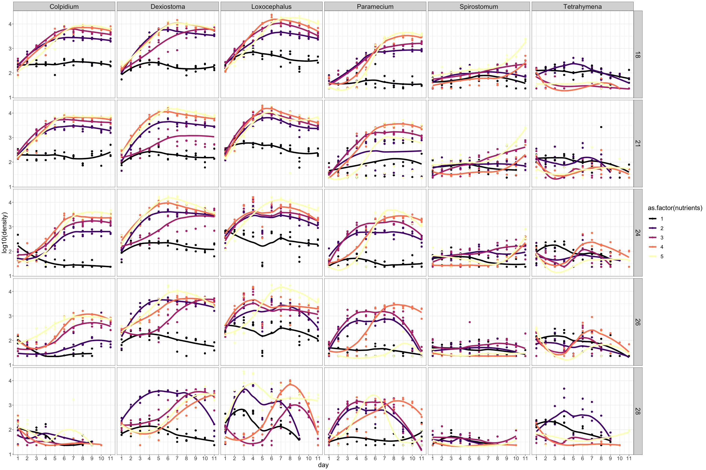
<p class="caption">(\#fig:time_series_spp)Time series of species densities across the treatments.</p>
</div>


    m,     ,           h                     00## Calculate K and r 


Visual inspection of exponential growth phase 


<div class="figure" style="text-align: center">
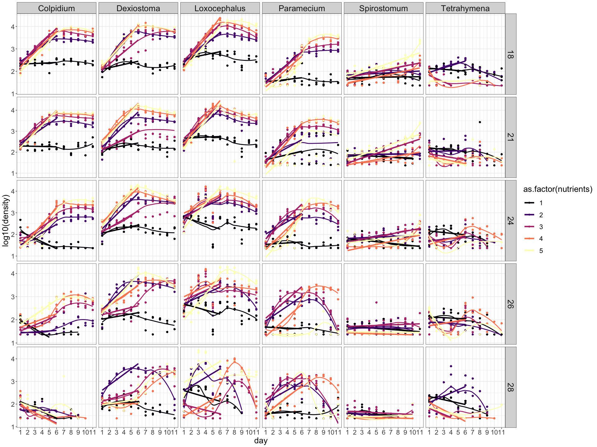
<p class="caption">(\#fig:reg_all)Species densities across the treatments with the regression lines used to calculate the intrinsic rate of growth (r).</p>
</div>

## GAMs to fit responde surface 

At least for now, we focus on the intrinsic rate of growth (r). We are going to fit response surfaces using the calculated r for all species using GAMs. Then we are also going to use r as the species' trait to calculate potential response diversity, as well as response diversity when the direction of the environmental change is known. The rationale is that r is likely of more relevance if the environmental change of interest occurs rapidly, since r provides information on a population's ability to rapidly bounce back after disturbance. In the upcoming experiment, we will have temperature fluctuating relatively fast, and so we decide now to focus on r. 

Use GAMs to fit response surface of r and K 


    species temperature nutrients  predicted
1 Colpidium          18      1.00 0.06013854
2 Colpidium          18      1.01 0.06160047
3 Colpidium          18      1.02 0.06306235
4 Colpidium          18      1.03 0.06452412
5 Colpidium          18      1.04 0.06598574
6 Colpidium          18      1.05 0.06744714


Create surface plots


We now check how the GAMs surfaces (r) look compared to the measured densities.

Checking predictions
<div class="figure" style="text-align: center">
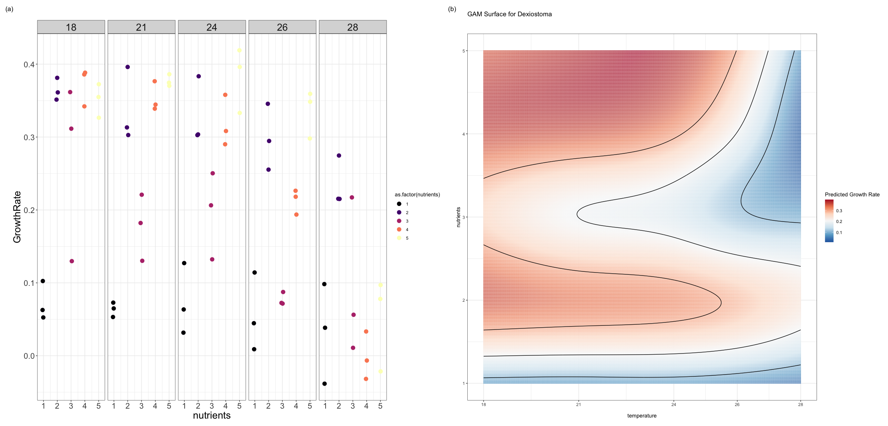
<p class="caption">(\#fig:surface_Dexi)Measured density values of Dexiostoma in the different treatments (a) vs fitted surface of growth rate (b).</p>
</div>


<div class="figure" style="text-align: center">
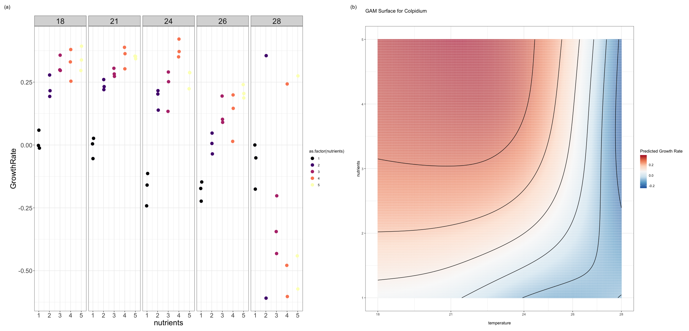
<p class="caption">(\#fig:surface_colp)Measured density values of Colpidium in the different treatments (a) vs fitted surface of growth rate (b).</p>
</div>


<div class="figure" style="text-align: center">
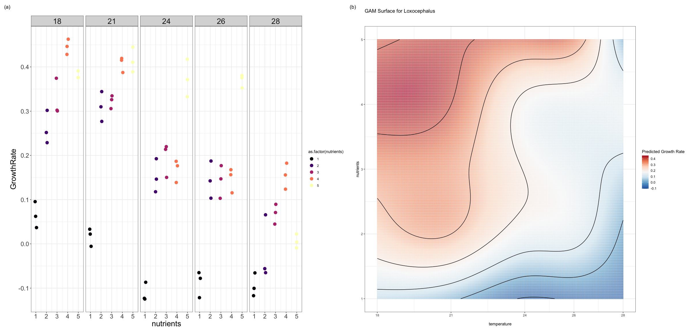
<p class="caption">(\#fig:surface_loxo)Measured density values of Loxocephalus in the different treatments (a) vs fitted surface of growth rate (b).</p>
</div>


<div class="figure" style="text-align: center">
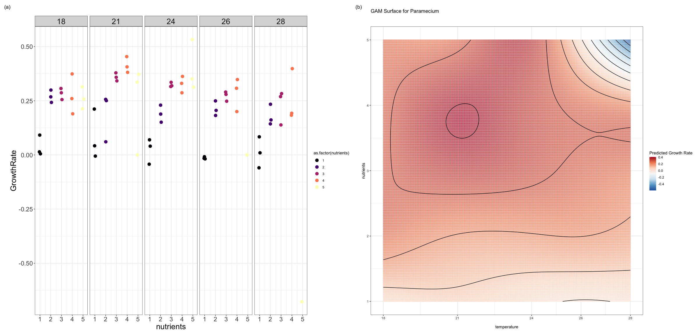
<p class="caption">(\#fig:surface_paramecium)Measured density values of Paramecium in the different treatments (a) vs fitted surface of growth rate (b).</p>
</div>

<div class="figure" style="text-align: center">
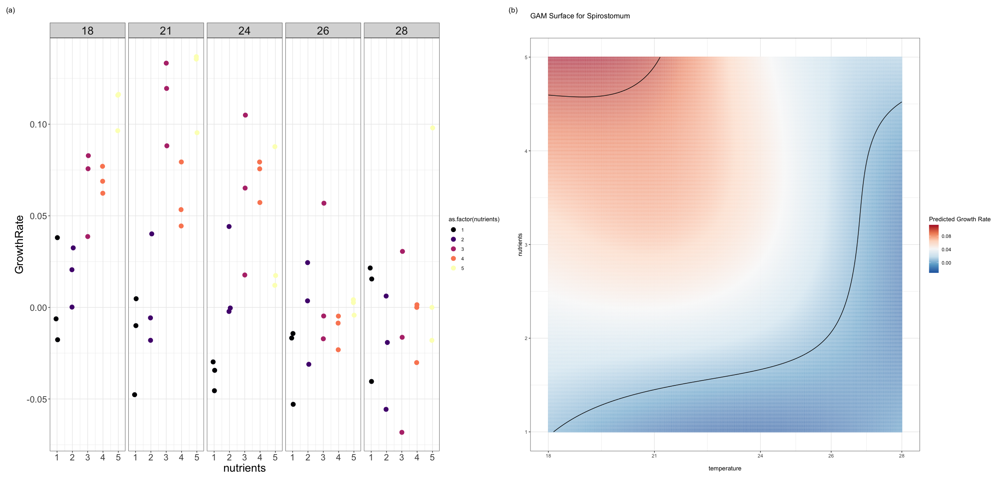
<p class="caption">(\#fig:surface_spiro)Measured density values of Spirostotum in the different treatments (a) vs fitted surface of growth rate (b).</p>
</div>


<div class="figure" style="text-align: center">
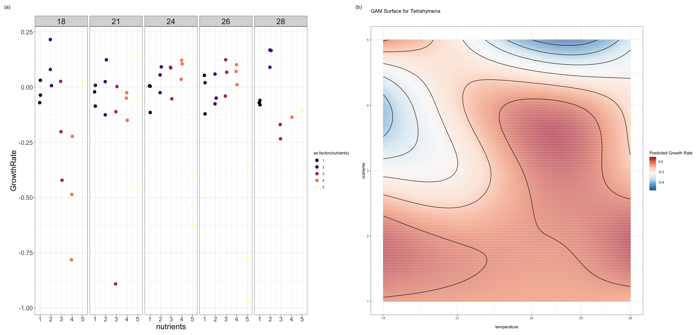
<p class="caption">(\#fig:surface_tetra)Measured density values of Tetrahymena in the different treatments (a) vs fitted surface of growth rate (b).</p>
</div>

# Calculate Potential Response diversity 
After discussion, we decided to remove Tetrahymena


Now, we calculate potential response diversity for all possible communities composed of 2, 3, and 4 species.
We start with all communities composed of 2 species.

## Potential response diversity 2 species communities 
Steps are:

- Create ref environmental conditions


- Create all possible communities with 2 species


- Calculate potential response diversity for all communities richness = 2 with our function "get_potential_RD"


Results
  divergence dissimilarity                 species composition richness
1 0.20489479      1.044523    Colpidium_Dexiostoma          CD        2
2 0.13437387      1.035102  Colpidium_Loxocephalus          CL        2
3 0.15169106      1.039528    Colpidium_Paramecium          CP        2
4 0.03583113      1.028196   Colpidium_Spirostomum          CS        2
5 0.14136269      1.037479 Dexiostoma_Loxocephalus          DL        2
6 0.24765575      1.060830   Dexiostoma_Paramecium          DP        2

## Potential Response Diversity 3 species communities


Results
  divergence dissimilarity                            species composition
1  0.2580088      1.052634  Colpidium_Dexiostoma_Loxocephalus         CDL
2  0.3036517      1.065257    Colpidium_Dexiostoma_Paramecium         CDP
3  0.2285406      1.054633   Colpidium_Dexiostoma_Spirostomum         CDS
4  0.2155091      1.054397  Colpidium_Loxocephalus_Paramecium         CLP
5  0.1485689      1.045846 Colpidium_Loxocephalus_Spirostomum         CLS
6  0.1662250      1.049642   Colpidium_Paramecium_Spirostomum         CPS
  richness
1        3
2        3
3        3
4        3
5        3
6        3


## Potential Response Diversity 4 species communities 


Results

  divergence dissimilarity                                        species
1  0.3351715      1.067317   Colpidium_Dexiostoma_Loxocephalus_Paramecium
2  0.2693354      1.059176  Colpidium_Dexiostoma_Loxocephalus_Spirostomum
3  0.3168594      1.067527    Colpidium_Dexiostoma_Paramecium_Spirostomum
4  0.2237600      1.058784  Colpidium_Loxocephalus_Paramecium_Spirostomum
5  0.3313425      1.070155 Dexiostoma_Loxocephalus_Paramecium_Spirostomum
  composition richness
1        CDLP        4
2        CDLS        4
3        CDPS        4
4        CLPS        4
5        DLPS        4

<!-- Merging data frames and getting community compositions with the highest, lowest and intermediates potential response diversity for each diversity level.  -->

<!-- Results -->
<!-- ```{r results='asis', message=FALSE, warning=FALSE} -->
<!-- ## Display the parameter table -->
<!-- head(ranked_potential_RD_df, -->
<!--               filter="top") -->
<!-- ``` -->

<div class="figure" style="text-align: center">

<p class="caption">(\#fig:potential_RD_plot)Potential Response diversity per species richness measured as dissimilarity (a) and divergence (b).</p>
</div>


# Response diversity with known direction of environmental change

Now we calculate RD with known direction of environmental change, i.e. the ones we are going to apply in the experiment. We are going to calculate response diversity for multiple possible ranges of temperature fluctuations.
- Create a data set with environmental conditions that we may use in the experiment and calculate RD knowing the direction of the environmental change.

- fluctuating temperature x 3 fixed nutrients = 9 treatments

## Magnitude of T change - 1
- first fluctuation ranges are going to be 18-22, 22-26, and 24 - 28. Temperature stays at the lower end of the range (i.e. 18C) for 3 days, it increases over 24h and stays at the higher end for 3 days.


<div class="figure" style="text-align: center">
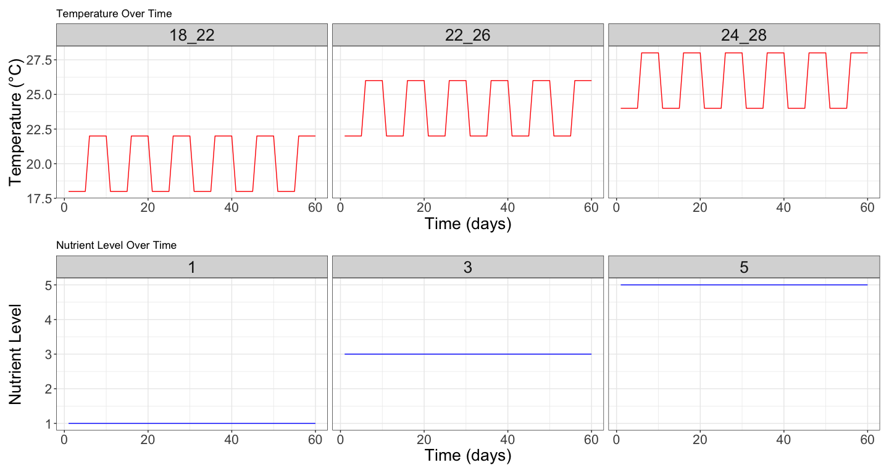
<p class="caption">(\#fig:env_sp2_t1)Time series of the environmental conditions for temperature (a) and nutrients (b). These environmental conditions represent the "treatments" and will be crossed in a full factorial design resulting in 9 unique treatments</p>
</div>


### Response diversity 2 species communities

Same steps as before:

- Create all possible communities with 2 species


- Actual RD calculation
(since temperature and nutrients are the same for 3 days in a row, the magnitude of the unit vector is zero [no direction of environmental change], so we get NAs for divergence. We replace these with zeros)


Results
  time      treatment temperature nutrients dissimilarity divergence
1    1 Mag_18_22_Nut1          18         1             0        NaN
2    1 Mag_18_22_Nut3          18         3             0        NaN
3    1 Mag_18_22_Nut5          18         5             0        NaN
4    1 Mag_22_26_Nut1          22         1             0        NaN
5    1 Mag_22_26_Nut3          22         3             0        NaN
6    1 Mag_22_26_Nut5          22         5             0        NaN
               species composition richness
1 Colpidium_Dexiostoma          CD        2
2 Colpidium_Dexiostoma          CD        2
3 Colpidium_Dexiostoma          CD        2
4 Colpidium_Dexiostoma          CD        2
5 Colpidium_Dexiostoma          CD        2
6 Colpidium_Dexiostoma          CD        2
 [1] "CD" "CL" "CP" "CS" "DL" "DP" "DS" "LP" "LS" "PS"

<div class="figure" style="text-align: center">
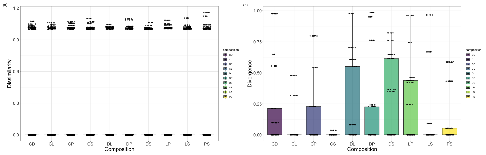
<p class="caption">(\#fig:RD_2sp_t1)Response diversity calcualted as dissimilarity (a) and diversity (b) of communities composed of all possible combinations of 2 species</p>
</div>

### Response diversity 3 species communities 


Now, we calculate RD for all possible communities of 3 species knowing the direction of the environmental change (we created before).


  time      treatment temperature nutrients dissimilarity divergence
1    1 Mag_18_22_Nut1          18         1             0        NaN
2    1 Mag_18_22_Nut3          18         3             0        NaN
3    1 Mag_18_22_Nut5          18         5             0        NaN
4    1 Mag_22_26_Nut1          22         1             0        NaN
5    1 Mag_22_26_Nut3          22         3             0        NaN
6    1 Mag_22_26_Nut5          22         5             0        NaN
                            species composition richness
1 Colpidium_Dexiostoma_Loxocephalus         CDL        3
2 Colpidium_Dexiostoma_Loxocephalus         CDL        3
3 Colpidium_Dexiostoma_Loxocephalus         CDL        3
4 Colpidium_Dexiostoma_Loxocephalus         CDL        3
5 Colpidium_Dexiostoma_Loxocephalus         CDL        3
6 Colpidium_Dexiostoma_Loxocephalus         CDL        3

<div class="figure" style="text-align: center">
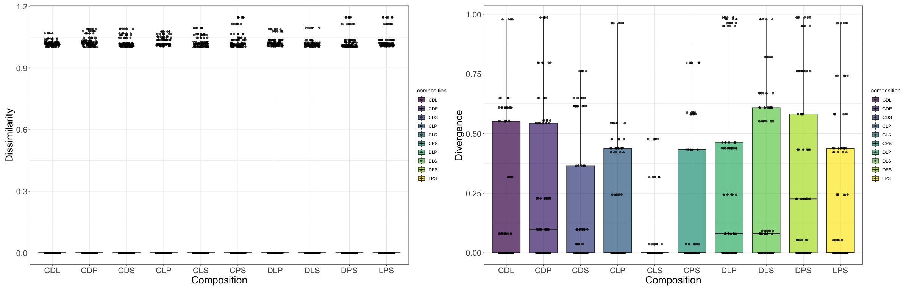
<p class="caption">(\#fig:RD_3sp_t1)Response diversity calcualted as dissimilarity (a) and diversity (b) of communities composed of all possible combinations of 3 species</p>
</div>

### Response diversity 4 species communities

Now, we calculate RD for all possible communities of 4 species knowing the direction of the environmental change (we created before).


  time      treatment temperature nutrients dissimilarity divergence
1    1 Mag_18_22_Nut1          18         1             0        NaN
2    1 Mag_18_22_Nut3          18         3             0        NaN
3    1 Mag_18_22_Nut5          18         5             0        NaN
4    1 Mag_22_26_Nut1          22         1             0        NaN
5    1 Mag_22_26_Nut3          22         3             0        NaN
6    1 Mag_22_26_Nut5          22         5             0        NaN
                                       species composition richness
1 Colpidium_Dexiostoma_Loxocephalus_Paramecium        CDLP        4
2 Colpidium_Dexiostoma_Loxocephalus_Paramecium        CDLP        4
3 Colpidium_Dexiostoma_Loxocephalus_Paramecium        CDLP        4
4 Colpidium_Dexiostoma_Loxocephalus_Paramecium        CDLP        4
5 Colpidium_Dexiostoma_Loxocephalus_Paramecium        CDLP        4
6 Colpidium_Dexiostoma_Loxocephalus_Paramecium        CDLP        4

<div class="figure" style="text-align: center">

<p class="caption">(\#fig:RD_4sp_t1)Response diversity calcualted as dissimilarity (a) and diversity (b) of communities composed of all possible combinations of 4 species</p>
</div>

<div class="figure" style="text-align: center">
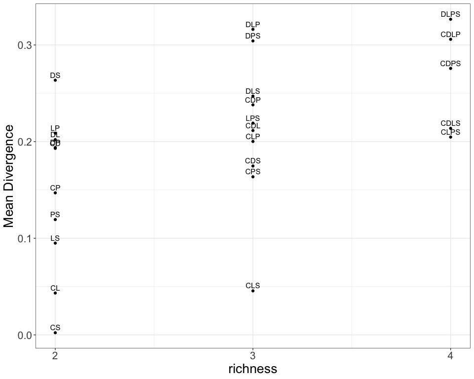
<p class="caption">(\#fig:summary_RD_t1)Summary of Response divergence measured for all possible communities of 2, 3, and 4 species with known direction of environmental change</p>
</div>

<!-- -->


## Magnitude of T change - 2

- 3C magnitude
-  fluctuation ranges are going to be 18-21, 22-25, and 25 - 28


<div class="figure" style="text-align: center">
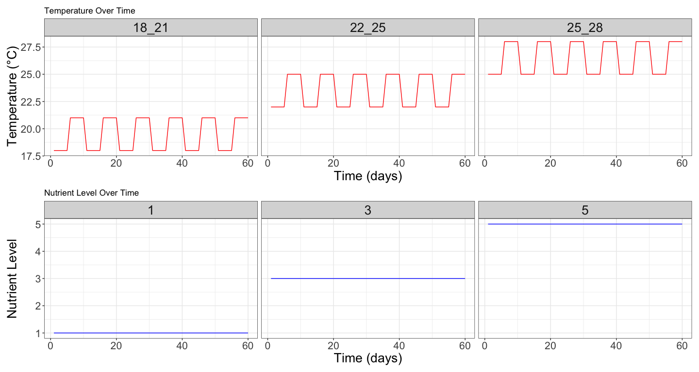
<p class="caption">(\#fig:env_scenario2_t2)Time series of the environmental conditions for temperature (a) and nutrients (b). These environmental conditions represent the "treatments" and will be crossed in a full factorial design resulting in 9 unique treatments</p>
</div>


### Response diversity 2 species communities

Same steps as before:

- Create all possible communities with 2 species


- Actual RD calculation


Results
  time      treatment temperature nutrients dissimilarity divergence
1    1 Mag_18_21_Nut1          18         1             0        NaN
2    1 Mag_18_21_Nut3          18         3             0        NaN
3    1 Mag_18_21_Nut5          18         5             0        NaN
4    1 Mag_22_25_Nut1          22         1             0        NaN
5    1 Mag_22_25_Nut3          22         3             0        NaN
6    1 Mag_22_25_Nut5          22         5             0        NaN
               species composition richness
1 Colpidium_Dexiostoma          CD        2
2 Colpidium_Dexiostoma          CD        2
3 Colpidium_Dexiostoma          CD        2
4 Colpidium_Dexiostoma          CD        2
5 Colpidium_Dexiostoma          CD        2
6 Colpidium_Dexiostoma          CD        2

<div class="figure" style="text-align: center">
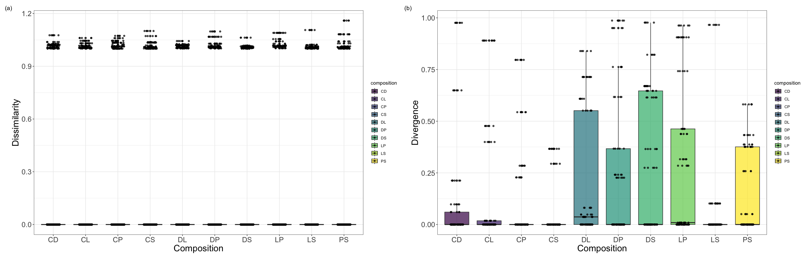
<p class="caption">(\#fig:RD_2sp_t2)Response diversity calcualted as dissimilarity (a) and diversity (b) of communities composed of all possible combinations of 2 species</p>
</div>

### Response diversity 3 species communities 

Now, we calculate RD for all possible communities of 3 species knowing the direction of the environmental change (we created before).


  time      treatment temperature nutrients dissimilarity divergence
1    1 Mag_18_21_Nut1          18         1             0        NaN
2    1 Mag_18_21_Nut3          18         3             0        NaN
3    1 Mag_18_21_Nut5          18         5             0        NaN
4    1 Mag_22_25_Nut1          22         1             0        NaN
5    1 Mag_22_25_Nut3          22         3             0        NaN
6    1 Mag_22_25_Nut5          22         5             0        NaN
                            species composition richness
1 Colpidium_Dexiostoma_Loxocephalus         CDL        3
2 Colpidium_Dexiostoma_Loxocephalus         CDL        3
3 Colpidium_Dexiostoma_Loxocephalus         CDL        3
4 Colpidium_Dexiostoma_Loxocephalus         CDL        3
5 Colpidium_Dexiostoma_Loxocephalus         CDL        3
6 Colpidium_Dexiostoma_Loxocephalus         CDL        3

<div class="figure" style="text-align: center">

<p class="caption">(\#fig:RD_3sp_t2)Response diversity calcualted as dissimilarity (a) and diversity (b) of communities composed of all possible combinations of 3 species</p>
</div>

### Response diversity 4 species communities

Now, we calculate RD for all possible communities of 4 species knowing the direction of the environmental change (we created before).


  time      treatment temperature nutrients dissimilarity divergence
1    1 Mag_18_21_Nut1          18         1             0        NaN
2    1 Mag_18_21_Nut3          18         3             0        NaN
3    1 Mag_18_21_Nut5          18         5             0        NaN
4    1 Mag_22_25_Nut1          22         1             0        NaN
5    1 Mag_22_25_Nut3          22         3             0        NaN
6    1 Mag_22_25_Nut5          22         5             0        NaN
                                       species composition richness
1 Colpidium_Dexiostoma_Loxocephalus_Paramecium        CDLP        4
2 Colpidium_Dexiostoma_Loxocephalus_Paramecium        CDLP        4
3 Colpidium_Dexiostoma_Loxocephalus_Paramecium        CDLP        4
4 Colpidium_Dexiostoma_Loxocephalus_Paramecium        CDLP        4
5 Colpidium_Dexiostoma_Loxocephalus_Paramecium        CDLP        4
6 Colpidium_Dexiostoma_Loxocephalus_Paramecium        CDLP        4

<div class="figure" style="text-align: center">
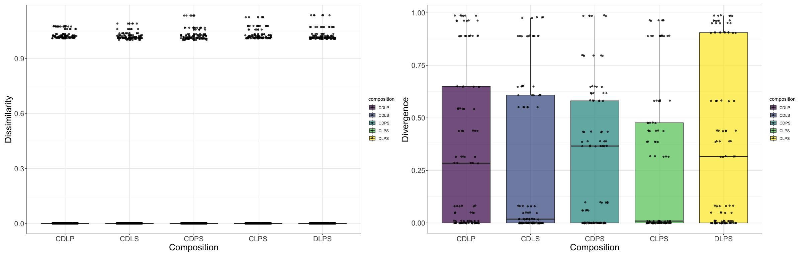
<p class="caption">(\#fig:RD_4sp_t2)Response diversity calcualted as dissimilarity (a) and diversity (b) of communities composed of all possible combinations of 4 species</p>
</div>


<div class="figure" style="text-align: center">
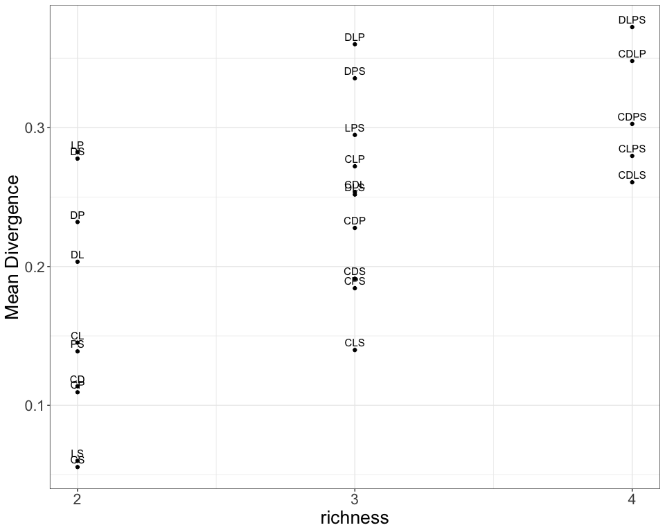
<p class="caption">(\#fig:summary_RD_t2)Summary of Response divergence measured for all possible communities of 2, 3, and 4 species with known direction of environmental change</p>
</div>

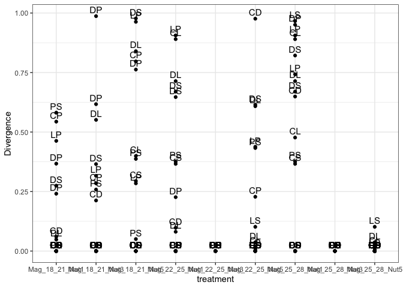<!-- -->

## Magnitude of T change - 3

- 2C magnitude 
- third fluctuation ranges are going to be 18-20, 22-24, and 26 - 28


<div class="figure" style="text-align: center">
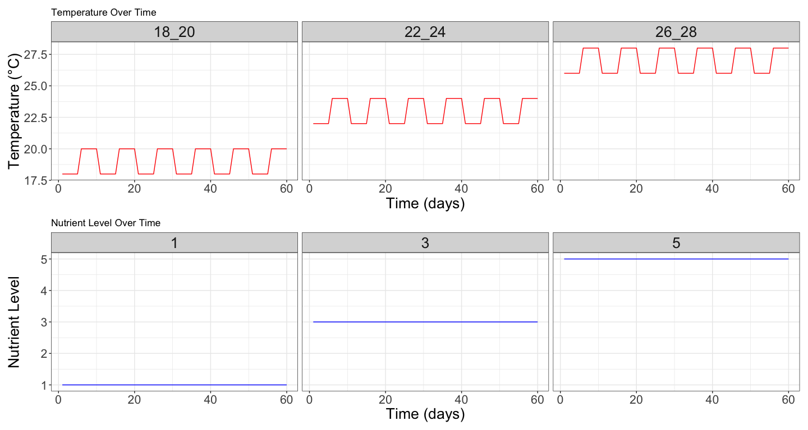
<p class="caption">(\#fig:env_scenario2_t3)Time series of the environmental conditions for temperature (a) and nutrients (b). These environmental conditions represent the "treatments" and will be crossed in a full factorial design resulting in 9 unique treatments</p>
</div>


### Response diversity 2 species communities

Same steps as before:

- Create all possible communities with 2 species


- Actual RD calculation


Results
  time      treatment temperature nutrients dissimilarity divergence
1    1 Mag_18_20_Nut1          18         1             0        NaN
2    1 Mag_18_20_Nut3          18         3             0        NaN
3    1 Mag_18_20_Nut5          18         5             0        NaN
4    1 Mag_22_24_Nut1          22         1             0        NaN
5    1 Mag_22_24_Nut3          22         3             0        NaN
6    1 Mag_22_24_Nut5          22         5             0        NaN
               species composition richness
1 Colpidium_Dexiostoma          CD        2
2 Colpidium_Dexiostoma          CD        2
3 Colpidium_Dexiostoma          CD        2
4 Colpidium_Dexiostoma          CD        2
5 Colpidium_Dexiostoma          CD        2
6 Colpidium_Dexiostoma          CD        2

<div class="figure" style="text-align: center">
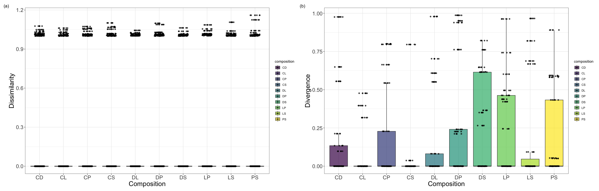
<p class="caption">(\#fig:RD_2sp_t3)Response diversity calcualted as dissimilarity (a) and diversity (b) of communities composed of all possible combinations of 2 species</p>
</div>

### Response diversity 3 species communities 

Now, we calculate RD for all possible communities of 3 species knowing the direction of the environmental change (we created before).


  time      treatment temperature nutrients dissimilarity divergence
1    1 Mag_18_20_Nut1          18         1             0        NaN
2    1 Mag_18_20_Nut3          18         3             0        NaN
3    1 Mag_18_20_Nut5          18         5             0        NaN
4    1 Mag_22_24_Nut1          22         1             0        NaN
5    1 Mag_22_24_Nut3          22         3             0        NaN
6    1 Mag_22_24_Nut5          22         5             0        NaN
                            species composition richness
1 Colpidium_Dexiostoma_Loxocephalus         CDL        3
2 Colpidium_Dexiostoma_Loxocephalus         CDL        3
3 Colpidium_Dexiostoma_Loxocephalus         CDL        3
4 Colpidium_Dexiostoma_Loxocephalus         CDL        3
5 Colpidium_Dexiostoma_Loxocephalus         CDL        3
6 Colpidium_Dexiostoma_Loxocephalus         CDL        3

<div class="figure" style="text-align: center">
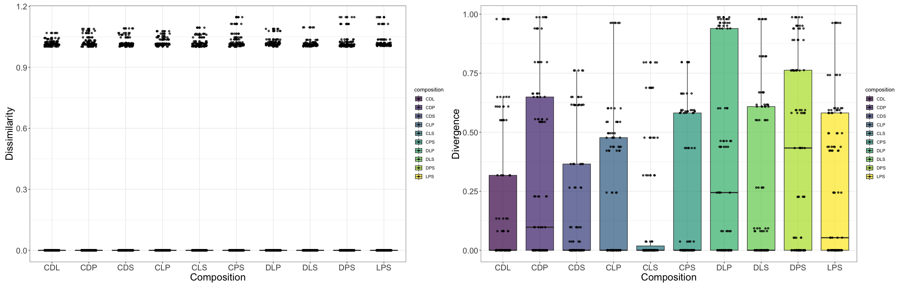
<p class="caption">(\#fig:RD_3sp_t3)Response diversity calcualted as dissimilarity (a) and diversity (b) of communities composed of all possible combinations of 3 species</p>
</div>

### Response diversity 4 species communities

Now, we calculate RD for all possible communities of 4 species knowing the direction of the environmental change (we created before).


  time      treatment temperature nutrients dissimilarity divergence
1    1 Mag_18_20_Nut1          18         1             0        NaN
2    1 Mag_18_20_Nut3          18         3             0        NaN
3    1 Mag_18_20_Nut5          18         5             0        NaN
4    1 Mag_22_24_Nut1          22         1             0        NaN
5    1 Mag_22_24_Nut3          22         3             0        NaN
6    1 Mag_22_24_Nut5          22         5             0        NaN
                                       species composition richness
1 Colpidium_Dexiostoma_Loxocephalus_Paramecium        CDLP        4
2 Colpidium_Dexiostoma_Loxocephalus_Paramecium        CDLP        4
3 Colpidium_Dexiostoma_Loxocephalus_Paramecium        CDLP        4
4 Colpidium_Dexiostoma_Loxocephalus_Paramecium        CDLP        4
5 Colpidium_Dexiostoma_Loxocephalus_Paramecium        CDLP        4
6 Colpidium_Dexiostoma_Loxocephalus_Paramecium        CDLP        4


<div class="figure" style="text-align: center">
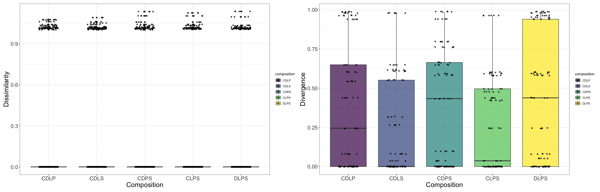
<p class="caption">(\#fig:RD_4sp_t3)Response diversity calcualted as dissimilarity (a) and diversity (b) of communities composed of all possible combinations of 4 species</p>
</div>

<div class="figure" style="text-align: center">
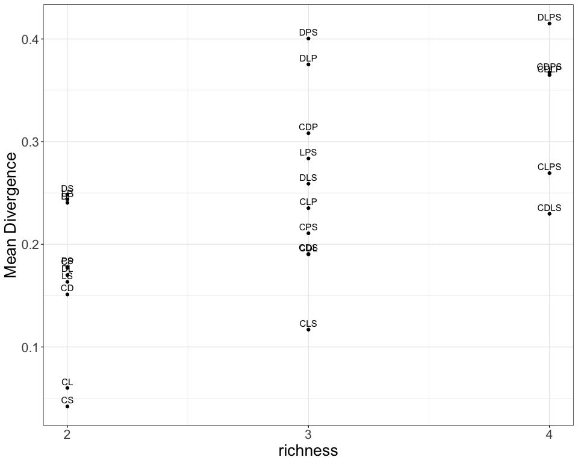
<p class="caption">(\#fig:summary_RD_t3)Summary of Response divergence measured for all possible communities of 2, 3, and 4 species with known direction of environmental change</p>
</div>

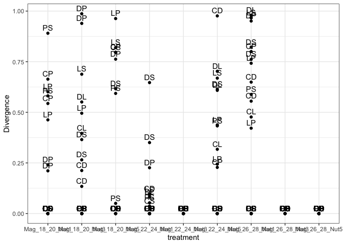<!-- -->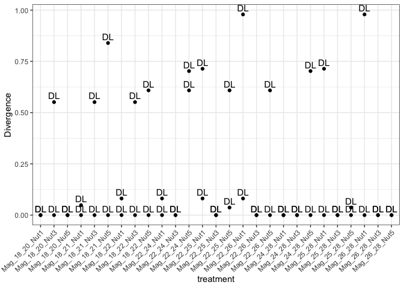<!-- -->


## Fluctuation frequency - 1 

Same temperature fluctuations as before, but now fluctuating over 5 days

- Create a data set with environmental conditions that we may use in the experiment and calculate RD knowing the direction of the environmental change.

- fluctuating temperature x 3 fixed nutrients = 9 treatments


- first fluctuation ranges are going to be 18-22, 22-26, and 24 - 28


<div class="figure" style="text-align: center">

<p class="caption">(\#fig:env_sp2_T1)Time series of the environmental conditions for temperature (a) and nutrients (b). These environmental conditions represent the "treatments" and will be crossed in a full factorial design resulting in 9 unique treatments</p>
</div>


### Response diversity 2 species communities

Same steps as before:

- Create all possible communities with 2 species


- Actual RD calculation


Results
  time        treatment temperature nutrients dissimilarity divergence
1    1 Fluct_18_22_Nut1          18         1             0        NaN
2    1 Fluct_18_22_Nut3          18         3             0        NaN
3    1 Fluct_18_22_Nut5          18         5             0        NaN
4    1 Fluct_22_26_Nut1          22         1             0        NaN
5    1 Fluct_22_26_Nut3          22         3             0        NaN
6    1 Fluct_22_26_Nut5          22         5             0        NaN
               species composition richness
1 Colpidium_Dexiostoma          CD        2
2 Colpidium_Dexiostoma          CD        2
3 Colpidium_Dexiostoma          CD        2
4 Colpidium_Dexiostoma          CD        2
5 Colpidium_Dexiostoma          CD        2
6 Colpidium_Dexiostoma          CD        2

<div class="figure" style="text-align: center">

<p class="caption">(\#fig:RD_2sp_T1)Response diversity calcualted as dissimilarity (a) and diversity (b) of communities composed of all possible combinations of 2 species</p>
</div>

### Response diversity 3 species communities 

Now, we calculate RD for all possible communities of 3 species knowing the direction of the environmental change (we created before).


  time        treatment temperature nutrients dissimilarity divergence
1    1 Fluct_18_22_Nut1          18         1             0        NaN
2    1 Fluct_18_22_Nut3          18         3             0        NaN
3    1 Fluct_18_22_Nut5          18         5             0        NaN
4    1 Fluct_22_26_Nut1          22         1             0        NaN
5    1 Fluct_22_26_Nut3          22         3             0        NaN
6    1 Fluct_22_26_Nut5          22         5             0        NaN
                            species composition richness
1 Colpidium_Dexiostoma_Loxocephalus         CDL        3
2 Colpidium_Dexiostoma_Loxocephalus         CDL        3
3 Colpidium_Dexiostoma_Loxocephalus         CDL        3
4 Colpidium_Dexiostoma_Loxocephalus         CDL        3
5 Colpidium_Dexiostoma_Loxocephalus         CDL        3
6 Colpidium_Dexiostoma_Loxocephalus         CDL        3

<div class="figure" style="text-align: center">

<p class="caption">(\#fig:RD_3sp_T1)Response diversity calcualted as dissimilarity (a) and diversity (b) of communities composed of all possible combinations of 3 species</p>
</div>

### Response diversity 4 species communities

Now, we calculate RD for all possible communities of 4 species knowing the direction of the environmental change (we created before).


  time        treatment E1_ref E2_ref dissimilarity divergence
1    1 Fluct_18_22_Nut1     18      1             0        NaN
2    1 Fluct_18_22_Nut3     18      3             0        NaN
3    1 Fluct_18_22_Nut5     18      5             0        NaN
4    1 Fluct_22_26_Nut1     22      1             0        NaN
5    1 Fluct_22_26_Nut3     22      3             0        NaN
6    1 Fluct_22_26_Nut5     22      5             0        NaN
                                       species composition richness
1 Colpidium_Dexiostoma_Loxocephalus_Paramecium        CDLP        4
2 Colpidium_Dexiostoma_Loxocephalus_Paramecium        CDLP        4
3 Colpidium_Dexiostoma_Loxocephalus_Paramecium        CDLP        4
4 Colpidium_Dexiostoma_Loxocephalus_Paramecium        CDLP        4
5 Colpidium_Dexiostoma_Loxocephalus_Paramecium        CDLP        4
6 Colpidium_Dexiostoma_Loxocephalus_Paramecium        CDLP        4

<div class="figure" style="text-align: center">

<p class="caption">(\#fig:RD_4sp_T1)Response diversity calcualted as dissimilarity (a) and diversity (b) of communities composed of all possible combinations of 4 species</p>
</div>

<div class="figure" style="text-align: center">

<p class="caption">(\#fig:summary_RD_T1)Summary of Response divergence measured for all possible communities of 2, 3, and 4 species with known direction of environmental change</p>
</div>


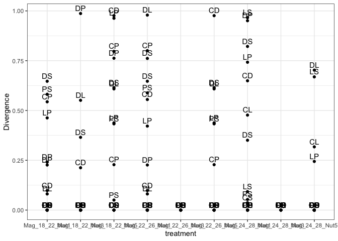<!-- -->

## Fluctuation frequency - 2


- first fluctuation ranges are going to be 18-21, 22-25, and 25 - 28


<div class="figure" style="text-align: center">

<p class="caption">(\#fig:env_scenario2_T2)Time series of the environmental conditions for temperature (a) and nutrients (b). These environmental conditions represent the "treatments" and will be crossed in a full factorial design resulting in 9 unique treatments</p>
</div>


### Response diversity 2 species communities

Same steps as before:

- Create all possible communities with 2 species


- Actual RD calculation


Results
  time        treatment temperature nutrients dissimilarity divergence
1    1 Fluct_18_21_Nut1          18         1             0        NaN
2    1 Fluct_18_21_Nut3          18         3             0        NaN
3    1 Fluct_18_21_Nut5          18         5             0        NaN
4    1 Fluct_22_25_Nut1          22         1             0        NaN
5    1 Fluct_22_25_Nut3          22         3             0        NaN
6    1 Fluct_22_25_Nut5          22         5             0        NaN
               species composition richness
1 Colpidium_Dexiostoma          CD        2
2 Colpidium_Dexiostoma          CD        2
3 Colpidium_Dexiostoma          CD        2
4 Colpidium_Dexiostoma          CD        2
5 Colpidium_Dexiostoma          CD        2
6 Colpidium_Dexiostoma          CD        2

<div class="figure" style="text-align: center">

<p class="caption">(\#fig:RD_2sp_T2)Response diversity calcualted as dissimilarity (a) and diversity (b) of communities composed of all possible combinations of 2 species</p>
</div>

### Response diversity 3 species communities 

Now, we calculate RD for all possible communities of 3 species knowing the direction of the environmental change (we created before).


  time        treatment temperature nutrients dissimilarity divergence
1    1 Fluct_18_21_Nut1          18         1             0        NaN
2    1 Fluct_18_21_Nut3          18         3             0        NaN
3    1 Fluct_18_21_Nut5          18         5             0        NaN
4    1 Fluct_22_25_Nut1          22         1             0        NaN
5    1 Fluct_22_25_Nut3          22         3             0        NaN
6    1 Fluct_22_25_Nut5          22         5             0        NaN
                            species composition richness
1 Colpidium_Dexiostoma_Loxocephalus         CDL        3
2 Colpidium_Dexiostoma_Loxocephalus         CDL        3
3 Colpidium_Dexiostoma_Loxocephalus         CDL        3
4 Colpidium_Dexiostoma_Loxocephalus         CDL        3
5 Colpidium_Dexiostoma_Loxocephalus         CDL        3
6 Colpidium_Dexiostoma_Loxocephalus         CDL        3

<div class="figure" style="text-align: center">

<p class="caption">(\#fig:RD_3sp_T2)Response diversity calcualted as dissimilarity (a) and diversity (b) of communities composed of all possible combinations of 3 species</p>
</div>

### Response diversity 4 species communities

Now, we calculate RD for all possible communities of 4 species knowing the direction of the environmental change (we created before).


  time        treatment E1_ref E2_ref dissimilarity divergence
1    1 Fluct_18_21_Nut1     18      1             0        NaN
2    1 Fluct_18_21_Nut3     18      3             0        NaN
3    1 Fluct_18_21_Nut5     18      5             0        NaN
4    1 Fluct_22_25_Nut1     22      1             0        NaN
5    1 Fluct_22_25_Nut3     22      3             0        NaN
6    1 Fluct_22_25_Nut5     22      5             0        NaN
                                       species composition richness
1 Colpidium_Dexiostoma_Loxocephalus_Paramecium        CDLP        4
2 Colpidium_Dexiostoma_Loxocephalus_Paramecium        CDLP        4
3 Colpidium_Dexiostoma_Loxocephalus_Paramecium        CDLP        4
4 Colpidium_Dexiostoma_Loxocephalus_Paramecium        CDLP        4
5 Colpidium_Dexiostoma_Loxocephalus_Paramecium        CDLP        4
6 Colpidium_Dexiostoma_Loxocephalus_Paramecium        CDLP        4

<div class="figure" style="text-align: center">

<p class="caption">(\#fig:RD_4sp_T2)Response diversity calcualted as dissimilarity (a) and diversity (b) of communities composed of all possible combinations of 4 species</p>
</div>

<div class="figure" style="text-align: center">

<p class="caption">(\#fig:summary_RD_T2)Summary of Response divergence measured for all possible communities of 2, 3, and 4 species with known direction of environmental change</p>
</div>

<!-- -->

## Fluctuation frequency - 3


- third fluctuation ranges are going to be 18-20, 21-24, and 26 - 28


<div class="figure" style="text-align: center">

<p class="caption">(\#fig:env_scenario2_T3)Time series of the environmental conditions for temperature (a) and nutrients (b). These environmental conditions represent the "treatments" and will be crossed in a full factorial design resulting in 9 unique treatments</p>
</div>


### Response diversity 2 species communities

Same steps as before:

- Create all possible communities with 2 species


- Actual RD calculation


Results
  time        treatment temperature nutrients dissimilarity divergence
1    1 Fluct_18_20_Nut1          18         1             0        NaN
2    1 Fluct_18_20_Nut3          18         3             0        NaN
3    1 Fluct_18_20_Nut5          18         5             0        NaN
4    1 Fluct_22_24_Nut1          22         1             0        NaN
5    1 Fluct_22_24_Nut3          22         3             0        NaN
6    1 Fluct_22_24_Nut5          22         5             0        NaN
               species composition richness
1 Colpidium_Dexiostoma          CD        2
2 Colpidium_Dexiostoma          CD        2
3 Colpidium_Dexiostoma          CD        2
4 Colpidium_Dexiostoma          CD        2
5 Colpidium_Dexiostoma          CD        2
6 Colpidium_Dexiostoma          CD        2

<div class="figure" style="text-align: center">

<p class="caption">(\#fig:RD_2sp_T3)Response diversity calcualted as dissimilarity (a) and diversity (b) of communities composed of all possible combinations of 2 species</p>
</div>

### Response diversity 3 species communities 

Now, we calculate RD for all possible communities of 3 species knowing the direction of the environmental change (we created before).


  time        treatment E1_ref E2_ref dissimilarity divergence
1    1 Fluct_18_20_Nut1     18      1             0        NaN
2    1 Fluct_18_20_Nut3     18      3             0        NaN
3    1 Fluct_18_20_Nut5     18      5             0        NaN
4    1 Fluct_22_24_Nut1     22      1             0        NaN
5    1 Fluct_22_24_Nut3     22      3             0        NaN
6    1 Fluct_22_24_Nut5     22      5             0        NaN
                            species composition richness
1 Colpidium_Dexiostoma_Loxocephalus         CDL        3
2 Colpidium_Dexiostoma_Loxocephalus         CDL        3
3 Colpidium_Dexiostoma_Loxocephalus         CDL        3
4 Colpidium_Dexiostoma_Loxocephalus         CDL        3
5 Colpidium_Dexiostoma_Loxocephalus         CDL        3
6 Colpidium_Dexiostoma_Loxocephalus         CDL        3

<div class="figure" style="text-align: center">

<p class="caption">(\#fig:RD_3sp_T3)Response diversity calcualted as dissimilarity (a) and diversity (b) of communities composed of all possible combinations of 3 species</p>
</div>

### Response diversity 4 species communities

Now, we calculate RD for all possible communities of 4 species knowing the direction of the environmental change (we created before).


  time        treatment temperature nutrients dissimilarity divergence
1    1 Fluct_18_20_Nut1          18         1             0        NaN
2    1 Fluct_18_20_Nut3          18         3             0        NaN
3    1 Fluct_18_20_Nut5          18         5             0        NaN
4    1 Fluct_22_24_Nut1          22         1             0        NaN
5    1 Fluct_22_24_Nut3          22         3             0        NaN
6    1 Fluct_22_24_Nut5          22         5             0        NaN
                                       species composition richness
1 Colpidium_Dexiostoma_Loxocephalus_Paramecium        CDLP        4
2 Colpidium_Dexiostoma_Loxocephalus_Paramecium        CDLP        4
3 Colpidium_Dexiostoma_Loxocephalus_Paramecium        CDLP        4
4 Colpidium_Dexiostoma_Loxocephalus_Paramecium        CDLP        4
5 Colpidium_Dexiostoma_Loxocephalus_Paramecium        CDLP        4
6 Colpidium_Dexiostoma_Loxocephalus_Paramecium        CDLP        4

<div class="figure" style="text-align: center">

<p class="caption">(\#fig:RD_4sp_T3)Response diversity calcualted as dissimilarity (a) and diversity (b) of communities composed of all possible combinations of 4 species</p>
</div>

<div class="figure" style="text-align: center">

<p class="caption">(\#fig:summary_RD_T3)Summary of Response divergence measured for all possible communities of 2, 3, and 4 species with known direction of environmental change</p>
</div>


<!-- -->


## Changing nutrients - 1

Same temperature fluctuations as before, different nutrient levels

- Create a data set with environmental conditions that we may use in the experiment and calculate RD knowing the direction of the environmental change.

- fluctuating temperature x 3 fixed nutrients = 9 treatments


- first fluctuation ranges are going to be 18-22, 22-26, and 24 - 28


<div class="figure" style="text-align: center">
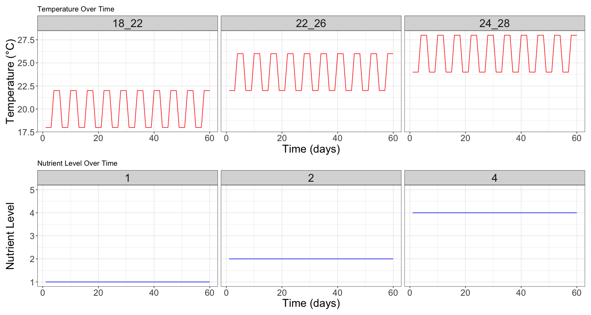
<p class="caption">(\#fig:env_sp2_nut)Time series of the environmental conditions for temperature (a) and nutrients (b). These environmental conditions represent the "treatments" and will be crossed in a full factorial design resulting in 9 unique treatments</p>
</div>


### Response diversity 2 species communities

Same steps as before:

- Create all possible communities with 2 species


- Actual RD calculation


Results
  time      treatment temperature nutrients dissimilarity divergence
1    1 Nut_18_22_Nut1          18         1             0        NaN
2    1 Nut_18_22_Nut2          18         2             0        NaN
3    1 Nut_18_22_Nut4          18         4             0        NaN
4    1 Nut_22_26_Nut1          22         1             0        NaN
5    1 Nut_22_26_Nut2          22         2             0        NaN
6    1 Nut_22_26_Nut4          22         4             0        NaN
               species composition richness
1 Colpidium_Dexiostoma          CD        2
2 Colpidium_Dexiostoma          CD        2
3 Colpidium_Dexiostoma          CD        2
4 Colpidium_Dexiostoma          CD        2
5 Colpidium_Dexiostoma          CD        2
6 Colpidium_Dexiostoma          CD        2

<div class="figure" style="text-align: center">
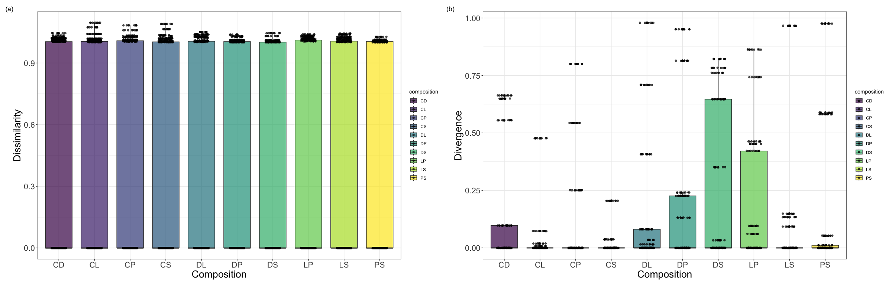
<p class="caption">(\#fig:RD_2sp_nut1)Response diversity calcualted as dissimilarity (a) and diversity (b) of communities composed of all possible combinations of 2 species</p>
</div>

### Response diversity 3 species communities 

Now, we calculate RD for all possible communities of 3 species knowing the direction of the environmental change (we created before).


  time      treatment temperature nutrients dissimilarity divergence
1    1 Nut_18_22_Nut1          18         1             0        NaN
2    1 Nut_18_22_Nut2          18         2             0        NaN
3    1 Nut_18_22_Nut4          18         4             0        NaN
4    1 Nut_22_26_Nut1          22         1             0        NaN
5    1 Nut_22_26_Nut2          22         2             0        NaN
6    1 Nut_22_26_Nut4          22         4             0        NaN
                            species composition richness
1 Colpidium_Dexiostoma_Loxocephalus         CDL        3
2 Colpidium_Dexiostoma_Loxocephalus         CDL        3
3 Colpidium_Dexiostoma_Loxocephalus         CDL        3
4 Colpidium_Dexiostoma_Loxocephalus         CDL        3
5 Colpidium_Dexiostoma_Loxocephalus         CDL        3
6 Colpidium_Dexiostoma_Loxocephalus         CDL        3

<div class="figure" style="text-align: center">
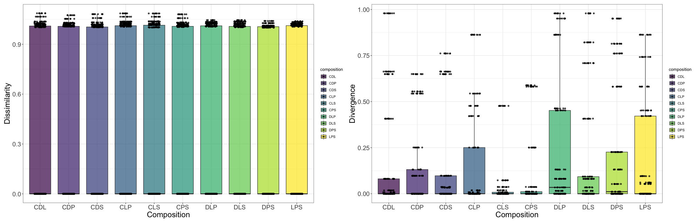
<p class="caption">(\#fig:RD_3sp_nut1)Response diversity calcualted as dissimilarity (a) and diversity (b) of communities composed of all possible combinations of 3 species</p>
</div>

### Response diversity 4 species communities

Now, we calculate RD for all possible communities of 4 species knowing the direction of the environmental change (we created before).


  time      treatment temperature nutrients dissimilarity divergence
1    1 Nut_18_22_Nut1          18         1             0        NaN
2    1 Nut_18_22_Nut2          18         2             0        NaN
3    1 Nut_18_22_Nut4          18         4             0        NaN
4    1 Nut_22_26_Nut1          22         1             0        NaN
5    1 Nut_22_26_Nut2          22         2             0        NaN
6    1 Nut_22_26_Nut4          22         4             0        NaN
                                       species composition richness
1 Colpidium_Dexiostoma_Loxocephalus_Paramecium        CDLP        4
2 Colpidium_Dexiostoma_Loxocephalus_Paramecium        CDLP        4
3 Colpidium_Dexiostoma_Loxocephalus_Paramecium        CDLP        4
4 Colpidium_Dexiostoma_Loxocephalus_Paramecium        CDLP        4
5 Colpidium_Dexiostoma_Loxocephalus_Paramecium        CDLP        4
6 Colpidium_Dexiostoma_Loxocephalus_Paramecium        CDLP        4

<div class="figure" style="text-align: center">
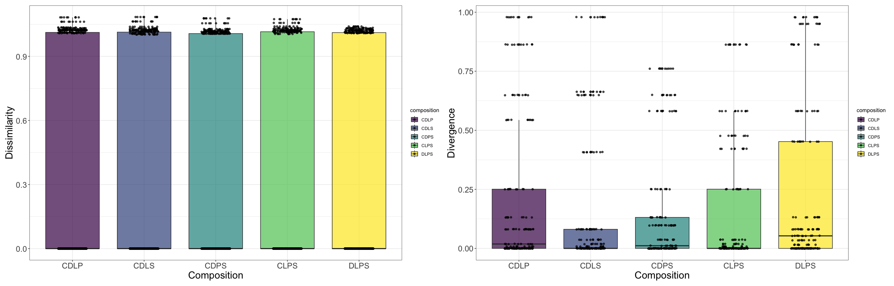
<p class="caption">(\#fig:RD_4sp_nut1)Response diversity calcualted as dissimilarity (a) and diversity (b) of communities composed of all possible combinations of 4 species</p>
</div>

<div class="figure" style="text-align: center">
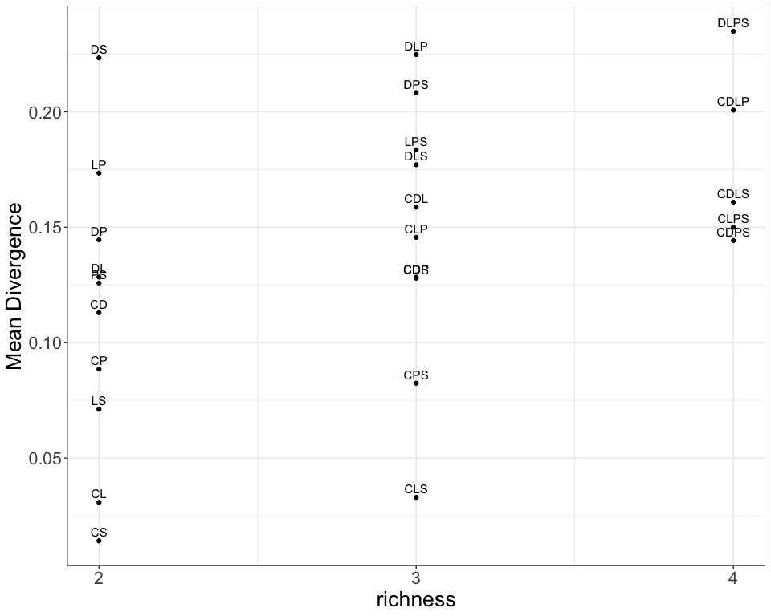
<p class="caption">(\#fig:summary_RD_nut1)Summary of Response divergence measured for all possible communities of 2, 3, and 4 species with known direction of environmental change</p>
</div>


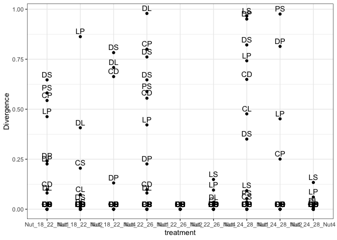<!-- -->


## Changing nutrients - 2


- first fluctuation ranges are going to be 18-21, 22-25, and 25 - 28


<div class="figure" style="text-align: center">

<p class="caption">(\#fig:env_scenario2_nut)Time series of the environmental conditions for temperature (a) and nutrients (b). These environmental conditions represent the "treatments" and will be crossed in a full factorial design resulting in 9 unique treatments</p>
</div>


### Response diversity 2 species communities

Same steps as before:

- Create all possible communities with 2 species


- Actual RD calculation


Results
  time      treatment temperature nutrients dissimilarity divergence
1    1 Nut_18_21_Nut1          18         1             0        NaN
2    1 Nut_18_21_Nut2          18         2             0        NaN
3    1 Nut_18_21_Nut4          18         4             0        NaN
4    1 Nut_22_25_Nut1          22         1             0        NaN
5    1 Nut_22_25_Nut2          22         2             0        NaN
6    1 Nut_22_25_Nut4          22         4             0        NaN
               species composition richness
1 Colpidium_Dexiostoma          CD        2
2 Colpidium_Dexiostoma          CD        2
3 Colpidium_Dexiostoma          CD        2
4 Colpidium_Dexiostoma          CD        2
5 Colpidium_Dexiostoma          CD        2
6 Colpidium_Dexiostoma          CD        2

<div class="figure" style="text-align: center">
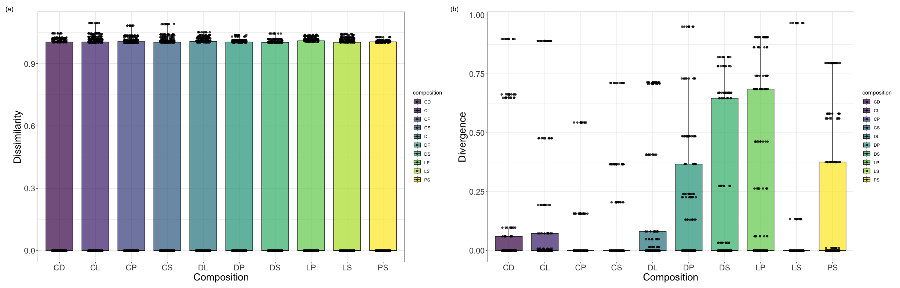
<p class="caption">(\#fig:RD_2sp_nut)Response diversity calcualted as dissimilarity (a) and diversity (b) of communities composed of all possible combinations of 2 species</p>
</div>

### Response diversity 3 species communities 

Now, we calculate RD for all possible communities of 3 species knowing the direction of the environmental change (we created before).


  time      treatment temperature nutrients dissimilarity divergence
1    1 Nut_18_21_Nut1          18         1             0        NaN
2    1 Nut_18_21_Nut2          18         2             0        NaN
3    1 Nut_18_21_Nut4          18         4             0        NaN
4    1 Nut_22_25_Nut1          22         1             0        NaN
5    1 Nut_22_25_Nut2          22         2             0        NaN
6    1 Nut_22_25_Nut4          22         4             0        NaN
                            species composition richness
1 Colpidium_Dexiostoma_Loxocephalus         CDL        3
2 Colpidium_Dexiostoma_Loxocephalus         CDL        3
3 Colpidium_Dexiostoma_Loxocephalus         CDL        3
4 Colpidium_Dexiostoma_Loxocephalus         CDL        3
5 Colpidium_Dexiostoma_Loxocephalus         CDL        3
6 Colpidium_Dexiostoma_Loxocephalus         CDL        3

<div class="figure" style="text-align: center">
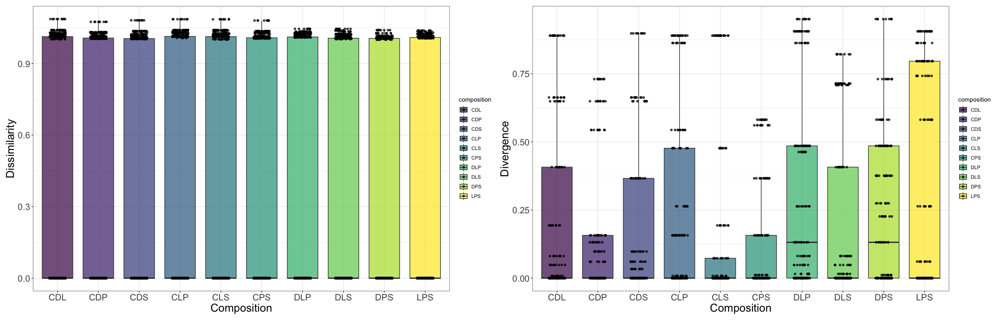
<p class="caption">(\#fig:RD_3sp_nut)Response diversity calcualted as dissimilarity (a) and diversity (b) of communities composed of all possible combinations of 3 species</p>
</div>

### Response diversity 4 species communities

Now, we calculate RD for all possible communities of 4 species knowing the direction of the environmental change (we created before).


  time      treatment temperature nutrients dissimilarity divergence
1    1 Nut_18_21_Nut1          18         1             0        NaN
2    1 Nut_18_21_Nut2          18         2             0        NaN
3    1 Nut_18_21_Nut4          18         4             0        NaN
4    1 Nut_22_25_Nut1          22         1             0        NaN
5    1 Nut_22_25_Nut2          22         2             0        NaN
6    1 Nut_22_25_Nut4          22         4             0        NaN
                                       species composition richness
1 Colpidium_Dexiostoma_Loxocephalus_Paramecium        CDLP        4
2 Colpidium_Dexiostoma_Loxocephalus_Paramecium        CDLP        4
3 Colpidium_Dexiostoma_Loxocephalus_Paramecium        CDLP        4
4 Colpidium_Dexiostoma_Loxocephalus_Paramecium        CDLP        4
5 Colpidium_Dexiostoma_Loxocephalus_Paramecium        CDLP        4
6 Colpidium_Dexiostoma_Loxocephalus_Paramecium        CDLP        4

<div class="figure" style="text-align: center">
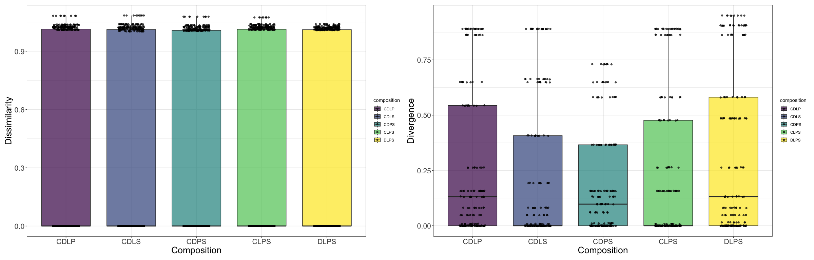
<p class="caption">(\#fig:RD_4sp_nut)Response diversity calcualted as dissimilarity (a) and diversity (b) of communities composed of all possible combinations of 4 species</p>
</div>

<div class="figure" style="text-align: center">
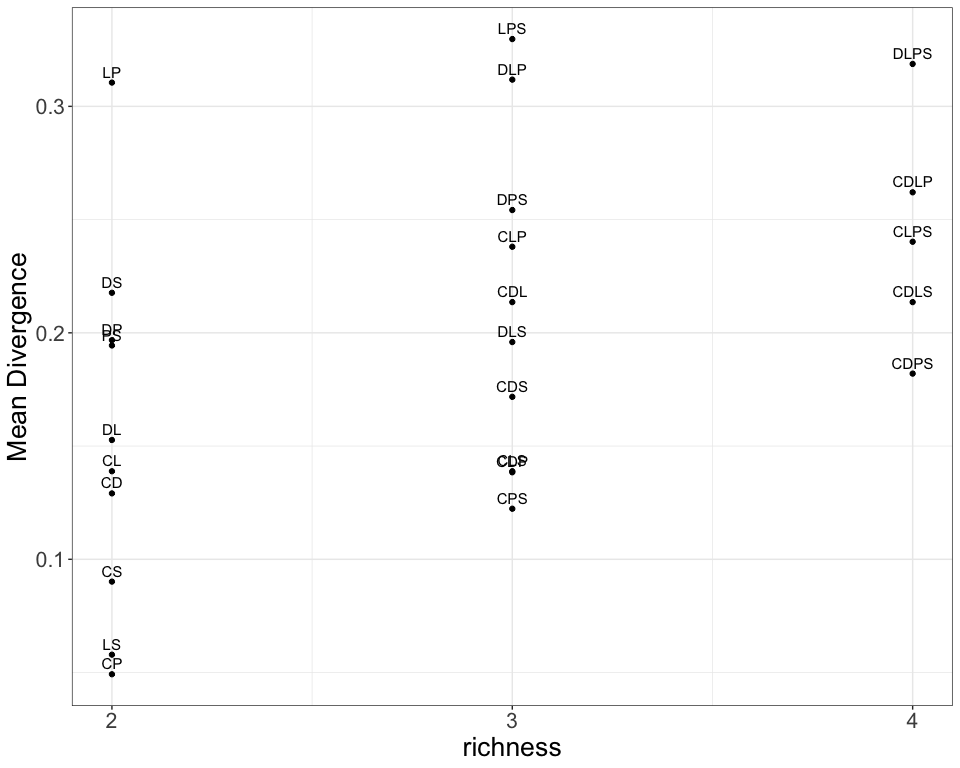
<p class="caption">(\#fig:summary_RD_nut)Summary of Response divergence measured for all possible communities of 2, 3, and 4 species with known direction of environmental change</p>
</div>

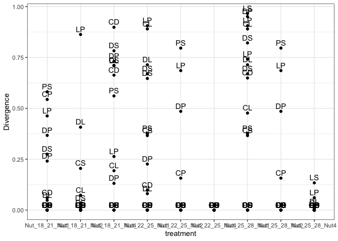<!-- -->

## Changing nutrients - 3


- third fluctuation ranges are going to be 18-20, 22-24, and 26 - 28


<div class="figure" style="text-align: center">

<p class="caption">(\#fig:env_scenario3_nut)Time series of the environmental conditions for temperature (a) and nutrients (b). These environmental conditions represent the "treatments" and will be crossed in a full factorial design resulting in 9 unique treatments</p>
</div>


### Response diversity 2 species communities

Same steps as before:

- Create all possible communities with 2 species


- Actual RD calculation


Results
  time      treatment temperature nutrients dissimilarity divergence
1    1 Nut_18_20_Nut1          18         1             0        NaN
2    1 Nut_18_20_Nut2          18         2             0        NaN
3    1 Nut_18_20_Nut4          18         4             0        NaN
4    1 Nut_22_24_Nut1          22         1             0        NaN
5    1 Nut_22_24_Nut2          22         2             0        NaN
6    1 Nut_22_24_Nut4          22         4             0        NaN
               species composition richness
1 Colpidium_Dexiostoma          CD        2
2 Colpidium_Dexiostoma          CD        2
3 Colpidium_Dexiostoma          CD        2
4 Colpidium_Dexiostoma          CD        2
5 Colpidium_Dexiostoma          CD        2
6 Colpidium_Dexiostoma          CD        2

<div class="figure" style="text-align: center">
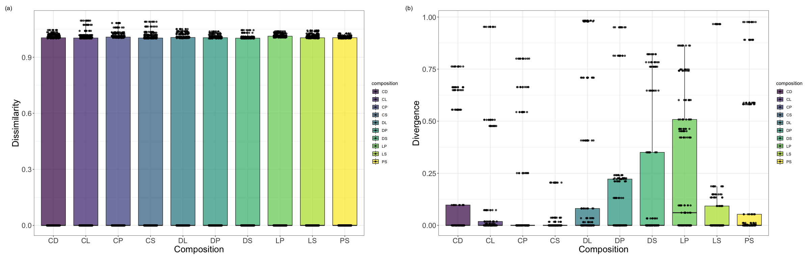
<p class="caption">(\#fig:RD_2sp_nut3)Response diversity calcualted as dissimilarity (a) and diversity (b) of communities composed of all possible combinations of 2 species</p>
</div>

### Response diversity 3 species communities 

Now, we calculate RD for all possible communities of 3 species knowing the direction of the environmental change (we created before).


  time      treatment E1_ref E2_ref dissimilarity divergence
1    1 Nut_18_20_Nut1     18      1             0        NaN
2    1 Nut_18_20_Nut2     18      2             0        NaN
3    1 Nut_18_20_Nut4     18      4             0        NaN
4    1 Nut_22_24_Nut1     22      1             0        NaN
5    1 Nut_22_24_Nut2     22      2             0        NaN
6    1 Nut_22_24_Nut4     22      4             0        NaN
                            species composition richness
1 Colpidium_Dexiostoma_Loxocephalus         CDL        3
2 Colpidium_Dexiostoma_Loxocephalus         CDL        3
3 Colpidium_Dexiostoma_Loxocephalus         CDL        3
4 Colpidium_Dexiostoma_Loxocephalus         CDL        3
5 Colpidium_Dexiostoma_Loxocephalus         CDL        3
6 Colpidium_Dexiostoma_Loxocephalus         CDL        3

<div class="figure" style="text-align: center">
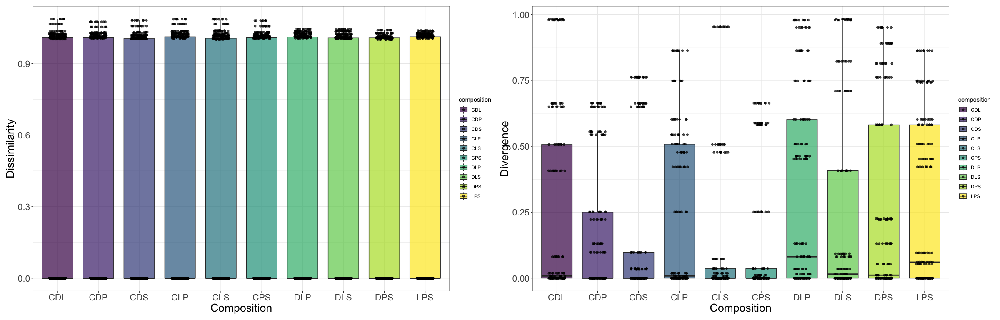
<p class="caption">(\#fig:RD_3sp_nut3)Response diversity calcualted as dissimilarity (a) and diversity (b) of communities composed of all possible combinations of 3 species</p>
</div>

### Response diversity 4 species communities

Now, we calculate RD for all possible communities of 4 species knowing the direction of the environmental change (we created before).


  time      treatment temperature nutrients dissimilarity divergence
1    1 Nut_18_20_Nut1          18         1             0        NaN
2    1 Nut_18_20_Nut2          18         2             0        NaN
3    1 Nut_18_20_Nut4          18         4             0        NaN
4    1 Nut_22_24_Nut1          22         1             0        NaN
5    1 Nut_22_24_Nut2          22         2             0        NaN
6    1 Nut_22_24_Nut4          22         4             0        NaN
                                       species composition richness
1 Colpidium_Dexiostoma_Loxocephalus_Paramecium        CDLP        4
2 Colpidium_Dexiostoma_Loxocephalus_Paramecium        CDLP        4
3 Colpidium_Dexiostoma_Loxocephalus_Paramecium        CDLP        4
4 Colpidium_Dexiostoma_Loxocephalus_Paramecium        CDLP        4
5 Colpidium_Dexiostoma_Loxocephalus_Paramecium        CDLP        4
6 Colpidium_Dexiostoma_Loxocephalus_Paramecium        CDLP        4

<div class="figure" style="text-align: center">
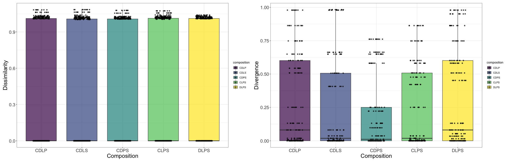
<p class="caption">(\#fig:RD_4sp_nut3)Response diversity calcualted as dissimilarity (a) and diversity (b) of communities composed of all possible combinations of 4 species</p>
</div>

<div class="figure" style="text-align: center">
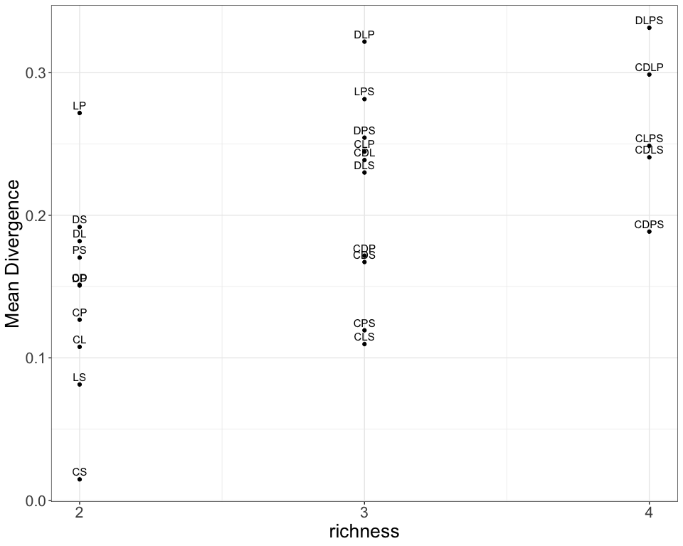
<p class="caption">(\#fig:summary_RD_nut3)Summary of Response divergence measured for all possible communities of 2, 3, and 4 species with known direction of environmental change</p>
</div>

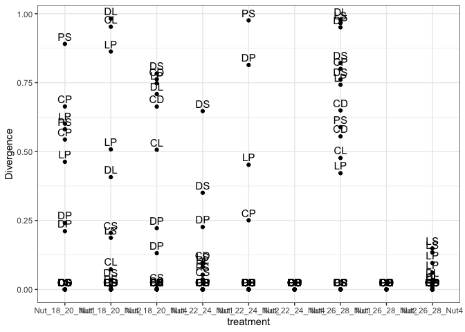<!-- -->


# Big Results table


```
## [1] "time"          "treatment"     "temperature"   "nutrients"    
## [5] "dissimilarity" "divergence"    "species"       "composition"  
## [9] "richness"
```

```
## [1] "divergence"    "dissimilarity" "species"       "composition"  
## [5] "richness"
```


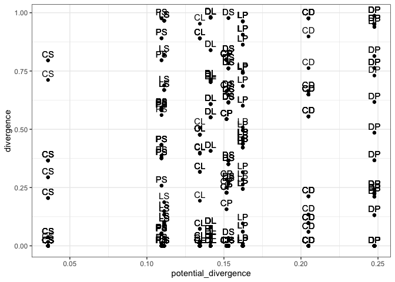<!-- -->


