# Intention 

The goal of this document is to calculate the growth rate (r) and the carrying capacity (K) of 6 species of ciliates 
that we grew individually in a replicated (n = 3) factorial experiment with 5 temperatures (18, 21, 24, 26, and 28), 5 nutrients levels and their combinations (= 25 treatments) for 3 weeks. 
The calculated r and K are then going to be used as the traits to calculate potential response diversity of communities composed of 2, 3, and 4 species to all possible changes in temperature and nutrients. The calculated potential response diversity will inform us on which communities will be used in the following experimental step.
We are going to calculate the growth rate as the slope of the regression of ln(Nt) where: ln is natural log and Nt is the population density at time t, during the period of exponential growth. 
We are going to set initially the period of exponential growth as the first 6 days, but we are going to visually check whether this choice is correct. 
K will be calculated as the highest population biomass for each population during the experiment.


Let's start loading the data set and creating a subset for calculating r


<div class="figure" style="text-align: center">
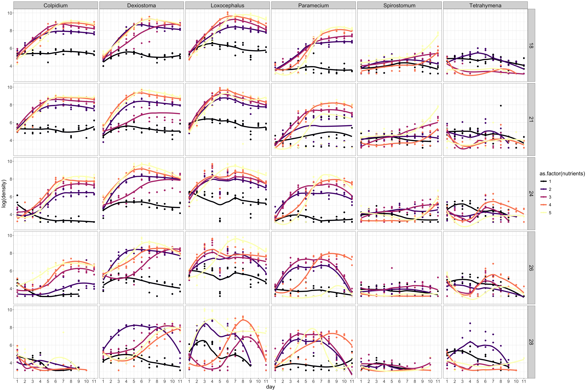
<p class="caption">(\#fig:time_series_spp)Time series of species densities across the treatments.</p>
</div>


    m,     ,           h                     00## Calculate K and r 


Visual inspection of exponential growth phase 


<div class="figure" style="text-align: center">
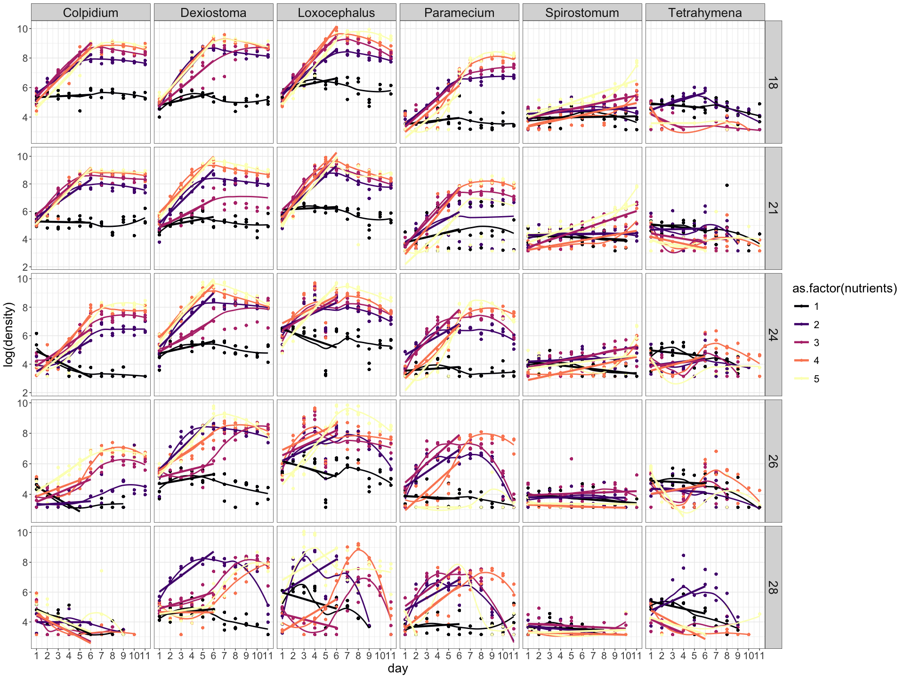
<p class="caption">(\#fig:reg_all)Species densities across the treatments with the regression lines used to calculate the intrinsic rate of growth (r).</p>
</div>

## GAMs to fit responde surface 

At least for now, we focus on the intrinsic rate of growth (r). We are going to fit response surfaces using the calculated r for all species using GAMs. Then we are also going to use r as the species' trait to calculate potential response diversity, as well as response diversity when the direction of the environmental change is known. The rationale is that r is likely of more relevance if the environmental change of interest occurs rapidly, since r provides information on a population's ability to rapidly bounce back after disturbance. In the upcoming experiment, we will have temperature fluctuating relatively fast, and so we decide now to focus on r. 

Use GAMs to fit response surface of r and K 


    species temperature nutrients predicted
1 Colpidium          18      0.01 0.1281185
2 Colpidium          18      0.02 0.1333198
3 Colpidium          18      0.03 0.1385207
4 Colpidium          18      0.04 0.1437208
5 Colpidium          18      0.05 0.1489198
6 Colpidium          18      0.06 0.1541172


Create surface plots


We now check how the GAMs surfaces (r) look compared to the measured densities.
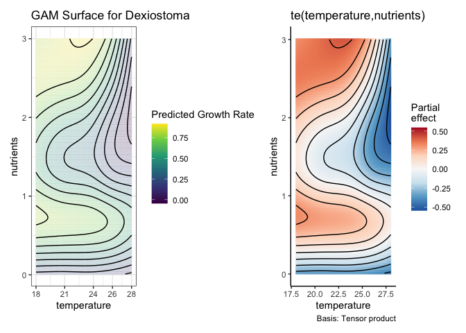<!-- -->
Checking predictions
<div class="figure" style="text-align: center">
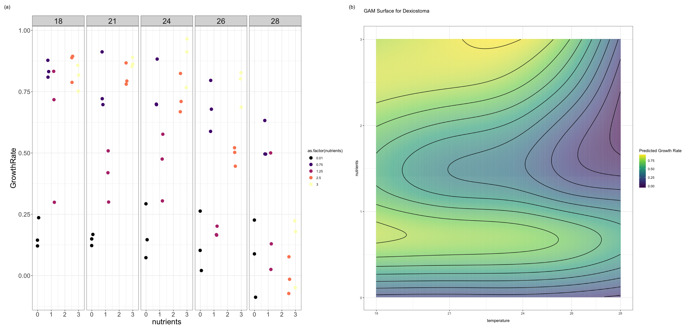
<p class="caption">(\#fig:surface_Dexi)Measured density values of Dexiostoma in the different treatments (a) vs fitted surface of growth rate (b).</p>
</div>


<div class="figure" style="text-align: center">
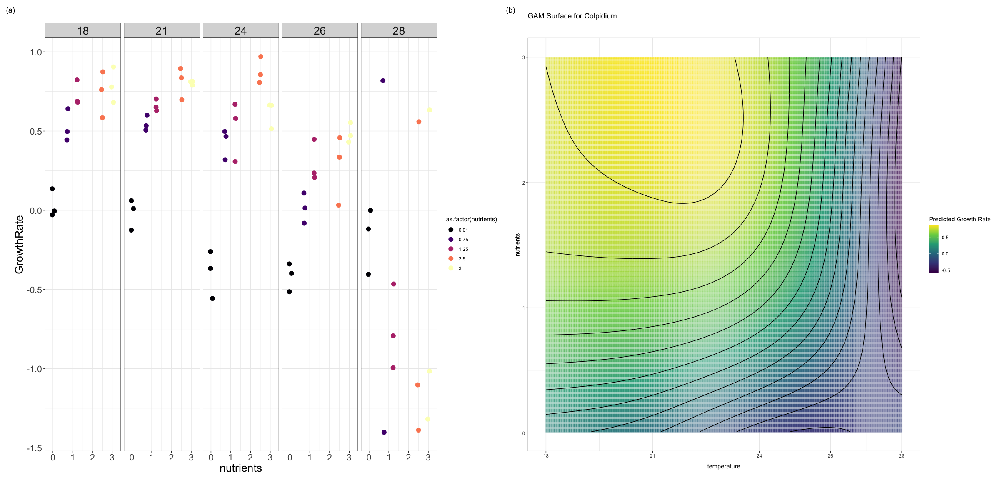
<p class="caption">(\#fig:surface_colp)Measured density values of Colpidium in the different treatments (a) vs fitted surface of growth rate (b).</p>
</div>


<div class="figure" style="text-align: center">
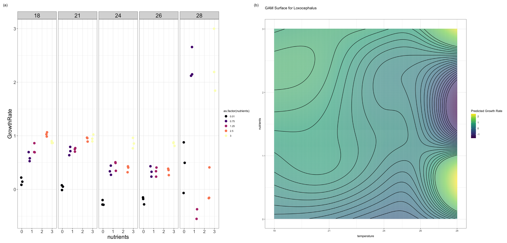
<p class="caption">(\#fig:surface_loxo)Measured density values of Loxocephalus in the different treatments (a) vs fitted surface of growth rate (b).</p>
</div>


<div class="figure" style="text-align: center">
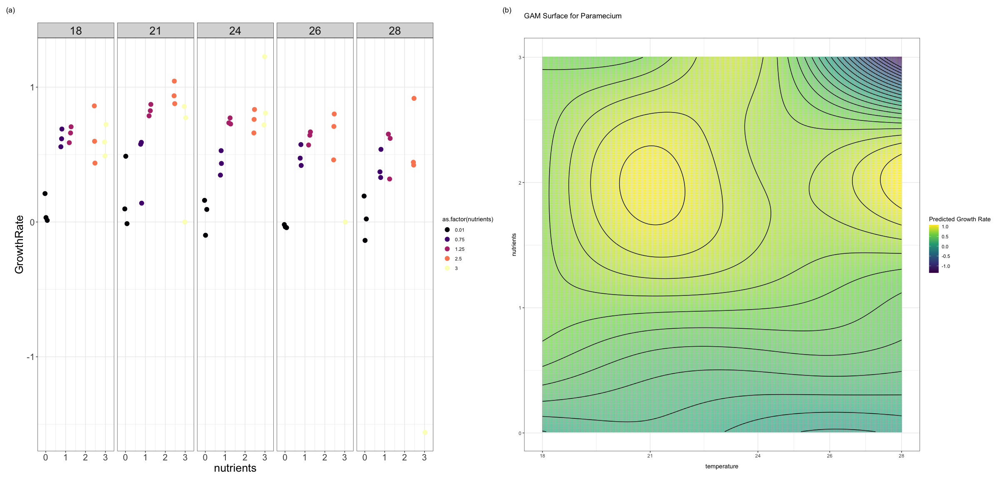
<p class="caption">(\#fig:surface_paramecium)Measured density values of Paramecium in the different treatments (a) vs fitted surface of growth rate (b).</p>
</div>

<div class="figure" style="text-align: center">
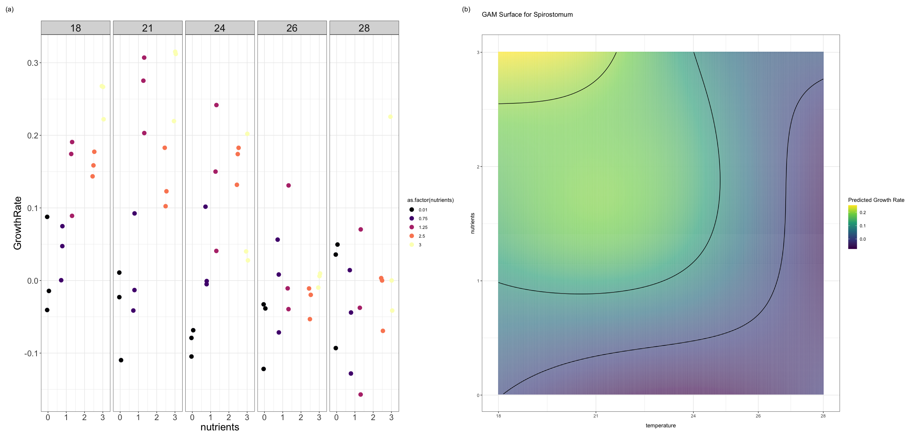
<p class="caption">(\#fig:surface_spiro)Measured density values of Spirostotum in the different treatments (a) vs fitted surface of growth rate (b).</p>
</div>


<div class="figure" style="text-align: center">
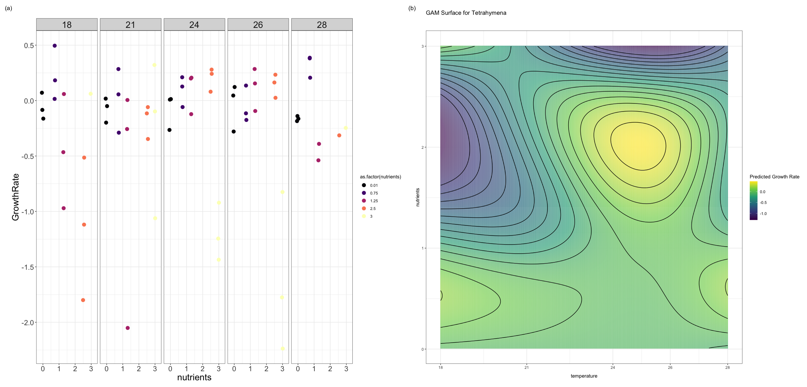
<p class="caption">(\#fig:surface_tetra)Measured density values of Tetrahymena in the different treatments (a) vs fitted surface of growth rate (b).</p>
</div>


# Response diversity with known direction of environmental change

Now we calculate RD with known direction of environmental change, i.e. the ones we are going to apply in the experiment. We are going to calculate response diversity for multiple possible ranges of temperature fluctuations.
- Create a data set with environmental conditions that we may use in the experiment and calculate RD knowing the direction of the environmental change.

- fluctuating temperature x 3 fixed nutrients = 9 treatments

## Magnitude of T change - 1
- first fluctuation ranges are going to be 18-22, 22-26, and 24 - 28. Temperature stays at the lower end of the range (i.e. 18C) for 3 days, it increases over 24h and stays at the higher end for 3 days.


<div class="figure" style="text-align: center">
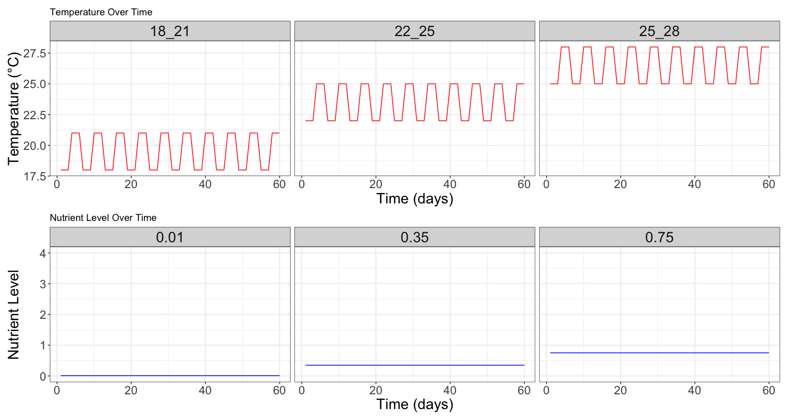
<p class="caption">(\#fig:env_sp2_t1)Time series of the environmental conditions for temperature (a) and nutrients (b). These environmental conditions represent the "treatments" and will be crossed in a full factorial design resulting in 9 unique treatments</p>
</div>


### Response diversity 2 species communities

Same steps as before:

- Create all possible communities with 2 species


- Actual RD calculation
(since temperature and nutrients are the same for 3 days in a row, the magnitude of the unit vector is zero [no direction of environmental change], so we get NAs for divergence. We replace these with zeros)


Results
  time         treatment temperature nutrients dissimilarity divergence
1    1 Tmp_18_21_Nut0.01          18      0.01             0        NaN
2    1 Tmp_18_21_Nut0.35          18      0.35             0        NaN
3    1 Tmp_18_21_Nut0.75          18      0.75             0        NaN
4    1 Tmp_22_25_Nut0.01          22      0.01             0        NaN
5    1 Tmp_22_25_Nut0.35          22      0.35             0        NaN
6    1 Tmp_22_25_Nut0.75          22      0.75             0        NaN
               species composition richness
1 Colpidium_Dexiostoma          CD        2
2 Colpidium_Dexiostoma          CD        2
3 Colpidium_Dexiostoma          CD        2
4 Colpidium_Dexiostoma          CD        2
5 Colpidium_Dexiostoma          CD        2
6 Colpidium_Dexiostoma          CD        2

<div class="figure" style="text-align: center">

<p class="caption">(\#fig:RD_2sp_t1)Response diversity calcualted as dissimilarity (a) and diversity (b) of communities composed of all possible combinations of 2 species</p>
</div>

### Response diversity 3 species communities 

- Create all possible communities with 2 species


Now, we calculate RD for all possible communities of 3 species knowing the direction of the environmental change (we created before).


  time         treatment temperature nutrients dissimilarity divergence
1    1 Tmp_18_21_Nut0.01          18      0.01             0        NaN
2    1 Tmp_18_21_Nut0.35          18      0.35             0        NaN
3    1 Tmp_18_21_Nut0.75          18      0.75             0        NaN
4    1 Tmp_22_25_Nut0.01          22      0.01             0        NaN
5    1 Tmp_22_25_Nut0.35          22      0.35             0        NaN
6    1 Tmp_22_25_Nut0.75          22      0.75             0        NaN
                            species composition richness
1 Colpidium_Dexiostoma_Loxocephalus         CDL        3
2 Colpidium_Dexiostoma_Loxocephalus         CDL        3
3 Colpidium_Dexiostoma_Loxocephalus         CDL        3
4 Colpidium_Dexiostoma_Loxocephalus         CDL        3
5 Colpidium_Dexiostoma_Loxocephalus         CDL        3
6 Colpidium_Dexiostoma_Loxocephalus         CDL        3

<div class="figure" style="text-align: center">
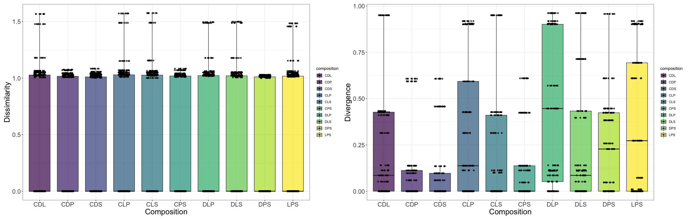
<p class="caption">(\#fig:RD_3sp_t1)Response diversity calcualted as dissimilarity (a) and diversity (b) of communities composed of all possible combinations of 3 species</p>
</div>

### Response diversity 4 species communities

Now, we calculate RD for all possible communities of 4 species knowing the direction of the environmental change (we created before).


  time         treatment temperature nutrients dissimilarity divergence
1    1 Tmp_18_21_Nut0.01          18      0.01             0        NaN
2    1 Tmp_18_21_Nut0.35          18      0.35             0        NaN
3    1 Tmp_18_21_Nut0.75          18      0.75             0        NaN
4    1 Tmp_22_25_Nut0.01          22      0.01             0        NaN
5    1 Tmp_22_25_Nut0.35          22      0.35             0        NaN
6    1 Tmp_22_25_Nut0.75          22      0.75             0        NaN
                                       species composition richness
1 Colpidium_Dexiostoma_Loxocephalus_Paramecium        CDLP        4
2 Colpidium_Dexiostoma_Loxocephalus_Paramecium        CDLP        4
3 Colpidium_Dexiostoma_Loxocephalus_Paramecium        CDLP        4
4 Colpidium_Dexiostoma_Loxocephalus_Paramecium        CDLP        4
5 Colpidium_Dexiostoma_Loxocephalus_Paramecium        CDLP        4
6 Colpidium_Dexiostoma_Loxocephalus_Paramecium        CDLP        4

<div class="figure" style="text-align: center">
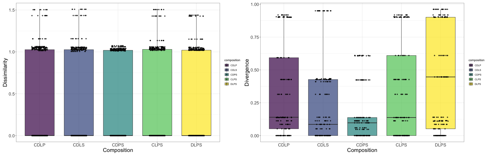
<p class="caption">(\#fig:RD_4sp_t1)Response diversity calcualted as dissimilarity (a) and diversity (b) of communities composed of all possible combinations of 4 species</p>
</div>

<div class="figure" style="text-align: center">
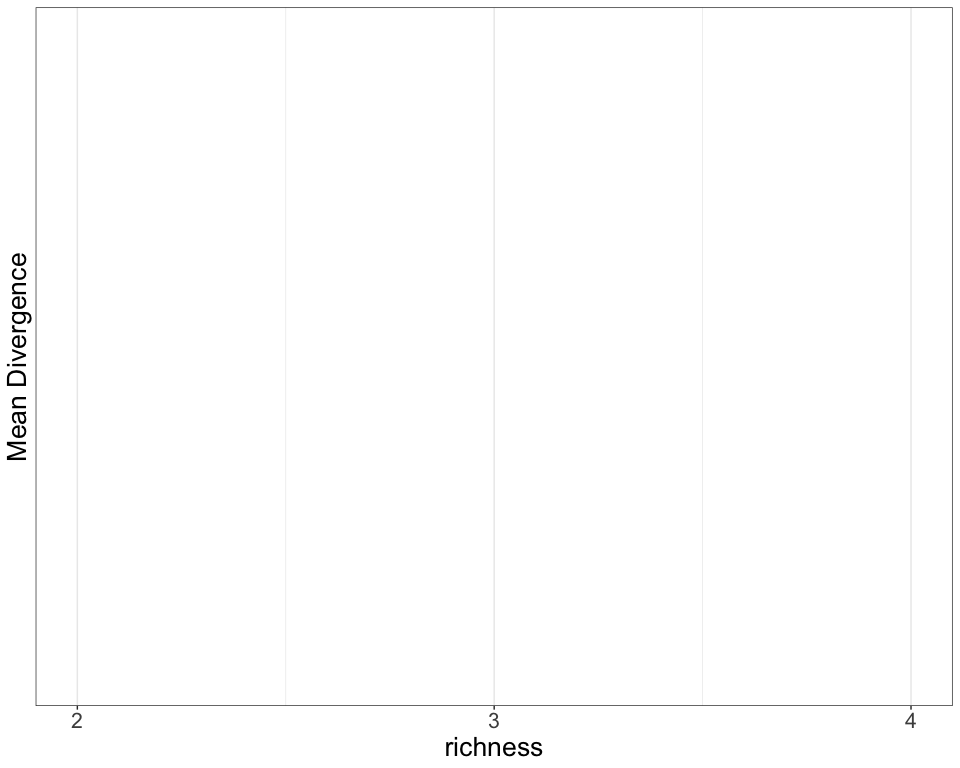
<p class="caption">(\#fig:summary_RD_t1)Summary of Response divergence measured for all possible communities of 2, 3, and 4 species with known direction of environmental change</p>
</div>

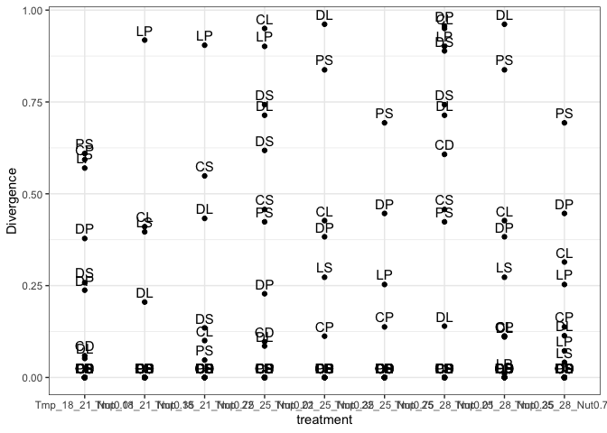<!-- -->


## Select communities


##Check divergence
###Get surface slices

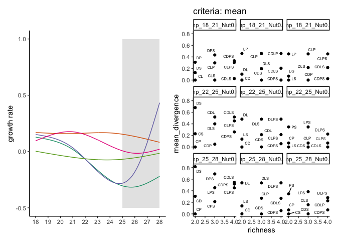<!-- -->


###Get the derivative


<!-- -->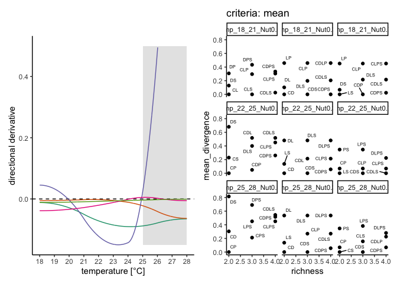<!-- -->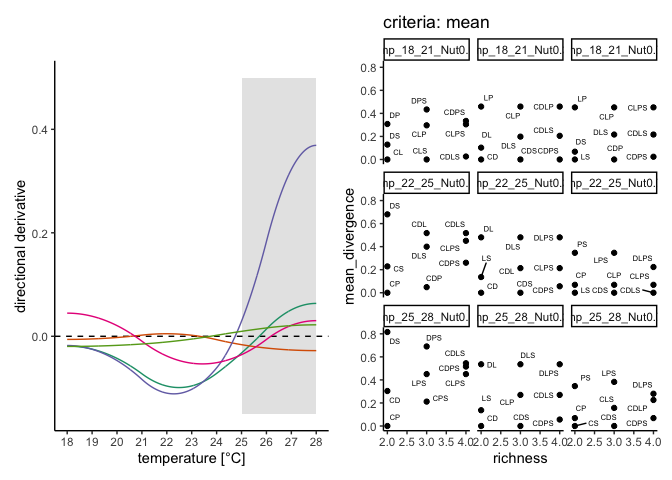<!-- -->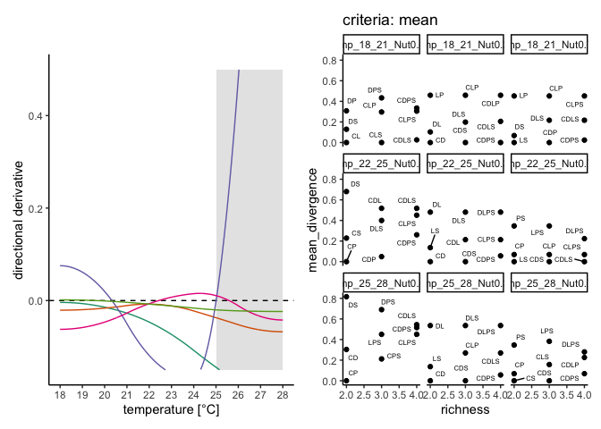<!-- -->


# Figures
## community selection


##Figure 1C


## Figure 1A 


##Figure 1B


#supplementary figure


```
##   [1]  TRUE FALSE FALSE FALSE FALSE FALSE  TRUE FALSE FALSE  TRUE FALSE FALSE
##  [13] FALSE FALSE FALSE  TRUE FALSE FALSE FALSE  TRUE FALSE FALSE FALSE  TRUE
##  [25] FALSE FALSE FALSE  TRUE FALSE FALSE FALSE FALSE FALSE  TRUE FALSE FALSE
##  [37] FALSE FALSE FALSE  TRUE FALSE FALSE  TRUE FALSE FALSE FALSE  TRUE FALSE
##  [49] FALSE FALSE  TRUE FALSE FALSE FALSE FALSE FALSE FALSE FALSE FALSE FALSE
##  [61]  TRUE FALSE FALSE FALSE FALSE FALSE  TRUE FALSE FALSE  TRUE FALSE FALSE
##  [73] FALSE  TRUE FALSE FALSE FALSE  TRUE FALSE FALSE FALSE  TRUE FALSE  TRUE
##  [85] FALSE FALSE FALSE  TRUE FALSE FALSE FALSE FALSE FALSE  TRUE FALSE FALSE
##  [97]  TRUE FALSE FALSE FALSE  TRUE FALSE FALSE FALSE  TRUE FALSE FALSE FALSE
## [109]  TRUE FALSE FALSE FALSE FALSE FALSE  TRUE FALSE FALSE  TRUE FALSE FALSE
## [121] FALSE FALSE FALSE  TRUE FALSE FALSE FALSE  TRUE FALSE FALSE FALSE FALSE
## [133] FALSE FALSE FALSE FALSE FALSE  TRUE FALSE FALSE FALSE  TRUE FALSE FALSE
## [145]  TRUE FALSE FALSE FALSE FALSE FALSE  TRUE FALSE FALSE FALSE  TRUE FALSE
## [157] FALSE FALSE FALSE FALSE FALSE FALSE  TRUE FALSE  TRUE FALSE FALSE FALSE
## [169]  TRUE FALSE FALSE FALSE FALSE FALSE FALSE FALSE FALSE  TRUE FALSE FALSE
## [181] FALSE  TRUE FALSE FALSE FALSE  TRUE FALSE FALSE FALSE  TRUE FALSE FALSE
## [193] FALSE FALSE FALSE  TRUE FALSE FALSE  TRUE FALSE FALSE FALSE FALSE FALSE
## [205]  TRUE FALSE FALSE FALSE  TRUE FALSE FALSE FALSE FALSE FALSE FALSE FALSE
## [217]  TRUE FALSE  TRUE FALSE FALSE FALSE  TRUE FALSE FALSE  TRUE FALSE FALSE
## [229] FALSE FALSE FALSE  TRUE FALSE FALSE FALSE  TRUE FALSE FALSE FALSE FALSE
## [241] FALSE FALSE FALSE
```

